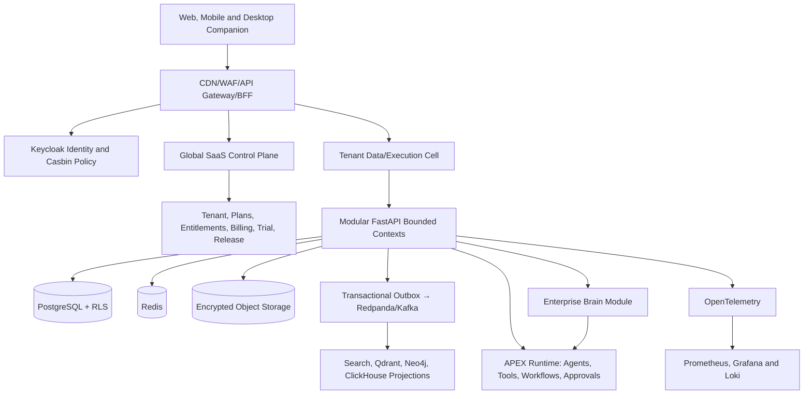

# i-Source One Complete Agent Development Specification

**Document type:** Agent-executable product, frontend, backend and API specification  
**Method:** SPARC — Specify → Plan → Act → Review → Close  
**Governance:** Maker → Checker → Reviewer → Approver  
**Version:** 2.0 — architecture-audited and agent-execution enhanced  
**Date:** 24 August 2026  
**Scope:** 53 modules across 10 capability domains

## 1. Purpose

This document turns the complete i-Source One module catalogue into implementation work packages that human and AI development agents can execute. Every module defines its product outcome, frontend, backend, API surface, SPARC execution steps and an individual Definition of Done.

i-Source One is the overarching multi-tenant enterprise intelligence platform. **Enterprise Brain is a governed module inside i-Source One**, not a separate platform. APEX is the agentic application, orchestration and governed-action plane. Role command centres, Desktop Companion, department cockpits and domain products consume shared platform capabilities.

## 2. Canonical platform hierarchy

1. **i-Source One Platform** — multi-tenant SaaS foundation and commercial control plane.
2. **Enterprise Data Fabric** — connectors, pipelines, lakehouse, catalogue, quality, lineage and master data.
3. **Enterprise Intelligence** — analytics, semantic context, knowledge, search and graph.
4. **Enterprise Brain Module** — organizational memory, governed retrieval, context, reasoning, evidence and decision intelligence.
5. **APEX Agentic Operations** — agents, skills, tools, workflows, approvals, action boundaries and assurance.
6. **Experience Layer** — command centres, dashboards, reports, inbox, meetings, alerts and Desktop Companion.
7. **Domain Products** — CFO Universe, i-Serve, i-FORS, i-NetZero, Inventra and future applications.

## 3. Golden implementation stack

- **Frontend:** React, TypeScript, Vite, Tailwind CSS, ShadCN, Storybook, TanStack Query and Playwright.
- **Backend:** Python, FastAPI, Pydantic, SQLAlchemy and Alembic; start as a modular monolith with explicit bounded contexts, then extract services only for measured scaling or isolation needs.
- **Data:** PostgreSQL as transactional authority; Redis for bounded cache/locks; encrypted S3-compatible object storage; Neo4j for knowledge-graph projections; Qdrant for vector retrieval; ClickHouse for high-volume analytical telemetry.
- **Integration and execution:** API gateway plus BFF, transactional outbox, Kafka/Redpanda-compatible events, durable workflow execution and Airbyte-compatible ingestion where suitable.
- **Identity and policy:** Keycloak for OIDC/SAML and Casbin for RBAC/ABAC; tenant, actor, device, role, entitlement and purpose form the authorization context.
- **Delivery:** GitHub, Jira and Confluence; Docker, Kubernetes/K3s, Terraform and ArgoCD; protected branches and environment promotion.
- **Operations:** OpenTelemetry, Prometheus, Grafana and Loki; PostHog for product usage and Metabase for governed operational analytics.
- **Quality/security:** pytest, Vitest, Playwright, Pact/schema tests, Trivy, Snyk, SonarQube, OWASP ZAP and Checkov.
- **Communications:** Novu with provider adapters such as SendGrid and Twilio; laptop notifications pass through Desktop Companion policy.
- **Payments:** provider abstraction over Razorpay and Stripe; platform-owned subscriptions, entitlements, invoices, internal ledger and reconciliation.

## 4. Repository and agent boundaries

```text
apps/web/                         React application shell and feature modules
apps/desktop/                     Signed Desktop Companion package
services/<module>/                FastAPI bounded contexts
packages/contracts/               OpenAPI schemas and generated clients
packages/ui/                      Shared accessible components and tokens
packages/policy/                  Authorization contracts and fixtures
packages/events/                  Versioned event envelopes and schemas
infra/                            IaC, deployment, observability and runbooks
tests/contract|e2e|isolation/     Cross-module quality gates
docs/modules/<module>/            ADRs, user/admin/API/operator documentation
```

Each Jira story is owned by one maker agent in one branch/worktree. Checker and reviewer agents must be independent of the maker. Agents may change only files in the ticket scope unless an approved architecture task explicitly spans shared packages.

## 5. Global architecture rules

1. Every request is tenant-scoped at the gateway and revalidated in the service; client-supplied tenant IDs are ignored.
2. PostgreSQL is the transactional source of truth. Search, graph, vector and analytics stores are rebuildable projections.
3. Every state-changing endpoint is idempotent and every mutable resource uses optimistic concurrency.
4. Cross-module changes publish versioned events through a transactional outbox; consumers deduplicate by event ID.
5. Secrets live in a vault and are referenced by opaque IDs. Raw credentials, card data and model secrets never enter UI state, logs or audit payloads.
6. High-impact AI or operational actions require policy evaluation and, where configured, maker-checker-reviewer approval.
7. Audit events are immutable and privacy-aware. Observability is diagnostic but must redact protected content.
8. Trial tenants are real isolated tenants with explicit entitlements and quotas; conversion changes commercial state without rebuilding the tenant.
9. APIs are versioned under `/api/v1`, documented with OpenAPI 3.1 and consumed through generated clients.
10. No module is complete until its own Definition of Done and the global release gate are satisfied.

## 6. SPARC execution protocol

| Stage | Required agent output | Exit gate |
|---|---|---|
| **Specify** | Epic/story scope, personas, acceptance criteria, data classification, permissions, SLO and traceability matrix | Product owner and architect approve unambiguous scope |
| **Plan** | Domain model, sequence/pseudocode, API contract, UI map, migrations, threat cases, test plan and rollback | Checker confirms feasibility and coverage |
| **Act** | Frontend, backend, contracts, migrations, tests, telemetry, docs and feature flag | Maker evidence bundle is complete |
| **Review** | Independent correctness, security, isolation, accessibility, performance and architecture evidence | Reviewer closes findings; approver accepts residual risk |
| **Close** | Progressive release, smoke tests, dashboards, runbooks, support handoff and Jira/Confluence links | Production verification and module DoD pass |

## 7. Shared API and event conventions

```json
{
  "data": {},
  "meta": {
    "request_id": "req_...",
    "tenant_id": "ten_...",
    "version": 3,
    "next_cursor": null
  },
  "errors": []
}
```

- Required headers: `Authorization`, `X-Request-ID`; mutations also require `Idempotency-Key`, and updates require `If-Match` or `expected_version`.
- Standard errors: `400` malformed, `401` unauthenticated, `403` policy denial, `404` hidden/not found, `409` version/state conflict, `422` domain validation, `429` quota/rate limit, `503` dependency unavailable.
- Async operations return `202` with a job resource. Jobs expose queued, running, waiting for approval, retrying, completed, partially completed, failed and cancelled states.
- Events include `event_id`, `event_type`, `schema_version`, `tenant_id`, `actor`, `resource`, `occurred_at`, `correlation_id`, `causation_id` and a minimally necessary payload.

## 8. Architecture audit and remediation summary

The version 1.0 specification had excellent breadth: all 53 modules had frontend, backend, API, SPARC and an individual Definition of Done. The audit identified that breadth alone would still leave coding agents to invent important cross-cutting decisions. Version 2.0 closes those gaps without changing the canonical 53-module catalogue.

| Audit area | Baseline finding | Version 2.0 remediation | Release status |
|---|---|---|---|
| Product hierarchy | Strong and internally consistent | Preserved i-Source One → Enterprise Brain module → APEX → experiences/products | Authoritative |
| Module completeness | 53/53 module work packages and DoDs | Added outcome stories, lifecycle, permissions, events, SLOs, failure handling and ticket slices to every module | Authoritative |
| APEX product model | Agent/workflow modules existed but product packaging was implicit | Defined Studio, Runtime, Marketplace and Control Center as deployable product views over shared modules | Authoritative |
| Process-first generation | Missing explicit path from documented/undocumented process to application | Added discovery, modelling, generation, simulation, approval and deployment lifecycle | Required |
| Agent autonomy | Policies mentioned but levels were undefined | Added L0-L5 autonomy taxonomy, action classes and mandatory human gates | Required |
| Multi-tenancy | Tenant context and RLS were strong; cell topology was implicit | Added control/data-plane cells, pooled/silo choices, residency and noisy-neighbour controls | Required |
| API/event contracts | Consistent generic endpoints; no canonical examples or event-governance lifecycle | Added command/event/error examples, compatibility policy, schema registry and replay rules | Required |
| Non-functional requirements | General SLO language but limited measurable targets | Added global and per-module availability, latency, processing, recovery and correctness objectives | Required |
| Security/Responsible AI | Strong principles but incomplete threat-control matrix | Added OWASP-aligned threats, prompt/tool/RAG controls, provenance and incident gates | Required |
| Testing | Broad test types but no portfolio-level test architecture | Added test pyramid, tenant-isolation harness, AI evaluation gates, resilience and release evidence | Required |
| Commercial/FinOps | Billing and trials were detailed; AI/agent unit economics were implicit | Added meter catalogue, budget enforcement, cost allocation, provider reconciliation and margin controls | Required |
| Operability | Observability and runbooks existed; failure-mode contracts were generic | Added module failure/recovery cases, ownership, dead-letter/replay and release guardrails | Required |

This audit is an engineering readiness assessment, not a legal compliance certification. ISO, DPDP, GDPR, PCI and industry claims require formal scope, evidence and independent assessment.

## 9. Target logical and deployment architecture



**Control plane:** identity federation, tenant directory, plans, entitlements, billing, trial, module catalogue, global policy, release control and cell placement. It stores metadata necessary to operate the SaaS but not unrestricted tenant content.

**Tenant execution cells:** one or more regional cells own tenant application data, files, events, vector/search/graph projections, agent execution and operational telemetry. A cell failure is contained; cell placement is versioned and migration is a controlled workflow.

**Deployment units:** begin with a modular FastAPI backend, React web application and isolated workers. Split a bounded context into a service only when workload, security, blast radius, ownership or independent release data justifies it. Do not create microservices merely to mirror the module list.

**Environment path:** local → ephemeral pull-request environment → integration → security/performance → staging → production pilot → progressive tenant rollout. Production and non-production use separate identity realms, networks, databases, queues, object stores, secrets and payment-provider credentials.

## 10. APEX process-first agentic application model

APEX is the future process-automation and agentic-application plane of i-Source One, not a competing standalone platform. It converts a department's documented or undocumented work into a governed application containing workflows, integrations, analytics, human employees and virtual employees.

### 10.1 Product packaging over the canonical modules

| Product view | Responsibility | Principal shared modules |
|---|---|---|
| **APEX Studio** | Discover processes; model forms, data, roles, workflows, agents, integrations, dashboards and approvals; simulate and package an application | 6, 8-13, 19-20, 25-30, 38, 42, 44, 47 |
| **APEX Runtime** | Execute durable human/agent work with identity, memory, tools, approvals, budgets, audit and recovery | 1-5, 23-30, 32-36, 38-42, 44-46 |
| **APEX Marketplace** | Curate, sign, license, install, upgrade and rate approved applications, agents, skills, connectors, templates and domain packs | 6-7, 12, 19, 27-28, 46-48, 50, 52 |
| **APEX Control Center** | Operate tenants, policies, models, agents, executions, costs, risks, evaluations, releases and incidents | 2, 4-7, 25, 27, 29-30, 38-43, 47, 49-50, 53 |
| **Enterprise Brain Module** | Supply governed context, organizational memory, evidence, reasoning and decision intelligence to all APEX views | 19-24 plus governed projections from data modules |

These are product/deployment views, not additional catalogue modules. Shared services retain one source of truth and one contract.

### 10.2 Process-to-application generation lifecycle

1. **Discover:** accept SOPs, policies, forms, emails, chat/call/meeting evidence, screen walkthroughs, event logs and interviews. Obtain consent and redact unnecessary sensitive content.
2. **Observe and infer:** identify actors, steps, decisions, data, exceptions, systems, controls, handoffs, cycle time and undocumented variants. Label inferred facts and confidence; never present inference as approved process truth.
3. **Model:** create BPMN-compatible workflow, human/virtual roles, RACI, forms, entities, integration contracts, KPIs, SLAs, risks and approval gates.
4. **Generate:** produce a versioned application manifest, React surfaces, FastAPI contracts, workflow definitions, agent specifications, prompts, tool grants, analytics, policies, tests, seed data and deployment configuration.
5. **Simulate:** run golden paths, exceptions, policy denials, adversarial inputs, load, cost and failure scenarios against synthetic or masked data.
6. **Review:** process owner verifies business truth; security/privacy/AI assurance verify controls; maker-checker-reviewer-approver evidence is retained.
7. **Deploy:** sign the package, install it to entitled tenants behind a feature flag and migrate configuration safely.
8. **Operate and learn:** monitor outcomes, cost, overrides, exceptions and drift. Proposed process changes return to Studio as a new version; runtime never silently rewrites approved process policy.

### 10.3 Agent specification and runtime contract

Every agent version must declare: owner and supervisor; purpose and prohibited uses; tenant/persona scope; model route; prompts; input/output schemas; knowledge sources; memory policy; tools and parameter constraints; autonomy level; budgets; timeout/retry; approvals; evaluation suite; SLO; version; rollback; data classification; retention; and incident contact.

Runtime sequence: authenticate agent identity → authorize trigger → load minimum context → plan within policy → validate tool arguments → request human gate where required → execute through provider adapter → verify side effect → record evidence and cost → evaluate outcome → update only approved memory.

Tool interoperability may use MCP, OpenAPI, A2A/FIPA-style envelopes or signed webhooks through adapters. Protocol compatibility never grants authority: every invocation still requires tenant, identity, scope, purpose, tool policy and parameter validation.

### 10.4 Autonomy and action classes

| Level | Agent authority | Production use |
|---|---|---|
| **L0 — Observe** | Search, summarize and explain with citations | Default for new knowledge agents |
| **L1 — Recommend** | Draft decisions, messages, forms or plans | Human chooses whether to act |
| **L2 — Prepare** | Populate transactions and stage side effects | Named human approves before execution |
| **L3 — Bounded execute** | Execute reversible, low-impact actions within explicit limits | Continuous monitoring and exception gate |
| **L4 — Orchestrate** | Coordinate multiple agents and humans across a bounded workflow | Process-owner approval, budgets and kill switch required |
| **L5 — Autonomous optimize** | Change tactics within a pre-approved reversible sandbox | Prohibited for irreversible, regulated, financial, employment, privacy or security-impacting production decisions |

Action classes are: informational; communicative; data mutation; operational; financial; contractual/legal; identity/security; privacy; and physical/safety. Policy maps action class, amount/scope, reversibility, confidence and risk to the required approval chain.

### 10.5 Memory and knowledge safety

- Working memory expires with the run unless explicitly promoted. Episodic, factual, procedural and decision memory require provenance, classification, owner and retention.
- Retrieval filters authorization before ranking. The system must not retrieve restricted content and then attempt to redact it after model generation.
- Answers expose citations, freshness, confidence, conflicting evidence and abstention. Unsupported claims are removed or marked as hypotheses.
- Memory correction creates a new version and links the superseded assertion; legal hold and audit evidence remain intact.
- Agent outcome feedback is separated from human-approved knowledge. Automated learning cannot silently alter protected policies, prompts, tools or workflows.

## 11. Multi-tenancy, residency and isolation model

| Isolation tier | Data pattern | Intended use | Mandatory controls |
|---|---|---|---|
| **Pooled** | Shared cell and schema with `tenant_id` plus PostgreSQL RLS | Standard SaaS tenants and trials | RLS, repository predicates, tenant-keyed cache/events/storage, isolation tests and quotas |
| **Dedicated schema/database** | Shared services with tenant-specific schema or database | Higher scale or contractual isolation | Dedicated credentials, migration orchestration, per-tenant backup and cost attribution |
| **Dedicated cell** | Tenant-specific execution/data cell | Regulated, residency-sensitive or high-volume tenant | Network, compute, data, keys, deployment and operations isolation |

Tenant placement policy considers region, residency, encryption key ownership, contractual tier, capacity and risk. All derived stores carry tenant scope. Object keys, cache keys, event partitions, search collections, graph labels and vector namespaces are tenant-safe by construction.

Noisy-neighbour controls include per-tenant concurrency, API/token/agent/tool/pipeline quotas, queue fairness, query timeouts, storage limits, circuit breakers and workload-priority classes. Platform support access is time-bound, purpose-bound, approved, visible to the tenant where required and fully audited.

## 12. Security, privacy and Responsible AI control model

| Threat | Preventive controls | Detective/recovery controls |
|---|---|---|
| Cross-tenant access | Gateway tenant binding, RLS, scoped repositories, namespace-safe projections | Automated isolation harness, audit correlation and emergency tenant suspension |
| Broken authorization/SoD | Keycloak identity, Casbin RBAC/ABAC, purpose/action policy, approval separation | Access simulation, certification, privilege-change alerts and trace review |
| Prompt injection and indirect injection | Trust-labelled context, instruction/data separation, content filtering, tool allowlists, argument schema validation | Injection evaluation suite, anomalous tool-call alert, run termination and evidence quarantine |
| Tool misuse or excessive agency | Agent identity, least privilege, autonomy level, budgets, action limits, approval and kill switch | Outcome verification, side-effect reconciliation, override analytics and run replay |
| Data leakage/model retention | Redaction, approved model routes, provider zero-retention/private controls, encryption and field masking | DLP findings, egress audit, canary detection and provider incident procedure |
| Supply-chain compromise | Signed packages, SBOM, pinned dependencies, provenance, image and IaC scanning | Deployment attestation, runtime detection, rapid rollback and key rotation |
| Webhook/replay fraud | Signature verification, timestamp window, nonce/event ledger and idempotency | Reconciliation, replay alerts, quarantine and provider backfill |
| Sensitive desktop capture | Explicit user consent, application allowlist, local encryption, minimal collection and pause control | Device health, remote revocation, privacy audit and cache expiry verification |

Data is classified Public, Internal, Confidential, Restricted or Regulated. Each classification defines allowed stores/models/regions, encryption, masking, sharing, retention, export and deletion. Privacy purpose and consent are evaluated at collection and use, not only at display.

AI releases require groundedness, relevance, citation accuracy, leakage, bias, toxicity, prompt-injection, tool-misuse and action-correctness evaluation. High-impact use cases require documented human oversight, explanation, contestability, incident response and periodic drift review.

## 13. Enterprise data, knowledge and integration governance

- **Transactional authority:** source systems or module PostgreSQL stores remain authoritative. Lakehouse, search, graph, vector and analytics stores are versioned projections with lineage.
- **Lakehouse:** Bronze retains controlled raw history; Silver standardizes and resolves; Gold publishes governed data products. Each dataset has owner, contract, quality SLO, classification, retention and lineage.
- **Contracts:** schema registry enforces backward/forward compatibility; producers cannot publish breaking schema changes without versioning and consumer migration evidence.
- **Quality:** critical data elements have completeness, validity, timeliness, uniqueness and reconciliation thresholds. Failed data is quarantined before it influences Brain or agent decisions.
- **Knowledge ingestion:** malware scan → OCR/extraction → classification/redaction → entity resolution → human validation where confidence is low → approval → indexing.
- **Deletion:** erase authoritative content and rebuildable projections according to retention and legal hold; tombstone events prevent deleted data from being recreated by lagging consumers.
- **Integration:** prefer APIs/events/CDC before fragile UI automation. Screen automation is isolated, observable, version-pinned and human-supervised.

## 14. Platform non-functional requirements

| Quality attribute | Platform baseline |
|---|---|
| Availability | 99.9% monthly for standard control/data plane; 99.95% for identity, audit and billing control paths |
| Performance | p95 read API ≤ 500 ms and mutation acknowledgement ≤ 1 s for normal interactive operations; long-running work returns `202` |
| Scalability | Horizontal stateless API/workers; tenant quotas and fair queues; capacity tests at 2× forecast peak and largest supported tenant |
| Durability | Accepted material mutations and audit/outbox records are transactionally durable; no silent loss on worker restart |
| Recovery | Default RPO ≤ 15 minutes/RTO ≤ 60 minutes; identity, billing and audit target RPO ≤ 5 minutes/RTO ≤ 30 minutes |
| Security | No open critical/high exploitable finding at release; secrets rotated; signed artifacts and SBOM retained |
| Accessibility | WCAG 2.2 AA for web; equivalent keyboard, focus, contrast and announcement controls in Desktop Companion |
| Localization | Unicode, locale/time-zone/currency aware; no business calculation depends on browser locale |
| Observability | 100% material requests have request/correlation ID; critical flows trace browser → API → event/job → provider |
| Cost | Per-tenant storage, compute, model tokens, agent runs, tool calls, connector transfer and notification cost is attributable |

Per-module SLOs in the implementation contracts refine these baselines. SLOs must have named owners, measurement windows, exclusions, error budgets and customer-facing SLA mapping.

## 15. API, event and package governance

**Command request example**

```json
{
  "data": {
    "resource_id": "agt_01J...",
    "action": "run",
    "expected_version": 7,
    "input": {"objective": "Prepare the weekly operating review"},
    "approval_context": {"policy_id": "pol_agent_ops", "reason": "Scheduled review"}
  }
}
```

**Accepted command response**

```json
{
  "data": {"job_id": "job_01J...", "status": "queued", "resource_version": 8},
  "meta": {"request_id": "req_01J...", "tenant_id": "ten_01J...", "version": 8, "next_cursor": null},
  "errors": []
}
```

**Versioned event example**

```json
{
  "event_id": "evt_01J...",
  "event_type": "isource.agents.run-completed.v1",
  "schema_version": 1,
  "tenant_id": "ten_01J...",
  "actor": {"type": "agent", "id": "agt_01J...", "on_behalf_of": "usr_01J..."},
  "resource": {"type": "agent_run", "id": "run_01J...", "version": 4},
  "occurred_at": "2026-08-24T12:30:00Z",
  "correlation_id": "cor_01J...",
  "causation_id": "cmd_01J...",
  "data": {"outcome": "succeeded", "evidence_ids": ["evd_01J..."]}
}
```

APIs follow additive evolution within `v1`; removing/renaming fields or changing meaning requires `v2`. Deprecation publishes usage, migration guide, sunset date and tenant communication. Packages installed through APEX Marketplace contain a signed manifest, SBOM, permissions, data classes, dependencies, migrations, tests, pricing/entitlements, compatibility range and uninstall/rollback behavior.

## 16. Test, evaluation and release evidence architecture

| Layer | Mandatory scope |
|---|---|
| Static | Type/lint, secret scan, dependency/container/IaC scan, license policy and SBOM |
| Unit/domain | Invariants, calculations, state transitions, policy functions, redaction and deterministic prompt/tool parsers |
| Integration | PostgreSQL/RLS, Redis, object storage, event outbox, provider adapters, migrations and failure recovery |
| Contract | OpenAPI request/response, generated clients, event schema compatibility, webhook signatures and provider fixtures |
| Tenant isolation | Cross-tenant IDs, search/vector/graph namespaces, cache, exports, background jobs, logs and support impersonation |
| E2E | Critical persona journeys, approvals, trial/upgrade, billing, degraded mode, accessibility and browser/device coverage |
| Performance/resilience | Load, soak, spike, queue fairness, chaos dependency loss, restart, replay, backup/restore and failover |
| AI/agent | Golden datasets, groundedness/citations, prompt injection, leakage, tool misuse, autonomy, action correctness, cost and human acceptance |

Test data uses synthetic or approved masked fixtures and deterministic clocks/IDs. Every release packet links requirements to test cases and immutable results. Flaky tests are quarantined only with an owner, expiry and compensating manual gate; they cannot silently become optional.

## 17. Commercial SaaS, metering and FinOps model

Entitlements are evaluated independently from billing-provider status. Stripe and Razorpay events update the internal commercial ledger through verified, idempotent reconciliation; they never directly grant authorization without platform validation.

Meter catalogue: named users, active users, storage GB-month, retained events, connector records/bytes, pipeline compute, search/Brain queries, model input/output tokens, agent runs/minutes, tool calls, workflow steps, document pages/minutes, notifications and premium support. Each meter defines unit, aggregation, deduplication key, late-arrival window, correction process, price mapping and tenant-visible evidence.

Budgets operate at tenant, department, application, agent, workflow and model-route levels. Soft limits warn and recommend; hard limits stop only according to policy and must not leave partial side effects. Cost dashboards show provider cost, allocated platform cost, billed usage, gross margin, anomaly and forecast.

Trial conversion atomically preserves tenant ID, users, approved data/configuration, workflows, knowledge and audit while replacing trial entitlements with paid entitlements. Expiry pauses connectors, schedules and new AI execution, applies grace/read-only policy, offers allowed export, and deletes according to retention and consent.

## 18. Delivery sequence and dependency gates

| Wave | Scope | Exit gate before next wave |
|---|---|---|
| **P0 — Secure SaaS foundation** | 1-7, 36, 38-41, 43-47 | Tenant isolation, IAM, policy, audit, telemetry, API, files, notifications and release evidence proven |
| **P1 — Data and knowledge** | 12-23 | Governed connector-to-knowledge path with quality, lineage, privacy, provenance and recovery proven |
| **P2 — Brain and APEX runtime** | 24-30, 42 | Cited Brain answers; policy-bound agent/tool/workflow execution; approvals and AI release gates proven |
| **P3 — User and department experience** | 8-11, 31-35, 37, 51 | Role/persona journeys, Desktop Companion privacy, accessibility and end-to-end business outcomes proven |
| **P4 — Commercial product scale** | 48-50, 52-53 | Support, continuity, Stripe/Razorpay reconciliation, trial conversion and product packaging proven |

Parallel work is allowed behind stable contracts, but a later wave cannot declare production readiness while its prerequisite gate is open. Each wave uses internal → design partner → limited availability → general availability rollout with explicit adoption, reliability, cost and risk success criteria.

## 19. Complete module register

| ID | Module | Domain | Priority |
|---:|---|---|---|
| 01 | Authentication and Identity | A — SaaS Foundation | P0 |
| 02 | Tenant Management | A — SaaS Foundation | P0 |
| 03 | Organization Management | A — SaaS Foundation | P0 |
| 04 | User Management | A — SaaS Foundation | P0 |
| 05 | Roles, Personas and Groups | A — SaaS Foundation | P0 |
| 06 | Application Management | A — SaaS Foundation | P0 |
| 07 | Subscription, Plans and Entitlements | A — SaaS Foundation | P0 |
| 08 | Dashboard Management | B — Dashboards, Reports and Performance | P3 |
| 09 | Report Management | B — Dashboards, Reports and Performance | P3 |
| 10 | KPI, KRA and Performance Management | B — Dashboards, Reports and Performance | P3 |
| 11 | Analytics and Scenario Management | B — Dashboards, Reports and Performance | P3 |
| 12 | Source and Connector Management | C — Enterprise Data Foundation | P1 |
| 13 | Data Pipeline Management | C — Enterprise Data Foundation | P1 |
| 14 | Lakehouse Management | C — Enterprise Data Foundation | P1 |
| 15 | Data Catalogue | C — Enterprise Data Foundation | P1 |
| 16 | Data Quality | C — Enterprise Data Foundation | P1 |
| 17 | Data Lineage | C — Enterprise Data Foundation | P1 |
| 18 | Master and Reference Data | C — Enterprise Data Foundation | P1 |
| 19 | Knowledge Base Management | D — Knowledge and Enterprise Memory | P1 |
| 20 | Document Intelligence | D — Knowledge and Enterprise Memory | P1 |
| 21 | Enterprise Search and Knowledge Explorer | D — Knowledge and Enterprise Memory | P1 |
| 22 | Knowledge Graph | D — Knowledge and Enterprise Memory | P1 |
| 23 | Organizational Memory | D — Knowledge and Enterprise Memory | P1 |
| 24 | Enterprise Brain Module | E — Enterprise Intelligence and Agentic Operations | P2 |
| 25 | AI Gateway and Model Management | E — Enterprise Intelligence and Agentic Operations | P2 |
| 26 | Prompt Management | E — Enterprise Intelligence and Agentic Operations | P2 |
| 27 | Agent Management | E — Enterprise Intelligence and Agentic Operations | P2 |
| 28 | Skills and Tool Management | E — Enterprise Intelligence and Agentic Operations | P2 |
| 29 | Workflow and Orchestration | E — Enterprise Intelligence and Agentic Operations | P2 |
| 30 | Human Approval Management | E — Enterprise Intelligence and Agentic Operations | P2 |
| 31 | Role Command Centre | F — User Work and Command Centres | P3 |
| 32 | Unified Inbox | F — User Work and Command Centres | P3 |
| 33 | Meeting Intelligence | F — User Work and Command Centres | P3 |
| 34 | Action and Commitment Management | F — User Work and Command Centres | P3 |
| 35 | Project and Portfolio Management | F — User Work and Command Centres | P3 |
| 36 | Notifications and Alert Intelligence | F — User Work and Command Centres | P3 |
| 37 | Desktop Companion | F — User Work and Command Centres | P3 |
| 38 | Policy Management | G — Governance, Security and Operations | P0/P2 |
| 39 | Privacy and Consent | G — Governance, Security and Operations | P0/P2 |
| 40 | Audit Trail | G — Governance, Security and Operations | P0/P2 |
| 41 | Observability | G — Governance, Security and Operations | P0/P2 |
| 42 | AI Evaluation and Assurance | G — Governance, Security and Operations | P0/P2 |
| 43 | Platform Administration | H — Platform Administration and Engineering | P0/P4 |
| 44 | Developer and API Management | H — Platform Administration and Engineering | P0/P4 |
| 45 | File and Media Management | H — Platform Administration and Engineering | P0/P4 |
| 46 | Notification Template Management | H — Platform Administration and Engineering | P0/P4 |
| 47 | Feature Flag and Release Management | H — Platform Administration and Engineering | P0/P4 |
| 48 | Support and Feedback | H — Platform Administration and Engineering | P0/P4 |
| 49 | Backup, Recovery and Continuity | H — Platform Administration and Engineering | P0/P4 |
| 50 | Billing, Payments and Revenue Management | H — Platform Administration and Engineering | P0/P4 |
| 51 | Department Cockpits | I — Domain Experiences and Products | P3/P4 |
| 52 | Product Applications | I — Domain Experiences and Products | P3/P4 |
| 53 | Trial, Evaluation and Conversion Management | J — Trial, Evaluation and Conversion | P4 |

## 20. Module implementation specifications

# A. SaaS Foundation


## Module 01 — Authentication and Identity

**Catalogue domain:** A. SaaS Foundation  
**Delivery priority:** P0  
**Owning domain:** Platform Foundation  
**Primary personas:** Platform administrator; tenant administrator; security administrator; application owner  
**Dependencies:** Platform shell, PostgreSQL, Redis, Keycloak, Casbin, audit and observability foundations

### Purpose and outcome

Secure access for humans, services, devices and agents. The module succeeds when authorized users can complete the governed lifecycle end to end, understand status and evidence, and recover safely from failures without bypassing tenant, privacy or approval controls.

### Scope and functional requirements

- Support OIDC/SAML SSO, MFA and passwordless login.
- Separate human, service, device and agent identities.
- Revoke sessions within the configured security SLA.
- Support Login and logout.
- Support password recovery.
- Support passwordless access.
- Support Microsoft and Google SSO.
- Support SAML/OIDC.
- Support MFA.
- Support session and device management.
- Support account lockout.
- Support login history.
- Support audited impersonation.
- Support service accounts.
- Support agent identities.
- Store and expose tenant-scoped configuration, policy bindings, lifecycle state, ownership and immutable audit records.
- Support draft, validation, approved/published or active, suspended/failed and archived states where applicable.
- Enforce tenant context, entitlements, RBAC/ABAC policy and field-level masking on every read and mutation.
- Produce immutable domain and audit events for material state changes.

**Out of scope:** bypassing source-system authority, storing provider secrets in the client, silent cross-tenant sharing, irreversible autonomous action without policy, and unversioned production changes.

### Frontend specification

**Routes**

- `/app/identity` — catalogue or operational overview
- `/app/identity/new` — permission-gated creation wizard
- `/app/identity/:id` — details, activity and related evidence
- `/app/identity/:id/edit` — version-aware configuration editor
- `/app/identity/:id/audit` — immutable history and trace view

**Primary screens:** Login, MFA, SSO, sessions, devices, identity providers, login history.

**Component contract**

- `ModuleHeader`: title, lifecycle badge, owner, environment, version and permitted actions.
- `FilterBar` and `DataGrid`: server-side filters, saved views, cursor pagination, bulk selection and accessible keyboard controls.
- `DetailPanel`: summary, configuration, dependencies, activity, evidence and audit tabs.
- `ActionPanel`: policy explanation, impact preview, maker/checker gate, confirmation and resulting job status.
- `HealthCard`: freshness, SLO, last successful operation, quota/usage and remediation link.
- Use React + TypeScript + Vite, Tailwind, ShadCN and Storybook; use TanStack Query for server state and typed route loaders for access checks.

**Mandatory UI states**

- Loading skeleton, first-use empty state, no-results state, partial-data warning, stale-data warning, validation failure, access restricted, quota/entitlement blocked, offline/degraded and retryable/non-retryable error.
- Destructive or high-impact actions show affected records, approval requirement and rollback/compensation behavior before confirmation.
- Every async command exposes queued, running, waiting-for-approval, succeeded, partially-succeeded, failed, cancelled and retry states where relevant.
- Meet WCAG 2.2 AA for focus order, contrast, labels, keyboard navigation, status announcements and reduced motion.

### Backend specification

**Service boundary:** a FastAPI bounded context owns `identity` commands, queries, validation and lifecycle rules. It stores authoritative Identity, Credential, Session records in PostgreSQL and emits integration events through the transactional outbox. Large binaries remain in encrypted object storage; graph, vector, search or analytical projections are derived stores, never the sole system of record.

**Core entities:** `Identity`, `Credential`, `Session`, `Device`, `IdentityProvider`, `ServiceAccount`.

**Required backend layers**

- FastAPI router and Pydantic request/response schemas; application command/query handlers; domain model and policy rules; repositories; provider adapters; background jobs; outbox/event consumers.
- Inject `tenant_id`, `actor_id`, `request_id`, `correlation_id`, locale and entitlement snapshot from verified gateway claims; never trust client-supplied tenant identity.
- Use PostgreSQL row-level security plus repository tenant predicates. Encrypt sensitive columns and use vault references for credentials.
- Use Redis only for bounded caches, rate limits and locks with tenant-prefixed keys; cache invalidation follows committed domain events.
- Emit OpenTelemetry spans, RED/USE metrics, structured redacted logs, business counters, cost/usage meters and append-only audit events.
- Background execution is retry-safe, idempotent and resumable; failed work enters a visible remediation or dead-letter queue.

### API specification

| Method | Endpoint | Responsibility | Authorization | Idempotency |
|---|---|---|---|---|
| GET | `/api/v1/identity` | List/search authorized resources with cursor pagination | Bearer + tenant scope | No |
| POST | `/api/v1/identity` | Create a draft resource after policy validation | Create permission | Required |
| GET | `/api/v1/identity/{id}` | Read resource, version, permissions and links | Read permission | No |
| PATCH | `/api/v1/identity/{id}` | Update using optimistic concurrency | Edit permission | Required |
| POST | `/api/v1/identity/{id}/actions/revoke-sessions` | Execute `revoke-sessions` through a governed command | Action-specific policy | Required |
| GET | `/api/v1/identity/{id}/audit` | Return scoped lifecycle and decision evidence | Audit/read permission | No |

**Contract rules**

- JSON responses use `{ data, meta: { request_id, tenant_id, version, next_cursor }, errors: [] }`; errors use stable codes, safe detail and a traceable request ID.
- Mutations require `Idempotency-Key`; updates require `If-Match` or `expected_version`; conflicts return `409`, validation `422`, policy denial `403`, missing entitlement `402/403` with upgrade metadata, and throttling `429` with retry guidance.
- Publish OpenAPI 3.1 and generate TypeScript/Python clients in CI. Breaking changes require a new API version and migration plan.
- Domain events follow `isource.identity.<event>.v1` and contain event, tenant, actor, resource, correlation, causation, schema version and occurred-at fields.

### Agent-ready implementation contract

**Outcome stories**

- As a platform administrator, I want to authenticate principal, evaluate access policy, create an auditable session, so that the business outcome is achieved with visible evidence and controlled risk.
- As a tenant administrator, I want to configure ownership, entitlements, quotas, policies and lifecycle behavior for Authentication and Identity, so that each department receives only approved capability.
- As an auditor or operational owner, I want to reconstruct every material decision and failure from correlated evidence, so that compliance, support and recovery do not depend on developer access.

**Lifecycle state machine:** `Draft → Validating → Active → Suspended|Degraded → Restored → Archived`. State transitions are server-authoritative, policy-checked, versioned and recorded in audit. Invalid transitions return a stable `409 INVALID_STATE_TRANSITION` response and do not emit completion events.

**Permission model**

| Permission | Allows | Explicitly does not allow |
|---|---|---|
| `identity:read` | View authorized records and safe metadata | Secret values, masked fields or other tenants |
| `identity:create` | Create a tenant-scoped draft | Publish, execute or approve it |
| `identity:update` | Edit an allowed draft/version | Bypass optimistic concurrency or policy |
| `identity:revoke-sessions` | Request the governed primary command | Self-approve when segregation is required |
| `identity:approve` | Approve within assigned authority | Alter the maker's submitted evidence |
| `identity:admin` | Configure module-level policy and quotas | Disable platform audit, privacy or isolation controls |
| `identity:audit:read` | Read scoped evidence and traces | Read protected payload content without purpose authorization |

**Event catalogue**

- Emits: `isource.identity.created.v1`, `isource.identity.updated.v1`, `isource.identity.revoke-sessions-requested.v1`, `isource.identity.revoke-sessions-completed.v1`, `isource.identity.operation-failed.v1`.
- Consumes: `isource.tenant.entitlements-changed.v1`, `isource.identity.access-changed.v1`, `isource.policy.published.v1`.
- Consumers must be idempotent, tolerate duplication and ordering gaps, quarantine schema-invalid events, and expose replay checkpoints. Personally identifiable or secret data is excluded unless the event contract explicitly classifies and encrypts it.

**Initial production SLO objectives**

| Measure | Target | Evidence |
|---|---|---|
| Availability | 99.9% monthly availability | Synthetic checks and SLI dashboard |
| Interactive latency | p95 read ≤ 500 ms and mutation acknowledgement ≤ 1 s | Server and browser p50/p95/p99 |
| Processing | 99% asynchronous commands accepted ≤ 3 s | Queue age, start lag and completion metrics |
| Recovery | RPO ≤ 15 min; RTO ≤ 60 min | Backup/restore and failover drill |
| Correctness | ≥ 99.5% successful eligible operations; 100% audit durability for accepted material mutations | Business outcome and audit reconciliation |

The targets are release baselines. Product and SRE owners may tighten them by plan or criticality, but weakening them requires an approved ADR and customer-impact assessment.

**Failure and recovery cases**

- Dependency unavailable: apply bounded timeout/circuit breaker, preserve idempotency, queue only when policy permits, and show degraded status with retry guidance.
- Partial completion: record completed and uncompensated steps separately; run compensation or require an explicit human resolution task.
- Concurrency conflict: reject stale writes, return the current version and support a user-visible compare/reapply flow.
- Authorization or entitlement change during execution: re-evaluate before every material side effect and stop safely when authority is lost.
- Poison message or invalid projection: quarantine with tenant-safe diagnostics, alert the owner, preserve checkpoint and permit controlled replay.
- Data retention or legal hold conflict: prefer legal hold, block deletion, record policy basis and notify the privacy owner.

**Agent ticket slices and dependencies**

1. `ISO-01-CONTRACT` — domain glossary, states, permissions, OpenAPI/event schemas and architecture decision records.
2. `ISO-01-DATA` — migrations, tenant/RLS policies, repositories, seed fixtures, retention and recovery.
3. `ISO-01-BE` — commands, queries, policy enforcement, outbox, jobs and provider adapters.
4. `ISO-01-FE` — routes, components, accessibility, error states, analytics and typed client integration.
5. `ISO-01-QA` — unit/integration/contract/E2E/isolation/performance/recovery and abuse test packs.
6. `ISO-01-OPS` — dashboards, SLO alerts, runbooks, deployment flag, migration and rollback evidence.

Contract and threat-model tickets must close before implementation tickets merge. Backend contract stubs may unblock frontend work; production rollout waits for QA and OPS gates.


### SPARC agent work package

#### S — Specify

- Convert this module scope into a Jira epic with stories for Login, MFA, SSO, sessions, devices, identity providers, login history, domain services, APIs, policy checks, telemetry and documentation.
- Write Given/When/Then acceptance criteria for happy path, denial, quota, validation, concurrency, dependency outage and recovery.
- Confirm data classification, residency, retention, ownership, SoD/approval policy, trial behavior and measurable SLOs before implementation.
- Produce a traceability matrix linking each requirement to UI, endpoint, domain rule, test and evidence artifact.

#### P — Plan

1. Resolve verified tenant, actor, role, entitlements and policy context for `Authentication and Identity`.
2. Model Identity, Credential, Session, Device, lifecycle transitions, invariants and compensating actions.
3. Implement the primary flow: authenticate principal, evaluate access policy, create an auditable session.
4. Persist the state change and outbox event in one transaction; update read projections asynchronously.
5. Return a stable resource or job representation; surface progress, evidence and remediation in the UI.
6. Add contract, unit, integration, end-to-end, isolation, security, performance and recovery tests before release review.

#### A — Act

- Frontend agent implements routes, components, typed API client, all UI states, Storybook cases and Playwright journeys under `apps/web/src/modules/identity`.
- Backend agent implements domain/application/infrastructure layers under `services/identity`, Alembic migrations, outbox events and background jobs.
- Contract agent publishes `/api/v1/identity` OpenAPI schemas, examples, error codes, permissions and generated clients.
- Security agent adds Casbin/Keycloak policy fixtures, tenant-isolation tests, threat cases, secret handling and log-redaction assertions.
- QA agent builds deterministic fixtures and test matrices; documentation agent adds operator, admin, user and recovery runbooks.

#### R — Review

- Maker self-review: lint, types, unit tests, migrations, local smoke test and requirement traceability.
- Checker review: API/schema compatibility, negative paths, concurrency/idempotency, cross-tenant denial, accessibility and performance budgets.
- Reviewer review: architecture boundary, data ownership, security/privacy, operability, trial behavior and product acceptance.
- Approver gate: feature-audit packet, unresolved-risk disposition, rollback evidence and production readiness sign-off.
- Refinement loop returns failed findings to the responsible agent with exact evidence; only the failing scope is changed and all affected tests rerun.

#### C — Close

- Merge only after protected-branch checks and checker/reviewer/approver evidence pass.
- Deploy behind a default-off feature flag, run migrations and smoke tests, then progressively enable internal, pilot and tenant cohorts.
- Monitor SLOs, error rate, latency, saturation, cost, business outcome and support signals; rollback automatically when guardrails breach.
- Close Jira only after documentation, release notes, ownership, dashboards, alerts, runbooks and post-release verification are linked.

### Module-specific Definition of Done

The **Authentication and Identity** work package is done only when every item below has objective evidence:

- [ ] All listed capabilities and the primary flow—authenticate principal, evaluate access policy, create an auditable session—pass approved Given/When/Then acceptance tests.
- [ ] All primary screens (Login, MFA, SSO, sessions, devices, identity providers, login history) and mandatory loading, empty, error, denied, quota and degraded states are implemented and accessibility-tested.
- [ ] `identity` APIs match OpenAPI 3.1, generated clients compile, examples pass contract tests, and idempotency/concurrency behavior is proven.
- [ ] The `Draft → Validating → Active → Suspended|Degraded → Restored → Archived` lifecycle and every `identity:*` permission are covered by positive, negative and invalid-transition tests.
- [ ] Emitted and consumed event contracts pass schema, duplication, ordering-gap, replay and protected-data tests; consumer lag and dead-letter alerts are operational.
- [ ] The module meets its initial availability, latency, processing, correctness and recovery SLOs under representative tenant load.
- [ ] Identity, Credential, Session, Device, IdentityProvider, ServiceAccount schemas, migrations, tenant predicates, retention rules and rollback/forward-fix procedures are reviewed.
- [ ] Cross-tenant, horizontal/vertical privilege escalation, injection, secret leakage, unsafe logging and abuse-rate tests pass with no open critical/high finding.
- [ ] Unit, integration, consumer-contract and critical Playwright journeys pass; agreed coverage thresholds and performance budgets are met.
- [ ] OpenTelemetry traces connect browser, API, job and provider calls; dashboards, actionable alerts, SLOs and operator runbooks work in a failure drill.
- [ ] Every material mutation appears in immutable audit with tenant, actor, policy decision, before/after reference, correlation ID and evidence link.
- [ ] Trial behavior is verified: Required during trial; business-email verification, MFA policy and abuse controls remain enforced.
- [ ] Maker, independent checker, reviewer and approver have signed the feature-audit packet; no unresolved blocking acceptance or architecture finding remains.
- [ ] Feature flag, progressive rollout, rollback/compensation, release notes, user/admin/API documentation, ownership and support handoff are complete.


## Module 02 — Tenant Management

**Catalogue domain:** A. SaaS Foundation  
**Delivery priority:** P0  
**Owning domain:** Platform Foundation  
**Primary personas:** Platform administrator; tenant administrator; security administrator; application owner  
**Dependencies:** Platform shell, PostgreSQL, Redis, Keycloak, Casbin, audit and observability foundations

### Purpose and outcome

Customer-level SaaS isolation and lifecycle administration. The module succeeds when authorized users can complete the governed lifecycle end to end, understand status and evidence, and recover safely from failures without bypassing tenant, privacy or approval controls.

### Scope and functional requirements

- Provision and deprovision tenant resources through repeatable jobs.
- Prove tenant isolation through automated negative tests.
- Support region, branding, domain, quota and entitlement configuration.
- Support Tenant create, activate, suspend, archive and delete.
- Support trial and sandbox tenants.
- Support branding.
- Support custom domains.
- Support data residency.
- Support encryption settings.
- Support administrators.
- Support module entitlements.
- Support quotas.
- Support usage.
- Support isolation health.
- Support export and migration.
- Store and expose tenant-scoped configuration, policy bindings, lifecycle state, ownership and immutable audit records.
- Support draft, validation, approved/published or active, suspended/failed and archived states where applicable.
- Enforce tenant context, entitlements, RBAC/ABAC policy and field-level masking on every read and mutation.
- Produce immutable domain and audit events for material state changes.

**Out of scope:** bypassing source-system authority, storing provider secrets in the client, silent cross-tenant sharing, irreversible autonomous action without policy, and unversioned production changes.

### Frontend specification

**Routes**

- `/app/tenants` — catalogue or operational overview
- `/app/tenants/new` — permission-gated creation wizard
- `/app/tenants/:id` — details, activity and related evidence
- `/app/tenants/:id/edit` — version-aware configuration editor
- `/app/tenants/:id/audit` — immutable history and trace view

**Primary screens:** Tenant directory, create wizard, details, entitlements, quotas, security, health, billing.

**Component contract**

- `ModuleHeader`: title, lifecycle badge, owner, environment, version and permitted actions.
- `FilterBar` and `DataGrid`: server-side filters, saved views, cursor pagination, bulk selection and accessible keyboard controls.
- `DetailPanel`: summary, configuration, dependencies, activity, evidence and audit tabs.
- `ActionPanel`: policy explanation, impact preview, maker/checker gate, confirmation and resulting job status.
- `HealthCard`: freshness, SLO, last successful operation, quota/usage and remediation link.
- Use React + TypeScript + Vite, Tailwind, ShadCN and Storybook; use TanStack Query for server state and typed route loaders for access checks.

**Mandatory UI states**

- Loading skeleton, first-use empty state, no-results state, partial-data warning, stale-data warning, validation failure, access restricted, quota/entitlement blocked, offline/degraded and retryable/non-retryable error.
- Destructive or high-impact actions show affected records, approval requirement and rollback/compensation behavior before confirmation.
- Every async command exposes queued, running, waiting-for-approval, succeeded, partially-succeeded, failed, cancelled and retry states where relevant.
- Meet WCAG 2.2 AA for focus order, contrast, labels, keyboard navigation, status announcements and reduced motion.

### Backend specification

**Service boundary:** a FastAPI bounded context owns `tenants` commands, queries, validation and lifecycle rules. It stores authoritative Tenant, TenantRegion, TenantBranding records in PostgreSQL and emits integration events through the transactional outbox. Large binaries remain in encrypted object storage; graph, vector, search or analytical projections are derived stores, never the sole system of record.

**Core entities:** `Tenant`, `TenantRegion`, `TenantBranding`, `TenantQuota`, `TenantEntitlement`, `IsolationCheck`.

**Required backend layers**

- FastAPI router and Pydantic request/response schemas; application command/query handlers; domain model and policy rules; repositories; provider adapters; background jobs; outbox/event consumers.
- Inject `tenant_id`, `actor_id`, `request_id`, `correlation_id`, locale and entitlement snapshot from verified gateway claims; never trust client-supplied tenant identity.
- Use PostgreSQL row-level security plus repository tenant predicates. Encrypt sensitive columns and use vault references for credentials.
- Use Redis only for bounded caches, rate limits and locks with tenant-prefixed keys; cache invalidation follows committed domain events.
- Emit OpenTelemetry spans, RED/USE metrics, structured redacted logs, business counters, cost/usage meters and append-only audit events.
- Background execution is retry-safe, idempotent and resumable; failed work enters a visible remediation or dead-letter queue.

### API specification

| Method | Endpoint | Responsibility | Authorization | Idempotency |
|---|---|---|---|---|
| GET | `/api/v1/tenants` | List/search authorized resources with cursor pagination | Bearer + tenant scope | No |
| POST | `/api/v1/tenants` | Create a draft resource after policy validation | Create permission | Required |
| GET | `/api/v1/tenants/{id}` | Read resource, version, permissions and links | Read permission | No |
| PATCH | `/api/v1/tenants/{id}` | Update using optimistic concurrency | Edit permission | Required |
| POST | `/api/v1/tenants/{id}/actions/provision` | Execute `provision` through a governed command | Action-specific policy | Required |
| GET | `/api/v1/tenants/{id}/audit` | Return scoped lifecycle and decision evidence | Audit/read permission | No |

**Contract rules**

- JSON responses use `{ data, meta: { request_id, tenant_id, version, next_cursor }, errors: [] }`; errors use stable codes, safe detail and a traceable request ID.
- Mutations require `Idempotency-Key`; updates require `If-Match` or `expected_version`; conflicts return `409`, validation `422`, policy denial `403`, missing entitlement `402/403` with upgrade metadata, and throttling `429` with retry guidance.
- Publish OpenAPI 3.1 and generate TypeScript/Python clients in CI. Breaking changes require a new API version and migration plan.
- Domain events follow `isource.tenants.<event>.v1` and contain event, tenant, actor, resource, correlation, causation, schema version and occurred-at fields.

### Agent-ready implementation contract

**Outcome stories**

- As a platform administrator, I want to validate tenant request, provision isolated resources, apply entitlements, verify isolation, so that the business outcome is achieved with visible evidence and controlled risk.
- As a tenant administrator, I want to configure ownership, entitlements, quotas, policies and lifecycle behavior for Tenant Management, so that each department receives only approved capability.
- As an auditor or operational owner, I want to reconstruct every material decision and failure from correlated evidence, so that compliance, support and recovery do not depend on developer access.

**Lifecycle state machine:** `Draft → Validating → Active → Suspended|Degraded → Restored → Archived`. State transitions are server-authoritative, policy-checked, versioned and recorded in audit. Invalid transitions return a stable `409 INVALID_STATE_TRANSITION` response and do not emit completion events.

**Permission model**

| Permission | Allows | Explicitly does not allow |
|---|---|---|
| `tenants:read` | View authorized records and safe metadata | Secret values, masked fields or other tenants |
| `tenants:create` | Create a tenant-scoped draft | Publish, execute or approve it |
| `tenants:update` | Edit an allowed draft/version | Bypass optimistic concurrency or policy |
| `tenants:provision` | Request the governed primary command | Self-approve when segregation is required |
| `tenants:approve` | Approve within assigned authority | Alter the maker's submitted evidence |
| `tenants:admin` | Configure module-level policy and quotas | Disable platform audit, privacy or isolation controls |
| `tenants:audit:read` | Read scoped evidence and traces | Read protected payload content without purpose authorization |

**Event catalogue**

- Emits: `isource.tenants.created.v1`, `isource.tenants.updated.v1`, `isource.tenants.provision-requested.v1`, `isource.tenants.provision-completed.v1`, `isource.tenants.operation-failed.v1`.
- Consumes: `isource.tenant.entitlements-changed.v1`, `isource.identity.access-changed.v1`, `isource.policy.published.v1`.
- Consumers must be idempotent, tolerate duplication and ordering gaps, quarantine schema-invalid events, and expose replay checkpoints. Personally identifiable or secret data is excluded unless the event contract explicitly classifies and encrypts it.

**Initial production SLO objectives**

| Measure | Target | Evidence |
|---|---|---|
| Availability | 99.9% monthly availability | Synthetic checks and SLI dashboard |
| Interactive latency | p95 read ≤ 500 ms and mutation acknowledgement ≤ 1 s | Server and browser p50/p95/p99 |
| Processing | 99% asynchronous commands accepted ≤ 3 s | Queue age, start lag and completion metrics |
| Recovery | RPO ≤ 15 min; RTO ≤ 60 min | Backup/restore and failover drill |
| Correctness | ≥ 99.5% successful eligible operations; 100% audit durability for accepted material mutations | Business outcome and audit reconciliation |

The targets are release baselines. Product and SRE owners may tighten them by plan or criticality, but weakening them requires an approved ADR and customer-impact assessment.

**Failure and recovery cases**

- Dependency unavailable: apply bounded timeout/circuit breaker, preserve idempotency, queue only when policy permits, and show degraded status with retry guidance.
- Partial completion: record completed and uncompensated steps separately; run compensation or require an explicit human resolution task.
- Concurrency conflict: reject stale writes, return the current version and support a user-visible compare/reapply flow.
- Authorization or entitlement change during execution: re-evaluate before every material side effect and stop safely when authority is lost.
- Poison message or invalid projection: quarantine with tenant-safe diagnostics, alert the owner, preserve checkpoint and permit controlled replay.
- Data retention or legal hold conflict: prefer legal hold, block deletion, record policy basis and notify the privacy owner.

**Agent ticket slices and dependencies**

1. `ISO-02-CONTRACT` — domain glossary, states, permissions, OpenAPI/event schemas and architecture decision records.
2. `ISO-02-DATA` — migrations, tenant/RLS policies, repositories, seed fixtures, retention and recovery.
3. `ISO-02-BE` — commands, queries, policy enforcement, outbox, jobs and provider adapters.
4. `ISO-02-FE` — routes, components, accessibility, error states, analytics and typed client integration.
5. `ISO-02-QA` — unit/integration/contract/E2E/isolation/performance/recovery and abuse test packs.
6. `ISO-02-OPS` — dashboards, SLO alerts, runbooks, deployment flag, migration and rollback evidence.

Contract and threat-model tickets must close before implementation tickets merge. Backend contract stubs may unblock frontend work; production rollout waits for QA and OPS gates.


### SPARC agent work package

#### S — Specify

- Convert this module scope into a Jira epic with stories for Tenant directory, create wizard, details, entitlements, quotas, security, health, billing, domain services, APIs, policy checks, telemetry and documentation.
- Write Given/When/Then acceptance criteria for happy path, denial, quota, validation, concurrency, dependency outage and recovery.
- Confirm data classification, residency, retention, ownership, SoD/approval policy, trial behavior and measurable SLOs before implementation.
- Produce a traceability matrix linking each requirement to UI, endpoint, domain rule, test and evidence artifact.

#### P — Plan

1. Resolve verified tenant, actor, role, entitlements and policy context for `Tenant Management`.
2. Model Tenant, TenantRegion, TenantBranding, TenantQuota, lifecycle transitions, invariants and compensating actions.
3. Implement the primary flow: validate tenant request, provision isolated resources, apply entitlements, verify isolation.
4. Persist the state change and outbox event in one transaction; update read projections asynchronously.
5. Return a stable resource or job representation; surface progress, evidence and remediation in the UI.
6. Add contract, unit, integration, end-to-end, isolation, security, performance and recovery tests before release review.

#### A — Act

- Frontend agent implements routes, components, typed API client, all UI states, Storybook cases and Playwright journeys under `apps/web/src/modules/tenants`.
- Backend agent implements domain/application/infrastructure layers under `services/tenants`, Alembic migrations, outbox events and background jobs.
- Contract agent publishes `/api/v1/tenants` OpenAPI schemas, examples, error codes, permissions and generated clients.
- Security agent adds Casbin/Keycloak policy fixtures, tenant-isolation tests, threat cases, secret handling and log-redaction assertions.
- QA agent builds deterministic fixtures and test matrices; documentation agent adds operator, admin, user and recovery runbooks.

#### R — Review

- Maker self-review: lint, types, unit tests, migrations, local smoke test and requirement traceability.
- Checker review: API/schema compatibility, negative paths, concurrency/idempotency, cross-tenant denial, accessibility and performance budgets.
- Reviewer review: architecture boundary, data ownership, security/privacy, operability, trial behavior and product acceptance.
- Approver gate: feature-audit packet, unresolved-risk disposition, rollback evidence and production readiness sign-off.
- Refinement loop returns failed findings to the responsible agent with exact evidence; only the failing scope is changed and all affected tests rerun.

#### C — Close

- Merge only after protected-branch checks and checker/reviewer/approver evidence pass.
- Deploy behind a default-off feature flag, run migrations and smoke tests, then progressively enable internal, pilot and tenant cohorts.
- Monitor SLOs, error rate, latency, saturation, cost, business outcome and support signals; rollback automatically when guardrails breach.
- Close Jira only after documentation, release notes, ownership, dashboards, alerts, runbooks and post-release verification are linked.

### Module-specific Definition of Done

The **Tenant Management** work package is done only when every item below has objective evidence:

- [ ] All listed capabilities and the primary flow—validate tenant request, provision isolated resources, apply entitlements, verify isolation—pass approved Given/When/Then acceptance tests.
- [ ] All primary screens (Tenant directory, create wizard, details, entitlements, quotas, security, health, billing) and mandatory loading, empty, error, denied, quota and degraded states are implemented and accessibility-tested.
- [ ] `tenants` APIs match OpenAPI 3.1, generated clients compile, examples pass contract tests, and idempotency/concurrency behavior is proven.
- [ ] The `Draft → Validating → Active → Suspended|Degraded → Restored → Archived` lifecycle and every `tenants:*` permission are covered by positive, negative and invalid-transition tests.
- [ ] Emitted and consumed event contracts pass schema, duplication, ordering-gap, replay and protected-data tests; consumer lag and dead-letter alerts are operational.
- [ ] The module meets its initial availability, latency, processing, correctness and recovery SLOs under representative tenant load.
- [ ] Tenant, TenantRegion, TenantBranding, TenantQuota, TenantEntitlement, IsolationCheck schemas, migrations, tenant predicates, retention rules and rollback/forward-fix procedures are reviewed.
- [ ] Cross-tenant, horizontal/vertical privilege escalation, injection, secret leakage, unsafe logging and abuse-rate tests pass with no open critical/high finding.
- [ ] Unit, integration, consumer-contract and critical Playwright journeys pass; agreed coverage thresholds and performance budgets are met.
- [ ] OpenTelemetry traces connect browser, API, job and provider calls; dashboards, actionable alerts, SLOs and operator runbooks work in a failure drill.
- [ ] Every material mutation appears in immutable audit with tenant, actor, policy decision, before/after reference, correlation ID and evidence link.
- [ ] Trial behavior is verified: Owns the isolated trial-tenant lifecycle and must never weaken tenant separation.
- [ ] Maker, independent checker, reviewer and approver have signed the feature-audit packet; no unresolved blocking acceptance or architecture finding remains.
- [ ] Feature flag, progressive rollout, rollback/compensation, release notes, user/admin/API documentation, ownership and support handoff are complete.


## Module 03 — Organization Management

**Catalogue domain:** A. SaaS Foundation  
**Delivery priority:** P0  
**Owning domain:** Platform Foundation  
**Primary personas:** Platform administrator; tenant administrator; security administrator; application owner  
**Dependencies:** Platform shell, PostgreSQL, Redis, Keycloak, Casbin, audit and observability foundations

### Purpose and outcome

Internal enterprise structure within each tenant. The module succeeds when authorized users can complete the governed lifecycle end to end, understand status and evidence, and recover safely from failures without bypassing tenant, privacy or approval controls.

### Scope and functional requirements

- Support Organizations.
- Support subsidiaries.
- Support legal entities.
- Support business units.
- Support departments.
- Support locations.
- Support cost centres.
- Support reporting hierarchies.
- Support teams.
- Support projects.
- Support committees.
- Support ownership.
- Support department systems and data domains.
- Store and expose tenant-scoped configuration, policy bindings, lifecycle state, ownership and immutable audit records.
- Support draft, validation, approved/published or active, suspended/failed and archived states where applicable.
- Enforce tenant context, entitlements, RBAC/ABAC policy and field-level masking on every read and mutation.
- Produce immutable domain and audit events for material state changes.

**Out of scope:** bypassing source-system authority, storing provider secrets in the client, silent cross-tenant sharing, irreversible autonomous action without policy, and unversioned production changes.

### Frontend specification

**Routes**

- `/app/organizations` — catalogue or operational overview
- `/app/organizations/new` — permission-gated creation wizard
- `/app/organizations/:id` — details, activity and related evidence
- `/app/organizations/:id/edit` — version-aware configuration editor
- `/app/organizations/:id/audit` — immutable history and trace view

**Primary screens:** Organization tree, entity directory, departments, locations, cost centres, structure import.

**Component contract**

- `ModuleHeader`: title, lifecycle badge, owner, environment, version and permitted actions.
- `FilterBar` and `DataGrid`: server-side filters, saved views, cursor pagination, bulk selection and accessible keyboard controls.
- `DetailPanel`: summary, configuration, dependencies, activity, evidence and audit tabs.
- `ActionPanel`: policy explanation, impact preview, maker/checker gate, confirmation and resulting job status.
- `HealthCard`: freshness, SLO, last successful operation, quota/usage and remediation link.
- Use React + TypeScript + Vite, Tailwind, ShadCN and Storybook; use TanStack Query for server state and typed route loaders for access checks.

**Mandatory UI states**

- Loading skeleton, first-use empty state, no-results state, partial-data warning, stale-data warning, validation failure, access restricted, quota/entitlement blocked, offline/degraded and retryable/non-retryable error.
- Destructive or high-impact actions show affected records, approval requirement and rollback/compensation behavior before confirmation.
- Every async command exposes queued, running, waiting-for-approval, succeeded, partially-succeeded, failed, cancelled and retry states where relevant.
- Meet WCAG 2.2 AA for focus order, contrast, labels, keyboard navigation, status announcements and reduced motion.

### Backend specification

**Service boundary:** a FastAPI bounded context owns `organizations` commands, queries, validation and lifecycle rules. It stores authoritative Organization, LegalEntity, BusinessUnit records in PostgreSQL and emits integration events through the transactional outbox. Large binaries remain in encrypted object storage; graph, vector, search or analytical projections are derived stores, never the sole system of record.

**Core entities:** `Organization`, `LegalEntity`, `BusinessUnit`, `Department`, `Location`, `CostCentre`.

**Required backend layers**

- FastAPI router and Pydantic request/response schemas; application command/query handlers; domain model and policy rules; repositories; provider adapters; background jobs; outbox/event consumers.
- Inject `tenant_id`, `actor_id`, `request_id`, `correlation_id`, locale and entitlement snapshot from verified gateway claims; never trust client-supplied tenant identity.
- Use PostgreSQL row-level security plus repository tenant predicates. Encrypt sensitive columns and use vault references for credentials.
- Use Redis only for bounded caches, rate limits and locks with tenant-prefixed keys; cache invalidation follows committed domain events.
- Emit OpenTelemetry spans, RED/USE metrics, structured redacted logs, business counters, cost/usage meters and append-only audit events.
- Background execution is retry-safe, idempotent and resumable; failed work enters a visible remediation or dead-letter queue.

### API specification

| Method | Endpoint | Responsibility | Authorization | Idempotency |
|---|---|---|---|---|
| GET | `/api/v1/organizations` | List/search authorized resources with cursor pagination | Bearer + tenant scope | No |
| POST | `/api/v1/organizations` | Create a draft resource after policy validation | Create permission | Required |
| GET | `/api/v1/organizations/{id}` | Read resource, version, permissions and links | Read permission | No |
| PATCH | `/api/v1/organizations/{id}` | Update using optimistic concurrency | Edit permission | Required |
| POST | `/api/v1/organizations/{id}/actions/submit` | Execute `submit` through a governed command | Action-specific policy | Required |
| GET | `/api/v1/organizations/{id}/audit` | Return scoped lifecycle and decision evidence | Audit/read permission | No |

**Contract rules**

- JSON responses use `{ data, meta: { request_id, tenant_id, version, next_cursor }, errors: [] }`; errors use stable codes, safe detail and a traceable request ID.
- Mutations require `Idempotency-Key`; updates require `If-Match` or `expected_version`; conflicts return `409`, validation `422`, policy denial `403`, missing entitlement `402/403` with upgrade metadata, and throttling `429` with retry guidance.
- Publish OpenAPI 3.1 and generate TypeScript/Python clients in CI. Breaking changes require a new API version and migration plan.
- Domain events follow `isource.organizations.<event>.v1` and contain event, tenant, actor, resource, correlation, causation, schema version and occurred-at fields.

### Agent-ready implementation contract

**Outcome stories**

- As a platform administrator, I want to validate hierarchy, persist organization nodes, rebuild paths, publish structure changes, so that the business outcome is achieved with visible evidence and controlled risk.
- As a tenant administrator, I want to configure ownership, entitlements, quotas, policies and lifecycle behavior for Organization Management, so that each department receives only approved capability.
- As an auditor or operational owner, I want to reconstruct every material decision and failure from correlated evidence, so that compliance, support and recovery do not depend on developer access.

**Lifecycle state machine:** `Draft → Validating → Active → Suspended|Degraded → Restored → Archived`. State transitions are server-authoritative, policy-checked, versioned and recorded in audit. Invalid transitions return a stable `409 INVALID_STATE_TRANSITION` response and do not emit completion events.

**Permission model**

| Permission | Allows | Explicitly does not allow |
|---|---|---|
| `organizations:read` | View authorized records and safe metadata | Secret values, masked fields or other tenants |
| `organizations:create` | Create a tenant-scoped draft | Publish, execute or approve it |
| `organizations:update` | Edit an allowed draft/version | Bypass optimistic concurrency or policy |
| `organizations:submit` | Request the governed primary command | Self-approve when segregation is required |
| `organizations:approve` | Approve within assigned authority | Alter the maker's submitted evidence |
| `organizations:admin` | Configure module-level policy and quotas | Disable platform audit, privacy or isolation controls |
| `organizations:audit:read` | Read scoped evidence and traces | Read protected payload content without purpose authorization |

**Event catalogue**

- Emits: `isource.organizations.created.v1`, `isource.organizations.updated.v1`, `isource.organizations.submit-requested.v1`, `isource.organizations.submit-completed.v1`, `isource.organizations.operation-failed.v1`.
- Consumes: `isource.tenant.entitlements-changed.v1`, `isource.identity.access-changed.v1`, `isource.policy.published.v1`.
- Consumers must be idempotent, tolerate duplication and ordering gaps, quarantine schema-invalid events, and expose replay checkpoints. Personally identifiable or secret data is excluded unless the event contract explicitly classifies and encrypts it.

**Initial production SLO objectives**

| Measure | Target | Evidence |
|---|---|---|
| Availability | 99.9% monthly availability | Synthetic checks and SLI dashboard |
| Interactive latency | p95 read ≤ 500 ms and mutation acknowledgement ≤ 1 s | Server and browser p50/p95/p99 |
| Processing | 99% asynchronous commands accepted ≤ 3 s | Queue age, start lag and completion metrics |
| Recovery | RPO ≤ 15 min; RTO ≤ 60 min | Backup/restore and failover drill |
| Correctness | ≥ 99.5% successful eligible operations; 100% audit durability for accepted material mutations | Business outcome and audit reconciliation |

The targets are release baselines. Product and SRE owners may tighten them by plan or criticality, but weakening them requires an approved ADR and customer-impact assessment.

**Failure and recovery cases**

- Dependency unavailable: apply bounded timeout/circuit breaker, preserve idempotency, queue only when policy permits, and show degraded status with retry guidance.
- Partial completion: record completed and uncompensated steps separately; run compensation or require an explicit human resolution task.
- Concurrency conflict: reject stale writes, return the current version and support a user-visible compare/reapply flow.
- Authorization or entitlement change during execution: re-evaluate before every material side effect and stop safely when authority is lost.
- Poison message or invalid projection: quarantine with tenant-safe diagnostics, alert the owner, preserve checkpoint and permit controlled replay.
- Data retention or legal hold conflict: prefer legal hold, block deletion, record policy basis and notify the privacy owner.

**Agent ticket slices and dependencies**

1. `ISO-03-CONTRACT` — domain glossary, states, permissions, OpenAPI/event schemas and architecture decision records.
2. `ISO-03-DATA` — migrations, tenant/RLS policies, repositories, seed fixtures, retention and recovery.
3. `ISO-03-BE` — commands, queries, policy enforcement, outbox, jobs and provider adapters.
4. `ISO-03-FE` — routes, components, accessibility, error states, analytics and typed client integration.
5. `ISO-03-QA` — unit/integration/contract/E2E/isolation/performance/recovery and abuse test packs.
6. `ISO-03-OPS` — dashboards, SLO alerts, runbooks, deployment flag, migration and rollback evidence.

Contract and threat-model tickets must close before implementation tickets merge. Backend contract stubs may unblock frontend work; production rollout waits for QA and OPS gates.


### SPARC agent work package

#### S — Specify

- Convert this module scope into a Jira epic with stories for Organization tree, entity directory, departments, locations, cost centres, structure import, domain services, APIs, policy checks, telemetry and documentation.
- Write Given/When/Then acceptance criteria for happy path, denial, quota, validation, concurrency, dependency outage and recovery.
- Confirm data classification, residency, retention, ownership, SoD/approval policy, trial behavior and measurable SLOs before implementation.
- Produce a traceability matrix linking each requirement to UI, endpoint, domain rule, test and evidence artifact.

#### P — Plan

1. Resolve verified tenant, actor, role, entitlements and policy context for `Organization Management`.
2. Model Organization, LegalEntity, BusinessUnit, Department, lifecycle transitions, invariants and compensating actions.
3. Implement the primary flow: validate hierarchy, persist organization nodes, rebuild paths, publish structure changes.
4. Persist the state change and outbox event in one transaction; update read projections asynchronously.
5. Return a stable resource or job representation; surface progress, evidence and remediation in the UI.
6. Add contract, unit, integration, end-to-end, isolation, security, performance and recovery tests before release review.

#### A — Act

- Frontend agent implements routes, components, typed API client, all UI states, Storybook cases and Playwright journeys under `apps/web/src/modules/organizations`.
- Backend agent implements domain/application/infrastructure layers under `services/organizations`, Alembic migrations, outbox events and background jobs.
- Contract agent publishes `/api/v1/organizations` OpenAPI schemas, examples, error codes, permissions and generated clients.
- Security agent adds Casbin/Keycloak policy fixtures, tenant-isolation tests, threat cases, secret handling and log-redaction assertions.
- QA agent builds deterministic fixtures and test matrices; documentation agent adds operator, admin, user and recovery runbooks.

#### R — Review

- Maker self-review: lint, types, unit tests, migrations, local smoke test and requirement traceability.
- Checker review: API/schema compatibility, negative paths, concurrency/idempotency, cross-tenant denial, accessibility and performance budgets.
- Reviewer review: architecture boundary, data ownership, security/privacy, operability, trial behavior and product acceptance.
- Approver gate: feature-audit packet, unresolved-risk disposition, rollback evidence and production readiness sign-off.
- Refinement loop returns failed findings to the responsible agent with exact evidence; only the failing scope is changed and all affected tests rerun.

#### C — Close

- Merge only after protected-branch checks and checker/reviewer/approver evidence pass.
- Deploy behind a default-off feature flag, run migrations and smoke tests, then progressively enable internal, pilot and tenant cohorts.
- Monitor SLOs, error rate, latency, saturation, cost, business outcome and support signals; rollback automatically when guardrails breach.
- Close Jira only after documentation, release notes, ownership, dashboards, alerts, runbooks and post-release verification are linked.

### Module-specific Definition of Done

The **Organization Management** work package is done only when every item below has objective evidence:

- [ ] All listed capabilities and the primary flow—validate hierarchy, persist organization nodes, rebuild paths, publish structure changes—pass approved Given/When/Then acceptance tests.
- [ ] All primary screens (Organization tree, entity directory, departments, locations, cost centres, structure import) and mandatory loading, empty, error, denied, quota and degraded states are implemented and accessibility-tested.
- [ ] `organizations` APIs match OpenAPI 3.1, generated clients compile, examples pass contract tests, and idempotency/concurrency behavior is proven.
- [ ] The `Draft → Validating → Active → Suspended|Degraded → Restored → Archived` lifecycle and every `organizations:*` permission are covered by positive, negative and invalid-transition tests.
- [ ] Emitted and consumed event contracts pass schema, duplication, ordering-gap, replay and protected-data tests; consumer lag and dead-letter alerts are operational.
- [ ] The module meets its initial availability, latency, processing, correctness and recovery SLOs under representative tenant load.
- [ ] Organization, LegalEntity, BusinessUnit, Department, Location, CostCentre schemas, migrations, tenant predicates, retention rules and rollback/forward-fix procedures are reviewed.
- [ ] Cross-tenant, horizontal/vertical privilege escalation, injection, secret leakage, unsafe logging and abuse-rate tests pass with no open critical/high finding.
- [ ] Unit, integration, consumer-contract and critical Playwright journeys pass; agreed coverage thresholds and performance budgets are met.
- [ ] OpenTelemetry traces connect browser, API, job and provider calls; dashboards, actionable alerts, SLOs and operator runbooks work in a failure drill.
- [ ] Every material mutation appears in immutable audit with tenant, actor, policy decision, before/after reference, correlation ID and evidence link.
- [ ] Trial behavior is verified: Available according to the trial plan; mutations and consumption are quota-controlled, premium actions may require upgrade, and expiry preserves configuration while disabling new execution.
- [ ] Maker, independent checker, reviewer and approver have signed the feature-audit packet; no unresolved blocking acceptance or architecture finding remains.
- [ ] Feature flag, progressive rollout, rollback/compensation, release notes, user/admin/API documentation, ownership and support handoff are complete.


## Module 04 — User Management

**Catalogue domain:** A. SaaS Foundation  
**Delivery priority:** P0  
**Owning domain:** Platform Foundation  
**Primary personas:** Platform administrator; tenant administrator; security administrator; application owner  
**Dependencies:** Platform shell, PostgreSQL, Redis, Keycloak, Casbin, audit and observability foundations

### Purpose and outcome

Complete joiner, mover and leaver lifecycle. The module succeeds when authorized users can complete the governed lifecycle end to end, understand status and evidence, and recover safely from failures without bypassing tenant, privacy or approval controls.

### Scope and functional requirements

- Support Users.
- Support invitations.
- Support bulk import.
- Support profiles.
- Support employment details.
- Support department and manager assignment.
- Support roles.
- Support groups.
- Support application, cockpit, agent and data access.
- Support preferences.
- Support delegation.
- Support temporary access.
- Support access certification.
- Support suspension and archival.
- Store and expose tenant-scoped configuration, policy bindings, lifecycle state, ownership and immutable audit records.
- Support draft, validation, approved/published or active, suspended/failed and archived states where applicable.
- Enforce tenant context, entitlements, RBAC/ABAC policy and field-level masking on every read and mutation.
- Produce immutable domain and audit events for material state changes.

**Out of scope:** bypassing source-system authority, storing provider secrets in the client, silent cross-tenant sharing, irreversible autonomous action without policy, and unversioned production changes.

### Frontend specification

**Routes**

- `/app/users` — catalogue or operational overview
- `/app/users/new` — permission-gated creation wizard
- `/app/users/:id` — details, activity and related evidence
- `/app/users/:id/edit` — version-aware configuration editor
- `/app/users/:id/audit` — immutable history and trace view

**Primary screens:** User directory, profile, invitations, import, access summary, sessions, access reviews.

**Component contract**

- `ModuleHeader`: title, lifecycle badge, owner, environment, version and permitted actions.
- `FilterBar` and `DataGrid`: server-side filters, saved views, cursor pagination, bulk selection and accessible keyboard controls.
- `DetailPanel`: summary, configuration, dependencies, activity, evidence and audit tabs.
- `ActionPanel`: policy explanation, impact preview, maker/checker gate, confirmation and resulting job status.
- `HealthCard`: freshness, SLO, last successful operation, quota/usage and remediation link.
- Use React + TypeScript + Vite, Tailwind, ShadCN and Storybook; use TanStack Query for server state and typed route loaders for access checks.

**Mandatory UI states**

- Loading skeleton, first-use empty state, no-results state, partial-data warning, stale-data warning, validation failure, access restricted, quota/entitlement blocked, offline/degraded and retryable/non-retryable error.
- Destructive or high-impact actions show affected records, approval requirement and rollback/compensation behavior before confirmation.
- Every async command exposes queued, running, waiting-for-approval, succeeded, partially-succeeded, failed, cancelled and retry states where relevant.
- Meet WCAG 2.2 AA for focus order, contrast, labels, keyboard navigation, status announcements and reduced motion.

### Backend specification

**Service boundary:** a FastAPI bounded context owns `users` commands, queries, validation and lifecycle rules. It stores authoritative User, EmploymentProfile, Membership records in PostgreSQL and emits integration events through the transactional outbox. Large binaries remain in encrypted object storage; graph, vector, search or analytical projections are derived stores, never the sole system of record.

**Core entities:** `User`, `EmploymentProfile`, `Membership`, `Delegation`, `AccessGrant`, `AccessReview`.

**Required backend layers**

- FastAPI router and Pydantic request/response schemas; application command/query handlers; domain model and policy rules; repositories; provider adapters; background jobs; outbox/event consumers.
- Inject `tenant_id`, `actor_id`, `request_id`, `correlation_id`, locale and entitlement snapshot from verified gateway claims; never trust client-supplied tenant identity.
- Use PostgreSQL row-level security plus repository tenant predicates. Encrypt sensitive columns and use vault references for credentials.
- Use Redis only for bounded caches, rate limits and locks with tenant-prefixed keys; cache invalidation follows committed domain events.
- Emit OpenTelemetry spans, RED/USE metrics, structured redacted logs, business counters, cost/usage meters and append-only audit events.
- Background execution is retry-safe, idempotent and resumable; failed work enters a visible remediation or dead-letter queue.

### API specification

| Method | Endpoint | Responsibility | Authorization | Idempotency |
|---|---|---|---|---|
| GET | `/api/v1/users` | List/search authorized resources with cursor pagination | Bearer + tenant scope | No |
| POST | `/api/v1/users` | Create a draft resource after policy validation | Create permission | Required |
| GET | `/api/v1/users/{id}` | Read resource, version, permissions and links | Read permission | No |
| PATCH | `/api/v1/users/{id}` | Update using optimistic concurrency | Edit permission | Required |
| POST | `/api/v1/users/{id}/actions/submit` | Execute `submit` through a governed command | Action-specific policy | Required |
| GET | `/api/v1/users/{id}/audit` | Return scoped lifecycle and decision evidence | Audit/read permission | No |

**Contract rules**

- JSON responses use `{ data, meta: { request_id, tenant_id, version, next_cursor }, errors: [] }`; errors use stable codes, safe detail and a traceable request ID.
- Mutations require `Idempotency-Key`; updates require `If-Match` or `expected_version`; conflicts return `409`, validation `422`, policy denial `403`, missing entitlement `402/403` with upgrade metadata, and throttling `429` with retry guidance.
- Publish OpenAPI 3.1 and generate TypeScript/Python clients in CI. Breaking changes require a new API version and migration plan.
- Domain events follow `isource.users.<event>.v1` and contain event, tenant, actor, resource, correlation, causation, schema version and occurred-at fields.

### Agent-ready implementation contract

**Outcome stories**

- As a platform administrator, I want to validate joiner/mover/leaver event, recalculate access, notify owners, record evidence, so that the business outcome is achieved with visible evidence and controlled risk.
- As a tenant administrator, I want to configure ownership, entitlements, quotas, policies and lifecycle behavior for User Management, so that each department receives only approved capability.
- As an auditor or operational owner, I want to reconstruct every material decision and failure from correlated evidence, so that compliance, support and recovery do not depend on developer access.

**Lifecycle state machine:** `Draft → Validating → Active → Suspended|Degraded → Restored → Archived`. State transitions are server-authoritative, policy-checked, versioned and recorded in audit. Invalid transitions return a stable `409 INVALID_STATE_TRANSITION` response and do not emit completion events.

**Permission model**

| Permission | Allows | Explicitly does not allow |
|---|---|---|
| `users:read` | View authorized records and safe metadata | Secret values, masked fields or other tenants |
| `users:create` | Create a tenant-scoped draft | Publish, execute or approve it |
| `users:update` | Edit an allowed draft/version | Bypass optimistic concurrency or policy |
| `users:submit` | Request the governed primary command | Self-approve when segregation is required |
| `users:approve` | Approve within assigned authority | Alter the maker's submitted evidence |
| `users:admin` | Configure module-level policy and quotas | Disable platform audit, privacy or isolation controls |
| `users:audit:read` | Read scoped evidence and traces | Read protected payload content without purpose authorization |

**Event catalogue**

- Emits: `isource.users.created.v1`, `isource.users.updated.v1`, `isource.users.submit-requested.v1`, `isource.users.submit-completed.v1`, `isource.users.operation-failed.v1`.
- Consumes: `isource.tenant.entitlements-changed.v1`, `isource.identity.access-changed.v1`, `isource.policy.published.v1`.
- Consumers must be idempotent, tolerate duplication and ordering gaps, quarantine schema-invalid events, and expose replay checkpoints. Personally identifiable or secret data is excluded unless the event contract explicitly classifies and encrypts it.

**Initial production SLO objectives**

| Measure | Target | Evidence |
|---|---|---|
| Availability | 99.9% monthly availability | Synthetic checks and SLI dashboard |
| Interactive latency | p95 read ≤ 500 ms and mutation acknowledgement ≤ 1 s | Server and browser p50/p95/p99 |
| Processing | 99% asynchronous commands accepted ≤ 3 s | Queue age, start lag and completion metrics |
| Recovery | RPO ≤ 15 min; RTO ≤ 60 min | Backup/restore and failover drill |
| Correctness | ≥ 99.5% successful eligible operations; 100% audit durability for accepted material mutations | Business outcome and audit reconciliation |

The targets are release baselines. Product and SRE owners may tighten them by plan or criticality, but weakening them requires an approved ADR and customer-impact assessment.

**Failure and recovery cases**

- Dependency unavailable: apply bounded timeout/circuit breaker, preserve idempotency, queue only when policy permits, and show degraded status with retry guidance.
- Partial completion: record completed and uncompensated steps separately; run compensation or require an explicit human resolution task.
- Concurrency conflict: reject stale writes, return the current version and support a user-visible compare/reapply flow.
- Authorization or entitlement change during execution: re-evaluate before every material side effect and stop safely when authority is lost.
- Poison message or invalid projection: quarantine with tenant-safe diagnostics, alert the owner, preserve checkpoint and permit controlled replay.
- Data retention or legal hold conflict: prefer legal hold, block deletion, record policy basis and notify the privacy owner.

**Agent ticket slices and dependencies**

1. `ISO-04-CONTRACT` — domain glossary, states, permissions, OpenAPI/event schemas and architecture decision records.
2. `ISO-04-DATA` — migrations, tenant/RLS policies, repositories, seed fixtures, retention and recovery.
3. `ISO-04-BE` — commands, queries, policy enforcement, outbox, jobs and provider adapters.
4. `ISO-04-FE` — routes, components, accessibility, error states, analytics and typed client integration.
5. `ISO-04-QA` — unit/integration/contract/E2E/isolation/performance/recovery and abuse test packs.
6. `ISO-04-OPS` — dashboards, SLO alerts, runbooks, deployment flag, migration and rollback evidence.

Contract and threat-model tickets must close before implementation tickets merge. Backend contract stubs may unblock frontend work; production rollout waits for QA and OPS gates.


### SPARC agent work package

#### S — Specify

- Convert this module scope into a Jira epic with stories for User directory, profile, invitations, import, access summary, sessions, access reviews, domain services, APIs, policy checks, telemetry and documentation.
- Write Given/When/Then acceptance criteria for happy path, denial, quota, validation, concurrency, dependency outage and recovery.
- Confirm data classification, residency, retention, ownership, SoD/approval policy, trial behavior and measurable SLOs before implementation.
- Produce a traceability matrix linking each requirement to UI, endpoint, domain rule, test and evidence artifact.

#### P — Plan

1. Resolve verified tenant, actor, role, entitlements and policy context for `User Management`.
2. Model User, EmploymentProfile, Membership, Delegation, lifecycle transitions, invariants and compensating actions.
3. Implement the primary flow: validate joiner/mover/leaver event, recalculate access, notify owners, record evidence.
4. Persist the state change and outbox event in one transaction; update read projections asynchronously.
5. Return a stable resource or job representation; surface progress, evidence and remediation in the UI.
6. Add contract, unit, integration, end-to-end, isolation, security, performance and recovery tests before release review.

#### A — Act

- Frontend agent implements routes, components, typed API client, all UI states, Storybook cases and Playwright journeys under `apps/web/src/modules/users`.
- Backend agent implements domain/application/infrastructure layers under `services/users`, Alembic migrations, outbox events and background jobs.
- Contract agent publishes `/api/v1/users` OpenAPI schemas, examples, error codes, permissions and generated clients.
- Security agent adds Casbin/Keycloak policy fixtures, tenant-isolation tests, threat cases, secret handling and log-redaction assertions.
- QA agent builds deterministic fixtures and test matrices; documentation agent adds operator, admin, user and recovery runbooks.

#### R — Review

- Maker self-review: lint, types, unit tests, migrations, local smoke test and requirement traceability.
- Checker review: API/schema compatibility, negative paths, concurrency/idempotency, cross-tenant denial, accessibility and performance budgets.
- Reviewer review: architecture boundary, data ownership, security/privacy, operability, trial behavior and product acceptance.
- Approver gate: feature-audit packet, unresolved-risk disposition, rollback evidence and production readiness sign-off.
- Refinement loop returns failed findings to the responsible agent with exact evidence; only the failing scope is changed and all affected tests rerun.

#### C — Close

- Merge only after protected-branch checks and checker/reviewer/approver evidence pass.
- Deploy behind a default-off feature flag, run migrations and smoke tests, then progressively enable internal, pilot and tenant cohorts.
- Monitor SLOs, error rate, latency, saturation, cost, business outcome and support signals; rollback automatically when guardrails breach.
- Close Jira only after documentation, release notes, ownership, dashboards, alerts, runbooks and post-release verification are linked.

### Module-specific Definition of Done

The **User Management** work package is done only when every item below has objective evidence:

- [ ] All listed capabilities and the primary flow—validate joiner/mover/leaver event, recalculate access, notify owners, record evidence—pass approved Given/When/Then acceptance tests.
- [ ] All primary screens (User directory, profile, invitations, import, access summary, sessions, access reviews) and mandatory loading, empty, error, denied, quota and degraded states are implemented and accessibility-tested.
- [ ] `users` APIs match OpenAPI 3.1, generated clients compile, examples pass contract tests, and idempotency/concurrency behavior is proven.
- [ ] The `Draft → Validating → Active → Suspended|Degraded → Restored → Archived` lifecycle and every `users:*` permission are covered by positive, negative and invalid-transition tests.
- [ ] Emitted and consumed event contracts pass schema, duplication, ordering-gap, replay and protected-data tests; consumer lag and dead-letter alerts are operational.
- [ ] The module meets its initial availability, latency, processing, correctness and recovery SLOs under representative tenant load.
- [ ] User, EmploymentProfile, Membership, Delegation, AccessGrant, AccessReview schemas, migrations, tenant predicates, retention rules and rollback/forward-fix procedures are reviewed.
- [ ] Cross-tenant, horizontal/vertical privilege escalation, injection, secret leakage, unsafe logging and abuse-rate tests pass with no open critical/high finding.
- [ ] Unit, integration, consumer-contract and critical Playwright journeys pass; agreed coverage thresholds and performance budgets are met.
- [ ] OpenTelemetry traces connect browser, API, job and provider calls; dashboards, actionable alerts, SLOs and operator runbooks work in a failure drill.
- [ ] Every material mutation appears in immutable audit with tenant, actor, policy decision, before/after reference, correlation ID and evidence link.
- [ ] Trial behavior is verified: Invites and active users are limited by trial quota; expiry blocks new invites.
- [ ] Maker, independent checker, reviewer and approver have signed the feature-audit packet; no unresolved blocking acceptance or architecture finding remains.
- [ ] Feature flag, progressive rollout, rollback/compensation, release notes, user/admin/API documentation, ownership and support handoff are complete.


## Module 05 — Roles, Personas and Groups

**Catalogue domain:** A. SaaS Foundation  
**Delivery priority:** P0  
**Owning domain:** Platform Foundation  
**Primary personas:** Platform administrator; tenant administrator; security administrator; application owner  
**Dependencies:** Platform shell, PostgreSQL, Redis, Keycloak, Casbin, audit and observability foundations

### Purpose and outcome

Authority, experience and membership controls. The module succeeds when authorized users can complete the governed lifecycle end to end, understand status and evidence, and recover safely from failures without bypassing tenant, privacy or approval controls.

### Scope and functional requirements

- Support Platform, tenant, department, application, data and agent roles.
- Support custom roles.
- Support inheritance.
- Support permission bundles.
- Support dynamic groups.
- Support persona templates.
- Support role-to-KRA/KPI/report/cockpit mapping.
- Support segregation-of-duties rules.
- Store and expose tenant-scoped configuration, policy bindings, lifecycle state, ownership and immutable audit records.
- Support draft, validation, approved/published or active, suspended/failed and archived states where applicable.
- Enforce tenant context, entitlements, RBAC/ABAC policy and field-level masking on every read and mutation.
- Produce immutable domain and audit events for material state changes.

**Out of scope:** bypassing source-system authority, storing provider secrets in the client, silent cross-tenant sharing, irreversible autonomous action without policy, and unversioned production changes.

### Frontend specification

**Routes**

- `/app/roles` — catalogue or operational overview
- `/app/roles/new` — permission-gated creation wizard
- `/app/roles/:id` — details, activity and related evidence
- `/app/roles/:id/edit` — version-aware configuration editor
- `/app/roles/:id/audit` — immutable history and trace view

**Primary screens:** Role catalogue, role designer, permission matrix, personas, groups, access simulation.

**Component contract**

- `ModuleHeader`: title, lifecycle badge, owner, environment, version and permitted actions.
- `FilterBar` and `DataGrid`: server-side filters, saved views, cursor pagination, bulk selection and accessible keyboard controls.
- `DetailPanel`: summary, configuration, dependencies, activity, evidence and audit tabs.
- `ActionPanel`: policy explanation, impact preview, maker/checker gate, confirmation and resulting job status.
- `HealthCard`: freshness, SLO, last successful operation, quota/usage and remediation link.
- Use React + TypeScript + Vite, Tailwind, ShadCN and Storybook; use TanStack Query for server state and typed route loaders for access checks.

**Mandatory UI states**

- Loading skeleton, first-use empty state, no-results state, partial-data warning, stale-data warning, validation failure, access restricted, quota/entitlement blocked, offline/degraded and retryable/non-retryable error.
- Destructive or high-impact actions show affected records, approval requirement and rollback/compensation behavior before confirmation.
- Every async command exposes queued, running, waiting-for-approval, succeeded, partially-succeeded, failed, cancelled and retry states where relevant.
- Meet WCAG 2.2 AA for focus order, contrast, labels, keyboard navigation, status announcements and reduced motion.

### Backend specification

**Service boundary:** a FastAPI bounded context owns `roles` commands, queries, validation and lifecycle rules. It stores authoritative Role, Permission, Persona records in PostgreSQL and emits integration events through the transactional outbox. Large binaries remain in encrypted object storage; graph, vector, search or analytical projections are derived stores, never the sole system of record.

**Core entities:** `Role`, `Permission`, `Persona`, `Group`, `PolicyBinding`, `SoDConflict`.

**Required backend layers**

- FastAPI router and Pydantic request/response schemas; application command/query handlers; domain model and policy rules; repositories; provider adapters; background jobs; outbox/event consumers.
- Inject `tenant_id`, `actor_id`, `request_id`, `correlation_id`, locale and entitlement snapshot from verified gateway claims; never trust client-supplied tenant identity.
- Use PostgreSQL row-level security plus repository tenant predicates. Encrypt sensitive columns and use vault references for credentials.
- Use Redis only for bounded caches, rate limits and locks with tenant-prefixed keys; cache invalidation follows committed domain events.
- Emit OpenTelemetry spans, RED/USE metrics, structured redacted logs, business counters, cost/usage meters and append-only audit events.
- Background execution is retry-safe, idempotent and resumable; failed work enters a visible remediation or dead-letter queue.

### API specification

| Method | Endpoint | Responsibility | Authorization | Idempotency |
|---|---|---|---|---|
| GET | `/api/v1/roles` | List/search authorized resources with cursor pagination | Bearer + tenant scope | No |
| POST | `/api/v1/roles` | Create a draft resource after policy validation | Create permission | Required |
| GET | `/api/v1/roles/{id}` | Read resource, version, permissions and links | Read permission | No |
| PATCH | `/api/v1/roles/{id}` | Update using optimistic concurrency | Edit permission | Required |
| POST | `/api/v1/roles/{id}/actions/simulate-access` | Execute `simulate-access` through a governed command | Action-specific policy | Required |
| GET | `/api/v1/roles/{id}/audit` | Return scoped lifecycle and decision evidence | Audit/read permission | No |

**Contract rules**

- JSON responses use `{ data, meta: { request_id, tenant_id, version, next_cursor }, errors: [] }`; errors use stable codes, safe detail and a traceable request ID.
- Mutations require `Idempotency-Key`; updates require `If-Match` or `expected_version`; conflicts return `409`, validation `422`, policy denial `403`, missing entitlement `402/403` with upgrade metadata, and throttling `429` with retry guidance.
- Publish OpenAPI 3.1 and generate TypeScript/Python clients in CI. Breaking changes require a new API version and migration plan.
- Domain events follow `isource.roles.<event>.v1` and contain event, tenant, actor, resource, correlation, causation, schema version and occurred-at fields.

### Agent-ready implementation contract

**Outcome stories**

- As a platform administrator, I want to compile permissions, simulate effective access, detect segregation conflicts, approve and publish, so that the business outcome is achieved with visible evidence and controlled risk.
- As a tenant administrator, I want to configure ownership, entitlements, quotas, policies and lifecycle behavior for Roles, Personas and Groups, so that each department receives only approved capability.
- As an auditor or operational owner, I want to reconstruct every material decision and failure from correlated evidence, so that compliance, support and recovery do not depend on developer access.

**Lifecycle state machine:** `Draft → Validating → Active → Suspended|Degraded → Restored → Archived`. State transitions are server-authoritative, policy-checked, versioned and recorded in audit. Invalid transitions return a stable `409 INVALID_STATE_TRANSITION` response and do not emit completion events.

**Permission model**

| Permission | Allows | Explicitly does not allow |
|---|---|---|
| `roles:read` | View authorized records and safe metadata | Secret values, masked fields or other tenants |
| `roles:create` | Create a tenant-scoped draft | Publish, execute or approve it |
| `roles:update` | Edit an allowed draft/version | Bypass optimistic concurrency or policy |
| `roles:simulate-access` | Request the governed primary command | Self-approve when segregation is required |
| `roles:approve` | Approve within assigned authority | Alter the maker's submitted evidence |
| `roles:admin` | Configure module-level policy and quotas | Disable platform audit, privacy or isolation controls |
| `roles:audit:read` | Read scoped evidence and traces | Read protected payload content without purpose authorization |

**Event catalogue**

- Emits: `isource.roles.created.v1`, `isource.roles.updated.v1`, `isource.roles.simulate-access-requested.v1`, `isource.roles.simulate-access-completed.v1`, `isource.roles.operation-failed.v1`.
- Consumes: `isource.tenant.entitlements-changed.v1`, `isource.identity.access-changed.v1`, `isource.policy.published.v1`.
- Consumers must be idempotent, tolerate duplication and ordering gaps, quarantine schema-invalid events, and expose replay checkpoints. Personally identifiable or secret data is excluded unless the event contract explicitly classifies and encrypts it.

**Initial production SLO objectives**

| Measure | Target | Evidence |
|---|---|---|
| Availability | 99.9% monthly availability | Synthetic checks and SLI dashboard |
| Interactive latency | p95 read ≤ 500 ms and mutation acknowledgement ≤ 1 s | Server and browser p50/p95/p99 |
| Processing | 99% asynchronous commands accepted ≤ 3 s | Queue age, start lag and completion metrics |
| Recovery | RPO ≤ 15 min; RTO ≤ 60 min | Backup/restore and failover drill |
| Correctness | ≥ 99.5% successful eligible operations; 100% audit durability for accepted material mutations | Business outcome and audit reconciliation |

The targets are release baselines. Product and SRE owners may tighten them by plan or criticality, but weakening them requires an approved ADR and customer-impact assessment.

**Failure and recovery cases**

- Dependency unavailable: apply bounded timeout/circuit breaker, preserve idempotency, queue only when policy permits, and show degraded status with retry guidance.
- Partial completion: record completed and uncompensated steps separately; run compensation or require an explicit human resolution task.
- Concurrency conflict: reject stale writes, return the current version and support a user-visible compare/reapply flow.
- Authorization or entitlement change during execution: re-evaluate before every material side effect and stop safely when authority is lost.
- Poison message or invalid projection: quarantine with tenant-safe diagnostics, alert the owner, preserve checkpoint and permit controlled replay.
- Data retention or legal hold conflict: prefer legal hold, block deletion, record policy basis and notify the privacy owner.

**Agent ticket slices and dependencies**

1. `ISO-05-CONTRACT` — domain glossary, states, permissions, OpenAPI/event schemas and architecture decision records.
2. `ISO-05-DATA` — migrations, tenant/RLS policies, repositories, seed fixtures, retention and recovery.
3. `ISO-05-BE` — commands, queries, policy enforcement, outbox, jobs and provider adapters.
4. `ISO-05-FE` — routes, components, accessibility, error states, analytics and typed client integration.
5. `ISO-05-QA` — unit/integration/contract/E2E/isolation/performance/recovery and abuse test packs.
6. `ISO-05-OPS` — dashboards, SLO alerts, runbooks, deployment flag, migration and rollback evidence.

Contract and threat-model tickets must close before implementation tickets merge. Backend contract stubs may unblock frontend work; production rollout waits for QA and OPS gates.


### SPARC agent work package

#### S — Specify

- Convert this module scope into a Jira epic with stories for Role catalogue, role designer, permission matrix, personas, groups, access simulation, domain services, APIs, policy checks, telemetry and documentation.
- Write Given/When/Then acceptance criteria for happy path, denial, quota, validation, concurrency, dependency outage and recovery.
- Confirm data classification, residency, retention, ownership, SoD/approval policy, trial behavior and measurable SLOs before implementation.
- Produce a traceability matrix linking each requirement to UI, endpoint, domain rule, test and evidence artifact.

#### P — Plan

1. Resolve verified tenant, actor, role, entitlements and policy context for `Roles, Personas and Groups`.
2. Model Role, Permission, Persona, Group, lifecycle transitions, invariants and compensating actions.
3. Implement the primary flow: compile permissions, simulate effective access, detect segregation conflicts, approve and publish.
4. Persist the state change and outbox event in one transaction; update read projections asynchronously.
5. Return a stable resource or job representation; surface progress, evidence and remediation in the UI.
6. Add contract, unit, integration, end-to-end, isolation, security, performance and recovery tests before release review.

#### A — Act

- Frontend agent implements routes, components, typed API client, all UI states, Storybook cases and Playwright journeys under `apps/web/src/modules/roles`.
- Backend agent implements domain/application/infrastructure layers under `services/roles`, Alembic migrations, outbox events and background jobs.
- Contract agent publishes `/api/v1/roles` OpenAPI schemas, examples, error codes, permissions and generated clients.
- Security agent adds Casbin/Keycloak policy fixtures, tenant-isolation tests, threat cases, secret handling and log-redaction assertions.
- QA agent builds deterministic fixtures and test matrices; documentation agent adds operator, admin, user and recovery runbooks.

#### R — Review

- Maker self-review: lint, types, unit tests, migrations, local smoke test and requirement traceability.
- Checker review: API/schema compatibility, negative paths, concurrency/idempotency, cross-tenant denial, accessibility and performance budgets.
- Reviewer review: architecture boundary, data ownership, security/privacy, operability, trial behavior and product acceptance.
- Approver gate: feature-audit packet, unresolved-risk disposition, rollback evidence and production readiness sign-off.
- Refinement loop returns failed findings to the responsible agent with exact evidence; only the failing scope is changed and all affected tests rerun.

#### C — Close

- Merge only after protected-branch checks and checker/reviewer/approver evidence pass.
- Deploy behind a default-off feature flag, run migrations and smoke tests, then progressively enable internal, pilot and tenant cohorts.
- Monitor SLOs, error rate, latency, saturation, cost, business outcome and support signals; rollback automatically when guardrails breach.
- Close Jira only after documentation, release notes, ownership, dashboards, alerts, runbooks and post-release verification are linked.

### Module-specific Definition of Done

The **Roles, Personas and Groups** work package is done only when every item below has objective evidence:

- [ ] All listed capabilities and the primary flow—compile permissions, simulate effective access, detect segregation conflicts, approve and publish—pass approved Given/When/Then acceptance tests.
- [ ] All primary screens (Role catalogue, role designer, permission matrix, personas, groups, access simulation) and mandatory loading, empty, error, denied, quota and degraded states are implemented and accessibility-tested.
- [ ] `roles` APIs match OpenAPI 3.1, generated clients compile, examples pass contract tests, and idempotency/concurrency behavior is proven.
- [ ] The `Draft → Validating → Active → Suspended|Degraded → Restored → Archived` lifecycle and every `roles:*` permission are covered by positive, negative and invalid-transition tests.
- [ ] Emitted and consumed event contracts pass schema, duplication, ordering-gap, replay and protected-data tests; consumer lag and dead-letter alerts are operational.
- [ ] The module meets its initial availability, latency, processing, correctness and recovery SLOs under representative tenant load.
- [ ] Role, Permission, Persona, Group, PolicyBinding, SoDConflict schemas, migrations, tenant predicates, retention rules and rollback/forward-fix procedures are reviewed.
- [ ] Cross-tenant, horizontal/vertical privilege escalation, injection, secret leakage, unsafe logging and abuse-rate tests pass with no open critical/high finding.
- [ ] Unit, integration, consumer-contract and critical Playwright journeys pass; agreed coverage thresholds and performance budgets are met.
- [ ] OpenTelemetry traces connect browser, API, job and provider calls; dashboards, actionable alerts, SLOs and operator runbooks work in a failure drill.
- [ ] Every material mutation appears in immutable audit with tenant, actor, policy decision, before/after reference, correlation ID and evidence link.
- [ ] Trial behavior is verified: Available according to the trial plan; mutations and consumption are quota-controlled, premium actions may require upgrade, and expiry preserves configuration while disabling new execution.
- [ ] Maker, independent checker, reviewer and approver have signed the feature-audit packet; no unresolved blocking acceptance or architecture finding remains.
- [ ] Feature flag, progressive rollout, rollback/compensation, release notes, user/admin/API documentation, ownership and support handoff are complete.


## Module 06 — Application Management

**Catalogue domain:** A. SaaS Foundation  
**Delivery priority:** P0  
**Owning domain:** Platform Foundation  
**Primary personas:** Platform administrator; tenant administrator; security administrator; application owner  
**Dependencies:** Platform shell, PostgreSQL, Redis, Keycloak, Casbin, audit and observability foundations

### Purpose and outcome

Lifecycle and entitlement management for all i-Source One modules and products. The module succeeds when authorized users can complete the governed lifecycle end to end, understand status and evidence, and recover safely from failures without bypassing tenant, privacy or approval controls.

### Scope and functional requirements

- Support Application catalogue.
- Support registration.
- Support versions.
- Support ownership.
- Support environments.
- Support navigation.
- Support permissions.
- Support dependencies.
- Support configurations.
- Support application roles, agents and sources.
- Support feature flags.
- Support release channels.
- Support health.
- Support usage.
- Support deprecation and archival.
- Store and expose tenant-scoped configuration, policy bindings, lifecycle state, ownership and immutable audit records.
- Support draft, validation, approved/published or active, suspended/failed and archived states where applicable.
- Enforce tenant context, entitlements, RBAC/ABAC policy and field-level masking on every read and mutation.
- Produce immutable domain and audit events for material state changes.

**Out of scope:** bypassing source-system authority, storing provider secrets in the client, silent cross-tenant sharing, irreversible autonomous action without policy, and unversioned production changes.

### Frontend specification

**Routes**

- `/app/applications` — catalogue or operational overview
- `/app/applications/new` — permission-gated creation wizard
- `/app/applications/:id` — details, activity and related evidence
- `/app/applications/:id/edit` — version-aware configuration editor
- `/app/applications/:id/audit` — immutable history and trace view

**Primary screens:** Application catalogue, details, versions, environments, dependencies, releases, entitlements.

**Component contract**

- `ModuleHeader`: title, lifecycle badge, owner, environment, version and permitted actions.
- `FilterBar` and `DataGrid`: server-side filters, saved views, cursor pagination, bulk selection and accessible keyboard controls.
- `DetailPanel`: summary, configuration, dependencies, activity, evidence and audit tabs.
- `ActionPanel`: policy explanation, impact preview, maker/checker gate, confirmation and resulting job status.
- `HealthCard`: freshness, SLO, last successful operation, quota/usage and remediation link.
- Use React + TypeScript + Vite, Tailwind, ShadCN and Storybook; use TanStack Query for server state and typed route loaders for access checks.

**Mandatory UI states**

- Loading skeleton, first-use empty state, no-results state, partial-data warning, stale-data warning, validation failure, access restricted, quota/entitlement blocked, offline/degraded and retryable/non-retryable error.
- Destructive or high-impact actions show affected records, approval requirement and rollback/compensation behavior before confirmation.
- Every async command exposes queued, running, waiting-for-approval, succeeded, partially-succeeded, failed, cancelled and retry states where relevant.
- Meet WCAG 2.2 AA for focus order, contrast, labels, keyboard navigation, status announcements and reduced motion.

### Backend specification

**Service boundary:** a FastAPI bounded context owns `applications` commands, queries, validation and lifecycle rules. It stores authoritative Application, ApplicationVersion, Environment records in PostgreSQL and emits integration events through the transactional outbox. Large binaries remain in encrypted object storage; graph, vector, search or analytical projections are derived stores, never the sole system of record.

**Core entities:** `Application`, `ApplicationVersion`, `Environment`, `ReleaseChannel`, `FeatureBinding`, `AppEntitlement`.

**Required backend layers**

- FastAPI router and Pydantic request/response schemas; application command/query handlers; domain model and policy rules; repositories; provider adapters; background jobs; outbox/event consumers.
- Inject `tenant_id`, `actor_id`, `request_id`, `correlation_id`, locale and entitlement snapshot from verified gateway claims; never trust client-supplied tenant identity.
- Use PostgreSQL row-level security plus repository tenant predicates. Encrypt sensitive columns and use vault references for credentials.
- Use Redis only for bounded caches, rate limits and locks with tenant-prefixed keys; cache invalidation follows committed domain events.
- Emit OpenTelemetry spans, RED/USE metrics, structured redacted logs, business counters, cost/usage meters and append-only audit events.
- Background execution is retry-safe, idempotent and resumable; failed work enters a visible remediation or dead-letter queue.

### API specification

| Method | Endpoint | Responsibility | Authorization | Idempotency |
|---|---|---|---|---|
| GET | `/api/v1/applications` | List/search authorized resources with cursor pagination | Bearer + tenant scope | No |
| POST | `/api/v1/applications` | Create a draft resource after policy validation | Create permission | Required |
| GET | `/api/v1/applications/{id}` | Read resource, version, permissions and links | Read permission | No |
| PATCH | `/api/v1/applications/{id}` | Update using optimistic concurrency | Edit permission | Required |
| POST | `/api/v1/applications/{id}/actions/publish-version` | Execute `publish-version` through a governed command | Action-specific policy | Required |
| GET | `/api/v1/applications/{id}/audit` | Return scoped lifecycle and decision evidence | Audit/read permission | No |

**Contract rules**

- JSON responses use `{ data, meta: { request_id, tenant_id, version, next_cursor }, errors: [] }`; errors use stable codes, safe detail and a traceable request ID.
- Mutations require `Idempotency-Key`; updates require `If-Match` or `expected_version`; conflicts return `409`, validation `422`, policy denial `403`, missing entitlement `402/403` with upgrade metadata, and throttling `429` with retry guidance.
- Publish OpenAPI 3.1 and generate TypeScript/Python clients in CI. Breaking changes require a new API version and migration plan.
- Domain events follow `isource.applications.<event>.v1` and contain event, tenant, actor, resource, correlation, causation, schema version and occurred-at fields.

### Agent-ready implementation contract

**Outcome stories**

- As a platform administrator, I want to validate manifest and dependencies, register version, run policy gates, publish to entitled tenants, so that the business outcome is achieved with visible evidence and controlled risk.
- As a tenant administrator, I want to configure ownership, entitlements, quotas, policies and lifecycle behavior for Application Management, so that each department receives only approved capability.
- As an auditor or operational owner, I want to reconstruct every material decision and failure from correlated evidence, so that compliance, support and recovery do not depend on developer access.

**Lifecycle state machine:** `Draft → Validating → Active → Suspended|Degraded → Restored → Archived`. State transitions are server-authoritative, policy-checked, versioned and recorded in audit. Invalid transitions return a stable `409 INVALID_STATE_TRANSITION` response and do not emit completion events.

**Permission model**

| Permission | Allows | Explicitly does not allow |
|---|---|---|
| `applications:read` | View authorized records and safe metadata | Secret values, masked fields or other tenants |
| `applications:create` | Create a tenant-scoped draft | Publish, execute or approve it |
| `applications:update` | Edit an allowed draft/version | Bypass optimistic concurrency or policy |
| `applications:publish-version` | Request the governed primary command | Self-approve when segregation is required |
| `applications:approve` | Approve within assigned authority | Alter the maker's submitted evidence |
| `applications:admin` | Configure module-level policy and quotas | Disable platform audit, privacy or isolation controls |
| `applications:audit:read` | Read scoped evidence and traces | Read protected payload content without purpose authorization |

**Event catalogue**

- Emits: `isource.applications.created.v1`, `isource.applications.updated.v1`, `isource.applications.publish-version-requested.v1`, `isource.applications.publish-version-completed.v1`, `isource.applications.operation-failed.v1`.
- Consumes: `isource.tenant.entitlements-changed.v1`, `isource.identity.access-changed.v1`, `isource.policy.published.v1`.
- Consumers must be idempotent, tolerate duplication and ordering gaps, quarantine schema-invalid events, and expose replay checkpoints. Personally identifiable or secret data is excluded unless the event contract explicitly classifies and encrypts it.

**Initial production SLO objectives**

| Measure | Target | Evidence |
|---|---|---|
| Availability | 99.9% monthly availability | Synthetic checks and SLI dashboard |
| Interactive latency | p95 read ≤ 500 ms and mutation acknowledgement ≤ 1 s | Server and browser p50/p95/p99 |
| Processing | 99% asynchronous commands accepted ≤ 3 s | Queue age, start lag and completion metrics |
| Recovery | RPO ≤ 15 min; RTO ≤ 60 min | Backup/restore and failover drill |
| Correctness | ≥ 99.5% successful eligible operations; 100% audit durability for accepted material mutations | Business outcome and audit reconciliation |

The targets are release baselines. Product and SRE owners may tighten them by plan or criticality, but weakening them requires an approved ADR and customer-impact assessment.

**Failure and recovery cases**

- Dependency unavailable: apply bounded timeout/circuit breaker, preserve idempotency, queue only when policy permits, and show degraded status with retry guidance.
- Partial completion: record completed and uncompensated steps separately; run compensation or require an explicit human resolution task.
- Concurrency conflict: reject stale writes, return the current version and support a user-visible compare/reapply flow.
- Authorization or entitlement change during execution: re-evaluate before every material side effect and stop safely when authority is lost.
- Poison message or invalid projection: quarantine with tenant-safe diagnostics, alert the owner, preserve checkpoint and permit controlled replay.
- Data retention or legal hold conflict: prefer legal hold, block deletion, record policy basis and notify the privacy owner.

**Agent ticket slices and dependencies**

1. `ISO-06-CONTRACT` — domain glossary, states, permissions, OpenAPI/event schemas and architecture decision records.
2. `ISO-06-DATA` — migrations, tenant/RLS policies, repositories, seed fixtures, retention and recovery.
3. `ISO-06-BE` — commands, queries, policy enforcement, outbox, jobs and provider adapters.
4. `ISO-06-FE` — routes, components, accessibility, error states, analytics and typed client integration.
5. `ISO-06-QA` — unit/integration/contract/E2E/isolation/performance/recovery and abuse test packs.
6. `ISO-06-OPS` — dashboards, SLO alerts, runbooks, deployment flag, migration and rollback evidence.

Contract and threat-model tickets must close before implementation tickets merge. Backend contract stubs may unblock frontend work; production rollout waits for QA and OPS gates.


### SPARC agent work package

#### S — Specify

- Convert this module scope into a Jira epic with stories for Application catalogue, details, versions, environments, dependencies, releases, entitlements, domain services, APIs, policy checks, telemetry and documentation.
- Write Given/When/Then acceptance criteria for happy path, denial, quota, validation, concurrency, dependency outage and recovery.
- Confirm data classification, residency, retention, ownership, SoD/approval policy, trial behavior and measurable SLOs before implementation.
- Produce a traceability matrix linking each requirement to UI, endpoint, domain rule, test and evidence artifact.

#### P — Plan

1. Resolve verified tenant, actor, role, entitlements and policy context for `Application Management`.
2. Model Application, ApplicationVersion, Environment, ReleaseChannel, lifecycle transitions, invariants and compensating actions.
3. Implement the primary flow: validate manifest and dependencies, register version, run policy gates, publish to entitled tenants.
4. Persist the state change and outbox event in one transaction; update read projections asynchronously.
5. Return a stable resource or job representation; surface progress, evidence and remediation in the UI.
6. Add contract, unit, integration, end-to-end, isolation, security, performance and recovery tests before release review.

#### A — Act

- Frontend agent implements routes, components, typed API client, all UI states, Storybook cases and Playwright journeys under `apps/web/src/modules/applications`.
- Backend agent implements domain/application/infrastructure layers under `services/applications`, Alembic migrations, outbox events and background jobs.
- Contract agent publishes `/api/v1/applications` OpenAPI schemas, examples, error codes, permissions and generated clients.
- Security agent adds Casbin/Keycloak policy fixtures, tenant-isolation tests, threat cases, secret handling and log-redaction assertions.
- QA agent builds deterministic fixtures and test matrices; documentation agent adds operator, admin, user and recovery runbooks.

#### R — Review

- Maker self-review: lint, types, unit tests, migrations, local smoke test and requirement traceability.
- Checker review: API/schema compatibility, negative paths, concurrency/idempotency, cross-tenant denial, accessibility and performance budgets.
- Reviewer review: architecture boundary, data ownership, security/privacy, operability, trial behavior and product acceptance.
- Approver gate: feature-audit packet, unresolved-risk disposition, rollback evidence and production readiness sign-off.
- Refinement loop returns failed findings to the responsible agent with exact evidence; only the failing scope is changed and all affected tests rerun.

#### C — Close

- Merge only after protected-branch checks and checker/reviewer/approver evidence pass.
- Deploy behind a default-off feature flag, run migrations and smoke tests, then progressively enable internal, pilot and tenant cohorts.
- Monitor SLOs, error rate, latency, saturation, cost, business outcome and support signals; rollback automatically when guardrails breach.
- Close Jira only after documentation, release notes, ownership, dashboards, alerts, runbooks and post-release verification are linked.

### Module-specific Definition of Done

The **Application Management** work package is done only when every item below has objective evidence:

- [ ] All listed capabilities and the primary flow—validate manifest and dependencies, register version, run policy gates, publish to entitled tenants—pass approved Given/When/Then acceptance tests.
- [ ] All primary screens (Application catalogue, details, versions, environments, dependencies, releases, entitlements) and mandatory loading, empty, error, denied, quota and degraded states are implemented and accessibility-tested.
- [ ] `applications` APIs match OpenAPI 3.1, generated clients compile, examples pass contract tests, and idempotency/concurrency behavior is proven.
- [ ] The `Draft → Validating → Active → Suspended|Degraded → Restored → Archived` lifecycle and every `applications:*` permission are covered by positive, negative and invalid-transition tests.
- [ ] Emitted and consumed event contracts pass schema, duplication, ordering-gap, replay and protected-data tests; consumer lag and dead-letter alerts are operational.
- [ ] The module meets its initial availability, latency, processing, correctness and recovery SLOs under representative tenant load.
- [ ] Application, ApplicationVersion, Environment, ReleaseChannel, FeatureBinding, AppEntitlement schemas, migrations, tenant predicates, retention rules and rollback/forward-fix procedures are reviewed.
- [ ] Cross-tenant, horizontal/vertical privilege escalation, injection, secret leakage, unsafe logging and abuse-rate tests pass with no open critical/high finding.
- [ ] Unit, integration, consumer-contract and critical Playwright journeys pass; agreed coverage thresholds and performance budgets are met.
- [ ] OpenTelemetry traces connect browser, API, job and provider calls; dashboards, actionable alerts, SLOs and operator runbooks work in a failure drill.
- [ ] Every material mutation appears in immutable audit with tenant, actor, policy decision, before/after reference, correlation ID and evidence link.
- [ ] Trial behavior is verified: Available according to the trial plan; mutations and consumption are quota-controlled, premium actions may require upgrade, and expiry preserves configuration while disabling new execution.
- [ ] Maker, independent checker, reviewer and approver have signed the feature-audit packet; no unresolved blocking acceptance or architecture finding remains.
- [ ] Feature flag, progressive rollout, rollback/compensation, release notes, user/admin/API documentation, ownership and support handoff are complete.


## Module 07 — Subscription, Plans and Entitlements

**Catalogue domain:** A. SaaS Foundation  
**Delivery priority:** P0  
**Owning domain:** Platform Foundation  
**Primary personas:** Platform administrator; tenant administrator; security administrator; application owner  
**Dependencies:** Platform shell, PostgreSQL, Redis, Keycloak, Casbin, audit and observability foundations

### Purpose and outcome

Commercial packaging and consumption controls. The module succeeds when authorized users can complete the governed lifecycle end to end, understand status and evidence, and recover safely from failures without bypassing tenant, privacy or approval controls.

### Scope and functional requirements

- Support Plans.
- Support editions.
- Support module, department and agent packs.
- Support user licences.
- Support usage pricing.
- Support trials.
- Support feature, storage, AI-token, agent-run and connector entitlements.
- Support overages.
- Support invoices.
- Support payments.
- Support credits.
- Support taxes.
- Support chargeback.
- Store and expose tenant-scoped configuration, policy bindings, lifecycle state, ownership and immutable audit records.
- Support draft, validation, approved/published or active, suspended/failed and archived states where applicable.
- Enforce tenant context, entitlements, RBAC/ABAC policy and field-level masking on every read and mutation.
- Produce immutable domain and audit events for material state changes.

**Out of scope:** bypassing source-system authority, storing provider secrets in the client, silent cross-tenant sharing, irreversible autonomous action without policy, and unversioned production changes.

### Frontend specification

**Routes**

- `/app/subscriptions` — catalogue or operational overview
- `/app/subscriptions/new` — permission-gated creation wizard
- `/app/subscriptions/:id` — details, activity and related evidence
- `/app/subscriptions/:id/edit` — version-aware configuration editor
- `/app/subscriptions/:id/audit` — immutable history and trace view

**Primary screens:** Plan catalogue, subscription, entitlements, usage, invoices, payments, chargeback.

**Component contract**

- `ModuleHeader`: title, lifecycle badge, owner, environment, version and permitted actions.
- `FilterBar` and `DataGrid`: server-side filters, saved views, cursor pagination, bulk selection and accessible keyboard controls.
- `DetailPanel`: summary, configuration, dependencies, activity, evidence and audit tabs.
- `ActionPanel`: policy explanation, impact preview, maker/checker gate, confirmation and resulting job status.
- `HealthCard`: freshness, SLO, last successful operation, quota/usage and remediation link.
- Use React + TypeScript + Vite, Tailwind, ShadCN and Storybook; use TanStack Query for server state and typed route loaders for access checks.

**Mandatory UI states**

- Loading skeleton, first-use empty state, no-results state, partial-data warning, stale-data warning, validation failure, access restricted, quota/entitlement blocked, offline/degraded and retryable/non-retryable error.
- Destructive or high-impact actions show affected records, approval requirement and rollback/compensation behavior before confirmation.
- Every async command exposes queued, running, waiting-for-approval, succeeded, partially-succeeded, failed, cancelled and retry states where relevant.
- Meet WCAG 2.2 AA for focus order, contrast, labels, keyboard navigation, status announcements and reduced motion.

### Backend specification

**Service boundary:** a FastAPI bounded context owns `subscriptions` commands, queries, validation and lifecycle rules. It stores authoritative Plan, Subscription, Entitlement records in PostgreSQL and emits integration events through the transactional outbox. Large binaries remain in encrypted object storage; graph, vector, search or analytical projections are derived stores, never the sole system of record.

**Core entities:** `Plan`, `Subscription`, `Entitlement`, `UsageAllowance`, `Overage`, `CommercialAccount`.

**Required backend layers**

- FastAPI router and Pydantic request/response schemas; application command/query handlers; domain model and policy rules; repositories; provider adapters; background jobs; outbox/event consumers.
- Inject `tenant_id`, `actor_id`, `request_id`, `correlation_id`, locale and entitlement snapshot from verified gateway claims; never trust client-supplied tenant identity.
- Use PostgreSQL row-level security plus repository tenant predicates. Encrypt sensitive columns and use vault references for credentials.
- Use Redis only for bounded caches, rate limits and locks with tenant-prefixed keys; cache invalidation follows committed domain events.
- Emit OpenTelemetry spans, RED/USE metrics, structured redacted logs, business counters, cost/usage meters and append-only audit events.
- Background execution is retry-safe, idempotent and resumable; failed work enters a visible remediation or dead-letter queue.

### API specification

| Method | Endpoint | Responsibility | Authorization | Idempotency |
|---|---|---|---|---|
| GET | `/api/v1/subscriptions` | List/search authorized resources with cursor pagination | Bearer + tenant scope | No |
| POST | `/api/v1/subscriptions` | Create a draft resource after policy validation | Create permission | Required |
| GET | `/api/v1/subscriptions/{id}` | Read resource, version, permissions and links | Read permission | No |
| PATCH | `/api/v1/subscriptions/{id}` | Update using optimistic concurrency | Edit permission | Required |
| POST | `/api/v1/subscriptions/{id}/actions/submit` | Execute `submit` through a governed command | Action-specific policy | Required |
| GET | `/api/v1/subscriptions/{id}/audit` | Return scoped lifecycle and decision evidence | Audit/read permission | No |

**Contract rules**

- JSON responses use `{ data, meta: { request_id, tenant_id, version, next_cursor }, errors: [] }`; errors use stable codes, safe detail and a traceable request ID.
- Mutations require `Idempotency-Key`; updates require `If-Match` or `expected_version`; conflicts return `409`, validation `422`, policy denial `403`, missing entitlement `402/403` with upgrade metadata, and throttling `429` with retry guidance.
- Publish OpenAPI 3.1 and generate TypeScript/Python clients in CI. Breaking changes require a new API version and migration plan.
- Domain events follow `isource.subscriptions.<event>.v1` and contain event, tenant, actor, resource, correlation, causation, schema version and occurred-at fields.

### Agent-ready implementation contract

**Outcome stories**

- As a platform administrator, I want to price the selection, activate subscription, compute entitlements, publish entitlement changes, so that the business outcome is achieved with visible evidence and controlled risk.
- As a tenant administrator, I want to configure ownership, entitlements, quotas, policies and lifecycle behavior for Subscription, Plans and Entitlements, so that each department receives only approved capability.
- As an auditor or operational owner, I want to reconstruct every material decision and failure from correlated evidence, so that compliance, support and recovery do not depend on developer access.

**Lifecycle state machine:** `Draft → Pending Validation → Active/Trialing → Past Due|Grace → Suspended|Read Only → Converted|Cancelled|Expired → Archived`. State transitions are server-authoritative, policy-checked, versioned and recorded in audit. Invalid transitions return a stable `409 INVALID_STATE_TRANSITION` response and do not emit completion events.

**Permission model**

| Permission | Allows | Explicitly does not allow |
|---|---|---|
| `subscriptions:read` | View authorized records and safe metadata | Secret values, masked fields or other tenants |
| `subscriptions:create` | Create a tenant-scoped draft | Publish, execute or approve it |
| `subscriptions:update` | Edit an allowed draft/version | Bypass optimistic concurrency or policy |
| `subscriptions:submit` | Request the governed primary command | Self-approve when segregation is required |
| `subscriptions:approve` | Approve within assigned authority | Alter the maker's submitted evidence |
| `subscriptions:admin` | Configure module-level policy and quotas | Disable platform audit, privacy or isolation controls |
| `subscriptions:audit:read` | Read scoped evidence and traces | Read protected payload content without purpose authorization |

**Event catalogue**

- Emits: `isource.subscriptions.created.v1`, `isource.subscriptions.updated.v1`, `isource.subscriptions.submit-requested.v1`, `isource.subscriptions.submit-completed.v1`, `isource.subscriptions.operation-failed.v1`.
- Consumes: `isource.tenant.entitlements-changed.v1`, `isource.identity.access-changed.v1`, `isource.policy.published.v1`.
- Consumers must be idempotent, tolerate duplication and ordering gaps, quarantine schema-invalid events, and expose replay checkpoints. Personally identifiable or secret data is excluded unless the event contract explicitly classifies and encrypts it.

**Initial production SLO objectives**

| Measure | Target | Evidence |
|---|---|---|
| Availability | 99.9% monthly availability | Synthetic checks and SLI dashboard |
| Interactive latency | p95 read ≤ 500 ms and mutation acknowledgement ≤ 1 s | Server and browser p50/p95/p99 |
| Processing | 99% asynchronous commands accepted ≤ 3 s | Queue age, start lag and completion metrics |
| Recovery | RPO ≤ 15 min; RTO ≤ 60 min | Backup/restore and failover drill |
| Correctness | ≥ 99.5% successful eligible operations; 100% audit durability for accepted material mutations | Business outcome and audit reconciliation |

The targets are release baselines. Product and SRE owners may tighten them by plan or criticality, but weakening them requires an approved ADR and customer-impact assessment.

**Failure and recovery cases**

- Dependency unavailable: apply bounded timeout/circuit breaker, preserve idempotency, queue only when policy permits, and show degraded status with retry guidance.
- Partial completion: record completed and uncompensated steps separately; run compensation or require an explicit human resolution task.
- Concurrency conflict: reject stale writes, return the current version and support a user-visible compare/reapply flow.
- Authorization or entitlement change during execution: re-evaluate before every material side effect and stop safely when authority is lost.
- Poison message or invalid projection: quarantine with tenant-safe diagnostics, alert the owner, preserve checkpoint and permit controlled replay.
- Data retention or legal hold conflict: prefer legal hold, block deletion, record policy basis and notify the privacy owner.

**Agent ticket slices and dependencies**

1. `ISO-07-CONTRACT` — domain glossary, states, permissions, OpenAPI/event schemas and architecture decision records.
2. `ISO-07-DATA` — migrations, tenant/RLS policies, repositories, seed fixtures, retention and recovery.
3. `ISO-07-BE` — commands, queries, policy enforcement, outbox, jobs and provider adapters.
4. `ISO-07-FE` — routes, components, accessibility, error states, analytics and typed client integration.
5. `ISO-07-QA` — unit/integration/contract/E2E/isolation/performance/recovery and abuse test packs.
6. `ISO-07-OPS` — dashboards, SLO alerts, runbooks, deployment flag, migration and rollback evidence.

Contract and threat-model tickets must close before implementation tickets merge. Backend contract stubs may unblock frontend work; production rollout waits for QA and OPS gates.


### SPARC agent work package

#### S — Specify

- Convert this module scope into a Jira epic with stories for Plan catalogue, subscription, entitlements, usage, invoices, payments, chargeback, domain services, APIs, policy checks, telemetry and documentation.
- Write Given/When/Then acceptance criteria for happy path, denial, quota, validation, concurrency, dependency outage and recovery.
- Confirm data classification, residency, retention, ownership, SoD/approval policy, trial behavior and measurable SLOs before implementation.
- Produce a traceability matrix linking each requirement to UI, endpoint, domain rule, test and evidence artifact.

#### P — Plan

1. Resolve verified tenant, actor, role, entitlements and policy context for `Subscription, Plans and Entitlements`.
2. Model Plan, Subscription, Entitlement, UsageAllowance, lifecycle transitions, invariants and compensating actions.
3. Implement the primary flow: price the selection, activate subscription, compute entitlements, publish entitlement changes.
4. Persist the state change and outbox event in one transaction; update read projections asynchronously.
5. Return a stable resource or job representation; surface progress, evidence and remediation in the UI.
6. Add contract, unit, integration, end-to-end, isolation, security, performance and recovery tests before release review.

#### A — Act

- Frontend agent implements routes, components, typed API client, all UI states, Storybook cases and Playwright journeys under `apps/web/src/modules/subscriptions`.
- Backend agent implements domain/application/infrastructure layers under `services/subscriptions`, Alembic migrations, outbox events and background jobs.
- Contract agent publishes `/api/v1/subscriptions` OpenAPI schemas, examples, error codes, permissions and generated clients.
- Security agent adds Casbin/Keycloak policy fixtures, tenant-isolation tests, threat cases, secret handling and log-redaction assertions.
- QA agent builds deterministic fixtures and test matrices; documentation agent adds operator, admin, user and recovery runbooks.

#### R — Review

- Maker self-review: lint, types, unit tests, migrations, local smoke test and requirement traceability.
- Checker review: API/schema compatibility, negative paths, concurrency/idempotency, cross-tenant denial, accessibility and performance budgets.
- Reviewer review: architecture boundary, data ownership, security/privacy, operability, trial behavior and product acceptance.
- Approver gate: feature-audit packet, unresolved-risk disposition, rollback evidence and production readiness sign-off.
- Refinement loop returns failed findings to the responsible agent with exact evidence; only the failing scope is changed and all affected tests rerun.

#### C — Close

- Merge only after protected-branch checks and checker/reviewer/approver evidence pass.
- Deploy behind a default-off feature flag, run migrations and smoke tests, then progressively enable internal, pilot and tenant cohorts.
- Monitor SLOs, error rate, latency, saturation, cost, business outcome and support signals; rollback automatically when guardrails breach.
- Close Jira only after documentation, release notes, ownership, dashboards, alerts, runbooks and post-release verification are linked.

### Module-specific Definition of Done

The **Subscription, Plans and Entitlements** work package is done only when every item below has objective evidence:

- [ ] All listed capabilities and the primary flow—price the selection, activate subscription, compute entitlements, publish entitlement changes—pass approved Given/When/Then acceptance tests.
- [ ] All primary screens (Plan catalogue, subscription, entitlements, usage, invoices, payments, chargeback) and mandatory loading, empty, error, denied, quota and degraded states are implemented and accessibility-tested.
- [ ] `subscriptions` APIs match OpenAPI 3.1, generated clients compile, examples pass contract tests, and idempotency/concurrency behavior is proven.
- [ ] The `Draft → Pending Validation → Active/Trialing → Past Due|Grace → Suspended|Read Only → Converted|Cancelled|Expired → Archived` lifecycle and every `subscriptions:*` permission are covered by positive, negative and invalid-transition tests.
- [ ] Emitted and consumed event contracts pass schema, duplication, ordering-gap, replay and protected-data tests; consumer lag and dead-letter alerts are operational.
- [ ] The module meets its initial availability, latency, processing, correctness and recovery SLOs under representative tenant load.
- [ ] Plan, Subscription, Entitlement, UsageAllowance, Overage, CommercialAccount schemas, migrations, tenant predicates, retention rules and rollback/forward-fix procedures are reviewed.
- [ ] Cross-tenant, horizontal/vertical privilege escalation, injection, secret leakage, unsafe logging and abuse-rate tests pass with no open critical/high finding.
- [ ] Unit, integration, consumer-contract and critical Playwright journeys pass; agreed coverage thresholds and performance budgets are met.
- [ ] OpenTelemetry traces connect browser, API, job and provider calls; dashboards, actionable alerts, SLOs and operator runbooks work in a failure drill.
- [ ] Every material mutation appears in immutable audit with tenant, actor, policy decision, before/after reference, correlation ID and evidence link.
- [ ] Trial behavior is verified: Computes trial entitlements and atomically replaces them with paid entitlements after conversion.
- [ ] Maker, independent checker, reviewer and approver have signed the feature-audit packet; no unresolved blocking acceptance or architecture finding remains.
- [ ] Feature flag, progressive rollout, rollback/compensation, release notes, user/admin/API documentation, ownership and support handoff are complete.


# B. Dashboards, Reports and Performance


## Module 08 — Dashboard Management

**Catalogue domain:** B. Dashboards, Reports and Performance  
**Delivery priority:** P3  
**Owning domain:** Business Intelligence  
**Primary personas:** Executive; department head; analyst; report author; business user  
**Dependencies:** Authentication, tenancy, data catalogue, semantic models, entitlements and audit

### Purpose and outcome

Configurable personal, role, department, application and executive dashboards. The module succeeds when authorized users can complete the governed lifecycle end to end, understand status and evidence, and recover safely from failures without bypassing tenant, privacy or approval controls.

### Scope and functional requirements

- Support Dashboard catalogue.
- Support templates.
- Support cloning.
- Support versioning.
- Support role assignment.
- Support widget library.
- Support drag-and-drop layout.
- Support filters.
- Support drill-down.
- Support cross-filtering.
- Support metric alerts.
- Support permissions.
- Support subscriptions.
- Support exports.
- Support presentation mode.
- Store and expose definitions, versions, filters, measures, schedules, ownership, execution history and evidence.
- Support draft, validation, approved/published or active, suspended/failed and archived states where applicable.
- Enforce tenant context, entitlements, RBAC/ABAC policy and field-level masking on every read and mutation.
- Produce immutable domain and audit events for material state changes.

**Out of scope:** bypassing source-system authority, storing provider secrets in the client, silent cross-tenant sharing, irreversible autonomous action without policy, and unversioned production changes.

### Frontend specification

**Routes**

- `/app/dashboards` — catalogue or operational overview
- `/app/dashboards/new` — permission-gated creation wizard
- `/app/dashboards/:id` — details, activity and related evidence
- `/app/dashboards/:id/edit` — version-aware configuration editor
- `/app/dashboards/:id/audit` — immutable history and trace view

**Primary screens:** Dashboard catalogue, viewer, builder, widget settings, filters, permissions, versions.

**Component contract**

- `ModuleHeader`: title, lifecycle badge, owner, environment, version and permitted actions.
- `FilterBar` and `DataGrid`: server-side filters, saved views, cursor pagination, bulk selection and accessible keyboard controls.
- `DetailPanel`: summary, configuration, dependencies, activity, evidence and audit tabs.
- `ActionPanel`: policy explanation, impact preview, maker/checker gate, confirmation and resulting job status.
- `HealthCard`: freshness, SLO, last successful operation, quota/usage and remediation link.
- Use React + TypeScript + Vite, Tailwind, ShadCN and Storybook; use TanStack Query for server state and typed route loaders for access checks.

**Mandatory UI states**

- Loading skeleton, first-use empty state, no-results state, partial-data warning, stale-data warning, validation failure, access restricted, quota/entitlement blocked, offline/degraded and retryable/non-retryable error.
- Destructive or high-impact actions show affected records, approval requirement and rollback/compensation behavior before confirmation.
- Every async command exposes queued, running, waiting-for-approval, succeeded, partially-succeeded, failed, cancelled and retry states where relevant.
- Meet WCAG 2.2 AA for focus order, contrast, labels, keyboard navigation, status announcements and reduced motion.

### Backend specification

**Service boundary:** a FastAPI bounded context owns `dashboards` commands, queries, validation and lifecycle rules. It stores authoritative Dashboard, DashboardVersion, Widget records in PostgreSQL and emits integration events through the transactional outbox. Large binaries remain in encrypted object storage; graph, vector, search or analytical projections are derived stores, never the sole system of record.

**Core entities:** `Dashboard`, `DashboardVersion`, `Widget`, `Layout`, `Filter`, `Subscription`.

**Required backend layers**

- FastAPI router and Pydantic request/response schemas; application command/query handlers; domain model and policy rules; repositories; provider adapters; background jobs; outbox/event consumers.
- Inject `tenant_id`, `actor_id`, `request_id`, `correlation_id`, locale and entitlement snapshot from verified gateway claims; never trust client-supplied tenant identity.
- Use PostgreSQL row-level security plus repository tenant predicates. Encrypt sensitive columns and use vault references for credentials.
- Use Redis only for bounded caches, rate limits and locks with tenant-prefixed keys; cache invalidation follows committed domain events.
- Emit OpenTelemetry spans, RED/USE metrics, structured redacted logs, business counters, cost/usage meters and append-only audit events.
- Background execution is retry-safe, idempotent and resumable; failed work enters a visible remediation or dead-letter queue.

### API specification

| Method | Endpoint | Responsibility | Authorization | Idempotency |
|---|---|---|---|---|
| GET | `/api/v1/dashboards` | List/search authorized resources with cursor pagination | Bearer + tenant scope | No |
| POST | `/api/v1/dashboards` | Create a draft resource after policy validation | Create permission | Required |
| GET | `/api/v1/dashboards/{id}` | Read resource, version, permissions and links | Read permission | No |
| PATCH | `/api/v1/dashboards/{id}` | Update using optimistic concurrency | Edit permission | Required |
| POST | `/api/v1/dashboards/{id}/actions/publish` | Execute `publish` through a governed command | Action-specific policy | Required |
| GET | `/api/v1/dashboards/{id}/audit` | Return scoped lifecycle and decision evidence | Audit/read permission | No |

**Contract rules**

- JSON responses use `{ data, meta: { request_id, tenant_id, version, next_cursor }, errors: [] }`; errors use stable codes, safe detail and a traceable request ID.
- Mutations require `Idempotency-Key`; updates require `If-Match` or `expected_version`; conflicts return `409`, validation `422`, policy denial `403`, missing entitlement `402/403` with upgrade metadata, and throttling `429` with retry guidance.
- Publish OpenAPI 3.1 and generate TypeScript/Python clients in CI. Breaking changes require a new API version and migration plan.
- Domain events follow `isource.dashboards.<event>.v1` and contain event, tenant, actor, resource, correlation, causation, schema version and occurred-at fields.

### Agent-ready implementation contract

**Outcome stories**

- As a executive, I want to authorize data, resolve widget queries, compose layout, render and record usage, so that the business outcome is achieved with visible evidence and controlled risk.
- As a tenant administrator, I want to configure ownership, entitlements, quotas, policies and lifecycle behavior for Dashboard Management, so that each department receives only approved capability.
- As an auditor or operational owner, I want to reconstruct every material decision and failure from correlated evidence, so that compliance, support and recovery do not depend on developer access.

**Lifecycle state machine:** `Draft → Validating → Active → Suspended|Degraded → Restored → Archived`. State transitions are server-authoritative, policy-checked, versioned and recorded in audit. Invalid transitions return a stable `409 INVALID_STATE_TRANSITION` response and do not emit completion events.

**Permission model**

| Permission | Allows | Explicitly does not allow |
|---|---|---|
| `dashboards:read` | View authorized records and safe metadata | Secret values, masked fields or other tenants |
| `dashboards:create` | Create a tenant-scoped draft | Publish, execute or approve it |
| `dashboards:update` | Edit an allowed draft/version | Bypass optimistic concurrency or policy |
| `dashboards:publish` | Request the governed primary command | Self-approve when segregation is required |
| `dashboards:approve` | Approve within assigned authority | Alter the maker's submitted evidence |
| `dashboards:admin` | Configure module-level policy and quotas | Disable platform audit, privacy or isolation controls |
| `dashboards:audit:read` | Read scoped evidence and traces | Read protected payload content without purpose authorization |

**Event catalogue**

- Emits: `isource.dashboards.created.v1`, `isource.dashboards.updated.v1`, `isource.dashboards.publish-requested.v1`, `isource.dashboards.publish-completed.v1`, `isource.dashboards.operation-failed.v1`.
- Consumes: `isource.tenant.entitlements-changed.v1`, `isource.identity.access-changed.v1`, `isource.policy.published.v1`, `isource.kpi.recalculated.v1`, `isource.report.execution-completed.v1`.
- Consumers must be idempotent, tolerate duplication and ordering gaps, quarantine schema-invalid events, and expose replay checkpoints. Personally identifiable or secret data is excluded unless the event contract explicitly classifies and encrypts it.

**Initial production SLO objectives**

| Measure | Target | Evidence |
|---|---|---|
| Availability | 99.9% monthly availability | Synthetic checks and SLI dashboard |
| Interactive latency | p95 read ≤ 500 ms and mutation acknowledgement ≤ 1 s | Server and browser p50/p95/p99 |
| Processing | 99% asynchronous commands accepted ≤ 3 s | Queue age, start lag and completion metrics |
| Recovery | RPO ≤ 15 min; RTO ≤ 60 min | Backup/restore and failover drill |
| Correctness | ≥ 99.5% successful eligible operations; 100% audit durability for accepted material mutations | Business outcome and audit reconciliation |

The targets are release baselines. Product and SRE owners may tighten them by plan or criticality, but weakening them requires an approved ADR and customer-impact assessment.

**Failure and recovery cases**

- Dependency unavailable: apply bounded timeout/circuit breaker, preserve idempotency, queue only when policy permits, and show degraded status with retry guidance.
- Partial completion: record completed and uncompensated steps separately; run compensation or require an explicit human resolution task.
- Concurrency conflict: reject stale writes, return the current version and support a user-visible compare/reapply flow.
- Authorization or entitlement change during execution: re-evaluate before every material side effect and stop safely when authority is lost.
- Poison message or invalid projection: quarantine with tenant-safe diagnostics, alert the owner, preserve checkpoint and permit controlled replay.
- Data retention or legal hold conflict: prefer legal hold, block deletion, record policy basis and notify the privacy owner.

**Agent ticket slices and dependencies**

1. `ISO-08-CONTRACT` — domain glossary, states, permissions, OpenAPI/event schemas and architecture decision records.
2. `ISO-08-DATA` — migrations, tenant/RLS policies, repositories, seed fixtures, retention and recovery.
3. `ISO-08-BE` — commands, queries, policy enforcement, outbox, jobs and provider adapters.
4. `ISO-08-FE` — routes, components, accessibility, error states, analytics and typed client integration.
5. `ISO-08-QA` — unit/integration/contract/E2E/isolation/performance/recovery and abuse test packs.
6. `ISO-08-OPS` — dashboards, SLO alerts, runbooks, deployment flag, migration and rollback evidence.

Contract and threat-model tickets must close before implementation tickets merge. Backend contract stubs may unblock frontend work; production rollout waits for QA and OPS gates.


### SPARC agent work package

#### S — Specify

- Convert this module scope into a Jira epic with stories for Dashboard catalogue, viewer, builder, widget settings, filters, permissions, versions, domain services, APIs, policy checks, telemetry and documentation.
- Write Given/When/Then acceptance criteria for happy path, denial, quota, validation, concurrency, dependency outage and recovery.
- Confirm data classification, residency, retention, ownership, SoD/approval policy, trial behavior and measurable SLOs before implementation.
- Produce a traceability matrix linking each requirement to UI, endpoint, domain rule, test and evidence artifact.

#### P — Plan

1. Resolve verified tenant, actor, role, entitlements and policy context for `Dashboard Management`.
2. Model Dashboard, DashboardVersion, Widget, Layout, lifecycle transitions, invariants and compensating actions.
3. Implement the primary flow: authorize data, resolve widget queries, compose layout, render and record usage.
4. Persist the state change and outbox event in one transaction; update read projections asynchronously.
5. Return a stable resource or job representation; surface progress, evidence and remediation in the UI.
6. Add contract, unit, integration, end-to-end, isolation, security, performance and recovery tests before release review.

#### A — Act

- Frontend agent implements routes, components, typed API client, all UI states, Storybook cases and Playwright journeys under `apps/web/src/modules/dashboards`.
- Backend agent implements domain/application/infrastructure layers under `services/dashboards`, Alembic migrations, outbox events and background jobs.
- Contract agent publishes `/api/v1/dashboards` OpenAPI schemas, examples, error codes, permissions and generated clients.
- Security agent adds Casbin/Keycloak policy fixtures, tenant-isolation tests, threat cases, secret handling and log-redaction assertions.
- QA agent builds deterministic fixtures and test matrices; documentation agent adds operator, admin, user and recovery runbooks.

#### R — Review

- Maker self-review: lint, types, unit tests, migrations, local smoke test and requirement traceability.
- Checker review: API/schema compatibility, negative paths, concurrency/idempotency, cross-tenant denial, accessibility and performance budgets.
- Reviewer review: architecture boundary, data ownership, security/privacy, operability, trial behavior and product acceptance.
- Approver gate: feature-audit packet, unresolved-risk disposition, rollback evidence and production readiness sign-off.
- Refinement loop returns failed findings to the responsible agent with exact evidence; only the failing scope is changed and all affected tests rerun.

#### C — Close

- Merge only after protected-branch checks and checker/reviewer/approver evidence pass.
- Deploy behind a default-off feature flag, run migrations and smoke tests, then progressively enable internal, pilot and tenant cohorts.
- Monitor SLOs, error rate, latency, saturation, cost, business outcome and support signals; rollback automatically when guardrails breach.
- Close Jira only after documentation, release notes, ownership, dashboards, alerts, runbooks and post-release verification are linked.

### Module-specific Definition of Done

The **Dashboard Management** work package is done only when every item below has objective evidence:

- [ ] All listed capabilities and the primary flow—authorize data, resolve widget queries, compose layout, render and record usage—pass approved Given/When/Then acceptance tests.
- [ ] All primary screens (Dashboard catalogue, viewer, builder, widget settings, filters, permissions, versions) and mandatory loading, empty, error, denied, quota and degraded states are implemented and accessibility-tested.
- [ ] `dashboards` APIs match OpenAPI 3.1, generated clients compile, examples pass contract tests, and idempotency/concurrency behavior is proven.
- [ ] The `Draft → Validating → Active → Suspended|Degraded → Restored → Archived` lifecycle and every `dashboards:*` permission are covered by positive, negative and invalid-transition tests.
- [ ] Emitted and consumed event contracts pass schema, duplication, ordering-gap, replay and protected-data tests; consumer lag and dead-letter alerts are operational.
- [ ] The module meets its initial availability, latency, processing, correctness and recovery SLOs under representative tenant load.
- [ ] Dashboard, DashboardVersion, Widget, Layout, Filter, Subscription schemas, migrations, tenant predicates, retention rules and rollback/forward-fix procedures are reviewed.
- [ ] Cross-tenant, horizontal/vertical privilege escalation, injection, secret leakage, unsafe logging and abuse-rate tests pass with no open critical/high finding.
- [ ] Unit, integration, consumer-contract and critical Playwright journeys pass; agreed coverage thresholds and performance budgets are met.
- [ ] OpenTelemetry traces connect browser, API, job and provider calls; dashboards, actionable alerts, SLOs and operator runbooks work in a failure drill.
- [ ] Every material mutation appears in immutable audit with tenant, actor, policy decision, before/after reference, correlation ID and evidence link.
- [ ] Trial behavior is verified: Available according to the trial plan; mutations and consumption are quota-controlled, premium actions may require upgrade, and expiry preserves configuration while disabling new execution.
- [ ] Maker, independent checker, reviewer and approver have signed the feature-audit packet; no unresolved blocking acceptance or architecture finding remains.
- [ ] Feature flag, progressive rollout, rollback/compensation, release notes, user/admin/API documentation, ownership and support handoff are complete.


## Module 09 — Report Management

**Catalogue domain:** B. Dashboards, Reports and Performance  
**Delivery priority:** P3  
**Owning domain:** Business Intelligence  
**Primary personas:** Executive; department head; analyst; report author; business user  
**Dependencies:** Authentication, tenancy, data catalogue, semantic models, entitlements and audit

### Purpose and outcome

Standard, ad hoc, regulatory and scheduled reporting. The module succeeds when authorized users can complete the governed lifecycle end to end, understand status and evidence, and recover safely from failures without bypassing tenant, privacy or approval controls.

### Scope and functional requirements

- Support Report catalogue and templates.
- Support designer.
- Support query builder.
- Support semantic models.
- Support filters.
- Support calculated fields.
- Support aggregation.
- Support drill-down.
- Support subreports.
- Support scheduling.
- Support subscriptions.
- Support approval.
- Support PDF/Excel/CSV/HTML export.
- Support access.
- Support versions.
- Support execution history and failures.
- Store and expose definitions, versions, filters, measures, schedules, ownership, execution history and evidence.
- Support draft, validation, approved/published or active, suspended/failed and archived states where applicable.
- Enforce tenant context, entitlements, RBAC/ABAC policy and field-level masking on every read and mutation.
- Produce immutable domain and audit events for material state changes.

**Out of scope:** bypassing source-system authority, storing provider secrets in the client, silent cross-tenant sharing, irreversible autonomous action without policy, and unversioned production changes.

### Frontend specification

**Routes**

- `/app/reports` — catalogue or operational overview
- `/app/reports/new` — permission-gated creation wizard
- `/app/reports/:id` — details, activity and related evidence
- `/app/reports/:id/edit` — version-aware configuration editor
- `/app/reports/:id/audit` — immutable history and trace view

**Primary screens:** Report catalogue, viewer, designer, dataset selector, schedules, distribution, executions.

**Component contract**

- `ModuleHeader`: title, lifecycle badge, owner, environment, version and permitted actions.
- `FilterBar` and `DataGrid`: server-side filters, saved views, cursor pagination, bulk selection and accessible keyboard controls.
- `DetailPanel`: summary, configuration, dependencies, activity, evidence and audit tabs.
- `ActionPanel`: policy explanation, impact preview, maker/checker gate, confirmation and resulting job status.
- `HealthCard`: freshness, SLO, last successful operation, quota/usage and remediation link.
- Use React + TypeScript + Vite, Tailwind, ShadCN and Storybook; use TanStack Query for server state and typed route loaders for access checks.

**Mandatory UI states**

- Loading skeleton, first-use empty state, no-results state, partial-data warning, stale-data warning, validation failure, access restricted, quota/entitlement blocked, offline/degraded and retryable/non-retryable error.
- Destructive or high-impact actions show affected records, approval requirement and rollback/compensation behavior before confirmation.
- Every async command exposes queued, running, waiting-for-approval, succeeded, partially-succeeded, failed, cancelled and retry states where relevant.
- Meet WCAG 2.2 AA for focus order, contrast, labels, keyboard navigation, status announcements and reduced motion.

### Backend specification

**Service boundary:** a FastAPI bounded context owns `reports` commands, queries, validation and lifecycle rules. It stores authoritative Report, ReportVersion, Dataset records in PostgreSQL and emits integration events through the transactional outbox. Large binaries remain in encrypted object storage; graph, vector, search or analytical projections are derived stores, never the sole system of record.

**Core entities:** `Report`, `ReportVersion`, `Dataset`, `Schedule`, `Distribution`, `Execution`.

**Required backend layers**

- FastAPI router and Pydantic request/response schemas; application command/query handlers; domain model and policy rules; repositories; provider adapters; background jobs; outbox/event consumers.
- Inject `tenant_id`, `actor_id`, `request_id`, `correlation_id`, locale and entitlement snapshot from verified gateway claims; never trust client-supplied tenant identity.
- Use PostgreSQL row-level security plus repository tenant predicates. Encrypt sensitive columns and use vault references for credentials.
- Use Redis only for bounded caches, rate limits and locks with tenant-prefixed keys; cache invalidation follows committed domain events.
- Emit OpenTelemetry spans, RED/USE metrics, structured redacted logs, business counters, cost/usage meters and append-only audit events.
- Background execution is retry-safe, idempotent and resumable; failed work enters a visible remediation or dead-letter queue.

### API specification

| Method | Endpoint | Responsibility | Authorization | Idempotency |
|---|---|---|---|---|
| GET | `/api/v1/reports` | List/search authorized resources with cursor pagination | Bearer + tenant scope | No |
| POST | `/api/v1/reports` | Create a draft resource after policy validation | Create permission | Required |
| GET | `/api/v1/reports/{id}` | Read resource, version, permissions and links | Read permission | No |
| PATCH | `/api/v1/reports/{id}` | Update using optimistic concurrency | Edit permission | Required |
| POST | `/api/v1/reports/{id}/actions/execute` | Execute `execute` through a governed command | Action-specific policy | Required |
| GET | `/api/v1/reports/{id}/audit` | Return scoped lifecycle and decision evidence | Audit/read permission | No |

**Contract rules**

- JSON responses use `{ data, meta: { request_id, tenant_id, version, next_cursor }, errors: [] }`; errors use stable codes, safe detail and a traceable request ID.
- Mutations require `Idempotency-Key`; updates require `If-Match` or `expected_version`; conflicts return `409`, validation `422`, policy denial `403`, missing entitlement `402/403` with upgrade metadata, and throttling `429` with retry guidance.
- Publish OpenAPI 3.1 and generate TypeScript/Python clients in CI. Breaking changes require a new API version and migration plan.
- Domain events follow `isource.reports.<event>.v1` and contain event, tenant, actor, resource, correlation, causation, schema version and occurred-at fields.

### Agent-ready implementation contract

**Outcome stories**

- As a executive, I want to validate report definition, authorize dataset, execute query, render output, distribute securely, so that the business outcome is achieved with visible evidence and controlled risk.
- As a tenant administrator, I want to configure ownership, entitlements, quotas, policies and lifecycle behavior for Report Management, so that each department receives only approved capability.
- As an auditor or operational owner, I want to reconstruct every material decision and failure from correlated evidence, so that compliance, support and recovery do not depend on developer access.

**Lifecycle state machine:** `Draft → Validating → Active → Suspended|Degraded → Restored → Archived`. State transitions are server-authoritative, policy-checked, versioned and recorded in audit. Invalid transitions return a stable `409 INVALID_STATE_TRANSITION` response and do not emit completion events.

**Permission model**

| Permission | Allows | Explicitly does not allow |
|---|---|---|
| `reports:read` | View authorized records and safe metadata | Secret values, masked fields or other tenants |
| `reports:create` | Create a tenant-scoped draft | Publish, execute or approve it |
| `reports:update` | Edit an allowed draft/version | Bypass optimistic concurrency or policy |
| `reports:execute` | Request the governed primary command | Self-approve when segregation is required |
| `reports:approve` | Approve within assigned authority | Alter the maker's submitted evidence |
| `reports:admin` | Configure module-level policy and quotas | Disable platform audit, privacy or isolation controls |
| `reports:audit:read` | Read scoped evidence and traces | Read protected payload content without purpose authorization |

**Event catalogue**

- Emits: `isource.reports.created.v1`, `isource.reports.updated.v1`, `isource.reports.execute-requested.v1`, `isource.reports.execute-completed.v1`, `isource.reports.operation-failed.v1`.
- Consumes: `isource.tenant.entitlements-changed.v1`, `isource.identity.access-changed.v1`, `isource.policy.published.v1`.
- Consumers must be idempotent, tolerate duplication and ordering gaps, quarantine schema-invalid events, and expose replay checkpoints. Personally identifiable or secret data is excluded unless the event contract explicitly classifies and encrypts it.

**Initial production SLO objectives**

| Measure | Target | Evidence |
|---|---|---|
| Availability | 99.9% monthly availability | Synthetic checks and SLI dashboard |
| Interactive latency | p95 read ≤ 500 ms and mutation acknowledgement ≤ 1 s | Server and browser p50/p95/p99 |
| Processing | 99% asynchronous commands accepted ≤ 3 s | Queue age, start lag and completion metrics |
| Recovery | RPO ≤ 15 min; RTO ≤ 60 min | Backup/restore and failover drill |
| Correctness | ≥ 99.5% successful eligible operations; 100% audit durability for accepted material mutations | Business outcome and audit reconciliation |

The targets are release baselines. Product and SRE owners may tighten them by plan or criticality, but weakening them requires an approved ADR and customer-impact assessment.

**Failure and recovery cases**

- Dependency unavailable: apply bounded timeout/circuit breaker, preserve idempotency, queue only when policy permits, and show degraded status with retry guidance.
- Partial completion: record completed and uncompensated steps separately; run compensation or require an explicit human resolution task.
- Concurrency conflict: reject stale writes, return the current version and support a user-visible compare/reapply flow.
- Authorization or entitlement change during execution: re-evaluate before every material side effect and stop safely when authority is lost.
- Poison message or invalid projection: quarantine with tenant-safe diagnostics, alert the owner, preserve checkpoint and permit controlled replay.
- Data retention or legal hold conflict: prefer legal hold, block deletion, record policy basis and notify the privacy owner.

**Agent ticket slices and dependencies**

1. `ISO-09-CONTRACT` — domain glossary, states, permissions, OpenAPI/event schemas and architecture decision records.
2. `ISO-09-DATA` — migrations, tenant/RLS policies, repositories, seed fixtures, retention and recovery.
3. `ISO-09-BE` — commands, queries, policy enforcement, outbox, jobs and provider adapters.
4. `ISO-09-FE` — routes, components, accessibility, error states, analytics and typed client integration.
5. `ISO-09-QA` — unit/integration/contract/E2E/isolation/performance/recovery and abuse test packs.
6. `ISO-09-OPS` — dashboards, SLO alerts, runbooks, deployment flag, migration and rollback evidence.

Contract and threat-model tickets must close before implementation tickets merge. Backend contract stubs may unblock frontend work; production rollout waits for QA and OPS gates.


### SPARC agent work package

#### S — Specify

- Convert this module scope into a Jira epic with stories for Report catalogue, viewer, designer, dataset selector, schedules, distribution, executions, domain services, APIs, policy checks, telemetry and documentation.
- Write Given/When/Then acceptance criteria for happy path, denial, quota, validation, concurrency, dependency outage and recovery.
- Confirm data classification, residency, retention, ownership, SoD/approval policy, trial behavior and measurable SLOs before implementation.
- Produce a traceability matrix linking each requirement to UI, endpoint, domain rule, test and evidence artifact.

#### P — Plan

1. Resolve verified tenant, actor, role, entitlements and policy context for `Report Management`.
2. Model Report, ReportVersion, Dataset, Schedule, lifecycle transitions, invariants and compensating actions.
3. Implement the primary flow: validate report definition, authorize dataset, execute query, render output, distribute securely.
4. Persist the state change and outbox event in one transaction; update read projections asynchronously.
5. Return a stable resource or job representation; surface progress, evidence and remediation in the UI.
6. Add contract, unit, integration, end-to-end, isolation, security, performance and recovery tests before release review.

#### A — Act

- Frontend agent implements routes, components, typed API client, all UI states, Storybook cases and Playwright journeys under `apps/web/src/modules/reports`.
- Backend agent implements domain/application/infrastructure layers under `services/reports`, Alembic migrations, outbox events and background jobs.
- Contract agent publishes `/api/v1/reports` OpenAPI schemas, examples, error codes, permissions and generated clients.
- Security agent adds Casbin/Keycloak policy fixtures, tenant-isolation tests, threat cases, secret handling and log-redaction assertions.
- QA agent builds deterministic fixtures and test matrices; documentation agent adds operator, admin, user and recovery runbooks.

#### R — Review

- Maker self-review: lint, types, unit tests, migrations, local smoke test and requirement traceability.
- Checker review: API/schema compatibility, negative paths, concurrency/idempotency, cross-tenant denial, accessibility and performance budgets.
- Reviewer review: architecture boundary, data ownership, security/privacy, operability, trial behavior and product acceptance.
- Approver gate: feature-audit packet, unresolved-risk disposition, rollback evidence and production readiness sign-off.
- Refinement loop returns failed findings to the responsible agent with exact evidence; only the failing scope is changed and all affected tests rerun.

#### C — Close

- Merge only after protected-branch checks and checker/reviewer/approver evidence pass.
- Deploy behind a default-off feature flag, run migrations and smoke tests, then progressively enable internal, pilot and tenant cohorts.
- Monitor SLOs, error rate, latency, saturation, cost, business outcome and support signals; rollback automatically when guardrails breach.
- Close Jira only after documentation, release notes, ownership, dashboards, alerts, runbooks and post-release verification are linked.

### Module-specific Definition of Done

The **Report Management** work package is done only when every item below has objective evidence:

- [ ] All listed capabilities and the primary flow—validate report definition, authorize dataset, execute query, render output, distribute securely—pass approved Given/When/Then acceptance tests.
- [ ] All primary screens (Report catalogue, viewer, designer, dataset selector, schedules, distribution, executions) and mandatory loading, empty, error, denied, quota and degraded states are implemented and accessibility-tested.
- [ ] `reports` APIs match OpenAPI 3.1, generated clients compile, examples pass contract tests, and idempotency/concurrency behavior is proven.
- [ ] The `Draft → Validating → Active → Suspended|Degraded → Restored → Archived` lifecycle and every `reports:*` permission are covered by positive, negative and invalid-transition tests.
- [ ] Emitted and consumed event contracts pass schema, duplication, ordering-gap, replay and protected-data tests; consumer lag and dead-letter alerts are operational.
- [ ] The module meets its initial availability, latency, processing, correctness and recovery SLOs under representative tenant load.
- [ ] Report, ReportVersion, Dataset, Schedule, Distribution, Execution schemas, migrations, tenant predicates, retention rules and rollback/forward-fix procedures are reviewed.
- [ ] Cross-tenant, horizontal/vertical privilege escalation, injection, secret leakage, unsafe logging and abuse-rate tests pass with no open critical/high finding.
- [ ] Unit, integration, consumer-contract and critical Playwright journeys pass; agreed coverage thresholds and performance budgets are met.
- [ ] OpenTelemetry traces connect browser, API, job and provider calls; dashboards, actionable alerts, SLOs and operator runbooks work in a failure drill.
- [ ] Every material mutation appears in immutable audit with tenant, actor, policy decision, before/after reference, correlation ID and evidence link.
- [ ] Trial behavior is verified: Available according to the trial plan; mutations and consumption are quota-controlled, premium actions may require upgrade, and expiry preserves configuration while disabling new execution.
- [ ] Maker, independent checker, reviewer and approver have signed the feature-audit packet; no unresolved blocking acceptance or architecture finding remains.
- [ ] Feature flag, progressive rollout, rollback/compensation, release notes, user/admin/API documentation, ownership and support handoff are complete.


## Module 10 — KPI, KRA and Performance Management

**Catalogue domain:** B. Dashboards, Reports and Performance  
**Delivery priority:** P3  
**Owning domain:** Business Intelligence  
**Primary personas:** Executive; department head; analyst; report author; business user  
**Dependencies:** Authentication, tenancy, data catalogue, semantic models, entitlements and audit

### Purpose and outcome

Connect strategy and role accountability to evidence and execution. The module succeeds when authorized users can complete the governed lifecycle end to end, understand status and evidence, and recover safely from failures without bypassing tenant, privacy or approval controls.

### Scope and functional requirements

- Support Enterprise and department objectives.
- Support role KRAs/KPIs.
- Support definitions.
- Support formulas.
- Support owners.
- Support targets.
- Support thresholds.
- Support weights.
- Support leading/lagging indicators.
- Support hierarchies.
- Support evidence.
- Support alerts.
- Support review cycles.
- Support scorecards.
- Support trends.
- Support benchmarks.
- Support corrective actions.
- Store and expose definitions, versions, filters, measures, schedules, ownership, execution history and evidence.
- Support draft, validation, approved/published or active, suspended/failed and archived states where applicable.
- Enforce tenant context, entitlements, RBAC/ABAC policy and field-level masking on every read and mutation.
- Produce immutable domain and audit events for material state changes.

**Out of scope:** bypassing source-system authority, storing provider secrets in the client, silent cross-tenant sharing, irreversible autonomous action without policy, and unversioned production changes.

### Frontend specification

**Routes**

- `/app/performance` — catalogue or operational overview
- `/app/performance/new` — permission-gated creation wizard
- `/app/performance/:id` — details, activity and related evidence
- `/app/performance/:id/edit` — version-aware configuration editor
- `/app/performance/:id/audit` — immutable history and trace view

**Primary screens:** Objective tree, KPI catalogue, scorecards, evidence, reviews, corrective actions.

**Component contract**

- `ModuleHeader`: title, lifecycle badge, owner, environment, version and permitted actions.
- `FilterBar` and `DataGrid`: server-side filters, saved views, cursor pagination, bulk selection and accessible keyboard controls.
- `DetailPanel`: summary, configuration, dependencies, activity, evidence and audit tabs.
- `ActionPanel`: policy explanation, impact preview, maker/checker gate, confirmation and resulting job status.
- `HealthCard`: freshness, SLO, last successful operation, quota/usage and remediation link.
- Use React + TypeScript + Vite, Tailwind, ShadCN and Storybook; use TanStack Query for server state and typed route loaders for access checks.

**Mandatory UI states**

- Loading skeleton, first-use empty state, no-results state, partial-data warning, stale-data warning, validation failure, access restricted, quota/entitlement blocked, offline/degraded and retryable/non-retryable error.
- Destructive or high-impact actions show affected records, approval requirement and rollback/compensation behavior before confirmation.
- Every async command exposes queued, running, waiting-for-approval, succeeded, partially-succeeded, failed, cancelled and retry states where relevant.
- Meet WCAG 2.2 AA for focus order, contrast, labels, keyboard navigation, status announcements and reduced motion.

### Backend specification

**Service boundary:** a FastAPI bounded context owns `performance` commands, queries, validation and lifecycle rules. It stores authoritative Objective, KRA, KPI records in PostgreSQL and emits integration events through the transactional outbox. Large binaries remain in encrypted object storage; graph, vector, search or analytical projections are derived stores, never the sole system of record.

**Core entities:** `Objective`, `KRA`, `KPI`, `Target`, `Evidence`, `ReviewCycle`.

**Required backend layers**

- FastAPI router and Pydantic request/response schemas; application command/query handlers; domain model and policy rules; repositories; provider adapters; background jobs; outbox/event consumers.
- Inject `tenant_id`, `actor_id`, `request_id`, `correlation_id`, locale and entitlement snapshot from verified gateway claims; never trust client-supplied tenant identity.
- Use PostgreSQL row-level security plus repository tenant predicates. Encrypt sensitive columns and use vault references for credentials.
- Use Redis only for bounded caches, rate limits and locks with tenant-prefixed keys; cache invalidation follows committed domain events.
- Emit OpenTelemetry spans, RED/USE metrics, structured redacted logs, business counters, cost/usage meters and append-only audit events.
- Background execution is retry-safe, idempotent and resumable; failed work enters a visible remediation or dead-letter queue.

### API specification

| Method | Endpoint | Responsibility | Authorization | Idempotency |
|---|---|---|---|---|
| GET | `/api/v1/performance` | List/search authorized resources with cursor pagination | Bearer + tenant scope | No |
| POST | `/api/v1/performance` | Create a draft resource after policy validation | Create permission | Required |
| GET | `/api/v1/performance/{id}` | Read resource, version, permissions and links | Read permission | No |
| PATCH | `/api/v1/performance/{id}` | Update using optimistic concurrency | Edit permission | Required |
| POST | `/api/v1/performance/{id}/actions/recalculate` | Execute `recalculate` through a governed command | Action-specific policy | Required |
| GET | `/api/v1/performance/{id}/audit` | Return scoped lifecycle and decision evidence | Audit/read permission | No |

**Contract rules**

- JSON responses use `{ data, meta: { request_id, tenant_id, version, next_cursor }, errors: [] }`; errors use stable codes, safe detail and a traceable request ID.
- Mutations require `Idempotency-Key`; updates require `If-Match` or `expected_version`; conflicts return `409`, validation `422`, policy denial `403`, missing entitlement `402/403` with upgrade metadata, and throttling `429` with retry guidance.
- Publish OpenAPI 3.1 and generate TypeScript/Python clients in CI. Breaking changes require a new API version and migration plan.
- Domain events follow `isource.performance.<event>.v1` and contain event, tenant, actor, resource, correlation, causation, schema version and occurred-at fields.

### Agent-ready implementation contract

**Outcome stories**

- As a executive, I want to calculate KPI from governed evidence, compare thresholds, update scorecard, create corrective action, so that the business outcome is achieved with visible evidence and controlled risk.
- As a tenant administrator, I want to configure ownership, entitlements, quotas, policies and lifecycle behavior for KPI, KRA and Performance Management, so that each department receives only approved capability.
- As an auditor or operational owner, I want to reconstruct every material decision and failure from correlated evidence, so that compliance, support and recovery do not depend on developer access.

**Lifecycle state machine:** `Draft → Validating → Active → Suspended|Degraded → Restored → Archived`. State transitions are server-authoritative, policy-checked, versioned and recorded in audit. Invalid transitions return a stable `409 INVALID_STATE_TRANSITION` response and do not emit completion events.

**Permission model**

| Permission | Allows | Explicitly does not allow |
|---|---|---|
| `performance:read` | View authorized records and safe metadata | Secret values, masked fields or other tenants |
| `performance:create` | Create a tenant-scoped draft | Publish, execute or approve it |
| `performance:update` | Edit an allowed draft/version | Bypass optimistic concurrency or policy |
| `performance:recalculate` | Request the governed primary command | Self-approve when segregation is required |
| `performance:approve` | Approve within assigned authority | Alter the maker's submitted evidence |
| `performance:admin` | Configure module-level policy and quotas | Disable platform audit, privacy or isolation controls |
| `performance:audit:read` | Read scoped evidence and traces | Read protected payload content without purpose authorization |

**Event catalogue**

- Emits: `isource.performance.created.v1`, `isource.performance.updated.v1`, `isource.performance.recalculate-requested.v1`, `isource.performance.recalculate-completed.v1`, `isource.performance.operation-failed.v1`.
- Consumes: `isource.tenant.entitlements-changed.v1`, `isource.identity.access-changed.v1`, `isource.policy.published.v1`.
- Consumers must be idempotent, tolerate duplication and ordering gaps, quarantine schema-invalid events, and expose replay checkpoints. Personally identifiable or secret data is excluded unless the event contract explicitly classifies and encrypts it.

**Initial production SLO objectives**

| Measure | Target | Evidence |
|---|---|---|
| Availability | 99.9% monthly availability | Synthetic checks and SLI dashboard |
| Interactive latency | p95 read ≤ 500 ms and mutation acknowledgement ≤ 1 s | Server and browser p50/p95/p99 |
| Processing | 99% asynchronous commands accepted ≤ 3 s | Queue age, start lag and completion metrics |
| Recovery | RPO ≤ 15 min; RTO ≤ 60 min | Backup/restore and failover drill |
| Correctness | ≥ 99.5% successful eligible operations; 100% audit durability for accepted material mutations | Business outcome and audit reconciliation |

The targets are release baselines. Product and SRE owners may tighten them by plan or criticality, but weakening them requires an approved ADR and customer-impact assessment.

**Failure and recovery cases**

- Dependency unavailable: apply bounded timeout/circuit breaker, preserve idempotency, queue only when policy permits, and show degraded status with retry guidance.
- Partial completion: record completed and uncompensated steps separately; run compensation or require an explicit human resolution task.
- Concurrency conflict: reject stale writes, return the current version and support a user-visible compare/reapply flow.
- Authorization or entitlement change during execution: re-evaluate before every material side effect and stop safely when authority is lost.
- Poison message or invalid projection: quarantine with tenant-safe diagnostics, alert the owner, preserve checkpoint and permit controlled replay.
- Data retention or legal hold conflict: prefer legal hold, block deletion, record policy basis and notify the privacy owner.

**Agent ticket slices and dependencies**

1. `ISO-10-CONTRACT` — domain glossary, states, permissions, OpenAPI/event schemas and architecture decision records.
2. `ISO-10-DATA` — migrations, tenant/RLS policies, repositories, seed fixtures, retention and recovery.
3. `ISO-10-BE` — commands, queries, policy enforcement, outbox, jobs and provider adapters.
4. `ISO-10-FE` — routes, components, accessibility, error states, analytics and typed client integration.
5. `ISO-10-QA` — unit/integration/contract/E2E/isolation/performance/recovery and abuse test packs.
6. `ISO-10-OPS` — dashboards, SLO alerts, runbooks, deployment flag, migration and rollback evidence.

Contract and threat-model tickets must close before implementation tickets merge. Backend contract stubs may unblock frontend work; production rollout waits for QA and OPS gates.


### SPARC agent work package

#### S — Specify

- Convert this module scope into a Jira epic with stories for Objective tree, KPI catalogue, scorecards, evidence, reviews, corrective actions, domain services, APIs, policy checks, telemetry and documentation.
- Write Given/When/Then acceptance criteria for happy path, denial, quota, validation, concurrency, dependency outage and recovery.
- Confirm data classification, residency, retention, ownership, SoD/approval policy, trial behavior and measurable SLOs before implementation.
- Produce a traceability matrix linking each requirement to UI, endpoint, domain rule, test and evidence artifact.

#### P — Plan

1. Resolve verified tenant, actor, role, entitlements and policy context for `KPI, KRA and Performance Management`.
2. Model Objective, KRA, KPI, Target, lifecycle transitions, invariants and compensating actions.
3. Implement the primary flow: calculate KPI from governed evidence, compare thresholds, update scorecard, create corrective action.
4. Persist the state change and outbox event in one transaction; update read projections asynchronously.
5. Return a stable resource or job representation; surface progress, evidence and remediation in the UI.
6. Add contract, unit, integration, end-to-end, isolation, security, performance and recovery tests before release review.

#### A — Act

- Frontend agent implements routes, components, typed API client, all UI states, Storybook cases and Playwright journeys under `apps/web/src/modules/performance`.
- Backend agent implements domain/application/infrastructure layers under `services/performance`, Alembic migrations, outbox events and background jobs.
- Contract agent publishes `/api/v1/performance` OpenAPI schemas, examples, error codes, permissions and generated clients.
- Security agent adds Casbin/Keycloak policy fixtures, tenant-isolation tests, threat cases, secret handling and log-redaction assertions.
- QA agent builds deterministic fixtures and test matrices; documentation agent adds operator, admin, user and recovery runbooks.

#### R — Review

- Maker self-review: lint, types, unit tests, migrations, local smoke test and requirement traceability.
- Checker review: API/schema compatibility, negative paths, concurrency/idempotency, cross-tenant denial, accessibility and performance budgets.
- Reviewer review: architecture boundary, data ownership, security/privacy, operability, trial behavior and product acceptance.
- Approver gate: feature-audit packet, unresolved-risk disposition, rollback evidence and production readiness sign-off.
- Refinement loop returns failed findings to the responsible agent with exact evidence; only the failing scope is changed and all affected tests rerun.

#### C — Close

- Merge only after protected-branch checks and checker/reviewer/approver evidence pass.
- Deploy behind a default-off feature flag, run migrations and smoke tests, then progressively enable internal, pilot and tenant cohorts.
- Monitor SLOs, error rate, latency, saturation, cost, business outcome and support signals; rollback automatically when guardrails breach.
- Close Jira only after documentation, release notes, ownership, dashboards, alerts, runbooks and post-release verification are linked.

### Module-specific Definition of Done

The **KPI, KRA and Performance Management** work package is done only when every item below has objective evidence:

- [ ] All listed capabilities and the primary flow—calculate KPI from governed evidence, compare thresholds, update scorecard, create corrective action—pass approved Given/When/Then acceptance tests.
- [ ] All primary screens (Objective tree, KPI catalogue, scorecards, evidence, reviews, corrective actions) and mandatory loading, empty, error, denied, quota and degraded states are implemented and accessibility-tested.
- [ ] `performance` APIs match OpenAPI 3.1, generated clients compile, examples pass contract tests, and idempotency/concurrency behavior is proven.
- [ ] The `Draft → Validating → Active → Suspended|Degraded → Restored → Archived` lifecycle and every `performance:*` permission are covered by positive, negative and invalid-transition tests.
- [ ] Emitted and consumed event contracts pass schema, duplication, ordering-gap, replay and protected-data tests; consumer lag and dead-letter alerts are operational.
- [ ] The module meets its initial availability, latency, processing, correctness and recovery SLOs under representative tenant load.
- [ ] Objective, KRA, KPI, Target, Evidence, ReviewCycle schemas, migrations, tenant predicates, retention rules and rollback/forward-fix procedures are reviewed.
- [ ] Cross-tenant, horizontal/vertical privilege escalation, injection, secret leakage, unsafe logging and abuse-rate tests pass with no open critical/high finding.
- [ ] Unit, integration, consumer-contract and critical Playwright journeys pass; agreed coverage thresholds and performance budgets are met.
- [ ] OpenTelemetry traces connect browser, API, job and provider calls; dashboards, actionable alerts, SLOs and operator runbooks work in a failure drill.
- [ ] Every material mutation appears in immutable audit with tenant, actor, policy decision, before/after reference, correlation ID and evidence link.
- [ ] Trial behavior is verified: Available according to the trial plan; mutations and consumption are quota-controlled, premium actions may require upgrade, and expiry preserves configuration while disabling new execution.
- [ ] Maker, independent checker, reviewer and approver have signed the feature-audit packet; no unresolved blocking acceptance or architecture finding remains.
- [ ] Feature flag, progressive rollout, rollback/compensation, release notes, user/admin/API documentation, ownership and support handoff are complete.


## Module 11 — Analytics and Scenario Management

**Catalogue domain:** B. Dashboards, Reports and Performance  
**Delivery priority:** P3  
**Owning domain:** Business Intelligence  
**Primary personas:** Executive; department head; analyst; report author; business user  
**Dependencies:** Authentication, tenancy, data catalogue, semantic models, entitlements and audit

### Purpose and outcome

Descriptive through prescriptive decision support. The module succeeds when authorized users can complete the governed lifecycle end to end, understand status and evidence, and recover safely from failures without bypassing tenant, privacy or approval controls.

### Scope and functional requirements

- Support Descriptive, diagnostic, predictive and prescriptive analysis.
- Support forecasting.
- Support scenarios.
- Support sensitivity.
- Support what-if simulation.
- Support assumptions.
- Support model comparison.
- Support baseline.
- Support alternatives.
- Support impact calculations.
- Support approvals.
- Support actual-outcome comparison.
- Store and expose definitions, versions, filters, measures, schedules, ownership, execution history and evidence.
- Support draft, validation, approved/published or active, suspended/failed and archived states where applicable.
- Enforce tenant context, entitlements, RBAC/ABAC policy and field-level masking on every read and mutation.
- Produce immutable domain and audit events for material state changes.

**Out of scope:** bypassing source-system authority, storing provider secrets in the client, silent cross-tenant sharing, irreversible autonomous action without policy, and unversioned production changes.

### Frontend specification

**Routes**

- `/app/scenarios` — catalogue or operational overview
- `/app/scenarios/new` — permission-gated creation wizard
- `/app/scenarios/:id` — details, activity and related evidence
- `/app/scenarios/:id/edit` — version-aware configuration editor
- `/app/scenarios/:id/audit` — immutable history and trace view

**Primary screens:** Analytics hub, scenario builder, assumptions, forecasts, comparison, outcomes.

**Component contract**

- `ModuleHeader`: title, lifecycle badge, owner, environment, version and permitted actions.
- `FilterBar` and `DataGrid`: server-side filters, saved views, cursor pagination, bulk selection and accessible keyboard controls.
- `DetailPanel`: summary, configuration, dependencies, activity, evidence and audit tabs.
- `ActionPanel`: policy explanation, impact preview, maker/checker gate, confirmation and resulting job status.
- `HealthCard`: freshness, SLO, last successful operation, quota/usage and remediation link.
- Use React + TypeScript + Vite, Tailwind, ShadCN and Storybook; use TanStack Query for server state and typed route loaders for access checks.

**Mandatory UI states**

- Loading skeleton, first-use empty state, no-results state, partial-data warning, stale-data warning, validation failure, access restricted, quota/entitlement blocked, offline/degraded and retryable/non-retryable error.
- Destructive or high-impact actions show affected records, approval requirement and rollback/compensation behavior before confirmation.
- Every async command exposes queued, running, waiting-for-approval, succeeded, partially-succeeded, failed, cancelled and retry states where relevant.
- Meet WCAG 2.2 AA for focus order, contrast, labels, keyboard navigation, status announcements and reduced motion.

### Backend specification

**Service boundary:** a FastAPI bounded context owns `scenarios` commands, queries, validation and lifecycle rules. It stores authoritative Analysis, Scenario, Assumption records in PostgreSQL and emits integration events through the transactional outbox. Large binaries remain in encrypted object storage; graph, vector, search or analytical projections are derived stores, never the sole system of record.

**Core entities:** `Analysis`, `Scenario`, `Assumption`, `Forecast`, `ModelRun`, `Outcome`.

**Required backend layers**

- FastAPI router and Pydantic request/response schemas; application command/query handlers; domain model and policy rules; repositories; provider adapters; background jobs; outbox/event consumers.
- Inject `tenant_id`, `actor_id`, `request_id`, `correlation_id`, locale and entitlement snapshot from verified gateway claims; never trust client-supplied tenant identity.
- Use PostgreSQL row-level security plus repository tenant predicates. Encrypt sensitive columns and use vault references for credentials.
- Use Redis only for bounded caches, rate limits and locks with tenant-prefixed keys; cache invalidation follows committed domain events.
- Emit OpenTelemetry spans, RED/USE metrics, structured redacted logs, business counters, cost/usage meters and append-only audit events.
- Background execution is retry-safe, idempotent and resumable; failed work enters a visible remediation or dead-letter queue.

### API specification

| Method | Endpoint | Responsibility | Authorization | Idempotency |
|---|---|---|---|---|
| GET | `/api/v1/scenarios` | List/search authorized resources with cursor pagination | Bearer + tenant scope | No |
| POST | `/api/v1/scenarios` | Create a draft resource after policy validation | Create permission | Required |
| GET | `/api/v1/scenarios/{id}` | Read resource, version, permissions and links | Read permission | No |
| PATCH | `/api/v1/scenarios/{id}` | Update using optimistic concurrency | Edit permission | Required |
| POST | `/api/v1/scenarios/{id}/actions/compare` | Execute `compare` through a governed command | Action-specific policy | Required |
| GET | `/api/v1/scenarios/{id}/audit` | Return scoped lifecycle and decision evidence | Audit/read permission | No |

**Contract rules**

- JSON responses use `{ data, meta: { request_id, tenant_id, version, next_cursor }, errors: [] }`; errors use stable codes, safe detail and a traceable request ID.
- Mutations require `Idempotency-Key`; updates require `If-Match` or `expected_version`; conflicts return `409`, validation `422`, policy denial `403`, missing entitlement `402/403` with upgrade metadata, and throttling `429` with retry guidance.
- Publish OpenAPI 3.1 and generate TypeScript/Python clients in CI. Breaking changes require a new API version and migration plan.
- Domain events follow `isource.scenarios.<event>.v1` and contain event, tenant, actor, resource, correlation, causation, schema version and occurred-at fields.

### Agent-ready implementation contract

**Outcome stories**

- As a executive, I want to freeze baseline, validate assumptions, execute model, compare alternatives, request decision approval, so that the business outcome is achieved with visible evidence and controlled risk.
- As a tenant administrator, I want to configure ownership, entitlements, quotas, policies and lifecycle behavior for Analytics and Scenario Management, so that each department receives only approved capability.
- As an auditor or operational owner, I want to reconstruct every material decision and failure from correlated evidence, so that compliance, support and recovery do not depend on developer access.

**Lifecycle state machine:** `Draft → Validating → Active → Suspended|Degraded → Restored → Archived`. State transitions are server-authoritative, policy-checked, versioned and recorded in audit. Invalid transitions return a stable `409 INVALID_STATE_TRANSITION` response and do not emit completion events.

**Permission model**

| Permission | Allows | Explicitly does not allow |
|---|---|---|
| `scenarios:read` | View authorized records and safe metadata | Secret values, masked fields or other tenants |
| `scenarios:create` | Create a tenant-scoped draft | Publish, execute or approve it |
| `scenarios:update` | Edit an allowed draft/version | Bypass optimistic concurrency or policy |
| `scenarios:compare` | Request the governed primary command | Self-approve when segregation is required |
| `scenarios:approve` | Approve within assigned authority | Alter the maker's submitted evidence |
| `scenarios:admin` | Configure module-level policy and quotas | Disable platform audit, privacy or isolation controls |
| `scenarios:audit:read` | Read scoped evidence and traces | Read protected payload content without purpose authorization |

**Event catalogue**

- Emits: `isource.scenarios.created.v1`, `isource.scenarios.updated.v1`, `isource.scenarios.compare-requested.v1`, `isource.scenarios.compare-completed.v1`, `isource.scenarios.operation-failed.v1`.
- Consumes: `isource.tenant.entitlements-changed.v1`, `isource.identity.access-changed.v1`, `isource.policy.published.v1`.
- Consumers must be idempotent, tolerate duplication and ordering gaps, quarantine schema-invalid events, and expose replay checkpoints. Personally identifiable or secret data is excluded unless the event contract explicitly classifies and encrypts it.

**Initial production SLO objectives**

| Measure | Target | Evidence |
|---|---|---|
| Availability | 99.9% monthly availability | Synthetic checks and SLI dashboard |
| Interactive latency | p95 read ≤ 500 ms and mutation acknowledgement ≤ 1 s | Server and browser p50/p95/p99 |
| Processing | 99% asynchronous commands accepted ≤ 3 s | Queue age, start lag and completion metrics |
| Recovery | RPO ≤ 15 min; RTO ≤ 60 min | Backup/restore and failover drill |
| Correctness | ≥ 99.5% successful eligible operations; 100% audit durability for accepted material mutations | Business outcome and audit reconciliation |

The targets are release baselines. Product and SRE owners may tighten them by plan or criticality, but weakening them requires an approved ADR and customer-impact assessment.

**Failure and recovery cases**

- Dependency unavailable: apply bounded timeout/circuit breaker, preserve idempotency, queue only when policy permits, and show degraded status with retry guidance.
- Partial completion: record completed and uncompensated steps separately; run compensation or require an explicit human resolution task.
- Concurrency conflict: reject stale writes, return the current version and support a user-visible compare/reapply flow.
- Authorization or entitlement change during execution: re-evaluate before every material side effect and stop safely when authority is lost.
- Poison message or invalid projection: quarantine with tenant-safe diagnostics, alert the owner, preserve checkpoint and permit controlled replay.
- Data retention or legal hold conflict: prefer legal hold, block deletion, record policy basis and notify the privacy owner.

**Agent ticket slices and dependencies**

1. `ISO-11-CONTRACT` — domain glossary, states, permissions, OpenAPI/event schemas and architecture decision records.
2. `ISO-11-DATA` — migrations, tenant/RLS policies, repositories, seed fixtures, retention and recovery.
3. `ISO-11-BE` — commands, queries, policy enforcement, outbox, jobs and provider adapters.
4. `ISO-11-FE` — routes, components, accessibility, error states, analytics and typed client integration.
5. `ISO-11-QA` — unit/integration/contract/E2E/isolation/performance/recovery and abuse test packs.
6. `ISO-11-OPS` — dashboards, SLO alerts, runbooks, deployment flag, migration and rollback evidence.

Contract and threat-model tickets must close before implementation tickets merge. Backend contract stubs may unblock frontend work; production rollout waits for QA and OPS gates.


### SPARC agent work package

#### S — Specify

- Convert this module scope into a Jira epic with stories for Analytics hub, scenario builder, assumptions, forecasts, comparison, outcomes, domain services, APIs, policy checks, telemetry and documentation.
- Write Given/When/Then acceptance criteria for happy path, denial, quota, validation, concurrency, dependency outage and recovery.
- Confirm data classification, residency, retention, ownership, SoD/approval policy, trial behavior and measurable SLOs before implementation.
- Produce a traceability matrix linking each requirement to UI, endpoint, domain rule, test and evidence artifact.

#### P — Plan

1. Resolve verified tenant, actor, role, entitlements and policy context for `Analytics and Scenario Management`.
2. Model Analysis, Scenario, Assumption, Forecast, lifecycle transitions, invariants and compensating actions.
3. Implement the primary flow: freeze baseline, validate assumptions, execute model, compare alternatives, request decision approval.
4. Persist the state change and outbox event in one transaction; update read projections asynchronously.
5. Return a stable resource or job representation; surface progress, evidence and remediation in the UI.
6. Add contract, unit, integration, end-to-end, isolation, security, performance and recovery tests before release review.

#### A — Act

- Frontend agent implements routes, components, typed API client, all UI states, Storybook cases and Playwright journeys under `apps/web/src/modules/scenarios`.
- Backend agent implements domain/application/infrastructure layers under `services/scenarios`, Alembic migrations, outbox events and background jobs.
- Contract agent publishes `/api/v1/scenarios` OpenAPI schemas, examples, error codes, permissions and generated clients.
- Security agent adds Casbin/Keycloak policy fixtures, tenant-isolation tests, threat cases, secret handling and log-redaction assertions.
- QA agent builds deterministic fixtures and test matrices; documentation agent adds operator, admin, user and recovery runbooks.

#### R — Review

- Maker self-review: lint, types, unit tests, migrations, local smoke test and requirement traceability.
- Checker review: API/schema compatibility, negative paths, concurrency/idempotency, cross-tenant denial, accessibility and performance budgets.
- Reviewer review: architecture boundary, data ownership, security/privacy, operability, trial behavior and product acceptance.
- Approver gate: feature-audit packet, unresolved-risk disposition, rollback evidence and production readiness sign-off.
- Refinement loop returns failed findings to the responsible agent with exact evidence; only the failing scope is changed and all affected tests rerun.

#### C — Close

- Merge only after protected-branch checks and checker/reviewer/approver evidence pass.
- Deploy behind a default-off feature flag, run migrations and smoke tests, then progressively enable internal, pilot and tenant cohorts.
- Monitor SLOs, error rate, latency, saturation, cost, business outcome and support signals; rollback automatically when guardrails breach.
- Close Jira only after documentation, release notes, ownership, dashboards, alerts, runbooks and post-release verification are linked.

### Module-specific Definition of Done

The **Analytics and Scenario Management** work package is done only when every item below has objective evidence:

- [ ] All listed capabilities and the primary flow—freeze baseline, validate assumptions, execute model, compare alternatives, request decision approval—pass approved Given/When/Then acceptance tests.
- [ ] All primary screens (Analytics hub, scenario builder, assumptions, forecasts, comparison, outcomes) and mandatory loading, empty, error, denied, quota and degraded states are implemented and accessibility-tested.
- [ ] `scenarios` APIs match OpenAPI 3.1, generated clients compile, examples pass contract tests, and idempotency/concurrency behavior is proven.
- [ ] The `Draft → Validating → Active → Suspended|Degraded → Restored → Archived` lifecycle and every `scenarios:*` permission are covered by positive, negative and invalid-transition tests.
- [ ] Emitted and consumed event contracts pass schema, duplication, ordering-gap, replay and protected-data tests; consumer lag and dead-letter alerts are operational.
- [ ] The module meets its initial availability, latency, processing, correctness and recovery SLOs under representative tenant load.
- [ ] Analysis, Scenario, Assumption, Forecast, ModelRun, Outcome schemas, migrations, tenant predicates, retention rules and rollback/forward-fix procedures are reviewed.
- [ ] Cross-tenant, horizontal/vertical privilege escalation, injection, secret leakage, unsafe logging and abuse-rate tests pass with no open critical/high finding.
- [ ] Unit, integration, consumer-contract and critical Playwright journeys pass; agreed coverage thresholds and performance budgets are met.
- [ ] OpenTelemetry traces connect browser, API, job and provider calls; dashboards, actionable alerts, SLOs and operator runbooks work in a failure drill.
- [ ] Every material mutation appears in immutable audit with tenant, actor, policy decision, before/after reference, correlation ID and evidence link.
- [ ] Trial behavior is verified: Available according to the trial plan; mutations and consumption are quota-controlled, premium actions may require upgrade, and expiry preserves configuration while disabling new execution.
- [ ] Maker, independent checker, reviewer and approver have signed the feature-audit packet; no unresolved blocking acceptance or architecture finding remains.
- [ ] Feature flag, progressive rollout, rollback/compensation, release notes, user/admin/API documentation, ownership and support handoff are complete.


# C. Enterprise Data Foundation


## Module 12 — Source and Connector Management

**Catalogue domain:** C. Enterprise Data Foundation  
**Delivery priority:** P1  
**Owning domain:** Enterprise Data Fabric  
**Primary personas:** Data engineer; data architect; data steward; platform operator; data consumer  
**Dependencies:** Authentication, tenancy, secrets vault, object storage, PostgreSQL, event bus and observability

### Purpose and outcome

Governed connectivity to enterprise and external sources. The module succeeds when authorized users can complete the governed lifecycle end to end, understand status and evidence, and recover safely from failures without bypassing tenant, privacy or approval controls.

### Scope and functional requirements

- Never expose connector secrets to the browser or application logs.
- Support test connection, schema discovery, incremental sync and safe credential rotation.
- Provide restricted connector behavior for trials.
- Support Database, ERP, CRM, HRMS, ITSM, document, email, chat, call, meeting, project, code, API, webhook, CDC, file and external-data connectors.
- Support credentials.
- Support schemas.
- Support schedules.
- Support health.
- Support quotas.
- Support logs.
- Support permissions.
- Support test connection.
- Store and expose source metadata, schemas, mappings, versions, run state, lineage, quality and operational telemetry.
- Support draft, validation, approved/published or active, suspended/failed and archived states where applicable.
- Enforce tenant context, entitlements, RBAC/ABAC policy and field-level masking on every read and mutation.
- Produce immutable domain and audit events for material state changes.

**Out of scope:** bypassing source-system authority, storing provider secrets in the client, silent cross-tenant sharing, irreversible autonomous action without policy, and unversioned production changes.

### Frontend specification

**Routes**

- `/app/connectors` — catalogue or operational overview
- `/app/connectors/new` — permission-gated creation wizard
- `/app/connectors/:id` — details, activity and related evidence
- `/app/connectors/:id/edit` — version-aware configuration editor
- `/app/connectors/:id/audit` — immutable history and trace view

**Primary screens:** Connector catalogue, setup wizard, credentials, mapping, health, logs, permissions.

**Component contract**

- `ModuleHeader`: title, lifecycle badge, owner, environment, version and permitted actions.
- `FilterBar` and `DataGrid`: server-side filters, saved views, cursor pagination, bulk selection and accessible keyboard controls.
- `DetailPanel`: summary, configuration, dependencies, activity, evidence and audit tabs.
- `ActionPanel`: policy explanation, impact preview, maker/checker gate, confirmation and resulting job status.
- `HealthCard`: freshness, SLO, last successful operation, quota/usage and remediation link.
- Use React + TypeScript + Vite, Tailwind, ShadCN and Storybook; use TanStack Query for server state and typed route loaders for access checks.

**Mandatory UI states**

- Loading skeleton, first-use empty state, no-results state, partial-data warning, stale-data warning, validation failure, access restricted, quota/entitlement blocked, offline/degraded and retryable/non-retryable error.
- Destructive or high-impact actions show affected records, approval requirement and rollback/compensation behavior before confirmation.
- Every async command exposes queued, running, waiting-for-approval, succeeded, partially-succeeded, failed, cancelled and retry states where relevant.
- Meet WCAG 2.2 AA for focus order, contrast, labels, keyboard navigation, status announcements and reduced motion.

### Backend specification

**Service boundary:** a FastAPI bounded context owns `connectors` commands, queries, validation and lifecycle rules. It stores authoritative Connector, CredentialRef, SourceSchema records in PostgreSQL and emits integration events through the transactional outbox. Large binaries remain in encrypted object storage; graph, vector, search or analytical projections are derived stores, never the sole system of record.

**Core entities:** `Connector`, `CredentialRef`, `SourceSchema`, `SyncSchedule`, `ConnectionTest`, `ConnectorRun`.

**Required backend layers**

- FastAPI router and Pydantic request/response schemas; application command/query handlers; domain model and policy rules; repositories; provider adapters; background jobs; outbox/event consumers.
- Inject `tenant_id`, `actor_id`, `request_id`, `correlation_id`, locale and entitlement snapshot from verified gateway claims; never trust client-supplied tenant identity.
- Use PostgreSQL row-level security plus repository tenant predicates. Encrypt sensitive columns and use vault references for credentials.
- Use Redis only for bounded caches, rate limits and locks with tenant-prefixed keys; cache invalidation follows committed domain events.
- Emit OpenTelemetry spans, RED/USE metrics, structured redacted logs, business counters, cost/usage meters and append-only audit events.
- Background execution is retry-safe, idempotent and resumable; failed work enters a visible remediation or dead-letter queue.

### API specification

| Method | Endpoint | Responsibility | Authorization | Idempotency |
|---|---|---|---|---|
| GET | `/api/v1/connectors` | List/search authorized resources with cursor pagination | Bearer + tenant scope | No |
| POST | `/api/v1/connectors` | Create a draft resource after policy validation | Create permission | Required |
| GET | `/api/v1/connectors/{id}` | Read resource, version, permissions and links | Read permission | No |
| PATCH | `/api/v1/connectors/{id}` | Update using optimistic concurrency | Edit permission | Required |
| POST | `/api/v1/connectors/{id}/actions/test-connection` | Execute `test-connection` through a governed command | Action-specific policy | Required |
| GET | `/api/v1/connectors/{id}/audit` | Return scoped lifecycle and decision evidence | Audit/read permission | No |

**Contract rules**

- JSON responses use `{ data, meta: { request_id, tenant_id, version, next_cursor }, errors: [] }`; errors use stable codes, safe detail and a traceable request ID.
- Mutations require `Idempotency-Key`; updates require `If-Match` or `expected_version`; conflicts return `409`, validation `422`, policy denial `403`, missing entitlement `402/403` with upgrade metadata, and throttling `429` with retry guidance.
- Publish OpenAPI 3.1 and generate TypeScript/Python clients in CI. Breaking changes require a new API version and migration plan.
- Domain events follow `isource.connectors.<event>.v1` and contain event, tenant, actor, resource, correlation, causation, schema version and occurred-at fields.

### Agent-ready implementation contract

**Outcome stories**

- As a data engineer, I want to resolve secret, test connectivity, discover schema, apply scope, publish health and audit, so that the business outcome is achieved with visible evidence and controlled risk.
- As a tenant administrator, I want to configure ownership, entitlements, quotas, policies and lifecycle behavior for Source and Connector Management, so that each department receives only approved capability.
- As an auditor or operational owner, I want to reconstruct every material decision and failure from correlated evidence, so that compliance, support and recovery do not depend on developer access.

**Lifecycle state machine:** `Draft → Validating → Approved → Active → Degraded|Suspended → Superseded → Archived`. State transitions are server-authoritative, policy-checked, versioned and recorded in audit. Invalid transitions return a stable `409 INVALID_STATE_TRANSITION` response and do not emit completion events.

**Permission model**

| Permission | Allows | Explicitly does not allow |
|---|---|---|
| `connectors:read` | View authorized records and safe metadata | Secret values, masked fields or other tenants |
| `connectors:create` | Create a tenant-scoped draft | Publish, execute or approve it |
| `connectors:update` | Edit an allowed draft/version | Bypass optimistic concurrency or policy |
| `connectors:test-connection` | Request the governed primary command | Self-approve when segregation is required |
| `connectors:approve` | Approve within assigned authority | Alter the maker's submitted evidence |
| `connectors:admin` | Configure module-level policy and quotas | Disable platform audit, privacy or isolation controls |
| `connectors:audit:read` | Read scoped evidence and traces | Read protected payload content without purpose authorization |

**Event catalogue**

- Emits: `isource.connectors.created.v1`, `isource.connectors.updated.v1`, `isource.connectors.test-connection-requested.v1`, `isource.connectors.test-connection-completed.v1`, `isource.connectors.operation-failed.v1`.
- Consumes: `isource.tenant.entitlements-changed.v1`, `isource.identity.access-changed.v1`, `isource.policy.published.v1`.
- Consumers must be idempotent, tolerate duplication and ordering gaps, quarantine schema-invalid events, and expose replay checkpoints. Personally identifiable or secret data is excluded unless the event contract explicitly classifies and encrypts it.

**Initial production SLO objectives**

| Measure | Target | Evidence |
|---|---|---|
| Availability | 99.9% control-plane availability | Synthetic checks and SLI dashboard |
| Interactive latency | p95 metadata API ≤ 700 ms | Server and browser p50/p95/p99 |
| Processing | 99% scheduled jobs start within 2 min; throughput benchmark defined per connector/pipeline | Queue age, start lag and completion metrics |
| Recovery | RPO ≤ 15 min; RTO ≤ 60 min | Backup/restore and failover drill |
| Correctness | ≥ 99.5% successful eligible operations; 100% audit durability for accepted material mutations | Business outcome and audit reconciliation |

The targets are release baselines. Product and SRE owners may tighten them by plan or criticality, but weakening them requires an approved ADR and customer-impact assessment.

**Failure and recovery cases**

- Dependency unavailable: apply bounded timeout/circuit breaker, preserve idempotency, queue only when policy permits, and show degraded status with retry guidance.
- Partial completion: record completed and uncompensated steps separately; run compensation or require an explicit human resolution task.
- Concurrency conflict: reject stale writes, return the current version and support a user-visible compare/reapply flow.
- Authorization or entitlement change during execution: re-evaluate before every material side effect and stop safely when authority is lost.
- Poison message or invalid projection: quarantine with tenant-safe diagnostics, alert the owner, preserve checkpoint and permit controlled replay.
- Data retention or legal hold conflict: prefer legal hold, block deletion, record policy basis and notify the privacy owner.

**Agent ticket slices and dependencies**

1. `ISO-12-CONTRACT` — domain glossary, states, permissions, OpenAPI/event schemas and architecture decision records.
2. `ISO-12-DATA` — migrations, tenant/RLS policies, repositories, seed fixtures, retention and recovery.
3. `ISO-12-BE` — commands, queries, policy enforcement, outbox, jobs and provider adapters.
4. `ISO-12-FE` — routes, components, accessibility, error states, analytics and typed client integration.
5. `ISO-12-QA` — unit/integration/contract/E2E/isolation/performance/recovery and abuse test packs.
6. `ISO-12-OPS` — dashboards, SLO alerts, runbooks, deployment flag, migration and rollback evidence.

Contract and threat-model tickets must close before implementation tickets merge. Backend contract stubs may unblock frontend work; production rollout waits for QA and OPS gates.


### SPARC agent work package

#### S — Specify

- Convert this module scope into a Jira epic with stories for Connector catalogue, setup wizard, credentials, mapping, health, logs, permissions, domain services, APIs, policy checks, telemetry and documentation.
- Write Given/When/Then acceptance criteria for happy path, denial, quota, validation, concurrency, dependency outage and recovery.
- Confirm data classification, residency, retention, ownership, SoD/approval policy, trial behavior and measurable SLOs before implementation.
- Produce a traceability matrix linking each requirement to UI, endpoint, domain rule, test and evidence artifact.

#### P — Plan

1. Resolve verified tenant, actor, role, entitlements and policy context for `Source and Connector Management`.
2. Model Connector, CredentialRef, SourceSchema, SyncSchedule, lifecycle transitions, invariants and compensating actions.
3. Implement the primary flow: resolve secret, test connectivity, discover schema, apply scope, publish health and audit.
4. Persist the state change and outbox event in one transaction; update read projections asynchronously.
5. Return a stable resource or job representation; surface progress, evidence and remediation in the UI.
6. Add contract, unit, integration, end-to-end, isolation, security, performance and recovery tests before release review.

#### A — Act

- Frontend agent implements routes, components, typed API client, all UI states, Storybook cases and Playwright journeys under `apps/web/src/modules/connectors`.
- Backend agent implements domain/application/infrastructure layers under `services/connectors`, Alembic migrations, outbox events and background jobs.
- Contract agent publishes `/api/v1/connectors` OpenAPI schemas, examples, error codes, permissions and generated clients.
- Security agent adds Casbin/Keycloak policy fixtures, tenant-isolation tests, threat cases, secret handling and log-redaction assertions.
- QA agent builds deterministic fixtures and test matrices; documentation agent adds operator, admin, user and recovery runbooks.

#### R — Review

- Maker self-review: lint, types, unit tests, migrations, local smoke test and requirement traceability.
- Checker review: API/schema compatibility, negative paths, concurrency/idempotency, cross-tenant denial, accessibility and performance budgets.
- Reviewer review: architecture boundary, data ownership, security/privacy, operability, trial behavior and product acceptance.
- Approver gate: feature-audit packet, unresolved-risk disposition, rollback evidence and production readiness sign-off.
- Refinement loop returns failed findings to the responsible agent with exact evidence; only the failing scope is changed and all affected tests rerun.

#### C — Close

- Merge only after protected-branch checks and checker/reviewer/approver evidence pass.
- Deploy behind a default-off feature flag, run migrations and smoke tests, then progressively enable internal, pilot and tenant cohorts.
- Monitor SLOs, error rate, latency, saturation, cost, business outcome and support signals; rollback automatically when guardrails breach.
- Close Jira only after documentation, release notes, ownership, dashboards, alerts, runbooks and post-release verification are linked.

### Module-specific Definition of Done

The **Source and Connector Management** work package is done only when every item below has objective evidence:

- [ ] All listed capabilities and the primary flow—resolve secret, test connectivity, discover schema, apply scope, publish health and audit—pass approved Given/When/Then acceptance tests.
- [ ] All primary screens (Connector catalogue, setup wizard, credentials, mapping, health, logs, permissions) and mandatory loading, empty, error, denied, quota and degraded states are implemented and accessibility-tested.
- [ ] `connectors` APIs match OpenAPI 3.1, generated clients compile, examples pass contract tests, and idempotency/concurrency behavior is proven.
- [ ] The `Draft → Validating → Approved → Active → Degraded|Suspended → Superseded → Archived` lifecycle and every `connectors:*` permission are covered by positive, negative and invalid-transition tests.
- [ ] Emitted and consumed event contracts pass schema, duplication, ordering-gap, replay and protected-data tests; consumer lag and dead-letter alerts are operational.
- [ ] The module meets its initial availability, latency, processing, correctness and recovery SLOs under representative tenant load.
- [ ] Connector, CredentialRef, SourceSchema, SyncSchedule, ConnectionTest, ConnectorRun schemas, migrations, tenant predicates, retention rules and rollback/forward-fix procedures are reviewed.
- [ ] Cross-tenant, horizontal/vertical privilege escalation, injection, secret leakage, unsafe logging and abuse-rate tests pass with no open critical/high finding.
- [ ] Unit, integration, consumer-contract and critical Playwright journeys pass; agreed coverage thresholds and performance budgets are met.
- [ ] OpenTelemetry traces connect browser, API, job and provider calls; dashboards, actionable alerts, SLOs and operator runbooks work in a failure drill.
- [ ] Every material mutation appears in immutable audit with tenant, actor, policy decision, before/after reference, correlation ID and evidence link.
- [ ] Trial behavior is verified: Available according to the trial plan; mutations and consumption are quota-controlled, premium actions may require upgrade, and expiry preserves configuration while disabling new execution.
- [ ] Maker, independent checker, reviewer and approver have signed the feature-audit packet; no unresolved blocking acceptance or architecture finding remains.
- [ ] Feature flag, progressive rollout, rollback/compensation, release notes, user/admin/API documentation, ownership and support handoff are complete.


## Module 13 — Data Pipeline Management

**Catalogue domain:** C. Enterprise Data Foundation  
**Delivery priority:** P1  
**Owning domain:** Enterprise Data Fabric  
**Primary personas:** Data engineer; data architect; data steward; platform operator; data consumer  
**Dependencies:** Authentication, tenancy, secrets vault, object storage, PostgreSQL, event bus and observability

### Purpose and outcome

Batch, streaming and event-driven ingestion and transformation. The module succeeds when authorized users can complete the governed lifecycle end to end, understand status and evidence, and recover safely from failures without bypassing tenant, privacy or approval controls.

### Scope and functional requirements

- Support versioned DAGs, checkpoints, retries, dead-letter queues and backfills.
- Emit quality and lineage events from every run.
- Make run cancellation and resume idempotent.
- Support Visual designer.
- Support source, destination, transformation, validation, classification, entity-resolution, AI extraction and human-review nodes.
- Support rules.
- Support retries.
- Support dead-letter queues.
- Support checkpoints.
- Support CDC.
- Support DAG dependencies.
- Support schedules.
- Support versions.
- Support backfills.
- Support run control.
- Support logs.
- Support SLA, cost and failure monitoring.
- Store and expose source metadata, schemas, mappings, versions, run state, lineage, quality and operational telemetry.
- Support draft, validation, approved/published or active, suspended/failed and archived states where applicable.
- Enforce tenant context, entitlements, RBAC/ABAC policy and field-level masking on every read and mutation.
- Produce immutable domain and audit events for material state changes.

**Out of scope:** bypassing source-system authority, storing provider secrets in the client, silent cross-tenant sharing, irreversible autonomous action without policy, and unversioned production changes.

### Frontend specification

**Routes**

- `/app/data-pipelines` — catalogue or operational overview
- `/app/data-pipelines/new` — permission-gated creation wizard
- `/app/data-pipelines/:id` — details, activity and related evidence
- `/app/data-pipelines/:id/edit` — version-aware configuration editor
- `/app/data-pipelines/:id/audit` — immutable history and trace view

**Primary screens:** Pipeline dashboard, catalogue, designer, runs, logs, errors, mapping, quality, lineage.

**Component contract**

- `ModuleHeader`: title, lifecycle badge, owner, environment, version and permitted actions.
- `FilterBar` and `DataGrid`: server-side filters, saved views, cursor pagination, bulk selection and accessible keyboard controls.
- `DetailPanel`: summary, configuration, dependencies, activity, evidence and audit tabs.
- `ActionPanel`: policy explanation, impact preview, maker/checker gate, confirmation and resulting job status.
- `HealthCard`: freshness, SLO, last successful operation, quota/usage and remediation link.
- Use React + TypeScript + Vite, Tailwind, ShadCN and Storybook; use TanStack Query for server state and typed route loaders for access checks.

**Mandatory UI states**

- Loading skeleton, first-use empty state, no-results state, partial-data warning, stale-data warning, validation failure, access restricted, quota/entitlement blocked, offline/degraded and retryable/non-retryable error.
- Destructive or high-impact actions show affected records, approval requirement and rollback/compensation behavior before confirmation.
- Every async command exposes queued, running, waiting-for-approval, succeeded, partially-succeeded, failed, cancelled and retry states where relevant.
- Meet WCAG 2.2 AA for focus order, contrast, labels, keyboard navigation, status announcements and reduced motion.

### Backend specification

**Service boundary:** a FastAPI bounded context owns `data-pipelines` commands, queries, validation and lifecycle rules. It stores authoritative Pipeline, PipelineVersion, PipelineNode records in PostgreSQL and emits integration events through the transactional outbox. Large binaries remain in encrypted object storage; graph, vector, search or analytical projections are derived stores, never the sole system of record.

**Core entities:** `Pipeline`, `PipelineVersion`, `PipelineNode`, `PipelineRun`, `Checkpoint`, `DeadLetterItem`.

**Required backend layers**

- FastAPI router and Pydantic request/response schemas; application command/query handlers; domain model and policy rules; repositories; provider adapters; background jobs; outbox/event consumers.
- Inject `tenant_id`, `actor_id`, `request_id`, `correlation_id`, locale and entitlement snapshot from verified gateway claims; never trust client-supplied tenant identity.
- Use PostgreSQL row-level security plus repository tenant predicates. Encrypt sensitive columns and use vault references for credentials.
- Use Redis only for bounded caches, rate limits and locks with tenant-prefixed keys; cache invalidation follows committed domain events.
- Emit OpenTelemetry spans, RED/USE metrics, structured redacted logs, business counters, cost/usage meters and append-only audit events.
- Background execution is retry-safe, idempotent and resumable; failed work enters a visible remediation or dead-letter queue.

### API specification

| Method | Endpoint | Responsibility | Authorization | Idempotency |
|---|---|---|---|---|
| GET | `/api/v1/data-pipelines` | List/search authorized resources with cursor pagination | Bearer + tenant scope | No |
| POST | `/api/v1/data-pipelines` | Create a draft resource after policy validation | Create permission | Required |
| GET | `/api/v1/data-pipelines/{id}` | Read resource, version, permissions and links | Read permission | No |
| PATCH | `/api/v1/data-pipelines/{id}` | Update using optimistic concurrency | Edit permission | Required |
| POST | `/api/v1/data-pipelines/{id}/actions/run` | Execute `run` through a governed command | Action-specific policy | Required |
| GET | `/api/v1/data-pipelines/{id}/audit` | Return scoped lifecycle and decision evidence | Audit/read permission | No |

**Contract rules**

- JSON responses use `{ data, meta: { request_id, tenant_id, version, next_cursor }, errors: [] }`; errors use stable codes, safe detail and a traceable request ID.
- Mutations require `Idempotency-Key`; updates require `If-Match` or `expected_version`; conflicts return `409`, validation `422`, policy denial `403`, missing entitlement `402/403` with upgrade metadata, and throttling `429` with retry guidance.
- Publish OpenAPI 3.1 and generate TypeScript/Python clients in CI. Breaking changes require a new API version and migration plan.
- Domain events follow `isource.data-pipelines.<event>.v1` and contain event, tenant, actor, resource, correlation, causation, schema version and occurred-at fields.

### Agent-ready implementation contract

**Outcome stories**

- As a data engineer, I want to validate DAG, acquire checkpoint, execute nodes, quarantine failures, publish lineage and metrics, so that the business outcome is achieved with visible evidence and controlled risk.
- As a tenant administrator, I want to configure ownership, entitlements, quotas, policies and lifecycle behavior for Data Pipeline Management, so that each department receives only approved capability.
- As an auditor or operational owner, I want to reconstruct every material decision and failure from correlated evidence, so that compliance, support and recovery do not depend on developer access.

**Lifecycle state machine:** `Draft → Validating → Ready → Queued → Running → Waiting/Retrying → Succeeded|Partially Succeeded|Failed|Cancelled → Archived`. State transitions are server-authoritative, policy-checked, versioned and recorded in audit. Invalid transitions return a stable `409 INVALID_STATE_TRANSITION` response and do not emit completion events.

**Permission model**

| Permission | Allows | Explicitly does not allow |
|---|---|---|
| `data-pipelines:read` | View authorized records and safe metadata | Secret values, masked fields or other tenants |
| `data-pipelines:create` | Create a tenant-scoped draft | Publish, execute or approve it |
| `data-pipelines:update` | Edit an allowed draft/version | Bypass optimistic concurrency or policy |
| `data-pipelines:run` | Request the governed primary command | Self-approve when segregation is required |
| `data-pipelines:approve` | Approve within assigned authority | Alter the maker's submitted evidence |
| `data-pipelines:admin` | Configure module-level policy and quotas | Disable platform audit, privacy or isolation controls |
| `data-pipelines:audit:read` | Read scoped evidence and traces | Read protected payload content without purpose authorization |

**Event catalogue**

- Emits: `isource.data-pipelines.created.v1`, `isource.data-pipelines.updated.v1`, `isource.data-pipelines.run-requested.v1`, `isource.data-pipelines.run-completed.v1`, `isource.data-pipelines.operation-failed.v1`.
- Consumes: `isource.tenant.entitlements-changed.v1`, `isource.identity.access-changed.v1`, `isource.policy.published.v1`, `isource.connector.schema-discovered.v1`, `isource.data-quality.rule-published.v1`.
- Consumers must be idempotent, tolerate duplication and ordering gaps, quarantine schema-invalid events, and expose replay checkpoints. Personally identifiable or secret data is excluded unless the event contract explicitly classifies and encrypts it.

**Initial production SLO objectives**

| Measure | Target | Evidence |
|---|---|---|
| Availability | 99.9% control-plane availability | Synthetic checks and SLI dashboard |
| Interactive latency | p95 metadata API ≤ 700 ms | Server and browser p50/p95/p99 |
| Processing | 99% scheduled jobs start within 2 min; throughput benchmark defined per connector/pipeline | Queue age, start lag and completion metrics |
| Recovery | RPO ≤ 15 min; RTO ≤ 60 min | Backup/restore and failover drill |
| Correctness | ≥ 99.5% successful eligible operations; 100% audit durability for accepted material mutations | Business outcome and audit reconciliation |

The targets are release baselines. Product and SRE owners may tighten them by plan or criticality, but weakening them requires an approved ADR and customer-impact assessment.

**Failure and recovery cases**

- Dependency unavailable: apply bounded timeout/circuit breaker, preserve idempotency, queue only when policy permits, and show degraded status with retry guidance.
- Partial completion: record completed and uncompensated steps separately; run compensation or require an explicit human resolution task.
- Concurrency conflict: reject stale writes, return the current version and support a user-visible compare/reapply flow.
- Authorization or entitlement change during execution: re-evaluate before every material side effect and stop safely when authority is lost.
- Poison message or invalid projection: quarantine with tenant-safe diagnostics, alert the owner, preserve checkpoint and permit controlled replay.
- Data retention or legal hold conflict: prefer legal hold, block deletion, record policy basis and notify the privacy owner.

**Agent ticket slices and dependencies**

1. `ISO-13-CONTRACT` — domain glossary, states, permissions, OpenAPI/event schemas and architecture decision records.
2. `ISO-13-DATA` — migrations, tenant/RLS policies, repositories, seed fixtures, retention and recovery.
3. `ISO-13-BE` — commands, queries, policy enforcement, outbox, jobs and provider adapters.
4. `ISO-13-FE` — routes, components, accessibility, error states, analytics and typed client integration.
5. `ISO-13-QA` — unit/integration/contract/E2E/isolation/performance/recovery and abuse test packs.
6. `ISO-13-OPS` — dashboards, SLO alerts, runbooks, deployment flag, migration and rollback evidence.

Contract and threat-model tickets must close before implementation tickets merge. Backend contract stubs may unblock frontend work; production rollout waits for QA and OPS gates.


### SPARC agent work package

#### S — Specify

- Convert this module scope into a Jira epic with stories for Pipeline dashboard, catalogue, designer, runs, logs, errors, mapping, quality, lineage, domain services, APIs, policy checks, telemetry and documentation.
- Write Given/When/Then acceptance criteria for happy path, denial, quota, validation, concurrency, dependency outage and recovery.
- Confirm data classification, residency, retention, ownership, SoD/approval policy, trial behavior and measurable SLOs before implementation.
- Produce a traceability matrix linking each requirement to UI, endpoint, domain rule, test and evidence artifact.

#### P — Plan

1. Resolve verified tenant, actor, role, entitlements and policy context for `Data Pipeline Management`.
2. Model Pipeline, PipelineVersion, PipelineNode, PipelineRun, lifecycle transitions, invariants and compensating actions.
3. Implement the primary flow: validate DAG, acquire checkpoint, execute nodes, quarantine failures, publish lineage and metrics.
4. Persist the state change and outbox event in one transaction; update read projections asynchronously.
5. Return a stable resource or job representation; surface progress, evidence and remediation in the UI.
6. Add contract, unit, integration, end-to-end, isolation, security, performance and recovery tests before release review.

#### A — Act

- Frontend agent implements routes, components, typed API client, all UI states, Storybook cases and Playwright journeys under `apps/web/src/modules/data-pipelines`.
- Backend agent implements domain/application/infrastructure layers under `services/data-pipelines`, Alembic migrations, outbox events and background jobs.
- Contract agent publishes `/api/v1/data-pipelines` OpenAPI schemas, examples, error codes, permissions and generated clients.
- Security agent adds Casbin/Keycloak policy fixtures, tenant-isolation tests, threat cases, secret handling and log-redaction assertions.
- QA agent builds deterministic fixtures and test matrices; documentation agent adds operator, admin, user and recovery runbooks.

#### R — Review

- Maker self-review: lint, types, unit tests, migrations, local smoke test and requirement traceability.
- Checker review: API/schema compatibility, negative paths, concurrency/idempotency, cross-tenant denial, accessibility and performance budgets.
- Reviewer review: architecture boundary, data ownership, security/privacy, operability, trial behavior and product acceptance.
- Approver gate: feature-audit packet, unresolved-risk disposition, rollback evidence and production readiness sign-off.
- Refinement loop returns failed findings to the responsible agent with exact evidence; only the failing scope is changed and all affected tests rerun.

#### C — Close

- Merge only after protected-branch checks and checker/reviewer/approver evidence pass.
- Deploy behind a default-off feature flag, run migrations and smoke tests, then progressively enable internal, pilot and tenant cohorts.
- Monitor SLOs, error rate, latency, saturation, cost, business outcome and support signals; rollback automatically when guardrails breach.
- Close Jira only after documentation, release notes, ownership, dashboards, alerts, runbooks and post-release verification are linked.

### Module-specific Definition of Done

The **Data Pipeline Management** work package is done only when every item below has objective evidence:

- [ ] All listed capabilities and the primary flow—validate DAG, acquire checkpoint, execute nodes, quarantine failures, publish lineage and metrics—pass approved Given/When/Then acceptance tests.
- [ ] All primary screens (Pipeline dashboard, catalogue, designer, runs, logs, errors, mapping, quality, lineage) and mandatory loading, empty, error, denied, quota and degraded states are implemented and accessibility-tested.
- [ ] `data-pipelines` APIs match OpenAPI 3.1, generated clients compile, examples pass contract tests, and idempotency/concurrency behavior is proven.
- [ ] The `Draft → Validating → Ready → Queued → Running → Waiting/Retrying → Succeeded|Partially Succeeded|Failed|Cancelled → Archived` lifecycle and every `data-pipelines:*` permission are covered by positive, negative and invalid-transition tests.
- [ ] Emitted and consumed event contracts pass schema, duplication, ordering-gap, replay and protected-data tests; consumer lag and dead-letter alerts are operational.
- [ ] The module meets its initial availability, latency, processing, correctness and recovery SLOs under representative tenant load.
- [ ] Pipeline, PipelineVersion, PipelineNode, PipelineRun, Checkpoint, DeadLetterItem schemas, migrations, tenant predicates, retention rules and rollback/forward-fix procedures are reviewed.
- [ ] Cross-tenant, horizontal/vertical privilege escalation, injection, secret leakage, unsafe logging and abuse-rate tests pass with no open critical/high finding.
- [ ] Unit, integration, consumer-contract and critical Playwright journeys pass; agreed coverage thresholds and performance budgets are met.
- [ ] OpenTelemetry traces connect browser, API, job and provider calls; dashboards, actionable alerts, SLOs and operator runbooks work in a failure drill.
- [ ] Every material mutation appears in immutable audit with tenant, actor, policy decision, before/after reference, correlation ID and evidence link.
- [ ] Trial behavior is verified: Available according to the trial plan; mutations and consumption are quota-controlled, premium actions may require upgrade, and expiry preserves configuration while disabling new execution.
- [ ] Maker, independent checker, reviewer and approver have signed the feature-audit packet; no unresolved blocking acceptance or architecture finding remains.
- [ ] Feature flag, progressive rollout, rollback/compensation, release notes, user/admin/API documentation, ownership and support handoff are complete.


## Module 14 — Lakehouse Management

**Catalogue domain:** C. Enterprise Data Foundation  
**Delivery priority:** P1  
**Owning domain:** Enterprise Data Fabric  
**Primary personas:** Data engineer; data architect; data steward; platform operator; data consumer  
**Dependencies:** Authentication, tenancy, secrets vault, object storage, PostgreSQL, event bus and observability

### Purpose and outcome

Governed history, analytics, forecasting and AI context. The module succeeds when authorized users can complete the governed lifecycle end to end, understand status and evidence, and recover safely from failures without bypassing tenant, privacy or approval controls.

### Scope and functional requirements

- Support Bronze, Silver and Gold zones.
- Support data products.
- Support tables.
- Support schema registry.
- Support partitions.
- Support retention.
- Support compaction.
- Support versioning.
- Support time travel.
- Support sharing.
- Support tenant isolation.
- Support storage and compute usage.
- Support health. Transactional applications remain systems of record.
- Store and expose source metadata, schemas, mappings, versions, run state, lineage, quality and operational telemetry.
- Support draft, validation, approved/published or active, suspended/failed and archived states where applicable.
- Enforce tenant context, entitlements, RBAC/ABAC policy and field-level masking on every read and mutation.
- Produce immutable domain and audit events for material state changes.

**Out of scope:** bypassing source-system authority, storing provider secrets in the client, silent cross-tenant sharing, irreversible autonomous action without policy, and unversioned production changes.

### Frontend specification

**Routes**

- `/app/lakehouse` — catalogue or operational overview
- `/app/lakehouse/new` — permission-gated creation wizard
- `/app/lakehouse/:id` — details, activity and related evidence
- `/app/lakehouse/:id/edit` — version-aware configuration editor
- `/app/lakehouse/:id/audit` — immutable history and trace view

**Primary screens:** Zones, tables, data products, schema, storage, compute, isolation, health.

**Component contract**

- `ModuleHeader`: title, lifecycle badge, owner, environment, version and permitted actions.
- `FilterBar` and `DataGrid`: server-side filters, saved views, cursor pagination, bulk selection and accessible keyboard controls.
- `DetailPanel`: summary, configuration, dependencies, activity, evidence and audit tabs.
- `ActionPanel`: policy explanation, impact preview, maker/checker gate, confirmation and resulting job status.
- `HealthCard`: freshness, SLO, last successful operation, quota/usage and remediation link.
- Use React + TypeScript + Vite, Tailwind, ShadCN and Storybook; use TanStack Query for server state and typed route loaders for access checks.

**Mandatory UI states**

- Loading skeleton, first-use empty state, no-results state, partial-data warning, stale-data warning, validation failure, access restricted, quota/entitlement blocked, offline/degraded and retryable/non-retryable error.
- Destructive or high-impact actions show affected records, approval requirement and rollback/compensation behavior before confirmation.
- Every async command exposes queued, running, waiting-for-approval, succeeded, partially-succeeded, failed, cancelled and retry states where relevant.
- Meet WCAG 2.2 AA for focus order, contrast, labels, keyboard navigation, status announcements and reduced motion.

### Backend specification

**Service boundary:** a FastAPI bounded context owns `lakehouse` commands, queries, validation and lifecycle rules. It stores authoritative LakehouseZone, DataProduct, Table records in PostgreSQL and emits integration events through the transactional outbox. Large binaries remain in encrypted object storage; graph, vector, search or analytical projections are derived stores, never the sole system of record.

**Core entities:** `LakehouseZone`, `DataProduct`, `Table`, `SchemaVersion`, `Partition`, `RetentionPolicy`.

**Required backend layers**

- FastAPI router and Pydantic request/response schemas; application command/query handlers; domain model and policy rules; repositories; provider adapters; background jobs; outbox/event consumers.
- Inject `tenant_id`, `actor_id`, `request_id`, `correlation_id`, locale and entitlement snapshot from verified gateway claims; never trust client-supplied tenant identity.
- Use PostgreSQL row-level security plus repository tenant predicates. Encrypt sensitive columns and use vault references for credentials.
- Use Redis only for bounded caches, rate limits and locks with tenant-prefixed keys; cache invalidation follows committed domain events.
- Emit OpenTelemetry spans, RED/USE metrics, structured redacted logs, business counters, cost/usage meters and append-only audit events.
- Background execution is retry-safe, idempotent and resumable; failed work enters a visible remediation or dead-letter queue.

### API specification

| Method | Endpoint | Responsibility | Authorization | Idempotency |
|---|---|---|---|---|
| GET | `/api/v1/lakehouse` | List/search authorized resources with cursor pagination | Bearer + tenant scope | No |
| POST | `/api/v1/lakehouse` | Create a draft resource after policy validation | Create permission | Required |
| GET | `/api/v1/lakehouse/{id}` | Read resource, version, permissions and links | Read permission | No |
| PATCH | `/api/v1/lakehouse/{id}` | Update using optimistic concurrency | Edit permission | Required |
| POST | `/api/v1/lakehouse/{id}/actions/create-snapshot` | Execute `create-snapshot` through a governed command | Action-specific policy | Required |
| GET | `/api/v1/lakehouse/{id}/audit` | Return scoped lifecycle and decision evidence | Audit/read permission | No |

**Contract rules**

- JSON responses use `{ data, meta: { request_id, tenant_id, version, next_cursor }, errors: [] }`; errors use stable codes, safe detail and a traceable request ID.
- Mutations require `Idempotency-Key`; updates require `If-Match` or `expected_version`; conflicts return `409`, validation `422`, policy denial `403`, missing entitlement `402/403` with upgrade metadata, and throttling `429` with retry guidance.
- Publish OpenAPI 3.1 and generate TypeScript/Python clients in CI. Breaking changes require a new API version and migration plan.
- Domain events follow `isource.lakehouse.<event>.v1` and contain event, tenant, actor, resource, correlation, causation, schema version and occurred-at fields.

### Agent-ready implementation contract

**Outcome stories**

- As a data engineer, I want to authorize tenant namespace, validate schema, write atomically, compact, register snapshot and lineage, so that the business outcome is achieved with visible evidence and controlled risk.
- As a tenant administrator, I want to configure ownership, entitlements, quotas, policies and lifecycle behavior for Lakehouse Management, so that each department receives only approved capability.
- As an auditor or operational owner, I want to reconstruct every material decision and failure from correlated evidence, so that compliance, support and recovery do not depend on developer access.

**Lifecycle state machine:** `Draft → Validating → Approved → Active → Degraded|Suspended → Superseded → Archived`. State transitions are server-authoritative, policy-checked, versioned and recorded in audit. Invalid transitions return a stable `409 INVALID_STATE_TRANSITION` response and do not emit completion events.

**Permission model**

| Permission | Allows | Explicitly does not allow |
|---|---|---|
| `lakehouse:read` | View authorized records and safe metadata | Secret values, masked fields or other tenants |
| `lakehouse:create` | Create a tenant-scoped draft | Publish, execute or approve it |
| `lakehouse:update` | Edit an allowed draft/version | Bypass optimistic concurrency or policy |
| `lakehouse:create-snapshot` | Request the governed primary command | Self-approve when segregation is required |
| `lakehouse:approve` | Approve within assigned authority | Alter the maker's submitted evidence |
| `lakehouse:admin` | Configure module-level policy and quotas | Disable platform audit, privacy or isolation controls |
| `lakehouse:audit:read` | Read scoped evidence and traces | Read protected payload content without purpose authorization |

**Event catalogue**

- Emits: `isource.lakehouse.created.v1`, `isource.lakehouse.updated.v1`, `isource.lakehouse.create-snapshot-requested.v1`, `isource.lakehouse.create-snapshot-completed.v1`, `isource.lakehouse.operation-failed.v1`.
- Consumes: `isource.tenant.entitlements-changed.v1`, `isource.identity.access-changed.v1`, `isource.policy.published.v1`.
- Consumers must be idempotent, tolerate duplication and ordering gaps, quarantine schema-invalid events, and expose replay checkpoints. Personally identifiable or secret data is excluded unless the event contract explicitly classifies and encrypts it.

**Initial production SLO objectives**

| Measure | Target | Evidence |
|---|---|---|
| Availability | 99.9% control-plane availability | Synthetic checks and SLI dashboard |
| Interactive latency | p95 metadata API ≤ 700 ms | Server and browser p50/p95/p99 |
| Processing | 99% scheduled jobs start within 2 min; throughput benchmark defined per connector/pipeline | Queue age, start lag and completion metrics |
| Recovery | RPO ≤ 15 min; RTO ≤ 60 min | Backup/restore and failover drill |
| Correctness | ≥ 99.5% successful eligible operations; 100% audit durability for accepted material mutations | Business outcome and audit reconciliation |

The targets are release baselines. Product and SRE owners may tighten them by plan or criticality, but weakening them requires an approved ADR and customer-impact assessment.

**Failure and recovery cases**

- Dependency unavailable: apply bounded timeout/circuit breaker, preserve idempotency, queue only when policy permits, and show degraded status with retry guidance.
- Partial completion: record completed and uncompensated steps separately; run compensation or require an explicit human resolution task.
- Concurrency conflict: reject stale writes, return the current version and support a user-visible compare/reapply flow.
- Authorization or entitlement change during execution: re-evaluate before every material side effect and stop safely when authority is lost.
- Poison message or invalid projection: quarantine with tenant-safe diagnostics, alert the owner, preserve checkpoint and permit controlled replay.
- Data retention or legal hold conflict: prefer legal hold, block deletion, record policy basis and notify the privacy owner.

**Agent ticket slices and dependencies**

1. `ISO-14-CONTRACT` — domain glossary, states, permissions, OpenAPI/event schemas and architecture decision records.
2. `ISO-14-DATA` — migrations, tenant/RLS policies, repositories, seed fixtures, retention and recovery.
3. `ISO-14-BE` — commands, queries, policy enforcement, outbox, jobs and provider adapters.
4. `ISO-14-FE` — routes, components, accessibility, error states, analytics and typed client integration.
5. `ISO-14-QA` — unit/integration/contract/E2E/isolation/performance/recovery and abuse test packs.
6. `ISO-14-OPS` — dashboards, SLO alerts, runbooks, deployment flag, migration and rollback evidence.

Contract and threat-model tickets must close before implementation tickets merge. Backend contract stubs may unblock frontend work; production rollout waits for QA and OPS gates.


### SPARC agent work package

#### S — Specify

- Convert this module scope into a Jira epic with stories for Zones, tables, data products, schema, storage, compute, isolation, health, domain services, APIs, policy checks, telemetry and documentation.
- Write Given/When/Then acceptance criteria for happy path, denial, quota, validation, concurrency, dependency outage and recovery.
- Confirm data classification, residency, retention, ownership, SoD/approval policy, trial behavior and measurable SLOs before implementation.
- Produce a traceability matrix linking each requirement to UI, endpoint, domain rule, test and evidence artifact.

#### P — Plan

1. Resolve verified tenant, actor, role, entitlements and policy context for `Lakehouse Management`.
2. Model LakehouseZone, DataProduct, Table, SchemaVersion, lifecycle transitions, invariants and compensating actions.
3. Implement the primary flow: authorize tenant namespace, validate schema, write atomically, compact, register snapshot and lineage.
4. Persist the state change and outbox event in one transaction; update read projections asynchronously.
5. Return a stable resource or job representation; surface progress, evidence and remediation in the UI.
6. Add contract, unit, integration, end-to-end, isolation, security, performance and recovery tests before release review.

#### A — Act

- Frontend agent implements routes, components, typed API client, all UI states, Storybook cases and Playwright journeys under `apps/web/src/modules/lakehouse`.
- Backend agent implements domain/application/infrastructure layers under `services/lakehouse`, Alembic migrations, outbox events and background jobs.
- Contract agent publishes `/api/v1/lakehouse` OpenAPI schemas, examples, error codes, permissions and generated clients.
- Security agent adds Casbin/Keycloak policy fixtures, tenant-isolation tests, threat cases, secret handling and log-redaction assertions.
- QA agent builds deterministic fixtures and test matrices; documentation agent adds operator, admin, user and recovery runbooks.

#### R — Review

- Maker self-review: lint, types, unit tests, migrations, local smoke test and requirement traceability.
- Checker review: API/schema compatibility, negative paths, concurrency/idempotency, cross-tenant denial, accessibility and performance budgets.
- Reviewer review: architecture boundary, data ownership, security/privacy, operability, trial behavior and product acceptance.
- Approver gate: feature-audit packet, unresolved-risk disposition, rollback evidence and production readiness sign-off.
- Refinement loop returns failed findings to the responsible agent with exact evidence; only the failing scope is changed and all affected tests rerun.

#### C — Close

- Merge only after protected-branch checks and checker/reviewer/approver evidence pass.
- Deploy behind a default-off feature flag, run migrations and smoke tests, then progressively enable internal, pilot and tenant cohorts.
- Monitor SLOs, error rate, latency, saturation, cost, business outcome and support signals; rollback automatically when guardrails breach.
- Close Jira only after documentation, release notes, ownership, dashboards, alerts, runbooks and post-release verification are linked.

### Module-specific Definition of Done

The **Lakehouse Management** work package is done only when every item below has objective evidence:

- [ ] All listed capabilities and the primary flow—authorize tenant namespace, validate schema, write atomically, compact, register snapshot and lineage—pass approved Given/When/Then acceptance tests.
- [ ] All primary screens (Zones, tables, data products, schema, storage, compute, isolation, health) and mandatory loading, empty, error, denied, quota and degraded states are implemented and accessibility-tested.
- [ ] `lakehouse` APIs match OpenAPI 3.1, generated clients compile, examples pass contract tests, and idempotency/concurrency behavior is proven.
- [ ] The `Draft → Validating → Approved → Active → Degraded|Suspended → Superseded → Archived` lifecycle and every `lakehouse:*` permission are covered by positive, negative and invalid-transition tests.
- [ ] Emitted and consumed event contracts pass schema, duplication, ordering-gap, replay and protected-data tests; consumer lag and dead-letter alerts are operational.
- [ ] The module meets its initial availability, latency, processing, correctness and recovery SLOs under representative tenant load.
- [ ] LakehouseZone, DataProduct, Table, SchemaVersion, Partition, RetentionPolicy schemas, migrations, tenant predicates, retention rules and rollback/forward-fix procedures are reviewed.
- [ ] Cross-tenant, horizontal/vertical privilege escalation, injection, secret leakage, unsafe logging and abuse-rate tests pass with no open critical/high finding.
- [ ] Unit, integration, consumer-contract and critical Playwright journeys pass; agreed coverage thresholds and performance budgets are met.
- [ ] OpenTelemetry traces connect browser, API, job and provider calls; dashboards, actionable alerts, SLOs and operator runbooks work in a failure drill.
- [ ] Every material mutation appears in immutable audit with tenant, actor, policy decision, before/after reference, correlation ID and evidence link.
- [ ] Trial behavior is verified: Available according to the trial plan; mutations and consumption are quota-controlled, premium actions may require upgrade, and expiry preserves configuration while disabling new execution.
- [ ] Maker, independent checker, reviewer and approver have signed the feature-audit packet; no unresolved blocking acceptance or architecture finding remains.
- [ ] Feature flag, progressive rollout, rollback/compensation, release notes, user/admin/API documentation, ownership and support handoff are complete.


## Module 15 — Data Catalogue

**Catalogue domain:** C. Enterprise Data Foundation  
**Delivery priority:** P1  
**Owning domain:** Enterprise Data Fabric  
**Primary personas:** Data engineer; data architect; data steward; platform operator; data consumer  
**Dependencies:** Authentication, tenancy, secrets vault, object storage, PostgreSQL, event bus and observability

### Purpose and outcome

Discoverable technical and business data inventory. The module succeeds when authorized users can complete the governed lifecycle end to end, understand status and evidence, and recover safely from failures without bypassing tenant, privacy or approval controls.

### Scope and functional requirements

- Support Datasets, tables, fields, documents, metrics and data products.
- Support glossary.
- Support technical and business metadata.
- Support owners and stewards.
- Support classification.
- Support sensitivity.
- Support certifications.
- Support usage.
- Support freshness.
- Support quality.
- Support access requests and related assets.
- Store and expose source metadata, schemas, mappings, versions, run state, lineage, quality and operational telemetry.
- Support draft, validation, approved/published or active, suspended/failed and archived states where applicable.
- Enforce tenant context, entitlements, RBAC/ABAC policy and field-level masking on every read and mutation.
- Produce immutable domain and audit events for material state changes.

**Out of scope:** bypassing source-system authority, storing provider secrets in the client, silent cross-tenant sharing, irreversible autonomous action without policy, and unversioned production changes.

### Frontend specification

**Routes**

- `/app/data-catalogue` — catalogue or operational overview
- `/app/data-catalogue/new` — permission-gated creation wizard
- `/app/data-catalogue/:id` — details, activity and related evidence
- `/app/data-catalogue/:id/edit` — version-aware configuration editor
- `/app/data-catalogue/:id/audit` — immutable history and trace view

**Primary screens:** Catalogue search, asset details, glossary, ownership, access, certification.

**Component contract**

- `ModuleHeader`: title, lifecycle badge, owner, environment, version and permitted actions.
- `FilterBar` and `DataGrid`: server-side filters, saved views, cursor pagination, bulk selection and accessible keyboard controls.
- `DetailPanel`: summary, configuration, dependencies, activity, evidence and audit tabs.
- `ActionPanel`: policy explanation, impact preview, maker/checker gate, confirmation and resulting job status.
- `HealthCard`: freshness, SLO, last successful operation, quota/usage and remediation link.
- Use React + TypeScript + Vite, Tailwind, ShadCN and Storybook; use TanStack Query for server state and typed route loaders for access checks.

**Mandatory UI states**

- Loading skeleton, first-use empty state, no-results state, partial-data warning, stale-data warning, validation failure, access restricted, quota/entitlement blocked, offline/degraded and retryable/non-retryable error.
- Destructive or high-impact actions show affected records, approval requirement and rollback/compensation behavior before confirmation.
- Every async command exposes queued, running, waiting-for-approval, succeeded, partially-succeeded, failed, cancelled and retry states where relevant.
- Meet WCAG 2.2 AA for focus order, contrast, labels, keyboard navigation, status announcements and reduced motion.

### Backend specification

**Service boundary:** a FastAPI bounded context owns `data-catalogue` commands, queries, validation and lifecycle rules. It stores authoritative DataAsset, Field, GlossaryTerm records in PostgreSQL and emits integration events through the transactional outbox. Large binaries remain in encrypted object storage; graph, vector, search or analytical projections are derived stores, never the sole system of record.

**Core entities:** `DataAsset`, `Field`, `GlossaryTerm`, `Classification`, `Certification`, `AccessRequest`.

**Required backend layers**

- FastAPI router and Pydantic request/response schemas; application command/query handlers; domain model and policy rules; repositories; provider adapters; background jobs; outbox/event consumers.
- Inject `tenant_id`, `actor_id`, `request_id`, `correlation_id`, locale and entitlement snapshot from verified gateway claims; never trust client-supplied tenant identity.
- Use PostgreSQL row-level security plus repository tenant predicates. Encrypt sensitive columns and use vault references for credentials.
- Use Redis only for bounded caches, rate limits and locks with tenant-prefixed keys; cache invalidation follows committed domain events.
- Emit OpenTelemetry spans, RED/USE metrics, structured redacted logs, business counters, cost/usage meters and append-only audit events.
- Background execution is retry-safe, idempotent and resumable; failed work enters a visible remediation or dead-letter queue.

### API specification

| Method | Endpoint | Responsibility | Authorization | Idempotency |
|---|---|---|---|---|
| GET | `/api/v1/data-catalogue` | List/search authorized resources with cursor pagination | Bearer + tenant scope | No |
| POST | `/api/v1/data-catalogue` | Create a draft resource after policy validation | Create permission | Required |
| GET | `/api/v1/data-catalogue/{id}` | Read resource, version, permissions and links | Read permission | No |
| PATCH | `/api/v1/data-catalogue/{id}` | Update using optimistic concurrency | Edit permission | Required |
| POST | `/api/v1/data-catalogue/{id}/actions/certify` | Execute `certify` through a governed command | Action-specific policy | Required |
| GET | `/api/v1/data-catalogue/{id}/audit` | Return scoped lifecycle and decision evidence | Audit/read permission | No |

**Contract rules**

- JSON responses use `{ data, meta: { request_id, tenant_id, version, next_cursor }, errors: [] }`; errors use stable codes, safe detail and a traceable request ID.
- Mutations require `Idempotency-Key`; updates require `If-Match` or `expected_version`; conflicts return `409`, validation `422`, policy denial `403`, missing entitlement `402/403` with upgrade metadata, and throttling `429` with retry guidance.
- Publish OpenAPI 3.1 and generate TypeScript/Python clients in CI. Breaking changes require a new API version and migration plan.
- Domain events follow `isource.data-catalogue.<event>.v1` and contain event, tenant, actor, resource, correlation, causation, schema version and occurred-at fields.

### Agent-ready implementation contract

**Outcome stories**

- As a data engineer, I want to ingest metadata, classify asset, assign ownership, calculate trust signals, publish searchable record, so that the business outcome is achieved with visible evidence and controlled risk.
- As a tenant administrator, I want to configure ownership, entitlements, quotas, policies and lifecycle behavior for Data Catalogue, so that each department receives only approved capability.
- As an auditor or operational owner, I want to reconstruct every material decision and failure from correlated evidence, so that compliance, support and recovery do not depend on developer access.

**Lifecycle state machine:** `Draft → Validating → Approved → Active → Degraded|Suspended → Superseded → Archived`. State transitions are server-authoritative, policy-checked, versioned and recorded in audit. Invalid transitions return a stable `409 INVALID_STATE_TRANSITION` response and do not emit completion events.

**Permission model**

| Permission | Allows | Explicitly does not allow |
|---|---|---|
| `data-catalogue:read` | View authorized records and safe metadata | Secret values, masked fields or other tenants |
| `data-catalogue:create` | Create a tenant-scoped draft | Publish, execute or approve it |
| `data-catalogue:update` | Edit an allowed draft/version | Bypass optimistic concurrency or policy |
| `data-catalogue:certify` | Request the governed primary command | Self-approve when segregation is required |
| `data-catalogue:approve` | Approve within assigned authority | Alter the maker's submitted evidence |
| `data-catalogue:admin` | Configure module-level policy and quotas | Disable platform audit, privacy or isolation controls |
| `data-catalogue:audit:read` | Read scoped evidence and traces | Read protected payload content without purpose authorization |

**Event catalogue**

- Emits: `isource.data-catalogue.created.v1`, `isource.data-catalogue.updated.v1`, `isource.data-catalogue.certify-requested.v1`, `isource.data-catalogue.certify-completed.v1`, `isource.data-catalogue.operation-failed.v1`.
- Consumes: `isource.tenant.entitlements-changed.v1`, `isource.identity.access-changed.v1`, `isource.policy.published.v1`.
- Consumers must be idempotent, tolerate duplication and ordering gaps, quarantine schema-invalid events, and expose replay checkpoints. Personally identifiable or secret data is excluded unless the event contract explicitly classifies and encrypts it.

**Initial production SLO objectives**

| Measure | Target | Evidence |
|---|---|---|
| Availability | 99.9% control-plane availability | Synthetic checks and SLI dashboard |
| Interactive latency | p95 metadata API ≤ 700 ms | Server and browser p50/p95/p99 |
| Processing | 99% scheduled jobs start within 2 min; throughput benchmark defined per connector/pipeline | Queue age, start lag and completion metrics |
| Recovery | RPO ≤ 15 min; RTO ≤ 60 min | Backup/restore and failover drill |
| Correctness | ≥ 99.5% successful eligible operations; 100% audit durability for accepted material mutations | Business outcome and audit reconciliation |

The targets are release baselines. Product and SRE owners may tighten them by plan or criticality, but weakening them requires an approved ADR and customer-impact assessment.

**Failure and recovery cases**

- Dependency unavailable: apply bounded timeout/circuit breaker, preserve idempotency, queue only when policy permits, and show degraded status with retry guidance.
- Partial completion: record completed and uncompensated steps separately; run compensation or require an explicit human resolution task.
- Concurrency conflict: reject stale writes, return the current version and support a user-visible compare/reapply flow.
- Authorization or entitlement change during execution: re-evaluate before every material side effect and stop safely when authority is lost.
- Poison message or invalid projection: quarantine with tenant-safe diagnostics, alert the owner, preserve checkpoint and permit controlled replay.
- Data retention or legal hold conflict: prefer legal hold, block deletion, record policy basis and notify the privacy owner.

**Agent ticket slices and dependencies**

1. `ISO-15-CONTRACT` — domain glossary, states, permissions, OpenAPI/event schemas and architecture decision records.
2. `ISO-15-DATA` — migrations, tenant/RLS policies, repositories, seed fixtures, retention and recovery.
3. `ISO-15-BE` — commands, queries, policy enforcement, outbox, jobs and provider adapters.
4. `ISO-15-FE` — routes, components, accessibility, error states, analytics and typed client integration.
5. `ISO-15-QA` — unit/integration/contract/E2E/isolation/performance/recovery and abuse test packs.
6. `ISO-15-OPS` — dashboards, SLO alerts, runbooks, deployment flag, migration and rollback evidence.

Contract and threat-model tickets must close before implementation tickets merge. Backend contract stubs may unblock frontend work; production rollout waits for QA and OPS gates.


### SPARC agent work package

#### S — Specify

- Convert this module scope into a Jira epic with stories for Catalogue search, asset details, glossary, ownership, access, certification, domain services, APIs, policy checks, telemetry and documentation.
- Write Given/When/Then acceptance criteria for happy path, denial, quota, validation, concurrency, dependency outage and recovery.
- Confirm data classification, residency, retention, ownership, SoD/approval policy, trial behavior and measurable SLOs before implementation.
- Produce a traceability matrix linking each requirement to UI, endpoint, domain rule, test and evidence artifact.

#### P — Plan

1. Resolve verified tenant, actor, role, entitlements and policy context for `Data Catalogue`.
2. Model DataAsset, Field, GlossaryTerm, Classification, lifecycle transitions, invariants and compensating actions.
3. Implement the primary flow: ingest metadata, classify asset, assign ownership, calculate trust signals, publish searchable record.
4. Persist the state change and outbox event in one transaction; update read projections asynchronously.
5. Return a stable resource or job representation; surface progress, evidence and remediation in the UI.
6. Add contract, unit, integration, end-to-end, isolation, security, performance and recovery tests before release review.

#### A — Act

- Frontend agent implements routes, components, typed API client, all UI states, Storybook cases and Playwright journeys under `apps/web/src/modules/data-catalogue`.
- Backend agent implements domain/application/infrastructure layers under `services/data-catalogue`, Alembic migrations, outbox events and background jobs.
- Contract agent publishes `/api/v1/data-catalogue` OpenAPI schemas, examples, error codes, permissions and generated clients.
- Security agent adds Casbin/Keycloak policy fixtures, tenant-isolation tests, threat cases, secret handling and log-redaction assertions.
- QA agent builds deterministic fixtures and test matrices; documentation agent adds operator, admin, user and recovery runbooks.

#### R — Review

- Maker self-review: lint, types, unit tests, migrations, local smoke test and requirement traceability.
- Checker review: API/schema compatibility, negative paths, concurrency/idempotency, cross-tenant denial, accessibility and performance budgets.
- Reviewer review: architecture boundary, data ownership, security/privacy, operability, trial behavior and product acceptance.
- Approver gate: feature-audit packet, unresolved-risk disposition, rollback evidence and production readiness sign-off.
- Refinement loop returns failed findings to the responsible agent with exact evidence; only the failing scope is changed and all affected tests rerun.

#### C — Close

- Merge only after protected-branch checks and checker/reviewer/approver evidence pass.
- Deploy behind a default-off feature flag, run migrations and smoke tests, then progressively enable internal, pilot and tenant cohorts.
- Monitor SLOs, error rate, latency, saturation, cost, business outcome and support signals; rollback automatically when guardrails breach.
- Close Jira only after documentation, release notes, ownership, dashboards, alerts, runbooks and post-release verification are linked.

### Module-specific Definition of Done

The **Data Catalogue** work package is done only when every item below has objective evidence:

- [ ] All listed capabilities and the primary flow—ingest metadata, classify asset, assign ownership, calculate trust signals, publish searchable record—pass approved Given/When/Then acceptance tests.
- [ ] All primary screens (Catalogue search, asset details, glossary, ownership, access, certification) and mandatory loading, empty, error, denied, quota and degraded states are implemented and accessibility-tested.
- [ ] `data-catalogue` APIs match OpenAPI 3.1, generated clients compile, examples pass contract tests, and idempotency/concurrency behavior is proven.
- [ ] The `Draft → Validating → Approved → Active → Degraded|Suspended → Superseded → Archived` lifecycle and every `data-catalogue:*` permission are covered by positive, negative and invalid-transition tests.
- [ ] Emitted and consumed event contracts pass schema, duplication, ordering-gap, replay and protected-data tests; consumer lag and dead-letter alerts are operational.
- [ ] The module meets its initial availability, latency, processing, correctness and recovery SLOs under representative tenant load.
- [ ] DataAsset, Field, GlossaryTerm, Classification, Certification, AccessRequest schemas, migrations, tenant predicates, retention rules and rollback/forward-fix procedures are reviewed.
- [ ] Cross-tenant, horizontal/vertical privilege escalation, injection, secret leakage, unsafe logging and abuse-rate tests pass with no open critical/high finding.
- [ ] Unit, integration, consumer-contract and critical Playwright journeys pass; agreed coverage thresholds and performance budgets are met.
- [ ] OpenTelemetry traces connect browser, API, job and provider calls; dashboards, actionable alerts, SLOs and operator runbooks work in a failure drill.
- [ ] Every material mutation appears in immutable audit with tenant, actor, policy decision, before/after reference, correlation ID and evidence link.
- [ ] Trial behavior is verified: Available according to the trial plan; mutations and consumption are quota-controlled, premium actions may require upgrade, and expiry preserves configuration while disabling new execution.
- [ ] Maker, independent checker, reviewer and approver have signed the feature-audit packet; no unresolved blocking acceptance or architecture finding remains.
- [ ] Feature flag, progressive rollout, rollback/compensation, release notes, user/admin/API documentation, ownership and support handoff are complete.


## Module 16 — Data Quality

**Catalogue domain:** C. Enterprise Data Foundation  
**Delivery priority:** P1  
**Owning domain:** Enterprise Data Fabric  
**Primary personas:** Data engineer; data architect; data steward; platform operator; data consumer  
**Dependencies:** Authentication, tenancy, secrets vault, object storage, PostgreSQL, event bus and observability

### Purpose and outcome

Prevent poor data from becoming poor intelligence. The module succeeds when authorized users can complete the governed lifecycle end to end, understand status and evidence, and recover safely from failures without bypassing tenant, privacy or approval controls.

### Scope and functional requirements

- Support Completeness, accuracy, validity, consistency, uniqueness, timeliness and referential-integrity rules.
- Support custom checks.
- Support scorecards.
- Support incidents.
- Support quarantine.
- Support remediation.
- Support root-cause analysis.
- Support trends and owner notifications.
- Store and expose source metadata, schemas, mappings, versions, run state, lineage, quality and operational telemetry.
- Support draft, validation, approved/published or active, suspended/failed and archived states where applicable.
- Enforce tenant context, entitlements, RBAC/ABAC policy and field-level masking on every read and mutation.
- Produce immutable domain and audit events for material state changes.

**Out of scope:** bypassing source-system authority, storing provider secrets in the client, silent cross-tenant sharing, irreversible autonomous action without policy, and unversioned production changes.

### Frontend specification

**Routes**

- `/app/data-quality` — catalogue or operational overview
- `/app/data-quality/new` — permission-gated creation wizard
- `/app/data-quality/:id` — details, activity and related evidence
- `/app/data-quality/:id/edit` — version-aware configuration editor
- `/app/data-quality/:id/audit` — immutable history and trace view

**Primary screens:** Rule designer, scorecards, incidents, quarantined records, remediation, trends.

**Component contract**

- `ModuleHeader`: title, lifecycle badge, owner, environment, version and permitted actions.
- `FilterBar` and `DataGrid`: server-side filters, saved views, cursor pagination, bulk selection and accessible keyboard controls.
- `DetailPanel`: summary, configuration, dependencies, activity, evidence and audit tabs.
- `ActionPanel`: policy explanation, impact preview, maker/checker gate, confirmation and resulting job status.
- `HealthCard`: freshness, SLO, last successful operation, quota/usage and remediation link.
- Use React + TypeScript + Vite, Tailwind, ShadCN and Storybook; use TanStack Query for server state and typed route loaders for access checks.

**Mandatory UI states**

- Loading skeleton, first-use empty state, no-results state, partial-data warning, stale-data warning, validation failure, access restricted, quota/entitlement blocked, offline/degraded and retryable/non-retryable error.
- Destructive or high-impact actions show affected records, approval requirement and rollback/compensation behavior before confirmation.
- Every async command exposes queued, running, waiting-for-approval, succeeded, partially-succeeded, failed, cancelled and retry states where relevant.
- Meet WCAG 2.2 AA for focus order, contrast, labels, keyboard navigation, status announcements and reduced motion.

### Backend specification

**Service boundary:** a FastAPI bounded context owns `data-quality` commands, queries, validation and lifecycle rules. It stores authoritative QualityRule, QualityRun, QualityScore records in PostgreSQL and emits integration events through the transactional outbox. Large binaries remain in encrypted object storage; graph, vector, search or analytical projections are derived stores, never the sole system of record.

**Core entities:** `QualityRule`, `QualityRun`, `QualityScore`, `DataIncident`, `Quarantine`, `Remediation`.

**Required backend layers**

- FastAPI router and Pydantic request/response schemas; application command/query handlers; domain model and policy rules; repositories; provider adapters; background jobs; outbox/event consumers.
- Inject `tenant_id`, `actor_id`, `request_id`, `correlation_id`, locale and entitlement snapshot from verified gateway claims; never trust client-supplied tenant identity.
- Use PostgreSQL row-level security plus repository tenant predicates. Encrypt sensitive columns and use vault references for credentials.
- Use Redis only for bounded caches, rate limits and locks with tenant-prefixed keys; cache invalidation follows committed domain events.
- Emit OpenTelemetry spans, RED/USE metrics, structured redacted logs, business counters, cost/usage meters and append-only audit events.
- Background execution is retry-safe, idempotent and resumable; failed work enters a visible remediation or dead-letter queue.

### API specification

| Method | Endpoint | Responsibility | Authorization | Idempotency |
|---|---|---|---|---|
| GET | `/api/v1/data-quality` | List/search authorized resources with cursor pagination | Bearer + tenant scope | No |
| POST | `/api/v1/data-quality` | Create a draft resource after policy validation | Create permission | Required |
| GET | `/api/v1/data-quality/{id}` | Read resource, version, permissions and links | Read permission | No |
| PATCH | `/api/v1/data-quality/{id}` | Update using optimistic concurrency | Edit permission | Required |
| POST | `/api/v1/data-quality/{id}/actions/execute-checks` | Execute `execute-checks` through a governed command | Action-specific policy | Required |
| GET | `/api/v1/data-quality/{id}/audit` | Return scoped lifecycle and decision evidence | Audit/read permission | No |

**Contract rules**

- JSON responses use `{ data, meta: { request_id, tenant_id, version, next_cursor }, errors: [] }`; errors use stable codes, safe detail and a traceable request ID.
- Mutations require `Idempotency-Key`; updates require `If-Match` or `expected_version`; conflicts return `409`, validation `422`, policy denial `403`, missing entitlement `402/403` with upgrade metadata, and throttling `429` with retry guidance.
- Publish OpenAPI 3.1 and generate TypeScript/Python clients in CI. Breaking changes require a new API version and migration plan.
- Domain events follow `isource.data-quality.<event>.v1` and contain event, tenant, actor, resource, correlation, causation, schema version and occurred-at fields.

### Agent-ready implementation contract

**Outcome stories**

- As a data engineer, I want to load applicable rules, execute checks, score results, quarantine failures, assign remediation, so that the business outcome is achieved with visible evidence and controlled risk.
- As a tenant administrator, I want to configure ownership, entitlements, quotas, policies and lifecycle behavior for Data Quality, so that each department receives only approved capability.
- As an auditor or operational owner, I want to reconstruct every material decision and failure from correlated evidence, so that compliance, support and recovery do not depend on developer access.

**Lifecycle state machine:** `Draft → Validating → Approved → Active → Degraded|Suspended → Superseded → Archived`. State transitions are server-authoritative, policy-checked, versioned and recorded in audit. Invalid transitions return a stable `409 INVALID_STATE_TRANSITION` response and do not emit completion events.

**Permission model**

| Permission | Allows | Explicitly does not allow |
|---|---|---|
| `data-quality:read` | View authorized records and safe metadata | Secret values, masked fields or other tenants |
| `data-quality:create` | Create a tenant-scoped draft | Publish, execute or approve it |
| `data-quality:update` | Edit an allowed draft/version | Bypass optimistic concurrency or policy |
| `data-quality:execute-checks` | Request the governed primary command | Self-approve when segregation is required |
| `data-quality:approve` | Approve within assigned authority | Alter the maker's submitted evidence |
| `data-quality:admin` | Configure module-level policy and quotas | Disable platform audit, privacy or isolation controls |
| `data-quality:audit:read` | Read scoped evidence and traces | Read protected payload content without purpose authorization |

**Event catalogue**

- Emits: `isource.data-quality.created.v1`, `isource.data-quality.updated.v1`, `isource.data-quality.execute-checks-requested.v1`, `isource.data-quality.execute-checks-completed.v1`, `isource.data-quality.operation-failed.v1`.
- Consumes: `isource.tenant.entitlements-changed.v1`, `isource.identity.access-changed.v1`, `isource.policy.published.v1`.
- Consumers must be idempotent, tolerate duplication and ordering gaps, quarantine schema-invalid events, and expose replay checkpoints. Personally identifiable or secret data is excluded unless the event contract explicitly classifies and encrypts it.

**Initial production SLO objectives**

| Measure | Target | Evidence |
|---|---|---|
| Availability | 99.9% control-plane availability | Synthetic checks and SLI dashboard |
| Interactive latency | p95 metadata API ≤ 700 ms | Server and browser p50/p95/p99 |
| Processing | 99% scheduled jobs start within 2 min; throughput benchmark defined per connector/pipeline | Queue age, start lag and completion metrics |
| Recovery | RPO ≤ 15 min; RTO ≤ 60 min | Backup/restore and failover drill |
| Correctness | ≥ 99.5% successful eligible operations; 100% audit durability for accepted material mutations | Business outcome and audit reconciliation |

The targets are release baselines. Product and SRE owners may tighten them by plan or criticality, but weakening them requires an approved ADR and customer-impact assessment.

**Failure and recovery cases**

- Dependency unavailable: apply bounded timeout/circuit breaker, preserve idempotency, queue only when policy permits, and show degraded status with retry guidance.
- Partial completion: record completed and uncompensated steps separately; run compensation or require an explicit human resolution task.
- Concurrency conflict: reject stale writes, return the current version and support a user-visible compare/reapply flow.
- Authorization or entitlement change during execution: re-evaluate before every material side effect and stop safely when authority is lost.
- Poison message or invalid projection: quarantine with tenant-safe diagnostics, alert the owner, preserve checkpoint and permit controlled replay.
- Data retention or legal hold conflict: prefer legal hold, block deletion, record policy basis and notify the privacy owner.

**Agent ticket slices and dependencies**

1. `ISO-16-CONTRACT` — domain glossary, states, permissions, OpenAPI/event schemas and architecture decision records.
2. `ISO-16-DATA` — migrations, tenant/RLS policies, repositories, seed fixtures, retention and recovery.
3. `ISO-16-BE` — commands, queries, policy enforcement, outbox, jobs and provider adapters.
4. `ISO-16-FE` — routes, components, accessibility, error states, analytics and typed client integration.
5. `ISO-16-QA` — unit/integration/contract/E2E/isolation/performance/recovery and abuse test packs.
6. `ISO-16-OPS` — dashboards, SLO alerts, runbooks, deployment flag, migration and rollback evidence.

Contract and threat-model tickets must close before implementation tickets merge. Backend contract stubs may unblock frontend work; production rollout waits for QA and OPS gates.


### SPARC agent work package

#### S — Specify

- Convert this module scope into a Jira epic with stories for Rule designer, scorecards, incidents, quarantined records, remediation, trends, domain services, APIs, policy checks, telemetry and documentation.
- Write Given/When/Then acceptance criteria for happy path, denial, quota, validation, concurrency, dependency outage and recovery.
- Confirm data classification, residency, retention, ownership, SoD/approval policy, trial behavior and measurable SLOs before implementation.
- Produce a traceability matrix linking each requirement to UI, endpoint, domain rule, test and evidence artifact.

#### P — Plan

1. Resolve verified tenant, actor, role, entitlements and policy context for `Data Quality`.
2. Model QualityRule, QualityRun, QualityScore, DataIncident, lifecycle transitions, invariants and compensating actions.
3. Implement the primary flow: load applicable rules, execute checks, score results, quarantine failures, assign remediation.
4. Persist the state change and outbox event in one transaction; update read projections asynchronously.
5. Return a stable resource or job representation; surface progress, evidence and remediation in the UI.
6. Add contract, unit, integration, end-to-end, isolation, security, performance and recovery tests before release review.

#### A — Act

- Frontend agent implements routes, components, typed API client, all UI states, Storybook cases and Playwright journeys under `apps/web/src/modules/data-quality`.
- Backend agent implements domain/application/infrastructure layers under `services/data-quality`, Alembic migrations, outbox events and background jobs.
- Contract agent publishes `/api/v1/data-quality` OpenAPI schemas, examples, error codes, permissions and generated clients.
- Security agent adds Casbin/Keycloak policy fixtures, tenant-isolation tests, threat cases, secret handling and log-redaction assertions.
- QA agent builds deterministic fixtures and test matrices; documentation agent adds operator, admin, user and recovery runbooks.

#### R — Review

- Maker self-review: lint, types, unit tests, migrations, local smoke test and requirement traceability.
- Checker review: API/schema compatibility, negative paths, concurrency/idempotency, cross-tenant denial, accessibility and performance budgets.
- Reviewer review: architecture boundary, data ownership, security/privacy, operability, trial behavior and product acceptance.
- Approver gate: feature-audit packet, unresolved-risk disposition, rollback evidence and production readiness sign-off.
- Refinement loop returns failed findings to the responsible agent with exact evidence; only the failing scope is changed and all affected tests rerun.

#### C — Close

- Merge only after protected-branch checks and checker/reviewer/approver evidence pass.
- Deploy behind a default-off feature flag, run migrations and smoke tests, then progressively enable internal, pilot and tenant cohorts.
- Monitor SLOs, error rate, latency, saturation, cost, business outcome and support signals; rollback automatically when guardrails breach.
- Close Jira only after documentation, release notes, ownership, dashboards, alerts, runbooks and post-release verification are linked.

### Module-specific Definition of Done

The **Data Quality** work package is done only when every item below has objective evidence:

- [ ] All listed capabilities and the primary flow—load applicable rules, execute checks, score results, quarantine failures, assign remediation—pass approved Given/When/Then acceptance tests.
- [ ] All primary screens (Rule designer, scorecards, incidents, quarantined records, remediation, trends) and mandatory loading, empty, error, denied, quota and degraded states are implemented and accessibility-tested.
- [ ] `data-quality` APIs match OpenAPI 3.1, generated clients compile, examples pass contract tests, and idempotency/concurrency behavior is proven.
- [ ] The `Draft → Validating → Approved → Active → Degraded|Suspended → Superseded → Archived` lifecycle and every `data-quality:*` permission are covered by positive, negative and invalid-transition tests.
- [ ] Emitted and consumed event contracts pass schema, duplication, ordering-gap, replay and protected-data tests; consumer lag and dead-letter alerts are operational.
- [ ] The module meets its initial availability, latency, processing, correctness and recovery SLOs under representative tenant load.
- [ ] QualityRule, QualityRun, QualityScore, DataIncident, Quarantine, Remediation schemas, migrations, tenant predicates, retention rules and rollback/forward-fix procedures are reviewed.
- [ ] Cross-tenant, horizontal/vertical privilege escalation, injection, secret leakage, unsafe logging and abuse-rate tests pass with no open critical/high finding.
- [ ] Unit, integration, consumer-contract and critical Playwright journeys pass; agreed coverage thresholds and performance budgets are met.
- [ ] OpenTelemetry traces connect browser, API, job and provider calls; dashboards, actionable alerts, SLOs and operator runbooks work in a failure drill.
- [ ] Every material mutation appears in immutable audit with tenant, actor, policy decision, before/after reference, correlation ID and evidence link.
- [ ] Trial behavior is verified: Available according to the trial plan; mutations and consumption are quota-controlled, premium actions may require upgrade, and expiry preserves configuration while disabling new execution.
- [ ] Maker, independent checker, reviewer and approver have signed the feature-audit packet; no unresolved blocking acceptance or architecture finding remains.
- [ ] Feature flag, progressive rollout, rollback/compensation, release notes, user/admin/API documentation, ownership and support handoff are complete.


## Module 17 — Data Lineage

**Catalogue domain:** C. Enterprise Data Foundation  
**Delivery priority:** P1  
**Owning domain:** Enterprise Data Fabric  
**Primary personas:** Data engineer; data architect; data steward; platform operator; data consumer  
**Dependencies:** Authentication, tenancy, secrets vault, object storage, PostgreSQL, event bus and observability

### Purpose and outcome

Trace information from source to decision and action. The module succeeds when authorized users can complete the governed lifecycle end to end, understand status and evidence, and recover safely from failures without bypassing tenant, privacy or approval controls.

### Scope and functional requirements

- Support Source-to-target and field lineage.
- Support pipeline, report, dashboard, KPI, model, agent-answer and document lineage.
- Support impact analysis.
- Support upstream dependencies.
- Support downstream consumers.
- Support change-impact alerts.
- Store and expose source metadata, schemas, mappings, versions, run state, lineage, quality and operational telemetry.
- Support draft, validation, approved/published or active, suspended/failed and archived states where applicable.
- Enforce tenant context, entitlements, RBAC/ABAC policy and field-level masking on every read and mutation.
- Produce immutable domain and audit events for material state changes.

**Out of scope:** bypassing source-system authority, storing provider secrets in the client, silent cross-tenant sharing, irreversible autonomous action without policy, and unversioned production changes.

### Frontend specification

**Routes**

- `/app/data-lineage` — catalogue or operational overview
- `/app/data-lineage/new` — permission-gated creation wizard
- `/app/data-lineage/:id` — details, activity and related evidence
- `/app/data-lineage/:id/edit` — version-aware configuration editor
- `/app/data-lineage/:id/audit` — immutable history and trace view

**Primary screens:** Lineage explorer, impact analysis, dependency map, change alerts.

**Component contract**

- `ModuleHeader`: title, lifecycle badge, owner, environment, version and permitted actions.
- `FilterBar` and `DataGrid`: server-side filters, saved views, cursor pagination, bulk selection and accessible keyboard controls.
- `DetailPanel`: summary, configuration, dependencies, activity, evidence and audit tabs.
- `ActionPanel`: policy explanation, impact preview, maker/checker gate, confirmation and resulting job status.
- `HealthCard`: freshness, SLO, last successful operation, quota/usage and remediation link.
- Use React + TypeScript + Vite, Tailwind, ShadCN and Storybook; use TanStack Query for server state and typed route loaders for access checks.

**Mandatory UI states**

- Loading skeleton, first-use empty state, no-results state, partial-data warning, stale-data warning, validation failure, access restricted, quota/entitlement blocked, offline/degraded and retryable/non-retryable error.
- Destructive or high-impact actions show affected records, approval requirement and rollback/compensation behavior before confirmation.
- Every async command exposes queued, running, waiting-for-approval, succeeded, partially-succeeded, failed, cancelled and retry states where relevant.
- Meet WCAG 2.2 AA for focus order, contrast, labels, keyboard navigation, status announcements and reduced motion.

### Backend specification

**Service boundary:** a FastAPI bounded context owns `data-lineage` commands, queries, validation and lifecycle rules. It stores authoritative LineageNode, LineageEdge, Transformation records in PostgreSQL and emits integration events through the transactional outbox. Large binaries remain in encrypted object storage; graph, vector, search or analytical projections are derived stores, never the sole system of record.

**Core entities:** `LineageNode`, `LineageEdge`, `Transformation`, `ImpactAnalysis`, `Dependency`, `ChangeAlert`.

**Required backend layers**

- FastAPI router and Pydantic request/response schemas; application command/query handlers; domain model and policy rules; repositories; provider adapters; background jobs; outbox/event consumers.
- Inject `tenant_id`, `actor_id`, `request_id`, `correlation_id`, locale and entitlement snapshot from verified gateway claims; never trust client-supplied tenant identity.
- Use PostgreSQL row-level security plus repository tenant predicates. Encrypt sensitive columns and use vault references for credentials.
- Use Redis only for bounded caches, rate limits and locks with tenant-prefixed keys; cache invalidation follows committed domain events.
- Emit OpenTelemetry spans, RED/USE metrics, structured redacted logs, business counters, cost/usage meters and append-only audit events.
- Background execution is retry-safe, idempotent and resumable; failed work enters a visible remediation or dead-letter queue.

### API specification

| Method | Endpoint | Responsibility | Authorization | Idempotency |
|---|---|---|---|---|
| GET | `/api/v1/data-lineage` | List/search authorized resources with cursor pagination | Bearer + tenant scope | No |
| POST | `/api/v1/data-lineage` | Create a draft resource after policy validation | Create permission | Required |
| GET | `/api/v1/data-lineage/{id}` | Read resource, version, permissions and links | Read permission | No |
| PATCH | `/api/v1/data-lineage/{id}` | Update using optimistic concurrency | Edit permission | Required |
| POST | `/api/v1/data-lineage/{id}/actions/analyze-impact` | Execute `analyze-impact` through a governed command | Action-specific policy | Required |
| GET | `/api/v1/data-lineage/{id}/audit` | Return scoped lifecycle and decision evidence | Audit/read permission | No |

**Contract rules**

- JSON responses use `{ data, meta: { request_id, tenant_id, version, next_cursor }, errors: [] }`; errors use stable codes, safe detail and a traceable request ID.
- Mutations require `Idempotency-Key`; updates require `If-Match` or `expected_version`; conflicts return `409`, validation `422`, policy denial `403`, missing entitlement `402/403` with upgrade metadata, and throttling `429` with retry guidance.
- Publish OpenAPI 3.1 and generate TypeScript/Python clients in CI. Breaking changes require a new API version and migration plan.
- Domain events follow `isource.data-lineage.<event>.v1` and contain event, tenant, actor, resource, correlation, causation, schema version and occurred-at fields.

### Agent-ready implementation contract

**Outcome stories**

- As a data engineer, I want to capture runtime lineage, merge graph edges, compute impact, notify affected owners, so that the business outcome is achieved with visible evidence and controlled risk.
- As a tenant administrator, I want to configure ownership, entitlements, quotas, policies and lifecycle behavior for Data Lineage, so that each department receives only approved capability.
- As an auditor or operational owner, I want to reconstruct every material decision and failure from correlated evidence, so that compliance, support and recovery do not depend on developer access.

**Lifecycle state machine:** `Draft → Validating → Approved → Active → Degraded|Suspended → Superseded → Archived`. State transitions are server-authoritative, policy-checked, versioned and recorded in audit. Invalid transitions return a stable `409 INVALID_STATE_TRANSITION` response and do not emit completion events.

**Permission model**

| Permission | Allows | Explicitly does not allow |
|---|---|---|
| `data-lineage:read` | View authorized records and safe metadata | Secret values, masked fields or other tenants |
| `data-lineage:create` | Create a tenant-scoped draft | Publish, execute or approve it |
| `data-lineage:update` | Edit an allowed draft/version | Bypass optimistic concurrency or policy |
| `data-lineage:analyze-impact` | Request the governed primary command | Self-approve when segregation is required |
| `data-lineage:approve` | Approve within assigned authority | Alter the maker's submitted evidence |
| `data-lineage:admin` | Configure module-level policy and quotas | Disable platform audit, privacy or isolation controls |
| `data-lineage:audit:read` | Read scoped evidence and traces | Read protected payload content without purpose authorization |

**Event catalogue**

- Emits: `isource.data-lineage.created.v1`, `isource.data-lineage.updated.v1`, `isource.data-lineage.analyze-impact-requested.v1`, `isource.data-lineage.analyze-impact-completed.v1`, `isource.data-lineage.operation-failed.v1`.
- Consumes: `isource.tenant.entitlements-changed.v1`, `isource.identity.access-changed.v1`, `isource.policy.published.v1`.
- Consumers must be idempotent, tolerate duplication and ordering gaps, quarantine schema-invalid events, and expose replay checkpoints. Personally identifiable or secret data is excluded unless the event contract explicitly classifies and encrypts it.

**Initial production SLO objectives**

| Measure | Target | Evidence |
|---|---|---|
| Availability | 99.9% control-plane availability | Synthetic checks and SLI dashboard |
| Interactive latency | p95 metadata API ≤ 700 ms | Server and browser p50/p95/p99 |
| Processing | 99% scheduled jobs start within 2 min; throughput benchmark defined per connector/pipeline | Queue age, start lag and completion metrics |
| Recovery | RPO ≤ 15 min; RTO ≤ 60 min | Backup/restore and failover drill |
| Correctness | ≥ 99.5% successful eligible operations; 100% audit durability for accepted material mutations | Business outcome and audit reconciliation |

The targets are release baselines. Product and SRE owners may tighten them by plan or criticality, but weakening them requires an approved ADR and customer-impact assessment.

**Failure and recovery cases**

- Dependency unavailable: apply bounded timeout/circuit breaker, preserve idempotency, queue only when policy permits, and show degraded status with retry guidance.
- Partial completion: record completed and uncompensated steps separately; run compensation or require an explicit human resolution task.
- Concurrency conflict: reject stale writes, return the current version and support a user-visible compare/reapply flow.
- Authorization or entitlement change during execution: re-evaluate before every material side effect and stop safely when authority is lost.
- Poison message or invalid projection: quarantine with tenant-safe diagnostics, alert the owner, preserve checkpoint and permit controlled replay.
- Data retention or legal hold conflict: prefer legal hold, block deletion, record policy basis and notify the privacy owner.

**Agent ticket slices and dependencies**

1. `ISO-17-CONTRACT` — domain glossary, states, permissions, OpenAPI/event schemas and architecture decision records.
2. `ISO-17-DATA` — migrations, tenant/RLS policies, repositories, seed fixtures, retention and recovery.
3. `ISO-17-BE` — commands, queries, policy enforcement, outbox, jobs and provider adapters.
4. `ISO-17-FE` — routes, components, accessibility, error states, analytics and typed client integration.
5. `ISO-17-QA` — unit/integration/contract/E2E/isolation/performance/recovery and abuse test packs.
6. `ISO-17-OPS` — dashboards, SLO alerts, runbooks, deployment flag, migration and rollback evidence.

Contract and threat-model tickets must close before implementation tickets merge. Backend contract stubs may unblock frontend work; production rollout waits for QA and OPS gates.


### SPARC agent work package

#### S — Specify

- Convert this module scope into a Jira epic with stories for Lineage explorer, impact analysis, dependency map, change alerts, domain services, APIs, policy checks, telemetry and documentation.
- Write Given/When/Then acceptance criteria for happy path, denial, quota, validation, concurrency, dependency outage and recovery.
- Confirm data classification, residency, retention, ownership, SoD/approval policy, trial behavior and measurable SLOs before implementation.
- Produce a traceability matrix linking each requirement to UI, endpoint, domain rule, test and evidence artifact.

#### P — Plan

1. Resolve verified tenant, actor, role, entitlements and policy context for `Data Lineage`.
2. Model LineageNode, LineageEdge, Transformation, ImpactAnalysis, lifecycle transitions, invariants and compensating actions.
3. Implement the primary flow: capture runtime lineage, merge graph edges, compute impact, notify affected owners.
4. Persist the state change and outbox event in one transaction; update read projections asynchronously.
5. Return a stable resource or job representation; surface progress, evidence and remediation in the UI.
6. Add contract, unit, integration, end-to-end, isolation, security, performance and recovery tests before release review.

#### A — Act

- Frontend agent implements routes, components, typed API client, all UI states, Storybook cases and Playwright journeys under `apps/web/src/modules/data-lineage`.
- Backend agent implements domain/application/infrastructure layers under `services/data-lineage`, Alembic migrations, outbox events and background jobs.
- Contract agent publishes `/api/v1/data-lineage` OpenAPI schemas, examples, error codes, permissions and generated clients.
- Security agent adds Casbin/Keycloak policy fixtures, tenant-isolation tests, threat cases, secret handling and log-redaction assertions.
- QA agent builds deterministic fixtures and test matrices; documentation agent adds operator, admin, user and recovery runbooks.

#### R — Review

- Maker self-review: lint, types, unit tests, migrations, local smoke test and requirement traceability.
- Checker review: API/schema compatibility, negative paths, concurrency/idempotency, cross-tenant denial, accessibility and performance budgets.
- Reviewer review: architecture boundary, data ownership, security/privacy, operability, trial behavior and product acceptance.
- Approver gate: feature-audit packet, unresolved-risk disposition, rollback evidence and production readiness sign-off.
- Refinement loop returns failed findings to the responsible agent with exact evidence; only the failing scope is changed and all affected tests rerun.

#### C — Close

- Merge only after protected-branch checks and checker/reviewer/approver evidence pass.
- Deploy behind a default-off feature flag, run migrations and smoke tests, then progressively enable internal, pilot and tenant cohorts.
- Monitor SLOs, error rate, latency, saturation, cost, business outcome and support signals; rollback automatically when guardrails breach.
- Close Jira only after documentation, release notes, ownership, dashboards, alerts, runbooks and post-release verification are linked.

### Module-specific Definition of Done

The **Data Lineage** work package is done only when every item below has objective evidence:

- [ ] All listed capabilities and the primary flow—capture runtime lineage, merge graph edges, compute impact, notify affected owners—pass approved Given/When/Then acceptance tests.
- [ ] All primary screens (Lineage explorer, impact analysis, dependency map, change alerts) and mandatory loading, empty, error, denied, quota and degraded states are implemented and accessibility-tested.
- [ ] `data-lineage` APIs match OpenAPI 3.1, generated clients compile, examples pass contract tests, and idempotency/concurrency behavior is proven.
- [ ] The `Draft → Validating → Approved → Active → Degraded|Suspended → Superseded → Archived` lifecycle and every `data-lineage:*` permission are covered by positive, negative and invalid-transition tests.
- [ ] Emitted and consumed event contracts pass schema, duplication, ordering-gap, replay and protected-data tests; consumer lag and dead-letter alerts are operational.
- [ ] The module meets its initial availability, latency, processing, correctness and recovery SLOs under representative tenant load.
- [ ] LineageNode, LineageEdge, Transformation, ImpactAnalysis, Dependency, ChangeAlert schemas, migrations, tenant predicates, retention rules and rollback/forward-fix procedures are reviewed.
- [ ] Cross-tenant, horizontal/vertical privilege escalation, injection, secret leakage, unsafe logging and abuse-rate tests pass with no open critical/high finding.
- [ ] Unit, integration, consumer-contract and critical Playwright journeys pass; agreed coverage thresholds and performance budgets are met.
- [ ] OpenTelemetry traces connect browser, API, job and provider calls; dashboards, actionable alerts, SLOs and operator runbooks work in a failure drill.
- [ ] Every material mutation appears in immutable audit with tenant, actor, policy decision, before/after reference, correlation ID and evidence link.
- [ ] Trial behavior is verified: Available according to the trial plan; mutations and consumption are quota-controlled, premium actions may require upgrade, and expiry preserves configuration while disabling new execution.
- [ ] Maker, independent checker, reviewer and approver have signed the feature-audit packet; no unresolved blocking acceptance or architecture finding remains.
- [ ] Feature flag, progressive rollout, rollback/compensation, release notes, user/admin/API documentation, ownership and support handoff are complete.


## Module 18 — Master and Reference Data

**Catalogue domain:** C. Enterprise Data Foundation  
**Delivery priority:** P1  
**Owning domain:** Enterprise Data Fabric  
**Primary personas:** Data engineer; data architect; data steward; platform operator; data consumer  
**Dependencies:** Authentication, tenancy, secrets vault, object storage, PostgreSQL, event bus and observability

### Purpose and outcome

Canonical enterprise entities and codes. The module succeeds when authorized users can complete the governed lifecycle end to end, understand status and evidence, and recover safely from failures without bypassing tenant, privacy or approval controls.

### Scope and functional requirements

- Support Entity matching.
- Support deduplication.
- Support golden records.
- Support survivorship.
- Support customer, employee, vendor, product, service, asset, project and contract masters.
- Support currencies, geography, periods and units.
- Store and expose source metadata, schemas, mappings, versions, run state, lineage, quality and operational telemetry.
- Support draft, validation, approved/published or active, suspended/failed and archived states where applicable.
- Enforce tenant context, entitlements, RBAC/ABAC policy and field-level masking on every read and mutation.
- Produce immutable domain and audit events for material state changes.

**Out of scope:** bypassing source-system authority, storing provider secrets in the client, silent cross-tenant sharing, irreversible autonomous action without policy, and unversioned production changes.

### Frontend specification

**Routes**

- `/app/master-data` — catalogue or operational overview
- `/app/master-data/new` — permission-gated creation wizard
- `/app/master-data/:id` — details, activity and related evidence
- `/app/master-data/:id/edit` — version-aware configuration editor
- `/app/master-data/:id/audit` — immutable history and trace view

**Primary screens:** Master directories, matching queue, golden records, merge review, reference codes.

**Component contract**

- `ModuleHeader`: title, lifecycle badge, owner, environment, version and permitted actions.
- `FilterBar` and `DataGrid`: server-side filters, saved views, cursor pagination, bulk selection and accessible keyboard controls.
- `DetailPanel`: summary, configuration, dependencies, activity, evidence and audit tabs.
- `ActionPanel`: policy explanation, impact preview, maker/checker gate, confirmation and resulting job status.
- `HealthCard`: freshness, SLO, last successful operation, quota/usage and remediation link.
- Use React + TypeScript + Vite, Tailwind, ShadCN and Storybook; use TanStack Query for server state and typed route loaders for access checks.

**Mandatory UI states**

- Loading skeleton, first-use empty state, no-results state, partial-data warning, stale-data warning, validation failure, access restricted, quota/entitlement blocked, offline/degraded and retryable/non-retryable error.
- Destructive or high-impact actions show affected records, approval requirement and rollback/compensation behavior before confirmation.
- Every async command exposes queued, running, waiting-for-approval, succeeded, partially-succeeded, failed, cancelled and retry states where relevant.
- Meet WCAG 2.2 AA for focus order, contrast, labels, keyboard navigation, status announcements and reduced motion.

### Backend specification

**Service boundary:** a FastAPI bounded context owns `master-data` commands, queries, validation and lifecycle rules. It stores authoritative MasterEntity, SourceRecord, MatchCandidate records in PostgreSQL and emits integration events through the transactional outbox. Large binaries remain in encrypted object storage; graph, vector, search or analytical projections are derived stores, never the sole system of record.

**Core entities:** `MasterEntity`, `SourceRecord`, `MatchCandidate`, `GoldenRecord`, `SurvivorshipRule`, `ReferenceCode`.

**Required backend layers**

- FastAPI router and Pydantic request/response schemas; application command/query handlers; domain model and policy rules; repositories; provider adapters; background jobs; outbox/event consumers.
- Inject `tenant_id`, `actor_id`, `request_id`, `correlation_id`, locale and entitlement snapshot from verified gateway claims; never trust client-supplied tenant identity.
- Use PostgreSQL row-level security plus repository tenant predicates. Encrypt sensitive columns and use vault references for credentials.
- Use Redis only for bounded caches, rate limits and locks with tenant-prefixed keys; cache invalidation follows committed domain events.
- Emit OpenTelemetry spans, RED/USE metrics, structured redacted logs, business counters, cost/usage meters and append-only audit events.
- Background execution is retry-safe, idempotent and resumable; failed work enters a visible remediation or dead-letter queue.

### API specification

| Method | Endpoint | Responsibility | Authorization | Idempotency |
|---|---|---|---|---|
| GET | `/api/v1/master-data` | List/search authorized resources with cursor pagination | Bearer + tenant scope | No |
| POST | `/api/v1/master-data` | Create a draft resource after policy validation | Create permission | Required |
| GET | `/api/v1/master-data/{id}` | Read resource, version, permissions and links | Read permission | No |
| PATCH | `/api/v1/master-data/{id}` | Update using optimistic concurrency | Edit permission | Required |
| POST | `/api/v1/master-data/{id}/actions/merge` | Execute `merge` through a governed command | Action-specific policy | Required |
| GET | `/api/v1/master-data/{id}/audit` | Return scoped lifecycle and decision evidence | Audit/read permission | No |

**Contract rules**

- JSON responses use `{ data, meta: { request_id, tenant_id, version, next_cursor }, errors: [] }`; errors use stable codes, safe detail and a traceable request ID.
- Mutations require `Idempotency-Key`; updates require `If-Match` or `expected_version`; conflicts return `409`, validation `422`, policy denial `403`, missing entitlement `402/403` with upgrade metadata, and throttling `429` with retry guidance.
- Publish OpenAPI 3.1 and generate TypeScript/Python clients in CI. Breaking changes require a new API version and migration plan.
- Domain events follow `isource.master-data.<event>.v1` and contain event, tenant, actor, resource, correlation, causation, schema version and occurred-at fields.

### Agent-ready implementation contract

**Outcome stories**

- As a data engineer, I want to standardize source record, score matches, route ambiguity, apply survivorship, publish golden record, so that the business outcome is achieved with visible evidence and controlled risk.
- As a tenant administrator, I want to configure ownership, entitlements, quotas, policies and lifecycle behavior for Master and Reference Data, so that each department receives only approved capability.
- As an auditor or operational owner, I want to reconstruct every material decision and failure from correlated evidence, so that compliance, support and recovery do not depend on developer access.

**Lifecycle state machine:** `Draft → Validating → Approved → Active → Degraded|Suspended → Superseded → Archived`. State transitions are server-authoritative, policy-checked, versioned and recorded in audit. Invalid transitions return a stable `409 INVALID_STATE_TRANSITION` response and do not emit completion events.

**Permission model**

| Permission | Allows | Explicitly does not allow |
|---|---|---|
| `master-data:read` | View authorized records and safe metadata | Secret values, masked fields or other tenants |
| `master-data:create` | Create a tenant-scoped draft | Publish, execute or approve it |
| `master-data:update` | Edit an allowed draft/version | Bypass optimistic concurrency or policy |
| `master-data:merge` | Request the governed primary command | Self-approve when segregation is required |
| `master-data:approve` | Approve within assigned authority | Alter the maker's submitted evidence |
| `master-data:admin` | Configure module-level policy and quotas | Disable platform audit, privacy or isolation controls |
| `master-data:audit:read` | Read scoped evidence and traces | Read protected payload content without purpose authorization |

**Event catalogue**

- Emits: `isource.master-data.created.v1`, `isource.master-data.updated.v1`, `isource.master-data.merge-requested.v1`, `isource.master-data.merge-completed.v1`, `isource.master-data.operation-failed.v1`.
- Consumes: `isource.tenant.entitlements-changed.v1`, `isource.identity.access-changed.v1`, `isource.policy.published.v1`.
- Consumers must be idempotent, tolerate duplication and ordering gaps, quarantine schema-invalid events, and expose replay checkpoints. Personally identifiable or secret data is excluded unless the event contract explicitly classifies and encrypts it.

**Initial production SLO objectives**

| Measure | Target | Evidence |
|---|---|---|
| Availability | 99.9% control-plane availability | Synthetic checks and SLI dashboard |
| Interactive latency | p95 metadata API ≤ 700 ms | Server and browser p50/p95/p99 |
| Processing | 99% scheduled jobs start within 2 min; throughput benchmark defined per connector/pipeline | Queue age, start lag and completion metrics |
| Recovery | RPO ≤ 15 min; RTO ≤ 60 min | Backup/restore and failover drill |
| Correctness | ≥ 99.5% successful eligible operations; 100% audit durability for accepted material mutations | Business outcome and audit reconciliation |

The targets are release baselines. Product and SRE owners may tighten them by plan or criticality, but weakening them requires an approved ADR and customer-impact assessment.

**Failure and recovery cases**

- Dependency unavailable: apply bounded timeout/circuit breaker, preserve idempotency, queue only when policy permits, and show degraded status with retry guidance.
- Partial completion: record completed and uncompensated steps separately; run compensation or require an explicit human resolution task.
- Concurrency conflict: reject stale writes, return the current version and support a user-visible compare/reapply flow.
- Authorization or entitlement change during execution: re-evaluate before every material side effect and stop safely when authority is lost.
- Poison message or invalid projection: quarantine with tenant-safe diagnostics, alert the owner, preserve checkpoint and permit controlled replay.
- Data retention or legal hold conflict: prefer legal hold, block deletion, record policy basis and notify the privacy owner.

**Agent ticket slices and dependencies**

1. `ISO-18-CONTRACT` — domain glossary, states, permissions, OpenAPI/event schemas and architecture decision records.
2. `ISO-18-DATA` — migrations, tenant/RLS policies, repositories, seed fixtures, retention and recovery.
3. `ISO-18-BE` — commands, queries, policy enforcement, outbox, jobs and provider adapters.
4. `ISO-18-FE` — routes, components, accessibility, error states, analytics and typed client integration.
5. `ISO-18-QA` — unit/integration/contract/E2E/isolation/performance/recovery and abuse test packs.
6. `ISO-18-OPS` — dashboards, SLO alerts, runbooks, deployment flag, migration and rollback evidence.

Contract and threat-model tickets must close before implementation tickets merge. Backend contract stubs may unblock frontend work; production rollout waits for QA and OPS gates.


### SPARC agent work package

#### S — Specify

- Convert this module scope into a Jira epic with stories for Master directories, matching queue, golden records, merge review, reference codes, domain services, APIs, policy checks, telemetry and documentation.
- Write Given/When/Then acceptance criteria for happy path, denial, quota, validation, concurrency, dependency outage and recovery.
- Confirm data classification, residency, retention, ownership, SoD/approval policy, trial behavior and measurable SLOs before implementation.
- Produce a traceability matrix linking each requirement to UI, endpoint, domain rule, test and evidence artifact.

#### P — Plan

1. Resolve verified tenant, actor, role, entitlements and policy context for `Master and Reference Data`.
2. Model MasterEntity, SourceRecord, MatchCandidate, GoldenRecord, lifecycle transitions, invariants and compensating actions.
3. Implement the primary flow: standardize source record, score matches, route ambiguity, apply survivorship, publish golden record.
4. Persist the state change and outbox event in one transaction; update read projections asynchronously.
5. Return a stable resource or job representation; surface progress, evidence and remediation in the UI.
6. Add contract, unit, integration, end-to-end, isolation, security, performance and recovery tests before release review.

#### A — Act

- Frontend agent implements routes, components, typed API client, all UI states, Storybook cases and Playwright journeys under `apps/web/src/modules/master-data`.
- Backend agent implements domain/application/infrastructure layers under `services/master-data`, Alembic migrations, outbox events and background jobs.
- Contract agent publishes `/api/v1/master-data` OpenAPI schemas, examples, error codes, permissions and generated clients.
- Security agent adds Casbin/Keycloak policy fixtures, tenant-isolation tests, threat cases, secret handling and log-redaction assertions.
- QA agent builds deterministic fixtures and test matrices; documentation agent adds operator, admin, user and recovery runbooks.

#### R — Review

- Maker self-review: lint, types, unit tests, migrations, local smoke test and requirement traceability.
- Checker review: API/schema compatibility, negative paths, concurrency/idempotency, cross-tenant denial, accessibility and performance budgets.
- Reviewer review: architecture boundary, data ownership, security/privacy, operability, trial behavior and product acceptance.
- Approver gate: feature-audit packet, unresolved-risk disposition, rollback evidence and production readiness sign-off.
- Refinement loop returns failed findings to the responsible agent with exact evidence; only the failing scope is changed and all affected tests rerun.

#### C — Close

- Merge only after protected-branch checks and checker/reviewer/approver evidence pass.
- Deploy behind a default-off feature flag, run migrations and smoke tests, then progressively enable internal, pilot and tenant cohorts.
- Monitor SLOs, error rate, latency, saturation, cost, business outcome and support signals; rollback automatically when guardrails breach.
- Close Jira only after documentation, release notes, ownership, dashboards, alerts, runbooks and post-release verification are linked.

### Module-specific Definition of Done

The **Master and Reference Data** work package is done only when every item below has objective evidence:

- [ ] All listed capabilities and the primary flow—standardize source record, score matches, route ambiguity, apply survivorship, publish golden record—pass approved Given/When/Then acceptance tests.
- [ ] All primary screens (Master directories, matching queue, golden records, merge review, reference codes) and mandatory loading, empty, error, denied, quota and degraded states are implemented and accessibility-tested.
- [ ] `master-data` APIs match OpenAPI 3.1, generated clients compile, examples pass contract tests, and idempotency/concurrency behavior is proven.
- [ ] The `Draft → Validating → Approved → Active → Degraded|Suspended → Superseded → Archived` lifecycle and every `master-data:*` permission are covered by positive, negative and invalid-transition tests.
- [ ] Emitted and consumed event contracts pass schema, duplication, ordering-gap, replay and protected-data tests; consumer lag and dead-letter alerts are operational.
- [ ] The module meets its initial availability, latency, processing, correctness and recovery SLOs under representative tenant load.
- [ ] MasterEntity, SourceRecord, MatchCandidate, GoldenRecord, SurvivorshipRule, ReferenceCode schemas, migrations, tenant predicates, retention rules and rollback/forward-fix procedures are reviewed.
- [ ] Cross-tenant, horizontal/vertical privilege escalation, injection, secret leakage, unsafe logging and abuse-rate tests pass with no open critical/high finding.
- [ ] Unit, integration, consumer-contract and critical Playwright journeys pass; agreed coverage thresholds and performance budgets are met.
- [ ] OpenTelemetry traces connect browser, API, job and provider calls; dashboards, actionable alerts, SLOs and operator runbooks work in a failure drill.
- [ ] Every material mutation appears in immutable audit with tenant, actor, policy decision, before/after reference, correlation ID and evidence link.
- [ ] Trial behavior is verified: Available according to the trial plan; mutations and consumption are quota-controlled, premium actions may require upgrade, and expiry preserves configuration while disabling new execution.
- [ ] Maker, independent checker, reviewer and approver have signed the feature-audit packet; no unresolved blocking acceptance or architecture finding remains.
- [ ] Feature flag, progressive rollout, rollback/compensation, release notes, user/admin/API documentation, ownership and support handoff are complete.


# D. Knowledge and Enterprise Memory


## Module 19 — Knowledge Base Management

**Catalogue domain:** D. Knowledge and Enterprise Memory  
**Delivery priority:** P1  
**Owning domain:** Knowledge and Memory  
**Primary personas:** Knowledge manager; subject-matter expert; employee; reviewer; compliance officer  
**Dependencies:** Data fabric, file storage, search/vector store, authorization, taxonomy, audit and privacy

### Purpose and outcome

Create, govern and publish approved organizational knowledge. The module succeeds when authorized users can complete the governed lifecycle end to end, understand status and evidence, and recover safely from failures without bypassing tenant, privacy or approval controls.

### Scope and functional requirements

- Implement author-review-approve-publish and expiry workflows.
- Index only published, permission-eligible versions.
- Retain provenance and prior versions.
- Support Spaces.
- Support collections.
- Support folders.
- Support documents.
- Support articles.
- Support FAQs.
- Support SOPs.
- Support policies.
- Support templates.
- Support decisions and lessons.
- Support owners.
- Support author-review-approve-publish workflow.
- Support versions.
- Support expiry.
- Support archive.
- Support taxonomy.
- Support permissions.
- Support feedback.
- Support analytics and gap detection.
- Store and expose content, metadata, provenance, permissions, versions, embeddings, relationships, feedback and retention state.
- Support draft, validation, approved/published or active, suspended/failed and archived states where applicable.
- Enforce tenant context, entitlements, RBAC/ABAC policy and field-level masking on every read and mutation.
- Produce immutable domain and audit events for material state changes.

**Out of scope:** bypassing source-system authority, storing provider secrets in the client, silent cross-tenant sharing, irreversible autonomous action without policy, and unversioned production changes.

### Frontend specification

**Routes**

- `/app/knowledge-bases` — catalogue or operational overview
- `/app/knowledge-bases/new` — permission-gated creation wizard
- `/app/knowledge-bases/:id` — details, activity and related evidence
- `/app/knowledge-bases/:id/edit` — version-aware configuration editor
- `/app/knowledge-bases/:id/audit` — immutable history and trace view

**Primary screens:** Knowledge dashboard, spaces, browser, editor, upload, review, versions, analytics.

**Component contract**

- `ModuleHeader`: title, lifecycle badge, owner, environment, version and permitted actions.
- `FilterBar` and `DataGrid`: server-side filters, saved views, cursor pagination, bulk selection and accessible keyboard controls.
- `DetailPanel`: summary, configuration, dependencies, activity, evidence and audit tabs.
- `ActionPanel`: policy explanation, impact preview, maker/checker gate, confirmation and resulting job status.
- `HealthCard`: freshness, SLO, last successful operation, quota/usage and remediation link.
- Use React + TypeScript + Vite, Tailwind, ShadCN and Storybook; use TanStack Query for server state and typed route loaders for access checks.

**Mandatory UI states**

- Loading skeleton, first-use empty state, no-results state, partial-data warning, stale-data warning, validation failure, access restricted, quota/entitlement blocked, offline/degraded and retryable/non-retryable error.
- Destructive or high-impact actions show affected records, approval requirement and rollback/compensation behavior before confirmation.
- Every async command exposes queued, running, waiting-for-approval, succeeded, partially-succeeded, failed, cancelled and retry states where relevant.
- Meet WCAG 2.2 AA for focus order, contrast, labels, keyboard navigation, status announcements and reduced motion.

### Backend specification

**Service boundary:** a FastAPI bounded context owns `knowledge-bases` commands, queries, validation and lifecycle rules. It stores authoritative KnowledgeSpace, KnowledgeItem, KnowledgeVersion records in PostgreSQL and emits integration events through the transactional outbox. Large binaries remain in encrypted object storage; graph, vector, search or analytical projections are derived stores, never the sole system of record.

**Core entities:** `KnowledgeSpace`, `KnowledgeItem`, `KnowledgeVersion`, `TaxonomyTag`, `Review`, `Publication`.

**Required backend layers**

- FastAPI router and Pydantic request/response schemas; application command/query handlers; domain model and policy rules; repositories; provider adapters; background jobs; outbox/event consumers.
- Inject `tenant_id`, `actor_id`, `request_id`, `correlation_id`, locale and entitlement snapshot from verified gateway claims; never trust client-supplied tenant identity.
- Use PostgreSQL row-level security plus repository tenant predicates. Encrypt sensitive columns and use vault references for credentials.
- Use Redis only for bounded caches, rate limits and locks with tenant-prefixed keys; cache invalidation follows committed domain events.
- Emit OpenTelemetry spans, RED/USE metrics, structured redacted logs, business counters, cost/usage meters and append-only audit events.
- Background execution is retry-safe, idempotent and resumable; failed work enters a visible remediation or dead-letter queue.

### API specification

| Method | Endpoint | Responsibility | Authorization | Idempotency |
|---|---|---|---|---|
| GET | `/api/v1/knowledge-bases` | List/search authorized resources with cursor pagination | Bearer + tenant scope | No |
| POST | `/api/v1/knowledge-bases` | Create a draft resource after policy validation | Create permission | Required |
| GET | `/api/v1/knowledge-bases/{id}` | Read resource, version, permissions and links | Read permission | No |
| PATCH | `/api/v1/knowledge-bases/{id}` | Update using optimistic concurrency | Edit permission | Required |
| POST | `/api/v1/knowledge-bases/{id}/actions/publish` | Execute `publish` through a governed command | Action-specific policy | Required |
| GET | `/api/v1/knowledge-bases/{id}/audit` | Return scoped lifecycle and decision evidence | Audit/read permission | No |

**Contract rules**

- JSON responses use `{ data, meta: { request_id, tenant_id, version, next_cursor }, errors: [] }`; errors use stable codes, safe detail and a traceable request ID.
- Mutations require `Idempotency-Key`; updates require `If-Match` or `expected_version`; conflicts return `409`, validation `422`, policy denial `403`, missing entitlement `402/403` with upgrade metadata, and throttling `429` with retry guidance.
- Publish OpenAPI 3.1 and generate TypeScript/Python clients in CI. Breaking changes require a new API version and migration plan.
- Domain events follow `isource.knowledge-bases.<event>.v1` and contain event, tenant, actor, resource, correlation, causation, schema version and occurred-at fields.

### Agent-ready implementation contract

**Outcome stories**

- As a knowledge manager, I want to ingest or author content, validate metadata, review and approve, publish indexed version with provenance, so that the business outcome is achieved with visible evidence and controlled risk.
- As a tenant administrator, I want to configure ownership, entitlements, quotas, policies and lifecycle behavior for Knowledge Base Management, so that each department receives only approved capability.
- As an auditor or operational owner, I want to reconstruct every material decision and failure from correlated evidence, so that compliance, support and recovery do not depend on developer access.

**Lifecycle state machine:** `Draft → In Review → Changes Requested → Approved → Published/Active → Superseded|Rolled Back → Archived`. State transitions are server-authoritative, policy-checked, versioned and recorded in audit. Invalid transitions return a stable `409 INVALID_STATE_TRANSITION` response and do not emit completion events.

**Permission model**

| Permission | Allows | Explicitly does not allow |
|---|---|---|
| `knowledge-bases:read` | View authorized records and safe metadata | Secret values, masked fields or other tenants |
| `knowledge-bases:create` | Create a tenant-scoped draft | Publish, execute or approve it |
| `knowledge-bases:update` | Edit an allowed draft/version | Bypass optimistic concurrency or policy |
| `knowledge-bases:publish` | Request the governed primary command | Self-approve when segregation is required |
| `knowledge-bases:approve` | Approve within assigned authority | Alter the maker's submitted evidence |
| `knowledge-bases:admin` | Configure module-level policy and quotas | Disable platform audit, privacy or isolation controls |
| `knowledge-bases:audit:read` | Read scoped evidence and traces | Read protected payload content without purpose authorization |

**Event catalogue**

- Emits: `isource.knowledge-bases.created.v1`, `isource.knowledge-bases.updated.v1`, `isource.knowledge-bases.publish-requested.v1`, `isource.knowledge-bases.publish-completed.v1`, `isource.knowledge-bases.operation-failed.v1`.
- Consumes: `isource.tenant.entitlements-changed.v1`, `isource.identity.access-changed.v1`, `isource.policy.published.v1`, `isource.files.scan-completed.v1`, `isource.privacy.classification-changed.v1`.
- Consumers must be idempotent, tolerate duplication and ordering gaps, quarantine schema-invalid events, and expose replay checkpoints. Personally identifiable or secret data is excluded unless the event contract explicitly classifies and encrypts it.

**Initial production SLO objectives**

| Measure | Target | Evidence |
|---|---|---|
| Availability | 99.9% monthly availability | Synthetic checks and SLI dashboard |
| Interactive latency | p95 read ≤ 500 ms and mutation acknowledgement ≤ 1 s | Server and browser p50/p95/p99 |
| Processing | 99% asynchronous commands accepted ≤ 3 s | Queue age, start lag and completion metrics |
| Recovery | RPO ≤ 15 min; RTO ≤ 60 min | Backup/restore and failover drill |
| Correctness | ≥ 99.5% successful eligible operations; 100% audit durability for accepted material mutations | Business outcome and audit reconciliation |

The targets are release baselines. Product and SRE owners may tighten them by plan or criticality, but weakening them requires an approved ADR and customer-impact assessment.

**Failure and recovery cases**

- Dependency unavailable: apply bounded timeout/circuit breaker, preserve idempotency, queue only when policy permits, and show degraded status with retry guidance.
- Partial completion: record completed and uncompensated steps separately; run compensation or require an explicit human resolution task.
- Concurrency conflict: reject stale writes, return the current version and support a user-visible compare/reapply flow.
- Authorization or entitlement change during execution: re-evaluate before every material side effect and stop safely when authority is lost.
- Poison message or invalid projection: quarantine with tenant-safe diagnostics, alert the owner, preserve checkpoint and permit controlled replay.
- Data retention or legal hold conflict: prefer legal hold, block deletion, record policy basis and notify the privacy owner.

**Agent ticket slices and dependencies**

1. `ISO-19-CONTRACT` — domain glossary, states, permissions, OpenAPI/event schemas and architecture decision records.
2. `ISO-19-DATA` — migrations, tenant/RLS policies, repositories, seed fixtures, retention and recovery.
3. `ISO-19-BE` — commands, queries, policy enforcement, outbox, jobs and provider adapters.
4. `ISO-19-FE` — routes, components, accessibility, error states, analytics and typed client integration.
5. `ISO-19-QA` — unit/integration/contract/E2E/isolation/performance/recovery and abuse test packs.
6. `ISO-19-OPS` — dashboards, SLO alerts, runbooks, deployment flag, migration and rollback evidence.

Contract and threat-model tickets must close before implementation tickets merge. Backend contract stubs may unblock frontend work; production rollout waits for QA and OPS gates.


### SPARC agent work package

#### S — Specify

- Convert this module scope into a Jira epic with stories for Knowledge dashboard, spaces, browser, editor, upload, review, versions, analytics, domain services, APIs, policy checks, telemetry and documentation.
- Write Given/When/Then acceptance criteria for happy path, denial, quota, validation, concurrency, dependency outage and recovery.
- Confirm data classification, residency, retention, ownership, SoD/approval policy, trial behavior and measurable SLOs before implementation.
- Produce a traceability matrix linking each requirement to UI, endpoint, domain rule, test and evidence artifact.

#### P — Plan

1. Resolve verified tenant, actor, role, entitlements and policy context for `Knowledge Base Management`.
2. Model KnowledgeSpace, KnowledgeItem, KnowledgeVersion, TaxonomyTag, lifecycle transitions, invariants and compensating actions.
3. Implement the primary flow: ingest or author content, validate metadata, review and approve, publish indexed version with provenance.
4. Persist the state change and outbox event in one transaction; update read projections asynchronously.
5. Return a stable resource or job representation; surface progress, evidence and remediation in the UI.
6. Add contract, unit, integration, end-to-end, isolation, security, performance and recovery tests before release review.

#### A — Act

- Frontend agent implements routes, components, typed API client, all UI states, Storybook cases and Playwright journeys under `apps/web/src/modules/knowledge-bases`.
- Backend agent implements domain/application/infrastructure layers under `services/knowledge-bases`, Alembic migrations, outbox events and background jobs.
- Contract agent publishes `/api/v1/knowledge-bases` OpenAPI schemas, examples, error codes, permissions and generated clients.
- Security agent adds Casbin/Keycloak policy fixtures, tenant-isolation tests, threat cases, secret handling and log-redaction assertions.
- QA agent builds deterministic fixtures and test matrices; documentation agent adds operator, admin, user and recovery runbooks.

#### R — Review

- Maker self-review: lint, types, unit tests, migrations, local smoke test and requirement traceability.
- Checker review: API/schema compatibility, negative paths, concurrency/idempotency, cross-tenant denial, accessibility and performance budgets.
- Reviewer review: architecture boundary, data ownership, security/privacy, operability, trial behavior and product acceptance.
- Approver gate: feature-audit packet, unresolved-risk disposition, rollback evidence and production readiness sign-off.
- Refinement loop returns failed findings to the responsible agent with exact evidence; only the failing scope is changed and all affected tests rerun.

#### C — Close

- Merge only after protected-branch checks and checker/reviewer/approver evidence pass.
- Deploy behind a default-off feature flag, run migrations and smoke tests, then progressively enable internal, pilot and tenant cohorts.
- Monitor SLOs, error rate, latency, saturation, cost, business outcome and support signals; rollback automatically when guardrails breach.
- Close Jira only after documentation, release notes, ownership, dashboards, alerts, runbooks and post-release verification are linked.

### Module-specific Definition of Done

The **Knowledge Base Management** work package is done only when every item below has objective evidence:

- [ ] All listed capabilities and the primary flow—ingest or author content, validate metadata, review and approve, publish indexed version with provenance—pass approved Given/When/Then acceptance tests.
- [ ] All primary screens (Knowledge dashboard, spaces, browser, editor, upload, review, versions, analytics) and mandatory loading, empty, error, denied, quota and degraded states are implemented and accessibility-tested.
- [ ] `knowledge-bases` APIs match OpenAPI 3.1, generated clients compile, examples pass contract tests, and idempotency/concurrency behavior is proven.
- [ ] The `Draft → In Review → Changes Requested → Approved → Published/Active → Superseded|Rolled Back → Archived` lifecycle and every `knowledge-bases:*` permission are covered by positive, negative and invalid-transition tests.
- [ ] Emitted and consumed event contracts pass schema, duplication, ordering-gap, replay and protected-data tests; consumer lag and dead-letter alerts are operational.
- [ ] The module meets its initial availability, latency, processing, correctness and recovery SLOs under representative tenant load.
- [ ] KnowledgeSpace, KnowledgeItem, KnowledgeVersion, TaxonomyTag, Review, Publication schemas, migrations, tenant predicates, retention rules and rollback/forward-fix procedures are reviewed.
- [ ] Cross-tenant, horizontal/vertical privilege escalation, injection, secret leakage, unsafe logging and abuse-rate tests pass with no open critical/high finding.
- [ ] Unit, integration, consumer-contract and critical Playwright journeys pass; agreed coverage thresholds and performance budgets are met.
- [ ] OpenTelemetry traces connect browser, API, job and provider calls; dashboards, actionable alerts, SLOs and operator runbooks work in a failure drill.
- [ ] Every material mutation appears in immutable audit with tenant, actor, policy decision, before/after reference, correlation ID and evidence link.
- [ ] Trial behavior is verified: Available according to the trial plan; mutations and consumption are quota-controlled, premium actions may require upgrade, and expiry preserves configuration while disabling new execution.
- [ ] Maker, independent checker, reviewer and approver have signed the feature-audit packet; no unresolved blocking acceptance or architecture finding remains.
- [ ] Feature flag, progressive rollout, rollback/compensation, release notes, user/admin/API documentation, ownership and support handoff are complete.


## Module 20 — Document Intelligence

**Catalogue domain:** D. Knowledge and Enterprise Memory  
**Delivery priority:** P1  
**Owning domain:** Knowledge and Memory  
**Primary personas:** Knowledge manager; subject-matter expert; employee; reviewer; compliance officer  
**Dependencies:** Data fabric, file storage, search/vector store, authorization, taxonomy, audit and privacy

### Purpose and outcome

Convert files and media into governed knowledge. The module succeeds when authorized users can complete the governed lifecycle end to end, understand status and evidence, and recover safely from failures without bypassing tenant, privacy or approval controls.

### Scope and functional requirements

- Support Upload.
- Support OCR.
- Support PDF, Word, Excel and PowerPoint extraction.
- Support tables and images.
- Support audio/video transcription.
- Support classification.
- Support sensitive-data identification.
- Support entity and relationship extraction.
- Support comparisons.
- Support clauses.
- Support summaries.
- Support human validation and processing errors.
- Store and expose content, metadata, provenance, permissions, versions, embeddings, relationships, feedback and retention state.
- Support draft, validation, approved/published or active, suspended/failed and archived states where applicable.
- Enforce tenant context, entitlements, RBAC/ABAC policy and field-level masking on every read and mutation.
- Produce immutable domain and audit events for material state changes.

**Out of scope:** bypassing source-system authority, storing provider secrets in the client, silent cross-tenant sharing, irreversible autonomous action without policy, and unversioned production changes.

### Frontend specification

**Routes**

- `/app/document-intelligence` — catalogue or operational overview
- `/app/document-intelligence/new` — permission-gated creation wizard
- `/app/document-intelligence/:id` — details, activity and related evidence
- `/app/document-intelligence/:id/edit` — version-aware configuration editor
- `/app/document-intelligence/:id/audit` — immutable history and trace view

**Primary screens:** Upload centre, processing queue, extracted content, validation, errors.

**Component contract**

- `ModuleHeader`: title, lifecycle badge, owner, environment, version and permitted actions.
- `FilterBar` and `DataGrid`: server-side filters, saved views, cursor pagination, bulk selection and accessible keyboard controls.
- `DetailPanel`: summary, configuration, dependencies, activity, evidence and audit tabs.
- `ActionPanel`: policy explanation, impact preview, maker/checker gate, confirmation and resulting job status.
- `HealthCard`: freshness, SLO, last successful operation, quota/usage and remediation link.
- Use React + TypeScript + Vite, Tailwind, ShadCN and Storybook; use TanStack Query for server state and typed route loaders for access checks.

**Mandatory UI states**

- Loading skeleton, first-use empty state, no-results state, partial-data warning, stale-data warning, validation failure, access restricted, quota/entitlement blocked, offline/degraded and retryable/non-retryable error.
- Destructive or high-impact actions show affected records, approval requirement and rollback/compensation behavior before confirmation.
- Every async command exposes queued, running, waiting-for-approval, succeeded, partially-succeeded, failed, cancelled and retry states where relevant.
- Meet WCAG 2.2 AA for focus order, contrast, labels, keyboard navigation, status announcements and reduced motion.

### Backend specification

**Service boundary:** a FastAPI bounded context owns `document-intelligence` commands, queries, validation and lifecycle rules. It stores authoritative DocumentJob, DocumentPage, ExtractedBlock records in PostgreSQL and emits integration events through the transactional outbox. Large binaries remain in encrypted object storage; graph, vector, search or analytical projections are derived stores, never the sole system of record.

**Core entities:** `DocumentJob`, `DocumentPage`, `ExtractedBlock`, `EntityMention`, `Classification`, `ValidationTask`.

**Required backend layers**

- FastAPI router and Pydantic request/response schemas; application command/query handlers; domain model and policy rules; repositories; provider adapters; background jobs; outbox/event consumers.
- Inject `tenant_id`, `actor_id`, `request_id`, `correlation_id`, locale and entitlement snapshot from verified gateway claims; never trust client-supplied tenant identity.
- Use PostgreSQL row-level security plus repository tenant predicates. Encrypt sensitive columns and use vault references for credentials.
- Use Redis only for bounded caches, rate limits and locks with tenant-prefixed keys; cache invalidation follows committed domain events.
- Emit OpenTelemetry spans, RED/USE metrics, structured redacted logs, business counters, cost/usage meters and append-only audit events.
- Background execution is retry-safe, idempotent and resumable; failed work enters a visible remediation or dead-letter queue.

### API specification

| Method | Endpoint | Responsibility | Authorization | Idempotency |
|---|---|---|---|---|
| GET | `/api/v1/document-intelligence` | List/search authorized resources with cursor pagination | Bearer + tenant scope | No |
| POST | `/api/v1/document-intelligence` | Create a draft resource after policy validation | Create permission | Required |
| GET | `/api/v1/document-intelligence/{id}` | Read resource, version, permissions and links | Read permission | No |
| PATCH | `/api/v1/document-intelligence/{id}` | Update using optimistic concurrency | Edit permission | Required |
| POST | `/api/v1/document-intelligence/{id}/actions/process` | Execute `process` through a governed command | Action-specific policy | Required |
| GET | `/api/v1/document-intelligence/{id}/audit` | Return scoped lifecycle and decision evidence | Audit/read permission | No |

**Contract rules**

- JSON responses use `{ data, meta: { request_id, tenant_id, version, next_cursor }, errors: [] }`; errors use stable codes, safe detail and a traceable request ID.
- Mutations require `Idempotency-Key`; updates require `If-Match` or `expected_version`; conflicts return `409`, validation `422`, policy denial `403`, missing entitlement `402/403` with upgrade metadata, and throttling `429` with retry guidance.
- Publish OpenAPI 3.1 and generate TypeScript/Python clients in CI. Breaking changes require a new API version and migration plan.
- Domain events follow `isource.document-intelligence.<event>.v1` and contain event, tenant, actor, resource, correlation, causation, schema version and occurred-at fields.

### Agent-ready implementation contract

**Outcome stories**

- As a knowledge manager, I want to scan file, extract structure and text, classify and redact, route low confidence, publish governed output, so that the business outcome is achieved with visible evidence and controlled risk.
- As a tenant administrator, I want to configure ownership, entitlements, quotas, policies and lifecycle behavior for Document Intelligence, so that each department receives only approved capability.
- As an auditor or operational owner, I want to reconstruct every material decision and failure from correlated evidence, so that compliance, support and recovery do not depend on developer access.

**Lifecycle state machine:** `Draft → Validating → Ready → Queued → Running → Waiting/Retrying → Succeeded|Partially Succeeded|Failed|Cancelled → Archived`. State transitions are server-authoritative, policy-checked, versioned and recorded in audit. Invalid transitions return a stable `409 INVALID_STATE_TRANSITION` response and do not emit completion events.

**Permission model**

| Permission | Allows | Explicitly does not allow |
|---|---|---|
| `document-intelligence:read` | View authorized records and safe metadata | Secret values, masked fields or other tenants |
| `document-intelligence:create` | Create a tenant-scoped draft | Publish, execute or approve it |
| `document-intelligence:update` | Edit an allowed draft/version | Bypass optimistic concurrency or policy |
| `document-intelligence:process` | Request the governed primary command | Self-approve when segregation is required |
| `document-intelligence:approve` | Approve within assigned authority | Alter the maker's submitted evidence |
| `document-intelligence:admin` | Configure module-level policy and quotas | Disable platform audit, privacy or isolation controls |
| `document-intelligence:audit:read` | Read scoped evidence and traces | Read protected payload content without purpose authorization |

**Event catalogue**

- Emits: `isource.document-intelligence.created.v1`, `isource.document-intelligence.updated.v1`, `isource.document-intelligence.process-requested.v1`, `isource.document-intelligence.process-completed.v1`, `isource.document-intelligence.operation-failed.v1`.
- Consumes: `isource.tenant.entitlements-changed.v1`, `isource.identity.access-changed.v1`, `isource.policy.published.v1`.
- Consumers must be idempotent, tolerate duplication and ordering gaps, quarantine schema-invalid events, and expose replay checkpoints. Personally identifiable or secret data is excluded unless the event contract explicitly classifies and encrypts it.

**Initial production SLO objectives**

| Measure | Target | Evidence |
|---|---|---|
| Availability | 99.9% monthly availability | Synthetic checks and SLI dashboard |
| Interactive latency | p95 read ≤ 500 ms and mutation acknowledgement ≤ 1 s | Server and browser p50/p95/p99 |
| Processing | 99% asynchronous commands accepted ≤ 3 s | Queue age, start lag and completion metrics |
| Recovery | RPO ≤ 15 min; RTO ≤ 60 min | Backup/restore and failover drill |
| Correctness | ≥ 99.5% successful eligible operations; 100% audit durability for accepted material mutations | Business outcome and audit reconciliation |

The targets are release baselines. Product and SRE owners may tighten them by plan or criticality, but weakening them requires an approved ADR and customer-impact assessment.

**Failure and recovery cases**

- Dependency unavailable: apply bounded timeout/circuit breaker, preserve idempotency, queue only when policy permits, and show degraded status with retry guidance.
- Partial completion: record completed and uncompensated steps separately; run compensation or require an explicit human resolution task.
- Concurrency conflict: reject stale writes, return the current version and support a user-visible compare/reapply flow.
- Authorization or entitlement change during execution: re-evaluate before every material side effect and stop safely when authority is lost.
- Poison message or invalid projection: quarantine with tenant-safe diagnostics, alert the owner, preserve checkpoint and permit controlled replay.
- Data retention or legal hold conflict: prefer legal hold, block deletion, record policy basis and notify the privacy owner.

**Agent ticket slices and dependencies**

1. `ISO-20-CONTRACT` — domain glossary, states, permissions, OpenAPI/event schemas and architecture decision records.
2. `ISO-20-DATA` — migrations, tenant/RLS policies, repositories, seed fixtures, retention and recovery.
3. `ISO-20-BE` — commands, queries, policy enforcement, outbox, jobs and provider adapters.
4. `ISO-20-FE` — routes, components, accessibility, error states, analytics and typed client integration.
5. `ISO-20-QA` — unit/integration/contract/E2E/isolation/performance/recovery and abuse test packs.
6. `ISO-20-OPS` — dashboards, SLO alerts, runbooks, deployment flag, migration and rollback evidence.

Contract and threat-model tickets must close before implementation tickets merge. Backend contract stubs may unblock frontend work; production rollout waits for QA and OPS gates.


### SPARC agent work package

#### S — Specify

- Convert this module scope into a Jira epic with stories for Upload centre, processing queue, extracted content, validation, errors, domain services, APIs, policy checks, telemetry and documentation.
- Write Given/When/Then acceptance criteria for happy path, denial, quota, validation, concurrency, dependency outage and recovery.
- Confirm data classification, residency, retention, ownership, SoD/approval policy, trial behavior and measurable SLOs before implementation.
- Produce a traceability matrix linking each requirement to UI, endpoint, domain rule, test and evidence artifact.

#### P — Plan

1. Resolve verified tenant, actor, role, entitlements and policy context for `Document Intelligence`.
2. Model DocumentJob, DocumentPage, ExtractedBlock, EntityMention, lifecycle transitions, invariants and compensating actions.
3. Implement the primary flow: scan file, extract structure and text, classify and redact, route low confidence, publish governed output.
4. Persist the state change and outbox event in one transaction; update read projections asynchronously.
5. Return a stable resource or job representation; surface progress, evidence and remediation in the UI.
6. Add contract, unit, integration, end-to-end, isolation, security, performance and recovery tests before release review.

#### A — Act

- Frontend agent implements routes, components, typed API client, all UI states, Storybook cases and Playwright journeys under `apps/web/src/modules/document-intelligence`.
- Backend agent implements domain/application/infrastructure layers under `services/document-intelligence`, Alembic migrations, outbox events and background jobs.
- Contract agent publishes `/api/v1/document-intelligence` OpenAPI schemas, examples, error codes, permissions and generated clients.
- Security agent adds Casbin/Keycloak policy fixtures, tenant-isolation tests, threat cases, secret handling and log-redaction assertions.
- QA agent builds deterministic fixtures and test matrices; documentation agent adds operator, admin, user and recovery runbooks.

#### R — Review

- Maker self-review: lint, types, unit tests, migrations, local smoke test and requirement traceability.
- Checker review: API/schema compatibility, negative paths, concurrency/idempotency, cross-tenant denial, accessibility and performance budgets.
- Reviewer review: architecture boundary, data ownership, security/privacy, operability, trial behavior and product acceptance.
- Approver gate: feature-audit packet, unresolved-risk disposition, rollback evidence and production readiness sign-off.
- Refinement loop returns failed findings to the responsible agent with exact evidence; only the failing scope is changed and all affected tests rerun.

#### C — Close

- Merge only after protected-branch checks and checker/reviewer/approver evidence pass.
- Deploy behind a default-off feature flag, run migrations and smoke tests, then progressively enable internal, pilot and tenant cohorts.
- Monitor SLOs, error rate, latency, saturation, cost, business outcome and support signals; rollback automatically when guardrails breach.
- Close Jira only after documentation, release notes, ownership, dashboards, alerts, runbooks and post-release verification are linked.

### Module-specific Definition of Done

The **Document Intelligence** work package is done only when every item below has objective evidence:

- [ ] All listed capabilities and the primary flow—scan file, extract structure and text, classify and redact, route low confidence, publish governed output—pass approved Given/When/Then acceptance tests.
- [ ] All primary screens (Upload centre, processing queue, extracted content, validation, errors) and mandatory loading, empty, error, denied, quota and degraded states are implemented and accessibility-tested.
- [ ] `document-intelligence` APIs match OpenAPI 3.1, generated clients compile, examples pass contract tests, and idempotency/concurrency behavior is proven.
- [ ] The `Draft → Validating → Ready → Queued → Running → Waiting/Retrying → Succeeded|Partially Succeeded|Failed|Cancelled → Archived` lifecycle and every `document-intelligence:*` permission are covered by positive, negative and invalid-transition tests.
- [ ] Emitted and consumed event contracts pass schema, duplication, ordering-gap, replay and protected-data tests; consumer lag and dead-letter alerts are operational.
- [ ] The module meets its initial availability, latency, processing, correctness and recovery SLOs under representative tenant load.
- [ ] DocumentJob, DocumentPage, ExtractedBlock, EntityMention, Classification, ValidationTask schemas, migrations, tenant predicates, retention rules and rollback/forward-fix procedures are reviewed.
- [ ] Cross-tenant, horizontal/vertical privilege escalation, injection, secret leakage, unsafe logging and abuse-rate tests pass with no open critical/high finding.
- [ ] Unit, integration, consumer-contract and critical Playwright journeys pass; agreed coverage thresholds and performance budgets are met.
- [ ] OpenTelemetry traces connect browser, API, job and provider calls; dashboards, actionable alerts, SLOs and operator runbooks work in a failure drill.
- [ ] Every material mutation appears in immutable audit with tenant, actor, policy decision, before/after reference, correlation ID and evidence link.
- [ ] Trial behavior is verified: Available according to the trial plan; mutations and consumption are quota-controlled, premium actions may require upgrade, and expiry preserves configuration while disabling new execution.
- [ ] Maker, independent checker, reviewer and approver have signed the feature-audit packet; no unresolved blocking acceptance or architecture finding remains.
- [ ] Feature flag, progressive rollout, rollback/compensation, release notes, user/admin/API documentation, ownership and support handoff are complete.


## Module 21 — Enterprise Search and Knowledge Explorer

**Catalogue domain:** D. Knowledge and Enterprise Memory  
**Delivery priority:** P1  
**Owning domain:** Knowledge and Memory  
**Primary personas:** Knowledge manager; subject-matter expert; employee; reviewer; compliance officer  
**Dependencies:** Data fabric, file storage, search/vector store, authorization, taxonomy, audit and privacy

### Purpose and outcome

Permission-aware consumption of enterprise knowledge. The module succeeds when authorized users can complete the governed lifecycle end to end, understand status and evidence, and recover safely from failures without bypassing tenant, privacy or approval controls.

### Scope and functional requirements

- Support Keyword, semantic, hybrid, structured and graph search.
- Support natural-language questions.
- Support filters.
- Support source preview.
- Support citations.
- Support freshness.
- Support confidence.
- Support conflicting evidence.
- Support saved searches.
- Support alerts.
- Support history and recommendations.
- Store and expose content, metadata, provenance, permissions, versions, embeddings, relationships, feedback and retention state.
- Support draft, validation, approved/published or active, suspended/failed and archived states where applicable.
- Enforce tenant context, entitlements, RBAC/ABAC policy and field-level masking on every read and mutation.
- Produce immutable domain and audit events for material state changes.

**Out of scope:** bypassing source-system authority, storing provider secrets in the client, silent cross-tenant sharing, irreversible autonomous action without policy, and unversioned production changes.

### Frontend specification

**Routes**

- `/app/enterprise-search` — catalogue or operational overview
- `/app/enterprise-search/workbench` — primary guided user experience
- `/app/enterprise-search/:id` — details, activity and related evidence
- `/app/enterprise-search/:id/edit` — version-aware configuration editor
- `/app/enterprise-search/:id/audit` — immutable history and trace view

**Primary screens:** Search, results, source preview, cited answer, saved searches, history.

**Component contract**

- `ModuleHeader`: title, lifecycle badge, owner, environment, version and permitted actions.
- `FilterBar` and `DataGrid`: server-side filters, saved views, cursor pagination, bulk selection and accessible keyboard controls.
- `DetailPanel`: summary, configuration, dependencies, activity, evidence and audit tabs.
- `ActionPanel`: policy explanation, impact preview, maker/checker gate, confirmation and resulting job status.
- `HealthCard`: freshness, SLO, last successful operation, quota/usage and remediation link.
- Use React + TypeScript + Vite, Tailwind, ShadCN and Storybook; use TanStack Query for server state and typed route loaders for access checks.

**Mandatory UI states**

- Loading skeleton, first-use empty state, no-results state, partial-data warning, stale-data warning, validation failure, access restricted, quota/entitlement blocked, offline/degraded and retryable/non-retryable error.
- Destructive or high-impact actions show affected records, approval requirement and rollback/compensation behavior before confirmation.
- Every async command exposes queued, running, waiting-for-approval, succeeded, partially-succeeded, failed, cancelled and retry states where relevant.
- Meet WCAG 2.2 AA for focus order, contrast, labels, keyboard navigation, status announcements and reduced motion.

### Backend specification

**Service boundary:** a FastAPI bounded context owns `enterprise-search` commands, queries, validation and lifecycle rules. It stores authoritative SearchQuery, SearchResult, Answer records in PostgreSQL and emits integration events through the transactional outbox. Large binaries remain in encrypted object storage; graph, vector, search or analytical projections are derived stores, never the sole system of record.

**Core entities:** `SearchQuery`, `SearchResult`, `Answer`, `Citation`, `SavedSearch`, `SearchFeedback`.

**Required backend layers**

- FastAPI router and Pydantic request/response schemas; application command/query handlers; domain model and policy rules; repositories; provider adapters; background jobs; outbox/event consumers.
- Inject `tenant_id`, `actor_id`, `request_id`, `correlation_id`, locale and entitlement snapshot from verified gateway claims; never trust client-supplied tenant identity.
- Use PostgreSQL row-level security plus repository tenant predicates. Encrypt sensitive columns and use vault references for credentials.
- Use Redis only for bounded caches, rate limits and locks with tenant-prefixed keys; cache invalidation follows committed domain events.
- Emit OpenTelemetry spans, RED/USE metrics, structured redacted logs, business counters, cost/usage meters and append-only audit events.
- Background execution is retry-safe, idempotent and resumable; failed work enters a visible remediation or dead-letter queue.

### API specification

| Method | Endpoint | Responsibility | Authorization | Idempotency |
|---|---|---|---|---|
| GET | `/api/v1/enterprise-search` | List/search authorized resources with cursor pagination | Bearer + tenant scope | No |
| POST | `/api/v1/enterprise-search` | Create a draft resource after policy validation | Create permission | Required |
| GET | `/api/v1/enterprise-search/{id}` | Read resource, version, permissions and links | Read permission | No |
| PATCH | `/api/v1/enterprise-search/{id}` | Update using optimistic concurrency | Edit permission | Required |
| POST | `/api/v1/enterprise-search/{id}/actions/answer` | Execute `answer` through a governed command | Action-specific policy | Required |
| GET | `/api/v1/enterprise-search/{id}/audit` | Return scoped lifecycle and decision evidence | Audit/read permission | No |

**Contract rules**

- JSON responses use `{ data, meta: { request_id, tenant_id, version, next_cursor }, errors: [] }`; errors use stable codes, safe detail and a traceable request ID.
- Mutations require `Idempotency-Key`; updates require `If-Match` or `expected_version`; conflicts return `409`, validation `422`, policy denial `403`, missing entitlement `402/403` with upgrade metadata, and throttling `429` with retry guidance.
- Publish OpenAPI 3.1 and generate TypeScript/Python clients in CI. Breaking changes require a new API version and migration plan.
- Domain events follow `isource.enterprise-search.<event>.v1` and contain event, tenant, actor, resource, correlation, causation, schema version and occurred-at fields.

### Agent-ready implementation contract

**Outcome stories**

- As a knowledge manager, I want to authorize sources, run hybrid retrieval, rerank, generate cited answer, filter unsupported claims, so that the business outcome is achieved with visible evidence and controlled risk.
- As a tenant administrator, I want to configure ownership, entitlements, quotas, policies and lifecycle behavior for Enterprise Search and Knowledge Explorer, so that each department receives only approved capability.
- As an auditor or operational owner, I want to reconstruct every material decision and failure from correlated evidence, so that compliance, support and recovery do not depend on developer access.

**Lifecycle state machine:** `Draft → Validating → Approved → Active → Degraded|Suspended → Superseded → Archived`. State transitions are server-authoritative, policy-checked, versioned and recorded in audit. Invalid transitions return a stable `409 INVALID_STATE_TRANSITION` response and do not emit completion events.

**Permission model**

| Permission | Allows | Explicitly does not allow |
|---|---|---|
| `enterprise-search:read` | View authorized records and safe metadata | Secret values, masked fields or other tenants |
| `enterprise-search:create` | Create a tenant-scoped draft | Publish, execute or approve it |
| `enterprise-search:update` | Edit an allowed draft/version | Bypass optimistic concurrency or policy |
| `enterprise-search:answer` | Request the governed primary command | Self-approve when segregation is required |
| `enterprise-search:approve` | Approve within assigned authority | Alter the maker's submitted evidence |
| `enterprise-search:admin` | Configure module-level policy and quotas | Disable platform audit, privacy or isolation controls |
| `enterprise-search:audit:read` | Read scoped evidence and traces | Read protected payload content without purpose authorization |

**Event catalogue**

- Emits: `isource.enterprise-search.created.v1`, `isource.enterprise-search.updated.v1`, `isource.enterprise-search.answer-requested.v1`, `isource.enterprise-search.answer-completed.v1`, `isource.enterprise-search.operation-failed.v1`.
- Consumes: `isource.tenant.entitlements-changed.v1`, `isource.identity.access-changed.v1`, `isource.policy.published.v1`, `isource.knowledge-bases.published.v1`, `isource.knowledge-graph.updated.v1`.
- Consumers must be idempotent, tolerate duplication and ordering gaps, quarantine schema-invalid events, and expose replay checkpoints. Personally identifiable or secret data is excluded unless the event contract explicitly classifies and encrypts it.

**Initial production SLO objectives**

| Measure | Target | Evidence |
|---|---|---|
| Availability | 99.9% monthly control-plane availability | Synthetic checks and SLI dashboard |
| Interactive latency | p95 API ≤ 700 ms; streamed first useful response ≤ 2.5 s excluding provider outage | Server and browser p50/p95/p99 |
| Processing | 99% accepted commands enter execution ≤ 5 s | Queue age, start lag and completion metrics |
| Recovery | RPO ≤ 15 min; RTO ≤ 60 min | Backup/restore and failover drill |
| Correctness | ≥ 99.5% successful eligible operations; 100% audit durability for accepted material mutations | Business outcome and audit reconciliation |

The targets are release baselines. Product and SRE owners may tighten them by plan or criticality, but weakening them requires an approved ADR and customer-impact assessment.

**Failure and recovery cases**

- Dependency unavailable: apply bounded timeout/circuit breaker, preserve idempotency, queue only when policy permits, and show degraded status with retry guidance.
- Partial completion: record completed and uncompensated steps separately; run compensation or require an explicit human resolution task.
- Concurrency conflict: reject stale writes, return the current version and support a user-visible compare/reapply flow.
- Authorization or entitlement change during execution: re-evaluate before every material side effect and stop safely when authority is lost.
- Poison message or invalid projection: quarantine with tenant-safe diagnostics, alert the owner, preserve checkpoint and permit controlled replay.
- Data retention or legal hold conflict: prefer legal hold, block deletion, record policy basis and notify the privacy owner.

**Agent ticket slices and dependencies**

1. `ISO-21-CONTRACT` — domain glossary, states, permissions, OpenAPI/event schemas and architecture decision records.
2. `ISO-21-DATA` — migrations, tenant/RLS policies, repositories, seed fixtures, retention and recovery.
3. `ISO-21-BE` — commands, queries, policy enforcement, outbox, jobs and provider adapters.
4. `ISO-21-FE` — routes, components, accessibility, error states, analytics and typed client integration.
5. `ISO-21-QA` — unit/integration/contract/E2E/isolation/performance/recovery and abuse test packs.
6. `ISO-21-OPS` — dashboards, SLO alerts, runbooks, deployment flag, migration and rollback evidence.

Contract and threat-model tickets must close before implementation tickets merge. Backend contract stubs may unblock frontend work; production rollout waits for QA and OPS gates.


### SPARC agent work package

#### S — Specify

- Convert this module scope into a Jira epic with stories for Search, results, source preview, cited answer, saved searches, history, domain services, APIs, policy checks, telemetry and documentation.
- Write Given/When/Then acceptance criteria for happy path, denial, quota, validation, concurrency, dependency outage and recovery.
- Confirm data classification, residency, retention, ownership, SoD/approval policy, trial behavior and measurable SLOs before implementation.
- Produce a traceability matrix linking each requirement to UI, endpoint, domain rule, test and evidence artifact.

#### P — Plan

1. Resolve verified tenant, actor, role, entitlements and policy context for `Enterprise Search and Knowledge Explorer`.
2. Model SearchQuery, SearchResult, Answer, Citation, lifecycle transitions, invariants and compensating actions.
3. Implement the primary flow: authorize sources, run hybrid retrieval, rerank, generate cited answer, filter unsupported claims.
4. Persist the state change and outbox event in one transaction; update read projections asynchronously.
5. Return a stable resource or job representation; surface progress, evidence and remediation in the UI.
6. Add contract, unit, integration, end-to-end, isolation, security, performance and recovery tests before release review.

#### A — Act

- Frontend agent implements routes, components, typed API client, all UI states, Storybook cases and Playwright journeys under `apps/web/src/modules/enterprise-search`.
- Backend agent implements domain/application/infrastructure layers under `services/enterprise-search`, Alembic migrations, outbox events and background jobs.
- Contract agent publishes `/api/v1/enterprise-search` OpenAPI schemas, examples, error codes, permissions and generated clients.
- Security agent adds Casbin/Keycloak policy fixtures, tenant-isolation tests, threat cases, secret handling and log-redaction assertions.
- QA agent builds deterministic fixtures and test matrices; documentation agent adds operator, admin, user and recovery runbooks.

#### R — Review

- Maker self-review: lint, types, unit tests, migrations, local smoke test and requirement traceability.
- Checker review: API/schema compatibility, negative paths, concurrency/idempotency, cross-tenant denial, accessibility and performance budgets.
- Reviewer review: architecture boundary, data ownership, security/privacy, operability, trial behavior and product acceptance.
- Approver gate: feature-audit packet, unresolved-risk disposition, rollback evidence and production readiness sign-off.
- Refinement loop returns failed findings to the responsible agent with exact evidence; only the failing scope is changed and all affected tests rerun.

#### C — Close

- Merge only after protected-branch checks and checker/reviewer/approver evidence pass.
- Deploy behind a default-off feature flag, run migrations and smoke tests, then progressively enable internal, pilot and tenant cohorts.
- Monitor SLOs, error rate, latency, saturation, cost, business outcome and support signals; rollback automatically when guardrails breach.
- Close Jira only after documentation, release notes, ownership, dashboards, alerts, runbooks and post-release verification are linked.

### Module-specific Definition of Done

The **Enterprise Search and Knowledge Explorer** work package is done only when every item below has objective evidence:

- [ ] All listed capabilities and the primary flow—authorize sources, run hybrid retrieval, rerank, generate cited answer, filter unsupported claims—pass approved Given/When/Then acceptance tests.
- [ ] All primary screens (Search, results, source preview, cited answer, saved searches, history) and mandatory loading, empty, error, denied, quota and degraded states are implemented and accessibility-tested.
- [ ] `enterprise-search` APIs match OpenAPI 3.1, generated clients compile, examples pass contract tests, and idempotency/concurrency behavior is proven.
- [ ] The `Draft → Validating → Approved → Active → Degraded|Suspended → Superseded → Archived` lifecycle and every `enterprise-search:*` permission are covered by positive, negative and invalid-transition tests.
- [ ] Emitted and consumed event contracts pass schema, duplication, ordering-gap, replay and protected-data tests; consumer lag and dead-letter alerts are operational.
- [ ] The module meets its initial availability, latency, processing, correctness and recovery SLOs under representative tenant load.
- [ ] SearchQuery, SearchResult, Answer, Citation, SavedSearch, SearchFeedback schemas, migrations, tenant predicates, retention rules and rollback/forward-fix procedures are reviewed.
- [ ] Cross-tenant, horizontal/vertical privilege escalation, injection, secret leakage, unsafe logging and abuse-rate tests pass with no open critical/high finding.
- [ ] Unit, integration, consumer-contract and critical Playwright journeys pass; agreed coverage thresholds and performance budgets are met.
- [ ] OpenTelemetry traces connect browser, API, job and provider calls; dashboards, actionable alerts, SLOs and operator runbooks work in a failure drill.
- [ ] Every material mutation appears in immutable audit with tenant, actor, policy decision, before/after reference, correlation ID and evidence link.
- [ ] Trial behavior is verified: Available according to the trial plan; mutations and consumption are quota-controlled, premium actions may require upgrade, and expiry preserves configuration while disabling new execution.
- [ ] Maker, independent checker, reviewer and approver have signed the feature-audit packet; no unresolved blocking acceptance or architecture finding remains.
- [ ] Feature flag, progressive rollout, rollback/compensation, release notes, user/admin/API documentation, ownership and support handoff are complete.


## Module 22 — Knowledge Graph

**Catalogue domain:** D. Knowledge and Enterprise Memory  
**Delivery priority:** P1  
**Owning domain:** Knowledge and Memory  
**Primary personas:** Knowledge manager; subject-matter expert; employee; reviewer; compliance officer  
**Dependencies:** Data fabric, file storage, search/vector store, authorization, taxonomy, audit and privacy

### Purpose and outcome

Relationships across people, organizations, work and evidence. The module succeeds when authorized users can complete the governed lifecycle end to end, understand status and evidence, and recover safely from failures without bypassing tenant, privacy or approval controls.

### Scope and functional requirements

- Support Entity and relationship catalogues.
- Support graph explorer.
- Support entity resolution.
- Support extraction.
- Support timelines.
- Support customer, employee, vendor, project, contract and asset 360.
- Support decision and commitment relationships.
- Support quality controls.
- Store and expose content, metadata, provenance, permissions, versions, embeddings, relationships, feedback and retention state.
- Support draft, validation, approved/published or active, suspended/failed and archived states where applicable.
- Enforce tenant context, entitlements, RBAC/ABAC policy and field-level masking on every read and mutation.
- Produce immutable domain and audit events for material state changes.

**Out of scope:** bypassing source-system authority, storing provider secrets in the client, silent cross-tenant sharing, irreversible autonomous action without policy, and unversioned production changes.

### Frontend specification

**Routes**

- `/app/knowledge-graph` — catalogue or operational overview
- `/app/knowledge-graph/new` — permission-gated creation wizard
- `/app/knowledge-graph/:id` — details, activity and related evidence
- `/app/knowledge-graph/:id/edit` — version-aware configuration editor
- `/app/knowledge-graph/:id/audit` — immutable history and trace view

**Primary screens:** Graph explorer, entity 360, relationships, timelines, resolution queue.

**Component contract**

- `ModuleHeader`: title, lifecycle badge, owner, environment, version and permitted actions.
- `FilterBar` and `DataGrid`: server-side filters, saved views, cursor pagination, bulk selection and accessible keyboard controls.
- `DetailPanel`: summary, configuration, dependencies, activity, evidence and audit tabs.
- `ActionPanel`: policy explanation, impact preview, maker/checker gate, confirmation and resulting job status.
- `HealthCard`: freshness, SLO, last successful operation, quota/usage and remediation link.
- Use React + TypeScript + Vite, Tailwind, ShadCN and Storybook; use TanStack Query for server state and typed route loaders for access checks.

**Mandatory UI states**

- Loading skeleton, first-use empty state, no-results state, partial-data warning, stale-data warning, validation failure, access restricted, quota/entitlement blocked, offline/degraded and retryable/non-retryable error.
- Destructive or high-impact actions show affected records, approval requirement and rollback/compensation behavior before confirmation.
- Every async command exposes queued, running, waiting-for-approval, succeeded, partially-succeeded, failed, cancelled and retry states where relevant.
- Meet WCAG 2.2 AA for focus order, contrast, labels, keyboard navigation, status announcements and reduced motion.

### Backend specification

**Service boundary:** a FastAPI bounded context owns `knowledge-graph` commands, queries, validation and lifecycle rules. It stores authoritative Entity, Relationship, EntityType records in PostgreSQL and emits integration events through the transactional outbox. Large binaries remain in encrypted object storage; graph, vector, search or analytical projections are derived stores, never the sole system of record.

**Core entities:** `Entity`, `Relationship`, `EntityType`, `ResolutionCandidate`, `GraphSnapshot`, `GraphQualityIssue`.

**Required backend layers**

- FastAPI router and Pydantic request/response schemas; application command/query handlers; domain model and policy rules; repositories; provider adapters; background jobs; outbox/event consumers.
- Inject `tenant_id`, `actor_id`, `request_id`, `correlation_id`, locale and entitlement snapshot from verified gateway claims; never trust client-supplied tenant identity.
- Use PostgreSQL row-level security plus repository tenant predicates. Encrypt sensitive columns and use vault references for credentials.
- Use Redis only for bounded caches, rate limits and locks with tenant-prefixed keys; cache invalidation follows committed domain events.
- Emit OpenTelemetry spans, RED/USE metrics, structured redacted logs, business counters, cost/usage meters and append-only audit events.
- Background execution is retry-safe, idempotent and resumable; failed work enters a visible remediation or dead-letter queue.

### API specification

| Method | Endpoint | Responsibility | Authorization | Idempotency |
|---|---|---|---|---|
| GET | `/api/v1/knowledge-graph` | List/search authorized resources with cursor pagination | Bearer + tenant scope | No |
| POST | `/api/v1/knowledge-graph` | Create a draft resource after policy validation | Create permission | Required |
| GET | `/api/v1/knowledge-graph/{id}` | Read resource, version, permissions and links | Read permission | No |
| PATCH | `/api/v1/knowledge-graph/{id}` | Update using optimistic concurrency | Edit permission | Required |
| POST | `/api/v1/knowledge-graph/{id}/actions/resolve` | Execute `resolve` through a governed command | Action-specific policy | Required |
| GET | `/api/v1/knowledge-graph/{id}/audit` | Return scoped lifecycle and decision evidence | Audit/read permission | No |

**Contract rules**

- JSON responses use `{ data, meta: { request_id, tenant_id, version, next_cursor }, errors: [] }`; errors use stable codes, safe detail and a traceable request ID.
- Mutations require `Idempotency-Key`; updates require `If-Match` or `expected_version`; conflicts return `409`, validation `422`, policy denial `403`, missing entitlement `402/403` with upgrade metadata, and throttling `429` with retry guidance.
- Publish OpenAPI 3.1 and generate TypeScript/Python clients in CI. Breaking changes require a new API version and migration plan.
- Domain events follow `isource.knowledge-graph.<event>.v1` and contain event, tenant, actor, resource, correlation, causation, schema version and occurred-at fields.

### Agent-ready implementation contract

**Outcome stories**

- As a knowledge manager, I want to extract entities, resolve identity, validate relationships, upsert tenant graph, expose evidence paths, so that the business outcome is achieved with visible evidence and controlled risk.
- As a tenant administrator, I want to configure ownership, entitlements, quotas, policies and lifecycle behavior for Knowledge Graph, so that each department receives only approved capability.
- As an auditor or operational owner, I want to reconstruct every material decision and failure from correlated evidence, so that compliance, support and recovery do not depend on developer access.

**Lifecycle state machine:** `Draft → Validating → Approved → Active → Degraded|Suspended → Superseded → Archived`. State transitions are server-authoritative, policy-checked, versioned and recorded in audit. Invalid transitions return a stable `409 INVALID_STATE_TRANSITION` response and do not emit completion events.

**Permission model**

| Permission | Allows | Explicitly does not allow |
|---|---|---|
| `knowledge-graph:read` | View authorized records and safe metadata | Secret values, masked fields or other tenants |
| `knowledge-graph:create` | Create a tenant-scoped draft | Publish, execute or approve it |
| `knowledge-graph:update` | Edit an allowed draft/version | Bypass optimistic concurrency or policy |
| `knowledge-graph:resolve` | Request the governed primary command | Self-approve when segregation is required |
| `knowledge-graph:approve` | Approve within assigned authority | Alter the maker's submitted evidence |
| `knowledge-graph:admin` | Configure module-level policy and quotas | Disable platform audit, privacy or isolation controls |
| `knowledge-graph:audit:read` | Read scoped evidence and traces | Read protected payload content without purpose authorization |

**Event catalogue**

- Emits: `isource.knowledge-graph.created.v1`, `isource.knowledge-graph.updated.v1`, `isource.knowledge-graph.resolve-requested.v1`, `isource.knowledge-graph.resolve-completed.v1`, `isource.knowledge-graph.operation-failed.v1`.
- Consumes: `isource.tenant.entitlements-changed.v1`, `isource.identity.access-changed.v1`, `isource.policy.published.v1`.
- Consumers must be idempotent, tolerate duplication and ordering gaps, quarantine schema-invalid events, and expose replay checkpoints. Personally identifiable or secret data is excluded unless the event contract explicitly classifies and encrypts it.

**Initial production SLO objectives**

| Measure | Target | Evidence |
|---|---|---|
| Availability | 99.9% monthly availability | Synthetic checks and SLI dashboard |
| Interactive latency | p95 read ≤ 500 ms and mutation acknowledgement ≤ 1 s | Server and browser p50/p95/p99 |
| Processing | 99% asynchronous commands accepted ≤ 3 s | Queue age, start lag and completion metrics |
| Recovery | RPO ≤ 15 min; RTO ≤ 60 min | Backup/restore and failover drill |
| Correctness | ≥ 99.5% successful eligible operations; 100% audit durability for accepted material mutations | Business outcome and audit reconciliation |

The targets are release baselines. Product and SRE owners may tighten them by plan or criticality, but weakening them requires an approved ADR and customer-impact assessment.

**Failure and recovery cases**

- Dependency unavailable: apply bounded timeout/circuit breaker, preserve idempotency, queue only when policy permits, and show degraded status with retry guidance.
- Partial completion: record completed and uncompensated steps separately; run compensation or require an explicit human resolution task.
- Concurrency conflict: reject stale writes, return the current version and support a user-visible compare/reapply flow.
- Authorization or entitlement change during execution: re-evaluate before every material side effect and stop safely when authority is lost.
- Poison message or invalid projection: quarantine with tenant-safe diagnostics, alert the owner, preserve checkpoint and permit controlled replay.
- Data retention or legal hold conflict: prefer legal hold, block deletion, record policy basis and notify the privacy owner.

**Agent ticket slices and dependencies**

1. `ISO-22-CONTRACT` — domain glossary, states, permissions, OpenAPI/event schemas and architecture decision records.
2. `ISO-22-DATA` — migrations, tenant/RLS policies, repositories, seed fixtures, retention and recovery.
3. `ISO-22-BE` — commands, queries, policy enforcement, outbox, jobs and provider adapters.
4. `ISO-22-FE` — routes, components, accessibility, error states, analytics and typed client integration.
5. `ISO-22-QA` — unit/integration/contract/E2E/isolation/performance/recovery and abuse test packs.
6. `ISO-22-OPS` — dashboards, SLO alerts, runbooks, deployment flag, migration and rollback evidence.

Contract and threat-model tickets must close before implementation tickets merge. Backend contract stubs may unblock frontend work; production rollout waits for QA and OPS gates.


### SPARC agent work package

#### S — Specify

- Convert this module scope into a Jira epic with stories for Graph explorer, entity 360, relationships, timelines, resolution queue, domain services, APIs, policy checks, telemetry and documentation.
- Write Given/When/Then acceptance criteria for happy path, denial, quota, validation, concurrency, dependency outage and recovery.
- Confirm data classification, residency, retention, ownership, SoD/approval policy, trial behavior and measurable SLOs before implementation.
- Produce a traceability matrix linking each requirement to UI, endpoint, domain rule, test and evidence artifact.

#### P — Plan

1. Resolve verified tenant, actor, role, entitlements and policy context for `Knowledge Graph`.
2. Model Entity, Relationship, EntityType, ResolutionCandidate, lifecycle transitions, invariants and compensating actions.
3. Implement the primary flow: extract entities, resolve identity, validate relationships, upsert tenant graph, expose evidence paths.
4. Persist the state change and outbox event in one transaction; update read projections asynchronously.
5. Return a stable resource or job representation; surface progress, evidence and remediation in the UI.
6. Add contract, unit, integration, end-to-end, isolation, security, performance and recovery tests before release review.

#### A — Act

- Frontend agent implements routes, components, typed API client, all UI states, Storybook cases and Playwright journeys under `apps/web/src/modules/knowledge-graph`.
- Backend agent implements domain/application/infrastructure layers under `services/knowledge-graph`, Alembic migrations, outbox events and background jobs.
- Contract agent publishes `/api/v1/knowledge-graph` OpenAPI schemas, examples, error codes, permissions and generated clients.
- Security agent adds Casbin/Keycloak policy fixtures, tenant-isolation tests, threat cases, secret handling and log-redaction assertions.
- QA agent builds deterministic fixtures and test matrices; documentation agent adds operator, admin, user and recovery runbooks.

#### R — Review

- Maker self-review: lint, types, unit tests, migrations, local smoke test and requirement traceability.
- Checker review: API/schema compatibility, negative paths, concurrency/idempotency, cross-tenant denial, accessibility and performance budgets.
- Reviewer review: architecture boundary, data ownership, security/privacy, operability, trial behavior and product acceptance.
- Approver gate: feature-audit packet, unresolved-risk disposition, rollback evidence and production readiness sign-off.
- Refinement loop returns failed findings to the responsible agent with exact evidence; only the failing scope is changed and all affected tests rerun.

#### C — Close

- Merge only after protected-branch checks and checker/reviewer/approver evidence pass.
- Deploy behind a default-off feature flag, run migrations and smoke tests, then progressively enable internal, pilot and tenant cohorts.
- Monitor SLOs, error rate, latency, saturation, cost, business outcome and support signals; rollback automatically when guardrails breach.
- Close Jira only after documentation, release notes, ownership, dashboards, alerts, runbooks and post-release verification are linked.

### Module-specific Definition of Done

The **Knowledge Graph** work package is done only when every item below has objective evidence:

- [ ] All listed capabilities and the primary flow—extract entities, resolve identity, validate relationships, upsert tenant graph, expose evidence paths—pass approved Given/When/Then acceptance tests.
- [ ] All primary screens (Graph explorer, entity 360, relationships, timelines, resolution queue) and mandatory loading, empty, error, denied, quota and degraded states are implemented and accessibility-tested.
- [ ] `knowledge-graph` APIs match OpenAPI 3.1, generated clients compile, examples pass contract tests, and idempotency/concurrency behavior is proven.
- [ ] The `Draft → Validating → Approved → Active → Degraded|Suspended → Superseded → Archived` lifecycle and every `knowledge-graph:*` permission are covered by positive, negative and invalid-transition tests.
- [ ] Emitted and consumed event contracts pass schema, duplication, ordering-gap, replay and protected-data tests; consumer lag and dead-letter alerts are operational.
- [ ] The module meets its initial availability, latency, processing, correctness and recovery SLOs under representative tenant load.
- [ ] Entity, Relationship, EntityType, ResolutionCandidate, GraphSnapshot, GraphQualityIssue schemas, migrations, tenant predicates, retention rules and rollback/forward-fix procedures are reviewed.
- [ ] Cross-tenant, horizontal/vertical privilege escalation, injection, secret leakage, unsafe logging and abuse-rate tests pass with no open critical/high finding.
- [ ] Unit, integration, consumer-contract and critical Playwright journeys pass; agreed coverage thresholds and performance budgets are met.
- [ ] OpenTelemetry traces connect browser, API, job and provider calls; dashboards, actionable alerts, SLOs and operator runbooks work in a failure drill.
- [ ] Every material mutation appears in immutable audit with tenant, actor, policy decision, before/after reference, correlation ID and evidence link.
- [ ] Trial behavior is verified: Available according to the trial plan; mutations and consumption are quota-controlled, premium actions may require upgrade, and expiry preserves configuration while disabling new execution.
- [ ] Maker, independent checker, reviewer and approver have signed the feature-audit packet; no unresolved blocking acceptance or architecture finding remains.
- [ ] Feature flag, progressive rollout, rollback/compensation, release notes, user/admin/API documentation, ownership and support handoff are complete.


## Module 23 — Organizational Memory

**Catalogue domain:** D. Knowledge and Enterprise Memory  
**Delivery priority:** P1  
**Owning domain:** Knowledge and Memory  
**Primary personas:** Knowledge manager; subject-matter expert; employee; reviewer; compliance officer  
**Dependencies:** Data fabric, file storage, search/vector store, authorization, taxonomy, audit and privacy

### Purpose and outcome

Persistent, governed institutional learning. The module succeeds when authorized users can complete the governed lifecycle end to end, understand status and evidence, and recover safely from failures without bypassing tenant, privacy or approval controls.

### Scope and functional requirements

- Support Factual, episodic, decision, procedural and working memory.
- Support promotion.
- Support expiry.
- Support correction.
- Support conflict resolution.
- Support provenance.
- Support access.
- Support feedback and outcome learning.
- Store and expose content, metadata, provenance, permissions, versions, embeddings, relationships, feedback and retention state.
- Support draft, validation, approved/published or active, suspended/failed and archived states where applicable.
- Enforce tenant context, entitlements, RBAC/ABAC policy and field-level masking on every read and mutation.
- Produce immutable domain and audit events for material state changes.

**Out of scope:** bypassing source-system authority, storing provider secrets in the client, silent cross-tenant sharing, irreversible autonomous action without policy, and unversioned production changes.

### Frontend specification

**Routes**

- `/app/organizational-memory` — catalogue or operational overview
- `/app/organizational-memory/new` — permission-gated creation wizard
- `/app/organizational-memory/:id` — details, activity and related evidence
- `/app/organizational-memory/:id/edit` — version-aware configuration editor
- `/app/organizational-memory/:id/audit` — immutable history and trace view

**Primary screens:** Memory explorer, decision records, episodes, procedures, corrections, provenance.

**Component contract**

- `ModuleHeader`: title, lifecycle badge, owner, environment, version and permitted actions.
- `FilterBar` and `DataGrid`: server-side filters, saved views, cursor pagination, bulk selection and accessible keyboard controls.
- `DetailPanel`: summary, configuration, dependencies, activity, evidence and audit tabs.
- `ActionPanel`: policy explanation, impact preview, maker/checker gate, confirmation and resulting job status.
- `HealthCard`: freshness, SLO, last successful operation, quota/usage and remediation link.
- Use React + TypeScript + Vite, Tailwind, ShadCN and Storybook; use TanStack Query for server state and typed route loaders for access checks.

**Mandatory UI states**

- Loading skeleton, first-use empty state, no-results state, partial-data warning, stale-data warning, validation failure, access restricted, quota/entitlement blocked, offline/degraded and retryable/non-retryable error.
- Destructive or high-impact actions show affected records, approval requirement and rollback/compensation behavior before confirmation.
- Every async command exposes queued, running, waiting-for-approval, succeeded, partially-succeeded, failed, cancelled and retry states where relevant.
- Meet WCAG 2.2 AA for focus order, contrast, labels, keyboard navigation, status announcements and reduced motion.

### Backend specification

**Service boundary:** a FastAPI bounded context owns `organizational-memory` commands, queries, validation and lifecycle rules. It stores authoritative Memory, MemoryType, Episode records in PostgreSQL and emits integration events through the transactional outbox. Large binaries remain in encrypted object storage; graph, vector, search or analytical projections are derived stores, never the sole system of record.

**Core entities:** `Memory`, `MemoryType`, `Episode`, `DecisionRecord`, `Provenance`, `MemoryCorrection`.

**Required backend layers**

- FastAPI router and Pydantic request/response schemas; application command/query handlers; domain model and policy rules; repositories; provider adapters; background jobs; outbox/event consumers.
- Inject `tenant_id`, `actor_id`, `request_id`, `correlation_id`, locale and entitlement snapshot from verified gateway claims; never trust client-supplied tenant identity.
- Use PostgreSQL row-level security plus repository tenant predicates. Encrypt sensitive columns and use vault references for credentials.
- Use Redis only for bounded caches, rate limits and locks with tenant-prefixed keys; cache invalidation follows committed domain events.
- Emit OpenTelemetry spans, RED/USE metrics, structured redacted logs, business counters, cost/usage meters and append-only audit events.
- Background execution is retry-safe, idempotent and resumable; failed work enters a visible remediation or dead-letter queue.

### API specification

| Method | Endpoint | Responsibility | Authorization | Idempotency |
|---|---|---|---|---|
| GET | `/api/v1/organizational-memory` | List/search authorized resources with cursor pagination | Bearer + tenant scope | No |
| POST | `/api/v1/organizational-memory` | Create a draft resource after policy validation | Create permission | Required |
| GET | `/api/v1/organizational-memory/{id}` | Read resource, version, permissions and links | Read permission | No |
| PATCH | `/api/v1/organizational-memory/{id}` | Update using optimistic concurrency | Edit permission | Required |
| POST | `/api/v1/organizational-memory/{id}/actions/promote` | Execute `promote` through a governed command | Action-specific policy | Required |
| GET | `/api/v1/organizational-memory/{id}/audit` | Return scoped lifecycle and decision evidence | Audit/read permission | No |

**Contract rules**

- JSON responses use `{ data, meta: { request_id, tenant_id, version, next_cursor }, errors: [] }`; errors use stable codes, safe detail and a traceable request ID.
- Mutations require `Idempotency-Key`; updates require `If-Match` or `expected_version`; conflicts return `409`, validation `422`, policy denial `403`, missing entitlement `402/403` with upgrade metadata, and throttling `429` with retry guidance.
- Publish OpenAPI 3.1 and generate TypeScript/Python clients in CI. Breaking changes require a new API version and migration plan.
- Domain events follow `isource.organizational-memory.<event>.v1` and contain event, tenant, actor, resource, correlation, causation, schema version and occurred-at fields.

### Agent-ready implementation contract

**Outcome stories**

- As a knowledge manager, I want to capture candidate memory, verify provenance and sensitivity, approve promotion, retrieve by policy, learn from outcome, so that the business outcome is achieved with visible evidence and controlled risk.
- As a tenant administrator, I want to configure ownership, entitlements, quotas, policies and lifecycle behavior for Organizational Memory, so that each department receives only approved capability.
- As an auditor or operational owner, I want to reconstruct every material decision and failure from correlated evidence, so that compliance, support and recovery do not depend on developer access.

**Lifecycle state machine:** `Draft → Validating → Approved → Active → Degraded|Suspended → Superseded → Archived`. State transitions are server-authoritative, policy-checked, versioned and recorded in audit. Invalid transitions return a stable `409 INVALID_STATE_TRANSITION` response and do not emit completion events.

**Permission model**

| Permission | Allows | Explicitly does not allow |
|---|---|---|
| `organizational-memory:read` | View authorized records and safe metadata | Secret values, masked fields or other tenants |
| `organizational-memory:create` | Create a tenant-scoped draft | Publish, execute or approve it |
| `organizational-memory:update` | Edit an allowed draft/version | Bypass optimistic concurrency or policy |
| `organizational-memory:promote` | Request the governed primary command | Self-approve when segregation is required |
| `organizational-memory:approve` | Approve within assigned authority | Alter the maker's submitted evidence |
| `organizational-memory:admin` | Configure module-level policy and quotas | Disable platform audit, privacy or isolation controls |
| `organizational-memory:audit:read` | Read scoped evidence and traces | Read protected payload content without purpose authorization |

**Event catalogue**

- Emits: `isource.organizational-memory.created.v1`, `isource.organizational-memory.updated.v1`, `isource.organizational-memory.promote-requested.v1`, `isource.organizational-memory.promote-completed.v1`, `isource.organizational-memory.operation-failed.v1`.
- Consumes: `isource.tenant.entitlements-changed.v1`, `isource.identity.access-changed.v1`, `isource.policy.published.v1`.
- Consumers must be idempotent, tolerate duplication and ordering gaps, quarantine schema-invalid events, and expose replay checkpoints. Personally identifiable or secret data is excluded unless the event contract explicitly classifies and encrypts it.

**Initial production SLO objectives**

| Measure | Target | Evidence |
|---|---|---|
| Availability | 99.9% monthly availability | Synthetic checks and SLI dashboard |
| Interactive latency | p95 read ≤ 500 ms and mutation acknowledgement ≤ 1 s | Server and browser p50/p95/p99 |
| Processing | 99% asynchronous commands accepted ≤ 3 s | Queue age, start lag and completion metrics |
| Recovery | RPO ≤ 15 min; RTO ≤ 60 min | Backup/restore and failover drill |
| Correctness | ≥ 99.5% successful eligible operations; 100% audit durability for accepted material mutations | Business outcome and audit reconciliation |

The targets are release baselines. Product and SRE owners may tighten them by plan or criticality, but weakening them requires an approved ADR and customer-impact assessment.

**Failure and recovery cases**

- Dependency unavailable: apply bounded timeout/circuit breaker, preserve idempotency, queue only when policy permits, and show degraded status with retry guidance.
- Partial completion: record completed and uncompensated steps separately; run compensation or require an explicit human resolution task.
- Concurrency conflict: reject stale writes, return the current version and support a user-visible compare/reapply flow.
- Authorization or entitlement change during execution: re-evaluate before every material side effect and stop safely when authority is lost.
- Poison message or invalid projection: quarantine with tenant-safe diagnostics, alert the owner, preserve checkpoint and permit controlled replay.
- Data retention or legal hold conflict: prefer legal hold, block deletion, record policy basis and notify the privacy owner.

**Agent ticket slices and dependencies**

1. `ISO-23-CONTRACT` — domain glossary, states, permissions, OpenAPI/event schemas and architecture decision records.
2. `ISO-23-DATA` — migrations, tenant/RLS policies, repositories, seed fixtures, retention and recovery.
3. `ISO-23-BE` — commands, queries, policy enforcement, outbox, jobs and provider adapters.
4. `ISO-23-FE` — routes, components, accessibility, error states, analytics and typed client integration.
5. `ISO-23-QA` — unit/integration/contract/E2E/isolation/performance/recovery and abuse test packs.
6. `ISO-23-OPS` — dashboards, SLO alerts, runbooks, deployment flag, migration and rollback evidence.

Contract and threat-model tickets must close before implementation tickets merge. Backend contract stubs may unblock frontend work; production rollout waits for QA and OPS gates.


### SPARC agent work package

#### S — Specify

- Convert this module scope into a Jira epic with stories for Memory explorer, decision records, episodes, procedures, corrections, provenance, domain services, APIs, policy checks, telemetry and documentation.
- Write Given/When/Then acceptance criteria for happy path, denial, quota, validation, concurrency, dependency outage and recovery.
- Confirm data classification, residency, retention, ownership, SoD/approval policy, trial behavior and measurable SLOs before implementation.
- Produce a traceability matrix linking each requirement to UI, endpoint, domain rule, test and evidence artifact.

#### P — Plan

1. Resolve verified tenant, actor, role, entitlements and policy context for `Organizational Memory`.
2. Model Memory, MemoryType, Episode, DecisionRecord, lifecycle transitions, invariants and compensating actions.
3. Implement the primary flow: capture candidate memory, verify provenance and sensitivity, approve promotion, retrieve by policy, learn from outcome.
4. Persist the state change and outbox event in one transaction; update read projections asynchronously.
5. Return a stable resource or job representation; surface progress, evidence and remediation in the UI.
6. Add contract, unit, integration, end-to-end, isolation, security, performance and recovery tests before release review.

#### A — Act

- Frontend agent implements routes, components, typed API client, all UI states, Storybook cases and Playwright journeys under `apps/web/src/modules/organizational-memory`.
- Backend agent implements domain/application/infrastructure layers under `services/organizational-memory`, Alembic migrations, outbox events and background jobs.
- Contract agent publishes `/api/v1/organizational-memory` OpenAPI schemas, examples, error codes, permissions and generated clients.
- Security agent adds Casbin/Keycloak policy fixtures, tenant-isolation tests, threat cases, secret handling and log-redaction assertions.
- QA agent builds deterministic fixtures and test matrices; documentation agent adds operator, admin, user and recovery runbooks.

#### R — Review

- Maker self-review: lint, types, unit tests, migrations, local smoke test and requirement traceability.
- Checker review: API/schema compatibility, negative paths, concurrency/idempotency, cross-tenant denial, accessibility and performance budgets.
- Reviewer review: architecture boundary, data ownership, security/privacy, operability, trial behavior and product acceptance.
- Approver gate: feature-audit packet, unresolved-risk disposition, rollback evidence and production readiness sign-off.
- Refinement loop returns failed findings to the responsible agent with exact evidence; only the failing scope is changed and all affected tests rerun.

#### C — Close

- Merge only after protected-branch checks and checker/reviewer/approver evidence pass.
- Deploy behind a default-off feature flag, run migrations and smoke tests, then progressively enable internal, pilot and tenant cohorts.
- Monitor SLOs, error rate, latency, saturation, cost, business outcome and support signals; rollback automatically when guardrails breach.
- Close Jira only after documentation, release notes, ownership, dashboards, alerts, runbooks and post-release verification are linked.

### Module-specific Definition of Done

The **Organizational Memory** work package is done only when every item below has objective evidence:

- [ ] All listed capabilities and the primary flow—capture candidate memory, verify provenance and sensitivity, approve promotion, retrieve by policy, learn from outcome—pass approved Given/When/Then acceptance tests.
- [ ] All primary screens (Memory explorer, decision records, episodes, procedures, corrections, provenance) and mandatory loading, empty, error, denied, quota and degraded states are implemented and accessibility-tested.
- [ ] `organizational-memory` APIs match OpenAPI 3.1, generated clients compile, examples pass contract tests, and idempotency/concurrency behavior is proven.
- [ ] The `Draft → Validating → Approved → Active → Degraded|Suspended → Superseded → Archived` lifecycle and every `organizational-memory:*` permission are covered by positive, negative and invalid-transition tests.
- [ ] Emitted and consumed event contracts pass schema, duplication, ordering-gap, replay and protected-data tests; consumer lag and dead-letter alerts are operational.
- [ ] The module meets its initial availability, latency, processing, correctness and recovery SLOs under representative tenant load.
- [ ] Memory, MemoryType, Episode, DecisionRecord, Provenance, MemoryCorrection schemas, migrations, tenant predicates, retention rules and rollback/forward-fix procedures are reviewed.
- [ ] Cross-tenant, horizontal/vertical privilege escalation, injection, secret leakage, unsafe logging and abuse-rate tests pass with no open critical/high finding.
- [ ] Unit, integration, consumer-contract and critical Playwright journeys pass; agreed coverage thresholds and performance budgets are met.
- [ ] OpenTelemetry traces connect browser, API, job and provider calls; dashboards, actionable alerts, SLOs and operator runbooks work in a failure drill.
- [ ] Every material mutation appears in immutable audit with tenant, actor, policy decision, before/after reference, correlation ID and evidence link.
- [ ] Trial behavior is verified: Available according to the trial plan; mutations and consumption are quota-controlled, premium actions may require upgrade, and expiry preserves configuration while disabling new execution.
- [ ] Maker, independent checker, reviewer and approver have signed the feature-audit packet; no unresolved blocking acceptance or architecture finding remains.
- [ ] Feature flag, progressive rollout, rollback/compensation, release notes, user/admin/API documentation, ownership and support handoff are complete.


# E. Enterprise Intelligence and Agentic Operations


## Module 24 — Enterprise Brain Module

**Catalogue domain:** E. Enterprise Intelligence and Agentic Operations  
**Delivery priority:** P2  
**Owning domain:** Enterprise Intelligence and APEX  
**Primary personas:** AI administrator; agent builder; process owner; approver; employee; risk reviewer  
**Dependencies:** Enterprise Brain prerequisites, AI Gateway, knowledge services, policy engine, approvals and audit

### Purpose and outcome

The context, memory, reasoning and evidence module inside i-Source One. The module succeeds when authorized users can complete the governed lifecycle end to end, understand status and evidence, and recover safely from failures without bypassing tenant, privacy or approval controls.

### Scope and functional requirements

- Enterprise Brain remains a module inside i-Source One.
- Every substantive answer exposes citations, confidence, freshness and conflicts.
- High-impact actions are delegated to APEX workflows and human approval gates.
- Support Intent.
- Support authorization.
- Support contextualization.
- Support organizational memory.
- Support governed retrieval.
- Support graph and structured data.
- Support reasoning.
- Support citations.
- Support confidence.
- Support freshness.
- Support conflicts.
- Support decision intelligence.
- Support recommendations.
- Support outcome tracking and enterprise briefings.
- Store and expose agent/model/prompt definitions, policies, tool contracts, runs, evidence, decisions, costs and outcomes.
- Support draft, validation, approved/published or active, suspended/failed and archived states where applicable.
- Enforce tenant context, entitlements, RBAC/ABAC policy and field-level masking on every read and mutation.
- Produce immutable domain and audit events for material state changes.

**Out of scope:** bypassing source-system authority, storing provider secrets in the client, silent cross-tenant sharing, irreversible autonomous action without policy, and unversioned production changes.

### Frontend specification

**Routes**

- `/app/enterprise-brain` — catalogue or operational overview
- `/app/enterprise-brain/workbench` — primary guided user experience
- `/app/enterprise-brain/:id` — details, activity and related evidence
- `/app/enterprise-brain/:id/edit` — version-aware configuration editor
- `/app/enterprise-brain/:id/audit` — immutable history and trace view

**Primary screens:** Brain query, context trace, evidence, decisions, memory, briefing configuration.

**Component contract**

- `ModuleHeader`: title, lifecycle badge, owner, environment, version and permitted actions.
- `FilterBar` and `DataGrid`: server-side filters, saved views, cursor pagination, bulk selection and accessible keyboard controls.
- `DetailPanel`: summary, configuration, dependencies, activity, evidence and audit tabs.
- `ActionPanel`: policy explanation, impact preview, maker/checker gate, confirmation and resulting job status.
- `HealthCard`: freshness, SLO, last successful operation, quota/usage and remediation link.
- Use React + TypeScript + Vite, Tailwind, ShadCN and Storybook; use TanStack Query for server state and typed route loaders for access checks.

**Mandatory UI states**

- Loading skeleton, first-use empty state, no-results state, partial-data warning, stale-data warning, validation failure, access restricted, quota/entitlement blocked, offline/degraded and retryable/non-retryable error.
- Destructive or high-impact actions show affected records, approval requirement and rollback/compensation behavior before confirmation.
- Every async command exposes queued, running, waiting-for-approval, succeeded, partially-succeeded, failed, cancelled and retry states where relevant.
- Meet WCAG 2.2 AA for focus order, contrast, labels, keyboard navigation, status announcements and reduced motion.

### Backend specification

**Service boundary:** a FastAPI bounded context owns `enterprise-brain` commands, queries, validation and lifecycle rules. It stores authoritative BrainQuery, ContextBundle, EvidenceItem records in PostgreSQL and emits integration events through the transactional outbox. Large binaries remain in encrypted object storage; graph, vector, search or analytical projections are derived stores, never the sole system of record.

**Core entities:** `BrainQuery`, `ContextBundle`, `EvidenceItem`, `ReasoningTrace`, `Recommendation`, `OutcomeFeedback`.

**Required backend layers**

- FastAPI router and Pydantic request/response schemas; application command/query handlers; domain model and policy rules; repositories; provider adapters; background jobs; outbox/event consumers.
- Inject `tenant_id`, `actor_id`, `request_id`, `correlation_id`, locale and entitlement snapshot from verified gateway claims; never trust client-supplied tenant identity.
- Use PostgreSQL row-level security plus repository tenant predicates. Encrypt sensitive columns and use vault references for credentials.
- Use Redis only for bounded caches, rate limits and locks with tenant-prefixed keys; cache invalidation follows committed domain events.
- Emit OpenTelemetry spans, RED/USE metrics, structured redacted logs, business counters, cost/usage meters and append-only audit events.
- Background execution is retry-safe, idempotent and resumable; failed work enters a visible remediation or dead-letter queue.

### API specification

| Method | Endpoint | Responsibility | Authorization | Idempotency |
|---|---|---|---|---|
| GET | `/api/v1/enterprise-brain` | List/search authorized resources with cursor pagination | Bearer + tenant scope | No |
| POST | `/api/v1/enterprise-brain` | Create a draft resource after policy validation | Create permission | Required |
| GET | `/api/v1/enterprise-brain/{id}` | Read resource, version, permissions and links | Read permission | No |
| PATCH | `/api/v1/enterprise-brain/{id}` | Update using optimistic concurrency | Edit permission | Required |
| POST | `/api/v1/enterprise-brain/{id}/actions/query` | Execute `query` through a governed command | Action-specific policy | Required |
| GET | `/api/v1/enterprise-brain/{id}/audit` | Return scoped lifecycle and decision evidence | Audit/read permission | No |

**Contract rules**

- JSON responses use `{ data, meta: { request_id, tenant_id, version, next_cursor }, errors: [] }`; errors use stable codes, safe detail and a traceable request ID.
- Mutations require `Idempotency-Key`; updates require `If-Match` or `expected_version`; conflicts return `409`, validation `422`, policy denial `403`, missing entitlement `402/403` with upgrade metadata, and throttling `429` with retry guidance.
- Publish OpenAPI 3.1 and generate TypeScript/Python clients in CI. Breaking changes require a new API version and migration plan.
- Domain events follow `isource.enterprise-brain.<event>.v1` and contain event, tenant, actor, resource, correlation, causation, schema version and occurred-at fields.

### Agent-ready implementation contract

**Outcome stories**

- As a ai administrator, I want to authorize intent, assemble governed context, reason over evidence, cite every claim, apply confidence and action policy, so that the business outcome is achieved with visible evidence and controlled risk.
- As a tenant administrator, I want to configure ownership, entitlements, quotas, policies and lifecycle behavior for Enterprise Brain Module, so that each department receives only approved capability.
- As an auditor or operational owner, I want to reconstruct every material decision and failure from correlated evidence, so that compliance, support and recovery do not depend on developer access.

**Lifecycle state machine:** `Draft → Validating → Approved → Active → Degraded|Suspended → Superseded → Archived`. State transitions are server-authoritative, policy-checked, versioned and recorded in audit. Invalid transitions return a stable `409 INVALID_STATE_TRANSITION` response and do not emit completion events.

**Permission model**

| Permission | Allows | Explicitly does not allow |
|---|---|---|
| `enterprise-brain:read` | View authorized records and safe metadata | Secret values, masked fields or other tenants |
| `enterprise-brain:create` | Create a tenant-scoped draft | Publish, execute or approve it |
| `enterprise-brain:update` | Edit an allowed draft/version | Bypass optimistic concurrency or policy |
| `enterprise-brain:query` | Request the governed primary command | Self-approve when segregation is required |
| `enterprise-brain:approve` | Approve within assigned authority | Alter the maker's submitted evidence |
| `enterprise-brain:admin` | Configure module-level policy and quotas | Disable platform audit, privacy or isolation controls |
| `enterprise-brain:audit:read` | Read scoped evidence and traces | Read protected payload content without purpose authorization |

**Event catalogue**

- Emits: `isource.enterprise-brain.created.v1`, `isource.enterprise-brain.updated.v1`, `isource.enterprise-brain.query-requested.v1`, `isource.enterprise-brain.query-completed.v1`, `isource.enterprise-brain.operation-failed.v1`.
- Consumes: `isource.tenant.entitlements-changed.v1`, `isource.identity.access-changed.v1`, `isource.policy.published.v1`, `isource.organizational-memory.promoted.v1`, `isource.knowledge-graph.updated.v1`, `isource.ai-gateway.route-changed.v1`.
- Consumers must be idempotent, tolerate duplication and ordering gaps, quarantine schema-invalid events, and expose replay checkpoints. Personally identifiable or secret data is excluded unless the event contract explicitly classifies and encrypts it.

**Initial production SLO objectives**

| Measure | Target | Evidence |
|---|---|---|
| Availability | 99.9% monthly control-plane availability | Synthetic checks and SLI dashboard |
| Interactive latency | p95 API ≤ 700 ms; streamed first useful response ≤ 2.5 s excluding provider outage | Server and browser p50/p95/p99 |
| Processing | 99% accepted commands enter execution ≤ 5 s | Queue age, start lag and completion metrics |
| Recovery | RPO ≤ 15 min; RTO ≤ 60 min | Backup/restore and failover drill |
| Correctness | ≥ 99.5% successful eligible operations; 100% audit durability for accepted material mutations | Business outcome and audit reconciliation |

The targets are release baselines. Product and SRE owners may tighten them by plan or criticality, but weakening them requires an approved ADR and customer-impact assessment.

**Failure and recovery cases**

- Dependency unavailable: apply bounded timeout/circuit breaker, preserve idempotency, queue only when policy permits, and show degraded status with retry guidance.
- Partial completion: record completed and uncompensated steps separately; run compensation or require an explicit human resolution task.
- Concurrency conflict: reject stale writes, return the current version and support a user-visible compare/reapply flow.
- Authorization or entitlement change during execution: re-evaluate before every material side effect and stop safely when authority is lost.
- Poison message or invalid projection: quarantine with tenant-safe diagnostics, alert the owner, preserve checkpoint and permit controlled replay.
- Data retention or legal hold conflict: prefer legal hold, block deletion, record policy basis and notify the privacy owner.

**Agent ticket slices and dependencies**

1. `ISO-24-CONTRACT` — domain glossary, states, permissions, OpenAPI/event schemas and architecture decision records.
2. `ISO-24-DATA` — migrations, tenant/RLS policies, repositories, seed fixtures, retention and recovery.
3. `ISO-24-BE` — commands, queries, policy enforcement, outbox, jobs and provider adapters.
4. `ISO-24-FE` — routes, components, accessibility, error states, analytics and typed client integration.
5. `ISO-24-QA` — unit/integration/contract/E2E/isolation/performance/recovery and abuse test packs.
6. `ISO-24-OPS` — dashboards, SLO alerts, runbooks, deployment flag, migration and rollback evidence.

Contract and threat-model tickets must close before implementation tickets merge. Backend contract stubs may unblock frontend work; production rollout waits for QA and OPS gates.


### SPARC agent work package

#### S — Specify

- Convert this module scope into a Jira epic with stories for Brain query, context trace, evidence, decisions, memory, briefing configuration, domain services, APIs, policy checks, telemetry and documentation.
- Write Given/When/Then acceptance criteria for happy path, denial, quota, validation, concurrency, dependency outage and recovery.
- Confirm data classification, residency, retention, ownership, SoD/approval policy, trial behavior and measurable SLOs before implementation.
- Produce a traceability matrix linking each requirement to UI, endpoint, domain rule, test and evidence artifact.

#### P — Plan

1. Resolve verified tenant, actor, role, entitlements and policy context for `Enterprise Brain Module`.
2. Model BrainQuery, ContextBundle, EvidenceItem, ReasoningTrace, lifecycle transitions, invariants and compensating actions.
3. Implement the primary flow: authorize intent, assemble governed context, reason over evidence, cite every claim, apply confidence and action policy.
4. Persist the state change and outbox event in one transaction; update read projections asynchronously.
5. Return a stable resource or job representation; surface progress, evidence and remediation in the UI.
6. Add contract, unit, integration, end-to-end, isolation, security, performance and recovery tests before release review.

#### A — Act

- Frontend agent implements routes, components, typed API client, all UI states, Storybook cases and Playwright journeys under `apps/web/src/modules/enterprise-brain`.
- Backend agent implements domain/application/infrastructure layers under `services/enterprise-brain`, Alembic migrations, outbox events and background jobs.
- Contract agent publishes `/api/v1/enterprise-brain` OpenAPI schemas, examples, error codes, permissions and generated clients.
- Security agent adds Casbin/Keycloak policy fixtures, tenant-isolation tests, threat cases, secret handling and log-redaction assertions.
- QA agent builds deterministic fixtures and test matrices; documentation agent adds operator, admin, user and recovery runbooks.

#### R — Review

- Maker self-review: lint, types, unit tests, migrations, local smoke test and requirement traceability.
- Checker review: API/schema compatibility, negative paths, concurrency/idempotency, cross-tenant denial, accessibility and performance budgets.
- Reviewer review: architecture boundary, data ownership, security/privacy, operability, trial behavior and product acceptance.
- Approver gate: feature-audit packet, unresolved-risk disposition, rollback evidence and production readiness sign-off.
- Refinement loop returns failed findings to the responsible agent with exact evidence; only the failing scope is changed and all affected tests rerun.

#### C — Close

- Merge only after protected-branch checks and checker/reviewer/approver evidence pass.
- Deploy behind a default-off feature flag, run migrations and smoke tests, then progressively enable internal, pilot and tenant cohorts.
- Monitor SLOs, error rate, latency, saturation, cost, business outcome and support signals; rollback automatically when guardrails breach.
- Close Jira only after documentation, release notes, ownership, dashboards, alerts, runbooks and post-release verification are linked.

### Module-specific Definition of Done

The **Enterprise Brain Module** work package is done only when every item below has objective evidence:

- [ ] All listed capabilities and the primary flow—authorize intent, assemble governed context, reason over evidence, cite every claim, apply confidence and action policy—pass approved Given/When/Then acceptance tests.
- [ ] All primary screens (Brain query, context trace, evidence, decisions, memory, briefing configuration) and mandatory loading, empty, error, denied, quota and degraded states are implemented and accessibility-tested.
- [ ] `enterprise-brain` APIs match OpenAPI 3.1, generated clients compile, examples pass contract tests, and idempotency/concurrency behavior is proven.
- [ ] The `Draft → Validating → Approved → Active → Degraded|Suspended → Superseded → Archived` lifecycle and every `enterprise-brain:*` permission are covered by positive, negative and invalid-transition tests.
- [ ] Emitted and consumed event contracts pass schema, duplication, ordering-gap, replay and protected-data tests; consumer lag and dead-letter alerts are operational.
- [ ] The module meets its initial availability, latency, processing, correctness and recovery SLOs under representative tenant load.
- [ ] BrainQuery, ContextBundle, EvidenceItem, ReasoningTrace, Recommendation, OutcomeFeedback schemas, migrations, tenant predicates, retention rules and rollback/forward-fix procedures are reviewed.
- [ ] Cross-tenant, horizontal/vertical privilege escalation, injection, secret leakage, unsafe logging and abuse-rate tests pass with no open critical/high finding.
- [ ] Unit, integration, consumer-contract and critical Playwright journeys pass; agreed coverage thresholds and performance budgets are met.
- [ ] OpenTelemetry traces connect browser, API, job and provider calls; dashboards, actionable alerts, SLOs and operator runbooks work in a failure drill.
- [ ] Every material mutation appears in immutable audit with tenant, actor, policy decision, before/after reference, correlation ID and evidence link.
- [ ] Trial behavior is verified: Available according to the trial plan; mutations and consumption are quota-controlled, premium actions may require upgrade, and expiry preserves configuration while disabling new execution.
- [ ] Maker, independent checker, reviewer and approver have signed the feature-audit packet; no unresolved blocking acceptance or architecture finding remains.
- [ ] Feature flag, progressive rollout, rollback/compensation, release notes, user/admin/API documentation, ownership and support handoff are complete.


## Module 25 — AI Gateway and Model Management

**Catalogue domain:** E. Enterprise Intelligence and Agentic Operations  
**Delivery priority:** P2  
**Owning domain:** Enterprise Intelligence and APEX  
**Primary personas:** AI administrator; agent builder; process owner; approver; employee; risk reviewer  
**Dependencies:** Enterprise Brain prerequisites, AI Gateway, knowledge services, policy engine, approvals and audit

### Purpose and outcome

Central, policy-controlled access to AI models. The module succeeds when authorized users can complete the governed lifecycle end to end, understand status and evidence, and recover safely from failures without bypassing tenant, privacy or approval controls.

### Scope and functional requirements

- Support Model catalogue and providers.
- Support local/hosted models.
- Support routing and fallback.
- Support policies.
- Support redaction.
- Support token budgets.
- Support rate and cost limits.
- Support evaluations.
- Support latency and quality.
- Support versions.
- Support approvals.
- Support retirement and tenant permissions.
- Store and expose agent/model/prompt definitions, policies, tool contracts, runs, evidence, decisions, costs and outcomes.
- Support draft, validation, approved/published or active, suspended/failed and archived states where applicable.
- Enforce tenant context, entitlements, RBAC/ABAC policy and field-level masking on every read and mutation.
- Produce immutable domain and audit events for material state changes.

**Out of scope:** bypassing source-system authority, storing provider secrets in the client, silent cross-tenant sharing, irreversible autonomous action without policy, and unversioned production changes.

### Frontend specification

**Routes**

- `/app/ai-gateway` — catalogue or operational overview
- `/app/ai-gateway/new` — permission-gated creation wizard
- `/app/ai-gateway/:id` — details, activity and related evidence
- `/app/ai-gateway/:id/edit` — version-aware configuration editor
- `/app/ai-gateway/:id/audit` — immutable history and trace view

**Primary screens:** Models, routes, policies, evaluations, usage, cost, versions.

**Component contract**

- `ModuleHeader`: title, lifecycle badge, owner, environment, version and permitted actions.
- `FilterBar` and `DataGrid`: server-side filters, saved views, cursor pagination, bulk selection and accessible keyboard controls.
- `DetailPanel`: summary, configuration, dependencies, activity, evidence and audit tabs.
- `ActionPanel`: policy explanation, impact preview, maker/checker gate, confirmation and resulting job status.
- `HealthCard`: freshness, SLO, last successful operation, quota/usage and remediation link.
- Use React + TypeScript + Vite, Tailwind, ShadCN and Storybook; use TanStack Query for server state and typed route loaders for access checks.

**Mandatory UI states**

- Loading skeleton, first-use empty state, no-results state, partial-data warning, stale-data warning, validation failure, access restricted, quota/entitlement blocked, offline/degraded and retryable/non-retryable error.
- Destructive or high-impact actions show affected records, approval requirement and rollback/compensation behavior before confirmation.
- Every async command exposes queued, running, waiting-for-approval, succeeded, partially-succeeded, failed, cancelled and retry states where relevant.
- Meet WCAG 2.2 AA for focus order, contrast, labels, keyboard navigation, status announcements and reduced motion.

### Backend specification

**Service boundary:** a FastAPI bounded context owns `ai-gateway` commands, queries, validation and lifecycle rules. It stores authoritative ModelProvider, ModelDeployment, ModelRoute records in PostgreSQL and emits integration events through the transactional outbox. Large binaries remain in encrypted object storage; graph, vector, search or analytical projections are derived stores, never the sole system of record.

**Core entities:** `ModelProvider`, `ModelDeployment`, `ModelRoute`, `ModelPolicy`, `ModelEvaluation`, `TokenUsage`.

**Required backend layers**

- FastAPI router and Pydantic request/response schemas; application command/query handlers; domain model and policy rules; repositories; provider adapters; background jobs; outbox/event consumers.
- Inject `tenant_id`, `actor_id`, `request_id`, `correlation_id`, locale and entitlement snapshot from verified gateway claims; never trust client-supplied tenant identity.
- Use PostgreSQL row-level security plus repository tenant predicates. Encrypt sensitive columns and use vault references for credentials.
- Use Redis only for bounded caches, rate limits and locks with tenant-prefixed keys; cache invalidation follows committed domain events.
- Emit OpenTelemetry spans, RED/USE metrics, structured redacted logs, business counters, cost/usage meters and append-only audit events.
- Background execution is retry-safe, idempotent and resumable; failed work enters a visible remediation or dead-letter queue.

### API specification

| Method | Endpoint | Responsibility | Authorization | Idempotency |
|---|---|---|---|---|
| GET | `/api/v1/ai-gateway` | List/search authorized resources with cursor pagination | Bearer + tenant scope | No |
| POST | `/api/v1/ai-gateway` | Create a draft resource after policy validation | Create permission | Required |
| GET | `/api/v1/ai-gateway/{id}` | Read resource, version, permissions and links | Read permission | No |
| PATCH | `/api/v1/ai-gateway/{id}` | Update using optimistic concurrency | Edit permission | Required |
| POST | `/api/v1/ai-gateway/{id}/actions/evaluate-route` | Execute `evaluate-route` through a governed command | Action-specific policy | Required |
| GET | `/api/v1/ai-gateway/{id}/audit` | Return scoped lifecycle and decision evidence | Audit/read permission | No |

**Contract rules**

- JSON responses use `{ data, meta: { request_id, tenant_id, version, next_cursor }, errors: [] }`; errors use stable codes, safe detail and a traceable request ID.
- Mutations require `Idempotency-Key`; updates require `If-Match` or `expected_version`; conflicts return `409`, validation `422`, policy denial `403`, missing entitlement `402/403` with upgrade metadata, and throttling `429` with retry guidance.
- Publish OpenAPI 3.1 and generate TypeScript/Python clients in CI. Breaking changes require a new API version and migration plan.
- Domain events follow `isource.ai-gateway.<event>.v1` and contain event, tenant, actor, resource, correlation, causation, schema version and occurred-at fields.

### Agent-ready implementation contract

**Outcome stories**

- As a ai administrator, I want to redact request, enforce policy and budget, select route, invoke model, evaluate response, meter cost, so that the business outcome is achieved with visible evidence and controlled risk.
- As a tenant administrator, I want to configure ownership, entitlements, quotas, policies and lifecycle behavior for AI Gateway and Model Management, so that each department receives only approved capability.
- As an auditor or operational owner, I want to reconstruct every material decision and failure from correlated evidence, so that compliance, support and recovery do not depend on developer access.

**Lifecycle state machine:** `Draft → Validating → Approved → Active → Degraded|Suspended → Superseded → Archived`. State transitions are server-authoritative, policy-checked, versioned and recorded in audit. Invalid transitions return a stable `409 INVALID_STATE_TRANSITION` response and do not emit completion events.

**Permission model**

| Permission | Allows | Explicitly does not allow |
|---|---|---|
| `ai-gateway:read` | View authorized records and safe metadata | Secret values, masked fields or other tenants |
| `ai-gateway:create` | Create a tenant-scoped draft | Publish, execute or approve it |
| `ai-gateway:update` | Edit an allowed draft/version | Bypass optimistic concurrency or policy |
| `ai-gateway:evaluate-route` | Request the governed primary command | Self-approve when segregation is required |
| `ai-gateway:approve` | Approve within assigned authority | Alter the maker's submitted evidence |
| `ai-gateway:admin` | Configure module-level policy and quotas | Disable platform audit, privacy or isolation controls |
| `ai-gateway:audit:read` | Read scoped evidence and traces | Read protected payload content without purpose authorization |

**Event catalogue**

- Emits: `isource.ai-gateway.created.v1`, `isource.ai-gateway.updated.v1`, `isource.ai-gateway.evaluate-route-requested.v1`, `isource.ai-gateway.evaluate-route-completed.v1`, `isource.ai-gateway.operation-failed.v1`.
- Consumes: `isource.tenant.entitlements-changed.v1`, `isource.identity.access-changed.v1`, `isource.policy.published.v1`.
- Consumers must be idempotent, tolerate duplication and ordering gaps, quarantine schema-invalid events, and expose replay checkpoints. Personally identifiable or secret data is excluded unless the event contract explicitly classifies and encrypts it.

**Initial production SLO objectives**

| Measure | Target | Evidence |
|---|---|---|
| Availability | 99.9% monthly control-plane availability | Synthetic checks and SLI dashboard |
| Interactive latency | p95 API ≤ 700 ms; streamed first useful response ≤ 2.5 s excluding provider outage | Server and browser p50/p95/p99 |
| Processing | 99% accepted commands enter execution ≤ 5 s | Queue age, start lag and completion metrics |
| Recovery | RPO ≤ 15 min; RTO ≤ 60 min | Backup/restore and failover drill |
| Correctness | ≥ 99.5% successful eligible operations; 100% audit durability for accepted material mutations | Business outcome and audit reconciliation |

The targets are release baselines. Product and SRE owners may tighten them by plan or criticality, but weakening them requires an approved ADR and customer-impact assessment.

**Failure and recovery cases**

- Dependency unavailable: apply bounded timeout/circuit breaker, preserve idempotency, queue only when policy permits, and show degraded status with retry guidance.
- Partial completion: record completed and uncompensated steps separately; run compensation or require an explicit human resolution task.
- Concurrency conflict: reject stale writes, return the current version and support a user-visible compare/reapply flow.
- Authorization or entitlement change during execution: re-evaluate before every material side effect and stop safely when authority is lost.
- Poison message or invalid projection: quarantine with tenant-safe diagnostics, alert the owner, preserve checkpoint and permit controlled replay.
- Data retention or legal hold conflict: prefer legal hold, block deletion, record policy basis and notify the privacy owner.

**Agent ticket slices and dependencies**

1. `ISO-25-CONTRACT` — domain glossary, states, permissions, OpenAPI/event schemas and architecture decision records.
2. `ISO-25-DATA` — migrations, tenant/RLS policies, repositories, seed fixtures, retention and recovery.
3. `ISO-25-BE` — commands, queries, policy enforcement, outbox, jobs and provider adapters.
4. `ISO-25-FE` — routes, components, accessibility, error states, analytics and typed client integration.
5. `ISO-25-QA` — unit/integration/contract/E2E/isolation/performance/recovery and abuse test packs.
6. `ISO-25-OPS` — dashboards, SLO alerts, runbooks, deployment flag, migration and rollback evidence.

Contract and threat-model tickets must close before implementation tickets merge. Backend contract stubs may unblock frontend work; production rollout waits for QA and OPS gates.


### SPARC agent work package

#### S — Specify

- Convert this module scope into a Jira epic with stories for Models, routes, policies, evaluations, usage, cost, versions, domain services, APIs, policy checks, telemetry and documentation.
- Write Given/When/Then acceptance criteria for happy path, denial, quota, validation, concurrency, dependency outage and recovery.
- Confirm data classification, residency, retention, ownership, SoD/approval policy, trial behavior and measurable SLOs before implementation.
- Produce a traceability matrix linking each requirement to UI, endpoint, domain rule, test and evidence artifact.

#### P — Plan

1. Resolve verified tenant, actor, role, entitlements and policy context for `AI Gateway and Model Management`.
2. Model ModelProvider, ModelDeployment, ModelRoute, ModelPolicy, lifecycle transitions, invariants and compensating actions.
3. Implement the primary flow: redact request, enforce policy and budget, select route, invoke model, evaluate response, meter cost.
4. Persist the state change and outbox event in one transaction; update read projections asynchronously.
5. Return a stable resource or job representation; surface progress, evidence and remediation in the UI.
6. Add contract, unit, integration, end-to-end, isolation, security, performance and recovery tests before release review.

#### A — Act

- Frontend agent implements routes, components, typed API client, all UI states, Storybook cases and Playwright journeys under `apps/web/src/modules/ai-gateway`.
- Backend agent implements domain/application/infrastructure layers under `services/ai-gateway`, Alembic migrations, outbox events and background jobs.
- Contract agent publishes `/api/v1/ai-gateway` OpenAPI schemas, examples, error codes, permissions and generated clients.
- Security agent adds Casbin/Keycloak policy fixtures, tenant-isolation tests, threat cases, secret handling and log-redaction assertions.
- QA agent builds deterministic fixtures and test matrices; documentation agent adds operator, admin, user and recovery runbooks.

#### R — Review

- Maker self-review: lint, types, unit tests, migrations, local smoke test and requirement traceability.
- Checker review: API/schema compatibility, negative paths, concurrency/idempotency, cross-tenant denial, accessibility and performance budgets.
- Reviewer review: architecture boundary, data ownership, security/privacy, operability, trial behavior and product acceptance.
- Approver gate: feature-audit packet, unresolved-risk disposition, rollback evidence and production readiness sign-off.
- Refinement loop returns failed findings to the responsible agent with exact evidence; only the failing scope is changed and all affected tests rerun.

#### C — Close

- Merge only after protected-branch checks and checker/reviewer/approver evidence pass.
- Deploy behind a default-off feature flag, run migrations and smoke tests, then progressively enable internal, pilot and tenant cohorts.
- Monitor SLOs, error rate, latency, saturation, cost, business outcome and support signals; rollback automatically when guardrails breach.
- Close Jira only after documentation, release notes, ownership, dashboards, alerts, runbooks and post-release verification are linked.

### Module-specific Definition of Done

The **AI Gateway and Model Management** work package is done only when every item below has objective evidence:

- [ ] All listed capabilities and the primary flow—redact request, enforce policy and budget, select route, invoke model, evaluate response, meter cost—pass approved Given/When/Then acceptance tests.
- [ ] All primary screens (Models, routes, policies, evaluations, usage, cost, versions) and mandatory loading, empty, error, denied, quota and degraded states are implemented and accessibility-tested.
- [ ] `ai-gateway` APIs match OpenAPI 3.1, generated clients compile, examples pass contract tests, and idempotency/concurrency behavior is proven.
- [ ] The `Draft → Validating → Approved → Active → Degraded|Suspended → Superseded → Archived` lifecycle and every `ai-gateway:*` permission are covered by positive, negative and invalid-transition tests.
- [ ] Emitted and consumed event contracts pass schema, duplication, ordering-gap, replay and protected-data tests; consumer lag and dead-letter alerts are operational.
- [ ] The module meets its initial availability, latency, processing, correctness and recovery SLOs under representative tenant load.
- [ ] ModelProvider, ModelDeployment, ModelRoute, ModelPolicy, ModelEvaluation, TokenUsage schemas, migrations, tenant predicates, retention rules and rollback/forward-fix procedures are reviewed.
- [ ] Cross-tenant, horizontal/vertical privilege escalation, injection, secret leakage, unsafe logging and abuse-rate tests pass with no open critical/high finding.
- [ ] Unit, integration, consumer-contract and critical Playwright journeys pass; agreed coverage thresholds and performance budgets are met.
- [ ] OpenTelemetry traces connect browser, API, job and provider calls; dashboards, actionable alerts, SLOs and operator runbooks work in a failure drill.
- [ ] Every material mutation appears in immutable audit with tenant, actor, policy decision, before/after reference, correlation ID and evidence link.
- [ ] Trial behavior is verified: Available according to the trial plan; mutations and consumption are quota-controlled, premium actions may require upgrade, and expiry preserves configuration while disabling new execution.
- [ ] Maker, independent checker, reviewer and approver have signed the feature-audit packet; no unresolved blocking acceptance or architecture finding remains.
- [ ] Feature flag, progressive rollout, rollback/compensation, release notes, user/admin/API documentation, ownership and support handoff are complete.


## Module 26 — Prompt Management

**Catalogue domain:** E. Enterprise Intelligence and Agentic Operations  
**Delivery priority:** P2  
**Owning domain:** Enterprise Intelligence and APEX  
**Primary personas:** AI administrator; agent builder; process owner; approver; employee; risk reviewer  
**Dependencies:** Enterprise Brain prerequisites, AI Gateway, knowledge services, policy engine, approvals and audit

### Purpose and outcome

Versioned and testable prompt assets. The module succeeds when authorized users can complete the governed lifecycle end to end, understand status and evidence, and recover safely from failures without bypassing tenant, privacy or approval controls.

### Scope and functional requirements

- Support System, agent and template prompts.
- Support variables.
- Support versions.
- Support testing.
- Support approval.
- Support evaluations.
- Support usage.
- Support rollback and prompt-injection tests.
- Store and expose agent/model/prompt definitions, policies, tool contracts, runs, evidence, decisions, costs and outcomes.
- Support draft, validation, approved/published or active, suspended/failed and archived states where applicable.
- Enforce tenant context, entitlements, RBAC/ABAC policy and field-level masking on every read and mutation.
- Produce immutable domain and audit events for material state changes.

**Out of scope:** bypassing source-system authority, storing provider secrets in the client, silent cross-tenant sharing, irreversible autonomous action without policy, and unversioned production changes.

### Frontend specification

**Routes**

- `/app/prompts` — catalogue or operational overview
- `/app/prompts/new` — permission-gated creation wizard
- `/app/prompts/:id` — details, activity and related evidence
- `/app/prompts/:id/edit` — version-aware configuration editor
- `/app/prompts/:id/audit` — immutable history and trace view

**Primary screens:** Prompt catalogue, editor, test lab, comparison, approvals, versions.

**Component contract**

- `ModuleHeader`: title, lifecycle badge, owner, environment, version and permitted actions.
- `FilterBar` and `DataGrid`: server-side filters, saved views, cursor pagination, bulk selection and accessible keyboard controls.
- `DetailPanel`: summary, configuration, dependencies, activity, evidence and audit tabs.
- `ActionPanel`: policy explanation, impact preview, maker/checker gate, confirmation and resulting job status.
- `HealthCard`: freshness, SLO, last successful operation, quota/usage and remediation link.
- Use React + TypeScript + Vite, Tailwind, ShadCN and Storybook; use TanStack Query for server state and typed route loaders for access checks.

**Mandatory UI states**

- Loading skeleton, first-use empty state, no-results state, partial-data warning, stale-data warning, validation failure, access restricted, quota/entitlement blocked, offline/degraded and retryable/non-retryable error.
- Destructive or high-impact actions show affected records, approval requirement and rollback/compensation behavior before confirmation.
- Every async command exposes queued, running, waiting-for-approval, succeeded, partially-succeeded, failed, cancelled and retry states where relevant.
- Meet WCAG 2.2 AA for focus order, contrast, labels, keyboard navigation, status announcements and reduced motion.

### Backend specification

**Service boundary:** a FastAPI bounded context owns `prompts` commands, queries, validation and lifecycle rules. It stores authoritative Prompt, PromptVersion, PromptVariable records in PostgreSQL and emits integration events through the transactional outbox. Large binaries remain in encrypted object storage; graph, vector, search or analytical projections are derived stores, never the sole system of record.

**Core entities:** `Prompt`, `PromptVersion`, `PromptVariable`, `PromptTest`, `PromptApproval`, `PromptEvaluation`.

**Required backend layers**

- FastAPI router and Pydantic request/response schemas; application command/query handlers; domain model and policy rules; repositories; provider adapters; background jobs; outbox/event consumers.
- Inject `tenant_id`, `actor_id`, `request_id`, `correlation_id`, locale and entitlement snapshot from verified gateway claims; never trust client-supplied tenant identity.
- Use PostgreSQL row-level security plus repository tenant predicates. Encrypt sensitive columns and use vault references for credentials.
- Use Redis only for bounded caches, rate limits and locks with tenant-prefixed keys; cache invalidation follows committed domain events.
- Emit OpenTelemetry spans, RED/USE metrics, structured redacted logs, business counters, cost/usage meters and append-only audit events.
- Background execution is retry-safe, idempotent and resumable; failed work enters a visible remediation or dead-letter queue.

### API specification

| Method | Endpoint | Responsibility | Authorization | Idempotency |
|---|---|---|---|---|
| GET | `/api/v1/prompts` | List/search authorized resources with cursor pagination | Bearer + tenant scope | No |
| POST | `/api/v1/prompts` | Create a draft resource after policy validation | Create permission | Required |
| GET | `/api/v1/prompts/{id}` | Read resource, version, permissions and links | Read permission | No |
| PATCH | `/api/v1/prompts/{id}` | Update using optimistic concurrency | Edit permission | Required |
| POST | `/api/v1/prompts/{id}/actions/run-tests` | Execute `run-tests` through a governed command | Action-specific policy | Required |
| GET | `/api/v1/prompts/{id}/audit` | Return scoped lifecycle and decision evidence | Audit/read permission | No |

**Contract rules**

- JSON responses use `{ data, meta: { request_id, tenant_id, version, next_cursor }, errors: [] }`; errors use stable codes, safe detail and a traceable request ID.
- Mutations require `Idempotency-Key`; updates require `If-Match` or `expected_version`; conflicts return `409`, validation `422`, policy denial `403`, missing entitlement `402/403` with upgrade metadata, and throttling `429` with retry guidance.
- Publish OpenAPI 3.1 and generate TypeScript/Python clients in CI. Breaking changes require a new API version and migration plan.
- Domain events follow `isource.prompts.<event>.v1` and contain event, tenant, actor, resource, correlation, causation, schema version and occurred-at fields.

### Agent-ready implementation contract

**Outcome stories**

- As a ai administrator, I want to validate template, render test cases, evaluate safety and quality, approve version, deploy with rollback, so that the business outcome is achieved with visible evidence and controlled risk.
- As a tenant administrator, I want to configure ownership, entitlements, quotas, policies and lifecycle behavior for Prompt Management, so that each department receives only approved capability.
- As an auditor or operational owner, I want to reconstruct every material decision and failure from correlated evidence, so that compliance, support and recovery do not depend on developer access.

**Lifecycle state machine:** `Draft → In Review → Changes Requested → Approved → Published/Active → Superseded|Rolled Back → Archived`. State transitions are server-authoritative, policy-checked, versioned and recorded in audit. Invalid transitions return a stable `409 INVALID_STATE_TRANSITION` response and do not emit completion events.

**Permission model**

| Permission | Allows | Explicitly does not allow |
|---|---|---|
| `prompts:read` | View authorized records and safe metadata | Secret values, masked fields or other tenants |
| `prompts:create` | Create a tenant-scoped draft | Publish, execute or approve it |
| `prompts:update` | Edit an allowed draft/version | Bypass optimistic concurrency or policy |
| `prompts:run-tests` | Request the governed primary command | Self-approve when segregation is required |
| `prompts:approve` | Approve within assigned authority | Alter the maker's submitted evidence |
| `prompts:admin` | Configure module-level policy and quotas | Disable platform audit, privacy or isolation controls |
| `prompts:audit:read` | Read scoped evidence and traces | Read protected payload content without purpose authorization |

**Event catalogue**

- Emits: `isource.prompts.created.v1`, `isource.prompts.updated.v1`, `isource.prompts.run-tests-requested.v1`, `isource.prompts.run-tests-completed.v1`, `isource.prompts.operation-failed.v1`.
- Consumes: `isource.tenant.entitlements-changed.v1`, `isource.identity.access-changed.v1`, `isource.policy.published.v1`.
- Consumers must be idempotent, tolerate duplication and ordering gaps, quarantine schema-invalid events, and expose replay checkpoints. Personally identifiable or secret data is excluded unless the event contract explicitly classifies and encrypts it.

**Initial production SLO objectives**

| Measure | Target | Evidence |
|---|---|---|
| Availability | 99.9% monthly availability | Synthetic checks and SLI dashboard |
| Interactive latency | p95 read ≤ 500 ms and mutation acknowledgement ≤ 1 s | Server and browser p50/p95/p99 |
| Processing | 99% asynchronous commands accepted ≤ 3 s | Queue age, start lag and completion metrics |
| Recovery | RPO ≤ 15 min; RTO ≤ 60 min | Backup/restore and failover drill |
| Correctness | ≥ 99.5% successful eligible operations; 100% audit durability for accepted material mutations | Business outcome and audit reconciliation |

The targets are release baselines. Product and SRE owners may tighten them by plan or criticality, but weakening them requires an approved ADR and customer-impact assessment.

**Failure and recovery cases**

- Dependency unavailable: apply bounded timeout/circuit breaker, preserve idempotency, queue only when policy permits, and show degraded status with retry guidance.
- Partial completion: record completed and uncompensated steps separately; run compensation or require an explicit human resolution task.
- Concurrency conflict: reject stale writes, return the current version and support a user-visible compare/reapply flow.
- Authorization or entitlement change during execution: re-evaluate before every material side effect and stop safely when authority is lost.
- Poison message or invalid projection: quarantine with tenant-safe diagnostics, alert the owner, preserve checkpoint and permit controlled replay.
- Data retention or legal hold conflict: prefer legal hold, block deletion, record policy basis and notify the privacy owner.

**Agent ticket slices and dependencies**

1. `ISO-26-CONTRACT` — domain glossary, states, permissions, OpenAPI/event schemas and architecture decision records.
2. `ISO-26-DATA` — migrations, tenant/RLS policies, repositories, seed fixtures, retention and recovery.
3. `ISO-26-BE` — commands, queries, policy enforcement, outbox, jobs and provider adapters.
4. `ISO-26-FE` — routes, components, accessibility, error states, analytics and typed client integration.
5. `ISO-26-QA` — unit/integration/contract/E2E/isolation/performance/recovery and abuse test packs.
6. `ISO-26-OPS` — dashboards, SLO alerts, runbooks, deployment flag, migration and rollback evidence.

Contract and threat-model tickets must close before implementation tickets merge. Backend contract stubs may unblock frontend work; production rollout waits for QA and OPS gates.


### SPARC agent work package

#### S — Specify

- Convert this module scope into a Jira epic with stories for Prompt catalogue, editor, test lab, comparison, approvals, versions, domain services, APIs, policy checks, telemetry and documentation.
- Write Given/When/Then acceptance criteria for happy path, denial, quota, validation, concurrency, dependency outage and recovery.
- Confirm data classification, residency, retention, ownership, SoD/approval policy, trial behavior and measurable SLOs before implementation.
- Produce a traceability matrix linking each requirement to UI, endpoint, domain rule, test and evidence artifact.

#### P — Plan

1. Resolve verified tenant, actor, role, entitlements and policy context for `Prompt Management`.
2. Model Prompt, PromptVersion, PromptVariable, PromptTest, lifecycle transitions, invariants and compensating actions.
3. Implement the primary flow: validate template, render test cases, evaluate safety and quality, approve version, deploy with rollback.
4. Persist the state change and outbox event in one transaction; update read projections asynchronously.
5. Return a stable resource or job representation; surface progress, evidence and remediation in the UI.
6. Add contract, unit, integration, end-to-end, isolation, security, performance and recovery tests before release review.

#### A — Act

- Frontend agent implements routes, components, typed API client, all UI states, Storybook cases and Playwright journeys under `apps/web/src/modules/prompts`.
- Backend agent implements domain/application/infrastructure layers under `services/prompts`, Alembic migrations, outbox events and background jobs.
- Contract agent publishes `/api/v1/prompts` OpenAPI schemas, examples, error codes, permissions and generated clients.
- Security agent adds Casbin/Keycloak policy fixtures, tenant-isolation tests, threat cases, secret handling and log-redaction assertions.
- QA agent builds deterministic fixtures and test matrices; documentation agent adds operator, admin, user and recovery runbooks.

#### R — Review

- Maker self-review: lint, types, unit tests, migrations, local smoke test and requirement traceability.
- Checker review: API/schema compatibility, negative paths, concurrency/idempotency, cross-tenant denial, accessibility and performance budgets.
- Reviewer review: architecture boundary, data ownership, security/privacy, operability, trial behavior and product acceptance.
- Approver gate: feature-audit packet, unresolved-risk disposition, rollback evidence and production readiness sign-off.
- Refinement loop returns failed findings to the responsible agent with exact evidence; only the failing scope is changed and all affected tests rerun.

#### C — Close

- Merge only after protected-branch checks and checker/reviewer/approver evidence pass.
- Deploy behind a default-off feature flag, run migrations and smoke tests, then progressively enable internal, pilot and tenant cohorts.
- Monitor SLOs, error rate, latency, saturation, cost, business outcome and support signals; rollback automatically when guardrails breach.
- Close Jira only after documentation, release notes, ownership, dashboards, alerts, runbooks and post-release verification are linked.

### Module-specific Definition of Done

The **Prompt Management** work package is done only when every item below has objective evidence:

- [ ] All listed capabilities and the primary flow—validate template, render test cases, evaluate safety and quality, approve version, deploy with rollback—pass approved Given/When/Then acceptance tests.
- [ ] All primary screens (Prompt catalogue, editor, test lab, comparison, approvals, versions) and mandatory loading, empty, error, denied, quota and degraded states are implemented and accessibility-tested.
- [ ] `prompts` APIs match OpenAPI 3.1, generated clients compile, examples pass contract tests, and idempotency/concurrency behavior is proven.
- [ ] The `Draft → In Review → Changes Requested → Approved → Published/Active → Superseded|Rolled Back → Archived` lifecycle and every `prompts:*` permission are covered by positive, negative and invalid-transition tests.
- [ ] Emitted and consumed event contracts pass schema, duplication, ordering-gap, replay and protected-data tests; consumer lag and dead-letter alerts are operational.
- [ ] The module meets its initial availability, latency, processing, correctness and recovery SLOs under representative tenant load.
- [ ] Prompt, PromptVersion, PromptVariable, PromptTest, PromptApproval, PromptEvaluation schemas, migrations, tenant predicates, retention rules and rollback/forward-fix procedures are reviewed.
- [ ] Cross-tenant, horizontal/vertical privilege escalation, injection, secret leakage, unsafe logging and abuse-rate tests pass with no open critical/high finding.
- [ ] Unit, integration, consumer-contract and critical Playwright journeys pass; agreed coverage thresholds and performance budgets are met.
- [ ] OpenTelemetry traces connect browser, API, job and provider calls; dashboards, actionable alerts, SLOs and operator runbooks work in a failure drill.
- [ ] Every material mutation appears in immutable audit with tenant, actor, policy decision, before/after reference, correlation ID and evidence link.
- [ ] Trial behavior is verified: Available according to the trial plan; mutations and consumption are quota-controlled, premium actions may require upgrade, and expiry preserves configuration while disabling new execution.
- [ ] Maker, independent checker, reviewer and approver have signed the feature-audit packet; no unresolved blocking acceptance or architecture finding remains.
- [ ] Feature flag, progressive rollout, rollback/compensation, release notes, user/admin/API documentation, ownership and support handoff are complete.


## Module 27 — Agent Management

**Catalogue domain:** E. Enterprise Intelligence and Agentic Operations  
**Delivery priority:** P2  
**Owning domain:** Enterprise Intelligence and APEX  
**Primary personas:** AI administrator; agent builder; process owner; approver; employee; risk reviewer  
**Dependencies:** Enterprise Brain prerequisites, AI Gateway, knowledge services, policy engine, approvals and audit

### Purpose and outcome

Governed virtual workforce lifecycle. The module succeeds when authorized users can complete the governed lifecycle end to end, understand status and evidence, and recover safely from failures without bypassing tenant, privacy or approval controls.

### Scope and functional requirements

- Default new agents to low autonomy and least privilege.
- Enforce budgets, tool grants, knowledge scopes and human supervision.
- Capture a replayable run trace without exposing protected chain-of-thought.
- Support Agent catalogue and templates.
- Support identities.
- Support roles.
- Support departments.
- Support human supervisors.
- Support skills.
- Support tools.
- Support knowledge and data access.
- Support action authority.
- Support autonomy.
- Support budgets.
- Support triggers.
- Support schedules.
- Support versions.
- Support testing.
- Support evaluation.
- Support deployment.
- Support pause.
- Support retirement.
- Support activity.
- Support audit.
- Support cost and outcomes.
- Store and expose agent/model/prompt definitions, policies, tool contracts, runs, evidence, decisions, costs and outcomes.
- Support draft, validation, approved/published or active, suspended/failed and archived states where applicable.
- Enforce tenant context, entitlements, RBAC/ABAC policy and field-level masking on every read and mutation.
- Produce immutable domain and audit events for material state changes.

**Out of scope:** bypassing source-system authority, storing provider secrets in the client, silent cross-tenant sharing, irreversible autonomous action without policy, and unversioned production changes.

### Frontend specification

**Routes**

- `/app/agents` — catalogue or operational overview
- `/app/agents/new` — permission-gated creation wizard
- `/app/agents/:id` — details, activity and related evidence
- `/app/agents/:id/edit` — version-aware configuration editor
- `/app/agents/:id/audit` — immutable history and trace view

**Primary screens:** Agent catalogue, builder, access, testing, deployments, runs, cost, outcomes.

**Component contract**

- `ModuleHeader`: title, lifecycle badge, owner, environment, version and permitted actions.
- `FilterBar` and `DataGrid`: server-side filters, saved views, cursor pagination, bulk selection and accessible keyboard controls.
- `DetailPanel`: summary, configuration, dependencies, activity, evidence and audit tabs.
- `ActionPanel`: policy explanation, impact preview, maker/checker gate, confirmation and resulting job status.
- `HealthCard`: freshness, SLO, last successful operation, quota/usage and remediation link.
- Use React + TypeScript + Vite, Tailwind, ShadCN and Storybook; use TanStack Query for server state and typed route loaders for access checks.

**Mandatory UI states**

- Loading skeleton, first-use empty state, no-results state, partial-data warning, stale-data warning, validation failure, access restricted, quota/entitlement blocked, offline/degraded and retryable/non-retryable error.
- Destructive or high-impact actions show affected records, approval requirement and rollback/compensation behavior before confirmation.
- Every async command exposes queued, running, waiting-for-approval, succeeded, partially-succeeded, failed, cancelled and retry states where relevant.
- Meet WCAG 2.2 AA for focus order, contrast, labels, keyboard navigation, status announcements and reduced motion.

### Backend specification

**Service boundary:** a FastAPI bounded context owns `agents` commands, queries, validation and lifecycle rules. It stores authoritative Agent, AgentVersion, AgentIdentity records in PostgreSQL and emits integration events through the transactional outbox. Large binaries remain in encrypted object storage; graph, vector, search or analytical projections are derived stores, never the sole system of record.

**Core entities:** `Agent`, `AgentVersion`, `AgentIdentity`, `AgentRun`, `AgentBudget`, `AgentOutcome`.

**Required backend layers**

- FastAPI router and Pydantic request/response schemas; application command/query handlers; domain model and policy rules; repositories; provider adapters; background jobs; outbox/event consumers.
- Inject `tenant_id`, `actor_id`, `request_id`, `correlation_id`, locale and entitlement snapshot from verified gateway claims; never trust client-supplied tenant identity.
- Use PostgreSQL row-level security plus repository tenant predicates. Encrypt sensitive columns and use vault references for credentials.
- Use Redis only for bounded caches, rate limits and locks with tenant-prefixed keys; cache invalidation follows committed domain events.
- Emit OpenTelemetry spans, RED/USE metrics, structured redacted logs, business counters, cost/usage meters and append-only audit events.
- Background execution is retry-safe, idempotent and resumable; failed work enters a visible remediation or dead-letter queue.

### API specification

| Method | Endpoint | Responsibility | Authorization | Idempotency |
|---|---|---|---|---|
| GET | `/api/v1/agents` | List/search authorized resources with cursor pagination | Bearer + tenant scope | No |
| POST | `/api/v1/agents` | Create a draft resource after policy validation | Create permission | Required |
| GET | `/api/v1/agents/{id}` | Read resource, version, permissions and links | Read permission | No |
| PATCH | `/api/v1/agents/{id}` | Update using optimistic concurrency | Edit permission | Required |
| POST | `/api/v1/agents/{id}/actions/run` | Execute `run` through a governed command | Action-specific policy | Required |
| GET | `/api/v1/agents/{id}/audit` | Return scoped lifecycle and decision evidence | Audit/read permission | No |

**Contract rules**

- JSON responses use `{ data, meta: { request_id, tenant_id, version, next_cursor }, errors: [] }`; errors use stable codes, safe detail and a traceable request ID.
- Mutations require `Idempotency-Key`; updates require `If-Match` or `expected_version`; conflicts return `409`, validation `422`, policy denial `403`, missing entitlement `402/403` with upgrade metadata, and throttling `429` with retry guidance.
- Publish OpenAPI 3.1 and generate TypeScript/Python clients in CI. Breaking changes require a new API version and migration plan.
- Domain events follow `isource.agents.<event>.v1` and contain event, tenant, actor, resource, correlation, causation, schema version and occurred-at fields.

### Agent-ready implementation contract

**Outcome stories**

- As a ai administrator, I want to authorize trigger, load governed context and tools, plan, request approvals, execute, verify outcome and record trace, so that the business outcome is achieved with visible evidence and controlled risk.
- As a tenant administrator, I want to configure ownership, entitlements, quotas, policies and lifecycle behavior for Agent Management, so that each department receives only approved capability.
- As an auditor or operational owner, I want to reconstruct every material decision and failure from correlated evidence, so that compliance, support and recovery do not depend on developer access.

**Lifecycle state machine:** `Draft → Validating → Ready → Queued → Running → Waiting/Retrying → Succeeded|Partially Succeeded|Failed|Cancelled → Archived`. State transitions are server-authoritative, policy-checked, versioned and recorded in audit. Invalid transitions return a stable `409 INVALID_STATE_TRANSITION` response and do not emit completion events.

**Permission model**

| Permission | Allows | Explicitly does not allow |
|---|---|---|
| `agents:read` | View authorized records and safe metadata | Secret values, masked fields or other tenants |
| `agents:create` | Create a tenant-scoped draft | Publish, execute or approve it |
| `agents:update` | Edit an allowed draft/version | Bypass optimistic concurrency or policy |
| `agents:run` | Request the governed primary command | Self-approve when segregation is required |
| `agents:approve` | Approve within assigned authority | Alter the maker's submitted evidence |
| `agents:admin` | Configure module-level policy and quotas | Disable platform audit, privacy or isolation controls |
| `agents:audit:read` | Read scoped evidence and traces | Read protected payload content without purpose authorization |

**Event catalogue**

- Emits: `isource.agents.created.v1`, `isource.agents.updated.v1`, `isource.agents.run-requested.v1`, `isource.agents.run-completed.v1`, `isource.agents.operation-failed.v1`.
- Consumes: `isource.tenant.entitlements-changed.v1`, `isource.identity.access-changed.v1`, `isource.policy.published.v1`, `isource.skills-tools.grant-changed.v1`, `isource.prompts.published.v1`, `isource.ai-gateway.route-changed.v1`.
- Consumers must be idempotent, tolerate duplication and ordering gaps, quarantine schema-invalid events, and expose replay checkpoints. Personally identifiable or secret data is excluded unless the event contract explicitly classifies and encrypts it.

**Initial production SLO objectives**

| Measure | Target | Evidence |
|---|---|---|
| Availability | 99.9% monthly control-plane availability | Synthetic checks and SLI dashboard |
| Interactive latency | p95 API ≤ 700 ms; streamed first useful response ≤ 2.5 s excluding provider outage | Server and browser p50/p95/p99 |
| Processing | 99% accepted commands enter execution ≤ 5 s | Queue age, start lag and completion metrics |
| Recovery | RPO ≤ 15 min; RTO ≤ 60 min | Backup/restore and failover drill |
| Correctness | ≥ 99.5% successful eligible operations; 100% audit durability for accepted material mutations | Business outcome and audit reconciliation |

The targets are release baselines. Product and SRE owners may tighten them by plan or criticality, but weakening them requires an approved ADR and customer-impact assessment.

**Failure and recovery cases**

- Dependency unavailable: apply bounded timeout/circuit breaker, preserve idempotency, queue only when policy permits, and show degraded status with retry guidance.
- Partial completion: record completed and uncompensated steps separately; run compensation or require an explicit human resolution task.
- Concurrency conflict: reject stale writes, return the current version and support a user-visible compare/reapply flow.
- Authorization or entitlement change during execution: re-evaluate before every material side effect and stop safely when authority is lost.
- Poison message or invalid projection: quarantine with tenant-safe diagnostics, alert the owner, preserve checkpoint and permit controlled replay.
- Data retention or legal hold conflict: prefer legal hold, block deletion, record policy basis and notify the privacy owner.

**Agent ticket slices and dependencies**

1. `ISO-27-CONTRACT` — domain glossary, states, permissions, OpenAPI/event schemas and architecture decision records.
2. `ISO-27-DATA` — migrations, tenant/RLS policies, repositories, seed fixtures, retention and recovery.
3. `ISO-27-BE` — commands, queries, policy enforcement, outbox, jobs and provider adapters.
4. `ISO-27-FE` — routes, components, accessibility, error states, analytics and typed client integration.
5. `ISO-27-QA` — unit/integration/contract/E2E/isolation/performance/recovery and abuse test packs.
6. `ISO-27-OPS` — dashboards, SLO alerts, runbooks, deployment flag, migration and rollback evidence.

Contract and threat-model tickets must close before implementation tickets merge. Backend contract stubs may unblock frontend work; production rollout waits for QA and OPS gates.


### SPARC agent work package

#### S — Specify

- Convert this module scope into a Jira epic with stories for Agent catalogue, builder, access, testing, deployments, runs, cost, outcomes, domain services, APIs, policy checks, telemetry and documentation.
- Write Given/When/Then acceptance criteria for happy path, denial, quota, validation, concurrency, dependency outage and recovery.
- Confirm data classification, residency, retention, ownership, SoD/approval policy, trial behavior and measurable SLOs before implementation.
- Produce a traceability matrix linking each requirement to UI, endpoint, domain rule, test and evidence artifact.

#### P — Plan

1. Resolve verified tenant, actor, role, entitlements and policy context for `Agent Management`.
2. Model Agent, AgentVersion, AgentIdentity, AgentRun, lifecycle transitions, invariants and compensating actions.
3. Implement the primary flow: authorize trigger, load governed context and tools, plan, request approvals, execute, verify outcome and record trace.
4. Persist the state change and outbox event in one transaction; update read projections asynchronously.
5. Return a stable resource or job representation; surface progress, evidence and remediation in the UI.
6. Add contract, unit, integration, end-to-end, isolation, security, performance and recovery tests before release review.

#### A — Act

- Frontend agent implements routes, components, typed API client, all UI states, Storybook cases and Playwright journeys under `apps/web/src/modules/agents`.
- Backend agent implements domain/application/infrastructure layers under `services/agents`, Alembic migrations, outbox events and background jobs.
- Contract agent publishes `/api/v1/agents` OpenAPI schemas, examples, error codes, permissions and generated clients.
- Security agent adds Casbin/Keycloak policy fixtures, tenant-isolation tests, threat cases, secret handling and log-redaction assertions.
- QA agent builds deterministic fixtures and test matrices; documentation agent adds operator, admin, user and recovery runbooks.

#### R — Review

- Maker self-review: lint, types, unit tests, migrations, local smoke test and requirement traceability.
- Checker review: API/schema compatibility, negative paths, concurrency/idempotency, cross-tenant denial, accessibility and performance budgets.
- Reviewer review: architecture boundary, data ownership, security/privacy, operability, trial behavior and product acceptance.
- Approver gate: feature-audit packet, unresolved-risk disposition, rollback evidence and production readiness sign-off.
- Refinement loop returns failed findings to the responsible agent with exact evidence; only the failing scope is changed and all affected tests rerun.

#### C — Close

- Merge only after protected-branch checks and checker/reviewer/approver evidence pass.
- Deploy behind a default-off feature flag, run migrations and smoke tests, then progressively enable internal, pilot and tenant cohorts.
- Monitor SLOs, error rate, latency, saturation, cost, business outcome and support signals; rollback automatically when guardrails breach.
- Close Jira only after documentation, release notes, ownership, dashboards, alerts, runbooks and post-release verification are linked.

### Module-specific Definition of Done

The **Agent Management** work package is done only when every item below has objective evidence:

- [ ] All listed capabilities and the primary flow—authorize trigger, load governed context and tools, plan, request approvals, execute, verify outcome and record trace—pass approved Given/When/Then acceptance tests.
- [ ] All primary screens (Agent catalogue, builder, access, testing, deployments, runs, cost, outcomes) and mandatory loading, empty, error, denied, quota and degraded states are implemented and accessibility-tested.
- [ ] `agents` APIs match OpenAPI 3.1, generated clients compile, examples pass contract tests, and idempotency/concurrency behavior is proven.
- [ ] The `Draft → Validating → Ready → Queued → Running → Waiting/Retrying → Succeeded|Partially Succeeded|Failed|Cancelled → Archived` lifecycle and every `agents:*` permission are covered by positive, negative and invalid-transition tests.
- [ ] Emitted and consumed event contracts pass schema, duplication, ordering-gap, replay and protected-data tests; consumer lag and dead-letter alerts are operational.
- [ ] The module meets its initial availability, latency, processing, correctness and recovery SLOs under representative tenant load.
- [ ] Agent, AgentVersion, AgentIdentity, AgentRun, AgentBudget, AgentOutcome schemas, migrations, tenant predicates, retention rules and rollback/forward-fix procedures are reviewed.
- [ ] Cross-tenant, horizontal/vertical privilege escalation, injection, secret leakage, unsafe logging and abuse-rate tests pass with no open critical/high finding.
- [ ] Unit, integration, consumer-contract and critical Playwright journeys pass; agreed coverage thresholds and performance budgets are met.
- [ ] OpenTelemetry traces connect browser, API, job and provider calls; dashboards, actionable alerts, SLOs and operator runbooks work in a failure drill.
- [ ] Every material mutation appears in immutable audit with tenant, actor, policy decision, before/after reference, correlation ID and evidence link.
- [ ] Trial behavior is verified: Available according to the trial plan; mutations and consumption are quota-controlled, premium actions may require upgrade, and expiry preserves configuration while disabling new execution.
- [ ] Maker, independent checker, reviewer and approver have signed the feature-audit packet; no unresolved blocking acceptance or architecture finding remains.
- [ ] Feature flag, progressive rollout, rollback/compensation, release notes, user/admin/API documentation, ownership and support handoff are complete.


## Module 28 — Skills and Tool Management

**Catalogue domain:** E. Enterprise Intelligence and Agentic Operations  
**Delivery priority:** P2  
**Owning domain:** Enterprise Intelligence and APEX  
**Primary personas:** AI administrator; agent builder; process owner; approver; employee; risk reviewer  
**Dependencies:** Enterprise Brain prerequisites, AI Gateway, knowledge services, policy engine, approvals and audit

### Purpose and outcome

Approved capabilities agents may invoke. The module succeeds when authorized users can complete the governed lifecycle end to end, understand status and evidence, and recover safely from failures without bypassing tenant, privacy or approval controls.

### Scope and functional requirements

- Support Skills.
- Support MCP, API, database, communication and application tools.
- Support credentials.
- Support scopes.
- Support schemas.
- Support tests.
- Support approvals.
- Support usage.
- Support health and revocation.
- Store and expose agent/model/prompt definitions, policies, tool contracts, runs, evidence, decisions, costs and outcomes.
- Support draft, validation, approved/published or active, suspended/failed and archived states where applicable.
- Enforce tenant context, entitlements, RBAC/ABAC policy and field-level masking on every read and mutation.
- Produce immutable domain and audit events for material state changes.

**Out of scope:** bypassing source-system authority, storing provider secrets in the client, silent cross-tenant sharing, irreversible autonomous action without policy, and unversioned production changes.

### Frontend specification

**Routes**

- `/app/skills-tools` — catalogue or operational overview
- `/app/skills-tools/new` — permission-gated creation wizard
- `/app/skills-tools/:id` — details, activity and related evidence
- `/app/skills-tools/:id/edit` — version-aware configuration editor
- `/app/skills-tools/:id/audit` — immutable history and trace view

**Primary screens:** Skill catalogue, tool registry, contracts, credentials, tests, health.

**Component contract**

- `ModuleHeader`: title, lifecycle badge, owner, environment, version and permitted actions.
- `FilterBar` and `DataGrid`: server-side filters, saved views, cursor pagination, bulk selection and accessible keyboard controls.
- `DetailPanel`: summary, configuration, dependencies, activity, evidence and audit tabs.
- `ActionPanel`: policy explanation, impact preview, maker/checker gate, confirmation and resulting job status.
- `HealthCard`: freshness, SLO, last successful operation, quota/usage and remediation link.
- Use React + TypeScript + Vite, Tailwind, ShadCN and Storybook; use TanStack Query for server state and typed route loaders for access checks.

**Mandatory UI states**

- Loading skeleton, first-use empty state, no-results state, partial-data warning, stale-data warning, validation failure, access restricted, quota/entitlement blocked, offline/degraded and retryable/non-retryable error.
- Destructive or high-impact actions show affected records, approval requirement and rollback/compensation behavior before confirmation.
- Every async command exposes queued, running, waiting-for-approval, succeeded, partially-succeeded, failed, cancelled and retry states where relevant.
- Meet WCAG 2.2 AA for focus order, contrast, labels, keyboard navigation, status announcements and reduced motion.

### Backend specification

**Service boundary:** a FastAPI bounded context owns `skills-tools` commands, queries, validation and lifecycle rules. It stores authoritative Skill, Tool, ToolContract records in PostgreSQL and emits integration events through the transactional outbox. Large binaries remain in encrypted object storage; graph, vector, search or analytical projections are derived stores, never the sole system of record.

**Core entities:** `Skill`, `Tool`, `ToolContract`, `CredentialBinding`, `ToolTest`, `ToolGrant`.

**Required backend layers**

- FastAPI router and Pydantic request/response schemas; application command/query handlers; domain model and policy rules; repositories; provider adapters; background jobs; outbox/event consumers.
- Inject `tenant_id`, `actor_id`, `request_id`, `correlation_id`, locale and entitlement snapshot from verified gateway claims; never trust client-supplied tenant identity.
- Use PostgreSQL row-level security plus repository tenant predicates. Encrypt sensitive columns and use vault references for credentials.
- Use Redis only for bounded caches, rate limits and locks with tenant-prefixed keys; cache invalidation follows committed domain events.
- Emit OpenTelemetry spans, RED/USE metrics, structured redacted logs, business counters, cost/usage meters and append-only audit events.
- Background execution is retry-safe, idempotent and resumable; failed work enters a visible remediation or dead-letter queue.

### API specification

| Method | Endpoint | Responsibility | Authorization | Idempotency |
|---|---|---|---|---|
| GET | `/api/v1/skills-tools` | List/search authorized resources with cursor pagination | Bearer + tenant scope | No |
| POST | `/api/v1/skills-tools` | Create a draft resource after policy validation | Create permission | Required |
| GET | `/api/v1/skills-tools/{id}` | Read resource, version, permissions and links | Read permission | No |
| PATCH | `/api/v1/skills-tools/{id}` | Update using optimistic concurrency | Edit permission | Required |
| POST | `/api/v1/skills-tools/{id}/actions/test` | Execute `test` through a governed command | Action-specific policy | Required |
| GET | `/api/v1/skills-tools/{id}/audit` | Return scoped lifecycle and decision evidence | Audit/read permission | No |

**Contract rules**

- JSON responses use `{ data, meta: { request_id, tenant_id, version, next_cursor }, errors: [] }`; errors use stable codes, safe detail and a traceable request ID.
- Mutations require `Idempotency-Key`; updates require `If-Match` or `expected_version`; conflicts return `409`, validation `422`, policy denial `403`, missing entitlement `402/403` with upgrade metadata, and throttling `429` with retry guidance.
- Publish OpenAPI 3.1 and generate TypeScript/Python clients in CI. Breaking changes require a new API version and migration plan.
- Domain events follow `isource.skills-tools.<event>.v1` and contain event, tenant, actor, resource, correlation, causation, schema version and occurred-at fields.

### Agent-ready implementation contract

**Outcome stories**

- As a ai administrator, I want to validate contract and scope, bind vaulted credential, execute sandbox test, approve, expose to authorized agents, so that the business outcome is achieved with visible evidence and controlled risk.
- As a tenant administrator, I want to configure ownership, entitlements, quotas, policies and lifecycle behavior for Skills and Tool Management, so that each department receives only approved capability.
- As an auditor or operational owner, I want to reconstruct every material decision and failure from correlated evidence, so that compliance, support and recovery do not depend on developer access.

**Lifecycle state machine:** `Draft → Validating → Approved → Active → Degraded|Suspended → Superseded → Archived`. State transitions are server-authoritative, policy-checked, versioned and recorded in audit. Invalid transitions return a stable `409 INVALID_STATE_TRANSITION` response and do not emit completion events.

**Permission model**

| Permission | Allows | Explicitly does not allow |
|---|---|---|
| `skills-tools:read` | View authorized records and safe metadata | Secret values, masked fields or other tenants |
| `skills-tools:create` | Create a tenant-scoped draft | Publish, execute or approve it |
| `skills-tools:update` | Edit an allowed draft/version | Bypass optimistic concurrency or policy |
| `skills-tools:test` | Request the governed primary command | Self-approve when segregation is required |
| `skills-tools:approve` | Approve within assigned authority | Alter the maker's submitted evidence |
| `skills-tools:admin` | Configure module-level policy and quotas | Disable platform audit, privacy or isolation controls |
| `skills-tools:audit:read` | Read scoped evidence and traces | Read protected payload content without purpose authorization |

**Event catalogue**

- Emits: `isource.skills-tools.created.v1`, `isource.skills-tools.updated.v1`, `isource.skills-tools.test-requested.v1`, `isource.skills-tools.test-completed.v1`, `isource.skills-tools.operation-failed.v1`.
- Consumes: `isource.tenant.entitlements-changed.v1`, `isource.identity.access-changed.v1`, `isource.policy.published.v1`.
- Consumers must be idempotent, tolerate duplication and ordering gaps, quarantine schema-invalid events, and expose replay checkpoints. Personally identifiable or secret data is excluded unless the event contract explicitly classifies and encrypts it.

**Initial production SLO objectives**

| Measure | Target | Evidence |
|---|---|---|
| Availability | 99.9% monthly availability | Synthetic checks and SLI dashboard |
| Interactive latency | p95 read ≤ 500 ms and mutation acknowledgement ≤ 1 s | Server and browser p50/p95/p99 |
| Processing | 99% asynchronous commands accepted ≤ 3 s | Queue age, start lag and completion metrics |
| Recovery | RPO ≤ 15 min; RTO ≤ 60 min | Backup/restore and failover drill |
| Correctness | ≥ 99.5% successful eligible operations; 100% audit durability for accepted material mutations | Business outcome and audit reconciliation |

The targets are release baselines. Product and SRE owners may tighten them by plan or criticality, but weakening them requires an approved ADR and customer-impact assessment.

**Failure and recovery cases**

- Dependency unavailable: apply bounded timeout/circuit breaker, preserve idempotency, queue only when policy permits, and show degraded status with retry guidance.
- Partial completion: record completed and uncompensated steps separately; run compensation or require an explicit human resolution task.
- Concurrency conflict: reject stale writes, return the current version and support a user-visible compare/reapply flow.
- Authorization or entitlement change during execution: re-evaluate before every material side effect and stop safely when authority is lost.
- Poison message or invalid projection: quarantine with tenant-safe diagnostics, alert the owner, preserve checkpoint and permit controlled replay.
- Data retention or legal hold conflict: prefer legal hold, block deletion, record policy basis and notify the privacy owner.

**Agent ticket slices and dependencies**

1. `ISO-28-CONTRACT` — domain glossary, states, permissions, OpenAPI/event schemas and architecture decision records.
2. `ISO-28-DATA` — migrations, tenant/RLS policies, repositories, seed fixtures, retention and recovery.
3. `ISO-28-BE` — commands, queries, policy enforcement, outbox, jobs and provider adapters.
4. `ISO-28-FE` — routes, components, accessibility, error states, analytics and typed client integration.
5. `ISO-28-QA` — unit/integration/contract/E2E/isolation/performance/recovery and abuse test packs.
6. `ISO-28-OPS` — dashboards, SLO alerts, runbooks, deployment flag, migration and rollback evidence.

Contract and threat-model tickets must close before implementation tickets merge. Backend contract stubs may unblock frontend work; production rollout waits for QA and OPS gates.


### SPARC agent work package

#### S — Specify

- Convert this module scope into a Jira epic with stories for Skill catalogue, tool registry, contracts, credentials, tests, health, domain services, APIs, policy checks, telemetry and documentation.
- Write Given/When/Then acceptance criteria for happy path, denial, quota, validation, concurrency, dependency outage and recovery.
- Confirm data classification, residency, retention, ownership, SoD/approval policy, trial behavior and measurable SLOs before implementation.
- Produce a traceability matrix linking each requirement to UI, endpoint, domain rule, test and evidence artifact.

#### P — Plan

1. Resolve verified tenant, actor, role, entitlements and policy context for `Skills and Tool Management`.
2. Model Skill, Tool, ToolContract, CredentialBinding, lifecycle transitions, invariants and compensating actions.
3. Implement the primary flow: validate contract and scope, bind vaulted credential, execute sandbox test, approve, expose to authorized agents.
4. Persist the state change and outbox event in one transaction; update read projections asynchronously.
5. Return a stable resource or job representation; surface progress, evidence and remediation in the UI.
6. Add contract, unit, integration, end-to-end, isolation, security, performance and recovery tests before release review.

#### A — Act

- Frontend agent implements routes, components, typed API client, all UI states, Storybook cases and Playwright journeys under `apps/web/src/modules/skills-tools`.
- Backend agent implements domain/application/infrastructure layers under `services/skills-tools`, Alembic migrations, outbox events and background jobs.
- Contract agent publishes `/api/v1/skills-tools` OpenAPI schemas, examples, error codes, permissions and generated clients.
- Security agent adds Casbin/Keycloak policy fixtures, tenant-isolation tests, threat cases, secret handling and log-redaction assertions.
- QA agent builds deterministic fixtures and test matrices; documentation agent adds operator, admin, user and recovery runbooks.

#### R — Review

- Maker self-review: lint, types, unit tests, migrations, local smoke test and requirement traceability.
- Checker review: API/schema compatibility, negative paths, concurrency/idempotency, cross-tenant denial, accessibility and performance budgets.
- Reviewer review: architecture boundary, data ownership, security/privacy, operability, trial behavior and product acceptance.
- Approver gate: feature-audit packet, unresolved-risk disposition, rollback evidence and production readiness sign-off.
- Refinement loop returns failed findings to the responsible agent with exact evidence; only the failing scope is changed and all affected tests rerun.

#### C — Close

- Merge only after protected-branch checks and checker/reviewer/approver evidence pass.
- Deploy behind a default-off feature flag, run migrations and smoke tests, then progressively enable internal, pilot and tenant cohorts.
- Monitor SLOs, error rate, latency, saturation, cost, business outcome and support signals; rollback automatically when guardrails breach.
- Close Jira only after documentation, release notes, ownership, dashboards, alerts, runbooks and post-release verification are linked.

### Module-specific Definition of Done

The **Skills and Tool Management** work package is done only when every item below has objective evidence:

- [ ] All listed capabilities and the primary flow—validate contract and scope, bind vaulted credential, execute sandbox test, approve, expose to authorized agents—pass approved Given/When/Then acceptance tests.
- [ ] All primary screens (Skill catalogue, tool registry, contracts, credentials, tests, health) and mandatory loading, empty, error, denied, quota and degraded states are implemented and accessibility-tested.
- [ ] `skills-tools` APIs match OpenAPI 3.1, generated clients compile, examples pass contract tests, and idempotency/concurrency behavior is proven.
- [ ] The `Draft → Validating → Approved → Active → Degraded|Suspended → Superseded → Archived` lifecycle and every `skills-tools:*` permission are covered by positive, negative and invalid-transition tests.
- [ ] Emitted and consumed event contracts pass schema, duplication, ordering-gap, replay and protected-data tests; consumer lag and dead-letter alerts are operational.
- [ ] The module meets its initial availability, latency, processing, correctness and recovery SLOs under representative tenant load.
- [ ] Skill, Tool, ToolContract, CredentialBinding, ToolTest, ToolGrant schemas, migrations, tenant predicates, retention rules and rollback/forward-fix procedures are reviewed.
- [ ] Cross-tenant, horizontal/vertical privilege escalation, injection, secret leakage, unsafe logging and abuse-rate tests pass with no open critical/high finding.
- [ ] Unit, integration, consumer-contract and critical Playwright journeys pass; agreed coverage thresholds and performance budgets are met.
- [ ] OpenTelemetry traces connect browser, API, job and provider calls; dashboards, actionable alerts, SLOs and operator runbooks work in a failure drill.
- [ ] Every material mutation appears in immutable audit with tenant, actor, policy decision, before/after reference, correlation ID and evidence link.
- [ ] Trial behavior is verified: Available according to the trial plan; mutations and consumption are quota-controlled, premium actions may require upgrade, and expiry preserves configuration while disabling new execution.
- [ ] Maker, independent checker, reviewer and approver have signed the feature-audit packet; no unresolved blocking acceptance or architecture finding remains.
- [ ] Feature flag, progressive rollout, rollback/compensation, release notes, user/admin/API documentation, ownership and support handoff are complete.


## Module 29 — Workflow and Orchestration

**Catalogue domain:** E. Enterprise Intelligence and Agentic Operations  
**Delivery priority:** P2  
**Owning domain:** Enterprise Intelligence and APEX  
**Primary personas:** AI administrator; agent builder; process owner; approver; employee; risk reviewer  
**Dependencies:** Enterprise Brain prerequisites, AI Gateway, knowledge services, policy engine, approvals and audit

### Purpose and outcome

Durable human-and-agent processes. The module succeeds when authorized users can complete the governed lifecycle end to end, understand status and evidence, and recover safely from failures without bypassing tenant, privacy or approval controls.

### Scope and functional requirements

- Persist workflow state durably across restarts.
- Support retry, timeout, compensation, approval waits and resumability.
- Version running instances independently from new deployments.
- Support Catalogue.
- Support visual builder.
- Support triggers.
- Support schedules.
- Support agent and human tasks.
- Support rules.
- Support decisions.
- Support parallel branches.
- Support dependencies.
- Support approvals.
- Support escalations.
- Support SLAs.
- Support retries.
- Support timeouts.
- Support compensating actions.
- Support versions.
- Support tests.
- Support deployment.
- Support monitoring and audit.
- Store and expose agent/model/prompt definitions, policies, tool contracts, runs, evidence, decisions, costs and outcomes.
- Support draft, validation, approved/published or active, suspended/failed and archived states where applicable.
- Enforce tenant context, entitlements, RBAC/ABAC policy and field-level masking on every read and mutation.
- Produce immutable domain and audit events for material state changes.

**Out of scope:** bypassing source-system authority, storing provider secrets in the client, silent cross-tenant sharing, irreversible autonomous action without policy, and unversioned production changes.

### Frontend specification

**Routes**

- `/app/workflows` — catalogue or operational overview
- `/app/workflows/new` — permission-gated creation wizard
- `/app/workflows/:id` — details, activity and related evidence
- `/app/workflows/:id/edit` — version-aware configuration editor
- `/app/workflows/:id/audit` — immutable history and trace view

**Primary screens:** Workflow catalogue, designer, versions, tests, deployments, runs, audit.

**Component contract**

- `ModuleHeader`: title, lifecycle badge, owner, environment, version and permitted actions.
- `FilterBar` and `DataGrid`: server-side filters, saved views, cursor pagination, bulk selection and accessible keyboard controls.
- `DetailPanel`: summary, configuration, dependencies, activity, evidence and audit tabs.
- `ActionPanel`: policy explanation, impact preview, maker/checker gate, confirmation and resulting job status.
- `HealthCard`: freshness, SLO, last successful operation, quota/usage and remediation link.
- Use React + TypeScript + Vite, Tailwind, ShadCN and Storybook; use TanStack Query for server state and typed route loaders for access checks.

**Mandatory UI states**

- Loading skeleton, first-use empty state, no-results state, partial-data warning, stale-data warning, validation failure, access restricted, quota/entitlement blocked, offline/degraded and retryable/non-retryable error.
- Destructive or high-impact actions show affected records, approval requirement and rollback/compensation behavior before confirmation.
- Every async command exposes queued, running, waiting-for-approval, succeeded, partially-succeeded, failed, cancelled and retry states where relevant.
- Meet WCAG 2.2 AA for focus order, contrast, labels, keyboard navigation, status announcements and reduced motion.

### Backend specification

**Service boundary:** a FastAPI bounded context owns `workflows` commands, queries, validation and lifecycle rules. It stores authoritative Workflow, WorkflowVersion, WorkflowNode records in PostgreSQL and emits integration events through the transactional outbox. Large binaries remain in encrypted object storage; graph, vector, search or analytical projections are derived stores, never the sole system of record.

**Core entities:** `Workflow`, `WorkflowVersion`, `WorkflowNode`, `WorkflowRun`, `Task`, `Compensation`.

**Required backend layers**

- FastAPI router and Pydantic request/response schemas; application command/query handlers; domain model and policy rules; repositories; provider adapters; background jobs; outbox/event consumers.
- Inject `tenant_id`, `actor_id`, `request_id`, `correlation_id`, locale and entitlement snapshot from verified gateway claims; never trust client-supplied tenant identity.
- Use PostgreSQL row-level security plus repository tenant predicates. Encrypt sensitive columns and use vault references for credentials.
- Use Redis only for bounded caches, rate limits and locks with tenant-prefixed keys; cache invalidation follows committed domain events.
- Emit OpenTelemetry spans, RED/USE metrics, structured redacted logs, business counters, cost/usage meters and append-only audit events.
- Background execution is retry-safe, idempotent and resumable; failed work enters a visible remediation or dead-letter queue.

### API specification

| Method | Endpoint | Responsibility | Authorization | Idempotency |
|---|---|---|---|---|
| GET | `/api/v1/workflows` | List/search authorized resources with cursor pagination | Bearer + tenant scope | No |
| POST | `/api/v1/workflows` | Create a draft resource after policy validation | Create permission | Required |
| GET | `/api/v1/workflows/{id}` | Read resource, version, permissions and links | Read permission | No |
| PATCH | `/api/v1/workflows/{id}` | Update using optimistic concurrency | Edit permission | Required |
| POST | `/api/v1/workflows/{id}/actions/deploy` | Execute `deploy` through a governed command | Action-specific policy | Required |
| GET | `/api/v1/workflows/{id}/audit` | Return scoped lifecycle and decision evidence | Audit/read permission | No |

**Contract rules**

- JSON responses use `{ data, meta: { request_id, tenant_id, version, next_cursor }, errors: [] }`; errors use stable codes, safe detail and a traceable request ID.
- Mutations require `Idempotency-Key`; updates require `If-Match` or `expected_version`; conflicts return `409`, validation `422`, policy denial `403`, missing entitlement `402/403` with upgrade metadata, and throttling `429` with retry guidance.
- Publish OpenAPI 3.1 and generate TypeScript/Python clients in CI. Breaking changes require a new API version and migration plan.
- Domain events follow `isource.workflows.<event>.v1` and contain event, tenant, actor, resource, correlation, causation, schema version and occurred-at fields.

### Agent-ready implementation contract

**Outcome stories**

- As a ai administrator, I want to validate workflow graph, persist state, execute durable steps, wait for gates, retry or compensate, close with evidence, so that the business outcome is achieved with visible evidence and controlled risk.
- As a tenant administrator, I want to configure ownership, entitlements, quotas, policies and lifecycle behavior for Workflow and Orchestration, so that each department receives only approved capability.
- As an auditor or operational owner, I want to reconstruct every material decision and failure from correlated evidence, so that compliance, support and recovery do not depend on developer access.

**Lifecycle state machine:** `Draft → Validating → Ready → Queued → Running → Waiting/Retrying → Succeeded|Partially Succeeded|Failed|Cancelled → Archived`. State transitions are server-authoritative, policy-checked, versioned and recorded in audit. Invalid transitions return a stable `409 INVALID_STATE_TRANSITION` response and do not emit completion events.

**Permission model**

| Permission | Allows | Explicitly does not allow |
|---|---|---|
| `workflows:read` | View authorized records and safe metadata | Secret values, masked fields or other tenants |
| `workflows:create` | Create a tenant-scoped draft | Publish, execute or approve it |
| `workflows:update` | Edit an allowed draft/version | Bypass optimistic concurrency or policy |
| `workflows:deploy` | Request the governed primary command | Self-approve when segregation is required |
| `workflows:approve` | Approve within assigned authority | Alter the maker's submitted evidence |
| `workflows:admin` | Configure module-level policy and quotas | Disable platform audit, privacy or isolation controls |
| `workflows:audit:read` | Read scoped evidence and traces | Read protected payload content without purpose authorization |

**Event catalogue**

- Emits: `isource.workflows.created.v1`, `isource.workflows.updated.v1`, `isource.workflows.deploy-requested.v1`, `isource.workflows.deploy-completed.v1`, `isource.workflows.operation-failed.v1`.
- Consumes: `isource.tenant.entitlements-changed.v1`, `isource.identity.access-changed.v1`, `isource.policy.published.v1`, `isource.approvals.decision-recorded.v1`, `isource.agents.run-completed.v1`.
- Consumers must be idempotent, tolerate duplication and ordering gaps, quarantine schema-invalid events, and expose replay checkpoints. Personally identifiable or secret data is excluded unless the event contract explicitly classifies and encrypts it.

**Initial production SLO objectives**

| Measure | Target | Evidence |
|---|---|---|
| Availability | 99.9% monthly availability | Synthetic checks and SLI dashboard |
| Interactive latency | p95 read ≤ 500 ms and mutation acknowledgement ≤ 1 s | Server and browser p50/p95/p99 |
| Processing | 99% asynchronous commands accepted ≤ 3 s | Queue age, start lag and completion metrics |
| Recovery | RPO ≤ 15 min; RTO ≤ 60 min | Backup/restore and failover drill |
| Correctness | ≥ 99.5% successful eligible operations; 100% audit durability for accepted material mutations | Business outcome and audit reconciliation |

The targets are release baselines. Product and SRE owners may tighten them by plan or criticality, but weakening them requires an approved ADR and customer-impact assessment.

**Failure and recovery cases**

- Dependency unavailable: apply bounded timeout/circuit breaker, preserve idempotency, queue only when policy permits, and show degraded status with retry guidance.
- Partial completion: record completed and uncompensated steps separately; run compensation or require an explicit human resolution task.
- Concurrency conflict: reject stale writes, return the current version and support a user-visible compare/reapply flow.
- Authorization or entitlement change during execution: re-evaluate before every material side effect and stop safely when authority is lost.
- Poison message or invalid projection: quarantine with tenant-safe diagnostics, alert the owner, preserve checkpoint and permit controlled replay.
- Data retention or legal hold conflict: prefer legal hold, block deletion, record policy basis and notify the privacy owner.

**Agent ticket slices and dependencies**

1. `ISO-29-CONTRACT` — domain glossary, states, permissions, OpenAPI/event schemas and architecture decision records.
2. `ISO-29-DATA` — migrations, tenant/RLS policies, repositories, seed fixtures, retention and recovery.
3. `ISO-29-BE` — commands, queries, policy enforcement, outbox, jobs and provider adapters.
4. `ISO-29-FE` — routes, components, accessibility, error states, analytics and typed client integration.
5. `ISO-29-QA` — unit/integration/contract/E2E/isolation/performance/recovery and abuse test packs.
6. `ISO-29-OPS` — dashboards, SLO alerts, runbooks, deployment flag, migration and rollback evidence.

Contract and threat-model tickets must close before implementation tickets merge. Backend contract stubs may unblock frontend work; production rollout waits for QA and OPS gates.


### SPARC agent work package

#### S — Specify

- Convert this module scope into a Jira epic with stories for Workflow catalogue, designer, versions, tests, deployments, runs, audit, domain services, APIs, policy checks, telemetry and documentation.
- Write Given/When/Then acceptance criteria for happy path, denial, quota, validation, concurrency, dependency outage and recovery.
- Confirm data classification, residency, retention, ownership, SoD/approval policy, trial behavior and measurable SLOs before implementation.
- Produce a traceability matrix linking each requirement to UI, endpoint, domain rule, test and evidence artifact.

#### P — Plan

1. Resolve verified tenant, actor, role, entitlements and policy context for `Workflow and Orchestration`.
2. Model Workflow, WorkflowVersion, WorkflowNode, WorkflowRun, lifecycle transitions, invariants and compensating actions.
3. Implement the primary flow: validate workflow graph, persist state, execute durable steps, wait for gates, retry or compensate, close with evidence.
4. Persist the state change and outbox event in one transaction; update read projections asynchronously.
5. Return a stable resource or job representation; surface progress, evidence and remediation in the UI.
6. Add contract, unit, integration, end-to-end, isolation, security, performance and recovery tests before release review.

#### A — Act

- Frontend agent implements routes, components, typed API client, all UI states, Storybook cases and Playwright journeys under `apps/web/src/modules/workflows`.
- Backend agent implements domain/application/infrastructure layers under `services/workflows`, Alembic migrations, outbox events and background jobs.
- Contract agent publishes `/api/v1/workflows` OpenAPI schemas, examples, error codes, permissions and generated clients.
- Security agent adds Casbin/Keycloak policy fixtures, tenant-isolation tests, threat cases, secret handling and log-redaction assertions.
- QA agent builds deterministic fixtures and test matrices; documentation agent adds operator, admin, user and recovery runbooks.

#### R — Review

- Maker self-review: lint, types, unit tests, migrations, local smoke test and requirement traceability.
- Checker review: API/schema compatibility, negative paths, concurrency/idempotency, cross-tenant denial, accessibility and performance budgets.
- Reviewer review: architecture boundary, data ownership, security/privacy, operability, trial behavior and product acceptance.
- Approver gate: feature-audit packet, unresolved-risk disposition, rollback evidence and production readiness sign-off.
- Refinement loop returns failed findings to the responsible agent with exact evidence; only the failing scope is changed and all affected tests rerun.

#### C — Close

- Merge only after protected-branch checks and checker/reviewer/approver evidence pass.
- Deploy behind a default-off feature flag, run migrations and smoke tests, then progressively enable internal, pilot and tenant cohorts.
- Monitor SLOs, error rate, latency, saturation, cost, business outcome and support signals; rollback automatically when guardrails breach.
- Close Jira only after documentation, release notes, ownership, dashboards, alerts, runbooks and post-release verification are linked.

### Module-specific Definition of Done

The **Workflow and Orchestration** work package is done only when every item below has objective evidence:

- [ ] All listed capabilities and the primary flow—validate workflow graph, persist state, execute durable steps, wait for gates, retry or compensate, close with evidence—pass approved Given/When/Then acceptance tests.
- [ ] All primary screens (Workflow catalogue, designer, versions, tests, deployments, runs, audit) and mandatory loading, empty, error, denied, quota and degraded states are implemented and accessibility-tested.
- [ ] `workflows` APIs match OpenAPI 3.1, generated clients compile, examples pass contract tests, and idempotency/concurrency behavior is proven.
- [ ] The `Draft → Validating → Ready → Queued → Running → Waiting/Retrying → Succeeded|Partially Succeeded|Failed|Cancelled → Archived` lifecycle and every `workflows:*` permission are covered by positive, negative and invalid-transition tests.
- [ ] Emitted and consumed event contracts pass schema, duplication, ordering-gap, replay and protected-data tests; consumer lag and dead-letter alerts are operational.
- [ ] The module meets its initial availability, latency, processing, correctness and recovery SLOs under representative tenant load.
- [ ] Workflow, WorkflowVersion, WorkflowNode, WorkflowRun, Task, Compensation schemas, migrations, tenant predicates, retention rules and rollback/forward-fix procedures are reviewed.
- [ ] Cross-tenant, horizontal/vertical privilege escalation, injection, secret leakage, unsafe logging and abuse-rate tests pass with no open critical/high finding.
- [ ] Unit, integration, consumer-contract and critical Playwright journeys pass; agreed coverage thresholds and performance budgets are met.
- [ ] OpenTelemetry traces connect browser, API, job and provider calls; dashboards, actionable alerts, SLOs and operator runbooks work in a failure drill.
- [ ] Every material mutation appears in immutable audit with tenant, actor, policy decision, before/after reference, correlation ID and evidence link.
- [ ] Trial behavior is verified: Available according to the trial plan; mutations and consumption are quota-controlled, premium actions may require upgrade, and expiry preserves configuration while disabling new execution.
- [ ] Maker, independent checker, reviewer and approver have signed the feature-audit packet; no unresolved blocking acceptance or architecture finding remains.
- [ ] Feature flag, progressive rollout, rollback/compensation, release notes, user/admin/API documentation, ownership and support handoff are complete.


## Module 30 — Human Approval Management

**Catalogue domain:** E. Enterprise Intelligence and Agentic Operations  
**Delivery priority:** P2  
**Owning domain:** Enterprise Intelligence and APEX  
**Primary personas:** AI administrator; agent builder; process owner; approver; employee; risk reviewer  
**Dependencies:** Enterprise Brain prerequisites, AI Gateway, knowledge services, policy engine, approvals and audit

### Purpose and outcome

Accountable human gates for material actions. The module succeeds when authorized users can complete the governed lifecycle end to end, understand status and evidence, and recover safely from failures without bypassing tenant, privacy or approval controls.

### Scope and functional requirements

- Support Approval inbox.
- Support policies.
- Support chains.
- Support maker-checker-reviewer.
- Support delegation.
- Support escalation.
- Support evidence requirements.
- Support SLAs.
- Support comments.
- Support approve, reject and request changes.
- Support bulk actions.
- Support history and analytics.
- Store and expose agent/model/prompt definitions, policies, tool contracts, runs, evidence, decisions, costs and outcomes.
- Support draft, validation, approved/published or active, suspended/failed and archived states where applicable.
- Enforce tenant context, entitlements, RBAC/ABAC policy and field-level masking on every read and mutation.
- Produce immutable domain and audit events for material state changes.

**Out of scope:** bypassing source-system authority, storing provider secrets in the client, silent cross-tenant sharing, irreversible autonomous action without policy, and unversioned production changes.

### Frontend specification

**Routes**

- `/app/approvals` — catalogue or operational overview
- `/app/approvals/new` — permission-gated creation wizard
- `/app/approvals/:id` — details, activity and related evidence
- `/app/approvals/:id/edit` — version-aware configuration editor
- `/app/approvals/:id/audit` — immutable history and trace view

**Primary screens:** Approval inbox, request details, evidence, decisions, delegation, analytics.

**Component contract**

- `ModuleHeader`: title, lifecycle badge, owner, environment, version and permitted actions.
- `FilterBar` and `DataGrid`: server-side filters, saved views, cursor pagination, bulk selection and accessible keyboard controls.
- `DetailPanel`: summary, configuration, dependencies, activity, evidence and audit tabs.
- `ActionPanel`: policy explanation, impact preview, maker/checker gate, confirmation and resulting job status.
- `HealthCard`: freshness, SLO, last successful operation, quota/usage and remediation link.
- Use React + TypeScript + Vite, Tailwind, ShadCN and Storybook; use TanStack Query for server state and typed route loaders for access checks.

**Mandatory UI states**

- Loading skeleton, first-use empty state, no-results state, partial-data warning, stale-data warning, validation failure, access restricted, quota/entitlement blocked, offline/degraded and retryable/non-retryable error.
- Destructive or high-impact actions show affected records, approval requirement and rollback/compensation behavior before confirmation.
- Every async command exposes queued, running, waiting-for-approval, succeeded, partially-succeeded, failed, cancelled and retry states where relevant.
- Meet WCAG 2.2 AA for focus order, contrast, labels, keyboard navigation, status announcements and reduced motion.

### Backend specification

**Service boundary:** a FastAPI bounded context owns `approvals` commands, queries, validation and lifecycle rules. It stores authoritative ApprovalRequest, ApprovalPolicy, ApprovalStep records in PostgreSQL and emits integration events through the transactional outbox. Large binaries remain in encrypted object storage; graph, vector, search or analytical projections are derived stores, never the sole system of record.

**Core entities:** `ApprovalRequest`, `ApprovalPolicy`, `ApprovalStep`, `Decision`, `Delegation`, `ApprovalEvidence`.

**Required backend layers**

- FastAPI router and Pydantic request/response schemas; application command/query handlers; domain model and policy rules; repositories; provider adapters; background jobs; outbox/event consumers.
- Inject `tenant_id`, `actor_id`, `request_id`, `correlation_id`, locale and entitlement snapshot from verified gateway claims; never trust client-supplied tenant identity.
- Use PostgreSQL row-level security plus repository tenant predicates. Encrypt sensitive columns and use vault references for credentials.
- Use Redis only for bounded caches, rate limits and locks with tenant-prefixed keys; cache invalidation follows committed domain events.
- Emit OpenTelemetry spans, RED/USE metrics, structured redacted logs, business counters, cost/usage meters and append-only audit events.
- Background execution is retry-safe, idempotent and resumable; failed work enters a visible remediation or dead-letter queue.

### API specification

| Method | Endpoint | Responsibility | Authorization | Idempotency |
|---|---|---|---|---|
| GET | `/api/v1/approvals` | List/search authorized resources with cursor pagination | Bearer + tenant scope | No |
| POST | `/api/v1/approvals` | Create a draft resource after policy validation | Create permission | Required |
| GET | `/api/v1/approvals/{id}` | Read resource, version, permissions and links | Read permission | No |
| PATCH | `/api/v1/approvals/{id}` | Update using optimistic concurrency | Edit permission | Required |
| POST | `/api/v1/approvals/{id}/actions/decide` | Execute `decide` through a governed command | Action-specific policy | Required |
| GET | `/api/v1/approvals/{id}/audit` | Return scoped lifecycle and decision evidence | Audit/read permission | No |

**Contract rules**

- JSON responses use `{ data, meta: { request_id, tenant_id, version, next_cursor }, errors: [] }`; errors use stable codes, safe detail and a traceable request ID.
- Mutations require `Idempotency-Key`; updates require `If-Match` or `expected_version`; conflicts return `409`, validation `422`, policy denial `403`, missing entitlement `402/403` with upgrade metadata, and throttling `429` with retry guidance.
- Publish OpenAPI 3.1 and generate TypeScript/Python clients in CI. Breaking changes require a new API version and migration plan.
- Domain events follow `isource.approvals.<event>.v1` and contain event, tenant, actor, resource, correlation, causation, schema version and occurred-at fields.

### Agent-ready implementation contract

**Outcome stories**

- As a ai administrator, I want to resolve approval chain, verify segregation, present evidence, record decision, continue or stop dependent action, so that the business outcome is achieved with visible evidence and controlled risk.
- As a tenant administrator, I want to configure ownership, entitlements, quotas, policies and lifecycle behavior for Human Approval Management, so that each department receives only approved capability.
- As an auditor or operational owner, I want to reconstruct every material decision and failure from correlated evidence, so that compliance, support and recovery do not depend on developer access.

**Lifecycle state machine:** `Open → Assigned → In Progress → Waiting for Evidence/Decision → Approved|Resolved|Rejected → Reopened|Closed`. State transitions are server-authoritative, policy-checked, versioned and recorded in audit. Invalid transitions return a stable `409 INVALID_STATE_TRANSITION` response and do not emit completion events.

**Permission model**

| Permission | Allows | Explicitly does not allow |
|---|---|---|
| `approvals:read` | View authorized records and safe metadata | Secret values, masked fields or other tenants |
| `approvals:create` | Create a tenant-scoped draft | Publish, execute or approve it |
| `approvals:update` | Edit an allowed draft/version | Bypass optimistic concurrency or policy |
| `approvals:decide` | Request the governed primary command | Self-approve when segregation is required |
| `approvals:approve` | Approve within assigned authority | Alter the maker's submitted evidence |
| `approvals:admin` | Configure module-level policy and quotas | Disable platform audit, privacy or isolation controls |
| `approvals:audit:read` | Read scoped evidence and traces | Read protected payload content without purpose authorization |

**Event catalogue**

- Emits: `isource.approvals.created.v1`, `isource.approvals.updated.v1`, `isource.approvals.decide-requested.v1`, `isource.approvals.decide-completed.v1`, `isource.approvals.operation-failed.v1`.
- Consumes: `isource.tenant.entitlements-changed.v1`, `isource.identity.access-changed.v1`, `isource.policy.published.v1`.
- Consumers must be idempotent, tolerate duplication and ordering gaps, quarantine schema-invalid events, and expose replay checkpoints. Personally identifiable or secret data is excluded unless the event contract explicitly classifies and encrypts it.

**Initial production SLO objectives**

| Measure | Target | Evidence |
|---|---|---|
| Availability | 99.9% monthly availability | Synthetic checks and SLI dashboard |
| Interactive latency | p95 read ≤ 500 ms and mutation acknowledgement ≤ 1 s | Server and browser p50/p95/p99 |
| Processing | 99% asynchronous commands accepted ≤ 3 s | Queue age, start lag and completion metrics |
| Recovery | RPO ≤ 15 min; RTO ≤ 60 min | Backup/restore and failover drill |
| Correctness | ≥ 99.5% successful eligible operations; 100% audit durability for accepted material mutations | Business outcome and audit reconciliation |

The targets are release baselines. Product and SRE owners may tighten them by plan or criticality, but weakening them requires an approved ADR and customer-impact assessment.

**Failure and recovery cases**

- Dependency unavailable: apply bounded timeout/circuit breaker, preserve idempotency, queue only when policy permits, and show degraded status with retry guidance.
- Partial completion: record completed and uncompensated steps separately; run compensation or require an explicit human resolution task.
- Concurrency conflict: reject stale writes, return the current version and support a user-visible compare/reapply flow.
- Authorization or entitlement change during execution: re-evaluate before every material side effect and stop safely when authority is lost.
- Poison message or invalid projection: quarantine with tenant-safe diagnostics, alert the owner, preserve checkpoint and permit controlled replay.
- Data retention or legal hold conflict: prefer legal hold, block deletion, record policy basis and notify the privacy owner.

**Agent ticket slices and dependencies**

1. `ISO-30-CONTRACT` — domain glossary, states, permissions, OpenAPI/event schemas and architecture decision records.
2. `ISO-30-DATA` — migrations, tenant/RLS policies, repositories, seed fixtures, retention and recovery.
3. `ISO-30-BE` — commands, queries, policy enforcement, outbox, jobs and provider adapters.
4. `ISO-30-FE` — routes, components, accessibility, error states, analytics and typed client integration.
5. `ISO-30-QA` — unit/integration/contract/E2E/isolation/performance/recovery and abuse test packs.
6. `ISO-30-OPS` — dashboards, SLO alerts, runbooks, deployment flag, migration and rollback evidence.

Contract and threat-model tickets must close before implementation tickets merge. Backend contract stubs may unblock frontend work; production rollout waits for QA and OPS gates.


### SPARC agent work package

#### S — Specify

- Convert this module scope into a Jira epic with stories for Approval inbox, request details, evidence, decisions, delegation, analytics, domain services, APIs, policy checks, telemetry and documentation.
- Write Given/When/Then acceptance criteria for happy path, denial, quota, validation, concurrency, dependency outage and recovery.
- Confirm data classification, residency, retention, ownership, SoD/approval policy, trial behavior and measurable SLOs before implementation.
- Produce a traceability matrix linking each requirement to UI, endpoint, domain rule, test and evidence artifact.

#### P — Plan

1. Resolve verified tenant, actor, role, entitlements and policy context for `Human Approval Management`.
2. Model ApprovalRequest, ApprovalPolicy, ApprovalStep, Decision, lifecycle transitions, invariants and compensating actions.
3. Implement the primary flow: resolve approval chain, verify segregation, present evidence, record decision, continue or stop dependent action.
4. Persist the state change and outbox event in one transaction; update read projections asynchronously.
5. Return a stable resource or job representation; surface progress, evidence and remediation in the UI.
6. Add contract, unit, integration, end-to-end, isolation, security, performance and recovery tests before release review.

#### A — Act

- Frontend agent implements routes, components, typed API client, all UI states, Storybook cases and Playwright journeys under `apps/web/src/modules/approvals`.
- Backend agent implements domain/application/infrastructure layers under `services/approvals`, Alembic migrations, outbox events and background jobs.
- Contract agent publishes `/api/v1/approvals` OpenAPI schemas, examples, error codes, permissions and generated clients.
- Security agent adds Casbin/Keycloak policy fixtures, tenant-isolation tests, threat cases, secret handling and log-redaction assertions.
- QA agent builds deterministic fixtures and test matrices; documentation agent adds operator, admin, user and recovery runbooks.

#### R — Review

- Maker self-review: lint, types, unit tests, migrations, local smoke test and requirement traceability.
- Checker review: API/schema compatibility, negative paths, concurrency/idempotency, cross-tenant denial, accessibility and performance budgets.
- Reviewer review: architecture boundary, data ownership, security/privacy, operability, trial behavior and product acceptance.
- Approver gate: feature-audit packet, unresolved-risk disposition, rollback evidence and production readiness sign-off.
- Refinement loop returns failed findings to the responsible agent with exact evidence; only the failing scope is changed and all affected tests rerun.

#### C — Close

- Merge only after protected-branch checks and checker/reviewer/approver evidence pass.
- Deploy behind a default-off feature flag, run migrations and smoke tests, then progressively enable internal, pilot and tenant cohorts.
- Monitor SLOs, error rate, latency, saturation, cost, business outcome and support signals; rollback automatically when guardrails breach.
- Close Jira only after documentation, release notes, ownership, dashboards, alerts, runbooks and post-release verification are linked.

### Module-specific Definition of Done

The **Human Approval Management** work package is done only when every item below has objective evidence:

- [ ] All listed capabilities and the primary flow—resolve approval chain, verify segregation, present evidence, record decision, continue or stop dependent action—pass approved Given/When/Then acceptance tests.
- [ ] All primary screens (Approval inbox, request details, evidence, decisions, delegation, analytics) and mandatory loading, empty, error, denied, quota and degraded states are implemented and accessibility-tested.
- [ ] `approvals` APIs match OpenAPI 3.1, generated clients compile, examples pass contract tests, and idempotency/concurrency behavior is proven.
- [ ] The `Open → Assigned → In Progress → Waiting for Evidence/Decision → Approved|Resolved|Rejected → Reopened|Closed` lifecycle and every `approvals:*` permission are covered by positive, negative and invalid-transition tests.
- [ ] Emitted and consumed event contracts pass schema, duplication, ordering-gap, replay and protected-data tests; consumer lag and dead-letter alerts are operational.
- [ ] The module meets its initial availability, latency, processing, correctness and recovery SLOs under representative tenant load.
- [ ] ApprovalRequest, ApprovalPolicy, ApprovalStep, Decision, Delegation, ApprovalEvidence schemas, migrations, tenant predicates, retention rules and rollback/forward-fix procedures are reviewed.
- [ ] Cross-tenant, horizontal/vertical privilege escalation, injection, secret leakage, unsafe logging and abuse-rate tests pass with no open critical/high finding.
- [ ] Unit, integration, consumer-contract and critical Playwright journeys pass; agreed coverage thresholds and performance budgets are met.
- [ ] OpenTelemetry traces connect browser, API, job and provider calls; dashboards, actionable alerts, SLOs and operator runbooks work in a failure drill.
- [ ] Every material mutation appears in immutable audit with tenant, actor, policy decision, before/after reference, correlation ID and evidence link.
- [ ] Trial behavior is verified: Available according to the trial plan; mutations and consumption are quota-controlled, premium actions may require upgrade, and expiry preserves configuration while disabling new execution.
- [ ] Maker, independent checker, reviewer and approver have signed the feature-audit packet; no unresolved blocking acceptance or architecture finding remains.
- [ ] Feature flag, progressive rollout, rollback/compensation, release notes, user/admin/API documentation, ownership and support handoff are complete.


# F. User Work and Command Centres


## Module 31 — Role Command Centre

**Catalogue domain:** F. User Work and Command Centres  
**Delivery priority:** P3  
**Owning domain:** Experience and Work  
**Primary personas:** Employee; executive; manager; project owner; meeting participant; delegated approver  
**Dependencies:** Identity, role/persona service, notifications, Enterprise Brain, workflows, search and audit

### Purpose and outcome

A configurable workspace derived from role, persona, KRA, KPI and decision authority. The module succeeds when authorized users can complete the governed lifecycle end to end, understand status and evidence, and recover safely from failures without bypassing tenant, privacy or approval controls.

### Scope and functional requirements

- Support CEO, COO, CFO, CAIO, CTO, CHRO, department head, project manager, sales and operations command centres.
- Support role briefings.
- Support dashboards.
- Support approvals.
- Support risks.
- Support actions.
- Support agents.
- Support reports and decisions.
- Store and expose user work items, context, priorities, preferences, decisions, commitments, evidence and interaction history.
- Support draft, validation, approved/published or active, suspended/failed and archived states where applicable.
- Enforce tenant context, entitlements, RBAC/ABAC policy and field-level masking on every read and mutation.
- Produce immutable domain and audit events for material state changes.

**Out of scope:** bypassing source-system authority, storing provider secrets in the client, silent cross-tenant sharing, irreversible autonomous action without policy, and unversioned production changes.

### Frontend specification

**Routes**

- `/app/command-centres` — catalogue or operational overview
- `/app/command-centres/workbench` — primary guided user experience
- `/app/command-centres/:id` — details, activity and related evidence
- `/app/command-centres/:id/edit` — version-aware configuration editor
- `/app/command-centres/:id/audit` — immutable history and trace view

**Primary screens:** Role home, briefing, decisions, dashboards, reports, actions, agents, settings.

**Component contract**

- `ModuleHeader`: title, lifecycle badge, owner, environment, version and permitted actions.
- `FilterBar` and `DataGrid`: server-side filters, saved views, cursor pagination, bulk selection and accessible keyboard controls.
- `DetailPanel`: summary, configuration, dependencies, activity, evidence and audit tabs.
- `ActionPanel`: policy explanation, impact preview, maker/checker gate, confirmation and resulting job status.
- `HealthCard`: freshness, SLO, last successful operation, quota/usage and remediation link.
- Use React + TypeScript + Vite, Tailwind, ShadCN and Storybook; use TanStack Query for server state and typed route loaders for access checks.

**Mandatory UI states**

- Loading skeleton, first-use empty state, no-results state, partial-data warning, stale-data warning, validation failure, access restricted, quota/entitlement blocked, offline/degraded and retryable/non-retryable error.
- Destructive or high-impact actions show affected records, approval requirement and rollback/compensation behavior before confirmation.
- Every async command exposes queued, running, waiting-for-approval, succeeded, partially-succeeded, failed, cancelled and retry states where relevant.
- Meet WCAG 2.2 AA for focus order, contrast, labels, keyboard navigation, status announcements and reduced motion.

### Backend specification

**Service boundary:** a FastAPI bounded context owns `command-centres` commands, queries, validation and lifecycle rules. It stores authoritative CommandCentre, RoleTemplate, Briefing records in PostgreSQL and emits integration events through the transactional outbox. Large binaries remain in encrypted object storage; graph, vector, search or analytical projections are derived stores, never the sole system of record.

**Core entities:** `CommandCentre`, `RoleTemplate`, `Briefing`, `DecisionCard`, `WidgetPlacement`, `UserPreference`.

**Required backend layers**

- FastAPI router and Pydantic request/response schemas; application command/query handlers; domain model and policy rules; repositories; provider adapters; background jobs; outbox/event consumers.
- Inject `tenant_id`, `actor_id`, `request_id`, `correlation_id`, locale and entitlement snapshot from verified gateway claims; never trust client-supplied tenant identity.
- Use PostgreSQL row-level security plus repository tenant predicates. Encrypt sensitive columns and use vault references for credentials.
- Use Redis only for bounded caches, rate limits and locks with tenant-prefixed keys; cache invalidation follows committed domain events.
- Emit OpenTelemetry spans, RED/USE metrics, structured redacted logs, business counters, cost/usage meters and append-only audit events.
- Background execution is retry-safe, idempotent and resumable; failed work enters a visible remediation or dead-letter queue.

### API specification

| Method | Endpoint | Responsibility | Authorization | Idempotency |
|---|---|---|---|---|
| GET | `/api/v1/command-centres` | List/search authorized resources with cursor pagination | Bearer + tenant scope | No |
| POST | `/api/v1/command-centres` | Create a draft resource after policy validation | Create permission | Required |
| GET | `/api/v1/command-centres/{id}` | Read resource, version, permissions and links | Read permission | No |
| PATCH | `/api/v1/command-centres/{id}` | Update using optimistic concurrency | Edit permission | Required |
| POST | `/api/v1/command-centres/{id}/actions/generate-briefing` | Execute `generate-briefing` through a governed command | Action-specific policy | Required |
| GET | `/api/v1/command-centres/{id}/audit` | Return scoped lifecycle and decision evidence | Audit/read permission | No |

**Contract rules**

- JSON responses use `{ data, meta: { request_id, tenant_id, version, next_cursor }, errors: [] }`; errors use stable codes, safe detail and a traceable request ID.
- Mutations require `Idempotency-Key`; updates require `If-Match` or `expected_version`; conflicts return `409`, validation `422`, policy denial `403`, missing entitlement `402/403` with upgrade metadata, and throttling `429` with retry guidance.
- Publish OpenAPI 3.1 and generate TypeScript/Python clients in CI. Breaking changes require a new API version and migration plan.
- Domain events follow `isource.command-centres.<event>.v1` and contain event, tenant, actor, resource, correlation, causation, schema version and occurred-at fields.

### Agent-ready implementation contract

**Outcome stories**

- As a employee, I want to resolve role and priorities, assemble authorized briefing, rank decisions, render workspace, capture action, so that the business outcome is achieved with visible evidence and controlled risk.
- As a tenant administrator, I want to configure ownership, entitlements, quotas, policies and lifecycle behavior for Role Command Centre, so that each department receives only approved capability.
- As an auditor or operational owner, I want to reconstruct every material decision and failure from correlated evidence, so that compliance, support and recovery do not depend on developer access.

**Lifecycle state machine:** `Draft → Validating → Active → Suspended|Degraded → Restored → Archived`. State transitions are server-authoritative, policy-checked, versioned and recorded in audit. Invalid transitions return a stable `409 INVALID_STATE_TRANSITION` response and do not emit completion events.

**Permission model**

| Permission | Allows | Explicitly does not allow |
|---|---|---|
| `command-centres:read` | View authorized records and safe metadata | Secret values, masked fields or other tenants |
| `command-centres:create` | Create a tenant-scoped draft | Publish, execute or approve it |
| `command-centres:update` | Edit an allowed draft/version | Bypass optimistic concurrency or policy |
| `command-centres:generate-briefing` | Request the governed primary command | Self-approve when segregation is required |
| `command-centres:approve` | Approve within assigned authority | Alter the maker's submitted evidence |
| `command-centres:admin` | Configure module-level policy and quotas | Disable platform audit, privacy or isolation controls |
| `command-centres:audit:read` | Read scoped evidence and traces | Read protected payload content without purpose authorization |

**Event catalogue**

- Emits: `isource.command-centres.created.v1`, `isource.command-centres.updated.v1`, `isource.command-centres.generate-briefing-requested.v1`, `isource.command-centres.generate-briefing-completed.v1`, `isource.command-centres.operation-failed.v1`.
- Consumes: `isource.tenant.entitlements-changed.v1`, `isource.identity.access-changed.v1`, `isource.policy.published.v1`, `isource.alerts.created.v1`, `isource.commitments.updated.v1`, `isource.enterprise-brain.briefing-ready.v1`.
- Consumers must be idempotent, tolerate duplication and ordering gaps, quarantine schema-invalid events, and expose replay checkpoints. Personally identifiable or secret data is excluded unless the event contract explicitly classifies and encrypts it.

**Initial production SLO objectives**

| Measure | Target | Evidence |
|---|---|---|
| Availability | 99.9% monthly availability | Synthetic checks and SLI dashboard |
| Interactive latency | p95 read ≤ 500 ms and mutation acknowledgement ≤ 1 s | Server and browser p50/p95/p99 |
| Processing | 99% asynchronous commands accepted ≤ 3 s | Queue age, start lag and completion metrics |
| Recovery | RPO ≤ 15 min; RTO ≤ 60 min | Backup/restore and failover drill |
| Correctness | ≥ 99.5% successful eligible operations; 100% audit durability for accepted material mutations | Business outcome and audit reconciliation |

The targets are release baselines. Product and SRE owners may tighten them by plan or criticality, but weakening them requires an approved ADR and customer-impact assessment.

**Failure and recovery cases**

- Dependency unavailable: apply bounded timeout/circuit breaker, preserve idempotency, queue only when policy permits, and show degraded status with retry guidance.
- Partial completion: record completed and uncompensated steps separately; run compensation or require an explicit human resolution task.
- Concurrency conflict: reject stale writes, return the current version and support a user-visible compare/reapply flow.
- Authorization or entitlement change during execution: re-evaluate before every material side effect and stop safely when authority is lost.
- Poison message or invalid projection: quarantine with tenant-safe diagnostics, alert the owner, preserve checkpoint and permit controlled replay.
- Data retention or legal hold conflict: prefer legal hold, block deletion, record policy basis and notify the privacy owner.

**Agent ticket slices and dependencies**

1. `ISO-31-CONTRACT` — domain glossary, states, permissions, OpenAPI/event schemas and architecture decision records.
2. `ISO-31-DATA` — migrations, tenant/RLS policies, repositories, seed fixtures, retention and recovery.
3. `ISO-31-BE` — commands, queries, policy enforcement, outbox, jobs and provider adapters.
4. `ISO-31-FE` — routes, components, accessibility, error states, analytics and typed client integration.
5. `ISO-31-QA` — unit/integration/contract/E2E/isolation/performance/recovery and abuse test packs.
6. `ISO-31-OPS` — dashboards, SLO alerts, runbooks, deployment flag, migration and rollback evidence.

Contract and threat-model tickets must close before implementation tickets merge. Backend contract stubs may unblock frontend work; production rollout waits for QA and OPS gates.


### SPARC agent work package

#### S — Specify

- Convert this module scope into a Jira epic with stories for Role home, briefing, decisions, dashboards, reports, actions, agents, settings, domain services, APIs, policy checks, telemetry and documentation.
- Write Given/When/Then acceptance criteria for happy path, denial, quota, validation, concurrency, dependency outage and recovery.
- Confirm data classification, residency, retention, ownership, SoD/approval policy, trial behavior and measurable SLOs before implementation.
- Produce a traceability matrix linking each requirement to UI, endpoint, domain rule, test and evidence artifact.

#### P — Plan

1. Resolve verified tenant, actor, role, entitlements and policy context for `Role Command Centre`.
2. Model CommandCentre, RoleTemplate, Briefing, DecisionCard, lifecycle transitions, invariants and compensating actions.
3. Implement the primary flow: resolve role and priorities, assemble authorized briefing, rank decisions, render workspace, capture action.
4. Persist the state change and outbox event in one transaction; update read projections asynchronously.
5. Return a stable resource or job representation; surface progress, evidence and remediation in the UI.
6. Add contract, unit, integration, end-to-end, isolation, security, performance and recovery tests before release review.

#### A — Act

- Frontend agent implements routes, components, typed API client, all UI states, Storybook cases and Playwright journeys under `apps/web/src/modules/command-centres`.
- Backend agent implements domain/application/infrastructure layers under `services/command-centres`, Alembic migrations, outbox events and background jobs.
- Contract agent publishes `/api/v1/command-centres` OpenAPI schemas, examples, error codes, permissions and generated clients.
- Security agent adds Casbin/Keycloak policy fixtures, tenant-isolation tests, threat cases, secret handling and log-redaction assertions.
- QA agent builds deterministic fixtures and test matrices; documentation agent adds operator, admin, user and recovery runbooks.

#### R — Review

- Maker self-review: lint, types, unit tests, migrations, local smoke test and requirement traceability.
- Checker review: API/schema compatibility, negative paths, concurrency/idempotency, cross-tenant denial, accessibility and performance budgets.
- Reviewer review: architecture boundary, data ownership, security/privacy, operability, trial behavior and product acceptance.
- Approver gate: feature-audit packet, unresolved-risk disposition, rollback evidence and production readiness sign-off.
- Refinement loop returns failed findings to the responsible agent with exact evidence; only the failing scope is changed and all affected tests rerun.

#### C — Close

- Merge only after protected-branch checks and checker/reviewer/approver evidence pass.
- Deploy behind a default-off feature flag, run migrations and smoke tests, then progressively enable internal, pilot and tenant cohorts.
- Monitor SLOs, error rate, latency, saturation, cost, business outcome and support signals; rollback automatically when guardrails breach.
- Close Jira only after documentation, release notes, ownership, dashboards, alerts, runbooks and post-release verification are linked.

### Module-specific Definition of Done

The **Role Command Centre** work package is done only when every item below has objective evidence:

- [ ] All listed capabilities and the primary flow—resolve role and priorities, assemble authorized briefing, rank decisions, render workspace, capture action—pass approved Given/When/Then acceptance tests.
- [ ] All primary screens (Role home, briefing, decisions, dashboards, reports, actions, agents, settings) and mandatory loading, empty, error, denied, quota and degraded states are implemented and accessibility-tested.
- [ ] `command-centres` APIs match OpenAPI 3.1, generated clients compile, examples pass contract tests, and idempotency/concurrency behavior is proven.
- [ ] The `Draft → Validating → Active → Suspended|Degraded → Restored → Archived` lifecycle and every `command-centres:*` permission are covered by positive, negative and invalid-transition tests.
- [ ] Emitted and consumed event contracts pass schema, duplication, ordering-gap, replay and protected-data tests; consumer lag and dead-letter alerts are operational.
- [ ] The module meets its initial availability, latency, processing, correctness and recovery SLOs under representative tenant load.
- [ ] CommandCentre, RoleTemplate, Briefing, DecisionCard, WidgetPlacement, UserPreference schemas, migrations, tenant predicates, retention rules and rollback/forward-fix procedures are reviewed.
- [ ] Cross-tenant, horizontal/vertical privilege escalation, injection, secret leakage, unsafe logging and abuse-rate tests pass with no open critical/high finding.
- [ ] Unit, integration, consumer-contract and critical Playwright journeys pass; agreed coverage thresholds and performance budgets are met.
- [ ] OpenTelemetry traces connect browser, API, job and provider calls; dashboards, actionable alerts, SLOs and operator runbooks work in a failure drill.
- [ ] Every material mutation appears in immutable audit with tenant, actor, policy decision, before/after reference, correlation ID and evidence link.
- [ ] Trial behavior is verified: Available according to the trial plan; mutations and consumption are quota-controlled, premium actions may require upgrade, and expiry preserves configuration while disabling new execution.
- [ ] Maker, independent checker, reviewer and approver have signed the feature-audit packet; no unresolved blocking acceptance or architecture finding remains.
- [ ] Feature flag, progressive rollout, rollback/compensation, release notes, user/admin/API documentation, ownership and support handoff are complete.


## Module 32 — Unified Inbox

**Catalogue domain:** F. User Work and Command Centres  
**Delivery priority:** P3  
**Owning domain:** Experience and Work  
**Primary personas:** Employee; executive; manager; project owner; meeting participant; delegated approver  
**Dependencies:** Identity, role/persona service, notifications, Enterprise Brain, workflows, search and audit

### Purpose and outcome

One prioritized queue across work channels. The module succeeds when authorized users can complete the governed lifecycle end to end, understand status and evidence, and recover safely from failures without bypassing tenant, privacy or approval controls.

### Scope and functional requirements

- Support Email.
- Support chat.
- Support mentions.
- Support notifications.
- Support documents.
- Support approvals.
- Support agent recommendations.
- Support exceptions.
- Support classification.
- Support suggested responses.
- Support commitment and action extraction.
- Support related context.
- Store and expose user work items, context, priorities, preferences, decisions, commitments, evidence and interaction history.
- Support draft, validation, approved/published or active, suspended/failed and archived states where applicable.
- Enforce tenant context, entitlements, RBAC/ABAC policy and field-level masking on every read and mutation.
- Produce immutable domain and audit events for material state changes.

**Out of scope:** bypassing source-system authority, storing provider secrets in the client, silent cross-tenant sharing, irreversible autonomous action without policy, and unversioned production changes.

### Frontend specification

**Routes**

- `/app/unified-inbox` — catalogue or operational overview
- `/app/unified-inbox/workbench` — primary guided user experience
- `/app/unified-inbox/:id` — details, activity and related evidence
- `/app/unified-inbox/:id/edit` — version-aware configuration editor
- `/app/unified-inbox/:id/audit` — immutable history and trace view

**Primary screens:** Priority inbox, message reader, draft response, related context, rules.

**Component contract**

- `ModuleHeader`: title, lifecycle badge, owner, environment, version and permitted actions.
- `FilterBar` and `DataGrid`: server-side filters, saved views, cursor pagination, bulk selection and accessible keyboard controls.
- `DetailPanel`: summary, configuration, dependencies, activity, evidence and audit tabs.
- `ActionPanel`: policy explanation, impact preview, maker/checker gate, confirmation and resulting job status.
- `HealthCard`: freshness, SLO, last successful operation, quota/usage and remediation link.
- Use React + TypeScript + Vite, Tailwind, ShadCN and Storybook; use TanStack Query for server state and typed route loaders for access checks.

**Mandatory UI states**

- Loading skeleton, first-use empty state, no-results state, partial-data warning, stale-data warning, validation failure, access restricted, quota/entitlement blocked, offline/degraded and retryable/non-retryable error.
- Destructive or high-impact actions show affected records, approval requirement and rollback/compensation behavior before confirmation.
- Every async command exposes queued, running, waiting-for-approval, succeeded, partially-succeeded, failed, cancelled and retry states where relevant.
- Meet WCAG 2.2 AA for focus order, contrast, labels, keyboard navigation, status announcements and reduced motion.

### Backend specification

**Service boundary:** a FastAPI bounded context owns `unified-inbox` commands, queries, validation and lifecycle rules. It stores authoritative InboxItem, Conversation, Classification records in PostgreSQL and emits integration events through the transactional outbox. Large binaries remain in encrypted object storage; graph, vector, search or analytical projections are derived stores, never the sole system of record.

**Core entities:** `InboxItem`, `Conversation`, `Classification`, `SuggestedResponse`, `CommitmentCandidate`, `InboxRule`.

**Required backend layers**

- FastAPI router and Pydantic request/response schemas; application command/query handlers; domain model and policy rules; repositories; provider adapters; background jobs; outbox/event consumers.
- Inject `tenant_id`, `actor_id`, `request_id`, `correlation_id`, locale and entitlement snapshot from verified gateway claims; never trust client-supplied tenant identity.
- Use PostgreSQL row-level security plus repository tenant predicates. Encrypt sensitive columns and use vault references for credentials.
- Use Redis only for bounded caches, rate limits and locks with tenant-prefixed keys; cache invalidation follows committed domain events.
- Emit OpenTelemetry spans, RED/USE metrics, structured redacted logs, business counters, cost/usage meters and append-only audit events.
- Background execution is retry-safe, idempotent and resumable; failed work enters a visible remediation or dead-letter queue.

### API specification

| Method | Endpoint | Responsibility | Authorization | Idempotency |
|---|---|---|---|---|
| GET | `/api/v1/unified-inbox` | List/search authorized resources with cursor pagination | Bearer + tenant scope | No |
| POST | `/api/v1/unified-inbox` | Create a draft resource after policy validation | Create permission | Required |
| GET | `/api/v1/unified-inbox/{id}` | Read resource, version, permissions and links | Read permission | No |
| PATCH | `/api/v1/unified-inbox/{id}` | Update using optimistic concurrency | Edit permission | Required |
| POST | `/api/v1/unified-inbox/{id}/actions/suggest-response` | Execute `suggest-response` through a governed command | Action-specific policy | Required |
| GET | `/api/v1/unified-inbox/{id}/audit` | Return scoped lifecycle and decision evidence | Audit/read permission | No |

**Contract rules**

- JSON responses use `{ data, meta: { request_id, tenant_id, version, next_cursor }, errors: [] }`; errors use stable codes, safe detail and a traceable request ID.
- Mutations require `Idempotency-Key`; updates require `If-Match` or `expected_version`; conflicts return `409`, validation `422`, policy denial `403`, missing entitlement `402/403` with upgrade metadata, and throttling `429` with retry guidance.
- Publish OpenAPI 3.1 and generate TypeScript/Python clients in CI. Breaking changes require a new API version and migration plan.
- Domain events follow `isource.unified-inbox.<event>.v1` and contain event, tenant, actor, resource, correlation, causation, schema version and occurred-at fields.

### Agent-ready implementation contract

**Outcome stories**

- As a employee, I want to ingest message metadata, classify and rank, enrich with permitted context, suggest response, capture commitments, so that the business outcome is achieved with visible evidence and controlled risk.
- As a tenant administrator, I want to configure ownership, entitlements, quotas, policies and lifecycle behavior for Unified Inbox, so that each department receives only approved capability.
- As an auditor or operational owner, I want to reconstruct every material decision and failure from correlated evidence, so that compliance, support and recovery do not depend on developer access.

**Lifecycle state machine:** `Draft → Validating → Active → Suspended|Degraded → Restored → Archived`. State transitions are server-authoritative, policy-checked, versioned and recorded in audit. Invalid transitions return a stable `409 INVALID_STATE_TRANSITION` response and do not emit completion events.

**Permission model**

| Permission | Allows | Explicitly does not allow |
|---|---|---|
| `unified-inbox:read` | View authorized records and safe metadata | Secret values, masked fields or other tenants |
| `unified-inbox:create` | Create a tenant-scoped draft | Publish, execute or approve it |
| `unified-inbox:update` | Edit an allowed draft/version | Bypass optimistic concurrency or policy |
| `unified-inbox:suggest-response` | Request the governed primary command | Self-approve when segregation is required |
| `unified-inbox:approve` | Approve within assigned authority | Alter the maker's submitted evidence |
| `unified-inbox:admin` | Configure module-level policy and quotas | Disable platform audit, privacy or isolation controls |
| `unified-inbox:audit:read` | Read scoped evidence and traces | Read protected payload content without purpose authorization |

**Event catalogue**

- Emits: `isource.unified-inbox.created.v1`, `isource.unified-inbox.updated.v1`, `isource.unified-inbox.suggest-response-requested.v1`, `isource.unified-inbox.suggest-response-completed.v1`, `isource.unified-inbox.operation-failed.v1`.
- Consumes: `isource.tenant.entitlements-changed.v1`, `isource.identity.access-changed.v1`, `isource.policy.published.v1`.
- Consumers must be idempotent, tolerate duplication and ordering gaps, quarantine schema-invalid events, and expose replay checkpoints. Personally identifiable or secret data is excluded unless the event contract explicitly classifies and encrypts it.

**Initial production SLO objectives**

| Measure | Target | Evidence |
|---|---|---|
| Availability | 99.9% monthly availability | Synthetic checks and SLI dashboard |
| Interactive latency | p95 read ≤ 500 ms and mutation acknowledgement ≤ 1 s | Server and browser p50/p95/p99 |
| Processing | 99% asynchronous commands accepted ≤ 3 s | Queue age, start lag and completion metrics |
| Recovery | RPO ≤ 15 min; RTO ≤ 60 min | Backup/restore and failover drill |
| Correctness | ≥ 99.5% successful eligible operations; 100% audit durability for accepted material mutations | Business outcome and audit reconciliation |

The targets are release baselines. Product and SRE owners may tighten them by plan or criticality, but weakening them requires an approved ADR and customer-impact assessment.

**Failure and recovery cases**

- Dependency unavailable: apply bounded timeout/circuit breaker, preserve idempotency, queue only when policy permits, and show degraded status with retry guidance.
- Partial completion: record completed and uncompensated steps separately; run compensation or require an explicit human resolution task.
- Concurrency conflict: reject stale writes, return the current version and support a user-visible compare/reapply flow.
- Authorization or entitlement change during execution: re-evaluate before every material side effect and stop safely when authority is lost.
- Poison message or invalid projection: quarantine with tenant-safe diagnostics, alert the owner, preserve checkpoint and permit controlled replay.
- Data retention or legal hold conflict: prefer legal hold, block deletion, record policy basis and notify the privacy owner.

**Agent ticket slices and dependencies**

1. `ISO-32-CONTRACT` — domain glossary, states, permissions, OpenAPI/event schemas and architecture decision records.
2. `ISO-32-DATA` — migrations, tenant/RLS policies, repositories, seed fixtures, retention and recovery.
3. `ISO-32-BE` — commands, queries, policy enforcement, outbox, jobs and provider adapters.
4. `ISO-32-FE` — routes, components, accessibility, error states, analytics and typed client integration.
5. `ISO-32-QA` — unit/integration/contract/E2E/isolation/performance/recovery and abuse test packs.
6. `ISO-32-OPS` — dashboards, SLO alerts, runbooks, deployment flag, migration and rollback evidence.

Contract and threat-model tickets must close before implementation tickets merge. Backend contract stubs may unblock frontend work; production rollout waits for QA and OPS gates.


### SPARC agent work package

#### S — Specify

- Convert this module scope into a Jira epic with stories for Priority inbox, message reader, draft response, related context, rules, domain services, APIs, policy checks, telemetry and documentation.
- Write Given/When/Then acceptance criteria for happy path, denial, quota, validation, concurrency, dependency outage and recovery.
- Confirm data classification, residency, retention, ownership, SoD/approval policy, trial behavior and measurable SLOs before implementation.
- Produce a traceability matrix linking each requirement to UI, endpoint, domain rule, test and evidence artifact.

#### P — Plan

1. Resolve verified tenant, actor, role, entitlements and policy context for `Unified Inbox`.
2. Model InboxItem, Conversation, Classification, SuggestedResponse, lifecycle transitions, invariants and compensating actions.
3. Implement the primary flow: ingest message metadata, classify and rank, enrich with permitted context, suggest response, capture commitments.
4. Persist the state change and outbox event in one transaction; update read projections asynchronously.
5. Return a stable resource or job representation; surface progress, evidence and remediation in the UI.
6. Add contract, unit, integration, end-to-end, isolation, security, performance and recovery tests before release review.

#### A — Act

- Frontend agent implements routes, components, typed API client, all UI states, Storybook cases and Playwright journeys under `apps/web/src/modules/unified-inbox`.
- Backend agent implements domain/application/infrastructure layers under `services/unified-inbox`, Alembic migrations, outbox events and background jobs.
- Contract agent publishes `/api/v1/unified-inbox` OpenAPI schemas, examples, error codes, permissions and generated clients.
- Security agent adds Casbin/Keycloak policy fixtures, tenant-isolation tests, threat cases, secret handling and log-redaction assertions.
- QA agent builds deterministic fixtures and test matrices; documentation agent adds operator, admin, user and recovery runbooks.

#### R — Review

- Maker self-review: lint, types, unit tests, migrations, local smoke test and requirement traceability.
- Checker review: API/schema compatibility, negative paths, concurrency/idempotency, cross-tenant denial, accessibility and performance budgets.
- Reviewer review: architecture boundary, data ownership, security/privacy, operability, trial behavior and product acceptance.
- Approver gate: feature-audit packet, unresolved-risk disposition, rollback evidence and production readiness sign-off.
- Refinement loop returns failed findings to the responsible agent with exact evidence; only the failing scope is changed and all affected tests rerun.

#### C — Close

- Merge only after protected-branch checks and checker/reviewer/approver evidence pass.
- Deploy behind a default-off feature flag, run migrations and smoke tests, then progressively enable internal, pilot and tenant cohorts.
- Monitor SLOs, error rate, latency, saturation, cost, business outcome and support signals; rollback automatically when guardrails breach.
- Close Jira only after documentation, release notes, ownership, dashboards, alerts, runbooks and post-release verification are linked.

### Module-specific Definition of Done

The **Unified Inbox** work package is done only when every item below has objective evidence:

- [ ] All listed capabilities and the primary flow—ingest message metadata, classify and rank, enrich with permitted context, suggest response, capture commitments—pass approved Given/When/Then acceptance tests.
- [ ] All primary screens (Priority inbox, message reader, draft response, related context, rules) and mandatory loading, empty, error, denied, quota and degraded states are implemented and accessibility-tested.
- [ ] `unified-inbox` APIs match OpenAPI 3.1, generated clients compile, examples pass contract tests, and idempotency/concurrency behavior is proven.
- [ ] The `Draft → Validating → Active → Suspended|Degraded → Restored → Archived` lifecycle and every `unified-inbox:*` permission are covered by positive, negative and invalid-transition tests.
- [ ] Emitted and consumed event contracts pass schema, duplication, ordering-gap, replay and protected-data tests; consumer lag and dead-letter alerts are operational.
- [ ] The module meets its initial availability, latency, processing, correctness and recovery SLOs under representative tenant load.
- [ ] InboxItem, Conversation, Classification, SuggestedResponse, CommitmentCandidate, InboxRule schemas, migrations, tenant predicates, retention rules and rollback/forward-fix procedures are reviewed.
- [ ] Cross-tenant, horizontal/vertical privilege escalation, injection, secret leakage, unsafe logging and abuse-rate tests pass with no open critical/high finding.
- [ ] Unit, integration, consumer-contract and critical Playwright journeys pass; agreed coverage thresholds and performance budgets are met.
- [ ] OpenTelemetry traces connect browser, API, job and provider calls; dashboards, actionable alerts, SLOs and operator runbooks work in a failure drill.
- [ ] Every material mutation appears in immutable audit with tenant, actor, policy decision, before/after reference, correlation ID and evidence link.
- [ ] Trial behavior is verified: Available according to the trial plan; mutations and consumption are quota-controlled, premium actions may require upgrade, and expiry preserves configuration while disabling new execution.
- [ ] Maker, independent checker, reviewer and approver have signed the feature-audit packet; no unresolved blocking acceptance or architecture finding remains.
- [ ] Feature flag, progressive rollout, rollback/compensation, release notes, user/admin/API documentation, ownership and support handoff are complete.


## Module 33 — Meeting Intelligence

**Catalogue domain:** F. User Work and Command Centres  
**Delivery priority:** P3  
**Owning domain:** Experience and Work  
**Primary personas:** Employee; executive; manager; project owner; meeting participant; delegated approver  
**Dependencies:** Identity, role/persona service, notifications, Enterprise Brain, workflows, search and audit

### Purpose and outcome

Before, during and after-meeting assistance. The module succeeds when authorized users can complete the governed lifecycle end to end, understand status and evidence, and recover safely from failures without bypassing tenant, privacy or approval controls.

### Scope and functional requirements

- Support Calendar.
- Support preparation.
- Support participants.
- Support agenda.
- Support consent.
- Support recording.
- Support transcription.
- Support live guidance.
- Support decisions.
- Support actions.
- Support commitments.
- Support minutes.
- Support follow-ups.
- Support analytics and searchable history.
- Store and expose user work items, context, priorities, preferences, decisions, commitments, evidence and interaction history.
- Support draft, validation, approved/published or active, suspended/failed and archived states where applicable.
- Enforce tenant context, entitlements, RBAC/ABAC policy and field-level masking on every read and mutation.
- Produce immutable domain and audit events for material state changes.

**Out of scope:** bypassing source-system authority, storing provider secrets in the client, silent cross-tenant sharing, irreversible autonomous action without policy, and unversioned production changes.

### Frontend specification

**Routes**

- `/app/meetings` — catalogue or operational overview
- `/app/meetings/new` — permission-gated creation wizard
- `/app/meetings/:id` — details, activity and related evidence
- `/app/meetings/:id/edit` — version-aware configuration editor
- `/app/meetings/:id/audit` — immutable history and trace view

**Primary screens:** Calendar, briefing, live meeting, transcript, minutes, outcomes, history.

**Component contract**

- `ModuleHeader`: title, lifecycle badge, owner, environment, version and permitted actions.
- `FilterBar` and `DataGrid`: server-side filters, saved views, cursor pagination, bulk selection and accessible keyboard controls.
- `DetailPanel`: summary, configuration, dependencies, activity, evidence and audit tabs.
- `ActionPanel`: policy explanation, impact preview, maker/checker gate, confirmation and resulting job status.
- `HealthCard`: freshness, SLO, last successful operation, quota/usage and remediation link.
- Use React + TypeScript + Vite, Tailwind, ShadCN and Storybook; use TanStack Query for server state and typed route loaders for access checks.

**Mandatory UI states**

- Loading skeleton, first-use empty state, no-results state, partial-data warning, stale-data warning, validation failure, access restricted, quota/entitlement blocked, offline/degraded and retryable/non-retryable error.
- Destructive or high-impact actions show affected records, approval requirement and rollback/compensation behavior before confirmation.
- Every async command exposes queued, running, waiting-for-approval, succeeded, partially-succeeded, failed, cancelled and retry states where relevant.
- Meet WCAG 2.2 AA for focus order, contrast, labels, keyboard navigation, status announcements and reduced motion.

### Backend specification

**Service boundary:** a FastAPI bounded context owns `meetings` commands, queries, validation and lifecycle rules. It stores authoritative Meeting, Participant, ConsentRecord records in PostgreSQL and emits integration events through the transactional outbox. Large binaries remain in encrypted object storage; graph, vector, search or analytical projections are derived stores, never the sole system of record.

**Core entities:** `Meeting`, `Participant`, `ConsentRecord`, `Transcript`, `Decision`, `MeetingAction`.

**Required backend layers**

- FastAPI router and Pydantic request/response schemas; application command/query handlers; domain model and policy rules; repositories; provider adapters; background jobs; outbox/event consumers.
- Inject `tenant_id`, `actor_id`, `request_id`, `correlation_id`, locale and entitlement snapshot from verified gateway claims; never trust client-supplied tenant identity.
- Use PostgreSQL row-level security plus repository tenant predicates. Encrypt sensitive columns and use vault references for credentials.
- Use Redis only for bounded caches, rate limits and locks with tenant-prefixed keys; cache invalidation follows committed domain events.
- Emit OpenTelemetry spans, RED/USE metrics, structured redacted logs, business counters, cost/usage meters and append-only audit events.
- Background execution is retry-safe, idempotent and resumable; failed work enters a visible remediation or dead-letter queue.

### API specification

| Method | Endpoint | Responsibility | Authorization | Idempotency |
|---|---|---|---|---|
| GET | `/api/v1/meetings` | List/search authorized resources with cursor pagination | Bearer + tenant scope | No |
| POST | `/api/v1/meetings` | Create a draft resource after policy validation | Create permission | Required |
| GET | `/api/v1/meetings/{id}` | Read resource, version, permissions and links | Read permission | No |
| PATCH | `/api/v1/meetings/{id}` | Update using optimistic concurrency | Edit permission | Required |
| POST | `/api/v1/meetings/{id}/actions/publish-minutes` | Execute `publish-minutes` through a governed command | Action-specific policy | Required |
| GET | `/api/v1/meetings/{id}/audit` | Return scoped lifecycle and decision evidence | Audit/read permission | No |

**Contract rules**

- JSON responses use `{ data, meta: { request_id, tenant_id, version, next_cursor }, errors: [] }`; errors use stable codes, safe detail and a traceable request ID.
- Mutations require `Idempotency-Key`; updates require `If-Match` or `expected_version`; conflicts return `409`, validation `422`, policy denial `403`, missing entitlement `402/403` with upgrade metadata, and throttling `429` with retry guidance.
- Publish OpenAPI 3.1 and generate TypeScript/Python clients in CI. Breaking changes require a new API version and migration plan.
- Domain events follow `isource.meetings.<event>.v1` and contain event, tenant, actor, resource, correlation, causation, schema version and occurred-at fields.

### Agent-ready implementation contract

**Outcome stories**

- As a employee, I want to verify consent, capture or ingest transcript, extract outcomes, validate with participants, publish minutes and follow-ups, so that the business outcome is achieved with visible evidence and controlled risk.
- As a tenant administrator, I want to configure ownership, entitlements, quotas, policies and lifecycle behavior for Meeting Intelligence, so that each department receives only approved capability.
- As an auditor or operational owner, I want to reconstruct every material decision and failure from correlated evidence, so that compliance, support and recovery do not depend on developer access.

**Lifecycle state machine:** `Draft → Validating → Active → Suspended|Degraded → Restored → Archived`. State transitions are server-authoritative, policy-checked, versioned and recorded in audit. Invalid transitions return a stable `409 INVALID_STATE_TRANSITION` response and do not emit completion events.

**Permission model**

| Permission | Allows | Explicitly does not allow |
|---|---|---|
| `meetings:read` | View authorized records and safe metadata | Secret values, masked fields or other tenants |
| `meetings:create` | Create a tenant-scoped draft | Publish, execute or approve it |
| `meetings:update` | Edit an allowed draft/version | Bypass optimistic concurrency or policy |
| `meetings:publish-minutes` | Request the governed primary command | Self-approve when segregation is required |
| `meetings:approve` | Approve within assigned authority | Alter the maker's submitted evidence |
| `meetings:admin` | Configure module-level policy and quotas | Disable platform audit, privacy or isolation controls |
| `meetings:audit:read` | Read scoped evidence and traces | Read protected payload content without purpose authorization |

**Event catalogue**

- Emits: `isource.meetings.created.v1`, `isource.meetings.updated.v1`, `isource.meetings.publish-minutes-requested.v1`, `isource.meetings.publish-minutes-completed.v1`, `isource.meetings.operation-failed.v1`.
- Consumes: `isource.tenant.entitlements-changed.v1`, `isource.identity.access-changed.v1`, `isource.policy.published.v1`.
- Consumers must be idempotent, tolerate duplication and ordering gaps, quarantine schema-invalid events, and expose replay checkpoints. Personally identifiable or secret data is excluded unless the event contract explicitly classifies and encrypts it.

**Initial production SLO objectives**

| Measure | Target | Evidence |
|---|---|---|
| Availability | 99.9% monthly availability | Synthetic checks and SLI dashboard |
| Interactive latency | p95 read ≤ 500 ms and mutation acknowledgement ≤ 1 s | Server and browser p50/p95/p99 |
| Processing | 99% asynchronous commands accepted ≤ 3 s | Queue age, start lag and completion metrics |
| Recovery | RPO ≤ 15 min; RTO ≤ 60 min | Backup/restore and failover drill |
| Correctness | ≥ 99.5% successful eligible operations; 100% audit durability for accepted material mutations | Business outcome and audit reconciliation |

The targets are release baselines. Product and SRE owners may tighten them by plan or criticality, but weakening them requires an approved ADR and customer-impact assessment.

**Failure and recovery cases**

- Dependency unavailable: apply bounded timeout/circuit breaker, preserve idempotency, queue only when policy permits, and show degraded status with retry guidance.
- Partial completion: record completed and uncompensated steps separately; run compensation or require an explicit human resolution task.
- Concurrency conflict: reject stale writes, return the current version and support a user-visible compare/reapply flow.
- Authorization or entitlement change during execution: re-evaluate before every material side effect and stop safely when authority is lost.
- Poison message or invalid projection: quarantine with tenant-safe diagnostics, alert the owner, preserve checkpoint and permit controlled replay.
- Data retention or legal hold conflict: prefer legal hold, block deletion, record policy basis and notify the privacy owner.

**Agent ticket slices and dependencies**

1. `ISO-33-CONTRACT` — domain glossary, states, permissions, OpenAPI/event schemas and architecture decision records.
2. `ISO-33-DATA` — migrations, tenant/RLS policies, repositories, seed fixtures, retention and recovery.
3. `ISO-33-BE` — commands, queries, policy enforcement, outbox, jobs and provider adapters.
4. `ISO-33-FE` — routes, components, accessibility, error states, analytics and typed client integration.
5. `ISO-33-QA` — unit/integration/contract/E2E/isolation/performance/recovery and abuse test packs.
6. `ISO-33-OPS` — dashboards, SLO alerts, runbooks, deployment flag, migration and rollback evidence.

Contract and threat-model tickets must close before implementation tickets merge. Backend contract stubs may unblock frontend work; production rollout waits for QA and OPS gates.


### SPARC agent work package

#### S — Specify

- Convert this module scope into a Jira epic with stories for Calendar, briefing, live meeting, transcript, minutes, outcomes, history, domain services, APIs, policy checks, telemetry and documentation.
- Write Given/When/Then acceptance criteria for happy path, denial, quota, validation, concurrency, dependency outage and recovery.
- Confirm data classification, residency, retention, ownership, SoD/approval policy, trial behavior and measurable SLOs before implementation.
- Produce a traceability matrix linking each requirement to UI, endpoint, domain rule, test and evidence artifact.

#### P — Plan

1. Resolve verified tenant, actor, role, entitlements and policy context for `Meeting Intelligence`.
2. Model Meeting, Participant, ConsentRecord, Transcript, lifecycle transitions, invariants and compensating actions.
3. Implement the primary flow: verify consent, capture or ingest transcript, extract outcomes, validate with participants, publish minutes and follow-ups.
4. Persist the state change and outbox event in one transaction; update read projections asynchronously.
5. Return a stable resource or job representation; surface progress, evidence and remediation in the UI.
6. Add contract, unit, integration, end-to-end, isolation, security, performance and recovery tests before release review.

#### A — Act

- Frontend agent implements routes, components, typed API client, all UI states, Storybook cases and Playwright journeys under `apps/web/src/modules/meetings`.
- Backend agent implements domain/application/infrastructure layers under `services/meetings`, Alembic migrations, outbox events and background jobs.
- Contract agent publishes `/api/v1/meetings` OpenAPI schemas, examples, error codes, permissions and generated clients.
- Security agent adds Casbin/Keycloak policy fixtures, tenant-isolation tests, threat cases, secret handling and log-redaction assertions.
- QA agent builds deterministic fixtures and test matrices; documentation agent adds operator, admin, user and recovery runbooks.

#### R — Review

- Maker self-review: lint, types, unit tests, migrations, local smoke test and requirement traceability.
- Checker review: API/schema compatibility, negative paths, concurrency/idempotency, cross-tenant denial, accessibility and performance budgets.
- Reviewer review: architecture boundary, data ownership, security/privacy, operability, trial behavior and product acceptance.
- Approver gate: feature-audit packet, unresolved-risk disposition, rollback evidence and production readiness sign-off.
- Refinement loop returns failed findings to the responsible agent with exact evidence; only the failing scope is changed and all affected tests rerun.

#### C — Close

- Merge only after protected-branch checks and checker/reviewer/approver evidence pass.
- Deploy behind a default-off feature flag, run migrations and smoke tests, then progressively enable internal, pilot and tenant cohorts.
- Monitor SLOs, error rate, latency, saturation, cost, business outcome and support signals; rollback automatically when guardrails breach.
- Close Jira only after documentation, release notes, ownership, dashboards, alerts, runbooks and post-release verification are linked.

### Module-specific Definition of Done

The **Meeting Intelligence** work package is done only when every item below has objective evidence:

- [ ] All listed capabilities and the primary flow—verify consent, capture or ingest transcript, extract outcomes, validate with participants, publish minutes and follow-ups—pass approved Given/When/Then acceptance tests.
- [ ] All primary screens (Calendar, briefing, live meeting, transcript, minutes, outcomes, history) and mandatory loading, empty, error, denied, quota and degraded states are implemented and accessibility-tested.
- [ ] `meetings` APIs match OpenAPI 3.1, generated clients compile, examples pass contract tests, and idempotency/concurrency behavior is proven.
- [ ] The `Draft → Validating → Active → Suspended|Degraded → Restored → Archived` lifecycle and every `meetings:*` permission are covered by positive, negative and invalid-transition tests.
- [ ] Emitted and consumed event contracts pass schema, duplication, ordering-gap, replay and protected-data tests; consumer lag and dead-letter alerts are operational.
- [ ] The module meets its initial availability, latency, processing, correctness and recovery SLOs under representative tenant load.
- [ ] Meeting, Participant, ConsentRecord, Transcript, Decision, MeetingAction schemas, migrations, tenant predicates, retention rules and rollback/forward-fix procedures are reviewed.
- [ ] Cross-tenant, horizontal/vertical privilege escalation, injection, secret leakage, unsafe logging and abuse-rate tests pass with no open critical/high finding.
- [ ] Unit, integration, consumer-contract and critical Playwright journeys pass; agreed coverage thresholds and performance budgets are met.
- [ ] OpenTelemetry traces connect browser, API, job and provider calls; dashboards, actionable alerts, SLOs and operator runbooks work in a failure drill.
- [ ] Every material mutation appears in immutable audit with tenant, actor, policy decision, before/after reference, correlation ID and evidence link.
- [ ] Trial behavior is verified: Available according to the trial plan; mutations and consumption are quota-controlled, premium actions may require upgrade, and expiry preserves configuration while disabling new execution.
- [ ] Maker, independent checker, reviewer and approver have signed the feature-audit packet; no unresolved blocking acceptance or architecture finding remains.
- [ ] Feature flag, progressive rollout, rollback/compensation, release notes, user/admin/API documentation, ownership and support handoff are complete.


## Module 34 — Action and Commitment Management

**Catalogue domain:** F. User Work and Command Centres  
**Delivery priority:** P3  
**Owning domain:** Experience and Work  
**Primary personas:** Employee; executive; manager; project owner; meeting participant; delegated approver  
**Dependencies:** Identity, role/persona service, notifications, Enterprise Brain, workflows, search and audit

### Purpose and outcome

Track explicit and inferred promises to verified completion. The module succeeds when authorized users can complete the governed lifecycle end to end, understand status and evidence, and recover safely from failures without bypassing tenant, privacy or approval controls.

### Scope and functional requirements

- Support Personal, delegated, team, agent, meeting and email actions.
- Support customer commitments.
- Support contract obligations.
- Support owners.
- Support dependencies.
- Support deadlines.
- Support escalations.
- Support follow-up.
- Support evidence and completion validation.
- Store and expose user work items, context, priorities, preferences, decisions, commitments, evidence and interaction history.
- Support draft, validation, approved/published or active, suspended/failed and archived states where applicable.
- Enforce tenant context, entitlements, RBAC/ABAC policy and field-level masking on every read and mutation.
- Produce immutable domain and audit events for material state changes.

**Out of scope:** bypassing source-system authority, storing provider secrets in the client, silent cross-tenant sharing, irreversible autonomous action without policy, and unversioned production changes.

### Frontend specification

**Routes**

- `/app/commitments` — catalogue or operational overview
- `/app/commitments/new` — permission-gated creation wizard
- `/app/commitments/:id` — details, activity and related evidence
- `/app/commitments/:id/edit` — version-aware configuration editor
- `/app/commitments/:id/audit` — immutable history and trace view

**Primary screens:** My actions, commitment board, timeline, dependencies, evidence, follow-ups.

**Component contract**

- `ModuleHeader`: title, lifecycle badge, owner, environment, version and permitted actions.
- `FilterBar` and `DataGrid`: server-side filters, saved views, cursor pagination, bulk selection and accessible keyboard controls.
- `DetailPanel`: summary, configuration, dependencies, activity, evidence and audit tabs.
- `ActionPanel`: policy explanation, impact preview, maker/checker gate, confirmation and resulting job status.
- `HealthCard`: freshness, SLO, last successful operation, quota/usage and remediation link.
- Use React + TypeScript + Vite, Tailwind, ShadCN and Storybook; use TanStack Query for server state and typed route loaders for access checks.

**Mandatory UI states**

- Loading skeleton, first-use empty state, no-results state, partial-data warning, stale-data warning, validation failure, access restricted, quota/entitlement blocked, offline/degraded and retryable/non-retryable error.
- Destructive or high-impact actions show affected records, approval requirement and rollback/compensation behavior before confirmation.
- Every async command exposes queued, running, waiting-for-approval, succeeded, partially-succeeded, failed, cancelled and retry states where relevant.
- Meet WCAG 2.2 AA for focus order, contrast, labels, keyboard navigation, status announcements and reduced motion.

### Backend specification

**Service boundary:** a FastAPI bounded context owns `commitments` commands, queries, validation and lifecycle rules. It stores authoritative Action, Commitment, Owner records in PostgreSQL and emits integration events through the transactional outbox. Large binaries remain in encrypted object storage; graph, vector, search or analytical projections are derived stores, never the sole system of record.

**Core entities:** `Action`, `Commitment`, `Owner`, `Dependency`, `Evidence`, `CompletionValidation`.

**Required backend layers**

- FastAPI router and Pydantic request/response schemas; application command/query handlers; domain model and policy rules; repositories; provider adapters; background jobs; outbox/event consumers.
- Inject `tenant_id`, `actor_id`, `request_id`, `correlation_id`, locale and entitlement snapshot from verified gateway claims; never trust client-supplied tenant identity.
- Use PostgreSQL row-level security plus repository tenant predicates. Encrypt sensitive columns and use vault references for credentials.
- Use Redis only for bounded caches, rate limits and locks with tenant-prefixed keys; cache invalidation follows committed domain events.
- Emit OpenTelemetry spans, RED/USE metrics, structured redacted logs, business counters, cost/usage meters and append-only audit events.
- Background execution is retry-safe, idempotent and resumable; failed work enters a visible remediation or dead-letter queue.

### API specification

| Method | Endpoint | Responsibility | Authorization | Idempotency |
|---|---|---|---|---|
| GET | `/api/v1/commitments` | List/search authorized resources with cursor pagination | Bearer + tenant scope | No |
| POST | `/api/v1/commitments` | Create a draft resource after policy validation | Create permission | Required |
| GET | `/api/v1/commitments/{id}` | Read resource, version, permissions and links | Read permission | No |
| PATCH | `/api/v1/commitments/{id}` | Update using optimistic concurrency | Edit permission | Required |
| POST | `/api/v1/commitments/{id}/actions/validate-completion` | Execute `validate-completion` through a governed command | Action-specific policy | Required |
| GET | `/api/v1/commitments/{id}/audit` | Return scoped lifecycle and decision evidence | Audit/read permission | No |

**Contract rules**

- JSON responses use `{ data, meta: { request_id, tenant_id, version, next_cursor }, errors: [] }`; errors use stable codes, safe detail and a traceable request ID.
- Mutations require `Idempotency-Key`; updates require `If-Match` or `expected_version`; conflicts return `409`, validation `422`, policy denial `403`, missing entitlement `402/403` with upgrade metadata, and throttling `429` with retry guidance.
- Publish OpenAPI 3.1 and generate TypeScript/Python clients in CI. Breaking changes require a new API version and migration plan.
- Domain events follow `isource.commitments.<event>.v1` and contain event, tenant, actor, resource, correlation, causation, schema version and occurred-at fields.

### Agent-ready implementation contract

**Outcome stories**

- As a employee, I want to capture explicit or inferred commitment, confirm owner and due date, monitor, escalate, validate completion evidence, so that the business outcome is achieved with visible evidence and controlled risk.
- As a tenant administrator, I want to configure ownership, entitlements, quotas, policies and lifecycle behavior for Action and Commitment Management, so that each department receives only approved capability.
- As an auditor or operational owner, I want to reconstruct every material decision and failure from correlated evidence, so that compliance, support and recovery do not depend on developer access.

**Lifecycle state machine:** `Open → Assigned → In Progress → Waiting for Evidence/Decision → Approved|Resolved|Rejected → Reopened|Closed`. State transitions are server-authoritative, policy-checked, versioned and recorded in audit. Invalid transitions return a stable `409 INVALID_STATE_TRANSITION` response and do not emit completion events.

**Permission model**

| Permission | Allows | Explicitly does not allow |
|---|---|---|
| `commitments:read` | View authorized records and safe metadata | Secret values, masked fields or other tenants |
| `commitments:create` | Create a tenant-scoped draft | Publish, execute or approve it |
| `commitments:update` | Edit an allowed draft/version | Bypass optimistic concurrency or policy |
| `commitments:validate-completion` | Request the governed primary command | Self-approve when segregation is required |
| `commitments:approve` | Approve within assigned authority | Alter the maker's submitted evidence |
| `commitments:admin` | Configure module-level policy and quotas | Disable platform audit, privacy or isolation controls |
| `commitments:audit:read` | Read scoped evidence and traces | Read protected payload content without purpose authorization |

**Event catalogue**

- Emits: `isource.commitments.created.v1`, `isource.commitments.updated.v1`, `isource.commitments.validate-completion-requested.v1`, `isource.commitments.validate-completion-completed.v1`, `isource.commitments.operation-failed.v1`.
- Consumes: `isource.tenant.entitlements-changed.v1`, `isource.identity.access-changed.v1`, `isource.policy.published.v1`.
- Consumers must be idempotent, tolerate duplication and ordering gaps, quarantine schema-invalid events, and expose replay checkpoints. Personally identifiable or secret data is excluded unless the event contract explicitly classifies and encrypts it.

**Initial production SLO objectives**

| Measure | Target | Evidence |
|---|---|---|
| Availability | 99.9% monthly availability | Synthetic checks and SLI dashboard |
| Interactive latency | p95 read ≤ 500 ms and mutation acknowledgement ≤ 1 s | Server and browser p50/p95/p99 |
| Processing | 99% asynchronous commands accepted ≤ 3 s | Queue age, start lag and completion metrics |
| Recovery | RPO ≤ 15 min; RTO ≤ 60 min | Backup/restore and failover drill |
| Correctness | ≥ 99.5% successful eligible operations; 100% audit durability for accepted material mutations | Business outcome and audit reconciliation |

The targets are release baselines. Product and SRE owners may tighten them by plan or criticality, but weakening them requires an approved ADR and customer-impact assessment.

**Failure and recovery cases**

- Dependency unavailable: apply bounded timeout/circuit breaker, preserve idempotency, queue only when policy permits, and show degraded status with retry guidance.
- Partial completion: record completed and uncompensated steps separately; run compensation or require an explicit human resolution task.
- Concurrency conflict: reject stale writes, return the current version and support a user-visible compare/reapply flow.
- Authorization or entitlement change during execution: re-evaluate before every material side effect and stop safely when authority is lost.
- Poison message or invalid projection: quarantine with tenant-safe diagnostics, alert the owner, preserve checkpoint and permit controlled replay.
- Data retention or legal hold conflict: prefer legal hold, block deletion, record policy basis and notify the privacy owner.

**Agent ticket slices and dependencies**

1. `ISO-34-CONTRACT` — domain glossary, states, permissions, OpenAPI/event schemas and architecture decision records.
2. `ISO-34-DATA` — migrations, tenant/RLS policies, repositories, seed fixtures, retention and recovery.
3. `ISO-34-BE` — commands, queries, policy enforcement, outbox, jobs and provider adapters.
4. `ISO-34-FE` — routes, components, accessibility, error states, analytics and typed client integration.
5. `ISO-34-QA` — unit/integration/contract/E2E/isolation/performance/recovery and abuse test packs.
6. `ISO-34-OPS` — dashboards, SLO alerts, runbooks, deployment flag, migration and rollback evidence.

Contract and threat-model tickets must close before implementation tickets merge. Backend contract stubs may unblock frontend work; production rollout waits for QA and OPS gates.


### SPARC agent work package

#### S — Specify

- Convert this module scope into a Jira epic with stories for My actions, commitment board, timeline, dependencies, evidence, follow-ups, domain services, APIs, policy checks, telemetry and documentation.
- Write Given/When/Then acceptance criteria for happy path, denial, quota, validation, concurrency, dependency outage and recovery.
- Confirm data classification, residency, retention, ownership, SoD/approval policy, trial behavior and measurable SLOs before implementation.
- Produce a traceability matrix linking each requirement to UI, endpoint, domain rule, test and evidence artifact.

#### P — Plan

1. Resolve verified tenant, actor, role, entitlements and policy context for `Action and Commitment Management`.
2. Model Action, Commitment, Owner, Dependency, lifecycle transitions, invariants and compensating actions.
3. Implement the primary flow: capture explicit or inferred commitment, confirm owner and due date, monitor, escalate, validate completion evidence.
4. Persist the state change and outbox event in one transaction; update read projections asynchronously.
5. Return a stable resource or job representation; surface progress, evidence and remediation in the UI.
6. Add contract, unit, integration, end-to-end, isolation, security, performance and recovery tests before release review.

#### A — Act

- Frontend agent implements routes, components, typed API client, all UI states, Storybook cases and Playwright journeys under `apps/web/src/modules/commitments`.
- Backend agent implements domain/application/infrastructure layers under `services/commitments`, Alembic migrations, outbox events and background jobs.
- Contract agent publishes `/api/v1/commitments` OpenAPI schemas, examples, error codes, permissions and generated clients.
- Security agent adds Casbin/Keycloak policy fixtures, tenant-isolation tests, threat cases, secret handling and log-redaction assertions.
- QA agent builds deterministic fixtures and test matrices; documentation agent adds operator, admin, user and recovery runbooks.

#### R — Review

- Maker self-review: lint, types, unit tests, migrations, local smoke test and requirement traceability.
- Checker review: API/schema compatibility, negative paths, concurrency/idempotency, cross-tenant denial, accessibility and performance budgets.
- Reviewer review: architecture boundary, data ownership, security/privacy, operability, trial behavior and product acceptance.
- Approver gate: feature-audit packet, unresolved-risk disposition, rollback evidence and production readiness sign-off.
- Refinement loop returns failed findings to the responsible agent with exact evidence; only the failing scope is changed and all affected tests rerun.

#### C — Close

- Merge only after protected-branch checks and checker/reviewer/approver evidence pass.
- Deploy behind a default-off feature flag, run migrations and smoke tests, then progressively enable internal, pilot and tenant cohorts.
- Monitor SLOs, error rate, latency, saturation, cost, business outcome and support signals; rollback automatically when guardrails breach.
- Close Jira only after documentation, release notes, ownership, dashboards, alerts, runbooks and post-release verification are linked.

### Module-specific Definition of Done

The **Action and Commitment Management** work package is done only when every item below has objective evidence:

- [ ] All listed capabilities and the primary flow—capture explicit or inferred commitment, confirm owner and due date, monitor, escalate, validate completion evidence—pass approved Given/When/Then acceptance tests.
- [ ] All primary screens (My actions, commitment board, timeline, dependencies, evidence, follow-ups) and mandatory loading, empty, error, denied, quota and degraded states are implemented and accessibility-tested.
- [ ] `commitments` APIs match OpenAPI 3.1, generated clients compile, examples pass contract tests, and idempotency/concurrency behavior is proven.
- [ ] The `Open → Assigned → In Progress → Waiting for Evidence/Decision → Approved|Resolved|Rejected → Reopened|Closed` lifecycle and every `commitments:*` permission are covered by positive, negative and invalid-transition tests.
- [ ] Emitted and consumed event contracts pass schema, duplication, ordering-gap, replay and protected-data tests; consumer lag and dead-letter alerts are operational.
- [ ] The module meets its initial availability, latency, processing, correctness and recovery SLOs under representative tenant load.
- [ ] Action, Commitment, Owner, Dependency, Evidence, CompletionValidation schemas, migrations, tenant predicates, retention rules and rollback/forward-fix procedures are reviewed.
- [ ] Cross-tenant, horizontal/vertical privilege escalation, injection, secret leakage, unsafe logging and abuse-rate tests pass with no open critical/high finding.
- [ ] Unit, integration, consumer-contract and critical Playwright journeys pass; agreed coverage thresholds and performance budgets are met.
- [ ] OpenTelemetry traces connect browser, API, job and provider calls; dashboards, actionable alerts, SLOs and operator runbooks work in a failure drill.
- [ ] Every material mutation appears in immutable audit with tenant, actor, policy decision, before/after reference, correlation ID and evidence link.
- [ ] Trial behavior is verified: Available according to the trial plan; mutations and consumption are quota-controlled, premium actions may require upgrade, and expiry preserves configuration while disabling new execution.
- [ ] Maker, independent checker, reviewer and approver have signed the feature-audit packet; no unresolved blocking acceptance or architecture finding remains.
- [ ] Feature flag, progressive rollout, rollback/compensation, release notes, user/admin/API documentation, ownership and support handoff are complete.


## Module 35 — Project and Portfolio Management

**Catalogue domain:** F. User Work and Command Centres  
**Delivery priority:** P3  
**Owning domain:** Experience and Work  
**Primary personas:** Employee; executive; manager; project owner; meeting participant; delegated approver  
**Dependencies:** Identity, role/persona service, notifications, Enterprise Brain, workflows, search and audit

### Purpose and outcome

Cross-product delivery and investment intelligence. The module succeeds when authorized users can complete the governed lifecycle end to end, understand status and evidence, and recover safely from failures without bypassing tenant, privacy or approval controls.

### Scope and functional requirements

- Support Portfolio.
- Support project health.
- Support milestones.
- Support scope.
- Support dependencies.
- Support risks.
- Support issues.
- Support decisions.
- Support capacity.
- Support budgets.
- Support commitments.
- Support releases.
- Support scenarios and cross-project dependencies.
- Store and expose user work items, context, priorities, preferences, decisions, commitments, evidence and interaction history.
- Support draft, validation, approved/published or active, suspended/failed and archived states where applicable.
- Enforce tenant context, entitlements, RBAC/ABAC policy and field-level masking on every read and mutation.
- Produce immutable domain and audit events for material state changes.

**Out of scope:** bypassing source-system authority, storing provider secrets in the client, silent cross-tenant sharing, irreversible autonomous action without policy, and unversioned production changes.

### Frontend specification

**Routes**

- `/app/portfolios` — catalogue or operational overview
- `/app/portfolios/new` — permission-gated creation wizard
- `/app/portfolios/:id` — details, activity and related evidence
- `/app/portfolios/:id/edit` — version-aware configuration editor
- `/app/portfolios/:id/audit` — immutable history and trace view

**Primary screens:** Portfolio, project workspace, milestones, risks, teams, dependencies, decisions.

**Component contract**

- `ModuleHeader`: title, lifecycle badge, owner, environment, version and permitted actions.
- `FilterBar` and `DataGrid`: server-side filters, saved views, cursor pagination, bulk selection and accessible keyboard controls.
- `DetailPanel`: summary, configuration, dependencies, activity, evidence and audit tabs.
- `ActionPanel`: policy explanation, impact preview, maker/checker gate, confirmation and resulting job status.
- `HealthCard`: freshness, SLO, last successful operation, quota/usage and remediation link.
- Use React + TypeScript + Vite, Tailwind, ShadCN and Storybook; use TanStack Query for server state and typed route loaders for access checks.

**Mandatory UI states**

- Loading skeleton, first-use empty state, no-results state, partial-data warning, stale-data warning, validation failure, access restricted, quota/entitlement blocked, offline/degraded and retryable/non-retryable error.
- Destructive or high-impact actions show affected records, approval requirement and rollback/compensation behavior before confirmation.
- Every async command exposes queued, running, waiting-for-approval, succeeded, partially-succeeded, failed, cancelled and retry states where relevant.
- Meet WCAG 2.2 AA for focus order, contrast, labels, keyboard navigation, status announcements and reduced motion.

### Backend specification

**Service boundary:** a FastAPI bounded context owns `portfolios` commands, queries, validation and lifecycle rules. It stores authoritative Portfolio, Project, Milestone records in PostgreSQL and emits integration events through the transactional outbox. Large binaries remain in encrypted object storage; graph, vector, search or analytical projections are derived stores, never the sole system of record.

**Core entities:** `Portfolio`, `Project`, `Milestone`, `Risk`, `Dependency`, `InvestmentScenario`.

**Required backend layers**

- FastAPI router and Pydantic request/response schemas; application command/query handlers; domain model and policy rules; repositories; provider adapters; background jobs; outbox/event consumers.
- Inject `tenant_id`, `actor_id`, `request_id`, `correlation_id`, locale and entitlement snapshot from verified gateway claims; never trust client-supplied tenant identity.
- Use PostgreSQL row-level security plus repository tenant predicates. Encrypt sensitive columns and use vault references for credentials.
- Use Redis only for bounded caches, rate limits and locks with tenant-prefixed keys; cache invalidation follows committed domain events.
- Emit OpenTelemetry spans, RED/USE metrics, structured redacted logs, business counters, cost/usage meters and append-only audit events.
- Background execution is retry-safe, idempotent and resumable; failed work enters a visible remediation or dead-letter queue.

### API specification

| Method | Endpoint | Responsibility | Authorization | Idempotency |
|---|---|---|---|---|
| GET | `/api/v1/portfolios` | List/search authorized resources with cursor pagination | Bearer + tenant scope | No |
| POST | `/api/v1/portfolios` | Create a draft resource after policy validation | Create permission | Required |
| GET | `/api/v1/portfolios/{id}` | Read resource, version, permissions and links | Read permission | No |
| PATCH | `/api/v1/portfolios/{id}` | Update using optimistic concurrency | Edit permission | Required |
| POST | `/api/v1/portfolios/{id}/actions/calculate-health` | Execute `calculate-health` through a governed command | Action-specific policy | Required |
| GET | `/api/v1/portfolios/{id}/audit` | Return scoped lifecycle and decision evidence | Audit/read permission | No |

**Contract rules**

- JSON responses use `{ data, meta: { request_id, tenant_id, version, next_cursor }, errors: [] }`; errors use stable codes, safe detail and a traceable request ID.
- Mutations require `Idempotency-Key`; updates require `If-Match` or `expected_version`; conflicts return `409`, validation `422`, policy denial `403`, missing entitlement `402/403` with upgrade metadata, and throttling `429` with retry guidance.
- Publish OpenAPI 3.1 and generate TypeScript/Python clients in CI. Breaking changes require a new API version and migration plan.
- Domain events follow `isource.portfolios.<event>.v1` and contain event, tenant, actor, resource, correlation, causation, schema version and occurred-at fields.

### Agent-ready implementation contract

**Outcome stories**

- As a employee, I want to aggregate project evidence, compute health, identify cross-project risks, simulate intervention, record decision, so that the business outcome is achieved with visible evidence and controlled risk.
- As a tenant administrator, I want to configure ownership, entitlements, quotas, policies and lifecycle behavior for Project and Portfolio Management, so that each department receives only approved capability.
- As an auditor or operational owner, I want to reconstruct every material decision and failure from correlated evidence, so that compliance, support and recovery do not depend on developer access.

**Lifecycle state machine:** `Draft → Validating → Active → Suspended|Degraded → Restored → Archived`. State transitions are server-authoritative, policy-checked, versioned and recorded in audit. Invalid transitions return a stable `409 INVALID_STATE_TRANSITION` response and do not emit completion events.

**Permission model**

| Permission | Allows | Explicitly does not allow |
|---|---|---|
| `portfolios:read` | View authorized records and safe metadata | Secret values, masked fields or other tenants |
| `portfolios:create` | Create a tenant-scoped draft | Publish, execute or approve it |
| `portfolios:update` | Edit an allowed draft/version | Bypass optimistic concurrency or policy |
| `portfolios:calculate-health` | Request the governed primary command | Self-approve when segregation is required |
| `portfolios:approve` | Approve within assigned authority | Alter the maker's submitted evidence |
| `portfolios:admin` | Configure module-level policy and quotas | Disable platform audit, privacy or isolation controls |
| `portfolios:audit:read` | Read scoped evidence and traces | Read protected payload content without purpose authorization |

**Event catalogue**

- Emits: `isource.portfolios.created.v1`, `isource.portfolios.updated.v1`, `isource.portfolios.calculate-health-requested.v1`, `isource.portfolios.calculate-health-completed.v1`, `isource.portfolios.operation-failed.v1`.
- Consumes: `isource.tenant.entitlements-changed.v1`, `isource.identity.access-changed.v1`, `isource.policy.published.v1`.
- Consumers must be idempotent, tolerate duplication and ordering gaps, quarantine schema-invalid events, and expose replay checkpoints. Personally identifiable or secret data is excluded unless the event contract explicitly classifies and encrypts it.

**Initial production SLO objectives**

| Measure | Target | Evidence |
|---|---|---|
| Availability | 99.9% monthly availability | Synthetic checks and SLI dashboard |
| Interactive latency | p95 read ≤ 500 ms and mutation acknowledgement ≤ 1 s | Server and browser p50/p95/p99 |
| Processing | 99% asynchronous commands accepted ≤ 3 s | Queue age, start lag and completion metrics |
| Recovery | RPO ≤ 15 min; RTO ≤ 60 min | Backup/restore and failover drill |
| Correctness | ≥ 99.5% successful eligible operations; 100% audit durability for accepted material mutations | Business outcome and audit reconciliation |

The targets are release baselines. Product and SRE owners may tighten them by plan or criticality, but weakening them requires an approved ADR and customer-impact assessment.

**Failure and recovery cases**

- Dependency unavailable: apply bounded timeout/circuit breaker, preserve idempotency, queue only when policy permits, and show degraded status with retry guidance.
- Partial completion: record completed and uncompensated steps separately; run compensation or require an explicit human resolution task.
- Concurrency conflict: reject stale writes, return the current version and support a user-visible compare/reapply flow.
- Authorization or entitlement change during execution: re-evaluate before every material side effect and stop safely when authority is lost.
- Poison message or invalid projection: quarantine with tenant-safe diagnostics, alert the owner, preserve checkpoint and permit controlled replay.
- Data retention or legal hold conflict: prefer legal hold, block deletion, record policy basis and notify the privacy owner.

**Agent ticket slices and dependencies**

1. `ISO-35-CONTRACT` — domain glossary, states, permissions, OpenAPI/event schemas and architecture decision records.
2. `ISO-35-DATA` — migrations, tenant/RLS policies, repositories, seed fixtures, retention and recovery.
3. `ISO-35-BE` — commands, queries, policy enforcement, outbox, jobs and provider adapters.
4. `ISO-35-FE` — routes, components, accessibility, error states, analytics and typed client integration.
5. `ISO-35-QA` — unit/integration/contract/E2E/isolation/performance/recovery and abuse test packs.
6. `ISO-35-OPS` — dashboards, SLO alerts, runbooks, deployment flag, migration and rollback evidence.

Contract and threat-model tickets must close before implementation tickets merge. Backend contract stubs may unblock frontend work; production rollout waits for QA and OPS gates.


### SPARC agent work package

#### S — Specify

- Convert this module scope into a Jira epic with stories for Portfolio, project workspace, milestones, risks, teams, dependencies, decisions, domain services, APIs, policy checks, telemetry and documentation.
- Write Given/When/Then acceptance criteria for happy path, denial, quota, validation, concurrency, dependency outage and recovery.
- Confirm data classification, residency, retention, ownership, SoD/approval policy, trial behavior and measurable SLOs before implementation.
- Produce a traceability matrix linking each requirement to UI, endpoint, domain rule, test and evidence artifact.

#### P — Plan

1. Resolve verified tenant, actor, role, entitlements and policy context for `Project and Portfolio Management`.
2. Model Portfolio, Project, Milestone, Risk, lifecycle transitions, invariants and compensating actions.
3. Implement the primary flow: aggregate project evidence, compute health, identify cross-project risks, simulate intervention, record decision.
4. Persist the state change and outbox event in one transaction; update read projections asynchronously.
5. Return a stable resource or job representation; surface progress, evidence and remediation in the UI.
6. Add contract, unit, integration, end-to-end, isolation, security, performance and recovery tests before release review.

#### A — Act

- Frontend agent implements routes, components, typed API client, all UI states, Storybook cases and Playwright journeys under `apps/web/src/modules/portfolios`.
- Backend agent implements domain/application/infrastructure layers under `services/portfolios`, Alembic migrations, outbox events and background jobs.
- Contract agent publishes `/api/v1/portfolios` OpenAPI schemas, examples, error codes, permissions and generated clients.
- Security agent adds Casbin/Keycloak policy fixtures, tenant-isolation tests, threat cases, secret handling and log-redaction assertions.
- QA agent builds deterministic fixtures and test matrices; documentation agent adds operator, admin, user and recovery runbooks.

#### R — Review

- Maker self-review: lint, types, unit tests, migrations, local smoke test and requirement traceability.
- Checker review: API/schema compatibility, negative paths, concurrency/idempotency, cross-tenant denial, accessibility and performance budgets.
- Reviewer review: architecture boundary, data ownership, security/privacy, operability, trial behavior and product acceptance.
- Approver gate: feature-audit packet, unresolved-risk disposition, rollback evidence and production readiness sign-off.
- Refinement loop returns failed findings to the responsible agent with exact evidence; only the failing scope is changed and all affected tests rerun.

#### C — Close

- Merge only after protected-branch checks and checker/reviewer/approver evidence pass.
- Deploy behind a default-off feature flag, run migrations and smoke tests, then progressively enable internal, pilot and tenant cohorts.
- Monitor SLOs, error rate, latency, saturation, cost, business outcome and support signals; rollback automatically when guardrails breach.
- Close Jira only after documentation, release notes, ownership, dashboards, alerts, runbooks and post-release verification are linked.

### Module-specific Definition of Done

The **Project and Portfolio Management** work package is done only when every item below has objective evidence:

- [ ] All listed capabilities and the primary flow—aggregate project evidence, compute health, identify cross-project risks, simulate intervention, record decision—pass approved Given/When/Then acceptance tests.
- [ ] All primary screens (Portfolio, project workspace, milestones, risks, teams, dependencies, decisions) and mandatory loading, empty, error, denied, quota and degraded states are implemented and accessibility-tested.
- [ ] `portfolios` APIs match OpenAPI 3.1, generated clients compile, examples pass contract tests, and idempotency/concurrency behavior is proven.
- [ ] The `Draft → Validating → Active → Suspended|Degraded → Restored → Archived` lifecycle and every `portfolios:*` permission are covered by positive, negative and invalid-transition tests.
- [ ] Emitted and consumed event contracts pass schema, duplication, ordering-gap, replay and protected-data tests; consumer lag and dead-letter alerts are operational.
- [ ] The module meets its initial availability, latency, processing, correctness and recovery SLOs under representative tenant load.
- [ ] Portfolio, Project, Milestone, Risk, Dependency, InvestmentScenario schemas, migrations, tenant predicates, retention rules and rollback/forward-fix procedures are reviewed.
- [ ] Cross-tenant, horizontal/vertical privilege escalation, injection, secret leakage, unsafe logging and abuse-rate tests pass with no open critical/high finding.
- [ ] Unit, integration, consumer-contract and critical Playwright journeys pass; agreed coverage thresholds and performance budgets are met.
- [ ] OpenTelemetry traces connect browser, API, job and provider calls; dashboards, actionable alerts, SLOs and operator runbooks work in a failure drill.
- [ ] Every material mutation appears in immutable audit with tenant, actor, policy decision, before/after reference, correlation ID and evidence link.
- [ ] Trial behavior is verified: Available according to the trial plan; mutations and consumption are quota-controlled, premium actions may require upgrade, and expiry preserves configuration while disabling new execution.
- [ ] Maker, independent checker, reviewer and approver have signed the feature-audit packet; no unresolved blocking acceptance or architecture finding remains.
- [ ] Feature flag, progressive rollout, rollback/compensation, release notes, user/admin/API documentation, ownership and support handoff are complete.


## Module 36 — Notifications and Alert Intelligence

**Catalogue domain:** F. User Work and Command Centres  
**Delivery priority:** P3  
**Owning domain:** Experience and Work  
**Primary personas:** Employee; executive; manager; project owner; meeting participant; delegated approver  
**Dependencies:** Identity, role/persona service, notifications, Enterprise Brain, workflows, search and audit

### Purpose and outcome

Attention management rather than notification volume. The module succeeds when authorized users can complete the governed lifecycle end to end, understand status and evidence, and recover safely from failures without bypassing tenant, privacy or approval controls.

### Scope and functional requirements

- Support Alert rules.
- Support critical and contextual alerts.
- Support digests.
- Support scoring.
- Support correlation.
- Support duplicate suppression.
- Support quiet hours.
- Support focus mode.
- Support escalations.
- Support channels.
- Support preferences.
- Support acknowledgement and analytics.
- Store and expose user work items, context, priorities, preferences, decisions, commitments, evidence and interaction history.
- Support draft, validation, approved/published or active, suspended/failed and archived states where applicable.
- Enforce tenant context, entitlements, RBAC/ABAC policy and field-level masking on every read and mutation.
- Produce immutable domain and audit events for material state changes.

**Out of scope:** bypassing source-system authority, storing provider secrets in the client, silent cross-tenant sharing, irreversible autonomous action without policy, and unversioned production changes.

### Frontend specification

**Routes**

- `/app/alerts` — catalogue or operational overview
- `/app/alerts/workbench` — primary guided user experience
- `/app/alerts/:id` — details, activity and related evidence
- `/app/alerts/:id/edit` — version-aware configuration editor
- `/app/alerts/:id/audit` — immutable history and trace view

**Primary screens:** Notification centre, rule builder, channels, preferences, digests, analytics.

**Component contract**

- `ModuleHeader`: title, lifecycle badge, owner, environment, version and permitted actions.
- `FilterBar` and `DataGrid`: server-side filters, saved views, cursor pagination, bulk selection and accessible keyboard controls.
- `DetailPanel`: summary, configuration, dependencies, activity, evidence and audit tabs.
- `ActionPanel`: policy explanation, impact preview, maker/checker gate, confirmation and resulting job status.
- `HealthCard`: freshness, SLO, last successful operation, quota/usage and remediation link.
- Use React + TypeScript + Vite, Tailwind, ShadCN and Storybook; use TanStack Query for server state and typed route loaders for access checks.

**Mandatory UI states**

- Loading skeleton, first-use empty state, no-results state, partial-data warning, stale-data warning, validation failure, access restricted, quota/entitlement blocked, offline/degraded and retryable/non-retryable error.
- Destructive or high-impact actions show affected records, approval requirement and rollback/compensation behavior before confirmation.
- Every async command exposes queued, running, waiting-for-approval, succeeded, partially-succeeded, failed, cancelled and retry states where relevant.
- Meet WCAG 2.2 AA for focus order, contrast, labels, keyboard navigation, status announcements and reduced motion.

### Backend specification

**Service boundary:** a FastAPI bounded context owns `alerts` commands, queries, validation and lifecycle rules. It stores authoritative AlertRule, Alert, Digest records in PostgreSQL and emits integration events through the transactional outbox. Large binaries remain in encrypted object storage; graph, vector, search or analytical projections are derived stores, never the sole system of record.

**Core entities:** `AlertRule`, `Alert`, `Digest`, `ChannelPreference`, `Escalation`, `Acknowledgement`.

**Required backend layers**

- FastAPI router and Pydantic request/response schemas; application command/query handlers; domain model and policy rules; repositories; provider adapters; background jobs; outbox/event consumers.
- Inject `tenant_id`, `actor_id`, `request_id`, `correlation_id`, locale and entitlement snapshot from verified gateway claims; never trust client-supplied tenant identity.
- Use PostgreSQL row-level security plus repository tenant predicates. Encrypt sensitive columns and use vault references for credentials.
- Use Redis only for bounded caches, rate limits and locks with tenant-prefixed keys; cache invalidation follows committed domain events.
- Emit OpenTelemetry spans, RED/USE metrics, structured redacted logs, business counters, cost/usage meters and append-only audit events.
- Background execution is retry-safe, idempotent and resumable; failed work enters a visible remediation or dead-letter queue.

### API specification

| Method | Endpoint | Responsibility | Authorization | Idempotency |
|---|---|---|---|---|
| GET | `/api/v1/alerts` | List/search authorized resources with cursor pagination | Bearer + tenant scope | No |
| POST | `/api/v1/alerts` | Create a draft resource after policy validation | Create permission | Required |
| GET | `/api/v1/alerts/{id}` | Read resource, version, permissions and links | Read permission | No |
| PATCH | `/api/v1/alerts/{id}` | Update using optimistic concurrency | Edit permission | Required |
| POST | `/api/v1/alerts/{id}/actions/acknowledge` | Execute `acknowledge` through a governed command | Action-specific policy | Required |
| GET | `/api/v1/alerts/{id}/audit` | Return scoped lifecycle and decision evidence | Audit/read permission | No |

**Contract rules**

- JSON responses use `{ data, meta: { request_id, tenant_id, version, next_cursor }, errors: [] }`; errors use stable codes, safe detail and a traceable request ID.
- Mutations require `Idempotency-Key`; updates require `If-Match` or `expected_version`; conflicts return `409`, validation `422`, policy denial `403`, missing entitlement `402/403` with upgrade metadata, and throttling `429` with retry guidance.
- Publish OpenAPI 3.1 and generate TypeScript/Python clients in CI. Breaking changes require a new API version and migration plan.
- Domain events follow `isource.alerts.<event>.v1` and contain event, tenant, actor, resource, correlation, causation, schema version and occurred-at fields.

### Agent-ready implementation contract

**Outcome stories**

- As a employee, I want to evaluate event, score relevance, correlate and deduplicate, honor focus preferences, deliver or escalate, so that the business outcome is achieved with visible evidence and controlled risk.
- As a tenant administrator, I want to configure ownership, entitlements, quotas, policies and lifecycle behavior for Notifications and Alert Intelligence, so that each department receives only approved capability.
- As an auditor or operational owner, I want to reconstruct every material decision and failure from correlated evidence, so that compliance, support and recovery do not depend on developer access.

**Lifecycle state machine:** `Draft → Validating → Active → Suspended|Degraded → Restored → Archived`. State transitions are server-authoritative, policy-checked, versioned and recorded in audit. Invalid transitions return a stable `409 INVALID_STATE_TRANSITION` response and do not emit completion events.

**Permission model**

| Permission | Allows | Explicitly does not allow |
|---|---|---|
| `alerts:read` | View authorized records and safe metadata | Secret values, masked fields or other tenants |
| `alerts:create` | Create a tenant-scoped draft | Publish, execute or approve it |
| `alerts:update` | Edit an allowed draft/version | Bypass optimistic concurrency or policy |
| `alerts:acknowledge` | Request the governed primary command | Self-approve when segregation is required |
| `alerts:approve` | Approve within assigned authority | Alter the maker's submitted evidence |
| `alerts:admin` | Configure module-level policy and quotas | Disable platform audit, privacy or isolation controls |
| `alerts:audit:read` | Read scoped evidence and traces | Read protected payload content without purpose authorization |

**Event catalogue**

- Emits: `isource.alerts.created.v1`, `isource.alerts.updated.v1`, `isource.alerts.acknowledge-requested.v1`, `isource.alerts.acknowledge-completed.v1`, `isource.alerts.operation-failed.v1`.
- Consumes: `isource.tenant.entitlements-changed.v1`, `isource.identity.access-changed.v1`, `isource.policy.published.v1`.
- Consumers must be idempotent, tolerate duplication and ordering gaps, quarantine schema-invalid events, and expose replay checkpoints. Personally identifiable or secret data is excluded unless the event contract explicitly classifies and encrypts it.

**Initial production SLO objectives**

| Measure | Target | Evidence |
|---|---|---|
| Availability | 99.9% service availability | Synthetic checks and SLI dashboard |
| Interactive latency | p95 interactive API ≤ 500 ms | Server and browser p50/p95/p99 |
| Processing | 99% critical notifications dispatched ≤ 60 s | Queue age, start lag and completion metrics |
| Recovery | RPO ≤ 15 min; RTO ≤ 60 min | Backup/restore and failover drill |
| Correctness | ≥ 99.5% successful eligible operations; 100% audit durability for accepted material mutations | Business outcome and audit reconciliation |

The targets are release baselines. Product and SRE owners may tighten them by plan or criticality, but weakening them requires an approved ADR and customer-impact assessment.

**Failure and recovery cases**

- Dependency unavailable: apply bounded timeout/circuit breaker, preserve idempotency, queue only when policy permits, and show degraded status with retry guidance.
- Partial completion: record completed and uncompensated steps separately; run compensation or require an explicit human resolution task.
- Concurrency conflict: reject stale writes, return the current version and support a user-visible compare/reapply flow.
- Authorization or entitlement change during execution: re-evaluate before every material side effect and stop safely when authority is lost.
- Poison message or invalid projection: quarantine with tenant-safe diagnostics, alert the owner, preserve checkpoint and permit controlled replay.
- Data retention or legal hold conflict: prefer legal hold, block deletion, record policy basis and notify the privacy owner.

**Agent ticket slices and dependencies**

1. `ISO-36-CONTRACT` — domain glossary, states, permissions, OpenAPI/event schemas and architecture decision records.
2. `ISO-36-DATA` — migrations, tenant/RLS policies, repositories, seed fixtures, retention and recovery.
3. `ISO-36-BE` — commands, queries, policy enforcement, outbox, jobs and provider adapters.
4. `ISO-36-FE` — routes, components, accessibility, error states, analytics and typed client integration.
5. `ISO-36-QA` — unit/integration/contract/E2E/isolation/performance/recovery and abuse test packs.
6. `ISO-36-OPS` — dashboards, SLO alerts, runbooks, deployment flag, migration and rollback evidence.

Contract and threat-model tickets must close before implementation tickets merge. Backend contract stubs may unblock frontend work; production rollout waits for QA and OPS gates.


### SPARC agent work package

#### S — Specify

- Convert this module scope into a Jira epic with stories for Notification centre, rule builder, channels, preferences, digests, analytics, domain services, APIs, policy checks, telemetry and documentation.
- Write Given/When/Then acceptance criteria for happy path, denial, quota, validation, concurrency, dependency outage and recovery.
- Confirm data classification, residency, retention, ownership, SoD/approval policy, trial behavior and measurable SLOs before implementation.
- Produce a traceability matrix linking each requirement to UI, endpoint, domain rule, test and evidence artifact.

#### P — Plan

1. Resolve verified tenant, actor, role, entitlements and policy context for `Notifications and Alert Intelligence`.
2. Model AlertRule, Alert, Digest, ChannelPreference, lifecycle transitions, invariants and compensating actions.
3. Implement the primary flow: evaluate event, score relevance, correlate and deduplicate, honor focus preferences, deliver or escalate.
4. Persist the state change and outbox event in one transaction; update read projections asynchronously.
5. Return a stable resource or job representation; surface progress, evidence and remediation in the UI.
6. Add contract, unit, integration, end-to-end, isolation, security, performance and recovery tests before release review.

#### A — Act

- Frontend agent implements routes, components, typed API client, all UI states, Storybook cases and Playwright journeys under `apps/web/src/modules/alerts`.
- Backend agent implements domain/application/infrastructure layers under `services/alerts`, Alembic migrations, outbox events and background jobs.
- Contract agent publishes `/api/v1/alerts` OpenAPI schemas, examples, error codes, permissions and generated clients.
- Security agent adds Casbin/Keycloak policy fixtures, tenant-isolation tests, threat cases, secret handling and log-redaction assertions.
- QA agent builds deterministic fixtures and test matrices; documentation agent adds operator, admin, user and recovery runbooks.

#### R — Review

- Maker self-review: lint, types, unit tests, migrations, local smoke test and requirement traceability.
- Checker review: API/schema compatibility, negative paths, concurrency/idempotency, cross-tenant denial, accessibility and performance budgets.
- Reviewer review: architecture boundary, data ownership, security/privacy, operability, trial behavior and product acceptance.
- Approver gate: feature-audit packet, unresolved-risk disposition, rollback evidence and production readiness sign-off.
- Refinement loop returns failed findings to the responsible agent with exact evidence; only the failing scope is changed and all affected tests rerun.

#### C — Close

- Merge only after protected-branch checks and checker/reviewer/approver evidence pass.
- Deploy behind a default-off feature flag, run migrations and smoke tests, then progressively enable internal, pilot and tenant cohorts.
- Monitor SLOs, error rate, latency, saturation, cost, business outcome and support signals; rollback automatically when guardrails breach.
- Close Jira only after documentation, release notes, ownership, dashboards, alerts, runbooks and post-release verification are linked.

### Module-specific Definition of Done

The **Notifications and Alert Intelligence** work package is done only when every item below has objective evidence:

- [ ] All listed capabilities and the primary flow—evaluate event, score relevance, correlate and deduplicate, honor focus preferences, deliver or escalate—pass approved Given/When/Then acceptance tests.
- [ ] All primary screens (Notification centre, rule builder, channels, preferences, digests, analytics) and mandatory loading, empty, error, denied, quota and degraded states are implemented and accessibility-tested.
- [ ] `alerts` APIs match OpenAPI 3.1, generated clients compile, examples pass contract tests, and idempotency/concurrency behavior is proven.
- [ ] The `Draft → Validating → Active → Suspended|Degraded → Restored → Archived` lifecycle and every `alerts:*` permission are covered by positive, negative and invalid-transition tests.
- [ ] Emitted and consumed event contracts pass schema, duplication, ordering-gap, replay and protected-data tests; consumer lag and dead-letter alerts are operational.
- [ ] The module meets its initial availability, latency, processing, correctness and recovery SLOs under representative tenant load.
- [ ] AlertRule, Alert, Digest, ChannelPreference, Escalation, Acknowledgement schemas, migrations, tenant predicates, retention rules and rollback/forward-fix procedures are reviewed.
- [ ] Cross-tenant, horizontal/vertical privilege escalation, injection, secret leakage, unsafe logging and abuse-rate tests pass with no open critical/high finding.
- [ ] Unit, integration, consumer-contract and critical Playwright journeys pass; agreed coverage thresholds and performance budgets are met.
- [ ] OpenTelemetry traces connect browser, API, job and provider calls; dashboards, actionable alerts, SLOs and operator runbooks work in a failure drill.
- [ ] Every material mutation appears in immutable audit with tenant, actor, policy decision, before/after reference, correlation ID and evidence link.
- [ ] Trial behavior is verified: Available according to the trial plan; mutations and consumption are quota-controlled, premium actions may require upgrade, and expiry preserves configuration while disabling new execution.
- [ ] Maker, independent checker, reviewer and approver have signed the feature-audit packet; no unresolved blocking acceptance or architecture finding remains.
- [ ] Feature flag, progressive rollout, rollback/compensation, release notes, user/admin/API documentation, ownership and support handoff are complete.


## Module 37 — Desktop Companion

**Catalogue domain:** F. User Work and Command Centres  
**Delivery priority:** P3  
**Owning domain:** Experience and Work  
**Primary personas:** Employee; executive; manager; project owner; meeting participant; delegated approver  
**Dependencies:** Identity, role/persona service, notifications, Enterprise Brain, workflows, search and audit

### Purpose and outcome

Secure laptop experience for guidance and approved action. The module succeeds when authorized users can complete the governed lifecycle end to end, understand status and evidence, and recover safely from failures without bypassing tenant, privacy or approval controls.

### Scope and functional requirements

- Run as a signed laptop application with device registration and remote revocation.
- Encrypt local cache and support explicit privacy/offline controls.
- Use alerts and notifications to guide users without covert monitoring.
- Support System tray.
- Support daily briefing.
- Support context panel.
- Support notifications.
- Support conversation.
- Support meeting/document/application assistance.
- Support drafts.
- Support approvals.
- Support privacy.
- Support offline mode.
- Support encrypted cache.
- Support device health and signed updates.
- Store and expose user work items, context, priorities, preferences, decisions, commitments, evidence and interaction history.
- Support draft, validation, approved/published or active, suspended/failed and archived states where applicable.
- Enforce tenant context, entitlements, RBAC/ABAC policy and field-level masking on every read and mutation.
- Produce immutable domain and audit events for material state changes.

**Out of scope:** bypassing source-system authority, storing provider secrets in the client, silent cross-tenant sharing, irreversible autonomous action without policy, and unversioned production changes.

### Frontend specification

**Routes**

- `/app/desktop-companion` — catalogue or operational overview
- `/app/desktop-companion/workbench` — primary guided user experience
- `/app/desktop-companion/:id` — details, activity and related evidence
- `/app/desktop-companion/:id/edit` — version-aware configuration editor
- `/app/desktop-companion/:id/audit` — immutable history and trace view

**Primary screens:** Companion home, context, alerts, conversation, privacy, offline, device health.

**Component contract**

- `ModuleHeader`: title, lifecycle badge, owner, environment, version and permitted actions.
- `FilterBar` and `DataGrid`: server-side filters, saved views, cursor pagination, bulk selection and accessible keyboard controls.
- `DetailPanel`: summary, configuration, dependencies, activity, evidence and audit tabs.
- `ActionPanel`: policy explanation, impact preview, maker/checker gate, confirmation and resulting job status.
- `HealthCard`: freshness, SLO, last successful operation, quota/usage and remediation link.
- Use React + TypeScript + Vite, Tailwind, ShadCN and Storybook; use TanStack Query for server state and typed route loaders for access checks.

**Mandatory UI states**

- Loading skeleton, first-use empty state, no-results state, partial-data warning, stale-data warning, validation failure, access restricted, quota/entitlement blocked, offline/degraded and retryable/non-retryable error.
- Destructive or high-impact actions show affected records, approval requirement and rollback/compensation behavior before confirmation.
- Every async command exposes queued, running, waiting-for-approval, succeeded, partially-succeeded, failed, cancelled and retry states where relevant.
- Meet WCAG 2.2 AA for focus order, contrast, labels, keyboard navigation, status announcements and reduced motion.

### Backend specification

**Service boundary:** a FastAPI bounded context owns `desktop-companion` commands, queries, validation and lifecycle rules. It stores authoritative DeviceRegistration, CompanionSession, LocalCache records in PostgreSQL and emits integration events through the transactional outbox. Large binaries remain in encrypted object storage; graph, vector, search or analytical projections are derived stores, never the sole system of record.

**Core entities:** `DeviceRegistration`, `CompanionSession`, `LocalCache`, `ContextCard`, `DesktopAlert`, `UpdatePackage`.

**Required backend layers**

- FastAPI router and Pydantic request/response schemas; application command/query handlers; domain model and policy rules; repositories; provider adapters; background jobs; outbox/event consumers.
- Inject `tenant_id`, `actor_id`, `request_id`, `correlation_id`, locale and entitlement snapshot from verified gateway claims; never trust client-supplied tenant identity.
- Use PostgreSQL row-level security plus repository tenant predicates. Encrypt sensitive columns and use vault references for credentials.
- Use Redis only for bounded caches, rate limits and locks with tenant-prefixed keys; cache invalidation follows committed domain events.
- Emit OpenTelemetry spans, RED/USE metrics, structured redacted logs, business counters, cost/usage meters and append-only audit events.
- Background execution is retry-safe, idempotent and resumable; failed work enters a visible remediation or dead-letter queue.

### API specification

| Method | Endpoint | Responsibility | Authorization | Idempotency |
|---|---|---|---|---|
| GET | `/api/v1/desktop-companion` | List/search authorized resources with cursor pagination | Bearer + tenant scope | No |
| POST | `/api/v1/desktop-companion` | Create a draft resource after policy validation | Create permission | Required |
| GET | `/api/v1/desktop-companion/{id}` | Read resource, version, permissions and links | Read permission | No |
| PATCH | `/api/v1/desktop-companion/{id}` | Update using optimistic concurrency | Edit permission | Required |
| POST | `/api/v1/desktop-companion/{id}/actions/revoke-device` | Execute `revoke-device` through a governed command | Action-specific policy | Required |
| GET | `/api/v1/desktop-companion/{id}/audit` | Return scoped lifecycle and decision evidence | Audit/read permission | No |

**Contract rules**

- JSON responses use `{ data, meta: { request_id, tenant_id, version, next_cursor }, errors: [] }`; errors use stable codes, safe detail and a traceable request ID.
- Mutations require `Idempotency-Key`; updates require `If-Match` or `expected_version`; conflicts return `409`, validation `422`, policy denial `403`, missing entitlement `402/403` with upgrade metadata, and throttling `429` with retry guidance.
- Publish OpenAPI 3.1 and generate TypeScript/Python clients in CI. Breaking changes require a new API version and migration plan.
- Domain events follow `isource.desktop-companion.<event>.v1` and contain event, tenant, actor, resource, correlation, causation, schema version and occurred-at fields.

### Agent-ready implementation contract

**Outcome stories**

- As a employee, I want to establish device trust, obtain least-privilege context, cache encrypted data, guide user, sync outcomes and erase expired cache, so that the business outcome is achieved with visible evidence and controlled risk.
- As a tenant administrator, I want to configure ownership, entitlements, quotas, policies and lifecycle behavior for Desktop Companion, so that each department receives only approved capability.
- As an auditor or operational owner, I want to reconstruct every material decision and failure from correlated evidence, so that compliance, support and recovery do not depend on developer access.

**Lifecycle state machine:** `Draft → Validating → Active → Suspended|Degraded → Restored → Archived`. State transitions are server-authoritative, policy-checked, versioned and recorded in audit. Invalid transitions return a stable `409 INVALID_STATE_TRANSITION` response and do not emit completion events.

**Permission model**

| Permission | Allows | Explicitly does not allow |
|---|---|---|
| `desktop-companion:read` | View authorized records and safe metadata | Secret values, masked fields or other tenants |
| `desktop-companion:create` | Create a tenant-scoped draft | Publish, execute or approve it |
| `desktop-companion:update` | Edit an allowed draft/version | Bypass optimistic concurrency or policy |
| `desktop-companion:revoke-device` | Request the governed primary command | Self-approve when segregation is required |
| `desktop-companion:approve` | Approve within assigned authority | Alter the maker's submitted evidence |
| `desktop-companion:admin` | Configure module-level policy and quotas | Disable platform audit, privacy or isolation controls |
| `desktop-companion:audit:read` | Read scoped evidence and traces | Read protected payload content without purpose authorization |

**Event catalogue**

- Emits: `isource.desktop-companion.created.v1`, `isource.desktop-companion.updated.v1`, `isource.desktop-companion.revoke-device-requested.v1`, `isource.desktop-companion.revoke-device-completed.v1`, `isource.desktop-companion.operation-failed.v1`.
- Consumes: `isource.tenant.entitlements-changed.v1`, `isource.identity.access-changed.v1`, `isource.policy.published.v1`.
- Consumers must be idempotent, tolerate duplication and ordering gaps, quarantine schema-invalid events, and expose replay checkpoints. Personally identifiable or secret data is excluded unless the event contract explicitly classifies and encrypts it.

**Initial production SLO objectives**

| Measure | Target | Evidence |
|---|---|---|
| Availability | 99.9% service availability | Synthetic checks and SLI dashboard |
| Interactive latency | p95 interactive API ≤ 500 ms | Server and browser p50/p95/p99 |
| Processing | 99% critical notifications dispatched ≤ 60 s | Queue age, start lag and completion metrics |
| Recovery | RPO ≤ 15 min; RTO ≤ 60 min | Backup/restore and failover drill |
| Correctness | ≥ 99.5% successful eligible operations; 100% audit durability for accepted material mutations | Business outcome and audit reconciliation |

The targets are release baselines. Product and SRE owners may tighten them by plan or criticality, but weakening them requires an approved ADR and customer-impact assessment.

**Failure and recovery cases**

- Dependency unavailable: apply bounded timeout/circuit breaker, preserve idempotency, queue only when policy permits, and show degraded status with retry guidance.
- Partial completion: record completed and uncompensated steps separately; run compensation or require an explicit human resolution task.
- Concurrency conflict: reject stale writes, return the current version and support a user-visible compare/reapply flow.
- Authorization or entitlement change during execution: re-evaluate before every material side effect and stop safely when authority is lost.
- Poison message or invalid projection: quarantine with tenant-safe diagnostics, alert the owner, preserve checkpoint and permit controlled replay.
- Data retention or legal hold conflict: prefer legal hold, block deletion, record policy basis and notify the privacy owner.

**Agent ticket slices and dependencies**

1. `ISO-37-CONTRACT` — domain glossary, states, permissions, OpenAPI/event schemas and architecture decision records.
2. `ISO-37-DATA` — migrations, tenant/RLS policies, repositories, seed fixtures, retention and recovery.
3. `ISO-37-BE` — commands, queries, policy enforcement, outbox, jobs and provider adapters.
4. `ISO-37-FE` — routes, components, accessibility, error states, analytics and typed client integration.
5. `ISO-37-QA` — unit/integration/contract/E2E/isolation/performance/recovery and abuse test packs.
6. `ISO-37-OPS` — dashboards, SLO alerts, runbooks, deployment flag, migration and rollback evidence.

Contract and threat-model tickets must close before implementation tickets merge. Backend contract stubs may unblock frontend work; production rollout waits for QA and OPS gates.


### SPARC agent work package

#### S — Specify

- Convert this module scope into a Jira epic with stories for Companion home, context, alerts, conversation, privacy, offline, device health, domain services, APIs, policy checks, telemetry and documentation.
- Write Given/When/Then acceptance criteria for happy path, denial, quota, validation, concurrency, dependency outage and recovery.
- Confirm data classification, residency, retention, ownership, SoD/approval policy, trial behavior and measurable SLOs before implementation.
- Produce a traceability matrix linking each requirement to UI, endpoint, domain rule, test and evidence artifact.

#### P — Plan

1. Resolve verified tenant, actor, role, entitlements and policy context for `Desktop Companion`.
2. Model DeviceRegistration, CompanionSession, LocalCache, ContextCard, lifecycle transitions, invariants and compensating actions.
3. Implement the primary flow: establish device trust, obtain least-privilege context, cache encrypted data, guide user, sync outcomes and erase expired cache.
4. Persist the state change and outbox event in one transaction; update read projections asynchronously.
5. Return a stable resource or job representation; surface progress, evidence and remediation in the UI.
6. Add contract, unit, integration, end-to-end, isolation, security, performance and recovery tests before release review.

#### A — Act

- Frontend agent implements routes, components, typed API client, all UI states, Storybook cases and Playwright journeys under `apps/web/src/modules/desktop-companion`.
- Backend agent implements domain/application/infrastructure layers under `services/desktop-companion`, Alembic migrations, outbox events and background jobs.
- Contract agent publishes `/api/v1/desktop-companion` OpenAPI schemas, examples, error codes, permissions and generated clients.
- Security agent adds Casbin/Keycloak policy fixtures, tenant-isolation tests, threat cases, secret handling and log-redaction assertions.
- QA agent builds deterministic fixtures and test matrices; documentation agent adds operator, admin, user and recovery runbooks.

#### R — Review

- Maker self-review: lint, types, unit tests, migrations, local smoke test and requirement traceability.
- Checker review: API/schema compatibility, negative paths, concurrency/idempotency, cross-tenant denial, accessibility and performance budgets.
- Reviewer review: architecture boundary, data ownership, security/privacy, operability, trial behavior and product acceptance.
- Approver gate: feature-audit packet, unresolved-risk disposition, rollback evidence and production readiness sign-off.
- Refinement loop returns failed findings to the responsible agent with exact evidence; only the failing scope is changed and all affected tests rerun.

#### C — Close

- Merge only after protected-branch checks and checker/reviewer/approver evidence pass.
- Deploy behind a default-off feature flag, run migrations and smoke tests, then progressively enable internal, pilot and tenant cohorts.
- Monitor SLOs, error rate, latency, saturation, cost, business outcome and support signals; rollback automatically when guardrails breach.
- Close Jira only after documentation, release notes, ownership, dashboards, alerts, runbooks and post-release verification are linked.

### Module-specific Definition of Done

The **Desktop Companion** work package is done only when every item below has objective evidence:

- [ ] All listed capabilities and the primary flow—establish device trust, obtain least-privilege context, cache encrypted data, guide user, sync outcomes and erase expired cache—pass approved Given/When/Then acceptance tests.
- [ ] All primary screens (Companion home, context, alerts, conversation, privacy, offline, device health) and mandatory loading, empty, error, denied, quota and degraded states are implemented and accessibility-tested.
- [ ] `desktop-companion` APIs match OpenAPI 3.1, generated clients compile, examples pass contract tests, and idempotency/concurrency behavior is proven.
- [ ] The `Draft → Validating → Active → Suspended|Degraded → Restored → Archived` lifecycle and every `desktop-companion:*` permission are covered by positive, negative and invalid-transition tests.
- [ ] Emitted and consumed event contracts pass schema, duplication, ordering-gap, replay and protected-data tests; consumer lag and dead-letter alerts are operational.
- [ ] The module meets its initial availability, latency, processing, correctness and recovery SLOs under representative tenant load.
- [ ] DeviceRegistration, CompanionSession, LocalCache, ContextCard, DesktopAlert, UpdatePackage schemas, migrations, tenant predicates, retention rules and rollback/forward-fix procedures are reviewed.
- [ ] Cross-tenant, horizontal/vertical privilege escalation, injection, secret leakage, unsafe logging and abuse-rate tests pass with no open critical/high finding.
- [ ] Unit, integration, consumer-contract and critical Playwright journeys pass; agreed coverage thresholds and performance budgets are met.
- [ ] OpenTelemetry traces connect browser, API, job and provider calls; dashboards, actionable alerts, SLOs and operator runbooks work in a failure drill.
- [ ] Every material mutation appears in immutable audit with tenant, actor, policy decision, before/after reference, correlation ID and evidence link.
- [ ] Trial behavior is verified: Available according to the trial plan; mutations and consumption are quota-controlled, premium actions may require upgrade, and expiry preserves configuration while disabling new execution.
- [ ] Maker, independent checker, reviewer and approver have signed the feature-audit packet; no unresolved blocking acceptance or architecture finding remains.
- [ ] Feature flag, progressive rollout, rollback/compensation, release notes, user/admin/API documentation, ownership and support handoff are complete.


# G. Governance, Security and Operations


## Module 38 — Policy Management

**Catalogue domain:** G. Governance, Security and Operations  
**Delivery priority:** P0/P2  
**Owning domain:** Trust, Governance and Operations  
**Primary personas:** Security officer; privacy officer; auditor; SRE; AI assurance lead; platform administrator  
**Dependencies:** Identity, tenancy, event bus, policy engine, immutable audit store and telemetry platform

### Purpose and outcome

Central rules for access, intelligence and action. The module succeeds when authorized users can complete the governed lifecycle end to end, understand status and evidence, and recover safely from failures without bypassing tenant, privacy or approval controls.

### Scope and functional requirements

- Support Identity, access, data, privacy, AI, model, prompt, agent, tool, action, retention, tenant and department policies.
- Support simulation.
- Support versions and approval.
- Store and expose policies, controls, consent, audit events, telemetry, incidents, evaluations, findings and evidence packs.
- Support draft, validation, approved/published or active, suspended/failed and archived states where applicable.
- Enforce tenant context, entitlements, RBAC/ABAC policy and field-level masking on every read and mutation.
- Produce immutable domain and audit events for material state changes.

**Out of scope:** bypassing source-system authority, storing provider secrets in the client, silent cross-tenant sharing, irreversible autonomous action without policy, and unversioned production changes.

### Frontend specification

**Routes**

- `/app/policies` — catalogue or operational overview
- `/app/policies/new` — permission-gated creation wizard
- `/app/policies/:id` — details, activity and related evidence
- `/app/policies/:id/edit` — version-aware configuration editor
- `/app/policies/:id/audit` — immutable history and trace view

**Primary screens:** Policy catalogue, editor, simulator, approvals, versions, coverage.

**Component contract**

- `ModuleHeader`: title, lifecycle badge, owner, environment, version and permitted actions.
- `FilterBar` and `DataGrid`: server-side filters, saved views, cursor pagination, bulk selection and accessible keyboard controls.
- `DetailPanel`: summary, configuration, dependencies, activity, evidence and audit tabs.
- `ActionPanel`: policy explanation, impact preview, maker/checker gate, confirmation and resulting job status.
- `HealthCard`: freshness, SLO, last successful operation, quota/usage and remediation link.
- Use React + TypeScript + Vite, Tailwind, ShadCN and Storybook; use TanStack Query for server state and typed route loaders for access checks.

**Mandatory UI states**

- Loading skeleton, first-use empty state, no-results state, partial-data warning, stale-data warning, validation failure, access restricted, quota/entitlement blocked, offline/degraded and retryable/non-retryable error.
- Destructive or high-impact actions show affected records, approval requirement and rollback/compensation behavior before confirmation.
- Every async command exposes queued, running, waiting-for-approval, succeeded, partially-succeeded, failed, cancelled and retry states where relevant.
- Meet WCAG 2.2 AA for focus order, contrast, labels, keyboard navigation, status announcements and reduced motion.

### Backend specification

**Service boundary:** a FastAPI bounded context owns `policies` commands, queries, validation and lifecycle rules. It stores authoritative Policy, PolicyVersion, PolicyRule records in PostgreSQL and emits integration events through the transactional outbox. Large binaries remain in encrypted object storage; graph, vector, search or analytical projections are derived stores, never the sole system of record.

**Core entities:** `Policy`, `PolicyVersion`, `PolicyRule`, `PolicySimulation`, `PolicyApproval`, `PolicyDecision`.

**Required backend layers**

- FastAPI router and Pydantic request/response schemas; application command/query handlers; domain model and policy rules; repositories; provider adapters; background jobs; outbox/event consumers.
- Inject `tenant_id`, `actor_id`, `request_id`, `correlation_id`, locale and entitlement snapshot from verified gateway claims; never trust client-supplied tenant identity.
- Use PostgreSQL row-level security plus repository tenant predicates. Encrypt sensitive columns and use vault references for credentials.
- Use Redis only for bounded caches, rate limits and locks with tenant-prefixed keys; cache invalidation follows committed domain events.
- Emit OpenTelemetry spans, RED/USE metrics, structured redacted logs, business counters, cost/usage meters and append-only audit events.
- Background execution is retry-safe, idempotent and resumable; failed work enters a visible remediation or dead-letter queue.

### API specification

| Method | Endpoint | Responsibility | Authorization | Idempotency |
|---|---|---|---|---|
| GET | `/api/v1/policies` | List/search authorized resources with cursor pagination | Bearer + tenant scope | No |
| POST | `/api/v1/policies` | Create a draft resource after policy validation | Create permission | Required |
| GET | `/api/v1/policies/{id}` | Read resource, version, permissions and links | Read permission | No |
| PATCH | `/api/v1/policies/{id}` | Update using optimistic concurrency | Edit permission | Required |
| POST | `/api/v1/policies/{id}/actions/simulate` | Execute `simulate` through a governed command | Action-specific policy | Required |
| GET | `/api/v1/policies/{id}/audit` | Return scoped lifecycle and decision evidence | Audit/read permission | No |

**Contract rules**

- JSON responses use `{ data, meta: { request_id, tenant_id, version, next_cursor }, errors: [] }`; errors use stable codes, safe detail and a traceable request ID.
- Mutations require `Idempotency-Key`; updates require `If-Match` or `expected_version`; conflicts return `409`, validation `422`, policy denial `403`, missing entitlement `402/403` with upgrade metadata, and throttling `429` with retry guidance.
- Publish OpenAPI 3.1 and generate TypeScript/Python clients in CI. Breaking changes require a new API version and migration plan.
- Domain events follow `isource.policies.<event>.v1` and contain event, tenant, actor, resource, correlation, causation, schema version and occurred-at fields.

### Agent-ready implementation contract

**Outcome stories**

- As a security officer, I want to compile policy, simulate against fixtures, detect conflicts, approve version, evaluate and explain runtime decision, so that the business outcome is achieved with visible evidence and controlled risk.
- As a tenant administrator, I want to configure ownership, entitlements, quotas, policies and lifecycle behavior for Policy Management, so that each department receives only approved capability.
- As an auditor or operational owner, I want to reconstruct every material decision and failure from correlated evidence, so that compliance, support and recovery do not depend on developer access.

**Lifecycle state machine:** `Draft → In Review → Changes Requested → Approved → Published/Active → Superseded|Rolled Back → Archived`. State transitions are server-authoritative, policy-checked, versioned and recorded in audit. Invalid transitions return a stable `409 INVALID_STATE_TRANSITION` response and do not emit completion events.

**Permission model**

| Permission | Allows | Explicitly does not allow |
|---|---|---|
| `policies:read` | View authorized records and safe metadata | Secret values, masked fields or other tenants |
| `policies:create` | Create a tenant-scoped draft | Publish, execute or approve it |
| `policies:update` | Edit an allowed draft/version | Bypass optimistic concurrency or policy |
| `policies:simulate` | Request the governed primary command | Self-approve when segregation is required |
| `policies:approve` | Approve within assigned authority | Alter the maker's submitted evidence |
| `policies:admin` | Configure module-level policy and quotas | Disable platform audit, privacy or isolation controls |
| `policies:audit:read` | Read scoped evidence and traces | Read protected payload content without purpose authorization |

**Event catalogue**

- Emits: `isource.policies.created.v1`, `isource.policies.updated.v1`, `isource.policies.simulate-requested.v1`, `isource.policies.simulate-completed.v1`, `isource.policies.operation-failed.v1`.
- Consumes: `isource.tenant.entitlements-changed.v1`, `isource.identity.access-changed.v1`, `isource.policy.published.v1`.
- Consumers must be idempotent, tolerate duplication and ordering gaps, quarantine schema-invalid events, and expose replay checkpoints. Personally identifiable or secret data is excluded unless the event contract explicitly classifies and encrypts it.

**Initial production SLO objectives**

| Measure | Target | Evidence |
|---|---|---|
| Availability | 99.9% monthly availability | Synthetic checks and SLI dashboard |
| Interactive latency | p95 read ≤ 500 ms and mutation acknowledgement ≤ 1 s | Server and browser p50/p95/p99 |
| Processing | 99% asynchronous commands accepted ≤ 3 s | Queue age, start lag and completion metrics |
| Recovery | RPO ≤ 15 min; RTO ≤ 60 min | Backup/restore and failover drill |
| Correctness | ≥ 99.5% successful eligible operations; 100% audit durability for accepted material mutations | Business outcome and audit reconciliation |

The targets are release baselines. Product and SRE owners may tighten them by plan or criticality, but weakening them requires an approved ADR and customer-impact assessment.

**Failure and recovery cases**

- Dependency unavailable: apply bounded timeout/circuit breaker, preserve idempotency, queue only when policy permits, and show degraded status with retry guidance.
- Partial completion: record completed and uncompensated steps separately; run compensation or require an explicit human resolution task.
- Concurrency conflict: reject stale writes, return the current version and support a user-visible compare/reapply flow.
- Authorization or entitlement change during execution: re-evaluate before every material side effect and stop safely when authority is lost.
- Poison message or invalid projection: quarantine with tenant-safe diagnostics, alert the owner, preserve checkpoint and permit controlled replay.
- Data retention or legal hold conflict: prefer legal hold, block deletion, record policy basis and notify the privacy owner.

**Agent ticket slices and dependencies**

1. `ISO-38-CONTRACT` — domain glossary, states, permissions, OpenAPI/event schemas and architecture decision records.
2. `ISO-38-DATA` — migrations, tenant/RLS policies, repositories, seed fixtures, retention and recovery.
3. `ISO-38-BE` — commands, queries, policy enforcement, outbox, jobs and provider adapters.
4. `ISO-38-FE` — routes, components, accessibility, error states, analytics and typed client integration.
5. `ISO-38-QA` — unit/integration/contract/E2E/isolation/performance/recovery and abuse test packs.
6. `ISO-38-OPS` — dashboards, SLO alerts, runbooks, deployment flag, migration and rollback evidence.

Contract and threat-model tickets must close before implementation tickets merge. Backend contract stubs may unblock frontend work; production rollout waits for QA and OPS gates.


### SPARC agent work package

#### S — Specify

- Convert this module scope into a Jira epic with stories for Policy catalogue, editor, simulator, approvals, versions, coverage, domain services, APIs, policy checks, telemetry and documentation.
- Write Given/When/Then acceptance criteria for happy path, denial, quota, validation, concurrency, dependency outage and recovery.
- Confirm data classification, residency, retention, ownership, SoD/approval policy, trial behavior and measurable SLOs before implementation.
- Produce a traceability matrix linking each requirement to UI, endpoint, domain rule, test and evidence artifact.

#### P — Plan

1. Resolve verified tenant, actor, role, entitlements and policy context for `Policy Management`.
2. Model Policy, PolicyVersion, PolicyRule, PolicySimulation, lifecycle transitions, invariants and compensating actions.
3. Implement the primary flow: compile policy, simulate against fixtures, detect conflicts, approve version, evaluate and explain runtime decision.
4. Persist the state change and outbox event in one transaction; update read projections asynchronously.
5. Return a stable resource or job representation; surface progress, evidence and remediation in the UI.
6. Add contract, unit, integration, end-to-end, isolation, security, performance and recovery tests before release review.

#### A — Act

- Frontend agent implements routes, components, typed API client, all UI states, Storybook cases and Playwright journeys under `apps/web/src/modules/policies`.
- Backend agent implements domain/application/infrastructure layers under `services/policies`, Alembic migrations, outbox events and background jobs.
- Contract agent publishes `/api/v1/policies` OpenAPI schemas, examples, error codes, permissions and generated clients.
- Security agent adds Casbin/Keycloak policy fixtures, tenant-isolation tests, threat cases, secret handling and log-redaction assertions.
- QA agent builds deterministic fixtures and test matrices; documentation agent adds operator, admin, user and recovery runbooks.

#### R — Review

- Maker self-review: lint, types, unit tests, migrations, local smoke test and requirement traceability.
- Checker review: API/schema compatibility, negative paths, concurrency/idempotency, cross-tenant denial, accessibility and performance budgets.
- Reviewer review: architecture boundary, data ownership, security/privacy, operability, trial behavior and product acceptance.
- Approver gate: feature-audit packet, unresolved-risk disposition, rollback evidence and production readiness sign-off.
- Refinement loop returns failed findings to the responsible agent with exact evidence; only the failing scope is changed and all affected tests rerun.

#### C — Close

- Merge only after protected-branch checks and checker/reviewer/approver evidence pass.
- Deploy behind a default-off feature flag, run migrations and smoke tests, then progressively enable internal, pilot and tenant cohorts.
- Monitor SLOs, error rate, latency, saturation, cost, business outcome and support signals; rollback automatically when guardrails breach.
- Close Jira only after documentation, release notes, ownership, dashboards, alerts, runbooks and post-release verification are linked.

### Module-specific Definition of Done

The **Policy Management** work package is done only when every item below has objective evidence:

- [ ] All listed capabilities and the primary flow—compile policy, simulate against fixtures, detect conflicts, approve version, evaluate and explain runtime decision—pass approved Given/When/Then acceptance tests.
- [ ] All primary screens (Policy catalogue, editor, simulator, approvals, versions, coverage) and mandatory loading, empty, error, denied, quota and degraded states are implemented and accessibility-tested.
- [ ] `policies` APIs match OpenAPI 3.1, generated clients compile, examples pass contract tests, and idempotency/concurrency behavior is proven.
- [ ] The `Draft → In Review → Changes Requested → Approved → Published/Active → Superseded|Rolled Back → Archived` lifecycle and every `policies:*` permission are covered by positive, negative and invalid-transition tests.
- [ ] Emitted and consumed event contracts pass schema, duplication, ordering-gap, replay and protected-data tests; consumer lag and dead-letter alerts are operational.
- [ ] The module meets its initial availability, latency, processing, correctness and recovery SLOs under representative tenant load.
- [ ] Policy, PolicyVersion, PolicyRule, PolicySimulation, PolicyApproval, PolicyDecision schemas, migrations, tenant predicates, retention rules and rollback/forward-fix procedures are reviewed.
- [ ] Cross-tenant, horizontal/vertical privilege escalation, injection, secret leakage, unsafe logging and abuse-rate tests pass with no open critical/high finding.
- [ ] Unit, integration, consumer-contract and critical Playwright journeys pass; agreed coverage thresholds and performance budgets are met.
- [ ] OpenTelemetry traces connect browser, API, job and provider calls; dashboards, actionable alerts, SLOs and operator runbooks work in a failure drill.
- [ ] Every material mutation appears in immutable audit with tenant, actor, policy decision, before/after reference, correlation ID and evidence link.
- [ ] Trial behavior is verified: Available according to the trial plan; mutations and consumption are quota-controlled, premium actions may require upgrade, and expiry preserves configuration while disabling new execution.
- [ ] Maker, independent checker, reviewer and approver have signed the feature-audit packet; no unresolved blocking acceptance or architecture finding remains.
- [ ] Feature flag, progressive rollout, rollback/compensation, release notes, user/admin/API documentation, ownership and support handoff are complete.


## Module 39 — Privacy and Consent

**Catalogue domain:** G. Governance, Security and Operations  
**Delivery priority:** P0/P2  
**Owning domain:** Trust, Governance and Operations  
**Primary personas:** Security officer; privacy officer; auditor; SRE; AI assurance lead; platform administrator  
**Dependencies:** Identity, tenancy, event bus, policy engine, immutable audit store and telemetry platform

### Purpose and outcome

DPDP/GDPR-aligned handling of personal and sensitive data. The module succeeds when authorized users can complete the governed lifecycle end to end, understand status and evidence, and recover safely from failures without bypassing tenant, privacy or approval controls.

### Scope and functional requirements

- Support Classification.
- Support purpose limitation.
- Support consent.
- Support call recording.
- Support masking.
- Support data-subject requests.
- Support retention.
- Support legal hold.
- Support deletion.
- Support export.
- Support incidents and cross-border processing.
- Store and expose policies, controls, consent, audit events, telemetry, incidents, evaluations, findings and evidence packs.
- Support draft, validation, approved/published or active, suspended/failed and archived states where applicable.
- Enforce tenant context, entitlements, RBAC/ABAC policy and field-level masking on every read and mutation.
- Produce immutable domain and audit events for material state changes.

**Out of scope:** bypassing source-system authority, storing provider secrets in the client, silent cross-tenant sharing, irreversible autonomous action without policy, and unversioned production changes.

### Frontend specification

**Routes**

- `/app/privacy` — catalogue or operational overview
- `/app/privacy/new` — permission-gated creation wizard
- `/app/privacy/:id` — details, activity and related evidence
- `/app/privacy/:id/edit` — version-aware configuration editor
- `/app/privacy/:id/audit` — immutable history and trace view

**Primary screens:** Privacy dashboard, consent, requests, retention, legal hold, incidents.

**Component contract**

- `ModuleHeader`: title, lifecycle badge, owner, environment, version and permitted actions.
- `FilterBar` and `DataGrid`: server-side filters, saved views, cursor pagination, bulk selection and accessible keyboard controls.
- `DetailPanel`: summary, configuration, dependencies, activity, evidence and audit tabs.
- `ActionPanel`: policy explanation, impact preview, maker/checker gate, confirmation and resulting job status.
- `HealthCard`: freshness, SLO, last successful operation, quota/usage and remediation link.
- Use React + TypeScript + Vite, Tailwind, ShadCN and Storybook; use TanStack Query for server state and typed route loaders for access checks.

**Mandatory UI states**

- Loading skeleton, first-use empty state, no-results state, partial-data warning, stale-data warning, validation failure, access restricted, quota/entitlement blocked, offline/degraded and retryable/non-retryable error.
- Destructive or high-impact actions show affected records, approval requirement and rollback/compensation behavior before confirmation.
- Every async command exposes queued, running, waiting-for-approval, succeeded, partially-succeeded, failed, cancelled and retry states where relevant.
- Meet WCAG 2.2 AA for focus order, contrast, labels, keyboard navigation, status announcements and reduced motion.

### Backend specification

**Service boundary:** a FastAPI bounded context owns `privacy` commands, queries, validation and lifecycle rules. It stores authoritative Consent, ProcessingPurpose, DataSubjectRequest records in PostgreSQL and emits integration events through the transactional outbox. Large binaries remain in encrypted object storage; graph, vector, search or analytical projections are derived stores, never the sole system of record.

**Core entities:** `Consent`, `ProcessingPurpose`, `DataSubjectRequest`, `RetentionRule`, `LegalHold`, `PrivacyIncident`.

**Required backend layers**

- FastAPI router and Pydantic request/response schemas; application command/query handlers; domain model and policy rules; repositories; provider adapters; background jobs; outbox/event consumers.
- Inject `tenant_id`, `actor_id`, `request_id`, `correlation_id`, locale and entitlement snapshot from verified gateway claims; never trust client-supplied tenant identity.
- Use PostgreSQL row-level security plus repository tenant predicates. Encrypt sensitive columns and use vault references for credentials.
- Use Redis only for bounded caches, rate limits and locks with tenant-prefixed keys; cache invalidation follows committed domain events.
- Emit OpenTelemetry spans, RED/USE metrics, structured redacted logs, business counters, cost/usage meters and append-only audit events.
- Background execution is retry-safe, idempotent and resumable; failed work enters a visible remediation or dead-letter queue.

### API specification

| Method | Endpoint | Responsibility | Authorization | Idempotency |
|---|---|---|---|---|
| GET | `/api/v1/privacy` | List/search authorized resources with cursor pagination | Bearer + tenant scope | No |
| POST | `/api/v1/privacy` | Create a draft resource after policy validation | Create permission | Required |
| GET | `/api/v1/privacy/{id}` | Read resource, version, permissions and links | Read permission | No |
| PATCH | `/api/v1/privacy/{id}` | Update using optimistic concurrency | Edit permission | Required |
| POST | `/api/v1/privacy/{id}/actions/fulfil-request` | Execute `fulfil-request` through a governed command | Action-specific policy | Required |
| GET | `/api/v1/privacy/{id}/audit` | Return scoped lifecycle and decision evidence | Audit/read permission | No |

**Contract rules**

- JSON responses use `{ data, meta: { request_id, tenant_id, version, next_cursor }, errors: [] }`; errors use stable codes, safe detail and a traceable request ID.
- Mutations require `Idempotency-Key`; updates require `If-Match` or `expected_version`; conflicts return `409`, validation `422`, policy denial `403`, missing entitlement `402/403` with upgrade metadata, and throttling `429` with retry guidance.
- Publish OpenAPI 3.1 and generate TypeScript/Python clients in CI. Breaking changes require a new API version and migration plan.
- Domain events follow `isource.privacy.<event>.v1` and contain event, tenant, actor, resource, correlation, causation, schema version and occurred-at fields.

### Agent-ready implementation contract

**Outcome stories**

- As a security officer, I want to verify lawful purpose and consent, locate scoped data, apply hold or action, record evidence and notify stakeholders, so that the business outcome is achieved with visible evidence and controlled risk.
- As a tenant administrator, I want to configure ownership, entitlements, quotas, policies and lifecycle behavior for Privacy and Consent, so that each department receives only approved capability.
- As an auditor or operational owner, I want to reconstruct every material decision and failure from correlated evidence, so that compliance, support and recovery do not depend on developer access.

**Lifecycle state machine:** `Open → Assigned → In Progress → Waiting for Evidence/Decision → Approved|Resolved|Rejected → Reopened|Closed`. State transitions are server-authoritative, policy-checked, versioned and recorded in audit. Invalid transitions return a stable `409 INVALID_STATE_TRANSITION` response and do not emit completion events.

**Permission model**

| Permission | Allows | Explicitly does not allow |
|---|---|---|
| `privacy:read` | View authorized records and safe metadata | Secret values, masked fields or other tenants |
| `privacy:create` | Create a tenant-scoped draft | Publish, execute or approve it |
| `privacy:update` | Edit an allowed draft/version | Bypass optimistic concurrency or policy |
| `privacy:fulfil-request` | Request the governed primary command | Self-approve when segregation is required |
| `privacy:approve` | Approve within assigned authority | Alter the maker's submitted evidence |
| `privacy:admin` | Configure module-level policy and quotas | Disable platform audit, privacy or isolation controls |
| `privacy:audit:read` | Read scoped evidence and traces | Read protected payload content without purpose authorization |

**Event catalogue**

- Emits: `isource.privacy.created.v1`, `isource.privacy.updated.v1`, `isource.privacy.fulfil-request-requested.v1`, `isource.privacy.fulfil-request-completed.v1`, `isource.privacy.operation-failed.v1`.
- Consumes: `isource.tenant.entitlements-changed.v1`, `isource.identity.access-changed.v1`, `isource.policy.published.v1`.
- Consumers must be idempotent, tolerate duplication and ordering gaps, quarantine schema-invalid events, and expose replay checkpoints. Personally identifiable or secret data is excluded unless the event contract explicitly classifies and encrypts it.

**Initial production SLO objectives**

| Measure | Target | Evidence |
|---|---|---|
| Availability | 99.9% monthly availability | Synthetic checks and SLI dashboard |
| Interactive latency | p95 read ≤ 500 ms and mutation acknowledgement ≤ 1 s | Server and browser p50/p95/p99 |
| Processing | 99% asynchronous commands accepted ≤ 3 s | Queue age, start lag and completion metrics |
| Recovery | RPO ≤ 15 min; RTO ≤ 60 min | Backup/restore and failover drill |
| Correctness | ≥ 99.5% successful eligible operations; 100% audit durability for accepted material mutations | Business outcome and audit reconciliation |

The targets are release baselines. Product and SRE owners may tighten them by plan or criticality, but weakening them requires an approved ADR and customer-impact assessment.

**Failure and recovery cases**

- Dependency unavailable: apply bounded timeout/circuit breaker, preserve idempotency, queue only when policy permits, and show degraded status with retry guidance.
- Partial completion: record completed and uncompensated steps separately; run compensation or require an explicit human resolution task.
- Concurrency conflict: reject stale writes, return the current version and support a user-visible compare/reapply flow.
- Authorization or entitlement change during execution: re-evaluate before every material side effect and stop safely when authority is lost.
- Poison message or invalid projection: quarantine with tenant-safe diagnostics, alert the owner, preserve checkpoint and permit controlled replay.
- Data retention or legal hold conflict: prefer legal hold, block deletion, record policy basis and notify the privacy owner.

**Agent ticket slices and dependencies**

1. `ISO-39-CONTRACT` — domain glossary, states, permissions, OpenAPI/event schemas and architecture decision records.
2. `ISO-39-DATA` — migrations, tenant/RLS policies, repositories, seed fixtures, retention and recovery.
3. `ISO-39-BE` — commands, queries, policy enforcement, outbox, jobs and provider adapters.
4. `ISO-39-FE` — routes, components, accessibility, error states, analytics and typed client integration.
5. `ISO-39-QA` — unit/integration/contract/E2E/isolation/performance/recovery and abuse test packs.
6. `ISO-39-OPS` — dashboards, SLO alerts, runbooks, deployment flag, migration and rollback evidence.

Contract and threat-model tickets must close before implementation tickets merge. Backend contract stubs may unblock frontend work; production rollout waits for QA and OPS gates.


### SPARC agent work package

#### S — Specify

- Convert this module scope into a Jira epic with stories for Privacy dashboard, consent, requests, retention, legal hold, incidents, domain services, APIs, policy checks, telemetry and documentation.
- Write Given/When/Then acceptance criteria for happy path, denial, quota, validation, concurrency, dependency outage and recovery.
- Confirm data classification, residency, retention, ownership, SoD/approval policy, trial behavior and measurable SLOs before implementation.
- Produce a traceability matrix linking each requirement to UI, endpoint, domain rule, test and evidence artifact.

#### P — Plan

1. Resolve verified tenant, actor, role, entitlements and policy context for `Privacy and Consent`.
2. Model Consent, ProcessingPurpose, DataSubjectRequest, RetentionRule, lifecycle transitions, invariants and compensating actions.
3. Implement the primary flow: verify lawful purpose and consent, locate scoped data, apply hold or action, record evidence and notify stakeholders.
4. Persist the state change and outbox event in one transaction; update read projections asynchronously.
5. Return a stable resource or job representation; surface progress, evidence and remediation in the UI.
6. Add contract, unit, integration, end-to-end, isolation, security, performance and recovery tests before release review.

#### A — Act

- Frontend agent implements routes, components, typed API client, all UI states, Storybook cases and Playwright journeys under `apps/web/src/modules/privacy`.
- Backend agent implements domain/application/infrastructure layers under `services/privacy`, Alembic migrations, outbox events and background jobs.
- Contract agent publishes `/api/v1/privacy` OpenAPI schemas, examples, error codes, permissions and generated clients.
- Security agent adds Casbin/Keycloak policy fixtures, tenant-isolation tests, threat cases, secret handling and log-redaction assertions.
- QA agent builds deterministic fixtures and test matrices; documentation agent adds operator, admin, user and recovery runbooks.

#### R — Review

- Maker self-review: lint, types, unit tests, migrations, local smoke test and requirement traceability.
- Checker review: API/schema compatibility, negative paths, concurrency/idempotency, cross-tenant denial, accessibility and performance budgets.
- Reviewer review: architecture boundary, data ownership, security/privacy, operability, trial behavior and product acceptance.
- Approver gate: feature-audit packet, unresolved-risk disposition, rollback evidence and production readiness sign-off.
- Refinement loop returns failed findings to the responsible agent with exact evidence; only the failing scope is changed and all affected tests rerun.

#### C — Close

- Merge only after protected-branch checks and checker/reviewer/approver evidence pass.
- Deploy behind a default-off feature flag, run migrations and smoke tests, then progressively enable internal, pilot and tenant cohorts.
- Monitor SLOs, error rate, latency, saturation, cost, business outcome and support signals; rollback automatically when guardrails breach.
- Close Jira only after documentation, release notes, ownership, dashboards, alerts, runbooks and post-release verification are linked.

### Module-specific Definition of Done

The **Privacy and Consent** work package is done only when every item below has objective evidence:

- [ ] All listed capabilities and the primary flow—verify lawful purpose and consent, locate scoped data, apply hold or action, record evidence and notify stakeholders—pass approved Given/When/Then acceptance tests.
- [ ] All primary screens (Privacy dashboard, consent, requests, retention, legal hold, incidents) and mandatory loading, empty, error, denied, quota and degraded states are implemented and accessibility-tested.
- [ ] `privacy` APIs match OpenAPI 3.1, generated clients compile, examples pass contract tests, and idempotency/concurrency behavior is proven.
- [ ] The `Open → Assigned → In Progress → Waiting for Evidence/Decision → Approved|Resolved|Rejected → Reopened|Closed` lifecycle and every `privacy:*` permission are covered by positive, negative and invalid-transition tests.
- [ ] Emitted and consumed event contracts pass schema, duplication, ordering-gap, replay and protected-data tests; consumer lag and dead-letter alerts are operational.
- [ ] The module meets its initial availability, latency, processing, correctness and recovery SLOs under representative tenant load.
- [ ] Consent, ProcessingPurpose, DataSubjectRequest, RetentionRule, LegalHold, PrivacyIncident schemas, migrations, tenant predicates, retention rules and rollback/forward-fix procedures are reviewed.
- [ ] Cross-tenant, horizontal/vertical privilege escalation, injection, secret leakage, unsafe logging and abuse-rate tests pass with no open critical/high finding.
- [ ] Unit, integration, consumer-contract and critical Playwright journeys pass; agreed coverage thresholds and performance budgets are met.
- [ ] OpenTelemetry traces connect browser, API, job and provider calls; dashboards, actionable alerts, SLOs and operator runbooks work in a failure drill.
- [ ] Every material mutation appears in immutable audit with tenant, actor, policy decision, before/after reference, correlation ID and evidence link.
- [ ] Trial behavior is verified: Available according to the trial plan; mutations and consumption are quota-controlled, premium actions may require upgrade, and expiry preserves configuration while disabling new execution.
- [ ] Maker, independent checker, reviewer and approver have signed the feature-audit packet; no unresolved blocking acceptance or architecture finding remains.
- [ ] Feature flag, progressive rollout, rollback/compensation, release notes, user/admin/API documentation, ownership and support handoff are complete.


## Module 40 — Audit Trail

**Catalogue domain:** G. Governance, Security and Operations  
**Delivery priority:** P0/P2  
**Owning domain:** Trust, Governance and Operations  
**Primary personas:** Security officer; privacy officer; auditor; SRE; AI assurance lead; platform administrator  
**Dependencies:** Identity, tenancy, event bus, policy engine, immutable audit store and telemetry platform

### Purpose and outcome

Immutable traceability across every actor and action. The module succeeds when authorized users can complete the governed lifecycle end to end, understand status and evidence, and recover safely from failures without bypassing tenant, privacy or approval controls.

### Scope and functional requirements

- Append-only storage and verifiable integrity are mandatory.
- Record actor, tenant, resource, policy decision, request and correlation IDs.
- Evidence exports must be scoped, signed and reproducible.
- Support User, admin, tenant, authentication, data, search, agent, model, prompt, tool, action, approval and configuration audits.
- Support trace reconstruction and evidence export.
- Store and expose policies, controls, consent, audit events, telemetry, incidents, evaluations, findings and evidence packs.
- Support draft, validation, approved/published or active, suspended/failed and archived states where applicable.
- Enforce tenant context, entitlements, RBAC/ABAC policy and field-level masking on every read and mutation.
- Produce immutable domain and audit events for material state changes.

**Out of scope:** bypassing source-system authority, storing provider secrets in the client, silent cross-tenant sharing, irreversible autonomous action without policy, and unversioned production changes.

### Frontend specification

**Routes**

- `/app/audit` — catalogue or operational overview
- `/app/audit/investigate` — investigation and evidence workspace
- `/app/audit/:id` — details, activity and related evidence
- `/app/audit/:id/edit` — version-aware configuration editor
- `/app/audit/:id/audit` — immutable history and trace view

**Primary screens:** Audit explorer, trace view, filters, event detail, evidence export.

**Component contract**

- `ModuleHeader`: title, lifecycle badge, owner, environment, version and permitted actions.
- `FilterBar` and `DataGrid`: server-side filters, saved views, cursor pagination, bulk selection and accessible keyboard controls.
- `DetailPanel`: summary, configuration, dependencies, activity, evidence and audit tabs.
- `ActionPanel`: policy explanation, impact preview, maker/checker gate, confirmation and resulting job status.
- `HealthCard`: freshness, SLO, last successful operation, quota/usage and remediation link.
- Use React + TypeScript + Vite, Tailwind, ShadCN and Storybook; use TanStack Query for server state and typed route loaders for access checks.

**Mandatory UI states**

- Loading skeleton, first-use empty state, no-results state, partial-data warning, stale-data warning, validation failure, access restricted, quota/entitlement blocked, offline/degraded and retryable/non-retryable error.
- Destructive or high-impact actions show affected records, approval requirement and rollback/compensation behavior before confirmation.
- Every async command exposes queued, running, waiting-for-approval, succeeded, partially-succeeded, failed, cancelled and retry states where relevant.
- Meet WCAG 2.2 AA for focus order, contrast, labels, keyboard navigation, status announcements and reduced motion.

### Backend specification

**Service boundary:** a FastAPI bounded context owns `audit` commands, queries, validation and lifecycle rules. It stores authoritative AuditEvent, AuditActor, AuditResource records in PostgreSQL and emits integration events through the transactional outbox. Large binaries remain in encrypted object storage; graph, vector, search or analytical projections are derived stores, never the sole system of record.

**Core entities:** `AuditEvent`, `AuditActor`, `AuditResource`, `Trace`, `EvidenceExport`, `IntegrityProof`.

**Required backend layers**

- FastAPI router and Pydantic request/response schemas; application command/query handlers; domain model and policy rules; repositories; provider adapters; background jobs; outbox/event consumers.
- Inject `tenant_id`, `actor_id`, `request_id`, `correlation_id`, locale and entitlement snapshot from verified gateway claims; never trust client-supplied tenant identity.
- Use PostgreSQL row-level security plus repository tenant predicates. Encrypt sensitive columns and use vault references for credentials.
- Use Redis only for bounded caches, rate limits and locks with tenant-prefixed keys; cache invalidation follows committed domain events.
- Emit OpenTelemetry spans, RED/USE metrics, structured redacted logs, business counters, cost/usage meters and append-only audit events.
- Background execution is retry-safe, idempotent and resumable; failed work enters a visible remediation or dead-letter queue.

### API specification

| Method | Endpoint | Responsibility | Authorization | Idempotency |
|---|---|---|---|---|
| GET | `/api/v1/audit` | List/search authorized resources with cursor pagination | Bearer + tenant scope | No |
| POST | `/api/v1/audit` | Create a draft resource after policy validation | Create permission | Required |
| GET | `/api/v1/audit/{id}` | Read resource, version, permissions and links | Read permission | No |
| PATCH | `/api/v1/audit/{id}` | Update using optimistic concurrency | Edit permission | Required |
| POST | `/api/v1/audit/{id}/actions/export-evidence` | Execute `export-evidence` through a governed command | Action-specific policy | Required |
| GET | `/api/v1/audit/{id}/audit` | Return scoped lifecycle and decision evidence | Audit/read permission | No |

**Contract rules**

- JSON responses use `{ data, meta: { request_id, tenant_id, version, next_cursor }, errors: [] }`; errors use stable codes, safe detail and a traceable request ID.
- Mutations require `Idempotency-Key`; updates require `If-Match` or `expected_version`; conflicts return `409`, validation `422`, policy denial `403`, missing entitlement `402/403` with upgrade metadata, and throttling `429` with retry guidance.
- Publish OpenAPI 3.1 and generate TypeScript/Python clients in CI. Breaking changes require a new API version and migration plan.
- Domain events follow `isource.audit.<event>.v1` and contain event, tenant, actor, resource, correlation, causation, schema version and occurred-at fields.

### Agent-ready implementation contract

**Outcome stories**

- As a security officer, I want to accept signed event, enrich tenant and actor context, append immutably, verify integrity, search by authorized scope, so that the business outcome is achieved with visible evidence and controlled risk.
- As a tenant administrator, I want to configure ownership, entitlements, quotas, policies and lifecycle behavior for Audit Trail, so that each department receives only approved capability.
- As an auditor or operational owner, I want to reconstruct every material decision and failure from correlated evidence, so that compliance, support and recovery do not depend on developer access.

**Lifecycle state machine:** `Draft → Validating → Active → Suspended|Degraded → Restored → Archived`. State transitions are server-authoritative, policy-checked, versioned and recorded in audit. Invalid transitions return a stable `409 INVALID_STATE_TRANSITION` response and do not emit completion events.

**Permission model**

| Permission | Allows | Explicitly does not allow |
|---|---|---|
| `audit:read` | View authorized records and safe metadata | Secret values, masked fields or other tenants |
| `audit:create` | Create a tenant-scoped draft | Publish, execute or approve it |
| `audit:update` | Edit an allowed draft/version | Bypass optimistic concurrency or policy |
| `audit:export-evidence` | Request the governed primary command | Self-approve when segregation is required |
| `audit:approve` | Approve within assigned authority | Alter the maker's submitted evidence |
| `audit:admin` | Configure module-level policy and quotas | Disable platform audit, privacy or isolation controls |
| `audit:audit:read` | Read scoped evidence and traces | Read protected payload content without purpose authorization |

**Event catalogue**

- Emits: `isource.audit.created.v1`, `isource.audit.updated.v1`, `isource.audit.export-evidence-requested.v1`, `isource.audit.export-evidence-completed.v1`, `isource.audit.operation-failed.v1`.
- Consumes: `isource.tenant.entitlements-changed.v1`, `isource.identity.access-changed.v1`, `isource.policy.published.v1`.
- Consumers must be idempotent, tolerate duplication and ordering gaps, quarantine schema-invalid events, and expose replay checkpoints. Personally identifiable or secret data is excluded unless the event contract explicitly classifies and encrypts it.

**Initial production SLO objectives**

| Measure | Target | Evidence |
|---|---|---|
| Availability | 99.95% control-plane availability | Synthetic checks and SLI dashboard |
| Interactive latency | p95 read API ≤ 700 ms | Server and browser p50/p95/p99 |
| Processing | 100% accepted material events durably recorded; reconciliation lag ≤ 15 min | Queue age, start lag and completion metrics |
| Recovery | RPO ≤ 5 min; RTO ≤ 30 min | Backup/restore and failover drill |
| Correctness | ≥ 99.5% successful eligible operations; 100% audit durability for accepted material mutations | Business outcome and audit reconciliation |

The targets are release baselines. Product and SRE owners may tighten them by plan or criticality, but weakening them requires an approved ADR and customer-impact assessment.

**Failure and recovery cases**

- Dependency unavailable: apply bounded timeout/circuit breaker, preserve idempotency, queue only when policy permits, and show degraded status with retry guidance.
- Partial completion: record completed and uncompensated steps separately; run compensation or require an explicit human resolution task.
- Concurrency conflict: reject stale writes, return the current version and support a user-visible compare/reapply flow.
- Authorization or entitlement change during execution: re-evaluate before every material side effect and stop safely when authority is lost.
- Poison message or invalid projection: quarantine with tenant-safe diagnostics, alert the owner, preserve checkpoint and permit controlled replay.
- Data retention or legal hold conflict: prefer legal hold, block deletion, record policy basis and notify the privacy owner.

**Agent ticket slices and dependencies**

1. `ISO-40-CONTRACT` — domain glossary, states, permissions, OpenAPI/event schemas and architecture decision records.
2. `ISO-40-DATA` — migrations, tenant/RLS policies, repositories, seed fixtures, retention and recovery.
3. `ISO-40-BE` — commands, queries, policy enforcement, outbox, jobs and provider adapters.
4. `ISO-40-FE` — routes, components, accessibility, error states, analytics and typed client integration.
5. `ISO-40-QA` — unit/integration/contract/E2E/isolation/performance/recovery and abuse test packs.
6. `ISO-40-OPS` — dashboards, SLO alerts, runbooks, deployment flag, migration and rollback evidence.

Contract and threat-model tickets must close before implementation tickets merge. Backend contract stubs may unblock frontend work; production rollout waits for QA and OPS gates.


### SPARC agent work package

#### S — Specify

- Convert this module scope into a Jira epic with stories for Audit explorer, trace view, filters, event detail, evidence export, domain services, APIs, policy checks, telemetry and documentation.
- Write Given/When/Then acceptance criteria for happy path, denial, quota, validation, concurrency, dependency outage and recovery.
- Confirm data classification, residency, retention, ownership, SoD/approval policy, trial behavior and measurable SLOs before implementation.
- Produce a traceability matrix linking each requirement to UI, endpoint, domain rule, test and evidence artifact.

#### P — Plan

1. Resolve verified tenant, actor, role, entitlements and policy context for `Audit Trail`.
2. Model AuditEvent, AuditActor, AuditResource, Trace, lifecycle transitions, invariants and compensating actions.
3. Implement the primary flow: accept signed event, enrich tenant and actor context, append immutably, verify integrity, search by authorized scope.
4. Persist the state change and outbox event in one transaction; update read projections asynchronously.
5. Return a stable resource or job representation; surface progress, evidence and remediation in the UI.
6. Add contract, unit, integration, end-to-end, isolation, security, performance and recovery tests before release review.

#### A — Act

- Frontend agent implements routes, components, typed API client, all UI states, Storybook cases and Playwright journeys under `apps/web/src/modules/audit`.
- Backend agent implements domain/application/infrastructure layers under `services/audit`, Alembic migrations, outbox events and background jobs.
- Contract agent publishes `/api/v1/audit` OpenAPI schemas, examples, error codes, permissions and generated clients.
- Security agent adds Casbin/Keycloak policy fixtures, tenant-isolation tests, threat cases, secret handling and log-redaction assertions.
- QA agent builds deterministic fixtures and test matrices; documentation agent adds operator, admin, user and recovery runbooks.

#### R — Review

- Maker self-review: lint, types, unit tests, migrations, local smoke test and requirement traceability.
- Checker review: API/schema compatibility, negative paths, concurrency/idempotency, cross-tenant denial, accessibility and performance budgets.
- Reviewer review: architecture boundary, data ownership, security/privacy, operability, trial behavior and product acceptance.
- Approver gate: feature-audit packet, unresolved-risk disposition, rollback evidence and production readiness sign-off.
- Refinement loop returns failed findings to the responsible agent with exact evidence; only the failing scope is changed and all affected tests rerun.

#### C — Close

- Merge only after protected-branch checks and checker/reviewer/approver evidence pass.
- Deploy behind a default-off feature flag, run migrations and smoke tests, then progressively enable internal, pilot and tenant cohorts.
- Monitor SLOs, error rate, latency, saturation, cost, business outcome and support signals; rollback automatically when guardrails breach.
- Close Jira only after documentation, release notes, ownership, dashboards, alerts, runbooks and post-release verification are linked.

### Module-specific Definition of Done

The **Audit Trail** work package is done only when every item below has objective evidence:

- [ ] All listed capabilities and the primary flow—accept signed event, enrich tenant and actor context, append immutably, verify integrity, search by authorized scope—pass approved Given/When/Then acceptance tests.
- [ ] All primary screens (Audit explorer, trace view, filters, event detail, evidence export) and mandatory loading, empty, error, denied, quota and degraded states are implemented and accessibility-tested.
- [ ] `audit` APIs match OpenAPI 3.1, generated clients compile, examples pass contract tests, and idempotency/concurrency behavior is proven.
- [ ] The `Draft → Validating → Active → Suspended|Degraded → Restored → Archived` lifecycle and every `audit:*` permission are covered by positive, negative and invalid-transition tests.
- [ ] Emitted and consumed event contracts pass schema, duplication, ordering-gap, replay and protected-data tests; consumer lag and dead-letter alerts are operational.
- [ ] The module meets its initial availability, latency, processing, correctness and recovery SLOs under representative tenant load.
- [ ] AuditEvent, AuditActor, AuditResource, Trace, EvidenceExport, IntegrityProof schemas, migrations, tenant predicates, retention rules and rollback/forward-fix procedures are reviewed.
- [ ] Cross-tenant, horizontal/vertical privilege escalation, injection, secret leakage, unsafe logging and abuse-rate tests pass with no open critical/high finding.
- [ ] Unit, integration, consumer-contract and critical Playwright journeys pass; agreed coverage thresholds and performance budgets are met.
- [ ] OpenTelemetry traces connect browser, API, job and provider calls; dashboards, actionable alerts, SLOs and operator runbooks work in a failure drill.
- [ ] Every material mutation appears in immutable audit with tenant, actor, policy decision, before/after reference, correlation ID and evidence link.
- [ ] Trial behavior is verified: Fully enabled during trial; audit evidence cannot be disabled by a tenant.
- [ ] Maker, independent checker, reviewer and approver have signed the feature-audit packet; no unresolved blocking acceptance or architecture finding remains.
- [ ] Feature flag, progressive rollout, rollback/compensation, release notes, user/admin/API documentation, ownership and support handoff are complete.


## Module 41 — Observability

**Catalogue domain:** G. Governance, Security and Operations  
**Delivery priority:** P0/P2  
**Owning domain:** Trust, Governance and Operations  
**Primary personas:** Security officer; privacy officer; auditor; SRE; AI assurance lead; platform administrator  
**Dependencies:** Identity, tenancy, event bus, policy engine, immutable audit store and telemetry platform

### Purpose and outcome

Operational health and cost visibility. The module succeeds when authorized users can complete the governed lifecycle end to end, understand status and evidence, and recover safely from failures without bypassing tenant, privacy or approval controls.

### Scope and functional requirements

- Support Service, application, connector, pipeline, agent, workflow and model health.
- Support logs.
- Support metrics.
- Support traces.
- Support SLOs.
- Support errors.
- Support incidents.
- Support costs.
- Support capacity.
- Support usage.
- Support performance and alerts.
- Store and expose policies, controls, consent, audit events, telemetry, incidents, evaluations, findings and evidence packs.
- Support draft, validation, approved/published or active, suspended/failed and archived states where applicable.
- Enforce tenant context, entitlements, RBAC/ABAC policy and field-level masking on every read and mutation.
- Produce immutable domain and audit events for material state changes.

**Out of scope:** bypassing source-system authority, storing provider secrets in the client, silent cross-tenant sharing, irreversible autonomous action without policy, and unversioned production changes.

### Frontend specification

**Routes**

- `/app/observability` — catalogue or operational overview
- `/app/observability/investigate` — investigation and evidence workspace
- `/app/observability/:id` — details, activity and related evidence
- `/app/observability/:id/edit` — version-aware configuration editor
- `/app/observability/:id/audit` — immutable history and trace view

**Primary screens:** Health overview, services, logs, traces, incidents, SLOs, cost.

**Component contract**

- `ModuleHeader`: title, lifecycle badge, owner, environment, version and permitted actions.
- `FilterBar` and `DataGrid`: server-side filters, saved views, cursor pagination, bulk selection and accessible keyboard controls.
- `DetailPanel`: summary, configuration, dependencies, activity, evidence and audit tabs.
- `ActionPanel`: policy explanation, impact preview, maker/checker gate, confirmation and resulting job status.
- `HealthCard`: freshness, SLO, last successful operation, quota/usage and remediation link.
- Use React + TypeScript + Vite, Tailwind, ShadCN and Storybook; use TanStack Query for server state and typed route loaders for access checks.

**Mandatory UI states**

- Loading skeleton, first-use empty state, no-results state, partial-data warning, stale-data warning, validation failure, access restricted, quota/entitlement blocked, offline/degraded and retryable/non-retryable error.
- Destructive or high-impact actions show affected records, approval requirement and rollback/compensation behavior before confirmation.
- Every async command exposes queued, running, waiting-for-approval, succeeded, partially-succeeded, failed, cancelled and retry states where relevant.
- Meet WCAG 2.2 AA for focus order, contrast, labels, keyboard navigation, status announcements and reduced motion.

### Backend specification

**Service boundary:** a FastAPI bounded context owns `observability` commands, queries, validation and lifecycle rules. It stores authoritative ServiceHealth, Metric, LogRecord records in PostgreSQL and emits integration events through the transactional outbox. Large binaries remain in encrypted object storage; graph, vector, search or analytical projections are derived stores, never the sole system of record.

**Core entities:** `ServiceHealth`, `Metric`, `LogRecord`, `TraceSpan`, `SLO`, `Incident`.

**Required backend layers**

- FastAPI router and Pydantic request/response schemas; application command/query handlers; domain model and policy rules; repositories; provider adapters; background jobs; outbox/event consumers.
- Inject `tenant_id`, `actor_id`, `request_id`, `correlation_id`, locale and entitlement snapshot from verified gateway claims; never trust client-supplied tenant identity.
- Use PostgreSQL row-level security plus repository tenant predicates. Encrypt sensitive columns and use vault references for credentials.
- Use Redis only for bounded caches, rate limits and locks with tenant-prefixed keys; cache invalidation follows committed domain events.
- Emit OpenTelemetry spans, RED/USE metrics, structured redacted logs, business counters, cost/usage meters and append-only audit events.
- Background execution is retry-safe, idempotent and resumable; failed work enters a visible remediation or dead-letter queue.

### API specification

| Method | Endpoint | Responsibility | Authorization | Idempotency |
|---|---|---|---|---|
| GET | `/api/v1/observability` | List/search authorized resources with cursor pagination | Bearer + tenant scope | No |
| POST | `/api/v1/observability` | Create a draft resource after policy validation | Create permission | Required |
| GET | `/api/v1/observability/{id}` | Read resource, version, permissions and links | Read permission | No |
| PATCH | `/api/v1/observability/{id}` | Update using optimistic concurrency | Edit permission | Required |
| POST | `/api/v1/observability/{id}/actions/open-incident` | Execute `open-incident` through a governed command | Action-specific policy | Required |
| GET | `/api/v1/observability/{id}/audit` | Return scoped lifecycle and decision evidence | Audit/read permission | No |

**Contract rules**

- JSON responses use `{ data, meta: { request_id, tenant_id, version, next_cursor }, errors: [] }`; errors use stable codes, safe detail and a traceable request ID.
- Mutations require `Idempotency-Key`; updates require `If-Match` or `expected_version`; conflicts return `409`, validation `422`, policy denial `403`, missing entitlement `402/403` with upgrade metadata, and throttling `429` with retry guidance.
- Publish OpenAPI 3.1 and generate TypeScript/Python clients in CI. Breaking changes require a new API version and migration plan.
- Domain events follow `isource.observability.<event>.v1` and contain event, tenant, actor, resource, correlation, causation, schema version and occurred-at fields.

### Agent-ready implementation contract

**Outcome stories**

- As a security officer, I want to collect telemetry, correlate signal, evaluate SLO, open incident, route alert, retain diagnostic evidence, so that the business outcome is achieved with visible evidence and controlled risk.
- As a tenant administrator, I want to configure ownership, entitlements, quotas, policies and lifecycle behavior for Observability, so that each department receives only approved capability.
- As an auditor or operational owner, I want to reconstruct every material decision and failure from correlated evidence, so that compliance, support and recovery do not depend on developer access.

**Lifecycle state machine:** `Draft → Validating → Ready → Queued → Running → Waiting/Retrying → Succeeded|Partially Succeeded|Failed|Cancelled → Archived`. State transitions are server-authoritative, policy-checked, versioned and recorded in audit. Invalid transitions return a stable `409 INVALID_STATE_TRANSITION` response and do not emit completion events.

**Permission model**

| Permission | Allows | Explicitly does not allow |
|---|---|---|
| `observability:read` | View authorized records and safe metadata | Secret values, masked fields or other tenants |
| `observability:create` | Create a tenant-scoped draft | Publish, execute or approve it |
| `observability:update` | Edit an allowed draft/version | Bypass optimistic concurrency or policy |
| `observability:open-incident` | Request the governed primary command | Self-approve when segregation is required |
| `observability:approve` | Approve within assigned authority | Alter the maker's submitted evidence |
| `observability:admin` | Configure module-level policy and quotas | Disable platform audit, privacy or isolation controls |
| `observability:audit:read` | Read scoped evidence and traces | Read protected payload content without purpose authorization |

**Event catalogue**

- Emits: `isource.observability.created.v1`, `isource.observability.updated.v1`, `isource.observability.open-incident-requested.v1`, `isource.observability.open-incident-completed.v1`, `isource.observability.operation-failed.v1`.
- Consumes: `isource.tenant.entitlements-changed.v1`, `isource.identity.access-changed.v1`, `isource.policy.published.v1`.
- Consumers must be idempotent, tolerate duplication and ordering gaps, quarantine schema-invalid events, and expose replay checkpoints. Personally identifiable or secret data is excluded unless the event contract explicitly classifies and encrypts it.

**Initial production SLO objectives**

| Measure | Target | Evidence |
|---|---|---|
| Availability | 99.9% monthly availability | Synthetic checks and SLI dashboard |
| Interactive latency | p95 read ≤ 500 ms and mutation acknowledgement ≤ 1 s | Server and browser p50/p95/p99 |
| Processing | 99% asynchronous commands accepted ≤ 3 s | Queue age, start lag and completion metrics |
| Recovery | RPO ≤ 15 min; RTO ≤ 60 min | Backup/restore and failover drill |
| Correctness | ≥ 99.5% successful eligible operations; 100% audit durability for accepted material mutations | Business outcome and audit reconciliation |

The targets are release baselines. Product and SRE owners may tighten them by plan or criticality, but weakening them requires an approved ADR and customer-impact assessment.

**Failure and recovery cases**

- Dependency unavailable: apply bounded timeout/circuit breaker, preserve idempotency, queue only when policy permits, and show degraded status with retry guidance.
- Partial completion: record completed and uncompensated steps separately; run compensation or require an explicit human resolution task.
- Concurrency conflict: reject stale writes, return the current version and support a user-visible compare/reapply flow.
- Authorization or entitlement change during execution: re-evaluate before every material side effect and stop safely when authority is lost.
- Poison message or invalid projection: quarantine with tenant-safe diagnostics, alert the owner, preserve checkpoint and permit controlled replay.
- Data retention or legal hold conflict: prefer legal hold, block deletion, record policy basis and notify the privacy owner.

**Agent ticket slices and dependencies**

1. `ISO-41-CONTRACT` — domain glossary, states, permissions, OpenAPI/event schemas and architecture decision records.
2. `ISO-41-DATA` — migrations, tenant/RLS policies, repositories, seed fixtures, retention and recovery.
3. `ISO-41-BE` — commands, queries, policy enforcement, outbox, jobs and provider adapters.
4. `ISO-41-FE` — routes, components, accessibility, error states, analytics and typed client integration.
5. `ISO-41-QA` — unit/integration/contract/E2E/isolation/performance/recovery and abuse test packs.
6. `ISO-41-OPS` — dashboards, SLO alerts, runbooks, deployment flag, migration and rollback evidence.

Contract and threat-model tickets must close before implementation tickets merge. Backend contract stubs may unblock frontend work; production rollout waits for QA and OPS gates.


### SPARC agent work package

#### S — Specify

- Convert this module scope into a Jira epic with stories for Health overview, services, logs, traces, incidents, SLOs, cost, domain services, APIs, policy checks, telemetry and documentation.
- Write Given/When/Then acceptance criteria for happy path, denial, quota, validation, concurrency, dependency outage and recovery.
- Confirm data classification, residency, retention, ownership, SoD/approval policy, trial behavior and measurable SLOs before implementation.
- Produce a traceability matrix linking each requirement to UI, endpoint, domain rule, test and evidence artifact.

#### P — Plan

1. Resolve verified tenant, actor, role, entitlements and policy context for `Observability`.
2. Model ServiceHealth, Metric, LogRecord, TraceSpan, lifecycle transitions, invariants and compensating actions.
3. Implement the primary flow: collect telemetry, correlate signal, evaluate SLO, open incident, route alert, retain diagnostic evidence.
4. Persist the state change and outbox event in one transaction; update read projections asynchronously.
5. Return a stable resource or job representation; surface progress, evidence and remediation in the UI.
6. Add contract, unit, integration, end-to-end, isolation, security, performance and recovery tests before release review.

#### A — Act

- Frontend agent implements routes, components, typed API client, all UI states, Storybook cases and Playwright journeys under `apps/web/src/modules/observability`.
- Backend agent implements domain/application/infrastructure layers under `services/observability`, Alembic migrations, outbox events and background jobs.
- Contract agent publishes `/api/v1/observability` OpenAPI schemas, examples, error codes, permissions and generated clients.
- Security agent adds Casbin/Keycloak policy fixtures, tenant-isolation tests, threat cases, secret handling and log-redaction assertions.
- QA agent builds deterministic fixtures and test matrices; documentation agent adds operator, admin, user and recovery runbooks.

#### R — Review

- Maker self-review: lint, types, unit tests, migrations, local smoke test and requirement traceability.
- Checker review: API/schema compatibility, negative paths, concurrency/idempotency, cross-tenant denial, accessibility and performance budgets.
- Reviewer review: architecture boundary, data ownership, security/privacy, operability, trial behavior and product acceptance.
- Approver gate: feature-audit packet, unresolved-risk disposition, rollback evidence and production readiness sign-off.
- Refinement loop returns failed findings to the responsible agent with exact evidence; only the failing scope is changed and all affected tests rerun.

#### C — Close

- Merge only after protected-branch checks and checker/reviewer/approver evidence pass.
- Deploy behind a default-off feature flag, run migrations and smoke tests, then progressively enable internal, pilot and tenant cohorts.
- Monitor SLOs, error rate, latency, saturation, cost, business outcome and support signals; rollback automatically when guardrails breach.
- Close Jira only after documentation, release notes, ownership, dashboards, alerts, runbooks and post-release verification are linked.

### Module-specific Definition of Done

The **Observability** work package is done only when every item below has objective evidence:

- [ ] All listed capabilities and the primary flow—collect telemetry, correlate signal, evaluate SLO, open incident, route alert, retain diagnostic evidence—pass approved Given/When/Then acceptance tests.
- [ ] All primary screens (Health overview, services, logs, traces, incidents, SLOs, cost) and mandatory loading, empty, error, denied, quota and degraded states are implemented and accessibility-tested.
- [ ] `observability` APIs match OpenAPI 3.1, generated clients compile, examples pass contract tests, and idempotency/concurrency behavior is proven.
- [ ] The `Draft → Validating → Ready → Queued → Running → Waiting/Retrying → Succeeded|Partially Succeeded|Failed|Cancelled → Archived` lifecycle and every `observability:*` permission are covered by positive, negative and invalid-transition tests.
- [ ] Emitted and consumed event contracts pass schema, duplication, ordering-gap, replay and protected-data tests; consumer lag and dead-letter alerts are operational.
- [ ] The module meets its initial availability, latency, processing, correctness and recovery SLOs under representative tenant load.
- [ ] ServiceHealth, Metric, LogRecord, TraceSpan, SLO, Incident schemas, migrations, tenant predicates, retention rules and rollback/forward-fix procedures are reviewed.
- [ ] Cross-tenant, horizontal/vertical privilege escalation, injection, secret leakage, unsafe logging and abuse-rate tests pass with no open critical/high finding.
- [ ] Unit, integration, consumer-contract and critical Playwright journeys pass; agreed coverage thresholds and performance budgets are met.
- [ ] OpenTelemetry traces connect browser, API, job and provider calls; dashboards, actionable alerts, SLOs and operator runbooks work in a failure drill.
- [ ] Every material mutation appears in immutable audit with tenant, actor, policy decision, before/after reference, correlation ID and evidence link.
- [ ] Trial behavior is verified: Available according to the trial plan; mutations and consumption are quota-controlled, premium actions may require upgrade, and expiry preserves configuration while disabling new execution.
- [ ] Maker, independent checker, reviewer and approver have signed the feature-audit packet; no unresolved blocking acceptance or architecture finding remains.
- [ ] Feature flag, progressive rollout, rollback/compensation, release notes, user/admin/API documentation, ownership and support handoff are complete.


## Module 42 — AI Evaluation and Assurance

**Catalogue domain:** G. Governance, Security and Operations  
**Delivery priority:** P0/P2  
**Owning domain:** Trust, Governance and Operations  
**Primary personas:** Security officer; privacy officer; auditor; SRE; AI assurance lead; platform administrator  
**Dependencies:** Identity, tenancy, event bus, policy engine, immutable audit store and telemetry platform

### Purpose and outcome

Quality and safety gates for AI releases. The module succeeds when authorized users can complete the governed lifecycle end to end, understand status and evidence, and recover safely from failures without bypassing tenant, privacy or approval controls.

### Scope and functional requirements

- Block releases that fail required AI quality or safety thresholds.
- Include groundedness, citations, leakage, prompt injection and tool misuse tests.
- Version datasets, judges, thresholds and results.
- Support Groundedness.
- Support relevance.
- Support citation accuracy.
- Support hallucination, toxicity, bias and leakage.
- Support prompt injection.
- Support tool misuse.
- Support action correctness.
- Support agent success.
- Support human acceptance.
- Support outcome quality.
- Support regression and red-team tests.
- Store and expose policies, controls, consent, audit events, telemetry, incidents, evaluations, findings and evidence packs.
- Support draft, validation, approved/published or active, suspended/failed and archived states where applicable.
- Enforce tenant context, entitlements, RBAC/ABAC policy and field-level masking on every read and mutation.
- Produce immutable domain and audit events for material state changes.

**Out of scope:** bypassing source-system authority, storing provider secrets in the client, silent cross-tenant sharing, irreversible autonomous action without policy, and unversioned production changes.

### Frontend specification

**Routes**

- `/app/ai-assurance` — catalogue or operational overview
- `/app/ai-assurance/investigate` — investigation and evidence workspace
- `/app/ai-assurance/:id` — details, activity and related evidence
- `/app/ai-assurance/:id/edit` — version-aware configuration editor
- `/app/ai-assurance/:id/audit` — immutable history and trace view

**Primary screens:** Evaluation suites, runs, findings, red-team, release gate, trends.

**Component contract**

- `ModuleHeader`: title, lifecycle badge, owner, environment, version and permitted actions.
- `FilterBar` and `DataGrid`: server-side filters, saved views, cursor pagination, bulk selection and accessible keyboard controls.
- `DetailPanel`: summary, configuration, dependencies, activity, evidence and audit tabs.
- `ActionPanel`: policy explanation, impact preview, maker/checker gate, confirmation and resulting job status.
- `HealthCard`: freshness, SLO, last successful operation, quota/usage and remediation link.
- Use React + TypeScript + Vite, Tailwind, ShadCN and Storybook; use TanStack Query for server state and typed route loaders for access checks.

**Mandatory UI states**

- Loading skeleton, first-use empty state, no-results state, partial-data warning, stale-data warning, validation failure, access restricted, quota/entitlement blocked, offline/degraded and retryable/non-retryable error.
- Destructive or high-impact actions show affected records, approval requirement and rollback/compensation behavior before confirmation.
- Every async command exposes queued, running, waiting-for-approval, succeeded, partially-succeeded, failed, cancelled and retry states where relevant.
- Meet WCAG 2.2 AA for focus order, contrast, labels, keyboard navigation, status announcements and reduced motion.

### Backend specification

**Service boundary:** a FastAPI bounded context owns `ai-assurance` commands, queries, validation and lifecycle rules. It stores authoritative EvaluationSuite, TestCase, EvaluationRun records in PostgreSQL and emits integration events through the transactional outbox. Large binaries remain in encrypted object storage; graph, vector, search or analytical projections are derived stores, never the sole system of record.

**Core entities:** `EvaluationSuite`, `TestCase`, `EvaluationRun`, `Finding`, `ReleaseGate`, `RedTeamResult`.

**Required backend layers**

- FastAPI router and Pydantic request/response schemas; application command/query handlers; domain model and policy rules; repositories; provider adapters; background jobs; outbox/event consumers.
- Inject `tenant_id`, `actor_id`, `request_id`, `correlation_id`, locale and entitlement snapshot from verified gateway claims; never trust client-supplied tenant identity.
- Use PostgreSQL row-level security plus repository tenant predicates. Encrypt sensitive columns and use vault references for credentials.
- Use Redis only for bounded caches, rate limits and locks with tenant-prefixed keys; cache invalidation follows committed domain events.
- Emit OpenTelemetry spans, RED/USE metrics, structured redacted logs, business counters, cost/usage meters and append-only audit events.
- Background execution is retry-safe, idempotent and resumable; failed work enters a visible remediation or dead-letter queue.

### API specification

| Method | Endpoint | Responsibility | Authorization | Idempotency |
|---|---|---|---|---|
| GET | `/api/v1/ai-assurance` | List/search authorized resources with cursor pagination | Bearer + tenant scope | No |
| POST | `/api/v1/ai-assurance` | Create a draft resource after policy validation | Create permission | Required |
| GET | `/api/v1/ai-assurance/{id}` | Read resource, version, permissions and links | Read permission | No |
| PATCH | `/api/v1/ai-assurance/{id}` | Update using optimistic concurrency | Edit permission | Required |
| POST | `/api/v1/ai-assurance/{id}/actions/run-suite` | Execute `run-suite` through a governed command | Action-specific policy | Required |
| GET | `/api/v1/ai-assurance/{id}/audit` | Return scoped lifecycle and decision evidence | Audit/read permission | No |

**Contract rules**

- JSON responses use `{ data, meta: { request_id, tenant_id, version, next_cursor }, errors: [] }`; errors use stable codes, safe detail and a traceable request ID.
- Mutations require `Idempotency-Key`; updates require `If-Match` or `expected_version`; conflicts return `409`, validation `422`, policy denial `403`, missing entitlement `402/403` with upgrade metadata, and throttling `429` with retry guidance.
- Publish OpenAPI 3.1 and generate TypeScript/Python clients in CI. Breaking changes require a new API version and migration plan.
- Domain events follow `isource.ai-assurance.<event>.v1` and contain event, tenant, actor, resource, correlation, causation, schema version and occurred-at fields.

### Agent-ready implementation contract

**Outcome stories**

- As a security officer, I want to select release candidate, execute quality and safety suites, triage findings, enforce release threshold, retain evidence, so that the business outcome is achieved with visible evidence and controlled risk.
- As a tenant administrator, I want to configure ownership, entitlements, quotas, policies and lifecycle behavior for AI Evaluation and Assurance, so that each department receives only approved capability.
- As an auditor or operational owner, I want to reconstruct every material decision and failure from correlated evidence, so that compliance, support and recovery do not depend on developer access.

**Lifecycle state machine:** `Draft → Validating → Ready → Queued → Running → Waiting/Retrying → Succeeded|Partially Succeeded|Failed|Cancelled → Archived`. State transitions are server-authoritative, policy-checked, versioned and recorded in audit. Invalid transitions return a stable `409 INVALID_STATE_TRANSITION` response and do not emit completion events.

**Permission model**

| Permission | Allows | Explicitly does not allow |
|---|---|---|
| `ai-assurance:read` | View authorized records and safe metadata | Secret values, masked fields or other tenants |
| `ai-assurance:create` | Create a tenant-scoped draft | Publish, execute or approve it |
| `ai-assurance:update` | Edit an allowed draft/version | Bypass optimistic concurrency or policy |
| `ai-assurance:run-suite` | Request the governed primary command | Self-approve when segregation is required |
| `ai-assurance:approve` | Approve within assigned authority | Alter the maker's submitted evidence |
| `ai-assurance:admin` | Configure module-level policy and quotas | Disable platform audit, privacy or isolation controls |
| `ai-assurance:audit:read` | Read scoped evidence and traces | Read protected payload content without purpose authorization |

**Event catalogue**

- Emits: `isource.ai-assurance.created.v1`, `isource.ai-assurance.updated.v1`, `isource.ai-assurance.run-suite-requested.v1`, `isource.ai-assurance.run-suite-completed.v1`, `isource.ai-assurance.operation-failed.v1`.
- Consumes: `isource.tenant.entitlements-changed.v1`, `isource.identity.access-changed.v1`, `isource.policy.published.v1`.
- Consumers must be idempotent, tolerate duplication and ordering gaps, quarantine schema-invalid events, and expose replay checkpoints. Personally identifiable or secret data is excluded unless the event contract explicitly classifies and encrypts it.

**Initial production SLO objectives**

| Measure | Target | Evidence |
|---|---|---|
| Availability | 99.9% monthly availability | Synthetic checks and SLI dashboard |
| Interactive latency | p95 read ≤ 500 ms and mutation acknowledgement ≤ 1 s | Server and browser p50/p95/p99 |
| Processing | 99% asynchronous commands accepted ≤ 3 s | Queue age, start lag and completion metrics |
| Recovery | RPO ≤ 15 min; RTO ≤ 60 min | Backup/restore and failover drill |
| Correctness | ≥ 99.5% successful eligible operations; 100% audit durability for accepted material mutations | Business outcome and audit reconciliation |

The targets are release baselines. Product and SRE owners may tighten them by plan or criticality, but weakening them requires an approved ADR and customer-impact assessment.

**Failure and recovery cases**

- Dependency unavailable: apply bounded timeout/circuit breaker, preserve idempotency, queue only when policy permits, and show degraded status with retry guidance.
- Partial completion: record completed and uncompensated steps separately; run compensation or require an explicit human resolution task.
- Concurrency conflict: reject stale writes, return the current version and support a user-visible compare/reapply flow.
- Authorization or entitlement change during execution: re-evaluate before every material side effect and stop safely when authority is lost.
- Poison message or invalid projection: quarantine with tenant-safe diagnostics, alert the owner, preserve checkpoint and permit controlled replay.
- Data retention or legal hold conflict: prefer legal hold, block deletion, record policy basis and notify the privacy owner.

**Agent ticket slices and dependencies**

1. `ISO-42-CONTRACT` — domain glossary, states, permissions, OpenAPI/event schemas and architecture decision records.
2. `ISO-42-DATA` — migrations, tenant/RLS policies, repositories, seed fixtures, retention and recovery.
3. `ISO-42-BE` — commands, queries, policy enforcement, outbox, jobs and provider adapters.
4. `ISO-42-FE` — routes, components, accessibility, error states, analytics and typed client integration.
5. `ISO-42-QA` — unit/integration/contract/E2E/isolation/performance/recovery and abuse test packs.
6. `ISO-42-OPS` — dashboards, SLO alerts, runbooks, deployment flag, migration and rollback evidence.

Contract and threat-model tickets must close before implementation tickets merge. Backend contract stubs may unblock frontend work; production rollout waits for QA and OPS gates.


### SPARC agent work package

#### S — Specify

- Convert this module scope into a Jira epic with stories for Evaluation suites, runs, findings, red-team, release gate, trends, domain services, APIs, policy checks, telemetry and documentation.
- Write Given/When/Then acceptance criteria for happy path, denial, quota, validation, concurrency, dependency outage and recovery.
- Confirm data classification, residency, retention, ownership, SoD/approval policy, trial behavior and measurable SLOs before implementation.
- Produce a traceability matrix linking each requirement to UI, endpoint, domain rule, test and evidence artifact.

#### P — Plan

1. Resolve verified tenant, actor, role, entitlements and policy context for `AI Evaluation and Assurance`.
2. Model EvaluationSuite, TestCase, EvaluationRun, Finding, lifecycle transitions, invariants and compensating actions.
3. Implement the primary flow: select release candidate, execute quality and safety suites, triage findings, enforce release threshold, retain evidence.
4. Persist the state change and outbox event in one transaction; update read projections asynchronously.
5. Return a stable resource or job representation; surface progress, evidence and remediation in the UI.
6. Add contract, unit, integration, end-to-end, isolation, security, performance and recovery tests before release review.

#### A — Act

- Frontend agent implements routes, components, typed API client, all UI states, Storybook cases and Playwright journeys under `apps/web/src/modules/ai-assurance`.
- Backend agent implements domain/application/infrastructure layers under `services/ai-assurance`, Alembic migrations, outbox events and background jobs.
- Contract agent publishes `/api/v1/ai-assurance` OpenAPI schemas, examples, error codes, permissions and generated clients.
- Security agent adds Casbin/Keycloak policy fixtures, tenant-isolation tests, threat cases, secret handling and log-redaction assertions.
- QA agent builds deterministic fixtures and test matrices; documentation agent adds operator, admin, user and recovery runbooks.

#### R — Review

- Maker self-review: lint, types, unit tests, migrations, local smoke test and requirement traceability.
- Checker review: API/schema compatibility, negative paths, concurrency/idempotency, cross-tenant denial, accessibility and performance budgets.
- Reviewer review: architecture boundary, data ownership, security/privacy, operability, trial behavior and product acceptance.
- Approver gate: feature-audit packet, unresolved-risk disposition, rollback evidence and production readiness sign-off.
- Refinement loop returns failed findings to the responsible agent with exact evidence; only the failing scope is changed and all affected tests rerun.

#### C — Close

- Merge only after protected-branch checks and checker/reviewer/approver evidence pass.
- Deploy behind a default-off feature flag, run migrations and smoke tests, then progressively enable internal, pilot and tenant cohorts.
- Monitor SLOs, error rate, latency, saturation, cost, business outcome and support signals; rollback automatically when guardrails breach.
- Close Jira only after documentation, release notes, ownership, dashboards, alerts, runbooks and post-release verification are linked.

### Module-specific Definition of Done

The **AI Evaluation and Assurance** work package is done only when every item below has objective evidence:

- [ ] All listed capabilities and the primary flow—select release candidate, execute quality and safety suites, triage findings, enforce release threshold, retain evidence—pass approved Given/When/Then acceptance tests.
- [ ] All primary screens (Evaluation suites, runs, findings, red-team, release gate, trends) and mandatory loading, empty, error, denied, quota and degraded states are implemented and accessibility-tested.
- [ ] `ai-assurance` APIs match OpenAPI 3.1, generated clients compile, examples pass contract tests, and idempotency/concurrency behavior is proven.
- [ ] The `Draft → Validating → Ready → Queued → Running → Waiting/Retrying → Succeeded|Partially Succeeded|Failed|Cancelled → Archived` lifecycle and every `ai-assurance:*` permission are covered by positive, negative and invalid-transition tests.
- [ ] Emitted and consumed event contracts pass schema, duplication, ordering-gap, replay and protected-data tests; consumer lag and dead-letter alerts are operational.
- [ ] The module meets its initial availability, latency, processing, correctness and recovery SLOs under representative tenant load.
- [ ] EvaluationSuite, TestCase, EvaluationRun, Finding, ReleaseGate, RedTeamResult schemas, migrations, tenant predicates, retention rules and rollback/forward-fix procedures are reviewed.
- [ ] Cross-tenant, horizontal/vertical privilege escalation, injection, secret leakage, unsafe logging and abuse-rate tests pass with no open critical/high finding.
- [ ] Unit, integration, consumer-contract and critical Playwright journeys pass; agreed coverage thresholds and performance budgets are met.
- [ ] OpenTelemetry traces connect browser, API, job and provider calls; dashboards, actionable alerts, SLOs and operator runbooks work in a failure drill.
- [ ] Every material mutation appears in immutable audit with tenant, actor, policy decision, before/after reference, correlation ID and evidence link.
- [ ] Trial behavior is verified: Available according to the trial plan; mutations and consumption are quota-controlled, premium actions may require upgrade, and expiry preserves configuration while disabling new execution.
- [ ] Maker, independent checker, reviewer and approver have signed the feature-audit packet; no unresolved blocking acceptance or architecture finding remains.
- [ ] Feature flag, progressive rollout, rollback/compensation, release notes, user/admin/API documentation, ownership and support handoff are complete.


# H. Platform Administration and Engineering


## Module 43 — Platform Administration

**Catalogue domain:** H. Platform Administration and Engineering  
**Delivery priority:** P0/P4  
**Owning domain:** Platform Engineering and Commercial Operations  
**Primary personas:** Platform administrator; developer; release manager; support agent; finance operator; SRE  
**Dependencies:** SaaS foundation, IAM, audit, observability, secrets, API gateway and environment management

### Purpose and outcome

Global and tenant-default configuration. The module succeeds when authorized users can complete the governed lifecycle end to end, understand status and evidence, and recover safely from failures without bypassing tenant, privacy or approval controls.

### Scope and functional requirements

- Support Settings.
- Support tenant defaults.
- Support modules.
- Support feature flags.
- Support environments.
- Support master data.
- Support branding.
- Support localization.
- Support time zones.
- Support currencies.
- Support templates.
- Support scheduled jobs and maintenance mode.
- Store and expose configuration, API clients, files, templates, releases, tickets, backups, billing records and operational logs.
- Support draft, validation, approved/published or active, suspended/failed and archived states where applicable.
- Enforce tenant context, entitlements, RBAC/ABAC policy and field-level masking on every read and mutation.
- Produce immutable domain and audit events for material state changes.

**Out of scope:** bypassing source-system authority, storing provider secrets in the client, silent cross-tenant sharing, irreversible autonomous action without policy, and unversioned production changes.

### Frontend specification

**Routes**

- `/app/platform-settings` — catalogue or operational overview
- `/app/platform-settings/new` — permission-gated creation wizard
- `/app/platform-settings/:id` — details, activity and related evidence
- `/app/platform-settings/:id/edit` — version-aware configuration editor
- `/app/platform-settings/:id/audit` — immutable history and trace view

**Primary screens:** Settings, defaults, branding, localization, jobs, maintenance.

**Component contract**

- `ModuleHeader`: title, lifecycle badge, owner, environment, version and permitted actions.
- `FilterBar` and `DataGrid`: server-side filters, saved views, cursor pagination, bulk selection and accessible keyboard controls.
- `DetailPanel`: summary, configuration, dependencies, activity, evidence and audit tabs.
- `ActionPanel`: policy explanation, impact preview, maker/checker gate, confirmation and resulting job status.
- `HealthCard`: freshness, SLO, last successful operation, quota/usage and remediation link.
- Use React + TypeScript + Vite, Tailwind, ShadCN and Storybook; use TanStack Query for server state and typed route loaders for access checks.

**Mandatory UI states**

- Loading skeleton, first-use empty state, no-results state, partial-data warning, stale-data warning, validation failure, access restricted, quota/entitlement blocked, offline/degraded and retryable/non-retryable error.
- Destructive or high-impact actions show affected records, approval requirement and rollback/compensation behavior before confirmation.
- Every async command exposes queued, running, waiting-for-approval, succeeded, partially-succeeded, failed, cancelled and retry states where relevant.
- Meet WCAG 2.2 AA for focus order, contrast, labels, keyboard navigation, status announcements and reduced motion.

### Backend specification

**Service boundary:** a FastAPI bounded context owns `platform-settings` commands, queries, validation and lifecycle rules. It stores authoritative PlatformSetting, TenantDefault, BrandTheme records in PostgreSQL and emits integration events through the transactional outbox. Large binaries remain in encrypted object storage; graph, vector, search or analytical projections are derived stores, never the sole system of record.

**Core entities:** `PlatformSetting`, `TenantDefault`, `BrandTheme`, `Locale`, `ScheduledJob`, `MaintenanceWindow`.

**Required backend layers**

- FastAPI router and Pydantic request/response schemas; application command/query handlers; domain model and policy rules; repositories; provider adapters; background jobs; outbox/event consumers.
- Inject `tenant_id`, `actor_id`, `request_id`, `correlation_id`, locale and entitlement snapshot from verified gateway claims; never trust client-supplied tenant identity.
- Use PostgreSQL row-level security plus repository tenant predicates. Encrypt sensitive columns and use vault references for credentials.
- Use Redis only for bounded caches, rate limits and locks with tenant-prefixed keys; cache invalidation follows committed domain events.
- Emit OpenTelemetry spans, RED/USE metrics, structured redacted logs, business counters, cost/usage meters and append-only audit events.
- Background execution is retry-safe, idempotent and resumable; failed work enters a visible remediation or dead-letter queue.

### API specification

| Method | Endpoint | Responsibility | Authorization | Idempotency |
|---|---|---|---|---|
| GET | `/api/v1/platform-settings` | List/search authorized resources with cursor pagination | Bearer + tenant scope | No |
| POST | `/api/v1/platform-settings` | Create a draft resource after policy validation | Create permission | Required |
| GET | `/api/v1/platform-settings/{id}` | Read resource, version, permissions and links | Read permission | No |
| PATCH | `/api/v1/platform-settings/{id}` | Update using optimistic concurrency | Edit permission | Required |
| POST | `/api/v1/platform-settings/{id}/actions/publish` | Execute `publish` through a governed command | Action-specific policy | Required |
| GET | `/api/v1/platform-settings/{id}/audit` | Return scoped lifecycle and decision evidence | Audit/read permission | No |

**Contract rules**

- JSON responses use `{ data, meta: { request_id, tenant_id, version, next_cursor }, errors: [] }`; errors use stable codes, safe detail and a traceable request ID.
- Mutations require `Idempotency-Key`; updates require `If-Match` or `expected_version`; conflicts return `409`, validation `422`, policy denial `403`, missing entitlement `402/403` with upgrade metadata, and throttling `429` with retry guidance.
- Publish OpenAPI 3.1 and generate TypeScript/Python clients in CI. Breaking changes require a new API version and migration plan.
- Domain events follow `isource.platform-settings.<event>.v1` and contain event, tenant, actor, resource, correlation, causation, schema version and occurred-at fields.

### Agent-ready implementation contract

**Outcome stories**

- As a platform administrator, I want to validate setting, simulate blast radius, approve protected changes, publish version, confirm propagation, so that the business outcome is achieved with visible evidence and controlled risk.
- As a tenant administrator, I want to configure ownership, entitlements, quotas, policies and lifecycle behavior for Platform Administration, so that each department receives only approved capability.
- As an auditor or operational owner, I want to reconstruct every material decision and failure from correlated evidence, so that compliance, support and recovery do not depend on developer access.

**Lifecycle state machine:** `Draft → Validating → Active → Suspended|Degraded → Restored → Archived`. State transitions are server-authoritative, policy-checked, versioned and recorded in audit. Invalid transitions return a stable `409 INVALID_STATE_TRANSITION` response and do not emit completion events.

**Permission model**

| Permission | Allows | Explicitly does not allow |
|---|---|---|
| `platform-settings:read` | View authorized records and safe metadata | Secret values, masked fields or other tenants |
| `platform-settings:create` | Create a tenant-scoped draft | Publish, execute or approve it |
| `platform-settings:update` | Edit an allowed draft/version | Bypass optimistic concurrency or policy |
| `platform-settings:publish` | Request the governed primary command | Self-approve when segregation is required |
| `platform-settings:approve` | Approve within assigned authority | Alter the maker's submitted evidence |
| `platform-settings:admin` | Configure module-level policy and quotas | Disable platform audit, privacy or isolation controls |
| `platform-settings:audit:read` | Read scoped evidence and traces | Read protected payload content without purpose authorization |

**Event catalogue**

- Emits: `isource.platform-settings.created.v1`, `isource.platform-settings.updated.v1`, `isource.platform-settings.publish-requested.v1`, `isource.platform-settings.publish-completed.v1`, `isource.platform-settings.operation-failed.v1`.
- Consumes: `isource.tenant.entitlements-changed.v1`, `isource.identity.access-changed.v1`, `isource.policy.published.v1`.
- Consumers must be idempotent, tolerate duplication and ordering gaps, quarantine schema-invalid events, and expose replay checkpoints. Personally identifiable or secret data is excluded unless the event contract explicitly classifies and encrypts it.

**Initial production SLO objectives**

| Measure | Target | Evidence |
|---|---|---|
| Availability | 99.9% monthly availability | Synthetic checks and SLI dashboard |
| Interactive latency | p95 read ≤ 500 ms and mutation acknowledgement ≤ 1 s | Server and browser p50/p95/p99 |
| Processing | 99% asynchronous commands accepted ≤ 3 s | Queue age, start lag and completion metrics |
| Recovery | RPO ≤ 15 min; RTO ≤ 60 min | Backup/restore and failover drill |
| Correctness | ≥ 99.5% successful eligible operations; 100% audit durability for accepted material mutations | Business outcome and audit reconciliation |

The targets are release baselines. Product and SRE owners may tighten them by plan or criticality, but weakening them requires an approved ADR and customer-impact assessment.

**Failure and recovery cases**

- Dependency unavailable: apply bounded timeout/circuit breaker, preserve idempotency, queue only when policy permits, and show degraded status with retry guidance.
- Partial completion: record completed and uncompensated steps separately; run compensation or require an explicit human resolution task.
- Concurrency conflict: reject stale writes, return the current version and support a user-visible compare/reapply flow.
- Authorization or entitlement change during execution: re-evaluate before every material side effect and stop safely when authority is lost.
- Poison message or invalid projection: quarantine with tenant-safe diagnostics, alert the owner, preserve checkpoint and permit controlled replay.
- Data retention or legal hold conflict: prefer legal hold, block deletion, record policy basis and notify the privacy owner.

**Agent ticket slices and dependencies**

1. `ISO-43-CONTRACT` — domain glossary, states, permissions, OpenAPI/event schemas and architecture decision records.
2. `ISO-43-DATA` — migrations, tenant/RLS policies, repositories, seed fixtures, retention and recovery.
3. `ISO-43-BE` — commands, queries, policy enforcement, outbox, jobs and provider adapters.
4. `ISO-43-FE` — routes, components, accessibility, error states, analytics and typed client integration.
5. `ISO-43-QA` — unit/integration/contract/E2E/isolation/performance/recovery and abuse test packs.
6. `ISO-43-OPS` — dashboards, SLO alerts, runbooks, deployment flag, migration and rollback evidence.

Contract and threat-model tickets must close before implementation tickets merge. Backend contract stubs may unblock frontend work; production rollout waits for QA and OPS gates.


### SPARC agent work package

#### S — Specify

- Convert this module scope into a Jira epic with stories for Settings, defaults, branding, localization, jobs, maintenance, domain services, APIs, policy checks, telemetry and documentation.
- Write Given/When/Then acceptance criteria for happy path, denial, quota, validation, concurrency, dependency outage and recovery.
- Confirm data classification, residency, retention, ownership, SoD/approval policy, trial behavior and measurable SLOs before implementation.
- Produce a traceability matrix linking each requirement to UI, endpoint, domain rule, test and evidence artifact.

#### P — Plan

1. Resolve verified tenant, actor, role, entitlements and policy context for `Platform Administration`.
2. Model PlatformSetting, TenantDefault, BrandTheme, Locale, lifecycle transitions, invariants and compensating actions.
3. Implement the primary flow: validate setting, simulate blast radius, approve protected changes, publish version, confirm propagation.
4. Persist the state change and outbox event in one transaction; update read projections asynchronously.
5. Return a stable resource or job representation; surface progress, evidence and remediation in the UI.
6. Add contract, unit, integration, end-to-end, isolation, security, performance and recovery tests before release review.

#### A — Act

- Frontend agent implements routes, components, typed API client, all UI states, Storybook cases and Playwright journeys under `apps/web/src/modules/platform-settings`.
- Backend agent implements domain/application/infrastructure layers under `services/platform-settings`, Alembic migrations, outbox events and background jobs.
- Contract agent publishes `/api/v1/platform-settings` OpenAPI schemas, examples, error codes, permissions and generated clients.
- Security agent adds Casbin/Keycloak policy fixtures, tenant-isolation tests, threat cases, secret handling and log-redaction assertions.
- QA agent builds deterministic fixtures and test matrices; documentation agent adds operator, admin, user and recovery runbooks.

#### R — Review

- Maker self-review: lint, types, unit tests, migrations, local smoke test and requirement traceability.
- Checker review: API/schema compatibility, negative paths, concurrency/idempotency, cross-tenant denial, accessibility and performance budgets.
- Reviewer review: architecture boundary, data ownership, security/privacy, operability, trial behavior and product acceptance.
- Approver gate: feature-audit packet, unresolved-risk disposition, rollback evidence and production readiness sign-off.
- Refinement loop returns failed findings to the responsible agent with exact evidence; only the failing scope is changed and all affected tests rerun.

#### C — Close

- Merge only after protected-branch checks and checker/reviewer/approver evidence pass.
- Deploy behind a default-off feature flag, run migrations and smoke tests, then progressively enable internal, pilot and tenant cohorts.
- Monitor SLOs, error rate, latency, saturation, cost, business outcome and support signals; rollback automatically when guardrails breach.
- Close Jira only after documentation, release notes, ownership, dashboards, alerts, runbooks and post-release verification are linked.

### Module-specific Definition of Done

The **Platform Administration** work package is done only when every item below has objective evidence:

- [ ] All listed capabilities and the primary flow—validate setting, simulate blast radius, approve protected changes, publish version, confirm propagation—pass approved Given/When/Then acceptance tests.
- [ ] All primary screens (Settings, defaults, branding, localization, jobs, maintenance) and mandatory loading, empty, error, denied, quota and degraded states are implemented and accessibility-tested.
- [ ] `platform-settings` APIs match OpenAPI 3.1, generated clients compile, examples pass contract tests, and idempotency/concurrency behavior is proven.
- [ ] The `Draft → Validating → Active → Suspended|Degraded → Restored → Archived` lifecycle and every `platform-settings:*` permission are covered by positive, negative and invalid-transition tests.
- [ ] Emitted and consumed event contracts pass schema, duplication, ordering-gap, replay and protected-data tests; consumer lag and dead-letter alerts are operational.
- [ ] The module meets its initial availability, latency, processing, correctness and recovery SLOs under representative tenant load.
- [ ] PlatformSetting, TenantDefault, BrandTheme, Locale, ScheduledJob, MaintenanceWindow schemas, migrations, tenant predicates, retention rules and rollback/forward-fix procedures are reviewed.
- [ ] Cross-tenant, horizontal/vertical privilege escalation, injection, secret leakage, unsafe logging and abuse-rate tests pass with no open critical/high finding.
- [ ] Unit, integration, consumer-contract and critical Playwright journeys pass; agreed coverage thresholds and performance budgets are met.
- [ ] OpenTelemetry traces connect browser, API, job and provider calls; dashboards, actionable alerts, SLOs and operator runbooks work in a failure drill.
- [ ] Every material mutation appears in immutable audit with tenant, actor, policy decision, before/after reference, correlation ID and evidence link.
- [ ] Trial behavior is verified: Available according to the trial plan; mutations and consumption are quota-controlled, premium actions may require upgrade, and expiry preserves configuration while disabling new execution.
- [ ] Maker, independent checker, reviewer and approver have signed the feature-audit packet; no unresolved blocking acceptance or architecture finding remains.
- [ ] Feature flag, progressive rollout, rollback/compensation, release notes, user/admin/API documentation, ownership and support handoff are complete.


## Module 44 — Developer and API Management

**Catalogue domain:** H. Platform Administration and Engineering  
**Delivery priority:** P0/P4  
**Owning domain:** Platform Engineering and Commercial Operations  
**Primary personas:** Platform administrator; developer; release manager; support agent; finance operator; SRE  
**Dependencies:** SaaS foundation, IAM, audit, observability, secrets, API gateway and environment management

### Purpose and outcome

Secure integration surface for engineering teams. The module succeeds when authorized users can complete the governed lifecycle end to end, understand status and evidence, and recover safely from failures without bypassing tenant, privacy or approval controls.

### Scope and functional requirements

- Publish OpenAPI specifications and generated SDK contracts.
- Hash API keys at rest and show a secret only once.
- Sign outbound webhooks and support replay-safe delivery.
- Support API catalogue and docs.
- Support keys.
- Support OAuth clients.
- Support service accounts.
- Support webhooks.
- Support events.
- Support SDKs.
- Support sandbox.
- Support logs.
- Support rate limits.
- Support usage.
- Support versions.
- Support deprecation.
- Support test console and contracts.
- Store and expose configuration, API clients, files, templates, releases, tickets, backups, billing records and operational logs.
- Support draft, validation, approved/published or active, suspended/failed and archived states where applicable.
- Enforce tenant context, entitlements, RBAC/ABAC policy and field-level masking on every read and mutation.
- Produce immutable domain and audit events for material state changes.

**Out of scope:** bypassing source-system authority, storing provider secrets in the client, silent cross-tenant sharing, irreversible autonomous action without policy, and unversioned production changes.

### Frontend specification

**Routes**

- `/app/developer-api` — catalogue or operational overview
- `/app/developer-api/new` — permission-gated creation wizard
- `/app/developer-api/:id` — details, activity and related evidence
- `/app/developer-api/:id/edit` — version-aware configuration editor
- `/app/developer-api/:id/audit` — immutable history and trace view

**Primary screens:** API catalogue, documentation, credentials, webhooks, events, logs, sandbox.

**Component contract**

- `ModuleHeader`: title, lifecycle badge, owner, environment, version and permitted actions.
- `FilterBar` and `DataGrid`: server-side filters, saved views, cursor pagination, bulk selection and accessible keyboard controls.
- `DetailPanel`: summary, configuration, dependencies, activity, evidence and audit tabs.
- `ActionPanel`: policy explanation, impact preview, maker/checker gate, confirmation and resulting job status.
- `HealthCard`: freshness, SLO, last successful operation, quota/usage and remediation link.
- Use React + TypeScript + Vite, Tailwind, ShadCN and Storybook; use TanStack Query for server state and typed route loaders for access checks.

**Mandatory UI states**

- Loading skeleton, first-use empty state, no-results state, partial-data warning, stale-data warning, validation failure, access restricted, quota/entitlement blocked, offline/degraded and retryable/non-retryable error.
- Destructive or high-impact actions show affected records, approval requirement and rollback/compensation behavior before confirmation.
- Every async command exposes queued, running, waiting-for-approval, succeeded, partially-succeeded, failed, cancelled and retry states where relevant.
- Meet WCAG 2.2 AA for focus order, contrast, labels, keyboard navigation, status announcements and reduced motion.

### Backend specification

**Service boundary:** a FastAPI bounded context owns `developer-api` commands, queries, validation and lifecycle rules. It stores authoritative ApiClient, ApiKey, OAuthApplication records in PostgreSQL and emits integration events through the transactional outbox. Large binaries remain in encrypted object storage; graph, vector, search or analytical projections are derived stores, never the sole system of record.

**Core entities:** `ApiClient`, `ApiKey`, `OAuthApplication`, `ApiProduct`, `RateLimit`, `WebhookSubscription`.

**Required backend layers**

- FastAPI router and Pydantic request/response schemas; application command/query handlers; domain model and policy rules; repositories; provider adapters; background jobs; outbox/event consumers.
- Inject `tenant_id`, `actor_id`, `request_id`, `correlation_id`, locale and entitlement snapshot from verified gateway claims; never trust client-supplied tenant identity.
- Use PostgreSQL row-level security plus repository tenant predicates. Encrypt sensitive columns and use vault references for credentials.
- Use Redis only for bounded caches, rate limits and locks with tenant-prefixed keys; cache invalidation follows committed domain events.
- Emit OpenTelemetry spans, RED/USE metrics, structured redacted logs, business counters, cost/usage meters and append-only audit events.
- Background execution is retry-safe, idempotent and resumable; failed work enters a visible remediation or dead-letter queue.

### API specification

| Method | Endpoint | Responsibility | Authorization | Idempotency |
|---|---|---|---|---|
| GET | `/api/v1/developer-api` | List/search authorized resources with cursor pagination | Bearer + tenant scope | No |
| POST | `/api/v1/developer-api` | Create a draft resource after policy validation | Create permission | Required |
| GET | `/api/v1/developer-api/{id}` | Read resource, version, permissions and links | Read permission | No |
| PATCH | `/api/v1/developer-api/{id}` | Update using optimistic concurrency | Edit permission | Required |
| POST | `/api/v1/developer-api/{id}/actions/rotate-secret` | Execute `rotate-secret` through a governed command | Action-specific policy | Required |
| GET | `/api/v1/developer-api/{id}/audit` | Return scoped lifecycle and decision evidence | Audit/read permission | No |

**Contract rules**

- JSON responses use `{ data, meta: { request_id, tenant_id, version, next_cursor }, errors: [] }`; errors use stable codes, safe detail and a traceable request ID.
- Mutations require `Idempotency-Key`; updates require `If-Match` or `expected_version`; conflicts return `409`, validation `422`, policy denial `403`, missing entitlement `402/403` with upgrade metadata, and throttling `429` with retry guidance.
- Publish OpenAPI 3.1 and generate TypeScript/Python clients in CI. Breaking changes require a new API version and migration plan.
- Domain events follow `isource.developer-api.<event>.v1` and contain event, tenant, actor, resource, correlation, causation, schema version and occurred-at fields.

### Agent-ready implementation contract

**Outcome stories**

- As a platform administrator, I want to register client, issue scoped credential, enforce gateway policy, meter usage, deliver signed webhook and audit, so that the business outcome is achieved with visible evidence and controlled risk.
- As a tenant administrator, I want to configure ownership, entitlements, quotas, policies and lifecycle behavior for Developer and API Management, so that each department receives only approved capability.
- As an auditor or operational owner, I want to reconstruct every material decision and failure from correlated evidence, so that compliance, support and recovery do not depend on developer access.

**Lifecycle state machine:** `Draft → Validating → Active → Suspended|Degraded → Restored → Archived`. State transitions are server-authoritative, policy-checked, versioned and recorded in audit. Invalid transitions return a stable `409 INVALID_STATE_TRANSITION` response and do not emit completion events.

**Permission model**

| Permission | Allows | Explicitly does not allow |
|---|---|---|
| `developer-api:read` | View authorized records and safe metadata | Secret values, masked fields or other tenants |
| `developer-api:create` | Create a tenant-scoped draft | Publish, execute or approve it |
| `developer-api:update` | Edit an allowed draft/version | Bypass optimistic concurrency or policy |
| `developer-api:rotate-secret` | Request the governed primary command | Self-approve when segregation is required |
| `developer-api:approve` | Approve within assigned authority | Alter the maker's submitted evidence |
| `developer-api:admin` | Configure module-level policy and quotas | Disable platform audit, privacy or isolation controls |
| `developer-api:audit:read` | Read scoped evidence and traces | Read protected payload content without purpose authorization |

**Event catalogue**

- Emits: `isource.developer-api.created.v1`, `isource.developer-api.updated.v1`, `isource.developer-api.rotate-secret-requested.v1`, `isource.developer-api.rotate-secret-completed.v1`, `isource.developer-api.operation-failed.v1`.
- Consumes: `isource.tenant.entitlements-changed.v1`, `isource.identity.access-changed.v1`, `isource.policy.published.v1`.
- Consumers must be idempotent, tolerate duplication and ordering gaps, quarantine schema-invalid events, and expose replay checkpoints. Personally identifiable or secret data is excluded unless the event contract explicitly classifies and encrypts it.

**Initial production SLO objectives**

| Measure | Target | Evidence |
|---|---|---|
| Availability | 99.9% monthly availability | Synthetic checks and SLI dashboard |
| Interactive latency | p95 read ≤ 500 ms and mutation acknowledgement ≤ 1 s | Server and browser p50/p95/p99 |
| Processing | 99% asynchronous commands accepted ≤ 3 s | Queue age, start lag and completion metrics |
| Recovery | RPO ≤ 15 min; RTO ≤ 60 min | Backup/restore and failover drill |
| Correctness | ≥ 99.5% successful eligible operations; 100% audit durability for accepted material mutations | Business outcome and audit reconciliation |

The targets are release baselines. Product and SRE owners may tighten them by plan or criticality, but weakening them requires an approved ADR and customer-impact assessment.

**Failure and recovery cases**

- Dependency unavailable: apply bounded timeout/circuit breaker, preserve idempotency, queue only when policy permits, and show degraded status with retry guidance.
- Partial completion: record completed and uncompensated steps separately; run compensation or require an explicit human resolution task.
- Concurrency conflict: reject stale writes, return the current version and support a user-visible compare/reapply flow.
- Authorization or entitlement change during execution: re-evaluate before every material side effect and stop safely when authority is lost.
- Poison message or invalid projection: quarantine with tenant-safe diagnostics, alert the owner, preserve checkpoint and permit controlled replay.
- Data retention or legal hold conflict: prefer legal hold, block deletion, record policy basis and notify the privacy owner.

**Agent ticket slices and dependencies**

1. `ISO-44-CONTRACT` — domain glossary, states, permissions, OpenAPI/event schemas and architecture decision records.
2. `ISO-44-DATA` — migrations, tenant/RLS policies, repositories, seed fixtures, retention and recovery.
3. `ISO-44-BE` — commands, queries, policy enforcement, outbox, jobs and provider adapters.
4. `ISO-44-FE` — routes, components, accessibility, error states, analytics and typed client integration.
5. `ISO-44-QA` — unit/integration/contract/E2E/isolation/performance/recovery and abuse test packs.
6. `ISO-44-OPS` — dashboards, SLO alerts, runbooks, deployment flag, migration and rollback evidence.

Contract and threat-model tickets must close before implementation tickets merge. Backend contract stubs may unblock frontend work; production rollout waits for QA and OPS gates.


### SPARC agent work package

#### S — Specify

- Convert this module scope into a Jira epic with stories for API catalogue, documentation, credentials, webhooks, events, logs, sandbox, domain services, APIs, policy checks, telemetry and documentation.
- Write Given/When/Then acceptance criteria for happy path, denial, quota, validation, concurrency, dependency outage and recovery.
- Confirm data classification, residency, retention, ownership, SoD/approval policy, trial behavior and measurable SLOs before implementation.
- Produce a traceability matrix linking each requirement to UI, endpoint, domain rule, test and evidence artifact.

#### P — Plan

1. Resolve verified tenant, actor, role, entitlements and policy context for `Developer and API Management`.
2. Model ApiClient, ApiKey, OAuthApplication, ApiProduct, lifecycle transitions, invariants and compensating actions.
3. Implement the primary flow: register client, issue scoped credential, enforce gateway policy, meter usage, deliver signed webhook and audit.
4. Persist the state change and outbox event in one transaction; update read projections asynchronously.
5. Return a stable resource or job representation; surface progress, evidence and remediation in the UI.
6. Add contract, unit, integration, end-to-end, isolation, security, performance and recovery tests before release review.

#### A — Act

- Frontend agent implements routes, components, typed API client, all UI states, Storybook cases and Playwright journeys under `apps/web/src/modules/developer-api`.
- Backend agent implements domain/application/infrastructure layers under `services/developer-api`, Alembic migrations, outbox events and background jobs.
- Contract agent publishes `/api/v1/developer-api` OpenAPI schemas, examples, error codes, permissions and generated clients.
- Security agent adds Casbin/Keycloak policy fixtures, tenant-isolation tests, threat cases, secret handling and log-redaction assertions.
- QA agent builds deterministic fixtures and test matrices; documentation agent adds operator, admin, user and recovery runbooks.

#### R — Review

- Maker self-review: lint, types, unit tests, migrations, local smoke test and requirement traceability.
- Checker review: API/schema compatibility, negative paths, concurrency/idempotency, cross-tenant denial, accessibility and performance budgets.
- Reviewer review: architecture boundary, data ownership, security/privacy, operability, trial behavior and product acceptance.
- Approver gate: feature-audit packet, unresolved-risk disposition, rollback evidence and production readiness sign-off.
- Refinement loop returns failed findings to the responsible agent with exact evidence; only the failing scope is changed and all affected tests rerun.

#### C — Close

- Merge only after protected-branch checks and checker/reviewer/approver evidence pass.
- Deploy behind a default-off feature flag, run migrations and smoke tests, then progressively enable internal, pilot and tenant cohorts.
- Monitor SLOs, error rate, latency, saturation, cost, business outcome and support signals; rollback automatically when guardrails breach.
- Close Jira only after documentation, release notes, ownership, dashboards, alerts, runbooks and post-release verification are linked.

### Module-specific Definition of Done

The **Developer and API Management** work package is done only when every item below has objective evidence:

- [ ] All listed capabilities and the primary flow—register client, issue scoped credential, enforce gateway policy, meter usage, deliver signed webhook and audit—pass approved Given/When/Then acceptance tests.
- [ ] All primary screens (API catalogue, documentation, credentials, webhooks, events, logs, sandbox) and mandatory loading, empty, error, denied, quota and degraded states are implemented and accessibility-tested.
- [ ] `developer-api` APIs match OpenAPI 3.1, generated clients compile, examples pass contract tests, and idempotency/concurrency behavior is proven.
- [ ] The `Draft → Validating → Active → Suspended|Degraded → Restored → Archived` lifecycle and every `developer-api:*` permission are covered by positive, negative and invalid-transition tests.
- [ ] Emitted and consumed event contracts pass schema, duplication, ordering-gap, replay and protected-data tests; consumer lag and dead-letter alerts are operational.
- [ ] The module meets its initial availability, latency, processing, correctness and recovery SLOs under representative tenant load.
- [ ] ApiClient, ApiKey, OAuthApplication, ApiProduct, RateLimit, WebhookSubscription schemas, migrations, tenant predicates, retention rules and rollback/forward-fix procedures are reviewed.
- [ ] Cross-tenant, horizontal/vertical privilege escalation, injection, secret leakage, unsafe logging and abuse-rate tests pass with no open critical/high finding.
- [ ] Unit, integration, consumer-contract and critical Playwright journeys pass; agreed coverage thresholds and performance budgets are met.
- [ ] OpenTelemetry traces connect browser, API, job and provider calls; dashboards, actionable alerts, SLOs and operator runbooks work in a failure drill.
- [ ] Every material mutation appears in immutable audit with tenant, actor, policy decision, before/after reference, correlation ID and evidence link.
- [ ] Trial behavior is verified: Available according to the trial plan; mutations and consumption are quota-controlled, premium actions may require upgrade, and expiry preserves configuration while disabling new execution.
- [ ] Maker, independent checker, reviewer and approver have signed the feature-audit packet; no unresolved blocking acceptance or architecture finding remains.
- [ ] Feature flag, progressive rollout, rollback/compensation, release notes, user/admin/API documentation, ownership and support handoff are complete.


## Module 45 — File and Media Management

**Catalogue domain:** H. Platform Administration and Engineering  
**Delivery priority:** P0/P4  
**Owning domain:** Platform Engineering and Commercial Operations  
**Primary personas:** Platform administrator; developer; release manager; support agent; finance operator; SRE  
**Dependencies:** SaaS foundation, IAM, audit, observability, secrets, API gateway and environment management

### Purpose and outcome

Governed storage and processing. The module succeeds when authorized users can complete the governed lifecycle end to end, understand status and evidence, and recover safely from failures without bypassing tenant, privacy or approval controls.

### Scope and functional requirements

- Support Upload.
- Support download.
- Support preview.
- Support versions.
- Support malware scanning.
- Support classification.
- Support encryption.
- Support metadata.
- Support sharing.
- Support expiry.
- Support retention.
- Support quotas.
- Support media processing and temporary files.
- Store and expose configuration, API clients, files, templates, releases, tickets, backups, billing records and operational logs.
- Support draft, validation, approved/published or active, suspended/failed and archived states where applicable.
- Enforce tenant context, entitlements, RBAC/ABAC policy and field-level masking on every read and mutation.
- Produce immutable domain and audit events for material state changes.

**Out of scope:** bypassing source-system authority, storing provider secrets in the client, silent cross-tenant sharing, irreversible autonomous action without policy, and unversioned production changes.

### Frontend specification

**Routes**

- `/app/files` — catalogue or operational overview
- `/app/files/new` — permission-gated creation wizard
- `/app/files/:id` — details, activity and related evidence
- `/app/files/:id/edit` — version-aware configuration editor
- `/app/files/:id/audit` — immutable history and trace view

**Primary screens:** File browser, upload, preview, versions, sharing, retention, quotas.

**Component contract**

- `ModuleHeader`: title, lifecycle badge, owner, environment, version and permitted actions.
- `FilterBar` and `DataGrid`: server-side filters, saved views, cursor pagination, bulk selection and accessible keyboard controls.
- `DetailPanel`: summary, configuration, dependencies, activity, evidence and audit tabs.
- `ActionPanel`: policy explanation, impact preview, maker/checker gate, confirmation and resulting job status.
- `HealthCard`: freshness, SLO, last successful operation, quota/usage and remediation link.
- Use React + TypeScript + Vite, Tailwind, ShadCN and Storybook; use TanStack Query for server state and typed route loaders for access checks.

**Mandatory UI states**

- Loading skeleton, first-use empty state, no-results state, partial-data warning, stale-data warning, validation failure, access restricted, quota/entitlement blocked, offline/degraded and retryable/non-retryable error.
- Destructive or high-impact actions show affected records, approval requirement and rollback/compensation behavior before confirmation.
- Every async command exposes queued, running, waiting-for-approval, succeeded, partially-succeeded, failed, cancelled and retry states where relevant.
- Meet WCAG 2.2 AA for focus order, contrast, labels, keyboard navigation, status announcements and reduced motion.

### Backend specification

**Service boundary:** a FastAPI bounded context owns `files` commands, queries, validation and lifecycle rules. It stores authoritative FileObject, FileVersion, ShareGrant records in PostgreSQL and emits integration events through the transactional outbox. Large binaries remain in encrypted object storage; graph, vector, search or analytical projections are derived stores, never the sole system of record.

**Core entities:** `FileObject`, `FileVersion`, `ShareGrant`, `MalwareScan`, `RetentionRule`, `MediaJob`.

**Required backend layers**

- FastAPI router and Pydantic request/response schemas; application command/query handlers; domain model and policy rules; repositories; provider adapters; background jobs; outbox/event consumers.
- Inject `tenant_id`, `actor_id`, `request_id`, `correlation_id`, locale and entitlement snapshot from verified gateway claims; never trust client-supplied tenant identity.
- Use PostgreSQL row-level security plus repository tenant predicates. Encrypt sensitive columns and use vault references for credentials.
- Use Redis only for bounded caches, rate limits and locks with tenant-prefixed keys; cache invalidation follows committed domain events.
- Emit OpenTelemetry spans, RED/USE metrics, structured redacted logs, business counters, cost/usage meters and append-only audit events.
- Background execution is retry-safe, idempotent and resumable; failed work enters a visible remediation or dead-letter queue.

### API specification

| Method | Endpoint | Responsibility | Authorization | Idempotency |
|---|---|---|---|---|
| GET | `/api/v1/files` | List/search authorized resources with cursor pagination | Bearer + tenant scope | No |
| POST | `/api/v1/files` | Create a draft resource after policy validation | Create permission | Required |
| GET | `/api/v1/files/{id}` | Read resource, version, permissions and links | Read permission | No |
| PATCH | `/api/v1/files/{id}` | Update using optimistic concurrency | Edit permission | Required |
| POST | `/api/v1/files/{id}/actions/create-preview` | Execute `create-preview` through a governed command | Action-specific policy | Required |
| GET | `/api/v1/files/{id}/audit` | Return scoped lifecycle and decision evidence | Audit/read permission | No |

**Contract rules**

- JSON responses use `{ data, meta: { request_id, tenant_id, version, next_cursor }, errors: [] }`; errors use stable codes, safe detail and a traceable request ID.
- Mutations require `Idempotency-Key`; updates require `If-Match` or `expected_version`; conflicts return `409`, validation `422`, policy denial `403`, missing entitlement `402/403` with upgrade metadata, and throttling `429` with retry guidance.
- Publish OpenAPI 3.1 and generate TypeScript/Python clients in CI. Breaking changes require a new API version and migration plan.
- Domain events follow `isource.files.<event>.v1` and contain event, tenant, actor, resource, correlation, causation, schema version and occurred-at fields.

### Agent-ready implementation contract

**Outcome stories**

- As a platform administrator, I want to authorize upload, scan and classify, encrypt and persist, create version, generate preview, enforce sharing and retention, so that the business outcome is achieved with visible evidence and controlled risk.
- As a tenant administrator, I want to configure ownership, entitlements, quotas, policies and lifecycle behavior for File and Media Management, so that each department receives only approved capability.
- As an auditor or operational owner, I want to reconstruct every material decision and failure from correlated evidence, so that compliance, support and recovery do not depend on developer access.

**Lifecycle state machine:** `Draft → Validating → Active → Suspended|Degraded → Restored → Archived`. State transitions are server-authoritative, policy-checked, versioned and recorded in audit. Invalid transitions return a stable `409 INVALID_STATE_TRANSITION` response and do not emit completion events.

**Permission model**

| Permission | Allows | Explicitly does not allow |
|---|---|---|
| `files:read` | View authorized records and safe metadata | Secret values, masked fields or other tenants |
| `files:create` | Create a tenant-scoped draft | Publish, execute or approve it |
| `files:update` | Edit an allowed draft/version | Bypass optimistic concurrency or policy |
| `files:create-preview` | Request the governed primary command | Self-approve when segregation is required |
| `files:approve` | Approve within assigned authority | Alter the maker's submitted evidence |
| `files:admin` | Configure module-level policy and quotas | Disable platform audit, privacy or isolation controls |
| `files:audit:read` | Read scoped evidence and traces | Read protected payload content without purpose authorization |

**Event catalogue**

- Emits: `isource.files.created.v1`, `isource.files.updated.v1`, `isource.files.create-preview-requested.v1`, `isource.files.create-preview-completed.v1`, `isource.files.operation-failed.v1`.
- Consumes: `isource.tenant.entitlements-changed.v1`, `isource.identity.access-changed.v1`, `isource.policy.published.v1`.
- Consumers must be idempotent, tolerate duplication and ordering gaps, quarantine schema-invalid events, and expose replay checkpoints. Personally identifiable or secret data is excluded unless the event contract explicitly classifies and encrypts it.

**Initial production SLO objectives**

| Measure | Target | Evidence |
|---|---|---|
| Availability | 99.9% monthly availability | Synthetic checks and SLI dashboard |
| Interactive latency | p95 read ≤ 500 ms and mutation acknowledgement ≤ 1 s | Server and browser p50/p95/p99 |
| Processing | 99% asynchronous commands accepted ≤ 3 s | Queue age, start lag and completion metrics |
| Recovery | RPO ≤ 15 min; RTO ≤ 60 min | Backup/restore and failover drill |
| Correctness | ≥ 99.5% successful eligible operations; 100% audit durability for accepted material mutations | Business outcome and audit reconciliation |

The targets are release baselines. Product and SRE owners may tighten them by plan or criticality, but weakening them requires an approved ADR and customer-impact assessment.

**Failure and recovery cases**

- Dependency unavailable: apply bounded timeout/circuit breaker, preserve idempotency, queue only when policy permits, and show degraded status with retry guidance.
- Partial completion: record completed and uncompensated steps separately; run compensation or require an explicit human resolution task.
- Concurrency conflict: reject stale writes, return the current version and support a user-visible compare/reapply flow.
- Authorization or entitlement change during execution: re-evaluate before every material side effect and stop safely when authority is lost.
- Poison message or invalid projection: quarantine with tenant-safe diagnostics, alert the owner, preserve checkpoint and permit controlled replay.
- Data retention or legal hold conflict: prefer legal hold, block deletion, record policy basis and notify the privacy owner.

**Agent ticket slices and dependencies**

1. `ISO-45-CONTRACT` — domain glossary, states, permissions, OpenAPI/event schemas and architecture decision records.
2. `ISO-45-DATA` — migrations, tenant/RLS policies, repositories, seed fixtures, retention and recovery.
3. `ISO-45-BE` — commands, queries, policy enforcement, outbox, jobs and provider adapters.
4. `ISO-45-FE` — routes, components, accessibility, error states, analytics and typed client integration.
5. `ISO-45-QA` — unit/integration/contract/E2E/isolation/performance/recovery and abuse test packs.
6. `ISO-45-OPS` — dashboards, SLO alerts, runbooks, deployment flag, migration and rollback evidence.

Contract and threat-model tickets must close before implementation tickets merge. Backend contract stubs may unblock frontend work; production rollout waits for QA and OPS gates.


### SPARC agent work package

#### S — Specify

- Convert this module scope into a Jira epic with stories for File browser, upload, preview, versions, sharing, retention, quotas, domain services, APIs, policy checks, telemetry and documentation.
- Write Given/When/Then acceptance criteria for happy path, denial, quota, validation, concurrency, dependency outage and recovery.
- Confirm data classification, residency, retention, ownership, SoD/approval policy, trial behavior and measurable SLOs before implementation.
- Produce a traceability matrix linking each requirement to UI, endpoint, domain rule, test and evidence artifact.

#### P — Plan

1. Resolve verified tenant, actor, role, entitlements and policy context for `File and Media Management`.
2. Model FileObject, FileVersion, ShareGrant, MalwareScan, lifecycle transitions, invariants and compensating actions.
3. Implement the primary flow: authorize upload, scan and classify, encrypt and persist, create version, generate preview, enforce sharing and retention.
4. Persist the state change and outbox event in one transaction; update read projections asynchronously.
5. Return a stable resource or job representation; surface progress, evidence and remediation in the UI.
6. Add contract, unit, integration, end-to-end, isolation, security, performance and recovery tests before release review.

#### A — Act

- Frontend agent implements routes, components, typed API client, all UI states, Storybook cases and Playwright journeys under `apps/web/src/modules/files`.
- Backend agent implements domain/application/infrastructure layers under `services/files`, Alembic migrations, outbox events and background jobs.
- Contract agent publishes `/api/v1/files` OpenAPI schemas, examples, error codes, permissions and generated clients.
- Security agent adds Casbin/Keycloak policy fixtures, tenant-isolation tests, threat cases, secret handling and log-redaction assertions.
- QA agent builds deterministic fixtures and test matrices; documentation agent adds operator, admin, user and recovery runbooks.

#### R — Review

- Maker self-review: lint, types, unit tests, migrations, local smoke test and requirement traceability.
- Checker review: API/schema compatibility, negative paths, concurrency/idempotency, cross-tenant denial, accessibility and performance budgets.
- Reviewer review: architecture boundary, data ownership, security/privacy, operability, trial behavior and product acceptance.
- Approver gate: feature-audit packet, unresolved-risk disposition, rollback evidence and production readiness sign-off.
- Refinement loop returns failed findings to the responsible agent with exact evidence; only the failing scope is changed and all affected tests rerun.

#### C — Close

- Merge only after protected-branch checks and checker/reviewer/approver evidence pass.
- Deploy behind a default-off feature flag, run migrations and smoke tests, then progressively enable internal, pilot and tenant cohorts.
- Monitor SLOs, error rate, latency, saturation, cost, business outcome and support signals; rollback automatically when guardrails breach.
- Close Jira only after documentation, release notes, ownership, dashboards, alerts, runbooks and post-release verification are linked.

### Module-specific Definition of Done

The **File and Media Management** work package is done only when every item below has objective evidence:

- [ ] All listed capabilities and the primary flow—authorize upload, scan and classify, encrypt and persist, create version, generate preview, enforce sharing and retention—pass approved Given/When/Then acceptance tests.
- [ ] All primary screens (File browser, upload, preview, versions, sharing, retention, quotas) and mandatory loading, empty, error, denied, quota and degraded states are implemented and accessibility-tested.
- [ ] `files` APIs match OpenAPI 3.1, generated clients compile, examples pass contract tests, and idempotency/concurrency behavior is proven.
- [ ] The `Draft → Validating → Active → Suspended|Degraded → Restored → Archived` lifecycle and every `files:*` permission are covered by positive, negative and invalid-transition tests.
- [ ] Emitted and consumed event contracts pass schema, duplication, ordering-gap, replay and protected-data tests; consumer lag and dead-letter alerts are operational.
- [ ] The module meets its initial availability, latency, processing, correctness and recovery SLOs under representative tenant load.
- [ ] FileObject, FileVersion, ShareGrant, MalwareScan, RetentionRule, MediaJob schemas, migrations, tenant predicates, retention rules and rollback/forward-fix procedures are reviewed.
- [ ] Cross-tenant, horizontal/vertical privilege escalation, injection, secret leakage, unsafe logging and abuse-rate tests pass with no open critical/high finding.
- [ ] Unit, integration, consumer-contract and critical Playwright journeys pass; agreed coverage thresholds and performance budgets are met.
- [ ] OpenTelemetry traces connect browser, API, job and provider calls; dashboards, actionable alerts, SLOs and operator runbooks work in a failure drill.
- [ ] Every material mutation appears in immutable audit with tenant, actor, policy decision, before/after reference, correlation ID and evidence link.
- [ ] Trial behavior is verified: Available according to the trial plan; mutations and consumption are quota-controlled, premium actions may require upgrade, and expiry preserves configuration while disabling new execution.
- [ ] Maker, independent checker, reviewer and approver have signed the feature-audit packet; no unresolved blocking acceptance or architecture finding remains.
- [ ] Feature flag, progressive rollout, rollback/compensation, release notes, user/admin/API documentation, ownership and support handoff are complete.


## Module 46 — Notification Template Management

**Catalogue domain:** H. Platform Administration and Engineering  
**Delivery priority:** P0/P4  
**Owning domain:** Platform Engineering and Commercial Operations  
**Primary personas:** Platform administrator; developer; release manager; support agent; finance operator; SRE  
**Dependencies:** SaaS foundation, IAM, audit, observability, secrets, API gateway and environment management

### Purpose and outcome

Reusable multichannel communication templates. The module succeeds when authorized users can complete the governed lifecycle end to end, understand status and evidence, and recover safely from failures without bypassing tenant, privacy or approval controls.

### Scope and functional requirements

- Support Email, SMS, push, desktop and in-app templates.
- Support localization.
- Support variables.
- Support preview.
- Support versions.
- Support approvals and delivery tests.
- Store and expose configuration, API clients, files, templates, releases, tickets, backups, billing records and operational logs.
- Support draft, validation, approved/published or active, suspended/failed and archived states where applicable.
- Enforce tenant context, entitlements, RBAC/ABAC policy and field-level masking on every read and mutation.
- Produce immutable domain and audit events for material state changes.

**Out of scope:** bypassing source-system authority, storing provider secrets in the client, silent cross-tenant sharing, irreversible autonomous action without policy, and unversioned production changes.

### Frontend specification

**Routes**

- `/app/notification-templates` — catalogue or operational overview
- `/app/notification-templates/new` — permission-gated creation wizard
- `/app/notification-templates/:id` — details, activity and related evidence
- `/app/notification-templates/:id/edit` — version-aware configuration editor
- `/app/notification-templates/:id/audit` — immutable history and trace view

**Primary screens:** Template catalogue, editor, variables, preview, tests, versions.

**Component contract**

- `ModuleHeader`: title, lifecycle badge, owner, environment, version and permitted actions.
- `FilterBar` and `DataGrid`: server-side filters, saved views, cursor pagination, bulk selection and accessible keyboard controls.
- `DetailPanel`: summary, configuration, dependencies, activity, evidence and audit tabs.
- `ActionPanel`: policy explanation, impact preview, maker/checker gate, confirmation and resulting job status.
- `HealthCard`: freshness, SLO, last successful operation, quota/usage and remediation link.
- Use React + TypeScript + Vite, Tailwind, ShadCN and Storybook; use TanStack Query for server state and typed route loaders for access checks.

**Mandatory UI states**

- Loading skeleton, first-use empty state, no-results state, partial-data warning, stale-data warning, validation failure, access restricted, quota/entitlement blocked, offline/degraded and retryable/non-retryable error.
- Destructive or high-impact actions show affected records, approval requirement and rollback/compensation behavior before confirmation.
- Every async command exposes queued, running, waiting-for-approval, succeeded, partially-succeeded, failed, cancelled and retry states where relevant.
- Meet WCAG 2.2 AA for focus order, contrast, labels, keyboard navigation, status announcements and reduced motion.

### Backend specification

**Service boundary:** a FastAPI bounded context owns `notification-templates` commands, queries, validation and lifecycle rules. It stores authoritative NotificationTemplate, TemplateVersion, VariableSchema records in PostgreSQL and emits integration events through the transactional outbox. Large binaries remain in encrypted object storage; graph, vector, search or analytical projections are derived stores, never the sole system of record.

**Core entities:** `NotificationTemplate`, `TemplateVersion`, `VariableSchema`, `LocaleVariant`, `DeliveryTest`, `TemplateApproval`.

**Required backend layers**

- FastAPI router and Pydantic request/response schemas; application command/query handlers; domain model and policy rules; repositories; provider adapters; background jobs; outbox/event consumers.
- Inject `tenant_id`, `actor_id`, `request_id`, `correlation_id`, locale and entitlement snapshot from verified gateway claims; never trust client-supplied tenant identity.
- Use PostgreSQL row-level security plus repository tenant predicates. Encrypt sensitive columns and use vault references for credentials.
- Use Redis only for bounded caches, rate limits and locks with tenant-prefixed keys; cache invalidation follows committed domain events.
- Emit OpenTelemetry spans, RED/USE metrics, structured redacted logs, business counters, cost/usage meters and append-only audit events.
- Background execution is retry-safe, idempotent and resumable; failed work enters a visible remediation or dead-letter queue.

### API specification

| Method | Endpoint | Responsibility | Authorization | Idempotency |
|---|---|---|---|---|
| GET | `/api/v1/notification-templates` | List/search authorized resources with cursor pagination | Bearer + tenant scope | No |
| POST | `/api/v1/notification-templates` | Create a draft resource after policy validation | Create permission | Required |
| GET | `/api/v1/notification-templates/{id}` | Read resource, version, permissions and links | Read permission | No |
| PATCH | `/api/v1/notification-templates/{id}` | Update using optimistic concurrency | Edit permission | Required |
| POST | `/api/v1/notification-templates/{id}/actions/send-test` | Execute `send-test` through a governed command | Action-specific policy | Required |
| GET | `/api/v1/notification-templates/{id}/audit` | Return scoped lifecycle and decision evidence | Audit/read permission | No |

**Contract rules**

- JSON responses use `{ data, meta: { request_id, tenant_id, version, next_cursor }, errors: [] }`; errors use stable codes, safe detail and a traceable request ID.
- Mutations require `Idempotency-Key`; updates require `If-Match` or `expected_version`; conflicts return `409`, validation `422`, policy denial `403`, missing entitlement `402/403` with upgrade metadata, and throttling `429` with retry guidance.
- Publish OpenAPI 3.1 and generate TypeScript/Python clients in CI. Breaking changes require a new API version and migration plan.
- Domain events follow `isource.notification-templates.<event>.v1` and contain event, tenant, actor, resource, correlation, causation, schema version and occurred-at fields.

### Agent-ready implementation contract

**Outcome stories**

- As a platform administrator, I want to validate variables, render locale, inspect unsafe content, approve, test channel delivery, publish version, so that the business outcome is achieved with visible evidence and controlled risk.
- As a tenant administrator, I want to configure ownership, entitlements, quotas, policies and lifecycle behavior for Notification Template Management, so that each department receives only approved capability.
- As an auditor or operational owner, I want to reconstruct every material decision and failure from correlated evidence, so that compliance, support and recovery do not depend on developer access.

**Lifecycle state machine:** `Draft → In Review → Changes Requested → Approved → Published/Active → Superseded|Rolled Back → Archived`. State transitions are server-authoritative, policy-checked, versioned and recorded in audit. Invalid transitions return a stable `409 INVALID_STATE_TRANSITION` response and do not emit completion events.

**Permission model**

| Permission | Allows | Explicitly does not allow |
|---|---|---|
| `notification-templates:read` | View authorized records and safe metadata | Secret values, masked fields or other tenants |
| `notification-templates:create` | Create a tenant-scoped draft | Publish, execute or approve it |
| `notification-templates:update` | Edit an allowed draft/version | Bypass optimistic concurrency or policy |
| `notification-templates:send-test` | Request the governed primary command | Self-approve when segregation is required |
| `notification-templates:approve` | Approve within assigned authority | Alter the maker's submitted evidence |
| `notification-templates:admin` | Configure module-level policy and quotas | Disable platform audit, privacy or isolation controls |
| `notification-templates:audit:read` | Read scoped evidence and traces | Read protected payload content without purpose authorization |

**Event catalogue**

- Emits: `isource.notification-templates.created.v1`, `isource.notification-templates.updated.v1`, `isource.notification-templates.send-test-requested.v1`, `isource.notification-templates.send-test-completed.v1`, `isource.notification-templates.operation-failed.v1`.
- Consumes: `isource.tenant.entitlements-changed.v1`, `isource.identity.access-changed.v1`, `isource.policy.published.v1`.
- Consumers must be idempotent, tolerate duplication and ordering gaps, quarantine schema-invalid events, and expose replay checkpoints. Personally identifiable or secret data is excluded unless the event contract explicitly classifies and encrypts it.

**Initial production SLO objectives**

| Measure | Target | Evidence |
|---|---|---|
| Availability | 99.9% service availability | Synthetic checks and SLI dashboard |
| Interactive latency | p95 interactive API ≤ 500 ms | Server and browser p50/p95/p99 |
| Processing | 99% critical notifications dispatched ≤ 60 s | Queue age, start lag and completion metrics |
| Recovery | RPO ≤ 15 min; RTO ≤ 60 min | Backup/restore and failover drill |
| Correctness | ≥ 99.5% successful eligible operations; 100% audit durability for accepted material mutations | Business outcome and audit reconciliation |

The targets are release baselines. Product and SRE owners may tighten them by plan or criticality, but weakening them requires an approved ADR and customer-impact assessment.

**Failure and recovery cases**

- Dependency unavailable: apply bounded timeout/circuit breaker, preserve idempotency, queue only when policy permits, and show degraded status with retry guidance.
- Partial completion: record completed and uncompensated steps separately; run compensation or require an explicit human resolution task.
- Concurrency conflict: reject stale writes, return the current version and support a user-visible compare/reapply flow.
- Authorization or entitlement change during execution: re-evaluate before every material side effect and stop safely when authority is lost.
- Poison message or invalid projection: quarantine with tenant-safe diagnostics, alert the owner, preserve checkpoint and permit controlled replay.
- Data retention or legal hold conflict: prefer legal hold, block deletion, record policy basis and notify the privacy owner.

**Agent ticket slices and dependencies**

1. `ISO-46-CONTRACT` — domain glossary, states, permissions, OpenAPI/event schemas and architecture decision records.
2. `ISO-46-DATA` — migrations, tenant/RLS policies, repositories, seed fixtures, retention and recovery.
3. `ISO-46-BE` — commands, queries, policy enforcement, outbox, jobs and provider adapters.
4. `ISO-46-FE` — routes, components, accessibility, error states, analytics and typed client integration.
5. `ISO-46-QA` — unit/integration/contract/E2E/isolation/performance/recovery and abuse test packs.
6. `ISO-46-OPS` — dashboards, SLO alerts, runbooks, deployment flag, migration and rollback evidence.

Contract and threat-model tickets must close before implementation tickets merge. Backend contract stubs may unblock frontend work; production rollout waits for QA and OPS gates.


### SPARC agent work package

#### S — Specify

- Convert this module scope into a Jira epic with stories for Template catalogue, editor, variables, preview, tests, versions, domain services, APIs, policy checks, telemetry and documentation.
- Write Given/When/Then acceptance criteria for happy path, denial, quota, validation, concurrency, dependency outage and recovery.
- Confirm data classification, residency, retention, ownership, SoD/approval policy, trial behavior and measurable SLOs before implementation.
- Produce a traceability matrix linking each requirement to UI, endpoint, domain rule, test and evidence artifact.

#### P — Plan

1. Resolve verified tenant, actor, role, entitlements and policy context for `Notification Template Management`.
2. Model NotificationTemplate, TemplateVersion, VariableSchema, LocaleVariant, lifecycle transitions, invariants and compensating actions.
3. Implement the primary flow: validate variables, render locale, inspect unsafe content, approve, test channel delivery, publish version.
4. Persist the state change and outbox event in one transaction; update read projections asynchronously.
5. Return a stable resource or job representation; surface progress, evidence and remediation in the UI.
6. Add contract, unit, integration, end-to-end, isolation, security, performance and recovery tests before release review.

#### A — Act

- Frontend agent implements routes, components, typed API client, all UI states, Storybook cases and Playwright journeys under `apps/web/src/modules/notification-templates`.
- Backend agent implements domain/application/infrastructure layers under `services/notification-templates`, Alembic migrations, outbox events and background jobs.
- Contract agent publishes `/api/v1/notification-templates` OpenAPI schemas, examples, error codes, permissions and generated clients.
- Security agent adds Casbin/Keycloak policy fixtures, tenant-isolation tests, threat cases, secret handling and log-redaction assertions.
- QA agent builds deterministic fixtures and test matrices; documentation agent adds operator, admin, user and recovery runbooks.

#### R — Review

- Maker self-review: lint, types, unit tests, migrations, local smoke test and requirement traceability.
- Checker review: API/schema compatibility, negative paths, concurrency/idempotency, cross-tenant denial, accessibility and performance budgets.
- Reviewer review: architecture boundary, data ownership, security/privacy, operability, trial behavior and product acceptance.
- Approver gate: feature-audit packet, unresolved-risk disposition, rollback evidence and production readiness sign-off.
- Refinement loop returns failed findings to the responsible agent with exact evidence; only the failing scope is changed and all affected tests rerun.

#### C — Close

- Merge only after protected-branch checks and checker/reviewer/approver evidence pass.
- Deploy behind a default-off feature flag, run migrations and smoke tests, then progressively enable internal, pilot and tenant cohorts.
- Monitor SLOs, error rate, latency, saturation, cost, business outcome and support signals; rollback automatically when guardrails breach.
- Close Jira only after documentation, release notes, ownership, dashboards, alerts, runbooks and post-release verification are linked.

### Module-specific Definition of Done

The **Notification Template Management** work package is done only when every item below has objective evidence:

- [ ] All listed capabilities and the primary flow—validate variables, render locale, inspect unsafe content, approve, test channel delivery, publish version—pass approved Given/When/Then acceptance tests.
- [ ] All primary screens (Template catalogue, editor, variables, preview, tests, versions) and mandatory loading, empty, error, denied, quota and degraded states are implemented and accessibility-tested.
- [ ] `notification-templates` APIs match OpenAPI 3.1, generated clients compile, examples pass contract tests, and idempotency/concurrency behavior is proven.
- [ ] The `Draft → In Review → Changes Requested → Approved → Published/Active → Superseded|Rolled Back → Archived` lifecycle and every `notification-templates:*` permission are covered by positive, negative and invalid-transition tests.
- [ ] Emitted and consumed event contracts pass schema, duplication, ordering-gap, replay and protected-data tests; consumer lag and dead-letter alerts are operational.
- [ ] The module meets its initial availability, latency, processing, correctness and recovery SLOs under representative tenant load.
- [ ] NotificationTemplate, TemplateVersion, VariableSchema, LocaleVariant, DeliveryTest, TemplateApproval schemas, migrations, tenant predicates, retention rules and rollback/forward-fix procedures are reviewed.
- [ ] Cross-tenant, horizontal/vertical privilege escalation, injection, secret leakage, unsafe logging and abuse-rate tests pass with no open critical/high finding.
- [ ] Unit, integration, consumer-contract and critical Playwright journeys pass; agreed coverage thresholds and performance budgets are met.
- [ ] OpenTelemetry traces connect browser, API, job and provider calls; dashboards, actionable alerts, SLOs and operator runbooks work in a failure drill.
- [ ] Every material mutation appears in immutable audit with tenant, actor, policy decision, before/after reference, correlation ID and evidence link.
- [ ] Trial behavior is verified: Available according to the trial plan; mutations and consumption are quota-controlled, premium actions may require upgrade, and expiry preserves configuration while disabling new execution.
- [ ] Maker, independent checker, reviewer and approver have signed the feature-audit packet; no unresolved blocking acceptance or architecture finding remains.
- [ ] Feature flag, progressive rollout, rollback/compensation, release notes, user/admin/API documentation, ownership and support handoff are complete.


## Module 47 — Feature Flag and Release Management

**Catalogue domain:** H. Platform Administration and Engineering  
**Delivery priority:** P0/P4  
**Owning domain:** Platform Engineering and Commercial Operations  
**Primary personas:** Platform administrator; developer; release manager; support agent; finance operator; SRE  
**Dependencies:** SaaS foundation, IAM, audit, observability, secrets, API gateway and environment management

### Purpose and outcome

Controlled change from development to production. The module succeeds when authorized users can complete the governed lifecycle end to end, understand status and evidence, and recover safely from failures without bypassing tenant, privacy or approval controls.

### Scope and functional requirements

- Require a feature-audit packet before production promotion.
- Support tenant/user/percentage rollout and one-command rollback.
- Record maker-checker-reviewer-approver evidence.
- Support Feature flags.
- Support tenant/user/percentage rollout.
- Support beta programs.
- Support release channels.
- Support notes.
- Support rollback.
- Support environment promotion.
- Support dependency checks.
- Support approvals and audit packets.
- Store and expose configuration, API clients, files, templates, releases, tickets, backups, billing records and operational logs.
- Support draft, validation, approved/published or active, suspended/failed and archived states where applicable.
- Enforce tenant context, entitlements, RBAC/ABAC policy and field-level masking on every read and mutation.
- Produce immutable domain and audit events for material state changes.

**Out of scope:** bypassing source-system authority, storing provider secrets in the client, silent cross-tenant sharing, irreversible autonomous action without policy, and unversioned production changes.

### Frontend specification

**Routes**

- `/app/releases` — catalogue or operational overview
- `/app/releases/new` — permission-gated creation wizard
- `/app/releases/:id` — details, activity and related evidence
- `/app/releases/:id/edit` — version-aware configuration editor
- `/app/releases/:id/audit` — immutable history and trace view

**Primary screens:** Flags, releases, rollout, promotion, approvals, rollback, audit packet.

**Component contract**

- `ModuleHeader`: title, lifecycle badge, owner, environment, version and permitted actions.
- `FilterBar` and `DataGrid`: server-side filters, saved views, cursor pagination, bulk selection and accessible keyboard controls.
- `DetailPanel`: summary, configuration, dependencies, activity, evidence and audit tabs.
- `ActionPanel`: policy explanation, impact preview, maker/checker gate, confirmation and resulting job status.
- `HealthCard`: freshness, SLO, last successful operation, quota/usage and remediation link.
- Use React + TypeScript + Vite, Tailwind, ShadCN and Storybook; use TanStack Query for server state and typed route loaders for access checks.

**Mandatory UI states**

- Loading skeleton, first-use empty state, no-results state, partial-data warning, stale-data warning, validation failure, access restricted, quota/entitlement blocked, offline/degraded and retryable/non-retryable error.
- Destructive or high-impact actions show affected records, approval requirement and rollback/compensation behavior before confirmation.
- Every async command exposes queued, running, waiting-for-approval, succeeded, partially-succeeded, failed, cancelled and retry states where relevant.
- Meet WCAG 2.2 AA for focus order, contrast, labels, keyboard navigation, status announcements and reduced motion.

### Backend specification

**Service boundary:** a FastAPI bounded context owns `releases` commands, queries, validation and lifecycle rules. It stores authoritative FeatureFlag, Release, Rollout records in PostgreSQL and emits integration events through the transactional outbox. Large binaries remain in encrypted object storage; graph, vector, search or analytical projections are derived stores, never the sole system of record.

**Core entities:** `FeatureFlag`, `Release`, `Rollout`, `EnvironmentPromotion`, `ReleaseApproval`, `AuditPacket`.

**Required backend layers**

- FastAPI router and Pydantic request/response schemas; application command/query handlers; domain model and policy rules; repositories; provider adapters; background jobs; outbox/event consumers.
- Inject `tenant_id`, `actor_id`, `request_id`, `correlation_id`, locale and entitlement snapshot from verified gateway claims; never trust client-supplied tenant identity.
- Use PostgreSQL row-level security plus repository tenant predicates. Encrypt sensitive columns and use vault references for credentials.
- Use Redis only for bounded caches, rate limits and locks with tenant-prefixed keys; cache invalidation follows committed domain events.
- Emit OpenTelemetry spans, RED/USE metrics, structured redacted logs, business counters, cost/usage meters and append-only audit events.
- Background execution is retry-safe, idempotent and resumable; failed work enters a visible remediation or dead-letter queue.

### API specification

| Method | Endpoint | Responsibility | Authorization | Idempotency |
|---|---|---|---|---|
| GET | `/api/v1/releases` | List/search authorized resources with cursor pagination | Bearer + tenant scope | No |
| POST | `/api/v1/releases` | Create a draft resource after policy validation | Create permission | Required |
| GET | `/api/v1/releases/{id}` | Read resource, version, permissions and links | Read permission | No |
| PATCH | `/api/v1/releases/{id}` | Update using optimistic concurrency | Edit permission | Required |
| POST | `/api/v1/releases/{id}/actions/promote` | Execute `promote` through a governed command | Action-specific policy | Required |
| GET | `/api/v1/releases/{id}/audit` | Return scoped lifecycle and decision evidence | Audit/read permission | No |

**Contract rules**

- JSON responses use `{ data, meta: { request_id, tenant_id, version, next_cursor }, errors: [] }`; errors use stable codes, safe detail and a traceable request ID.
- Mutations require `Idempotency-Key`; updates require `If-Match` or `expected_version`; conflicts return `409`, validation `422`, policy denial `403`, missing entitlement `402/403` with upgrade metadata, and throttling `429` with retry guidance.
- Publish OpenAPI 3.1 and generate TypeScript/Python clients in CI. Breaking changes require a new API version and migration plan.
- Domain events follow `isource.releases.<event>.v1` and contain event, tenant, actor, resource, correlation, causation, schema version and occurred-at fields.

### Agent-ready implementation contract

**Outcome stories**

- As a platform administrator, I want to validate dependencies and evidence, approve release, deploy progressively, monitor guardrails, rollback on breach, so that the business outcome is achieved with visible evidence and controlled risk.
- As a tenant administrator, I want to configure ownership, entitlements, quotas, policies and lifecycle behavior for Feature Flag and Release Management, so that each department receives only approved capability.
- As an auditor or operational owner, I want to reconstruct every material decision and failure from correlated evidence, so that compliance, support and recovery do not depend on developer access.

**Lifecycle state machine:** `Draft → In Review → Changes Requested → Approved → Published/Active → Superseded|Rolled Back → Archived`. State transitions are server-authoritative, policy-checked, versioned and recorded in audit. Invalid transitions return a stable `409 INVALID_STATE_TRANSITION` response and do not emit completion events.

**Permission model**

| Permission | Allows | Explicitly does not allow |
|---|---|---|
| `releases:read` | View authorized records and safe metadata | Secret values, masked fields or other tenants |
| `releases:create` | Create a tenant-scoped draft | Publish, execute or approve it |
| `releases:update` | Edit an allowed draft/version | Bypass optimistic concurrency or policy |
| `releases:promote` | Request the governed primary command | Self-approve when segregation is required |
| `releases:approve` | Approve within assigned authority | Alter the maker's submitted evidence |
| `releases:admin` | Configure module-level policy and quotas | Disable platform audit, privacy or isolation controls |
| `releases:audit:read` | Read scoped evidence and traces | Read protected payload content without purpose authorization |

**Event catalogue**

- Emits: `isource.releases.created.v1`, `isource.releases.updated.v1`, `isource.releases.promote-requested.v1`, `isource.releases.promote-completed.v1`, `isource.releases.operation-failed.v1`.
- Consumes: `isource.tenant.entitlements-changed.v1`, `isource.identity.access-changed.v1`, `isource.policy.published.v1`.
- Consumers must be idempotent, tolerate duplication and ordering gaps, quarantine schema-invalid events, and expose replay checkpoints. Personally identifiable or secret data is excluded unless the event contract explicitly classifies and encrypts it.

**Initial production SLO objectives**

| Measure | Target | Evidence |
|---|---|---|
| Availability | 99.9% monthly availability | Synthetic checks and SLI dashboard |
| Interactive latency | p95 read ≤ 500 ms and mutation acknowledgement ≤ 1 s | Server and browser p50/p95/p99 |
| Processing | 99% asynchronous commands accepted ≤ 3 s | Queue age, start lag and completion metrics |
| Recovery | RPO ≤ 15 min; RTO ≤ 60 min | Backup/restore and failover drill |
| Correctness | ≥ 99.5% successful eligible operations; 100% audit durability for accepted material mutations | Business outcome and audit reconciliation |

The targets are release baselines. Product and SRE owners may tighten them by plan or criticality, but weakening them requires an approved ADR and customer-impact assessment.

**Failure and recovery cases**

- Dependency unavailable: apply bounded timeout/circuit breaker, preserve idempotency, queue only when policy permits, and show degraded status with retry guidance.
- Partial completion: record completed and uncompensated steps separately; run compensation or require an explicit human resolution task.
- Concurrency conflict: reject stale writes, return the current version and support a user-visible compare/reapply flow.
- Authorization or entitlement change during execution: re-evaluate before every material side effect and stop safely when authority is lost.
- Poison message or invalid projection: quarantine with tenant-safe diagnostics, alert the owner, preserve checkpoint and permit controlled replay.
- Data retention or legal hold conflict: prefer legal hold, block deletion, record policy basis and notify the privacy owner.

**Agent ticket slices and dependencies**

1. `ISO-47-CONTRACT` — domain glossary, states, permissions, OpenAPI/event schemas and architecture decision records.
2. `ISO-47-DATA` — migrations, tenant/RLS policies, repositories, seed fixtures, retention and recovery.
3. `ISO-47-BE` — commands, queries, policy enforcement, outbox, jobs and provider adapters.
4. `ISO-47-FE` — routes, components, accessibility, error states, analytics and typed client integration.
5. `ISO-47-QA` — unit/integration/contract/E2E/isolation/performance/recovery and abuse test packs.
6. `ISO-47-OPS` — dashboards, SLO alerts, runbooks, deployment flag, migration and rollback evidence.

Contract and threat-model tickets must close before implementation tickets merge. Backend contract stubs may unblock frontend work; production rollout waits for QA and OPS gates.


### SPARC agent work package

#### S — Specify

- Convert this module scope into a Jira epic with stories for Flags, releases, rollout, promotion, approvals, rollback, audit packet, domain services, APIs, policy checks, telemetry and documentation.
- Write Given/When/Then acceptance criteria for happy path, denial, quota, validation, concurrency, dependency outage and recovery.
- Confirm data classification, residency, retention, ownership, SoD/approval policy, trial behavior and measurable SLOs before implementation.
- Produce a traceability matrix linking each requirement to UI, endpoint, domain rule, test and evidence artifact.

#### P — Plan

1. Resolve verified tenant, actor, role, entitlements and policy context for `Feature Flag and Release Management`.
2. Model FeatureFlag, Release, Rollout, EnvironmentPromotion, lifecycle transitions, invariants and compensating actions.
3. Implement the primary flow: validate dependencies and evidence, approve release, deploy progressively, monitor guardrails, rollback on breach.
4. Persist the state change and outbox event in one transaction; update read projections asynchronously.
5. Return a stable resource or job representation; surface progress, evidence and remediation in the UI.
6. Add contract, unit, integration, end-to-end, isolation, security, performance and recovery tests before release review.

#### A — Act

- Frontend agent implements routes, components, typed API client, all UI states, Storybook cases and Playwright journeys under `apps/web/src/modules/releases`.
- Backend agent implements domain/application/infrastructure layers under `services/releases`, Alembic migrations, outbox events and background jobs.
- Contract agent publishes `/api/v1/releases` OpenAPI schemas, examples, error codes, permissions and generated clients.
- Security agent adds Casbin/Keycloak policy fixtures, tenant-isolation tests, threat cases, secret handling and log-redaction assertions.
- QA agent builds deterministic fixtures and test matrices; documentation agent adds operator, admin, user and recovery runbooks.

#### R — Review

- Maker self-review: lint, types, unit tests, migrations, local smoke test and requirement traceability.
- Checker review: API/schema compatibility, negative paths, concurrency/idempotency, cross-tenant denial, accessibility and performance budgets.
- Reviewer review: architecture boundary, data ownership, security/privacy, operability, trial behavior and product acceptance.
- Approver gate: feature-audit packet, unresolved-risk disposition, rollback evidence and production readiness sign-off.
- Refinement loop returns failed findings to the responsible agent with exact evidence; only the failing scope is changed and all affected tests rerun.

#### C — Close

- Merge only after protected-branch checks and checker/reviewer/approver evidence pass.
- Deploy behind a default-off feature flag, run migrations and smoke tests, then progressively enable internal, pilot and tenant cohorts.
- Monitor SLOs, error rate, latency, saturation, cost, business outcome and support signals; rollback automatically when guardrails breach.
- Close Jira only after documentation, release notes, ownership, dashboards, alerts, runbooks and post-release verification are linked.

### Module-specific Definition of Done

The **Feature Flag and Release Management** work package is done only when every item below has objective evidence:

- [ ] All listed capabilities and the primary flow—validate dependencies and evidence, approve release, deploy progressively, monitor guardrails, rollback on breach—pass approved Given/When/Then acceptance tests.
- [ ] All primary screens (Flags, releases, rollout, promotion, approvals, rollback, audit packet) and mandatory loading, empty, error, denied, quota and degraded states are implemented and accessibility-tested.
- [ ] `releases` APIs match OpenAPI 3.1, generated clients compile, examples pass contract tests, and idempotency/concurrency behavior is proven.
- [ ] The `Draft → In Review → Changes Requested → Approved → Published/Active → Superseded|Rolled Back → Archived` lifecycle and every `releases:*` permission are covered by positive, negative and invalid-transition tests.
- [ ] Emitted and consumed event contracts pass schema, duplication, ordering-gap, replay and protected-data tests; consumer lag and dead-letter alerts are operational.
- [ ] The module meets its initial availability, latency, processing, correctness and recovery SLOs under representative tenant load.
- [ ] FeatureFlag, Release, Rollout, EnvironmentPromotion, ReleaseApproval, AuditPacket schemas, migrations, tenant predicates, retention rules and rollback/forward-fix procedures are reviewed.
- [ ] Cross-tenant, horizontal/vertical privilege escalation, injection, secret leakage, unsafe logging and abuse-rate tests pass with no open critical/high finding.
- [ ] Unit, integration, consumer-contract and critical Playwright journeys pass; agreed coverage thresholds and performance budgets are met.
- [ ] OpenTelemetry traces connect browser, API, job and provider calls; dashboards, actionable alerts, SLOs and operator runbooks work in a failure drill.
- [ ] Every material mutation appears in immutable audit with tenant, actor, policy decision, before/after reference, correlation ID and evidence link.
- [ ] Trial behavior is verified: Available according to the trial plan; mutations and consumption are quota-controlled, premium actions may require upgrade, and expiry preserves configuration while disabling new execution.
- [ ] Maker, independent checker, reviewer and approver have signed the feature-audit packet; no unresolved blocking acceptance or architecture finding remains.
- [ ] Feature flag, progressive rollout, rollback/compensation, release notes, user/admin/API documentation, ownership and support handoff are complete.


## Module 48 — Support and Feedback

**Catalogue domain:** H. Platform Administration and Engineering  
**Delivery priority:** P0/P4  
**Owning domain:** Platform Engineering and Commercial Operations  
**Primary personas:** Platform administrator; developer; release manager; support agent; finance operator; SRE  
**Dependencies:** SaaS foundation, IAM, audit, observability, secrets, API gateway and environment management

### Purpose and outcome

Customer assistance and product learning. The module succeeds when authorized users can complete the governed lifecycle end to end, understand status and evidence, and recover safely from failures without bypassing tenant, privacy or approval controls.

### Scope and functional requirements

- Support Help centre.
- Support documentation.
- Support tickets.
- Support requests.
- Support feedback.
- Support feature requests.
- Support bugs.
- Support in-app guidance.
- Support tours.
- Support announcements and surveys.
- Store and expose configuration, API clients, files, templates, releases, tickets, backups, billing records and operational logs.
- Support draft, validation, approved/published or active, suspended/failed and archived states where applicable.
- Enforce tenant context, entitlements, RBAC/ABAC policy and field-level masking on every read and mutation.
- Produce immutable domain and audit events for material state changes.

**Out of scope:** bypassing source-system authority, storing provider secrets in the client, silent cross-tenant sharing, irreversible autonomous action without policy, and unversioned production changes.

### Frontend specification

**Routes**

- `/app/support` — catalogue or operational overview
- `/app/support/new` — permission-gated creation wizard
- `/app/support/:id` — details, activity and related evidence
- `/app/support/:id/edit` — version-aware configuration editor
- `/app/support/:id/audit` — immutable history and trace view

**Primary screens:** Help centre, tickets, feedback, tours, announcements, surveys.

**Component contract**

- `ModuleHeader`: title, lifecycle badge, owner, environment, version and permitted actions.
- `FilterBar` and `DataGrid`: server-side filters, saved views, cursor pagination, bulk selection and accessible keyboard controls.
- `DetailPanel`: summary, configuration, dependencies, activity, evidence and audit tabs.
- `ActionPanel`: policy explanation, impact preview, maker/checker gate, confirmation and resulting job status.
- `HealthCard`: freshness, SLO, last successful operation, quota/usage and remediation link.
- Use React + TypeScript + Vite, Tailwind, ShadCN and Storybook; use TanStack Query for server state and typed route loaders for access checks.

**Mandatory UI states**

- Loading skeleton, first-use empty state, no-results state, partial-data warning, stale-data warning, validation failure, access restricted, quota/entitlement blocked, offline/degraded and retryable/non-retryable error.
- Destructive or high-impact actions show affected records, approval requirement and rollback/compensation behavior before confirmation.
- Every async command exposes queued, running, waiting-for-approval, succeeded, partially-succeeded, failed, cancelled and retry states where relevant.
- Meet WCAG 2.2 AA for focus order, contrast, labels, keyboard navigation, status announcements and reduced motion.

### Backend specification

**Service boundary:** a FastAPI bounded context owns `support` commands, queries, validation and lifecycle rules. It stores authoritative SupportTicket, Feedback, FeatureRequest records in PostgreSQL and emits integration events through the transactional outbox. Large binaries remain in encrypted object storage; graph, vector, search or analytical projections are derived stores, never the sole system of record.

**Core entities:** `SupportTicket`, `Feedback`, `FeatureRequest`, `HelpArticle`, `ProductTour`, `Announcement`.

**Required backend layers**

- FastAPI router and Pydantic request/response schemas; application command/query handlers; domain model and policy rules; repositories; provider adapters; background jobs; outbox/event consumers.
- Inject `tenant_id`, `actor_id`, `request_id`, `correlation_id`, locale and entitlement snapshot from verified gateway claims; never trust client-supplied tenant identity.
- Use PostgreSQL row-level security plus repository tenant predicates. Encrypt sensitive columns and use vault references for credentials.
- Use Redis only for bounded caches, rate limits and locks with tenant-prefixed keys; cache invalidation follows committed domain events.
- Emit OpenTelemetry spans, RED/USE metrics, structured redacted logs, business counters, cost/usage meters and append-only audit events.
- Background execution is retry-safe, idempotent and resumable; failed work enters a visible remediation or dead-letter queue.

### API specification

| Method | Endpoint | Responsibility | Authorization | Idempotency |
|---|---|---|---|---|
| GET | `/api/v1/support` | List/search authorized resources with cursor pagination | Bearer + tenant scope | No |
| POST | `/api/v1/support` | Create a draft resource after policy validation | Create permission | Required |
| GET | `/api/v1/support/{id}` | Read resource, version, permissions and links | Read permission | No |
| PATCH | `/api/v1/support/{id}` | Update using optimistic concurrency | Edit permission | Required |
| POST | `/api/v1/support/{id}/actions/resolve` | Execute `resolve` through a governed command | Action-specific policy | Required |
| GET | `/api/v1/support/{id}/audit` | Return scoped lifecycle and decision evidence | Audit/read permission | No |

**Contract rules**

- JSON responses use `{ data, meta: { request_id, tenant_id, version, next_cursor }, errors: [] }`; errors use stable codes, safe detail and a traceable request ID.
- Mutations require `Idempotency-Key`; updates require `If-Match` or `expected_version`; conflicts return `409`, validation `422`, policy denial `403`, missing entitlement `402/403` with upgrade metadata, and throttling `429` with retry guidance.
- Publish OpenAPI 3.1 and generate TypeScript/Python clients in CI. Breaking changes require a new API version and migration plan.
- Domain events follow `isource.support.<event>.v1` and contain event, tenant, actor, resource, correlation, causation, schema version and occurred-at fields.

### Agent-ready implementation contract

**Outcome stories**

- As a platform administrator, I want to classify request, enforce support entitlement, assign owner, resolve with evidence, capture product learning, so that the business outcome is achieved with visible evidence and controlled risk.
- As a tenant administrator, I want to configure ownership, entitlements, quotas, policies and lifecycle behavior for Support and Feedback, so that each department receives only approved capability.
- As an auditor or operational owner, I want to reconstruct every material decision and failure from correlated evidence, so that compliance, support and recovery do not depend on developer access.

**Lifecycle state machine:** `Open → Assigned → In Progress → Waiting for Evidence/Decision → Approved|Resolved|Rejected → Reopened|Closed`. State transitions are server-authoritative, policy-checked, versioned and recorded in audit. Invalid transitions return a stable `409 INVALID_STATE_TRANSITION` response and do not emit completion events.

**Permission model**

| Permission | Allows | Explicitly does not allow |
|---|---|---|
| `support:read` | View authorized records and safe metadata | Secret values, masked fields or other tenants |
| `support:create` | Create a tenant-scoped draft | Publish, execute or approve it |
| `support:update` | Edit an allowed draft/version | Bypass optimistic concurrency or policy |
| `support:resolve` | Request the governed primary command | Self-approve when segregation is required |
| `support:approve` | Approve within assigned authority | Alter the maker's submitted evidence |
| `support:admin` | Configure module-level policy and quotas | Disable platform audit, privacy or isolation controls |
| `support:audit:read` | Read scoped evidence and traces | Read protected payload content without purpose authorization |

**Event catalogue**

- Emits: `isource.support.created.v1`, `isource.support.updated.v1`, `isource.support.resolve-requested.v1`, `isource.support.resolve-completed.v1`, `isource.support.operation-failed.v1`.
- Consumes: `isource.tenant.entitlements-changed.v1`, `isource.identity.access-changed.v1`, `isource.policy.published.v1`.
- Consumers must be idempotent, tolerate duplication and ordering gaps, quarantine schema-invalid events, and expose replay checkpoints. Personally identifiable or secret data is excluded unless the event contract explicitly classifies and encrypts it.

**Initial production SLO objectives**

| Measure | Target | Evidence |
|---|---|---|
| Availability | 99.9% monthly availability | Synthetic checks and SLI dashboard |
| Interactive latency | p95 read ≤ 500 ms and mutation acknowledgement ≤ 1 s | Server and browser p50/p95/p99 |
| Processing | 99% asynchronous commands accepted ≤ 3 s | Queue age, start lag and completion metrics |
| Recovery | RPO ≤ 15 min; RTO ≤ 60 min | Backup/restore and failover drill |
| Correctness | ≥ 99.5% successful eligible operations; 100% audit durability for accepted material mutations | Business outcome and audit reconciliation |

The targets are release baselines. Product and SRE owners may tighten them by plan or criticality, but weakening them requires an approved ADR and customer-impact assessment.

**Failure and recovery cases**

- Dependency unavailable: apply bounded timeout/circuit breaker, preserve idempotency, queue only when policy permits, and show degraded status with retry guidance.
- Partial completion: record completed and uncompensated steps separately; run compensation or require an explicit human resolution task.
- Concurrency conflict: reject stale writes, return the current version and support a user-visible compare/reapply flow.
- Authorization or entitlement change during execution: re-evaluate before every material side effect and stop safely when authority is lost.
- Poison message or invalid projection: quarantine with tenant-safe diagnostics, alert the owner, preserve checkpoint and permit controlled replay.
- Data retention or legal hold conflict: prefer legal hold, block deletion, record policy basis and notify the privacy owner.

**Agent ticket slices and dependencies**

1. `ISO-48-CONTRACT` — domain glossary, states, permissions, OpenAPI/event schemas and architecture decision records.
2. `ISO-48-DATA` — migrations, tenant/RLS policies, repositories, seed fixtures, retention and recovery.
3. `ISO-48-BE` — commands, queries, policy enforcement, outbox, jobs and provider adapters.
4. `ISO-48-FE` — routes, components, accessibility, error states, analytics and typed client integration.
5. `ISO-48-QA` — unit/integration/contract/E2E/isolation/performance/recovery and abuse test packs.
6. `ISO-48-OPS` — dashboards, SLO alerts, runbooks, deployment flag, migration and rollback evidence.

Contract and threat-model tickets must close before implementation tickets merge. Backend contract stubs may unblock frontend work; production rollout waits for QA and OPS gates.


### SPARC agent work package

#### S — Specify

- Convert this module scope into a Jira epic with stories for Help centre, tickets, feedback, tours, announcements, surveys, domain services, APIs, policy checks, telemetry and documentation.
- Write Given/When/Then acceptance criteria for happy path, denial, quota, validation, concurrency, dependency outage and recovery.
- Confirm data classification, residency, retention, ownership, SoD/approval policy, trial behavior and measurable SLOs before implementation.
- Produce a traceability matrix linking each requirement to UI, endpoint, domain rule, test and evidence artifact.

#### P — Plan

1. Resolve verified tenant, actor, role, entitlements and policy context for `Support and Feedback`.
2. Model SupportTicket, Feedback, FeatureRequest, HelpArticle, lifecycle transitions, invariants and compensating actions.
3. Implement the primary flow: classify request, enforce support entitlement, assign owner, resolve with evidence, capture product learning.
4. Persist the state change and outbox event in one transaction; update read projections asynchronously.
5. Return a stable resource or job representation; surface progress, evidence and remediation in the UI.
6. Add contract, unit, integration, end-to-end, isolation, security, performance and recovery tests before release review.

#### A — Act

- Frontend agent implements routes, components, typed API client, all UI states, Storybook cases and Playwright journeys under `apps/web/src/modules/support`.
- Backend agent implements domain/application/infrastructure layers under `services/support`, Alembic migrations, outbox events and background jobs.
- Contract agent publishes `/api/v1/support` OpenAPI schemas, examples, error codes, permissions and generated clients.
- Security agent adds Casbin/Keycloak policy fixtures, tenant-isolation tests, threat cases, secret handling and log-redaction assertions.
- QA agent builds deterministic fixtures and test matrices; documentation agent adds operator, admin, user and recovery runbooks.

#### R — Review

- Maker self-review: lint, types, unit tests, migrations, local smoke test and requirement traceability.
- Checker review: API/schema compatibility, negative paths, concurrency/idempotency, cross-tenant denial, accessibility and performance budgets.
- Reviewer review: architecture boundary, data ownership, security/privacy, operability, trial behavior and product acceptance.
- Approver gate: feature-audit packet, unresolved-risk disposition, rollback evidence and production readiness sign-off.
- Refinement loop returns failed findings to the responsible agent with exact evidence; only the failing scope is changed and all affected tests rerun.

#### C — Close

- Merge only after protected-branch checks and checker/reviewer/approver evidence pass.
- Deploy behind a default-off feature flag, run migrations and smoke tests, then progressively enable internal, pilot and tenant cohorts.
- Monitor SLOs, error rate, latency, saturation, cost, business outcome and support signals; rollback automatically when guardrails breach.
- Close Jira only after documentation, release notes, ownership, dashboards, alerts, runbooks and post-release verification are linked.

### Module-specific Definition of Done

The **Support and Feedback** work package is done only when every item below has objective evidence:

- [ ] All listed capabilities and the primary flow—classify request, enforce support entitlement, assign owner, resolve with evidence, capture product learning—pass approved Given/When/Then acceptance tests.
- [ ] All primary screens (Help centre, tickets, feedback, tours, announcements, surveys) and mandatory loading, empty, error, denied, quota and degraded states are implemented and accessibility-tested.
- [ ] `support` APIs match OpenAPI 3.1, generated clients compile, examples pass contract tests, and idempotency/concurrency behavior is proven.
- [ ] The `Open → Assigned → In Progress → Waiting for Evidence/Decision → Approved|Resolved|Rejected → Reopened|Closed` lifecycle and every `support:*` permission are covered by positive, negative and invalid-transition tests.
- [ ] Emitted and consumed event contracts pass schema, duplication, ordering-gap, replay and protected-data tests; consumer lag and dead-letter alerts are operational.
- [ ] The module meets its initial availability, latency, processing, correctness and recovery SLOs under representative tenant load.
- [ ] SupportTicket, Feedback, FeatureRequest, HelpArticle, ProductTour, Announcement schemas, migrations, tenant predicates, retention rules and rollback/forward-fix procedures are reviewed.
- [ ] Cross-tenant, horizontal/vertical privilege escalation, injection, secret leakage, unsafe logging and abuse-rate tests pass with no open critical/high finding.
- [ ] Unit, integration, consumer-contract and critical Playwright journeys pass; agreed coverage thresholds and performance budgets are met.
- [ ] OpenTelemetry traces connect browser, API, job and provider calls; dashboards, actionable alerts, SLOs and operator runbooks work in a failure drill.
- [ ] Every material mutation appears in immutable audit with tenant, actor, policy decision, before/after reference, correlation ID and evidence link.
- [ ] Trial behavior is verified: Available according to the trial plan; mutations and consumption are quota-controlled, premium actions may require upgrade, and expiry preserves configuration while disabling new execution.
- [ ] Maker, independent checker, reviewer and approver have signed the feature-audit packet; no unresolved blocking acceptance or architecture finding remains.
- [ ] Feature flag, progressive rollout, rollback/compensation, release notes, user/admin/API documentation, ownership and support handoff are complete.


## Module 49 — Backup, Recovery and Continuity

**Catalogue domain:** H. Platform Administration and Engineering  
**Delivery priority:** P0/P4  
**Owning domain:** Platform Engineering and Commercial Operations  
**Primary personas:** Platform administrator; developer; release manager; support agent; finance operator; SRE  
**Dependencies:** SaaS foundation, IAM, audit, observability, secrets, API gateway and environment management

### Purpose and outcome

Recoverable and resilient platform operations. The module succeeds when authorized users can complete the governed lifecycle end to end, understand status and evidence, and recover safely from failures without bypassing tenant, privacy or approval controls.

### Scope and functional requirements

- Define and test service-specific RPO and RTO.
- Run isolated restore tests without overwriting production.
- Document regional failover and tenant export procedures.
- Support Backup status.
- Support restore points.
- Support recovery tests.
- Support tenant restore.
- Support exports.
- Support disaster recovery.
- Support continuity plans.
- Support recovery objectives.
- Support failover status and incident communications.
- Store and expose configuration, API clients, files, templates, releases, tickets, backups, billing records and operational logs.
- Support draft, validation, approved/published or active, suspended/failed and archived states where applicable.
- Enforce tenant context, entitlements, RBAC/ABAC policy and field-level masking on every read and mutation.
- Produce immutable domain and audit events for material state changes.

**Out of scope:** bypassing source-system authority, storing provider secrets in the client, silent cross-tenant sharing, irreversible autonomous action without policy, and unversioned production changes.

### Frontend specification

**Routes**

- `/app/continuity` — catalogue or operational overview
- `/app/continuity/new` — permission-gated creation wizard
- `/app/continuity/:id` — details, activity and related evidence
- `/app/continuity/:id/edit` — version-aware configuration editor
- `/app/continuity/:id/audit` — immutable history and trace view

**Primary screens:** Backup dashboard, restore, recovery tests, DR status, continuity plans.

**Component contract**

- `ModuleHeader`: title, lifecycle badge, owner, environment, version and permitted actions.
- `FilterBar` and `DataGrid`: server-side filters, saved views, cursor pagination, bulk selection and accessible keyboard controls.
- `DetailPanel`: summary, configuration, dependencies, activity, evidence and audit tabs.
- `ActionPanel`: policy explanation, impact preview, maker/checker gate, confirmation and resulting job status.
- `HealthCard`: freshness, SLO, last successful operation, quota/usage and remediation link.
- Use React + TypeScript + Vite, Tailwind, ShadCN and Storybook; use TanStack Query for server state and typed route loaders for access checks.

**Mandatory UI states**

- Loading skeleton, first-use empty state, no-results state, partial-data warning, stale-data warning, validation failure, access restricted, quota/entitlement blocked, offline/degraded and retryable/non-retryable error.
- Destructive or high-impact actions show affected records, approval requirement and rollback/compensation behavior before confirmation.
- Every async command exposes queued, running, waiting-for-approval, succeeded, partially-succeeded, failed, cancelled and retry states where relevant.
- Meet WCAG 2.2 AA for focus order, contrast, labels, keyboard navigation, status announcements and reduced motion.

### Backend specification

**Service boundary:** a FastAPI bounded context owns `continuity` commands, queries, validation and lifecycle rules. It stores authoritative Backup, RestorePoint, RecoveryTest records in PostgreSQL and emits integration events through the transactional outbox. Large binaries remain in encrypted object storage; graph, vector, search or analytical projections are derived stores, never the sole system of record.

**Core entities:** `Backup`, `RestorePoint`, `RecoveryTest`, `ContinuityPlan`, `Failover`, `RecoveryIncident`.

**Required backend layers**

- FastAPI router and Pydantic request/response schemas; application command/query handlers; domain model and policy rules; repositories; provider adapters; background jobs; outbox/event consumers.
- Inject `tenant_id`, `actor_id`, `request_id`, `correlation_id`, locale and entitlement snapshot from verified gateway claims; never trust client-supplied tenant identity.
- Use PostgreSQL row-level security plus repository tenant predicates. Encrypt sensitive columns and use vault references for credentials.
- Use Redis only for bounded caches, rate limits and locks with tenant-prefixed keys; cache invalidation follows committed domain events.
- Emit OpenTelemetry spans, RED/USE metrics, structured redacted logs, business counters, cost/usage meters and append-only audit events.
- Background execution is retry-safe, idempotent and resumable; failed work enters a visible remediation or dead-letter queue.

### API specification

| Method | Endpoint | Responsibility | Authorization | Idempotency |
|---|---|---|---|---|
| GET | `/api/v1/continuity` | List/search authorized resources with cursor pagination | Bearer + tenant scope | No |
| POST | `/api/v1/continuity` | Create a draft resource after policy validation | Create permission | Required |
| GET | `/api/v1/continuity/{id}` | Read resource, version, permissions and links | Read permission | No |
| PATCH | `/api/v1/continuity/{id}` | Update using optimistic concurrency | Edit permission | Required |
| POST | `/api/v1/continuity/{id}/actions/test-restore` | Execute `test-restore` through a governed command | Action-specific policy | Required |
| GET | `/api/v1/continuity/{id}/audit` | Return scoped lifecycle and decision evidence | Audit/read permission | No |

**Contract rules**

- JSON responses use `{ data, meta: { request_id, tenant_id, version, next_cursor }, errors: [] }`; errors use stable codes, safe detail and a traceable request ID.
- Mutations require `Idempotency-Key`; updates require `If-Match` or `expected_version`; conflicts return `409`, validation `422`, policy denial `403`, missing entitlement `402/403` with upgrade metadata, and throttling `429` with retry guidance.
- Publish OpenAPI 3.1 and generate TypeScript/Python clients in CI. Breaking changes require a new API version and migration plan.
- Domain events follow `isource.continuity.<event>.v1` and contain event, tenant, actor, resource, correlation, causation, schema version and occurred-at fields.

### Agent-ready implementation contract

**Outcome stories**

- As a platform administrator, I want to schedule protected backup, verify integrity, test restore in isolation, measure RPO/RTO, approve recovery action, so that the business outcome is achieved with visible evidence and controlled risk.
- As a tenant administrator, I want to configure ownership, entitlements, quotas, policies and lifecycle behavior for Backup, Recovery and Continuity, so that each department receives only approved capability.
- As an auditor or operational owner, I want to reconstruct every material decision and failure from correlated evidence, so that compliance, support and recovery do not depend on developer access.

**Lifecycle state machine:** `Draft → Validating → Ready → Queued → Running → Waiting/Retrying → Succeeded|Partially Succeeded|Failed|Cancelled → Archived`. State transitions are server-authoritative, policy-checked, versioned and recorded in audit. Invalid transitions return a stable `409 INVALID_STATE_TRANSITION` response and do not emit completion events.

**Permission model**

| Permission | Allows | Explicitly does not allow |
|---|---|---|
| `continuity:read` | View authorized records and safe metadata | Secret values, masked fields or other tenants |
| `continuity:create` | Create a tenant-scoped draft | Publish, execute or approve it |
| `continuity:update` | Edit an allowed draft/version | Bypass optimistic concurrency or policy |
| `continuity:test-restore` | Request the governed primary command | Self-approve when segregation is required |
| `continuity:approve` | Approve within assigned authority | Alter the maker's submitted evidence |
| `continuity:admin` | Configure module-level policy and quotas | Disable platform audit, privacy or isolation controls |
| `continuity:audit:read` | Read scoped evidence and traces | Read protected payload content without purpose authorization |

**Event catalogue**

- Emits: `isource.continuity.created.v1`, `isource.continuity.updated.v1`, `isource.continuity.test-restore-requested.v1`, `isource.continuity.test-restore-completed.v1`, `isource.continuity.operation-failed.v1`.
- Consumes: `isource.tenant.entitlements-changed.v1`, `isource.identity.access-changed.v1`, `isource.policy.published.v1`.
- Consumers must be idempotent, tolerate duplication and ordering gaps, quarantine schema-invalid events, and expose replay checkpoints. Personally identifiable or secret data is excluded unless the event contract explicitly classifies and encrypts it.

**Initial production SLO objectives**

| Measure | Target | Evidence |
|---|---|---|
| Availability | 99.95% control-plane availability | Synthetic checks and SLI dashboard |
| Interactive latency | p95 read API ≤ 700 ms | Server and browser p50/p95/p99 |
| Processing | 100% accepted material events durably recorded; reconciliation lag ≤ 15 min | Queue age, start lag and completion metrics |
| Recovery | RPO ≤ 5 min; RTO ≤ 30 min | Backup/restore and failover drill |
| Correctness | ≥ 99.5% successful eligible operations; 100% audit durability for accepted material mutations | Business outcome and audit reconciliation |

The targets are release baselines. Product and SRE owners may tighten them by plan or criticality, but weakening them requires an approved ADR and customer-impact assessment.

**Failure and recovery cases**

- Dependency unavailable: apply bounded timeout/circuit breaker, preserve idempotency, queue only when policy permits, and show degraded status with retry guidance.
- Partial completion: record completed and uncompensated steps separately; run compensation or require an explicit human resolution task.
- Concurrency conflict: reject stale writes, return the current version and support a user-visible compare/reapply flow.
- Authorization or entitlement change during execution: re-evaluate before every material side effect and stop safely when authority is lost.
- Poison message or invalid projection: quarantine with tenant-safe diagnostics, alert the owner, preserve checkpoint and permit controlled replay.
- Data retention or legal hold conflict: prefer legal hold, block deletion, record policy basis and notify the privacy owner.

**Agent ticket slices and dependencies**

1. `ISO-49-CONTRACT` — domain glossary, states, permissions, OpenAPI/event schemas and architecture decision records.
2. `ISO-49-DATA` — migrations, tenant/RLS policies, repositories, seed fixtures, retention and recovery.
3. `ISO-49-BE` — commands, queries, policy enforcement, outbox, jobs and provider adapters.
4. `ISO-49-FE` — routes, components, accessibility, error states, analytics and typed client integration.
5. `ISO-49-QA` — unit/integration/contract/E2E/isolation/performance/recovery and abuse test packs.
6. `ISO-49-OPS` — dashboards, SLO alerts, runbooks, deployment flag, migration and rollback evidence.

Contract and threat-model tickets must close before implementation tickets merge. Backend contract stubs may unblock frontend work; production rollout waits for QA and OPS gates.


### SPARC agent work package

#### S — Specify

- Convert this module scope into a Jira epic with stories for Backup dashboard, restore, recovery tests, DR status, continuity plans, domain services, APIs, policy checks, telemetry and documentation.
- Write Given/When/Then acceptance criteria for happy path, denial, quota, validation, concurrency, dependency outage and recovery.
- Confirm data classification, residency, retention, ownership, SoD/approval policy, trial behavior and measurable SLOs before implementation.
- Produce a traceability matrix linking each requirement to UI, endpoint, domain rule, test and evidence artifact.

#### P — Plan

1. Resolve verified tenant, actor, role, entitlements and policy context for `Backup, Recovery and Continuity`.
2. Model Backup, RestorePoint, RecoveryTest, ContinuityPlan, lifecycle transitions, invariants and compensating actions.
3. Implement the primary flow: schedule protected backup, verify integrity, test restore in isolation, measure RPO/RTO, approve recovery action.
4. Persist the state change and outbox event in one transaction; update read projections asynchronously.
5. Return a stable resource or job representation; surface progress, evidence and remediation in the UI.
6. Add contract, unit, integration, end-to-end, isolation, security, performance and recovery tests before release review.

#### A — Act

- Frontend agent implements routes, components, typed API client, all UI states, Storybook cases and Playwright journeys under `apps/web/src/modules/continuity`.
- Backend agent implements domain/application/infrastructure layers under `services/continuity`, Alembic migrations, outbox events and background jobs.
- Contract agent publishes `/api/v1/continuity` OpenAPI schemas, examples, error codes, permissions and generated clients.
- Security agent adds Casbin/Keycloak policy fixtures, tenant-isolation tests, threat cases, secret handling and log-redaction assertions.
- QA agent builds deterministic fixtures and test matrices; documentation agent adds operator, admin, user and recovery runbooks.

#### R — Review

- Maker self-review: lint, types, unit tests, migrations, local smoke test and requirement traceability.
- Checker review: API/schema compatibility, negative paths, concurrency/idempotency, cross-tenant denial, accessibility and performance budgets.
- Reviewer review: architecture boundary, data ownership, security/privacy, operability, trial behavior and product acceptance.
- Approver gate: feature-audit packet, unresolved-risk disposition, rollback evidence and production readiness sign-off.
- Refinement loop returns failed findings to the responsible agent with exact evidence; only the failing scope is changed and all affected tests rerun.

#### C — Close

- Merge only after protected-branch checks and checker/reviewer/approver evidence pass.
- Deploy behind a default-off feature flag, run migrations and smoke tests, then progressively enable internal, pilot and tenant cohorts.
- Monitor SLOs, error rate, latency, saturation, cost, business outcome and support signals; rollback automatically when guardrails breach.
- Close Jira only after documentation, release notes, ownership, dashboards, alerts, runbooks and post-release verification are linked.

### Module-specific Definition of Done

The **Backup, Recovery and Continuity** work package is done only when every item below has objective evidence:

- [ ] All listed capabilities and the primary flow—schedule protected backup, verify integrity, test restore in isolation, measure RPO/RTO, approve recovery action—pass approved Given/When/Then acceptance tests.
- [ ] All primary screens (Backup dashboard, restore, recovery tests, DR status, continuity plans) and mandatory loading, empty, error, denied, quota and degraded states are implemented and accessibility-tested.
- [ ] `continuity` APIs match OpenAPI 3.1, generated clients compile, examples pass contract tests, and idempotency/concurrency behavior is proven.
- [ ] The `Draft → Validating → Ready → Queued → Running → Waiting/Retrying → Succeeded|Partially Succeeded|Failed|Cancelled → Archived` lifecycle and every `continuity:*` permission are covered by positive, negative and invalid-transition tests.
- [ ] Emitted and consumed event contracts pass schema, duplication, ordering-gap, replay and protected-data tests; consumer lag and dead-letter alerts are operational.
- [ ] The module meets its initial availability, latency, processing, correctness and recovery SLOs under representative tenant load.
- [ ] Backup, RestorePoint, RecoveryTest, ContinuityPlan, Failover, RecoveryIncident schemas, migrations, tenant predicates, retention rules and rollback/forward-fix procedures are reviewed.
- [ ] Cross-tenant, horizontal/vertical privilege escalation, injection, secret leakage, unsafe logging and abuse-rate tests pass with no open critical/high finding.
- [ ] Unit, integration, consumer-contract and critical Playwright journeys pass; agreed coverage thresholds and performance budgets are met.
- [ ] OpenTelemetry traces connect browser, API, job and provider calls; dashboards, actionable alerts, SLOs and operator runbooks work in a failure drill.
- [ ] Every material mutation appears in immutable audit with tenant, actor, policy decision, before/after reference, correlation ID and evidence link.
- [ ] Trial behavior is verified: Available according to the trial plan; mutations and consumption are quota-controlled, premium actions may require upgrade, and expiry preserves configuration while disabling new execution.
- [ ] Maker, independent checker, reviewer and approver have signed the feature-audit packet; no unresolved blocking acceptance or architecture finding remains.
- [ ] Feature flag, progressive rollout, rollback/compensation, release notes, user/admin/API documentation, ownership and support handoff are complete.


## Module 50 — Billing, Payments and Revenue Management

**Catalogue domain:** H. Platform Administration and Engineering  
**Delivery priority:** P0/P4  
**Owning domain:** Platform Engineering and Commercial Operations  
**Primary personas:** Platform administrator; developer; release manager; support agent; finance operator; SRE  
**Dependencies:** SaaS foundation, IAM, audit, observability, secrets, API gateway and environment management

### Purpose and outcome

Subscription and usage billing with provider-independent payment orchestration. The module succeeds when authorized users can complete the governed lifecycle end to end, understand status and evidence, and recover safely from failures without bypassing tenant, privacy or approval controls.

### Scope and functional requirements

- Keep subscriptions, entitlements, invoices and internal ledger provider-independent.
- Use Razorpay for India-first UPI/cards/net banking/mandates and Stripe for international subscriptions and Checkout.
- Verify signatures, prevent replay, handle out-of-order webhooks, reconcile settlements and minimize PCI scope.
- Support Billing accounts.
- Support price books.
- Support plans and add-ons.
- Support recurring and usage-based charges.
- Support meters.
- Support proration.
- Support coupons and credits.
- Support GST and tax configuration.
- Support invoices and credit notes.
- Support payment links.
- Support hosted checkout.
- Support saved payment tokens.
- Support mandates and recurring payments.
- Support authorization, capture, refund and partial refund.
- Support failed-payment retries and dunning.
- Support settlement and payout reconciliation.
- Support disputes.
- Support revenue and MRR/ARR reporting.
- Support finance-system export.
- Support provider routing.
- Support idempotency.
- Support signed webhooks.
- Support audit and PCI-scope minimization. Integrations include Razorpay for India-first payments, UPI, cards, net banking and mandates, plus Stripe for international cards, subscriptions, Checkout, Billing and global expansion.
- Store and expose configuration, API clients, files, templates, releases, tickets, backups, billing records and operational logs.
- Support draft, validation, approved/published or active, suspended/failed and archived states where applicable.
- Enforce tenant context, entitlements, RBAC/ABAC policy and field-level masking on every read and mutation.
- Produce immutable domain and audit events for material state changes.

**Out of scope:** bypassing source-system authority, storing provider secrets in the client, silent cross-tenant sharing, irreversible autonomous action without policy, and unversioned production changes.

### Frontend specification

**Routes**

- `/app/billing` — catalogue or operational overview
- `/app/billing/new` — permission-gated creation wizard
- `/app/billing/:id` — details, activity and related evidence
- `/app/billing/:id/edit` — version-aware configuration editor
- `/app/billing/:id/audit` — immutable history and trace view

**Primary screens:** Billing dashboard, subscriptions, price books, meters, invoices, payments, refunds, dunning, reconciliation, provider settings, Razorpay/Stripe webhook logs.

**Component contract**

- `ModuleHeader`: title, lifecycle badge, owner, environment, version and permitted actions.
- `FilterBar` and `DataGrid`: server-side filters, saved views, cursor pagination, bulk selection and accessible keyboard controls.
- `DetailPanel`: summary, configuration, dependencies, activity, evidence and audit tabs.
- `ActionPanel`: policy explanation, impact preview, maker/checker gate, confirmation and resulting job status.
- `HealthCard`: freshness, SLO, last successful operation, quota/usage and remediation link.
- Use React + TypeScript + Vite, Tailwind, ShadCN and Storybook; use TanStack Query for server state and typed route loaders for access checks.

**Mandatory UI states**

- Loading skeleton, first-use empty state, no-results state, partial-data warning, stale-data warning, validation failure, access restricted, quota/entitlement blocked, offline/degraded and retryable/non-retryable error.
- Destructive or high-impact actions show affected records, approval requirement and rollback/compensation behavior before confirmation.
- Every async command exposes queued, running, waiting-for-approval, succeeded, partially-succeeded, failed, cancelled and retry states where relevant.
- Meet WCAG 2.2 AA for focus order, contrast, labels, keyboard navigation, status announcements and reduced motion.

### Backend specification

**Service boundary:** a FastAPI bounded context owns `billing` commands, queries, validation and lifecycle rules. It stores authoritative BillingAccount, PriceBook, Invoice records in PostgreSQL and emits integration events through the transactional outbox. Large binaries remain in encrypted object storage; graph, vector, search or analytical projections are derived stores, never the sole system of record.

**Core entities:** `BillingAccount`, `PriceBook`, `Invoice`, `Payment`, `Refund`, `ProviderEvent`, `ReconciliationEntry`.

**Required backend layers**

- FastAPI router and Pydantic request/response schemas; application command/query handlers; domain model and policy rules; repositories; provider adapters; background jobs; outbox/event consumers.
- Inject `tenant_id`, `actor_id`, `request_id`, `correlation_id`, locale and entitlement snapshot from verified gateway claims; never trust client-supplied tenant identity.
- Use PostgreSQL row-level security plus repository tenant predicates. Encrypt sensitive columns and use vault references for credentials.
- Use Redis only for bounded caches, rate limits and locks with tenant-prefixed keys; cache invalidation follows committed domain events.
- Emit OpenTelemetry spans, RED/USE metrics, structured redacted logs, business counters, cost/usage meters and append-only audit events.
- Background execution is retry-safe, idempotent and resumable; failed work enters a visible remediation or dead-letter queue.

### API specification

| Method | Endpoint | Responsibility | Authorization | Idempotency |
|---|---|---|---|---|
| GET | `/api/v1/billing` | List/search authorized resources with cursor pagination | Bearer + tenant scope | No |
| POST | `/api/v1/billing` | Create a draft resource after policy validation | Create permission | Required |
| GET | `/api/v1/billing/{id}` | Read resource, version, permissions and links | Read permission | No |
| PATCH | `/api/v1/billing/{id}` | Update using optimistic concurrency | Edit permission | Required |
| POST | `/api/v1/billing/{id}/actions/create-checkout` | Execute `create-checkout` through a governed command | Action-specific policy | Required |
| GET | `/api/v1/billing/{id}/audit` | Return scoped lifecycle and decision evidence | Audit/read permission | No |

**Contract rules**

- JSON responses use `{ data, meta: { request_id, tenant_id, version, next_cursor }, errors: [] }`; errors use stable codes, safe detail and a traceable request ID.
- Mutations require `Idempotency-Key`; updates require `If-Match` or `expected_version`; conflicts return `409`, validation `422`, policy denial `403`, missing entitlement `402/403` with upgrade metadata, and throttling `429` with retry guidance.
- Publish OpenAPI 3.1 and generate TypeScript/Python clients in CI. Breaking changes require a new API version and migration plan.
- Domain events follow `isource.billing.<event>.v1` and contain event, tenant, actor, resource, correlation, causation, schema version and occurred-at fields.

### Agent-ready implementation contract

**Outcome stories**

- As a platform administrator, I want to price usage, issue invoice, create hosted checkout, verify Stripe or Razorpay webhook, reconcile ledger and entitlements, so that the business outcome is achieved with visible evidence and controlled risk.
- As a tenant administrator, I want to configure ownership, entitlements, quotas, policies and lifecycle behavior for Billing, Payments and Revenue Management, so that each department receives only approved capability.
- As an auditor or operational owner, I want to reconstruct every material decision and failure from correlated evidence, so that compliance, support and recovery do not depend on developer access.

**Lifecycle state machine:** `Draft → Pending Validation → Active/Trialing → Past Due|Grace → Suspended|Read Only → Converted|Cancelled|Expired → Archived`. State transitions are server-authoritative, policy-checked, versioned and recorded in audit. Invalid transitions return a stable `409 INVALID_STATE_TRANSITION` response and do not emit completion events.

**Permission model**

| Permission | Allows | Explicitly does not allow |
|---|---|---|
| `billing:read` | View authorized records and safe metadata | Secret values, masked fields or other tenants |
| `billing:create` | Create a tenant-scoped draft | Publish, execute or approve it |
| `billing:update` | Edit an allowed draft/version | Bypass optimistic concurrency or policy |
| `billing:create-checkout` | Request the governed primary command | Self-approve when segregation is required |
| `billing:approve` | Approve within assigned authority | Alter the maker's submitted evidence |
| `billing:admin` | Configure module-level policy and quotas | Disable platform audit, privacy or isolation controls |
| `billing:audit:read` | Read scoped evidence and traces | Read protected payload content without purpose authorization |

**Event catalogue**

- Emits: `isource.billing.created.v1`, `isource.billing.updated.v1`, `isource.billing.create-checkout-requested.v1`, `isource.billing.create-checkout-completed.v1`, `isource.billing.operation-failed.v1`.
- Consumes: `isource.tenant.entitlements-changed.v1`, `isource.identity.access-changed.v1`, `isource.policy.published.v1`, `isource.subscriptions.usage-rated.v1`, `isource.trials.conversion-requested.v1`.
- Consumers must be idempotent, tolerate duplication and ordering gaps, quarantine schema-invalid events, and expose replay checkpoints. Personally identifiable or secret data is excluded unless the event contract explicitly classifies and encrypts it.

**Initial production SLO objectives**

| Measure | Target | Evidence |
|---|---|---|
| Availability | 99.95% control-plane availability | Synthetic checks and SLI dashboard |
| Interactive latency | p95 read API ≤ 700 ms | Server and browser p50/p95/p99 |
| Processing | 100% accepted material events durably recorded; reconciliation lag ≤ 15 min | Queue age, start lag and completion metrics |
| Recovery | RPO ≤ 5 min; RTO ≤ 30 min | Backup/restore and failover drill |
| Correctness | ≥ 99.5% successful eligible operations; 100% audit durability for accepted material mutations | Business outcome and audit reconciliation |

The targets are release baselines. Product and SRE owners may tighten them by plan or criticality, but weakening them requires an approved ADR and customer-impact assessment.

**Failure and recovery cases**

- Dependency unavailable: apply bounded timeout/circuit breaker, preserve idempotency, queue only when policy permits, and show degraded status with retry guidance.
- Partial completion: record completed and uncompensated steps separately; run compensation or require an explicit human resolution task.
- Concurrency conflict: reject stale writes, return the current version and support a user-visible compare/reapply flow.
- Authorization or entitlement change during execution: re-evaluate before every material side effect and stop safely when authority is lost.
- Poison message or invalid projection: quarantine with tenant-safe diagnostics, alert the owner, preserve checkpoint and permit controlled replay.
- Data retention or legal hold conflict: prefer legal hold, block deletion, record policy basis and notify the privacy owner.

**Agent ticket slices and dependencies**

1. `ISO-50-CONTRACT` — domain glossary, states, permissions, OpenAPI/event schemas and architecture decision records.
2. `ISO-50-DATA` — migrations, tenant/RLS policies, repositories, seed fixtures, retention and recovery.
3. `ISO-50-BE` — commands, queries, policy enforcement, outbox, jobs and provider adapters.
4. `ISO-50-FE` — routes, components, accessibility, error states, analytics and typed client integration.
5. `ISO-50-QA` — unit/integration/contract/E2E/isolation/performance/recovery and abuse test packs.
6. `ISO-50-OPS` — dashboards, SLO alerts, runbooks, deployment flag, migration and rollback evidence.

Contract and threat-model tickets must close before implementation tickets merge. Backend contract stubs may unblock frontend work; production rollout waits for QA and OPS gates.


### SPARC agent work package

#### S — Specify

- Convert this module scope into a Jira epic with stories for Billing dashboard, subscriptions, price books, meters, invoices, payments, refunds, dunning, reconciliation, provider settings, Razorpay/Stripe webhook logs, domain services, APIs, policy checks, telemetry and documentation.
- Write Given/When/Then acceptance criteria for happy path, denial, quota, validation, concurrency, dependency outage and recovery.
- Confirm data classification, residency, retention, ownership, SoD/approval policy, trial behavior and measurable SLOs before implementation.
- Produce a traceability matrix linking each requirement to UI, endpoint, domain rule, test and evidence artifact.

#### P — Plan

1. Resolve verified tenant, actor, role, entitlements and policy context for `Billing, Payments and Revenue Management`.
2. Model BillingAccount, PriceBook, Invoice, Payment, lifecycle transitions, invariants and compensating actions.
3. Implement the primary flow: price usage, issue invoice, create hosted checkout, verify Stripe or Razorpay webhook, reconcile ledger and entitlements.
4. Persist the state change and outbox event in one transaction; update read projections asynchronously.
5. Return a stable resource or job representation; surface progress, evidence and remediation in the UI.
6. Add contract, unit, integration, end-to-end, isolation, security, performance and recovery tests before release review.

#### A — Act

- Frontend agent implements routes, components, typed API client, all UI states, Storybook cases and Playwright journeys under `apps/web/src/modules/billing`.
- Backend agent implements domain/application/infrastructure layers under `services/billing`, Alembic migrations, outbox events and background jobs.
- Contract agent publishes `/api/v1/billing` OpenAPI schemas, examples, error codes, permissions and generated clients.
- Security agent adds Casbin/Keycloak policy fixtures, tenant-isolation tests, threat cases, secret handling and log-redaction assertions.
- QA agent builds deterministic fixtures and test matrices; documentation agent adds operator, admin, user and recovery runbooks.

#### R — Review

- Maker self-review: lint, types, unit tests, migrations, local smoke test and requirement traceability.
- Checker review: API/schema compatibility, negative paths, concurrency/idempotency, cross-tenant denial, accessibility and performance budgets.
- Reviewer review: architecture boundary, data ownership, security/privacy, operability, trial behavior and product acceptance.
- Approver gate: feature-audit packet, unresolved-risk disposition, rollback evidence and production readiness sign-off.
- Refinement loop returns failed findings to the responsible agent with exact evidence; only the failing scope is changed and all affected tests rerun.

#### C — Close

- Merge only after protected-branch checks and checker/reviewer/approver evidence pass.
- Deploy behind a default-off feature flag, run migrations and smoke tests, then progressively enable internal, pilot and tenant cohorts.
- Monitor SLOs, error rate, latency, saturation, cost, business outcome and support signals; rollback automatically when guardrails breach.
- Close Jira only after documentation, release notes, ownership, dashboards, alerts, runbooks and post-release verification are linked.

### Module-specific Definition of Done

The **Billing, Payments and Revenue Management** work package is done only when every item below has objective evidence:

- [ ] All listed capabilities and the primary flow—price usage, issue invoice, create hosted checkout, verify Stripe or Razorpay webhook, reconcile ledger and entitlements—pass approved Given/When/Then acceptance tests.
- [ ] All primary screens (Billing dashboard, subscriptions, price books, meters, invoices, payments, refunds, dunning, reconciliation, provider settings, Razorpay/Stripe webhook logs) and mandatory loading, empty, error, denied, quota and degraded states are implemented and accessibility-tested.
- [ ] `billing` APIs match OpenAPI 3.1, generated clients compile, examples pass contract tests, and idempotency/concurrency behavior is proven.
- [ ] The `Draft → Pending Validation → Active/Trialing → Past Due|Grace → Suspended|Read Only → Converted|Cancelled|Expired → Archived` lifecycle and every `billing:*` permission are covered by positive, negative and invalid-transition tests.
- [ ] Emitted and consumed event contracts pass schema, duplication, ordering-gap, replay and protected-data tests; consumer lag and dead-letter alerts are operational.
- [ ] The module meets its initial availability, latency, processing, correctness and recovery SLOs under representative tenant load.
- [ ] BillingAccount, PriceBook, Invoice, Payment, Refund, ProviderEvent, ReconciliationEntry schemas, migrations, tenant predicates, retention rules and rollback/forward-fix procedures are reviewed.
- [ ] Cross-tenant, horizontal/vertical privilege escalation, injection, secret leakage, unsafe logging and abuse-rate tests pass with no open critical/high finding.
- [ ] Unit, integration, consumer-contract and critical Playwright journeys pass; agreed coverage thresholds and performance budgets are met.
- [ ] OpenTelemetry traces connect browser, API, job and provider calls; dashboards, actionable alerts, SLOs and operator runbooks work in a failure drill.
- [ ] Every material mutation appears in immutable audit with tenant, actor, policy decision, before/after reference, correlation ID and evidence link.
- [ ] Trial behavior is verified: Provider sandbox/test mode is used until conversion; hosted checkout prevents raw payment data entering i-Source One.
- [ ] Maker, independent checker, reviewer and approver have signed the feature-audit packet; no unresolved blocking acceptance or architecture finding remains.
- [ ] Feature flag, progressive rollout, rollback/compensation, release notes, user/admin/API documentation, ownership and support handoff are complete.


# I. Domain Experiences and Products


## Module 51 — Department Cockpits

**Catalogue domain:** I. Domain Experiences and Products  
**Delivery priority:** P3/P4  
**Owning domain:** Domain Products and Experiences  
**Primary personas:** Department leader; domain practitioner; product administrator; executive; business user  
**Dependencies:** Shared platform modules, entitlements, role command centre, dashboards, reports, workflows and agents

### Purpose and outcome

Reusable department experiences on the common platform. The module succeeds when authorized users can complete the governed lifecycle end to end, understand status and evidence, and recover safely from failures without bypassing tenant, privacy or approval controls.

### Scope and functional requirements

- Support Finance.
- Support Sales.
- Support Marketing.
- Support HR.
- Support Purchase.
- Support Legal.
- Support IT.
- Support Engineering.
- Support Operations.
- Support Projects.
- Support Risk and Compliance.
- Support Sustainability.
- Support Innovation.
- Store and expose product configuration, tenant entitlements, domain records, views, workflows, KPIs and usage telemetry.
- Support draft, validation, approved/published or active, suspended/failed and archived states where applicable.
- Enforce tenant context, entitlements, RBAC/ABAC policy and field-level masking on every read and mutation.
- Produce immutable domain and audit events for material state changes.

**Out of scope:** bypassing source-system authority, storing provider secrets in the client, silent cross-tenant sharing, irreversible autonomous action without policy, and unversioned production changes.

### Frontend specification

**Routes**

- `/app/department-cockpits` — catalogue or operational overview
- `/app/department-cockpits/new` — permission-gated creation wizard
- `/app/department-cockpits/:id` — details, activity and related evidence
- `/app/department-cockpits/:id/edit` — version-aware configuration editor
- `/app/department-cockpits/:id/audit` — immutable history and trace view

**Primary screens:** Department home, KPIs, alerts, decisions, reports, workflows, agents.

**Component contract**

- `ModuleHeader`: title, lifecycle badge, owner, environment, version and permitted actions.
- `FilterBar` and `DataGrid`: server-side filters, saved views, cursor pagination, bulk selection and accessible keyboard controls.
- `DetailPanel`: summary, configuration, dependencies, activity, evidence and audit tabs.
- `ActionPanel`: policy explanation, impact preview, maker/checker gate, confirmation and resulting job status.
- `HealthCard`: freshness, SLO, last successful operation, quota/usage and remediation link.
- Use React + TypeScript + Vite, Tailwind, ShadCN and Storybook; use TanStack Query for server state and typed route loaders for access checks.

**Mandatory UI states**

- Loading skeleton, first-use empty state, no-results state, partial-data warning, stale-data warning, validation failure, access restricted, quota/entitlement blocked, offline/degraded and retryable/non-retryable error.
- Destructive or high-impact actions show affected records, approval requirement and rollback/compensation behavior before confirmation.
- Every async command exposes queued, running, waiting-for-approval, succeeded, partially-succeeded, failed, cancelled and retry states where relevant.
- Meet WCAG 2.2 AA for focus order, contrast, labels, keyboard navigation, status announcements and reduced motion.

### Backend specification

**Service boundary:** a FastAPI bounded context owns `department-cockpits` commands, queries, validation and lifecycle rules. It stores authoritative CockpitTemplate, DepartmentCockpit, DepartmentKPI records in PostgreSQL and emits integration events through the transactional outbox. Large binaries remain in encrypted object storage; graph, vector, search or analytical projections are derived stores, never the sole system of record.

**Core entities:** `CockpitTemplate`, `DepartmentCockpit`, `DepartmentKPI`, `DecisionQueue`, `CockpitAgent`, `CockpitEntitlement`.

**Required backend layers**

- FastAPI router and Pydantic request/response schemas; application command/query handlers; domain model and policy rules; repositories; provider adapters; background jobs; outbox/event consumers.
- Inject `tenant_id`, `actor_id`, `request_id`, `correlation_id`, locale and entitlement snapshot from verified gateway claims; never trust client-supplied tenant identity.
- Use PostgreSQL row-level security plus repository tenant predicates. Encrypt sensitive columns and use vault references for credentials.
- Use Redis only for bounded caches, rate limits and locks with tenant-prefixed keys; cache invalidation follows committed domain events.
- Emit OpenTelemetry spans, RED/USE metrics, structured redacted logs, business counters, cost/usage meters and append-only audit events.
- Background execution is retry-safe, idempotent and resumable; failed work enters a visible remediation or dead-letter queue.

### API specification

| Method | Endpoint | Responsibility | Authorization | Idempotency |
|---|---|---|---|---|
| GET | `/api/v1/department-cockpits` | List/search authorized resources with cursor pagination | Bearer + tenant scope | No |
| POST | `/api/v1/department-cockpits` | Create a draft resource after policy validation | Create permission | Required |
| GET | `/api/v1/department-cockpits/{id}` | Read resource, version, permissions and links | Read permission | No |
| PATCH | `/api/v1/department-cockpits/{id}` | Update using optimistic concurrency | Edit permission | Required |
| POST | `/api/v1/department-cockpits/{id}/actions/generate-briefing` | Execute `generate-briefing` through a governed command | Action-specific policy | Required |
| GET | `/api/v1/department-cockpits/{id}/audit` | Return scoped lifecycle and decision evidence | Audit/read permission | No |

**Contract rules**

- JSON responses use `{ data, meta: { request_id, tenant_id, version, next_cursor }, errors: [] }`; errors use stable codes, safe detail and a traceable request ID.
- Mutations require `Idempotency-Key`; updates require `If-Match` or `expected_version`; conflicts return `409`, validation `422`, policy denial `403`, missing entitlement `402/403` with upgrade metadata, and throttling `429` with retry guidance.
- Publish OpenAPI 3.1 and generate TypeScript/Python clients in CI. Breaking changes require a new API version and migration plan.
- Domain events follow `isource.department-cockpits.<event>.v1` and contain event, tenant, actor, resource, correlation, causation, schema version and occurred-at fields.

### Agent-ready implementation contract

**Outcome stories**

- As a department leader, I want to resolve department persona, assemble authorized KPIs and work, rank decisions, invoke shared workflows, record outcome, so that the business outcome is achieved with visible evidence and controlled risk.
- As a tenant administrator, I want to configure ownership, entitlements, quotas, policies and lifecycle behavior for Department Cockpits, so that each department receives only approved capability.
- As an auditor or operational owner, I want to reconstruct every material decision and failure from correlated evidence, so that compliance, support and recovery do not depend on developer access.

**Lifecycle state machine:** `Draft → Validating → Active → Suspended|Degraded → Restored → Archived`. State transitions are server-authoritative, policy-checked, versioned and recorded in audit. Invalid transitions return a stable `409 INVALID_STATE_TRANSITION` response and do not emit completion events.

**Permission model**

| Permission | Allows | Explicitly does not allow |
|---|---|---|
| `department-cockpits:read` | View authorized records and safe metadata | Secret values, masked fields or other tenants |
| `department-cockpits:create` | Create a tenant-scoped draft | Publish, execute or approve it |
| `department-cockpits:update` | Edit an allowed draft/version | Bypass optimistic concurrency or policy |
| `department-cockpits:generate-briefing` | Request the governed primary command | Self-approve when segregation is required |
| `department-cockpits:approve` | Approve within assigned authority | Alter the maker's submitted evidence |
| `department-cockpits:admin` | Configure module-level policy and quotas | Disable platform audit, privacy or isolation controls |
| `department-cockpits:audit:read` | Read scoped evidence and traces | Read protected payload content without purpose authorization |

**Event catalogue**

- Emits: `isource.department-cockpits.created.v1`, `isource.department-cockpits.updated.v1`, `isource.department-cockpits.generate-briefing-requested.v1`, `isource.department-cockpits.generate-briefing-completed.v1`, `isource.department-cockpits.operation-failed.v1`.
- Consumes: `isource.tenant.entitlements-changed.v1`, `isource.identity.access-changed.v1`, `isource.policy.published.v1`.
- Consumers must be idempotent, tolerate duplication and ordering gaps, quarantine schema-invalid events, and expose replay checkpoints. Personally identifiable or secret data is excluded unless the event contract explicitly classifies and encrypts it.

**Initial production SLO objectives**

| Measure | Target | Evidence |
|---|---|---|
| Availability | 99.9% monthly availability | Synthetic checks and SLI dashboard |
| Interactive latency | p95 read ≤ 500 ms and mutation acknowledgement ≤ 1 s | Server and browser p50/p95/p99 |
| Processing | 99% asynchronous commands accepted ≤ 3 s | Queue age, start lag and completion metrics |
| Recovery | RPO ≤ 15 min; RTO ≤ 60 min | Backup/restore and failover drill |
| Correctness | ≥ 99.5% successful eligible operations; 100% audit durability for accepted material mutations | Business outcome and audit reconciliation |

The targets are release baselines. Product and SRE owners may tighten them by plan or criticality, but weakening them requires an approved ADR and customer-impact assessment.

**Failure and recovery cases**

- Dependency unavailable: apply bounded timeout/circuit breaker, preserve idempotency, queue only when policy permits, and show degraded status with retry guidance.
- Partial completion: record completed and uncompensated steps separately; run compensation or require an explicit human resolution task.
- Concurrency conflict: reject stale writes, return the current version and support a user-visible compare/reapply flow.
- Authorization or entitlement change during execution: re-evaluate before every material side effect and stop safely when authority is lost.
- Poison message or invalid projection: quarantine with tenant-safe diagnostics, alert the owner, preserve checkpoint and permit controlled replay.
- Data retention or legal hold conflict: prefer legal hold, block deletion, record policy basis and notify the privacy owner.

**Agent ticket slices and dependencies**

1. `ISO-51-CONTRACT` — domain glossary, states, permissions, OpenAPI/event schemas and architecture decision records.
2. `ISO-51-DATA` — migrations, tenant/RLS policies, repositories, seed fixtures, retention and recovery.
3. `ISO-51-BE` — commands, queries, policy enforcement, outbox, jobs and provider adapters.
4. `ISO-51-FE` — routes, components, accessibility, error states, analytics and typed client integration.
5. `ISO-51-QA` — unit/integration/contract/E2E/isolation/performance/recovery and abuse test packs.
6. `ISO-51-OPS` — dashboards, SLO alerts, runbooks, deployment flag, migration and rollback evidence.

Contract and threat-model tickets must close before implementation tickets merge. Backend contract stubs may unblock frontend work; production rollout waits for QA and OPS gates.


### SPARC agent work package

#### S — Specify

- Convert this module scope into a Jira epic with stories for Department home, KPIs, alerts, decisions, reports, workflows, agents, domain services, APIs, policy checks, telemetry and documentation.
- Write Given/When/Then acceptance criteria for happy path, denial, quota, validation, concurrency, dependency outage and recovery.
- Confirm data classification, residency, retention, ownership, SoD/approval policy, trial behavior and measurable SLOs before implementation.
- Produce a traceability matrix linking each requirement to UI, endpoint, domain rule, test and evidence artifact.

#### P — Plan

1. Resolve verified tenant, actor, role, entitlements and policy context for `Department Cockpits`.
2. Model CockpitTemplate, DepartmentCockpit, DepartmentKPI, DecisionQueue, lifecycle transitions, invariants and compensating actions.
3. Implement the primary flow: resolve department persona, assemble authorized KPIs and work, rank decisions, invoke shared workflows, record outcome.
4. Persist the state change and outbox event in one transaction; update read projections asynchronously.
5. Return a stable resource or job representation; surface progress, evidence and remediation in the UI.
6. Add contract, unit, integration, end-to-end, isolation, security, performance and recovery tests before release review.

#### A — Act

- Frontend agent implements routes, components, typed API client, all UI states, Storybook cases and Playwright journeys under `apps/web/src/modules/department-cockpits`.
- Backend agent implements domain/application/infrastructure layers under `services/department-cockpits`, Alembic migrations, outbox events and background jobs.
- Contract agent publishes `/api/v1/department-cockpits` OpenAPI schemas, examples, error codes, permissions and generated clients.
- Security agent adds Casbin/Keycloak policy fixtures, tenant-isolation tests, threat cases, secret handling and log-redaction assertions.
- QA agent builds deterministic fixtures and test matrices; documentation agent adds operator, admin, user and recovery runbooks.

#### R — Review

- Maker self-review: lint, types, unit tests, migrations, local smoke test and requirement traceability.
- Checker review: API/schema compatibility, negative paths, concurrency/idempotency, cross-tenant denial, accessibility and performance budgets.
- Reviewer review: architecture boundary, data ownership, security/privacy, operability, trial behavior and product acceptance.
- Approver gate: feature-audit packet, unresolved-risk disposition, rollback evidence and production readiness sign-off.
- Refinement loop returns failed findings to the responsible agent with exact evidence; only the failing scope is changed and all affected tests rerun.

#### C — Close

- Merge only after protected-branch checks and checker/reviewer/approver evidence pass.
- Deploy behind a default-off feature flag, run migrations and smoke tests, then progressively enable internal, pilot and tenant cohorts.
- Monitor SLOs, error rate, latency, saturation, cost, business outcome and support signals; rollback automatically when guardrails breach.
- Close Jira only after documentation, release notes, ownership, dashboards, alerts, runbooks and post-release verification are linked.

### Module-specific Definition of Done

The **Department Cockpits** work package is done only when every item below has objective evidence:

- [ ] All listed capabilities and the primary flow—resolve department persona, assemble authorized KPIs and work, rank decisions, invoke shared workflows, record outcome—pass approved Given/When/Then acceptance tests.
- [ ] All primary screens (Department home, KPIs, alerts, decisions, reports, workflows, agents) and mandatory loading, empty, error, denied, quota and degraded states are implemented and accessibility-tested.
- [ ] `department-cockpits` APIs match OpenAPI 3.1, generated clients compile, examples pass contract tests, and idempotency/concurrency behavior is proven.
- [ ] The `Draft → Validating → Active → Suspended|Degraded → Restored → Archived` lifecycle and every `department-cockpits:*` permission are covered by positive, negative and invalid-transition tests.
- [ ] Emitted and consumed event contracts pass schema, duplication, ordering-gap, replay and protected-data tests; consumer lag and dead-letter alerts are operational.
- [ ] The module meets its initial availability, latency, processing, correctness and recovery SLOs under representative tenant load.
- [ ] CockpitTemplate, DepartmentCockpit, DepartmentKPI, DecisionQueue, CockpitAgent, CockpitEntitlement schemas, migrations, tenant predicates, retention rules and rollback/forward-fix procedures are reviewed.
- [ ] Cross-tenant, horizontal/vertical privilege escalation, injection, secret leakage, unsafe logging and abuse-rate tests pass with no open critical/high finding.
- [ ] Unit, integration, consumer-contract and critical Playwright journeys pass; agreed coverage thresholds and performance budgets are met.
- [ ] OpenTelemetry traces connect browser, API, job and provider calls; dashboards, actionable alerts, SLOs and operator runbooks work in a failure drill.
- [ ] Every material mutation appears in immutable audit with tenant, actor, policy decision, before/after reference, correlation ID and evidence link.
- [ ] Trial behavior is verified: Available according to the trial plan; mutations and consumption are quota-controlled, premium actions may require upgrade, and expiry preserves configuration while disabling new execution.
- [ ] Maker, independent checker, reviewer and approver have signed the feature-audit packet; no unresolved blocking acceptance or architecture finding remains.
- [ ] Feature flag, progressive rollout, rollback/compensation, release notes, user/admin/API documentation, ownership and support handoff are complete.


## Module 52 — Product Applications

**Catalogue domain:** I. Domain Experiences and Products  
**Delivery priority:** P3/P4  
**Owning domain:** Domain Products and Experiences  
**Primary personas:** Department leader; domain practitioner; product administrator; executive; business user  
**Dependencies:** Shared platform modules, entitlements, role command centre, dashboards, reports, workflows and agents

### Purpose and outcome

Differentiated products built on shared foundation modules. The module succeeds when authorized users can complete the governed lifecycle end to end, understand status and evidence, and recover safely from failures without bypassing tenant, privacy or approval controls.

### Scope and functional requirements

- Support CFO Universe.
- Support i-Serve.
- Support i-FORS.
- Support i-NetZero.
- Support Inventra.
- Support future industry applications. Products reuse tenancy, IAM, dashboards, reports, workflows, data, knowledge, agents, governance and audit.
- Store and expose product configuration, tenant entitlements, domain records, views, workflows, KPIs and usage telemetry.
- Support draft, validation, approved/published or active, suspended/failed and archived states where applicable.
- Enforce tenant context, entitlements, RBAC/ABAC policy and field-level masking on every read and mutation.
- Produce immutable domain and audit events for material state changes.

**Out of scope:** bypassing source-system authority, storing provider secrets in the client, silent cross-tenant sharing, irreversible autonomous action without policy, and unversioned production changes.

### Frontend specification

**Routes**

- `/app/product-applications` — catalogue or operational overview
- `/app/product-applications/new` — permission-gated creation wizard
- `/app/product-applications/:id` — details, activity and related evidence
- `/app/product-applications/:id/edit` — version-aware configuration editor
- `/app/product-applications/:id/audit` — immutable history and trace view

**Primary screens:** Product catalogue, product launcher, application workspace, entitlements.

**Component contract**

- `ModuleHeader`: title, lifecycle badge, owner, environment, version and permitted actions.
- `FilterBar` and `DataGrid`: server-side filters, saved views, cursor pagination, bulk selection and accessible keyboard controls.
- `DetailPanel`: summary, configuration, dependencies, activity, evidence and audit tabs.
- `ActionPanel`: policy explanation, impact preview, maker/checker gate, confirmation and resulting job status.
- `HealthCard`: freshness, SLO, last successful operation, quota/usage and remediation link.
- Use React + TypeScript + Vite, Tailwind, ShadCN and Storybook; use TanStack Query for server state and typed route loaders for access checks.

**Mandatory UI states**

- Loading skeleton, first-use empty state, no-results state, partial-data warning, stale-data warning, validation failure, access restricted, quota/entitlement blocked, offline/degraded and retryable/non-retryable error.
- Destructive or high-impact actions show affected records, approval requirement and rollback/compensation behavior before confirmation.
- Every async command exposes queued, running, waiting-for-approval, succeeded, partially-succeeded, failed, cancelled and retry states where relevant.
- Meet WCAG 2.2 AA for focus order, contrast, labels, keyboard navigation, status announcements and reduced motion.

### Backend specification

**Service boundary:** a FastAPI bounded context owns `product-applications` commands, queries, validation and lifecycle rules. It stores authoritative ProductApplication, ProductVersion, ProductTenant records in PostgreSQL and emits integration events through the transactional outbox. Large binaries remain in encrypted object storage; graph, vector, search or analytical projections are derived stores, never the sole system of record.

**Core entities:** `ProductApplication`, `ProductVersion`, `ProductTenant`, `ProductEntitlement`, `DomainConfiguration`, `ProductUsage`.

**Required backend layers**

- FastAPI router and Pydantic request/response schemas; application command/query handlers; domain model and policy rules; repositories; provider adapters; background jobs; outbox/event consumers.
- Inject `tenant_id`, `actor_id`, `request_id`, `correlation_id`, locale and entitlement snapshot from verified gateway claims; never trust client-supplied tenant identity.
- Use PostgreSQL row-level security plus repository tenant predicates. Encrypt sensitive columns and use vault references for credentials.
- Use Redis only for bounded caches, rate limits and locks with tenant-prefixed keys; cache invalidation follows committed domain events.
- Emit OpenTelemetry spans, RED/USE metrics, structured redacted logs, business counters, cost/usage meters and append-only audit events.
- Background execution is retry-safe, idempotent and resumable; failed work enters a visible remediation or dead-letter queue.

### API specification

| Method | Endpoint | Responsibility | Authorization | Idempotency |
|---|---|---|---|---|
| GET | `/api/v1/product-applications` | List/search authorized resources with cursor pagination | Bearer + tenant scope | No |
| POST | `/api/v1/product-applications` | Create a draft resource after policy validation | Create permission | Required |
| GET | `/api/v1/product-applications/{id}` | Read resource, version, permissions and links | Read permission | No |
| PATCH | `/api/v1/product-applications/{id}` | Update using optimistic concurrency | Edit permission | Required |
| POST | `/api/v1/product-applications/{id}/actions/provision` | Execute `provision` through a governed command | Action-specific policy | Required |
| GET | `/api/v1/product-applications/{id}/audit` | Return scoped lifecycle and decision evidence | Audit/read permission | No |

**Contract rules**

- JSON responses use `{ data, meta: { request_id, tenant_id, version, next_cursor }, errors: [] }`; errors use stable codes, safe detail and a traceable request ID.
- Mutations require `Idempotency-Key`; updates require `If-Match` or `expected_version`; conflicts return `409`, validation `422`, policy denial `403`, missing entitlement `402/403` with upgrade metadata, and throttling `429` with retry guidance.
- Publish OpenAPI 3.1 and generate TypeScript/Python clients in CI. Breaking changes require a new API version and migration plan.
- Domain events follow `isource.product-applications.<event>.v1` and contain event, tenant, actor, resource, correlation, causation, schema version and occurred-at fields.

### Agent-ready implementation contract

**Outcome stories**

- As a department leader, I want to validate product package, bind shared modules, provision tenant experience, enforce entitlement, meter usage, so that the business outcome is achieved with visible evidence and controlled risk.
- As a tenant administrator, I want to configure ownership, entitlements, quotas, policies and lifecycle behavior for Product Applications, so that each department receives only approved capability.
- As an auditor or operational owner, I want to reconstruct every material decision and failure from correlated evidence, so that compliance, support and recovery do not depend on developer access.

**Lifecycle state machine:** `Draft → Validating → Active → Suspended|Degraded → Restored → Archived`. State transitions are server-authoritative, policy-checked, versioned and recorded in audit. Invalid transitions return a stable `409 INVALID_STATE_TRANSITION` response and do not emit completion events.

**Permission model**

| Permission | Allows | Explicitly does not allow |
|---|---|---|
| `product-applications:read` | View authorized records and safe metadata | Secret values, masked fields or other tenants |
| `product-applications:create` | Create a tenant-scoped draft | Publish, execute or approve it |
| `product-applications:update` | Edit an allowed draft/version | Bypass optimistic concurrency or policy |
| `product-applications:provision` | Request the governed primary command | Self-approve when segregation is required |
| `product-applications:approve` | Approve within assigned authority | Alter the maker's submitted evidence |
| `product-applications:admin` | Configure module-level policy and quotas | Disable platform audit, privacy or isolation controls |
| `product-applications:audit:read` | Read scoped evidence and traces | Read protected payload content without purpose authorization |

**Event catalogue**

- Emits: `isource.product-applications.created.v1`, `isource.product-applications.updated.v1`, `isource.product-applications.provision-requested.v1`, `isource.product-applications.provision-completed.v1`, `isource.product-applications.operation-failed.v1`.
- Consumes: `isource.tenant.entitlements-changed.v1`, `isource.identity.access-changed.v1`, `isource.policy.published.v1`.
- Consumers must be idempotent, tolerate duplication and ordering gaps, quarantine schema-invalid events, and expose replay checkpoints. Personally identifiable or secret data is excluded unless the event contract explicitly classifies and encrypts it.

**Initial production SLO objectives**

| Measure | Target | Evidence |
|---|---|---|
| Availability | 99.9% monthly availability | Synthetic checks and SLI dashboard |
| Interactive latency | p95 read ≤ 500 ms and mutation acknowledgement ≤ 1 s | Server and browser p50/p95/p99 |
| Processing | 99% asynchronous commands accepted ≤ 3 s | Queue age, start lag and completion metrics |
| Recovery | RPO ≤ 15 min; RTO ≤ 60 min | Backup/restore and failover drill |
| Correctness | ≥ 99.5% successful eligible operations; 100% audit durability for accepted material mutations | Business outcome and audit reconciliation |

The targets are release baselines. Product and SRE owners may tighten them by plan or criticality, but weakening them requires an approved ADR and customer-impact assessment.

**Failure and recovery cases**

- Dependency unavailable: apply bounded timeout/circuit breaker, preserve idempotency, queue only when policy permits, and show degraded status with retry guidance.
- Partial completion: record completed and uncompensated steps separately; run compensation or require an explicit human resolution task.
- Concurrency conflict: reject stale writes, return the current version and support a user-visible compare/reapply flow.
- Authorization or entitlement change during execution: re-evaluate before every material side effect and stop safely when authority is lost.
- Poison message or invalid projection: quarantine with tenant-safe diagnostics, alert the owner, preserve checkpoint and permit controlled replay.
- Data retention or legal hold conflict: prefer legal hold, block deletion, record policy basis and notify the privacy owner.

**Agent ticket slices and dependencies**

1. `ISO-52-CONTRACT` — domain glossary, states, permissions, OpenAPI/event schemas and architecture decision records.
2. `ISO-52-DATA` — migrations, tenant/RLS policies, repositories, seed fixtures, retention and recovery.
3. `ISO-52-BE` — commands, queries, policy enforcement, outbox, jobs and provider adapters.
4. `ISO-52-FE` — routes, components, accessibility, error states, analytics and typed client integration.
5. `ISO-52-QA` — unit/integration/contract/E2E/isolation/performance/recovery and abuse test packs.
6. `ISO-52-OPS` — dashboards, SLO alerts, runbooks, deployment flag, migration and rollback evidence.

Contract and threat-model tickets must close before implementation tickets merge. Backend contract stubs may unblock frontend work; production rollout waits for QA and OPS gates.


### SPARC agent work package

#### S — Specify

- Convert this module scope into a Jira epic with stories for Product catalogue, product launcher, application workspace, entitlements, domain services, APIs, policy checks, telemetry and documentation.
- Write Given/When/Then acceptance criteria for happy path, denial, quota, validation, concurrency, dependency outage and recovery.
- Confirm data classification, residency, retention, ownership, SoD/approval policy, trial behavior and measurable SLOs before implementation.
- Produce a traceability matrix linking each requirement to UI, endpoint, domain rule, test and evidence artifact.

#### P — Plan

1. Resolve verified tenant, actor, role, entitlements and policy context for `Product Applications`.
2. Model ProductApplication, ProductVersion, ProductTenant, ProductEntitlement, lifecycle transitions, invariants and compensating actions.
3. Implement the primary flow: validate product package, bind shared modules, provision tenant experience, enforce entitlement, meter usage.
4. Persist the state change and outbox event in one transaction; update read projections asynchronously.
5. Return a stable resource or job representation; surface progress, evidence and remediation in the UI.
6. Add contract, unit, integration, end-to-end, isolation, security, performance and recovery tests before release review.

#### A — Act

- Frontend agent implements routes, components, typed API client, all UI states, Storybook cases and Playwright journeys under `apps/web/src/modules/product-applications`.
- Backend agent implements domain/application/infrastructure layers under `services/product-applications`, Alembic migrations, outbox events and background jobs.
- Contract agent publishes `/api/v1/product-applications` OpenAPI schemas, examples, error codes, permissions and generated clients.
- Security agent adds Casbin/Keycloak policy fixtures, tenant-isolation tests, threat cases, secret handling and log-redaction assertions.
- QA agent builds deterministic fixtures and test matrices; documentation agent adds operator, admin, user and recovery runbooks.

#### R — Review

- Maker self-review: lint, types, unit tests, migrations, local smoke test and requirement traceability.
- Checker review: API/schema compatibility, negative paths, concurrency/idempotency, cross-tenant denial, accessibility and performance budgets.
- Reviewer review: architecture boundary, data ownership, security/privacy, operability, trial behavior and product acceptance.
- Approver gate: feature-audit packet, unresolved-risk disposition, rollback evidence and production readiness sign-off.
- Refinement loop returns failed findings to the responsible agent with exact evidence; only the failing scope is changed and all affected tests rerun.

#### C — Close

- Merge only after protected-branch checks and checker/reviewer/approver evidence pass.
- Deploy behind a default-off feature flag, run migrations and smoke tests, then progressively enable internal, pilot and tenant cohorts.
- Monitor SLOs, error rate, latency, saturation, cost, business outcome and support signals; rollback automatically when guardrails breach.
- Close Jira only after documentation, release notes, ownership, dashboards, alerts, runbooks and post-release verification are linked.

### Module-specific Definition of Done

The **Product Applications** work package is done only when every item below has objective evidence:

- [ ] All listed capabilities and the primary flow—validate product package, bind shared modules, provision tenant experience, enforce entitlement, meter usage—pass approved Given/When/Then acceptance tests.
- [ ] All primary screens (Product catalogue, product launcher, application workspace, entitlements) and mandatory loading, empty, error, denied, quota and degraded states are implemented and accessibility-tested.
- [ ] `product-applications` APIs match OpenAPI 3.1, generated clients compile, examples pass contract tests, and idempotency/concurrency behavior is proven.
- [ ] The `Draft → Validating → Active → Suspended|Degraded → Restored → Archived` lifecycle and every `product-applications:*` permission are covered by positive, negative and invalid-transition tests.
- [ ] Emitted and consumed event contracts pass schema, duplication, ordering-gap, replay and protected-data tests; consumer lag and dead-letter alerts are operational.
- [ ] The module meets its initial availability, latency, processing, correctness and recovery SLOs under representative tenant load.
- [ ] ProductApplication, ProductVersion, ProductTenant, ProductEntitlement, DomainConfiguration, ProductUsage schemas, migrations, tenant predicates, retention rules and rollback/forward-fix procedures are reviewed.
- [ ] Cross-tenant, horizontal/vertical privilege escalation, injection, secret leakage, unsafe logging and abuse-rate tests pass with no open critical/high finding.
- [ ] Unit, integration, consumer-contract and critical Playwright journeys pass; agreed coverage thresholds and performance budgets are met.
- [ ] OpenTelemetry traces connect browser, API, job and provider calls; dashboards, actionable alerts, SLOs and operator runbooks work in a failure drill.
- [ ] Every material mutation appears in immutable audit with tenant, actor, policy decision, before/after reference, correlation ID and evidence link.
- [ ] Trial behavior is verified: Available according to the trial plan; mutations and consumption are quota-controlled, premium actions may require upgrade, and expiry preserves configuration while disabling new execution.
- [ ] Maker, independent checker, reviewer and approver have signed the feature-audit packet; no unresolved blocking acceptance or architecture finding remains.
- [ ] Feature flag, progressive rollout, rollback/compensation, release notes, user/admin/API documentation, ownership and support handoff are complete.


# J. Trial, Evaluation and Conversion


## Module 53 — Trial, Evaluation and Conversion Management

**Catalogue domain:** J. Trial, Evaluation and Conversion  
**Delivery priority:** P4  
**Owning domain:** Trial, Evaluation and Conversion  
**Primary personas:** Prospect; trial administrator; sales owner; customer success manager; billing administrator  
**Dependencies:** Tenant management, plans and entitlements, billing, notifications, analytics, IAM and abuse controls

### Purpose and outcome

Governed product evaluation from prospect signup to paid tenant conversion. The module succeeds when authorized users can complete the governed lifecycle end to end, understand status and evidence, and recover safely from failures without bypassing tenant, privacy or approval controls.

### Scope and functional requirements

- Create a real isolated tenant, never an unrestricted shared demo account.
- Enforce user, storage, AI-token, agent-run, connector and pipeline quotas.
- Convert to paid through Stripe or Razorpay hosted checkout without rebuilding tenant or losing approved configuration.
- Support Trial plans and durations.
- Support self-service and sales-assisted trials.
- Support disposable or retained trial tenants.
- Support email/domain verification.
- Support trial onboarding.
- Support sample/sandbox data.
- Support restricted connectors.
- Support module and agent entitlements.
- Support user, storage, AI-token, agent-run and pipeline quotas.
- Support trial banners and countdowns.
- Support usage nudges.
- Support milestone checklists.
- Support extension and early termination.
- Support expiry grace period.
- Support read-only mode.
- Support export policy.
- Support conversion to paid plan.
- Support data and configuration retention.
- Support Razorpay or Stripe hosted upgrade checkout.
- Support payment-method setup.
- Support sales handoff.
- Support lead scoring.
- Support trial analytics.
- Support cohort and funnel analysis.
- Support abuse, duplicate-account and payment-risk controls.
- Support consent and communications.
- Store and expose trial plans, tenant lifecycle, quotas, milestones, usage, extensions, conversion and retention evidence.
- Support draft, validation, approved/published or active, suspended/failed and archived states where applicable.
- Enforce tenant context, entitlements, RBAC/ABAC policy and field-level masking on every read and mutation.
- Produce immutable domain and audit events for material state changes.

**Out of scope:** bypassing source-system authority, storing provider secrets in the client, silent cross-tenant sharing, irreversible autonomous action without policy, and unversioned production changes.

### Frontend specification

**Routes**

- `/app/trials` — catalogue or operational overview
- `/app/trials/new` — permission-gated creation wizard
- `/app/trials/:id` — details, activity and related evidence
- `/app/trials/:id/edit` — version-aware configuration editor
- `/app/trials/:id/audit` — immutable history and trace view

**Primary screens:** Trial plan catalogue, signup, onboarding, tenant status, usage, countdown, extension, expiry, hosted checkout, conversion, analytics.

**Component contract**

- `ModuleHeader`: title, lifecycle badge, owner, environment, version and permitted actions.
- `FilterBar` and `DataGrid`: server-side filters, saved views, cursor pagination, bulk selection and accessible keyboard controls.
- `DetailPanel`: summary, configuration, dependencies, activity, evidence and audit tabs.
- `ActionPanel`: policy explanation, impact preview, maker/checker gate, confirmation and resulting job status.
- `HealthCard`: freshness, SLO, last successful operation, quota/usage and remediation link.
- Use React + TypeScript + Vite, Tailwind, ShadCN and Storybook; use TanStack Query for server state and typed route loaders for access checks.

**Mandatory UI states**

- Loading skeleton, first-use empty state, no-results state, partial-data warning, stale-data warning, validation failure, access restricted, quota/entitlement blocked, offline/degraded and retryable/non-retryable error.
- Destructive or high-impact actions show affected records, approval requirement and rollback/compensation behavior before confirmation.
- Every async command exposes queued, running, waiting-for-approval, succeeded, partially-succeeded, failed, cancelled and retry states where relevant.
- Meet WCAG 2.2 AA for focus order, contrast, labels, keyboard navigation, status announcements and reduced motion.

### Backend specification

**Service boundary:** a FastAPI bounded context owns `trials` commands, queries, validation and lifecycle rules. It stores authoritative TrialPlan, TrialTenant, TrialQuota records in PostgreSQL and emits integration events through the transactional outbox. Large binaries remain in encrypted object storage; graph, vector, search or analytical projections are derived stores, never the sole system of record.

**Core entities:** `TrialPlan`, `TrialTenant`, `TrialQuota`, `TrialMilestone`, `TrialExtension`, `Conversion`.

**Required backend layers**

- FastAPI router and Pydantic request/response schemas; application command/query handlers; domain model and policy rules; repositories; provider adapters; background jobs; outbox/event consumers.
- Inject `tenant_id`, `actor_id`, `request_id`, `correlation_id`, locale and entitlement snapshot from verified gateway claims; never trust client-supplied tenant identity.
- Use PostgreSQL row-level security plus repository tenant predicates. Encrypt sensitive columns and use vault references for credentials.
- Use Redis only for bounded caches, rate limits and locks with tenant-prefixed keys; cache invalidation follows committed domain events.
- Emit OpenTelemetry spans, RED/USE metrics, structured redacted logs, business counters, cost/usage meters and append-only audit events.
- Background execution is retry-safe, idempotent and resumable; failed work enters a visible remediation or dead-letter queue.

### API specification

| Method | Endpoint | Responsibility | Authorization | Idempotency |
|---|---|---|---|---|
| GET | `/api/v1/trials` | List/search authorized resources with cursor pagination | Bearer + tenant scope | No |
| POST | `/api/v1/trials` | Create a draft resource after policy validation | Create permission | Required |
| GET | `/api/v1/trials/{id}` | Read resource, version, permissions and links | Read permission | No |
| PATCH | `/api/v1/trials/{id}` | Update using optimistic concurrency | Edit permission | Required |
| POST | `/api/v1/trials/{id}/actions/convert` | Execute `convert` through a governed command | Action-specific policy | Required |
| GET | `/api/v1/trials/{id}/audit` | Return scoped lifecycle and decision evidence | Audit/read permission | No |

**Contract rules**

- JSON responses use `{ data, meta: { request_id, tenant_id, version, next_cursor }, errors: [] }`; errors use stable codes, safe detail and a traceable request ID.
- Mutations require `Idempotency-Key`; updates require `If-Match` or `expected_version`; conflicts return `409`, validation `422`, policy denial `403`, missing entitlement `402/403` with upgrade metadata, and throttling `429` with retry guidance.
- Publish OpenAPI 3.1 and generate TypeScript/Python clients in CI. Breaking changes require a new API version and migration plan.
- Domain events follow `isource.trials.<event>.v1` and contain event, tenant, actor, resource, correlation, causation, schema version and occurred-at fields.

### Agent-ready implementation contract

**Outcome stories**

- As a prospect, I want to qualify prospect, provision isolated trial tenant, enforce quotas, measure activation, convert without rebuilding or expire safely, so that the business outcome is achieved with visible evidence and controlled risk.
- As a tenant administrator, I want to configure ownership, entitlements, quotas, policies and lifecycle behavior for Trial, Evaluation and Conversion Management, so that each department receives only approved capability.
- As an auditor or operational owner, I want to reconstruct every material decision and failure from correlated evidence, so that compliance, support and recovery do not depend on developer access.

**Lifecycle state machine:** `Draft → Pending Validation → Active/Trialing → Past Due|Grace → Suspended|Read Only → Converted|Cancelled|Expired → Archived`. State transitions are server-authoritative, policy-checked, versioned and recorded in audit. Invalid transitions return a stable `409 INVALID_STATE_TRANSITION` response and do not emit completion events.

**Permission model**

| Permission | Allows | Explicitly does not allow |
|---|---|---|
| `trials:read` | View authorized records and safe metadata | Secret values, masked fields or other tenants |
| `trials:create` | Create a tenant-scoped draft | Publish, execute or approve it |
| `trials:update` | Edit an allowed draft/version | Bypass optimistic concurrency or policy |
| `trials:convert` | Request the governed primary command | Self-approve when segregation is required |
| `trials:approve` | Approve within assigned authority | Alter the maker's submitted evidence |
| `trials:admin` | Configure module-level policy and quotas | Disable platform audit, privacy or isolation controls |
| `trials:audit:read` | Read scoped evidence and traces | Read protected payload content without purpose authorization |

**Event catalogue**

- Emits: `isource.trials.created.v1`, `isource.trials.updated.v1`, `isource.trials.convert-requested.v1`, `isource.trials.convert-completed.v1`, `isource.trials.operation-failed.v1`.
- Consumes: `isource.tenant.entitlements-changed.v1`, `isource.identity.access-changed.v1`, `isource.policy.published.v1`, `isource.billing.checkout-completed.v1`, `isource.subscriptions.entitlements-activated.v1`.
- Consumers must be idempotent, tolerate duplication and ordering gaps, quarantine schema-invalid events, and expose replay checkpoints. Personally identifiable or secret data is excluded unless the event contract explicitly classifies and encrypts it.

**Initial production SLO objectives**

| Measure | Target | Evidence |
|---|---|---|
| Availability | 99.9% monthly availability | Synthetic checks and SLI dashboard |
| Interactive latency | p95 read ≤ 500 ms and mutation acknowledgement ≤ 1 s | Server and browser p50/p95/p99 |
| Processing | 99% asynchronous commands accepted ≤ 3 s | Queue age, start lag and completion metrics |
| Recovery | RPO ≤ 15 min; RTO ≤ 60 min | Backup/restore and failover drill |
| Correctness | ≥ 99.5% successful eligible operations; 100% audit durability for accepted material mutations | Business outcome and audit reconciliation |

The targets are release baselines. Product and SRE owners may tighten them by plan or criticality, but weakening them requires an approved ADR and customer-impact assessment.

**Failure and recovery cases**

- Dependency unavailable: apply bounded timeout/circuit breaker, preserve idempotency, queue only when policy permits, and show degraded status with retry guidance.
- Partial completion: record completed and uncompensated steps separately; run compensation or require an explicit human resolution task.
- Concurrency conflict: reject stale writes, return the current version and support a user-visible compare/reapply flow.
- Authorization or entitlement change during execution: re-evaluate before every material side effect and stop safely when authority is lost.
- Poison message or invalid projection: quarantine with tenant-safe diagnostics, alert the owner, preserve checkpoint and permit controlled replay.
- Data retention or legal hold conflict: prefer legal hold, block deletion, record policy basis and notify the privacy owner.

**Agent ticket slices and dependencies**

1. `ISO-53-CONTRACT` — domain glossary, states, permissions, OpenAPI/event schemas and architecture decision records.
2. `ISO-53-DATA` — migrations, tenant/RLS policies, repositories, seed fixtures, retention and recovery.
3. `ISO-53-BE` — commands, queries, policy enforcement, outbox, jobs and provider adapters.
4. `ISO-53-FE` — routes, components, accessibility, error states, analytics and typed client integration.
5. `ISO-53-QA` — unit/integration/contract/E2E/isolation/performance/recovery and abuse test packs.
6. `ISO-53-OPS` — dashboards, SLO alerts, runbooks, deployment flag, migration and rollback evidence.

Contract and threat-model tickets must close before implementation tickets merge. Backend contract stubs may unblock frontend work; production rollout waits for QA and OPS gates.


### SPARC agent work package

#### S — Specify

- Convert this module scope into a Jira epic with stories for Trial plan catalogue, signup, onboarding, tenant status, usage, countdown, extension, expiry, hosted checkout, conversion, analytics, domain services, APIs, policy checks, telemetry and documentation.
- Write Given/When/Then acceptance criteria for happy path, denial, quota, validation, concurrency, dependency outage and recovery.
- Confirm data classification, residency, retention, ownership, SoD/approval policy, trial behavior and measurable SLOs before implementation.
- Produce a traceability matrix linking each requirement to UI, endpoint, domain rule, test and evidence artifact.

#### P — Plan

1. Resolve verified tenant, actor, role, entitlements and policy context for `Trial, Evaluation and Conversion Management`.
2. Model TrialPlan, TrialTenant, TrialQuota, TrialMilestone, lifecycle transitions, invariants and compensating actions.
3. Implement the primary flow: qualify prospect, provision isolated trial tenant, enforce quotas, measure activation, convert without rebuilding or expire safely.
4. Persist the state change and outbox event in one transaction; update read projections asynchronously.
5. Return a stable resource or job representation; surface progress, evidence and remediation in the UI.
6. Add contract, unit, integration, end-to-end, isolation, security, performance and recovery tests before release review.

#### A — Act

- Frontend agent implements routes, components, typed API client, all UI states, Storybook cases and Playwright journeys under `apps/web/src/modules/trials`.
- Backend agent implements domain/application/infrastructure layers under `services/trials`, Alembic migrations, outbox events and background jobs.
- Contract agent publishes `/api/v1/trials` OpenAPI schemas, examples, error codes, permissions and generated clients.
- Security agent adds Casbin/Keycloak policy fixtures, tenant-isolation tests, threat cases, secret handling and log-redaction assertions.
- QA agent builds deterministic fixtures and test matrices; documentation agent adds operator, admin, user and recovery runbooks.

#### R — Review

- Maker self-review: lint, types, unit tests, migrations, local smoke test and requirement traceability.
- Checker review: API/schema compatibility, negative paths, concurrency/idempotency, cross-tenant denial, accessibility and performance budgets.
- Reviewer review: architecture boundary, data ownership, security/privacy, operability, trial behavior and product acceptance.
- Approver gate: feature-audit packet, unresolved-risk disposition, rollback evidence and production readiness sign-off.
- Refinement loop returns failed findings to the responsible agent with exact evidence; only the failing scope is changed and all affected tests rerun.

#### C — Close

- Merge only after protected-branch checks and checker/reviewer/approver evidence pass.
- Deploy behind a default-off feature flag, run migrations and smoke tests, then progressively enable internal, pilot and tenant cohorts.
- Monitor SLOs, error rate, latency, saturation, cost, business outcome and support signals; rollback automatically when guardrails breach.
- Close Jira only after documentation, release notes, ownership, dashboards, alerts, runbooks and post-release verification are linked.

### Module-specific Definition of Done

The **Trial, Evaluation and Conversion Management** work package is done only when every item below has objective evidence:

- [ ] All listed capabilities and the primary flow—qualify prospect, provision isolated trial tenant, enforce quotas, measure activation, convert without rebuilding or expire safely—pass approved Given/When/Then acceptance tests.
- [ ] All primary screens (Trial plan catalogue, signup, onboarding, tenant status, usage, countdown, extension, expiry, hosted checkout, conversion, analytics) and mandatory loading, empty, error, denied, quota and degraded states are implemented and accessibility-tested.
- [ ] `trials` APIs match OpenAPI 3.1, generated clients compile, examples pass contract tests, and idempotency/concurrency behavior is proven.
- [ ] The `Draft → Pending Validation → Active/Trialing → Past Due|Grace → Suspended|Read Only → Converted|Cancelled|Expired → Archived` lifecycle and every `trials:*` permission are covered by positive, negative and invalid-transition tests.
- [ ] Emitted and consumed event contracts pass schema, duplication, ordering-gap, replay and protected-data tests; consumer lag and dead-letter alerts are operational.
- [ ] The module meets its initial availability, latency, processing, correctness and recovery SLOs under representative tenant load.
- [ ] TrialPlan, TrialTenant, TrialQuota, TrialMilestone, TrialExtension, Conversion schemas, migrations, tenant predicates, retention rules and rollback/forward-fix procedures are reviewed.
- [ ] Cross-tenant, horizontal/vertical privilege escalation, injection, secret leakage, unsafe logging and abuse-rate tests pass with no open critical/high finding.
- [ ] Unit, integration, consumer-contract and critical Playwright journeys pass; agreed coverage thresholds and performance budgets are met.
- [ ] OpenTelemetry traces connect browser, API, job and provider calls; dashboards, actionable alerts, SLOs and operator runbooks work in a failure drill.
- [ ] Every material mutation appears in immutable audit with tenant, actor, policy decision, before/after reference, correlation ID and evidence link.
- [ ] Trial behavior is verified: This module owns trial configuration, lifecycle, quota enforcement, nudges, grace/read-only states and paid conversion.
- [ ] Maker, independent checker, reviewer and approver have signed the feature-audit packet; no unresolved blocking acceptance or architecture finding remains.
- [ ] Feature flag, progressive rollout, rollback/compensation, release notes, user/admin/API documentation, ownership and support handoff are complete.


# 21. Global release gate

A release train may promote modules to production only when each included module has checked every item in its module-specific Definition of Done and the release manager can produce one signed feature-audit packet containing:

- Jira epic/stories and requirement-to-test traceability;
- approved architecture decisions, threat model and data/privacy assessment;
- OpenAPI/event schema diffs and compatibility results;
- unit, integration, contract, E2E, tenant-isolation, accessibility, performance and recovery results;
- dependency and container scans with blocker disposition;
- migration, backup, rollback/compensation and disaster-recovery evidence;
- dashboards, SLOs, alerts and named operational ownership;
- maker, checker, reviewer and approver identities and timestamps;
- trial/entitlement validation and, where applicable, Stripe/Razorpay sandbox evidence;
- progressive rollout result, production smoke test and post-release observation.

## 22. Agent handoff template

```yaml
module_id: ISO-XX
module_name: <name>
sparc_stage: Specify|Plan|Act|Review|Close
jira_ticket: <key>
maker: <agent-or-person>
checker: <independent-agent-or-person>
scope:
  allowed_paths: []
  excluded_paths: []
inputs:
  requirements: []
  api_contract_version: v1
  dependencies: []
outputs:
  code: []
  migrations: []
  tests: []
  docs: []
  evidence: []
commands_run: []
results: []
risks: []
unresolved_findings: []
rollback: <procedure>
next_owner: <agent-or-person>
```

This handoff is mandatory whenever responsibility moves between maker, checker, reviewer or approver. An agent must never mark work complete merely because code exists; completion is an evidence-backed product, security, tenancy, quality and operational state.
